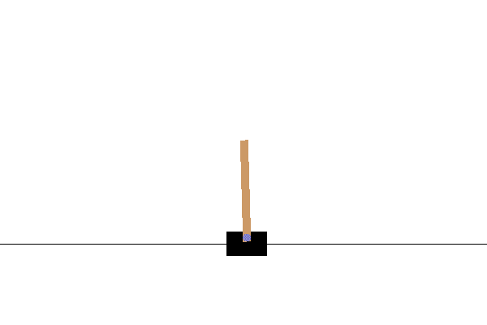

# CartPole Skating

Il problema che abbiamo risolto nella lezione precedente potrebbe sembrare un problema giocattolo, non realmente applicabile a scenari di vita reale. Non è così, perché molti problemi del mondo reale condividono questo scenario - incluso giocare a scacchi o Go. Sono simili, perché abbiamo anche una scacchiera con regole date e uno **stato discreto**.

## [Quiz Pre-lezione](https://gray-sand-07a10f403.1.azurestaticapps.net/quiz/47/)

## Introduzione

In questa lezione applicheremo gli stessi principi del Q-Learning a un problema con **stato continuo**, cioè uno stato che è dato da uno o più numeri reali. Ci occuperemo del seguente problema:

> **Problema**: Se Peter vuole scappare dal lupo, deve essere in grado di muoversi più velocemente. Vedremo come Peter può imparare a pattinare, in particolare, a mantenere l'equilibrio, usando il Q-Learning.


> Peter e i suoi amici diventano creativi per scappare dal lupo! Immagine di [Jen Looper](https://twitter.com/jenlooper)

Utilizzeremo una versione semplificata del mantenimento dell'equilibrio nota come problema **CartPole**. Nel mondo del cartpole, abbiamo uno slider orizzontale che può muoversi a sinistra o a destra, e l'obiettivo è mantenere in equilibrio un palo verticale sulla parte superiore dello slider.

## Prerequisiti

In questa lezione, utilizzeremo una libreria chiamata **OpenAI Gym** per simulare diversi **ambienti**. Puoi eseguire il codice di questa lezione localmente (ad esempio da Visual Studio Code), nel qual caso la simulazione si aprirà in una nuova finestra. Quando esegui il codice online, potresti dover apportare alcune modifiche al codice, come descritto [qui](https://towardsdatascience.com/rendering-openai-gym-envs-on-binder-and-google-colab-536f99391cc7).

## OpenAI Gym

Nella lezione precedente, le regole del gioco e lo stato erano dati dalla classe `Board` che abbiamo definito noi stessi. Qui utilizzeremo un **ambiente di simulazione** speciale, che simulerà la fisica dietro il palo in equilibrio. Uno degli ambienti di simulazione più popolari per l'addestramento degli algoritmi di apprendimento per rinforzo è chiamato [Gym](https://gym.openai.com/), che è mantenuto da [OpenAI](https://openai.com/). Utilizzando questo gym possiamo creare diversi **ambienti** da una simulazione di cartpole a giochi Atari.

> **Nota**: Puoi vedere altri ambienti disponibili da OpenAI Gym [qui](https://gym.openai.com/envs/#classic_control).

Prima, installiamo il gym e importiamo le librerie necessarie (blocco di codice 1):

```python
import sys
!{sys.executable} -m pip install gym 

import gym
import matplotlib.pyplot as plt
import numpy as np
import random
```

## Esercizio - inizializzare un ambiente cartpole

Per lavorare con un problema di equilibrio del cartpole, dobbiamo inizializzare l'ambiente corrispondente. Ogni ambiente è associato a:

- **Observation space** che definisce la struttura delle informazioni che riceviamo dall'ambiente. Per il problema del cartpole, riceviamo la posizione del palo, la velocità e altri valori.

- **Action space** che definisce le azioni possibili. Nel nostro caso lo spazio delle azioni è discreto e consiste in due azioni - **sinistra** e **destra**. (blocco di codice 2)

1. Per inizializzare, digita il seguente codice:

    ```python
    env = gym.make("CartPole-v1")
    print(env.action_space)
    print(env.observation_space)
    print(env.action_space.sample())
    ```

Per vedere come funziona l'ambiente, eseguiamo una breve simulazione per 100 passi. Ad ogni passo, forniamo una delle azioni da intraprendere - in questa simulazione selezioniamo casualmente un'azione da `action_space`.

1. Esegui il codice qui sotto e vedi a cosa porta.

    ✅ Ricorda che è preferibile eseguire questo codice su un'installazione locale di Python! (blocco di codice 3)

    ```python
    env.reset()
    
    for i in range(100):
       env.render()
       env.step(env.action_space.sample())
    env.close()
    ```

    Dovresti vedere qualcosa di simile a questa immagine:

    

1. Durante la simulazione, dobbiamo ottenere osservazioni per decidere come agire. Infatti, la funzione step restituisce le osservazioni attuali, una funzione di ricompensa e il flag done che indica se ha senso continuare la simulazione o meno: (blocco di codice 4)

    ```python
    env.reset()
    
    done = False
    while not done:
       env.render()
       obs, rew, done, info = env.step(env.action_space.sample())
       print(f"{obs} -> {rew}")
    env.close()
    ```

    Finirai per vedere qualcosa di simile a questo nell'output del notebook:

    ```text
    [ 0.03403272 -0.24301182  0.02669811  0.2895829 ] -> 1.0
    [ 0.02917248 -0.04828055  0.03248977  0.00543839] -> 1.0
    [ 0.02820687  0.14636075  0.03259854 -0.27681916] -> 1.0
    [ 0.03113408  0.34100283  0.02706215 -0.55904489] -> 1.0
    [ 0.03795414  0.53573468  0.01588125 -0.84308041] -> 1.0
    ...
    [ 0.17299878  0.15868546 -0.20754175 -0.55975453] -> 1.0
    [ 0.17617249  0.35602306 -0.21873684 -0.90998894] -> 1.0
    ```

    Il vettore di osservazione che viene restituito ad ogni passo della simulazione contiene i seguenti valori:
    - Posizione del carrello
    - Velocità del carrello
    - Angolo del palo
    - Velocità di rotazione del palo

1. Ottieni il valore minimo e massimo di questi numeri: (blocco di codice 5)

    ```python
    print(env.observation_space.low)
    print(env.observation_space.high)
    ```

    Potresti anche notare che il valore della ricompensa ad ogni passo della simulazione è sempre 1. Questo perché il nostro obiettivo è sopravvivere il più a lungo possibile, cioè mantenere il palo in una posizione ragionevolmente verticale per il periodo di tempo più lungo possibile.

    ✅ In effetti, la simulazione del CartPole è considerata risolta se riusciamo a ottenere una ricompensa media di 195 su 100 prove consecutive.

## Discretizzazione dello stato

Nel Q-Learning, dobbiamo costruire una Q-Table che definisca cosa fare in ogni stato. Per poter fare questo, lo stato deve essere **discreto**, più precisamente, deve contenere un numero finito di valori discreti. Pertanto, dobbiamo in qualche modo **discretizzare** le nostre osservazioni, mappandole su un insieme finito di stati.

Ci sono alcuni modi in cui possiamo farlo:

- **Dividere in bin**. Se conosciamo l'intervallo di un certo valore, possiamo dividere questo intervallo in un numero di **bin**, e poi sostituire il valore con il numero del bin a cui appartiene. Questo può essere fatto usando il metodo numpy [`digitize`](https://numpy.org/doc/stable/reference/generated/numpy.digitize.html). In questo caso, conosceremo esattamente la dimensione dello stato, perché dipenderà dal numero di bin che selezioniamo per la digitalizzazione.
  
✅ Possiamo usare l'interpolazione lineare per portare i valori a un intervallo finito (diciamo, da -20 a 20), e poi convertire i numeri in interi arrotondandoli. Questo ci dà un po' meno controllo sulla dimensione dello stato, soprattutto se non conosciamo gli intervalli esatti dei valori di input. Ad esempio, nel nostro caso 2 dei 4 valori non hanno limiti superiori/inferiori sui loro valori, il che può comportare un numero infinito di stati.

Nel nostro esempio, utilizzeremo il secondo approccio. Come potresti notare più avanti, nonostante i limiti superiori/inferiori indefiniti, quei valori raramente assumono valori al di fuori di certi intervalli finiti, quindi quegli stati con valori estremi saranno molto rari.

1. Ecco la funzione che prenderà l'osservazione dal nostro modello e produrrà una tupla di 4 valori interi: (blocco di codice 6)

    ```python
    def discretize(x):
        return tuple((x/np.array([0.25, 0.25, 0.01, 0.1])).astype(np.int))
    ```

1. Esploriamo anche un altro metodo di discretizzazione usando i bin: (blocco di codice 7)

    ```python
    def create_bins(i,num):
        return np.arange(num+1)*(i[1]-i[0])/num+i[0]
    
    print("Sample bins for interval (-5,5) with 10 bins\n",create_bins((-5,5),10))
    
    ints = [(-5,5),(-2,2),(-0.5,0.5),(-2,2)] # intervals of values for each parameter
    nbins = [20,20,10,10] # number of bins for each parameter
    bins = [create_bins(ints[i],nbins[i]) for i in range(4)]
    
    def discretize_bins(x):
        return tuple(np.digitize(x[i],bins[i]) for i in range(4))
    ```

1. Ora eseguiamo una breve simulazione e osserviamo quei valori discreti dell'ambiente. Sentiti libero di provare sia `discretize` and `discretize_bins` e vedere se c'è una differenza.

    ✅ discretize_bins restituisce il numero del bin, che è basato su 0. Quindi per i valori della variabile di input intorno a 0 restituisce il numero dal centro dell'intervallo (10). In discretize, non ci siamo preoccupati dell'intervallo dei valori di output, permettendo loro di essere negativi, quindi i valori dello stato non sono spostati, e 0 corrisponde a 0. (blocco di codice 8)

    ```python
    env.reset()
    
    done = False
    while not done:
       #env.render()
       obs, rew, done, info = env.step(env.action_space.sample())
       #print(discretize_bins(obs))
       print(discretize(obs))
    env.close()
    ```

    ✅ Decommenta la riga che inizia con env.render se vuoi vedere come l'ambiente viene eseguito. Altrimenti puoi eseguirlo in background, che è più veloce. Utilizzeremo questa esecuzione "invisibile" durante il nostro processo di Q-Learning.

## La struttura della Q-Table

Nella nostra lezione precedente, lo stato era una semplice coppia di numeri da 0 a 8, quindi era conveniente rappresentare la Q-Table con un tensore numpy con una forma di 8x8x2. Se usiamo la discretizzazione dei bin, la dimensione del nostro vettore di stato è anche conosciuta, quindi possiamo usare lo stesso approccio e rappresentare lo stato con un array di forma 20x20x10x10x2 (qui 2 è la dimensione dello spazio delle azioni, e le prime dimensioni corrispondono al numero di bin che abbiamo selezionato per ciascuno dei parametri nello spazio delle osservazioni).

Tuttavia, a volte le dimensioni precise dello spazio delle osservazioni non sono conosciute. Nel caso della funzione `discretize`, potremmo non essere mai sicuri che il nostro stato rimanga entro certi limiti, perché alcuni dei valori originali non sono limitati. Pertanto, utilizzeremo un approccio leggermente diverso e rappresenteremo la Q-Table con un dizionario.

1. Usa la coppia *(stato, azione)* come chiave del dizionario, e il valore corrisponderebbe al valore dell'entry della Q-Table. (blocco di codice 9)

    ```python
    Q = {}
    actions = (0,1)
    
    def qvalues(state):
        return [Q.get((state,a),0) for a in actions]
    ```

    Qui definiamo anche una funzione `qvalues()`, che restituisce una lista di valori della Q-Table per un dato stato che corrisponde a tutte le azioni possibili. Se l'entry non è presente nella Q-Table, restituiremo 0 come valore predefinito.

## Iniziamo il Q-Learning

Ora siamo pronti a insegnare a Peter a mantenere l'equilibrio!

1. Prima, impostiamo alcuni iperparametri: (blocco di codice 10)

    ```python
    # hyperparameters
    alpha = 0.3
    gamma = 0.9
    epsilon = 0.90
    ```

    Qui, `alpha` is the **learning rate** that defines to which extent we should adjust the current values of Q-Table at each step. In the previous lesson we started with 1, and then decreased `alpha` to lower values during training. In this example we will keep it constant just for simplicity, and you can experiment with adjusting `alpha` values later.

    `gamma` is the **discount factor** that shows to which extent we should prioritize future reward over current reward.

    `epsilon` is the **exploration/exploitation factor** that determines whether we should prefer exploration to exploitation or vice versa. In our algorithm, we will in `epsilon` percent of the cases select the next action according to Q-Table values, and in the remaining number of cases we will execute a random action. This will allow us to explore areas of the search space that we have never seen before. 

    ✅ In terms of balancing - choosing random action (exploration) would act as a random punch in the wrong direction, and the pole would have to learn how to recover the balance from those "mistakes"

### Improve the algorithm

We can also make two improvements to our algorithm from the previous lesson:

- **Calculate average cumulative reward**, over a number of simulations. We will print the progress each 5000 iterations, and we will average out our cumulative reward over that period of time. It means that if we get more than 195 point - we can consider the problem solved, with even higher quality than required.
  
- **Calculate maximum average cumulative result**, `Qmax`, and we will store the Q-Table corresponding to that result. When you run the training you will notice that sometimes the average cumulative result starts to drop, and we want to keep the values of Q-Table that correspond to the best model observed during training.

1. Collect all cumulative rewards at each simulation at `rewards` per ulteriori grafici. (blocco di codice 11)

    ```python
    def probs(v,eps=1e-4):
        v = v-v.min()+eps
        v = v/v.sum()
        return v
    
    Qmax = 0
    cum_rewards = []
    rewards = []
    for epoch in range(100000):
        obs = env.reset()
        done = False
        cum_reward=0
        # == do the simulation ==
        while not done:
            s = discretize(obs)
            if random.random()<epsilon:
                # exploitation - chose the action according to Q-Table probabilities
                v = probs(np.array(qvalues(s)))
                a = random.choices(actions,weights=v)[0]
            else:
                # exploration - randomly chose the action
                a = np.random.randint(env.action_space.n)
    
            obs, rew, done, info = env.step(a)
            cum_reward+=rew
            ns = discretize(obs)
            Q[(s,a)] = (1 - alpha) * Q.get((s,a),0) + alpha * (rew + gamma * max(qvalues(ns)))
        cum_rewards.append(cum_reward)
        rewards.append(cum_reward)
        # == Periodically print results and calculate average reward ==
        if epoch%5000==0:
            print(f"{epoch}: {np.average(cum_rewards)}, alpha={alpha}, epsilon={epsilon}")
            if np.average(cum_rewards) > Qmax:
                Qmax = np.average(cum_rewards)
                Qbest = Q
            cum_rewards=[]
    ```

Quello che potresti notare da questi risultati:

- **Vicino al nostro obiettivo**. Siamo molto vicini a raggiungere l'obiettivo di ottenere 195 ricompense cumulative su 100+ esecuzioni consecutive della simulazione, o potremmo averlo effettivamente raggiunto! Anche se otteniamo numeri più piccoli, non lo sappiamo ancora, perché facciamo una media su 5000 esecuzioni, e solo 100 esecuzioni sono richieste nei criteri formali.
  
- **La ricompensa inizia a diminuire**. A volte la ricompensa inizia a diminuire, il che significa che possiamo "distruggere" i valori già appresi nella Q-Table con quelli che peggiorano la situazione.

Questa osservazione è più chiaramente visibile se tracciamo il progresso dell'addestramento.

## Tracciare il progresso dell'addestramento

Durante l'addestramento, abbiamo raccolto il valore della ricompensa cumulativa a ciascuna delle iterazioni nel vettore `rewards`. Ecco come appare quando lo tracciamo contro il numero di iterazioni:

```python
plt.plot(rewards)
```


Da questo grafico, non è possibile dire nulla, perché a causa della natura del processo di addestramento stocastico la durata delle sessioni di addestramento varia notevolmente. Per dare più senso a questo grafico, possiamo calcolare la **media mobile** su una serie di esperimenti, diciamo 100. Questo può essere fatto comodamente usando `np.convolve`: (blocco di codice 12)

```python
def running_average(x,window):
    return np.convolve(x,np.ones(window)/window,mode='valid')

plt.plot(running_average(rewards,100))
```


## Variazione degli iperparametri

Per rendere l'apprendimento più stabile, ha senso regolare alcuni dei nostri iperparametri durante l'addestramento. In particolare:

- **Per il tasso di apprendimento**, `alpha`, we may start with values close to 1, and then keep decreasing the parameter. With time, we will be getting good probability values in the Q-Table, and thus we should be adjusting them slightly, and not overwriting completely with new values.

- **Increase epsilon**. We may want to increase the `epsilon` slowly, in order to explore less and exploit more. It probably makes sense to start with lower value of `epsilon`, e salire fino a quasi 1.

> **Compito 1**: Gioca con i valori degli iperparametri e vedi se riesci a ottenere una ricompensa cumulativa più alta. Stai ottenendo sopra 195?

> **Compito 2**: Per risolvere formalmente il problema, devi ottenere una ricompensa media di 195 su 100 esecuzioni consecutive. Misuralo durante l'addestramento e assicurati di aver risolto formalmente il problema!

## Vedere il risultato in azione

Sarebbe interessante vedere come si comporta il modello addestrato. Eseguiamo la simulazione e seguiamo la stessa strategia di selezione delle azioni durante l'addestramento, campionando secondo la distribuzione di probabilità nella Q-Table: (blocco di codice 13)

```python
obs = env.reset()
done = False
while not done:
   s = discretize(obs)
   env.render()
   v = probs(np.array(qvalues(s)))
   a = random.choices(actions,weights=v)[0]
   obs,_,done,_ = env.step(a)
env.close()
```

Dovresti vedere qualcosa di simile a questo:



---

## 🚀Sfida

> **Compito 3**: Qui, abbiamo utilizzato la copia finale della Q-Table, che potrebbe non essere la migliore. Ricorda che abbiamo memorizzato la Q-Table con le migliori prestazioni in `Qbest` variable! Try the same example with the best-performing Q-Table by copying `Qbest` over to `Q` and see if you notice the difference.

> **Task 4**: Here we were not selecting the best action on each step, but rather sampling with corresponding probability distribution. Would it make more sense to always select the best action, with the highest Q-Table value? This can be done by using `np.argmax` per trovare il numero dell'azione corrispondente al valore più alto della Q-Table. Implementa questa strategia e vedi se migliora l'equilibrio.

## [Quiz Post-lezione](https://gray-sand-07a10f403.1.azurestaticapps.net/quiz/48/)

## Compito
[Addestra una Mountain Car](assignment.md)

## Conclusione

Abbiamo ora imparato come addestrare agenti per ottenere buoni risultati semplicemente fornendo loro una funzione di ricompensa che definisce lo stato desiderato del gioco e dando loro l'opportunità di esplorare intelligentemente lo spazio di ricerca. Abbiamo applicato con successo l'algoritmo Q-Learning nei casi di ambienti discreti e continui, ma con azioni discrete.

È importante studiare anche situazioni in cui lo stato delle azioni è continuo e quando lo spazio delle osservazioni è molto più complesso, come l'immagine dello schermo di un gioco Atari. In questi problemi spesso dobbiamo usare tecniche di machine learning più potenti, come le reti neurali, per ottenere buoni risultati. Questi argomenti più avanzati sono l'oggetto del nostro prossimo corso avanzato di IA.

**Disclaimer**: 
Questo documento è stato tradotto utilizzando servizi di traduzione basati su intelligenza artificiale. Sebbene ci impegniamo per garantire l'accuratezza, si prega di essere consapevoli che le traduzioni automatiche possono contenere errori o inesattezze. Il documento originale nella sua lingua nativa dovrebbe essere considerato la fonte autorevole. Per informazioni critiche, si raccomanda una traduzione professionale umana. Non siamo responsabili per eventuali malintesi o interpretazioni errate derivanti dall'uso di questa traduzione.