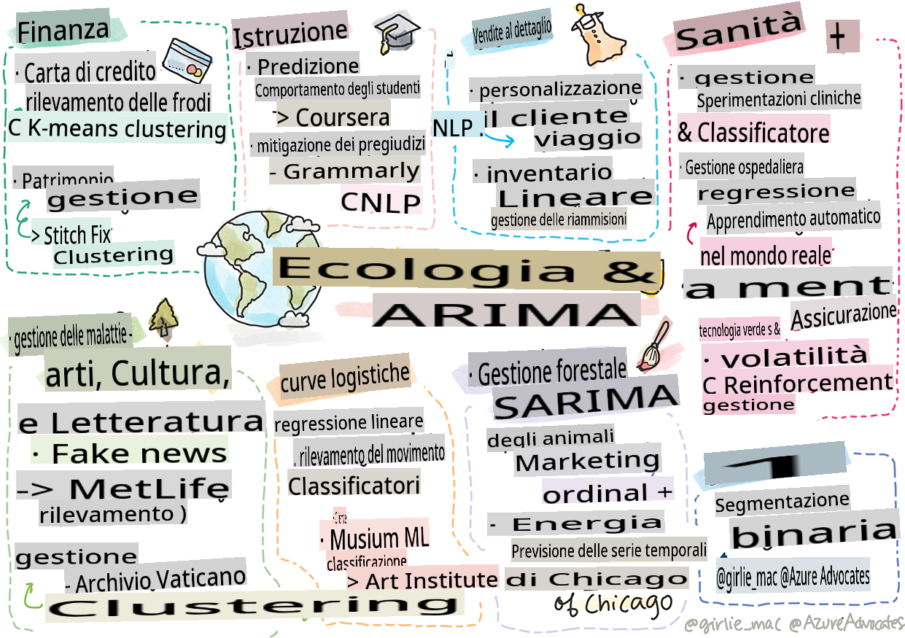

# Postscript: Machine learning nel mondo reale

> Sketchnote di [Tomomi Imura](https://www.twitter.com/girlie_mac)

In questo curriculum, hai imparato molti modi per preparare i dati per l'addestramento e creare modelli di machine learning. Hai costruito una serie di modelli classici di regressione, clustering, classificazione, elaborazione del linguaggio naturale e serie temporali. Congratulazioni! Ora, potresti chiederti a cosa serve tutto questo... quali sono le applicazioni reali di questi modelli?

Sebbene l'interesse dell'industria sia spesso rivolto all'AI, che di solito sfrutta il deep learning, ci sono ancora applicazioni preziose per i modelli classici di machine learning. Potresti persino usare alcune di queste applicazioni oggi stesso! In questa lezione, esplorerai come otto diversi settori e domini tematici utilizzano questi tipi di modelli per rendere le loro applicazioni più performanti, affidabili, intelligenti e preziose per gli utenti.

## [Quiz pre-lezione](https://gray-sand-07a10f403.1.azurestaticapps.net/quiz/49/)

## 💰 Finanza

Il settore finanziario offre molte opportunità per il machine learning. Molti problemi in quest'area possono essere modellati e risolti utilizzando il ML.

### Rilevamento delle frodi con carta di credito

Abbiamo imparato riguardo al [k-means clustering](../../5-Clustering/2-K-Means/README.md) in precedenza nel corso, ma come può essere utilizzato per risolvere problemi legati alle frodi con carta di credito?

Il k-means clustering è utile durante una tecnica di rilevamento delle frodi con carta di credito chiamata **rilevamento degli outlier**. Gli outlier, o deviazioni nelle osservazioni su un insieme di dati, possono dirci se una carta di credito viene utilizzata in modo normale o se sta accadendo qualcosa di insolito. Come mostrato nel documento collegato di seguito, puoi ordinare i dati delle carte di credito utilizzando un algoritmo di k-means clustering e assegnare ogni transazione a un cluster in base a quanto sembra essere un outlier. Poi, puoi valutare i cluster più rischiosi per distinguere tra transazioni fraudolente e legittime.
[Reference](https://citeseerx.ist.psu.edu/viewdoc/download?doi=10.1.1.680.1195&rep=rep1&type=pdf)

### Gestione della ricchezza

Nella gestione della ricchezza, un individuo o un'azienda gestisce investimenti per conto dei propri clienti. Il loro lavoro è sostenere e far crescere la ricchezza a lungo termine, quindi è essenziale scegliere investimenti che performano bene.

Un modo per valutare come un particolare investimento performa è attraverso la regressione statistica. La [regressione lineare](../../2-Regression/1-Tools/README.md) è uno strumento prezioso per capire come un fondo performa rispetto a un benchmark. Possiamo anche dedurre se i risultati della regressione sono statisticamente significativi o quanto influenzerebbero gli investimenti di un cliente. Puoi anche espandere ulteriormente la tua analisi utilizzando la regressione multipla, dove possono essere considerati ulteriori fattori di rischio. Per un esempio di come questo funzionerebbe per un fondo specifico, dai un'occhiata al documento di seguito sulla valutazione delle performance del fondo utilizzando la regressione.
[Reference](http://www.brightwoodventures.com/evaluating-fund-performance-using-regression/)

## 🎓 Educazione

Il settore educativo è anche un'area molto interessante dove il ML può essere applicato. Ci sono problemi interessanti da affrontare come rilevare il cheating nei test o nei saggi o gestire il bias, intenzionale o meno, nel processo di correzione.

### Prevedere il comportamento degli studenti

[Coursera](https://coursera.com), un provider di corsi online aperti, ha un ottimo blog tecnico dove discutono molte decisioni ingegneristiche. In questo caso di studio, hanno tracciato una linea di regressione per cercare di esplorare una correlazione tra un basso punteggio NPS (Net Promoter Score) e la ritenzione o l'abbandono del corso.
[Reference](https://medium.com/coursera-engineering/controlled-regression-quantifying-the-impact-of-course-quality-on-learner-retention-31f956bd592a)

### Mitigare il bias

[Grammarly](https://grammarly.com), un assistente alla scrittura che controlla errori di ortografia e grammatica, utilizza sofisticati [sistemi di elaborazione del linguaggio naturale](../../6-NLP/README.md) nei suoi prodotti. Hanno pubblicato un interessante caso di studio nel loro blog tecnico su come hanno affrontato il bias di genere nel machine learning, di cui hai appreso nella nostra [lezione introduttiva sull'equità](../../1-Introduction/3-fairness/README.md).
[Reference](https://www.grammarly.com/blog/engineering/mitigating-gender-bias-in-autocorrect/)

## 👜 Retail

Il settore retail può sicuramente beneficiare dell'uso del ML, con tutto, dalla creazione di un miglior percorso cliente alla gestione ottimale dell'inventario.

### Personalizzare il percorso cliente

A Wayfair, un'azienda che vende articoli per la casa come mobili, aiutare i clienti a trovare i prodotti giusti per i loro gusti e bisogni è fondamentale. In questo articolo, gli ingegneri dell'azienda descrivono come utilizzano il ML e l'NLP per "far emergere i risultati giusti per i clienti". In particolare, il loro Query Intent Engine è stato costruito per utilizzare l'estrazione di entità, l'addestramento di classificatori, l'estrazione di risorse e opinioni e il tagging dei sentimenti nelle recensioni dei clienti. Questo è un classico caso d'uso di come l'NLP funziona nel retail online.
[Reference](https://www.aboutwayfair.com/tech-innovation/how-we-use-machine-learning-and-natural-language-processing-to-empower-search)

### Gestione dell'inventario

Aziende innovative e agili come [StitchFix](https://stitchfix.com), un servizio di box che spedisce abbigliamento ai consumatori, si affidano fortemente al ML per le raccomandazioni e la gestione dell'inventario. I loro team di styling lavorano insieme ai loro team di merchandising, infatti: "uno dei nostri data scientist ha sperimentato con un algoritmo genetico e lo ha applicato all'abbigliamento per prevedere quale sarebbe stato un capo di successo che non esiste oggi. Abbiamo portato questo al team di merchandising e ora possono usarlo come strumento."
[Reference](https://www.zdnet.com/article/how-stitch-fix-uses-machine-learning-to-master-the-science-of-styling/)

## 🏥 Sanità

Il settore sanitario può sfruttare il ML per ottimizzare le attività di ricerca e anche problemi logistici come la riammissione dei pazienti o la prevenzione della diffusione delle malattie.

### Gestione delle sperimentazioni cliniche

La tossicità nelle sperimentazioni cliniche è una preoccupazione importante per i produttori di farmaci. Quanto è tollerabile la tossicità? In questo studio, l'analisi di vari metodi di sperimentazione clinica ha portato allo sviluppo di un nuovo approccio per prevedere le probabilità di esiti delle sperimentazioni cliniche. In particolare, sono stati in grado di utilizzare la foresta casuale per produrre un [classificatore](../../4-Classification/README.md) in grado di distinguere tra gruppi di farmaci.
[Reference](https://www.sciencedirect.com/science/article/pii/S2451945616302914)

### Gestione della riammissione ospedaliera

L'assistenza ospedaliera è costosa, specialmente quando i pazienti devono essere riammessi. Questo documento discute di un'azienda che utilizza il ML per prevedere il potenziale di riammissione utilizzando algoritmi di [clustering](../../5-Clustering/README.md). Questi cluster aiutano gli analisti a "scoprire gruppi di riammissioni che possono condividere una causa comune".
[Reference](https://healthmanagement.org/c/healthmanagement/issuearticle/hospital-readmissions-and-machine-learning)

### Gestione delle malattie

La recente pandemia ha messo in luce i modi in cui il machine learning può aiutare a fermare la diffusione delle malattie. In questo articolo, riconoscerai l'uso di ARIMA, curve logistiche, regressione lineare e SARIMA. "Questo lavoro è un tentativo di calcolare il tasso di diffusione di questo virus e quindi di prevedere i decessi, le guarigioni e i casi confermati, in modo che possa aiutarci a prepararci meglio e sopravvivere."
[Reference](https://www.ncbi.nlm.nih.gov/pmc/articles/PMC7979218/)

## 🌲 Ecologia e tecnologia verde

La natura e l'ecologia consistono in molti sistemi sensibili dove l'interazione tra animali e natura è al centro dell'attenzione. È importante essere in grado di misurare accuratamente questi sistemi e agire in modo appropriato se succede qualcosa, come un incendio boschivo o una diminuzione della popolazione animale.

### Gestione delle foreste

Hai imparato riguardo al [Reinforcement Learning](../../8-Reinforcement/README.md) nelle lezioni precedenti. Può essere molto utile quando si cerca di prevedere i modelli in natura. In particolare, può essere utilizzato per monitorare problemi ecologici come gli incendi boschivi e la diffusione di specie invasive. In Canada, un gruppo di ricercatori ha utilizzato il Reinforcement Learning per costruire modelli di dinamiche degli incendi boschivi a partire dalle immagini satellitari. Utilizzando un innovativo "processo di diffusione spaziale (SSP)", hanno immaginato un incendio boschivo come "l'agente in qualsiasi cella nel paesaggio." "Il set di azioni che il fuoco può intraprendere da una posizione in qualsiasi momento include la diffusione verso nord, sud, est o ovest o non diffondersi.

Questo approccio inverte la configurazione usuale del RL poiché le dinamiche del corrispondente Markov Decision Process (MDP) sono una funzione nota per la diffusione immediata degli incendi." Leggi di più sugli algoritmi classici utilizzati da questo gruppo al link di seguito.
[Reference](https://www.frontiersin.org/articles/10.3389/fict.2018.00006/full)

### Rilevamento del movimento degli animali

Sebbene il deep learning abbia creato una rivoluzione nel monitoraggio visivo dei movimenti degli animali (puoi costruire il tuo [tracciatore di orsi polari](https://docs.microsoft.com/learn/modules/build-ml-model-with-azure-stream-analytics/?WT.mc_id=academic-77952-leestott) qui), il ML classico ha ancora un ruolo in questo compito.

I sensori per monitorare i movimenti degli animali da fattoria e l'IoT fanno uso di questo tipo di elaborazione visiva, ma le tecniche di ML più basilari sono utili per preprocessare i dati. Ad esempio, in questo documento, le posture delle pecore sono state monitorate e analizzate utilizzando vari algoritmi di classificazione. Potresti riconoscere la curva ROC a pagina 335.
[Reference](https://druckhaus-hofmann.de/gallery/31-wj-feb-2020.pdf)

### ⚡️ Gestione dell'energia

Nelle nostre lezioni sulla [previsione delle serie temporali](../../7-TimeSeries/README.md), abbiamo introdotto il concetto di parchimetri intelligenti per generare entrate per una città basandosi sulla comprensione della domanda e dell'offerta. Questo articolo discute in dettaglio come clustering, regressione e previsione delle serie temporali si combinano per aiutare a prevedere l'uso futuro dell'energia in Irlanda, basandosi sui misuratori intelligenti.
[Reference](https://www-cdn.knime.com/sites/default/files/inline-images/knime_bigdata_energy_timeseries_whitepaper.pdf)

## 💼 Assicurazioni

Il settore assicurativo è un altro settore che utilizza il ML per costruire e ottimizzare modelli finanziari e attuariali validi.

### Gestione della volatilità

MetLife, un fornitore di assicurazioni sulla vita, è trasparente nel modo in cui analizza e mitiga la volatilità nei suoi modelli finanziari. In questo articolo noterai visualizzazioni di classificazione binaria e ordinale. Scoprirai anche visualizzazioni di previsione.
[Reference](https://investments.metlife.com/content/dam/metlifecom/us/investments/insights/research-topics/macro-strategy/pdf/MetLifeInvestmentManagement_MachineLearnedRanking_070920.pdf)

## 🎨 Arti, cultura e letteratura

Nelle arti, ad esempio nel giornalismo, ci sono molti problemi interessanti. Rilevare le fake news è un enorme problema poiché è stato dimostrato che influenzano l'opinione delle persone e persino rovesciano le democrazie. Anche i musei possono beneficiare dell'uso del ML in tutto, dal trovare collegamenti tra artefatti alla pianificazione delle risorse.

### Rilevamento delle fake news

Rilevare le fake news è diventato un gioco del gatto e del topo nei media di oggi. In questo articolo, i ricercatori suggeriscono che un sistema che combina diverse tecniche di ML che abbiamo studiato può essere testato e il miglior modello implementato: "Questo sistema si basa sull'elaborazione del linguaggio naturale per estrarre caratteristiche dai dati e poi queste caratteristiche vengono utilizzate per l'addestramento di classificatori di machine learning come Naive Bayes, Support Vector Machine (SVM), Random Forest (RF), Stochastic Gradient Descent (SGD) e Logistic Regression (LR)."
[Reference](https://www.irjet.net/archives/V7/i6/IRJET-V7I6688.pdf)

Questo articolo mostra come combinare diversi domini di ML può produrre risultati interessanti che possono aiutare a fermare la diffusione delle fake news e creare danni reali; in questo caso, l'impulso è stato la diffusione di voci sui trattamenti COVID che hanno incitato la violenza di massa.

### ML nei musei

I musei sono all'avanguardia di una rivoluzione AI in cui catalogare e digitalizzare collezioni e trovare collegamenti tra artefatti sta diventando più facile man mano che la tecnologia avanza. Progetti come [In Codice Ratio](https://www.sciencedirect.com/science/article/abs/pii/S0306457321001035#:~:text=1.,studies%20over%20large%20historical%20sources.) stanno aiutando a svelare i misteri delle collezioni inaccessibili come gli Archivi Vaticani. Ma anche l'aspetto commerciale dei musei beneficia dei modelli di ML.

Ad esempio, l'Art Institute di Chicago ha costruito modelli per prevedere cosa interessa al pubblico e quando parteciperà alle esposizioni. L'obiettivo è creare esperienze di visita individualizzate e ottimizzate ogni volta che l'utente visita il museo. "Durante l'anno fiscale 2017, il modello ha previsto la partecipazione e le entrate con una precisione dell'1 percento, dice Andrew Simnick, vicepresidente senior all'Art Institute."
[Reference](https://www.chicagobusiness.com/article/20180518/ISSUE01/180519840/art-institute-of-chicago-uses-data-to-make-exhibit-choices)

## 🏷 Marketing

### Segmentazione dei clienti

Le strategie di marketing più efficaci mirano ai clienti in modi diversi basati su vari raggruppamenti. In questo articolo, vengono discussi gli usi degli algoritmi di Clustering per supportare il marketing differenziato. Il marketing differenziato aiuta le aziende a migliorare il riconoscimento del marchio, raggiungere più clienti e guadagnare di più.
[Reference](https://ai.inqline.com/machine-learning-for-marketing-customer-segmentation/)

## 🚀 Sfida

Identificare un altro settore che beneficia di alcune delle tecniche che hai appreso in questo curriculum e scoprire come utilizza il ML.

## [Quiz post-lezione](https://gray-sand-07a10f403.1.azurestaticapps.net/quiz/50/)

## Revisione & Autoapprendimento

Il team di data science di Wayfair ha diversi video interessanti su come utilizzano il ML nella loro azienda. Vale la pena [dare un'occhiata](https://www.youtube.com/channel/UCe2PjkQXqOuwkW1gw6Ameuw/videos)!

## Compito

[Una caccia al tesoro di ML](assignment.md)

**Disclaimer**:
Questo documento è stato tradotto utilizzando servizi di traduzione automatica basati su intelligenza artificiale. Sebbene ci impegniamo per l'accuratezza, si prega di essere consapevoli che le traduzioni automatiche possono contenere errori o imprecisioni. Il documento originale nella sua lingua nativa dovrebbe essere considerato la fonte autorevole. Per informazioni critiche, si raccomanda una traduzione professionale umana. Non siamo responsabili per eventuali malintesi o interpretazioni errate derivanti dall'uso di questa traduzione.