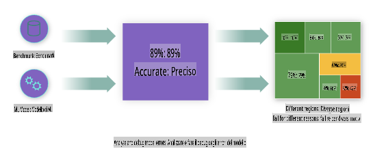
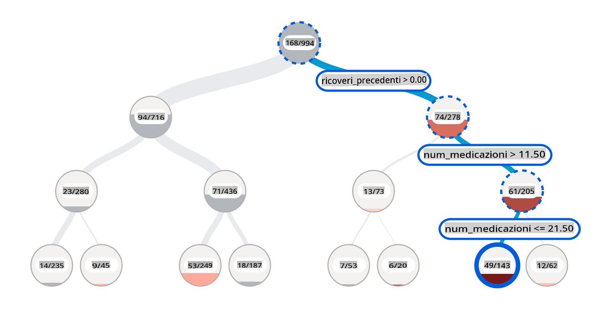
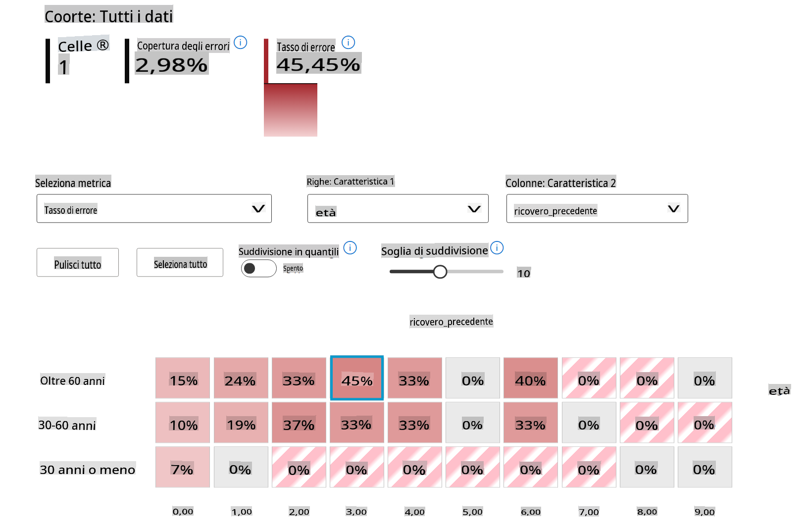
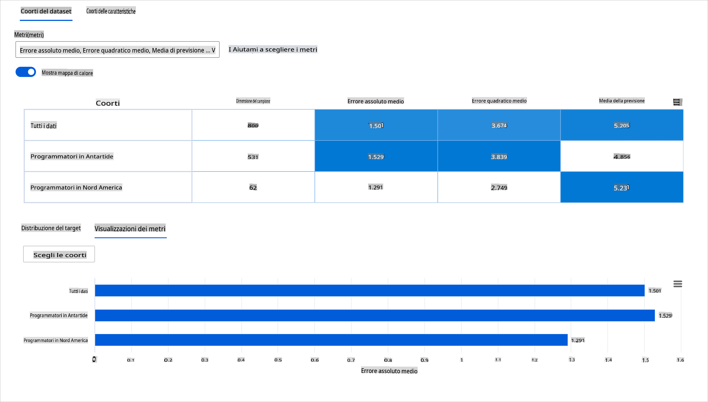
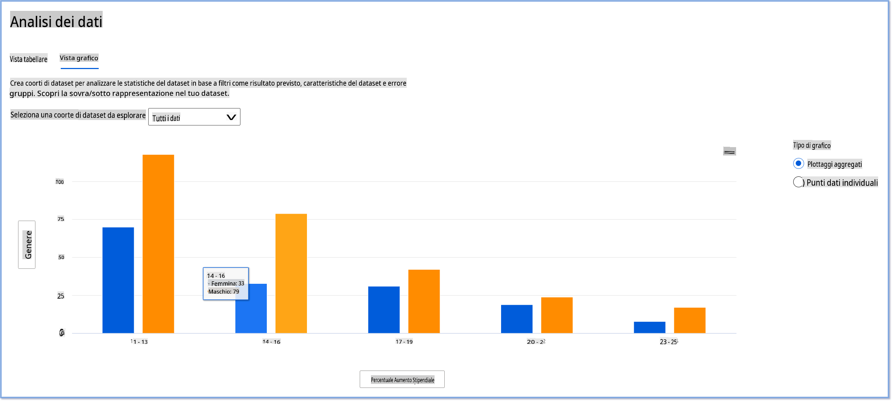
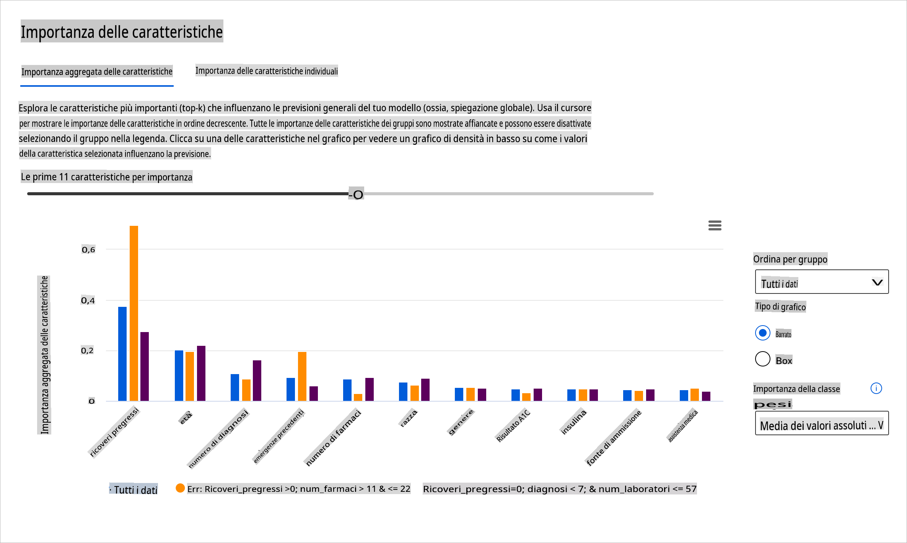
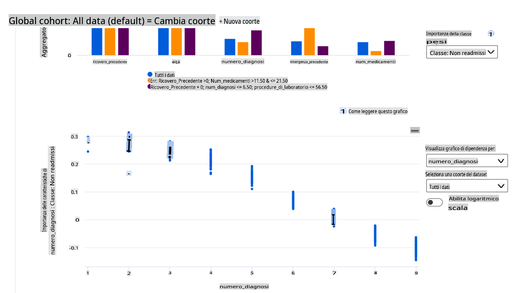

# Postscript: Debugging dei Modelli di Machine Learning utilizzando i componenti della dashboard Responsible AI

## [Quiz pre-lezione](https://gray-sand-07a10f403.1.azurestaticapps.net/quiz/5/)

## Introduzione

Il machine learning ha un impatto significativo sulle nostre vite quotidiane. L'AI sta trovando spazio in alcuni dei sistemi più importanti che ci riguardano come individui e come società, dalla sanità, alla finanza, all'istruzione e all'occupazione. Ad esempio, sistemi e modelli sono coinvolti nelle decisioni quotidiane, come diagnosi sanitarie o rilevamento delle frodi. Di conseguenza, i progressi dell'AI e la sua adozione accelerata sono accompagnati da aspettative sociali in evoluzione e da una crescente regolamentazione. Continuamente vediamo aree in cui i sistemi di AI non soddisfano le aspettative; espongono nuove sfide; e i governi stanno iniziando a regolare le soluzioni AI. Pertanto, è importante che questi modelli siano analizzati per garantire risultati equi, affidabili, inclusivi, trasparenti e responsabili per tutti.

In questo curriculum, esamineremo strumenti pratici che possono essere utilizzati per valutare se un modello presenta problemi di AI responsabile. Le tecniche tradizionali di debugging del machine learning tendono a basarsi su calcoli quantitativi come l'accuratezza aggregata o la perdita media dell'errore. Immagina cosa può succedere quando i dati che stai usando per costruire questi modelli mancano di determinate demografie, come razza, genere, visione politica, religione, o rappresentano in modo sproporzionato tali demografie. Cosa succede quando l'output del modello è interpretato per favorire una certa demografia? Questo può introdurre una sovra o sotto rappresentazione di questi gruppi di caratteristiche sensibili, risultando in problemi di equità, inclusività o affidabilità del modello. Un altro fattore è che i modelli di machine learning sono considerati scatole nere, il che rende difficile comprendere e spiegare cosa guida le predizioni di un modello. Tutte queste sono sfide che i data scientist e gli sviluppatori di AI affrontano quando non dispongono di strumenti adeguati per eseguire il debug e valutare l'equità o l'affidabilità di un modello.

In questa lezione, imparerai a fare il debug dei tuoi modelli utilizzando:

- **Analisi degli Errori**: identificare dove nella distribuzione dei dati il modello ha alti tassi di errore.
- **Panoramica del Modello**: eseguire un'analisi comparativa tra diversi gruppi di dati per scoprire disparità nelle metriche di performance del modello.
- **Analisi dei Dati**: investigare dove potrebbe esserci una sovra o sotto rappresentazione dei tuoi dati che può distorcere il modello a favore di una demografia rispetto a un'altra.
- **Importanza delle Caratteristiche**: comprendere quali caratteristiche stanno guidando le predizioni del modello a livello globale o locale.

## Prerequisito

Come prerequisito, ti invitiamo a rivedere [Strumenti di AI responsabile per sviluppatori](https://www.microsoft.com/ai/ai-lab-responsible-ai-dashboard)

> 

## Analisi degli Errori

Le metriche di performance tradizionali utilizzate per misurare l'accuratezza dei modelli sono per lo più calcoli basati su predizioni corrette vs incorrette. Ad esempio, determinare che un modello è accurato l'89% delle volte con una perdita di errore di 0.001 può essere considerato una buona performance. Gli errori spesso non sono distribuiti uniformemente nel tuo dataset sottostante. Puoi ottenere un punteggio di accuratezza del modello dell'89% ma scoprire che ci sono diverse regioni dei tuoi dati per cui il modello fallisce il 42% delle volte. La conseguenza di questi schemi di fallimento con certi gruppi di dati può portare a problemi di equità o affidabilità. È essenziale comprendere le aree in cui il modello sta performando bene o meno. Le regioni di dati dove ci sono un alto numero di imprecisioni nel tuo modello potrebbero rivelarsi un'importante demografia di dati.

Il componente di Analisi degli Errori sulla dashboard RAI illustra come il fallimento del modello è distribuito tra vari gruppi con una visualizzazione ad albero. Questo è utile per identificare caratteristiche o aree dove c'è un alto tasso di errore nel tuo dataset. Vedendo da dove provengono la maggior parte delle imprecisioni del modello, puoi iniziare a investigare la causa principale. Puoi anche creare gruppi di dati per eseguire analisi. Questi gruppi di dati aiutano nel processo di debugging per determinare perché la performance del modello è buona in un gruppo, ma errata in un altro.

Gli indicatori visivi sulla mappa ad albero aiutano a localizzare più velocemente le aree problematiche. Ad esempio, più scura è la tonalità di rosso di un nodo dell'albero, più alto è il tasso di errore.

La mappa di calore è un'altra funzionalità di visualizzazione che gli utenti possono utilizzare per investigare il tasso di errore utilizzando una o due caratteristiche per trovare un contributore agli errori del modello su un intero dataset o gruppi.

Usa l'analisi degli errori quando hai bisogno di:

* Ottenere una comprensione profonda di come i fallimenti del modello sono distribuiti su un dataset e attraverso diverse dimensioni di input e caratteristiche.
* Scomporre le metriche di performance aggregate per scoprire automaticamente gruppi di dati errati per informare i tuoi passi di mitigazione mirati.

## Panoramica del Modello

Valutare la performance di un modello di machine learning richiede una comprensione olistica del suo comportamento. Questo può essere ottenuto esaminando più di una metrica come il tasso di errore, l'accuratezza, il richiamo, la precisione o MAE (Mean Absolute Error) per trovare disparità tra le metriche di performance. Una metrica di performance può sembrare ottima, ma le imprecisioni possono emergere in un'altra metrica. Inoltre, confrontare le metriche per disparità su tutto il dataset o gruppi aiuta a far luce su dove il modello sta performando bene o meno. Questo è particolarmente importante nel vedere la performance del modello tra caratteristiche sensibili vs insensibili (ad esempio, razza del paziente, genere o età) per scoprire potenziali ingiustizie che il modello potrebbe avere. Ad esempio, scoprire che il modello è più errato in un gruppo che ha caratteristiche sensibili può rivelare potenziali ingiustizie che il modello potrebbe avere.

Il componente Panoramica del Modello della dashboard RAI aiuta non solo ad analizzare le metriche di performance della rappresentazione dei dati in un gruppo, ma dà agli utenti la possibilità di confrontare il comportamento del modello tra diversi gruppi.

La funzionalità di analisi basata sulle caratteristiche del componente permette agli utenti di restringere i sottogruppi di dati all'interno di una particolare caratteristica per identificare anomalie a un livello granulare. Ad esempio, la dashboard ha un'intelligenza integrata per generare automaticamente gruppi per una caratteristica selezionata dall'utente (ad es., *"time_in_hospital < 3"* o *"time_in_hospital >= 7"*). Questo permette a un utente di isolare una particolare caratteristica da un gruppo di dati più grande per vedere se è un influenzatore chiave degli esiti errati del modello.

Il componente Panoramica del Modello supporta due classi di metriche di disparità:

**Disparità nella performance del modello**: Questi set di metriche calcolano la disparità (differenza) nei valori della metrica di performance selezionata tra i sottogruppi di dati. Ecco alcuni esempi:

* Disparità nel tasso di accuratezza
* Disparità nel tasso di errore
* Disparità nella precisione
* Disparità nel richiamo
* Disparità nell'errore assoluto medio (MAE)

**Disparità nel tasso di selezione**: Questa metrica contiene la differenza nel tasso di selezione (predizione favorevole) tra i sottogruppi. Un esempio di questo è la disparità nei tassi di approvazione dei prestiti. Il tasso di selezione significa la frazione di punti dati in ogni classe classificata come 1 (nella classificazione binaria) o la distribuzione dei valori di predizione (nella regressione).

## Analisi dei Dati

> "Se torturi i dati abbastanza a lungo, confesseranno qualsiasi cosa" - Ronald Coase

Questa affermazione suona estrema, ma è vero che i dati possono essere manipolati per supportare qualsiasi conclusione. Tale manipolazione può talvolta avvenire in modo non intenzionale. Come esseri umani, tutti abbiamo pregiudizi, ed è spesso difficile sapere consapevolmente quando stai introducendo pregiudizi nei dati. Garantire l'equità nell'AI e nel machine learning rimane una sfida complessa.

I dati sono un enorme punto cieco per le metriche di performance tradizionali dei modelli. Puoi avere alti punteggi di accuratezza, ma questo non riflette sempre il pregiudizio sottostante che potrebbe essere nel tuo dataset. Ad esempio, se un dataset di dipendenti ha il 27% di donne in posizioni dirigenziali in un'azienda e il 73% di uomini allo stesso livello, un modello di pubblicità per il lavoro addestrato su questi dati potrebbe mirare principalmente a un pubblico maschile per posizioni di alto livello. Avere questo squilibrio nei dati ha distorto la predizione del modello a favore di un genere. Questo rivela un problema di equità dove c'è un pregiudizio di genere nel modello di AI.

Il componente Analisi dei Dati sulla dashboard RAI aiuta a identificare aree dove c'è una sovra- e sotto-rappresentazione nel dataset. Aiuta gli utenti a diagnosticare la causa principale degli errori e dei problemi di equità introdotti da squilibri nei dati o dalla mancanza di rappresentazione di un particolare gruppo di dati. Questo dà agli utenti la possibilità di visualizzare i dataset in base agli esiti predetti e reali, ai gruppi di errori e alle caratteristiche specifiche. A volte scoprire un gruppo di dati sottorappresentato può anche rivelare che il modello non sta imparando bene, quindi le alte imprecisioni. Avere un modello che ha pregiudizi nei dati non è solo un problema di equità, ma mostra che il modello non è inclusivo o affidabile.

Usa l'analisi dei dati quando hai bisogno di:

* Esplorare le statistiche del tuo dataset selezionando diversi filtri per suddividere i tuoi dati in diverse dimensioni (anche conosciute come gruppi).
* Comprendere la distribuzione del tuo dataset tra diversi gruppi e caratteristiche.
* Determinare se le tue scoperte relative all'equità, all'analisi degli errori e alla causalità (derivate da altri componenti della dashboard) sono il risultato della distribuzione del tuo dataset.
* Decidere in quali aree raccogliere più dati per mitigare gli errori che derivano da problemi di rappresentazione, rumore nelle etichette, rumore nelle caratteristiche, pregiudizi nelle etichette e fattori simili.

## Interpretabilità del Modello

I modelli di machine learning tendono a essere scatole nere. Comprendere quali caratteristiche chiave dei dati guidano la predizione di un modello può essere una sfida. È importante fornire trasparenza sul perché un modello fa una certa predizione. Ad esempio, se un sistema di AI predice che un paziente diabetico è a rischio di essere ricoverato di nuovo in ospedale entro 30 giorni, dovrebbe essere in grado di fornire dati di supporto che hanno portato alla sua predizione. Avere indicatori di dati di supporto porta trasparenza per aiutare i clinici o gli ospedali a prendere decisioni ben informate. Inoltre, essere in grado di spiegare perché un modello ha fatto una predizione per un singolo paziente permette di rispettare le normative sanitarie. Quando usi modelli di machine learning in modi che influenzano la vita delle persone, è cruciale comprendere e spiegare cosa influenza il comportamento di un modello. L'interpretabilità e la spiegabilità del modello aiutano a rispondere a domande in scenari come:

* Debug del modello: Perché il mio modello ha commesso questo errore? Come posso migliorare il mio modello?
* Collaborazione uomo-AI: Come posso comprendere e fidarmi delle decisioni del modello?
* Conformità normativa: Il mio modello soddisfa i requisiti legali?

Il componente Importanza delle Caratteristiche della dashboard RAI ti aiuta a fare il debug e ottenere una comprensione completa di come un modello fa le predizioni. È anche uno strumento utile per i professionisti del machine learning e i decisori per spiegare e mostrare evidenze delle caratteristiche che influenzano il comportamento del modello per la conformità normativa. Successivamente, gli utenti possono esplorare spiegazioni sia globali che locali per validare quali caratteristiche guidano la predizione di un modello. Le spiegazioni globali elencano le principali caratteristiche che hanno influenzato la predizione complessiva del modello. Le spiegazioni locali mostrano quali caratteristiche hanno portato alla predizione di un modello per un singolo caso. La possibilità di valutare spiegazioni locali è anche utile nel fare il debug o nell'audit di un caso specifico per comprendere e interpretare meglio perché un modello ha fatto una predizione accurata o inaccurata.

* Spiegazioni globali: Ad esempio, quali caratteristiche influenzano il comportamento complessivo di un modello di riammissione ospedaliera per il diabete?
* Spiegazioni locali: Ad esempio, perché un paziente diabetico di età superiore a 60 anni con precedenti ricoveri è stato predetto di essere ricoverato o non ricoverato entro 30 giorni?

Nel processo di debug dell'esaminare la performance di un modello tra diversi gruppi, l'Importanza delle Caratteristiche mostra quale livello di impatto ha una caratteristica tra i gruppi. Aiuta a rivelare anomalie quando si confronta il livello di influenza che la caratteristica ha nel guidare le predizioni errate di un modello. Il componente Importanza delle Caratteristiche può mostrare quali valori in una caratteristica hanno influenzato positivamente o negativamente l'esito del modello. Ad esempio, se un modello ha fatto una predizione inaccurata, il componente ti dà la possibilità di approfondire e individuare quali caratteristiche o valori di caratteristiche hanno guidato la predizione. Questo livello di dettaglio aiuta non solo nel fare il debug ma fornisce trasparenza e responsabilità in situazioni di audit. Infine, il componente può aiutarti a identificare problemi di equità. Per illustrare, se una caratteristica sensibile come l'etnia o il genere è altamente influente nel guidare la predizione di un modello, questo potrebbe essere un segno di pregiudizio razziale o di genere nel modello.

Usa l'interpretabilità quando hai bisogno di:

* Determinare quanto siano affidabili le predizioni del tuo sistema AI comprendendo quali caratteristiche sono più importanti per le predizioni.
* Approcciare il debug del tuo modello comprendendolo prima e identificando se il modello sta usando caratteristiche sane o solo false correlazioni.
* Scoprire potenziali fonti di ingiustizia comprendendo se il modello sta basando le predizioni su caratteristiche sensibili o su caratteristiche altamente correlate con esse.
* Costruire fiducia nelle decisioni del tuo modello generando spiegazioni locali per illustrare i loro esiti.
* Completare un audit normativo di un sistema AI per validare i modelli e monitorare l'impatto delle decisioni del modello sugli esseri umani.

## Conclusione

Tutti i componenti della dashboard RAI sono strumenti pratici per aiutarti a costruire modelli di machine learning che siano meno dannosi e più affidabili per la società. Migliora la prevenzione delle minacce ai diritti umani; discriminare o escludere certi gruppi dalle opportunità di vita; e il rischio di lesioni fisiche o psicologiche. Aiuta anche a costruire fiducia nelle decisioni del tuo modello generando spiegazioni locali per illustrare i loro esiti. Alcuni dei potenziali danni possono essere classificati come:

- **Allocazione**, se ad esempio un genere o un'etnia è favorita rispetto a un'altra.
- **Qualità del servizio**. Se addestri i dati per uno scenario specifico ma la realtà è molto più complessa, porta a un servizio di scarsa qualità.
- **Stereotipi**. Associare un dato gruppo a attributi preassegnati.
- **Denigrazione**. Criticare ingiustamente e etichettare qualcosa o qualcuno.
- **Sovra o sotto rappresentazione**. L'idea è che un certo gruppo non è visto in una certa professione, e qualsiasi servizio o funzione che continua a promuovere ciò sta contribuendo al danno.

### Dashboard Azure RAI

[Dashboard Azure RAI](https://learn.microsoft.com/en-us/azure/machine-learning/concept-responsible-ai-dashboard?WT.mc_id=aiml-90525-ruyakubu) è costruita su strumenti open-source sviluppati dalle principali istituzioni accademiche e organizzazioni, inclusa Microsoft, ed è fondamentale per i data scientist e gli

**Disclaimer**:
Questo documento è stato tradotto utilizzando servizi di traduzione automatizzati basati su AI. Sebbene ci impegniamo per l'accuratezza, si prega di essere consapevoli che le traduzioni automatizzate possono contenere errori o imprecisioni. Il documento originale nella sua lingua nativa dovrebbe essere considerato la fonte autorevole. Per informazioni critiche, si raccomanda una traduzione professionale umana. Non siamo responsabili per eventuali malintesi o interpretazioni errate derivanti dall'uso di questa traduzione.