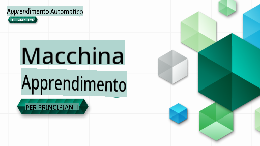

# Machine Learning for Beginners - Un Curriculum

> 🌍 Viaggia per il mondo mentre esploriamo il Machine Learning attraverso le culture del mondo 🌍

Gli Advocates di Microsoft sono lieti di offrire un curriculum di 12 settimane e 26 lezioni tutto dedicato al **Machine Learning**. In questo curriculum, imparerai ciò che a volte viene chiamato **machine learning classico**, utilizzando principalmente la libreria Scikit-learn ed evitando il deep learning, che è trattato nel nostro [curriculum AI for Beginners](https://aka.ms/ai4beginners). Abbina queste lezioni al nostro curriculum ['Data Science for Beginners'](https://aka.ms/ds4beginners)!

Viaggia con noi per il mondo mentre applichiamo queste tecniche classiche ai dati di molte aree del mondo. Ogni lezione include quiz pre e post lezione, istruzioni scritte per completare la lezione, una soluzione, un compito e altro ancora. La nostra pedagogia basata su progetti ti permette di imparare costruendo, un metodo provato per far sì che le nuove competenze restino impresse.

**✍️ Un grande grazie ai nostri autori** Jen Looper, Stephen Howell, Francesca Lazzeri, Tomomi Imura, Cassie Breviu, Dmitry Soshnikov, Chris Noring, Anirban Mukherjee, Ornella Altunyan, Ruth Yakubu e Amy Boyd

**🎨 Grazie anche ai nostri illustratori** Tomomi Imura, Dasani Madipalli e Jen Looper

**🙏 Un ringraziamento speciale 🙏 ai nostri autori, revisori e contributori di contenuti Microsoft Student Ambassador**, in particolare Rishit Dagli, Muhammad Sakib Khan Inan, Rohan Raj, Alexandru Petrescu, Abhishek Jaiswal, Nawrin Tabassum, Ioan Samuila e Snigdha Agarwal

**🤩 Un ringraziamento extra agli Microsoft Student Ambassadors Eric Wanjau, Jasleen Sondhi e Vidushi Gupta per le nostre lezioni in R!**

# Iniziare

Segui questi passaggi:
1. **Fork del Repository**: Clicca sul pulsante "Fork" nell'angolo in alto a destra di questa pagina.
2. **Clona il Repository**: `git clone https://github.com/microsoft/ML-For-Beginners.git`

> [trova tutte le risorse aggiuntive per questo corso nella nostra raccolta Microsoft Learn](https://learn.microsoft.com/en-us/collections/qrqzamz1nn2wx3?WT.mc_id=academic-77952-bethanycheum)

**[Studenti](https://aka.ms/student-page)**, per utilizzare questo curriculum, fai il fork dell'intero repository nel tuo account GitHub e completa gli esercizi da solo o con un gruppo:

- Inizia con un quiz pre-lezione.
- Leggi la lezione e completa le attività, fermandoti e riflettendo a ogni verifica delle conoscenze.
- Cerca di creare i progetti comprendendo le lezioni piuttosto che eseguendo il codice della soluzione; tuttavia, quel codice è disponibile nelle cartelle `/solution` in ogni lezione orientata al progetto.
- Fai il quiz post-lezione.
- Completa la sfida.
- Completa il compito.
- Dopo aver completato un gruppo di lezioni, visita il [Forum di Discussione](https://github.com/microsoft/ML-For-Beginners/discussions) e "impara ad alta voce" compilando il rubrica PAT appropriata. Un 'PAT' è uno Strumento di Valutazione del Progresso che è una rubrica che compili per approfondire il tuo apprendimento. Puoi anche reagire ad altri PAT così possiamo imparare insieme.

> Per ulteriori studi, consigliamo di seguire questi moduli e percorsi di apprendimento [Microsoft Learn](https://docs.microsoft.com/en-us/users/jenlooper-2911/collections/k7o7tg1gp306q4?WT.mc_id=academic-77952-leestott).

**Insegnanti**, abbiamo [incluso alcuni suggerimenti](for-teachers.md) su come utilizzare questo curriculum.

---

## Video walkthroughs

Alcune delle lezioni sono disponibili come video brevi. Puoi trovare tutti questi in linea nelle lezioni, o nella [playlist ML for Beginners sul canale YouTube Microsoft Developer](https://aka.ms/ml-beginners-videos) cliccando sull'immagine qui sotto.

---

## Incontra il Team

**Gif di** [Mohit Jaisal](https://linkedin.com/in/mohitjaisal)

> 🎥 Clicca sull'immagine qui sopra per un video sul progetto e sulle persone che l'hanno creato!

---

## Pedagogia

Abbiamo scelto due principi pedagogici mentre costruivamo questo curriculum: assicurarsi che sia **basato su progetti** e che includa **quiz frequenti**. Inoltre, questo curriculum ha un **tema comune** per dargli coesione.

Assicurando che il contenuto sia allineato con i progetti, il processo diventa più coinvolgente per gli studenti e la ritenzione dei concetti sarà aumentata. Inoltre, un quiz a basso rischio prima di una lezione imposta l'intenzione dello studente verso l'apprendimento di un argomento, mentre un secondo quiz dopo la lezione assicura una maggiore ritenzione. Questo curriculum è stato progettato per essere flessibile e divertente e può essere seguito in tutto o in parte. I progetti iniziano piccoli e diventano sempre più complessi alla fine del ciclo di 12 settimane. Questo curriculum include anche un postscript sulle applicazioni reali del ML, che può essere utilizzato come credito extra o come base per una discussione.

> Trova il nostro [Codice di Condotta](CODE_OF_CONDUCT.md), [Contributi](CONTRIBUTING.md) e linee guida per [Traduzioni](TRANSLATIONS.md). Accogliamo con favore il tuo feedback costruttivo!

## Ogni lezione include

- sketchnote opzionale
- video supplementare opzionale
- video walkthrough (solo alcune lezioni)
- quiz di riscaldamento pre-lezione
- lezione scritta
- per lezioni basate su progetti, guide passo-passo su come costruire il progetto
- verifiche delle conoscenze
- una sfida
- letture supplementari
- compito
- quiz post-lezione

> **Una nota sulle lingue**: Queste lezioni sono principalmente scritte in Python, ma molte sono disponibili anche in R. Per completare una lezione in R, vai alla cartella `/solution` e cerca le lezioni in R. Includono un'estensione .rmd che rappresenta un **R Markdown** file che può essere semplicemente definito come un'integrazione di `code chunks` (di R o altre lingue) e un `YAML header` (che guida come formattare gli output come PDF) in un `Markdown document`. In quanto tale, serve come un eccellente framework di creazione per la data science poiché ti permette di combinare il tuo codice, il suo output e i tuoi pensieri permettendoti di scriverli in Markdown. Inoltre, i documenti R Markdown possono essere resi in formati di output come PDF, HTML o Word.

> **Una nota sui quiz**: Tutti i quiz sono contenuti nella [cartella Quiz App](../../quiz-app), per un totale di 52 quiz di tre domande ciascuno. Sono collegati all'interno delle lezioni ma l'app quiz può essere eseguita localmente; segui le istruzioni nella cartella `quiz-app` per ospitare localmente o distribuire su Azure.

| Numero Lezione |                             Argomento                              |                   Raggruppamento Lezione                   | Obiettivi di Apprendimento                                                                                                      |                                                              Lezione Collegata                                                               |                        Autore                        |
| :-----------: | :------------------------------------------------------------: | :-------------------------------------------------: | ------------------------------------------------------------------------------------------------------------------------------- | :--------------------------------------------------------------------------------------------------------------------------------------: | :--------------------------------------------------: |
|      01       |                Introduzione al machine learning                |      [Introduzione](1-Introduction/README.md)       | Impara i concetti base dietro il machine learning                                                                              |                                             [Lezione](1-Introduction/1-intro-to-ML/README.md)                                             |                       Muhammad                       |
|      02       |                La Storia del machine learning                 |      [Introduzione](1-Introduction/README.md)       | Impara la storia alla base di questo campo                                                                                     |                                            [Lezione](1-Introduction/2-history-of-ML/README.md)                                            |                     Jen e Amy                        |
|      03       |                 Equità e machine learning                      |      [Introduzione](1-Introduction/README.md)       | Quali sono le questioni filosofiche importanti sull'equità che gli studenti dovrebbero considerare quando costruiscono e applicano modelli ML? |                                              [Lezione](1-Introduction/3-fairness/README.md)                                               |                        Tomomi                        |
|      04       |                Tecniche per il machine learning                 |      [Introduction](1-Introduction/README.md)       | Quali tecniche utilizzano i ricercatori di ML per costruire modelli di ML?                                                      |                                          [Lesson](1-Introduction/4-techniques-of-ML/README.md)                                           |                    Chris e Jen                     |
|      05       |                   Introduzione alla regressione                   |        [Regression](2-Regression/README.md)         | Inizia con Python e Scikit-learn per i modelli di regressione                                                                   |         <ul><li>[Python](2-Regression/1-Tools/README.md)</li><li>[R](../../2-Regression/1-Tools/solution/R/lesson_1.html)</li></ul>         |      <ul><li>Jen</li><li>Eric Wanjau</li></ul>       |
|      06       |                Prezzi delle zucche in Nord America 🎃                |        [Regression](2-Regression/README.md)         | Visualizza e pulisci i dati in preparazione per il ML                                                                           |          <ul><li>[Python](2-Regression/2-Data/README.md)</li><li>[R](../../2-Regression/2-Data/solution/R/lesson_2.html)</li></ul>          |      <ul><li>Jen</li><li>Eric Wanjau</li></ul>       |
|      07       |                Prezzi delle zucche in Nord America 🎃                |        [Regression](2-Regression/README.md)         | Costruisci modelli di regressione lineare e polinomiale                                                                         |        <ul><li>[Python](2-Regression/3-Linear/README.md)</li><li>[R](../../2-Regression/3-Linear/solution/R/lesson_3.html)</li></ul>        |      <ul><li>Jen e Dmitry</li><li>Eric Wanjau</li></ul>       |
|      08       |                Prezzi delle zucche in Nord America 🎃                |        [Regression](2-Regression/README.md)         | Costruisci un modello di regressione logistica                                                                                  |     <ul><li>[Python](2-Regression/4-Logistic/README.md) </li><li>[R](../../2-Regression/4-Logistic/solution/R/lesson_4.html)</li></ul>      |      <ul><li>Jen</li><li>Eric Wanjau</li></ul>       |
|      09       |                          Una Web App 🔌                          |           [Web App](3-Web-App/README.md)            | Costruisci una web app per utilizzare il tuo modello addestrato                                                                 |                                                 [Python](3-Web-App/1-Web-App/README.md)                                                  |                         Jen                          |
|      10       |                 Introduzione alla classificazione                 |    [Classification](4-Classification/README.md)     | Pulisci, prepara e visualizza i tuoi dati; introduzione alla classificazione                                                    | <ul><li> [Python](4-Classification/1-Introduction/README.md) </li><li>[R](../../4-Classification/1-Introduction/solution/R/lesson_10.html)  | <ul><li>Jen e Cassie</li><li>Eric Wanjau</li></ul> |
|      11       |             Deliziose cucine asiatiche e indiane 🍜             |    [Classification](4-Classification/README.md)     | Introduzione ai classificatori                                                                                                  | <ul><li> [Python](4-Classification/2-Classifiers-1/README.md)</li><li>[R](../../4-Classification/2-Classifiers-1/solution/R/lesson_11.html) | <ul><li>Jen e Cassie</li><li>Eric Wanjau</li></ul> |
|      12       |             Deliziose cucine asiatiche e indiane 🍜             |    [Classification](4-Classification/README.md)     | Altri classificatori                                                                                                            | <ul><li> [Python](4-Classification/3-Classifiers-2/README.md)</li><li>[R](../../4-Classification/3-Classifiers-2/solution/R/lesson_12.html) | <ul><li>Jen e Cassie</li><li>Eric Wanjau</li></ul> |
|      13       |             Deliziose cucine asiatiche e indiane 🍜             |    [Classification](4-Classification/README.md)     | Costruisci una web app di raccomandazioni usando il tuo modello                                                                 |                                              [Python](4-Classification/4-Applied/README.md)                                              |                         Jen                          |
|      14       |                   Introduzione al clustering                   |        [Clustering](5-Clustering/README.md)         | Pulisci, prepara e visualizza i tuoi dati; introduzione al clustering                                                           |         <ul><li> [Python](5-Clustering/1-Visualize/README.md)</li><li>[R](../../5-Clustering/1-Visualize/solution/R/lesson_14.html)         |      <ul><li>Jen</li><li>Eric Wanjau</li></ul>       |
|      15       |              Esplorando i gusti musicali nigeriani 🎧              |        [Clustering](5-Clustering/README.md)         | Esplora il metodo di clustering K-Means                                                                                           |           <ul><li> [Python](5-Clustering/2-K-Means/README.md)</li><li>[R](../../5-Clustering/2-K-Means/solution/R/lesson_15.html)           |      <ul><li>Jen</li><li>Eric Wanjau</li></ul>       |
|      16       |        Introduzione all'elaborazione del linguaggio naturale ☕️         |   [Natural language processing](6-NLP/README.md)    | Impara le basi dell'NLP costruendo un semplice bot                                                                             |                                             [Python](6-NLP/1-Introduction-to-NLP/README.md)                                              |                       Stephen                        |
|      17       |                      Compiti comuni di NLP ☕️                      |   [Natural language processing](6-NLP/README.md)    | Approfondisci le tue conoscenze di NLP comprendendo i compiti comuni richiesti quando si lavora con le strutture linguistiche                          |                                                    [Python](6-NLP/2-Tasks/README.md)                                                     |                       Stephen                        |
|      18       |             Traduzione e analisi del sentimento ♥️              |   [Natural language processing](6-NLP/README.md)    | Traduzione e analisi del sentimento con Jane Austen                                                                             |                                            [Python](6-NLP/3-Translation-Sentiment/README.md)                                             |                       Stephen                        |
|      19       |                  Hotel romantici d'Europa ♥️                  |   [Natural language processing](6-NLP/README.md)    | Analisi del sentimento con le recensioni degli hotel 1                                                                                         |                                               [Python](6-NLP/4-Hotel-Reviews-1/README.md)                                                |                       Stephen                        |
|      20       |                  Hotel romantici d'Europa ♥️                  |   [Natural language processing](6-NLP/README.md)    | Analisi del sentimento con le recensioni degli hotel 2                                                                                         |                                               [Python](6-NLP/5-Hotel-Reviews-2/README.md)                                                |                       Stephen                        |
|      21       |            Introduzione alla previsione delle serie temporali             |        [Time series](7-TimeSeries/README.md)        | Introduzione alla previsione delle serie temporali                                                                                         |                                             [Python](7-TimeSeries/1-Introduction/README.md)                                              |                      Francesca                       |
|      22       | ⚡️ Utilizzo dell'energia mondiale ⚡️ - previsione delle serie temporali con ARIMA |        [Time series](7-TimeSeries/README.md)        | Previsione delle serie temporali con ARIMA                                                                                              |                                                 [Python](7-TimeSeries/2-ARIMA/README.md)                                                 |                      Francesca                       |
|      23       |  ⚡️ Utilizzo dell'energia mondiale ⚡️ - previsione delle serie temporali con SVR  |        [Time series](7-TimeSeries/README.md)        | Previsione delle serie temporali con Support Vector Regressor                                                                           |                                                  [Python](7-TimeSeries/3-SVR/README.md)                                                  |                       Anirban                        |
|      24       |             Introduzione al reinforcement learning             | [Reinforcement learning](8-Reinforcement/README.md) | Introduzione al reinforcement learning con Q-Learning                                                                          |                                             [Python](8-Reinforcement/1-QLearning/README.md)                                              |                        Dmitry                        |
|      25       |                 Aiuta Peter a evitare il lupo! 🐺                  | [Reinforcement learning](8-Reinforcement/README.md) | Reinforcement learning Gym                                                                                                      |                                                [Python](8-Reinforcement/2-Gym/README.md)                                                 |                        Dmitry                        |
|  Postscript   |            Scenari e applicazioni ML nel mondo reale            |      [ML in the Wild](9-Real-World/README.md)       | Applicazioni interessanti e rivelatrici del ML classico                                                               |                                             [Lesson](9-Real-World/1-Applications/README.md)                                              |                         Team                         |
|  Postscript   |            Debugging dei modelli in ML usando il dashboard RAI          |      [ML in the Wild](9-Real-World/README.md)       | Debugging dei modelli di Machine Learning utilizzando i componenti del dashboard di Responsible AI                                                              |                                             [Lesson](9-Real-World/2-Debugging-ML-Models/README.md)                                              |                         Ruth Yakubu                       |

> [trova tutte le risorse aggiuntive per questo corso nella nostra collezione Microsoft Learn](https://learn.microsoft.com/en-us/collections/qrqzamz1nn2wx3?WT.mc_id=academic-77952-bethanycheum)

## Accesso offline

Puoi eseguire questa documentazione offline utilizzando [Docsify](https://docsify.js.org/#/). Fai un fork di questo repo, [installa Docsify](https://docsify.js.org/#/quickstart) sulla tua macchina locale, e poi nella cartella principale di questo repo, digita `docsify serve`. Il sito web sarà servito sulla porta 3000 del tuo localhost: `localhost:3000`.

## PDF
Trova un pdf del curriculum con i link [qui](https://microsoft.github.io/ML-For-Beginners/pdf/readme.pdf).

## Aiuto Cercasi

Ti piacerebbe contribuire con una traduzione? Per favore leggi le nostre [linee guida per la traduzione](TRANSLATIONS.md) e aggiungi un problema preimpostato per gestire il carico di lavoro [qui](https://github.com/microsoft/ML-For-Beginners/issues).

## Altri Curriculum

Il nostro team produce altri curriculum! Dai un'occhiata a:

- [AI for Beginners](https://aka.ms/ai4beginners)
- [Data Science for Beginners](https://aka.ms/datascience-beginners)
- [**Nuova Versione 2.0** - Generative AI for Beginners](https://aka.ms/genai-beginners)
- [**NUOVO** Cybersecurity for Beginners](https://github.com/microsoft/Security-101??WT.mc_id=academic-96948-sayoung)
- [Web Dev for Beginners](https://aka.ms/webdev-beginners)
- [IoT for Beginners](https://aka.ms/iot-beginners)
- [Machine Learning for Beginners](https://aka.ms/ml4beginners)
- [XR Development for Beginners](https://aka.ms/xr-dev-for-beginners)
- [Mastering GitHub Copilot for AI Paired Programming](https://aka.ms/GitHubCopilotAI)

**Disclaimer**: 
Questo documento è stato tradotto utilizzando servizi di traduzione automatica basati su AI. Sebbene ci impegniamo per l'accuratezza, si prega di essere consapevoli che le traduzioni automatiche possono contenere errori o imprecisioni. Il documento originale nella sua lingua madre dovrebbe essere considerato la fonte autorevole. Per informazioni critiche, si raccomanda una traduzione professionale umana. Non siamo responsabili per eventuali malintesi o interpretazioni errate derivanti dall'uso di questa traduzione.