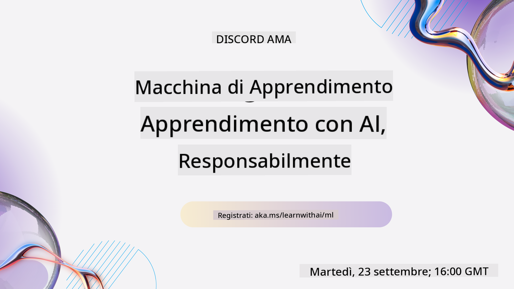
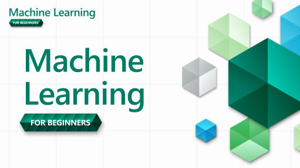

<!--
CO_OP_TRANSLATOR_METADATA:
{
  "original_hash": "7a13afb3674838f557d61f8d67e4d5f8",
  "translation_date": "2025-10-24T09:06:34+00:00",
  "source_file": "README.md",
  "language_code": "it"
}
-->

### 🌐 Supporto multilingue

#### Supportato tramite GitHub Action (Automatizzato e sempre aggiornato)

<!-- CO-OP TRANSLATOR LANGUAGES TABLE START -->
[Arabo](../ar/README.md) | [Bengalese](../bn/README.md) | [Bulgaro](../bg/README.md) | [Birmano (Myanmar)](../my/README.md) | [Cinese (Semplificato)](../zh/README.md) | [Cinese (Tradizionale, Hong Kong)](../hk/README.md) | [Cinese (Tradizionale, Macao)](../mo/README.md) | [Cinese (Tradizionale, Taiwan)](../tw/README.md) | [Croato](../hr/README.md) | [Ceco](../cs/README.md) | [Danese](../da/README.md) | [Olandese](../nl/README.md) | [Estone](../et/README.md) | [Finlandese](../fi/README.md) | [Francese](../fr/README.md) | [Tedesco](../de/README.md) | [Greco](../el/README.md) | [Ebraico](../he/README.md) | [Hindi](../hi/README.md) | [Ungherese](../hu/README.md) | [Indonesiano](../id/README.md) | [Italiano](./README.md) | [Giapponese](../ja/README.md) | [Coreano](../ko/README.md) | [Lituano](../lt/README.md) | [Malese](../ms/README.md) | [Marathi](../mr/README.md) | [Nepalese](../ne/README.md) | [Norvegese](../no/README.md) | [Persiano (Farsi)](../fa/README.md) | [Polacco](../pl/README.md) | [Portoghese (Brasile)](../br/README.md) | [Portoghese (Portogallo)](../pt/README.md) | [Punjabi (Gurmukhi)](../pa/README.md) | [Rumeno](../ro/README.md) | [Russo](../ru/README.md) | [Serbo (Cirillico)](../sr/README.md) | [Slovacco](../sk/README.md) | [Sloveno](../sl/README.md) | [Spagnolo](../es/README.md) | [Swahili](../sw/README.md) | [Svedese](../sv/README.md) | [Tagalog (Filippino)](../tl/README.md) | [Tamil](../ta/README.md) | [Thailandese](../th/README.md) | [Turco](../tr/README.md) | [Ucraino](../uk/README.md) | [Urdu](../ur/README.md) | [Vietnamita](../vi/README.md)
<!-- CO-OP TRANSLATOR LANGUAGES TABLE END -->

#### Unisciti alla nostra comunità

Abbiamo una serie di apprendimento su Discord dedicata all'AI in corso, scopri di più e unisciti a noi su [Learn with AI Series](https://aka.ms/learnwithai/discord) dal 18 al 30 settembre 2025. Riceverai consigli e trucchi sull'uso di GitHub Copilot per la Data Science.

# Machine Learning per Principianti - Un Curriculum

> 🌍 Viaggia intorno al mondo mentre esploriamo il Machine Learning attraverso le culture del mondo 🌍

Gli Advocates del Cloud di Microsoft sono lieti di offrire un curriculum di 12 settimane e 26 lezioni tutto dedicato al **Machine Learning**. In questo curriculum, imparerai ciò che a volte viene chiamato **machine learning classico**, utilizzando principalmente Scikit-learn come libreria ed evitando il deep learning, che è trattato nel nostro [curriculum AI per Principianti](https://aka.ms/ai4beginners). Abbina queste lezioni al nostro curriculum ['Data Science per Principianti'](https://aka.ms/ds4beginners), anche!

Viaggia con noi intorno al mondo mentre applichiamo queste tecniche classiche ai dati provenienti da molte aree del mondo. Ogni lezione include quiz pre- e post-lezione, istruzioni scritte per completare la lezione, una soluzione, un compito e altro ancora. La nostra pedagogia basata sui progetti ti permette di imparare mentre costruisci, un metodo comprovato per far sì che le nuove competenze rimangano.

**✍️ Un sentito ringraziamento ai nostri autori** Jen Looper, Stephen Howell, Francesca Lazzeri, Tomomi Imura, Cassie Breviu, Dmitry Soshnikov, Chris Noring, Anirban Mukherjee, Ornella Altunyan, Ruth Yakubu e Amy Boyd

**🎨 Grazie anche ai nostri illustratori** Tomomi Imura, Dasani Madipalli e Jen Looper

**🙏 Un ringraziamento speciale 🙏 ai nostri Microsoft Student Ambassador autori, revisori e collaboratori di contenuti**, in particolare Rishit Dagli, Muhammad Sakib Khan Inan, Rohan Raj, Alexandru Petrescu, Abhishek Jaiswal, Nawrin Tabassum, Ioan Samuila e Snigdha Agarwal

**🤩 Gratitudine extra ai Microsoft Student Ambassadors Eric Wanjau, Jasleen Sondhi e Vidushi Gupta per le nostre lezioni in R!**

# Per iniziare

Segui questi passaggi:
1. **Fai il fork del repository**: Clicca sul pulsante "Fork" in alto a destra in questa pagina.
2. **Clona il repository**:   `git clone https://github.com/microsoft/ML-For-Beginners.git`

> [trova tutte le risorse aggiuntive per questo corso nella nostra collezione Microsoft Learn](https://learn.microsoft.com/en-us/collections/qrqzamz1nn2wx3?WT.mc_id=academic-77952-bethanycheum)

> 🔧 **Hai bisogno di aiuto?** Consulta la nostra [Guida alla risoluzione dei problemi](TROUBLESHOOTING.md) per soluzioni ai problemi comuni di installazione, configurazione e esecuzione delle lezioni.

**[Studenti](https://aka.ms/student-page)**, per utilizzare questo curriculum, fate il fork dell'intero repository sul vostro account GitHub e completate gli esercizi da soli o in gruppo:

- Inizia con un quiz pre-lezione.
- Leggi la lezione e completa le attività, fermandoti e riflettendo a ogni verifica delle conoscenze.
- Cerca di creare i progetti comprendendo le lezioni piuttosto che eseguire il codice della soluzione; tuttavia quel codice è disponibile nelle cartelle `/solution` in ogni lezione orientata al progetto.
- Fai il quiz post-lezione.
- Completa la sfida.
- Completa il compito.
- Dopo aver completato un gruppo di lezioni, visita il [Forum di discussione](https://github.com/microsoft/ML-For-Beginners/discussions) e "impara ad alta voce" compilando il rubric PAT appropriato. Un 'PAT' è uno strumento di valutazione del progresso che è un rubric che compili per approfondire il tuo apprendimento. Puoi anche reagire ad altri PAT così possiamo imparare insieme.

> Per ulteriori studi, ti consigliamo di seguire questi moduli e percorsi di apprendimento [Microsoft Learn](https://docs.microsoft.com/en-us/users/jenlooper-2911/collections/k7o7tg1gp306q4?WT.mc_id=academic-77952-leestott).

**Insegnanti**, abbiamo [incluso alcune indicazioni](for-teachers.md) su come utilizzare questo curriculum.

---

## Video tutorial

Alcune delle lezioni sono disponibili sotto forma di brevi video. Puoi trovarli tutti integrati nelle lezioni o nella [playlist ML per Principianti sul canale YouTube di Microsoft Developer](https://aka.ms/ml-beginners-videos) cliccando sull'immagine qui sotto.

---

## Incontra il team

**Gif di** [Mohit Jaisal](https://linkedin.com/in/mohitjaisal)

> 🎥 Clicca sull'immagine sopra per un video sul progetto e sulle persone che lo hanno creato!

---

## Pedagogia

Abbiamo scelto due principi pedagogici durante la creazione di questo curriculum: garantire che sia basato su **progetti pratici** e che includa **quiz frequenti**. Inoltre, questo curriculum ha un **tema comune** per dargli coesione.

Garantendo che i contenuti siano allineati ai progetti, il processo diventa più coinvolgente per gli studenti e la ritenzione dei concetti sarà aumentata. Inoltre, un quiz a basso rischio prima di una lezione orienta l'intenzione dello studente verso l'apprendimento di un argomento, mentre un secondo quiz dopo la lezione garantisce una maggiore ritenzione. Questo curriculum è stato progettato per essere flessibile e divertente e può essere seguito in tutto o in parte. I progetti iniziano piccoli e diventano sempre più complessi entro la fine del ciclo di 12 settimane. Questo curriculum include anche un postscript sulle applicazioni reali del ML, che può essere utilizzato come credito extra o come base per discussioni.

> Trova il nostro [Codice di Condotta](CODE_OF_CONDUCT.md), [Contributi](CONTRIBUTING.md), [Traduzioni](TRANSLATIONS.md) e [Guida alla risoluzione dei problemi](TROUBLESHOOTING.md). Accogliamo con favore i tuoi feedback costruttivi!

## Ogni lezione include

- sketchnote opzionale
- video supplementare opzionale
- video tutorial (solo alcune lezioni)
- [quiz di riscaldamento pre-lezione](https://ff-quizzes.netlify.app/en/ml/)
- lezione scritta
- per lezioni basate su progetti, guide passo-passo su come costruire il progetto
- verifiche delle conoscenze
- una sfida
- letture supplementari
- compito
- [quiz post-lezione](https://ff-quizzes.netlify.app/en/ml/)

> **Nota sulle lingue**: Queste lezioni sono scritte principalmente in Python, ma molte sono disponibili anche in R. Per completare una lezione in R, vai alla cartella `/solution` e cerca le lezioni in R. Includono un'estensione .rmd che rappresenta un file **R Markdown** che può essere semplicemente definito come un'integrazione di `blocchi di codice` (di R o altre lingue) e un `intestazione YAML` (che guida come formattare gli output come PDF) in un `documento Markdown`. In quanto tale, serve come un eccellente framework di authoring per la data science poiché ti consente di combinare il tuo codice, il suo output e i tuoi pensieri permettendoti di scriverli in Markdown. Inoltre, i documenti R Markdown possono essere resi in formati di output come PDF, HTML o Word.

> **Nota sui quiz**: Tutti i quiz sono contenuti nella [cartella Quiz App](../../quiz-app), per un totale di 52 quiz di tre domande ciascuno. Sono collegati all'interno delle lezioni, ma l'app quiz può essere eseguita localmente; segui le istruzioni nella cartella `quiz-app` per ospitare localmente o distribuire su Azure.

| Numero Lezione |                             Argomento                              |                   Raggruppamento Lezione                   | Obiettivi di Apprendimento                                                                                                             |                                                              Lezione Collegata                                                               |                        Autore                        |
| :-----------: | :------------------------------------------------------------: | :-------------------------------------------------: | ------------------------------------------------------------------------------------------------------------------------------- | :--------------------------------------------------------------------------------------------------------------------------------------: | :--------------------------------------------------: |
|      01       |                Introduzione al machine learning                |      [Introduzione](1-Introduction/README.md)       | Scopri i concetti di base del machine learning                                                                                  |                                             [Lezione](1-Introduction/1-intro-to-ML/README.md)                                             |                       Muhammad                       |
|      02       |                La storia del machine learning                  |      [Introduzione](1-Introduction/README.md)       | Scopri la storia che sta alla base di questo campo                                                                             |                                            [Lezione](1-Introduction/2-history-of-ML/README.md)                                            |                     Jen e Amy                       |
|      03       |                 Equità e machine learning                      |      [Introduzione](1-Introduction/README.md)       | Quali sono le questioni filosofiche importanti sull'equità che gli studenti dovrebbero considerare quando costruiscono e applicano modelli ML? |                                              [Lezione](1-Introduction/3-fairness/README.md)                                               |                        Tomomi                        |
|      04       |                Tecniche per il machine learning                |      [Introduzione](1-Introduction/README.md)       | Quali tecniche utilizzano i ricercatori ML per costruire modelli ML?                                                           |                                          [Lezione](1-Introduction/4-techniques-of-ML/README.md)                                           |                    Chris e Jen                     |
|      05       |                   Introduzione alla regressione                |        [Regressione](2-Regression/README.md)         | Inizia con Python e Scikit-learn per i modelli di regressione                                                                  |         [Python](2-Regression/1-Tools/README.md) • [R](../../2-Regression/1-Tools/solution/R/lesson_1.html)         |      Jen • Eric Wanjau       |
|      06       |                Prezzi delle zucche in Nord America 🎃          |        [Regressione](2-Regression/README.md)         | Visualizza e pulisci i dati in preparazione per il ML                                                                           |          [Python](2-Regression/2-Data/README.md) • [R](../../2-Regression/2-Data/solution/R/lesson_2.html)          |      Jen • Eric Wanjau       |
|      07       |                Prezzi delle zucche in Nord America 🎃          |        [Regressione](2-Regression/README.md)         | Costruisci modelli di regressione lineare e polinomiale                                                                         |        [Python](2-Regression/3-Linear/README.md) • [R](../../2-Regression/3-Linear/solution/R/lesson_3.html)        |      Jen e Dmitry • Eric Wanjau       |
|      08       |                Prezzi delle zucche in Nord America 🎃          |        [Regressione](2-Regression/README.md)         | Costruisci un modello di regressione logistica                                                                                 |     [Python](2-Regression/4-Logistic/README.md) • [R](../../2-Regression/4-Logistic/solution/R/lesson_4.html)      |      Jen • Eric Wanjau       |
|      09       |                          Un'app web 🔌                          |           [App Web](3-Web-App/README.md)            | Costruisci un'app web per utilizzare il tuo modello addestrato                                                                 |                                                 [Python](3-Web-App/1-Web-App/README.md)                                                  |                         Jen                          |
|      10       |                 Introduzione alla classificazione              |    [Classificazione](4-Classification/README.md)     | Pulisci, prepara e visualizza i tuoi dati; introduzione alla classificazione                                                   | [Python](4-Classification/1-Introduction/README.md) • [R](../../4-Classification/1-Introduction/solution/R/lesson_10.html)  | Jen e Cassie • Eric Wanjau |
|      11       |             Deliziose cucine asiatiche e indiane 🍜            |    [Classificazione](4-Classification/README.md)     | Introduzione ai classificatori                                                                                                 | [Python](4-Classification/2-Classifiers-1/README.md) • [R](../../4-Classification/2-Classifiers-1/solution/R/lesson_11.html) | Jen e Cassie • Eric Wanjau |
|      12       |             Deliziose cucine asiatiche e indiane 🍜            |    [Classificazione](4-Classification/README.md)     | Altri classificatori                                                                                                           | [Python](4-Classification/3-Classifiers-2/README.md) • [R](../../4-Classification/3-Classifiers-2/solution/R/lesson_12.html) | Jen e Cassie • Eric Wanjau |
|      13       |             Deliziose cucine asiatiche e indiane 🍜            |    [Classificazione](4-Classification/README.md)     | Costruisci un'app web di raccomandazione utilizzando il tuo modello                                                            |                                              [Python](4-Classification/4-Applied/README.md)                                              |                         Jen                          |
|      14       |                   Introduzione al clustering                   |        [Clustering](5-Clustering/README.md)         | Pulisci, prepara e visualizza i tuoi dati; introduzione al clustering                                                          |         [Python](5-Clustering/1-Visualize/README.md) • [R](../../5-Clustering/1-Visualize/solution/R/lesson_14.html)         |      Jen • Eric Wanjau       |
|      15       |              Esplorazione dei gusti musicali nigeriani 🎧      |        [Clustering](5-Clustering/README.md)         | Esplora il metodo di clustering K-Means                                                                                        |           [Python](5-Clustering/2-K-Means/README.md) • [R](../../5-Clustering/2-K-Means/solution/R/lesson_15.html)           |      Jen • Eric Wanjau       |
|      16       |        Introduzione all'elaborazione del linguaggio naturale ☕️ |   [Elaborazione del linguaggio naturale](6-NLP/README.md)    | Scopri le basi dell'NLP costruendo un semplice bot                                                                             |                                             [Python](6-NLP/1-Introduction-to-NLP/README.md)                                              |                       Stephen                        |
|      17       |                      Compiti comuni di NLP ☕️                 |   [Elaborazione del linguaggio naturale](6-NLP/README.md)    | Approfondisci la tua conoscenza dell'NLP comprendendo i compiti comuni richiesti quando si trattano strutture linguistiche      |                                                    [Python](6-NLP/2-Tasks/README.md)                                                     |                       Stephen                        |
|      18       |             Traduzione e analisi del sentiment ♥️              |   [Elaborazione del linguaggio naturale](6-NLP/README.md)    | Traduzione e analisi del sentiment con Jane Austen                                                                             |                                            [Python](6-NLP/3-Translation-Sentiment/README.md)                                             |                       Stephen                        |
|      19       |                  Hotel romantici d'Europa ♥️                   |   [Elaborazione del linguaggio naturale](6-NLP/README.md)    | Analisi del sentiment con recensioni di hotel 1                                                                                |                                               [Python](6-NLP/4-Hotel-Reviews-1/README.md)                                                |                       Stephen                        |
|      20       |                  Hotel romantici d'Europa ♥️                   |   [Elaborazione del linguaggio naturale](6-NLP/README.md)    | Analisi del sentiment con recensioni di hotel 2                                                                                |                                               [Python](6-NLP/5-Hotel-Reviews-2/README.md)                                                |                       Stephen                        |
|      21       |            Introduzione alla previsione delle serie temporali |        [Serie temporali](7-TimeSeries/README.md)        | Introduzione alla previsione delle serie temporali                                                                             |                                             [Python](7-TimeSeries/1-Introduction/README.md)                                              |                      Francesca                       |
|      22       | ⚡️ Consumo energetico mondiale ⚡️ - previsione con ARIMA      |        [Serie temporali](7-TimeSeries/README.md)        | Previsione delle serie temporali con ARIMA                                                                                     |                                                 [Python](7-TimeSeries/2-ARIMA/README.md)                                                 |                      Francesca                       |
|      23       | ⚡️ Consumo energetico mondiale ⚡️ - previsione con SVR        |        [Serie temporali](7-TimeSeries/README.md)        | Previsione delle serie temporali con Support Vector Regressor                                                                  |                                                  [Python](7-TimeSeries/3-SVR/README.md)                                                  |                       Anirban                        |
|      24       |             Introduzione al reinforcement learning             | [Reinforcement learning](8-Reinforcement/README.md) | Introduzione al reinforcement learning con Q-Learning                                                                          |                                             [Python](8-Reinforcement/1-QLearning/README.md)                                              |                        Dmitry                        |
|      25       |                 Aiuta Peter a evitare il lupo! 🐺              | [Reinforcement learning](8-Reinforcement/README.md) | Reinforcement learning Gym                                                                                                     |                                                [Python](8-Reinforcement/2-Gym/README.md)                                                 |                        Dmitry                        |
|  Postscript   |            Scenari e applicazioni ML nel mondo reale           |      [ML nel mondo reale](9-Real-World/README.md)       | Applicazioni interessanti e rivelatrici del ML classico nel mondo reale                                                        |                                             [Lezione](9-Real-World/1-Applications/README.md)                                              |                         Team                         |
|  Postscript   |            Debugging dei modelli ML con dashboard RAI          |      [ML nel mondo reale](9-Real-World/README.md)       | Debugging dei modelli di Machine Learning utilizzando i componenti del dashboard Responsible AI                                |                                             [Lezione](9-Real-World/2-Debugging-ML-Models/README.md)                                              |                         Ruth Yakubu                       |

> [trova tutte le risorse aggiuntive per questo corso nella nostra raccolta Microsoft Learn](https://learn.microsoft.com/en-us/collections/qrqzamz1nn2wx3?WT.mc_id=academic-77952-bethanycheum)

## Accesso offline

Puoi eseguire questa documentazione offline utilizzando [Docsify](https://docsify.js.org/#/). Fai un fork di questo repository, [installa Docsify](https://docsify.js.org/#/quickstart) sul tuo computer locale e poi, nella cartella principale di questo repository, digita `docsify serve`. Il sito web sarà servito sulla porta 3000 del tuo localhost: `localhost:3000`.

## PDF

Trova un PDF del curriculum con i link [qui](https://microsoft.github.io/ML-For-Beginners/pdf/readme.pdf).

## 🎒 Altri Corsi 

Il nostro team produce altri corsi! Dai un'occhiata:

### Azure / Edge / MCP / Agents

---

### Serie Generative AI

[-9333EA?style=for-the-badge&labelColor=E5E7EB&color=9333EA)](https://github.com/microsoft/Generative-AI-for-beginners-dotnet?WT.mc_id=academic-105485-koreyst)
[-C084FC?style=for-the-badge&labelColor=E5E7EB&color=C084FC)](https://github.com/microsoft/generative-ai-for-beginners-java?WT.mc_id=academic-105485-koreyst)
[-E879F9?style=for-the-badge&labelColor=E5E7EB&color=E879F9)](https://github.com/microsoft/generative-ai-with-javascript?WT.mc_id=academic-105485-koreyst)

---

### Apprendimento di base
  
  
  
  
  
  
  

---

### Serie Copilot  
  
  
  

## Ottenere Aiuto  

Se ti blocchi o hai domande sulla creazione di app AI, unisciti a:  

  

Se hai feedback sui prodotti o riscontri errori durante la creazione, visita:  

  

---

**Disclaimer**:  
Questo documento è stato tradotto utilizzando il servizio di traduzione AI [Co-op Translator](https://github.com/Azure/co-op-translator). Sebbene ci impegniamo per garantire l'accuratezza, si prega di notare che le traduzioni automatiche possono contenere errori o imprecisioni. Il documento originale nella sua lingua nativa dovrebbe essere considerato la fonte autorevole. Per informazioni critiche, si raccomanda una traduzione professionale umana. Non siamo responsabili per eventuali incomprensioni o interpretazioni errate derivanti dall'uso di questa traduzione.