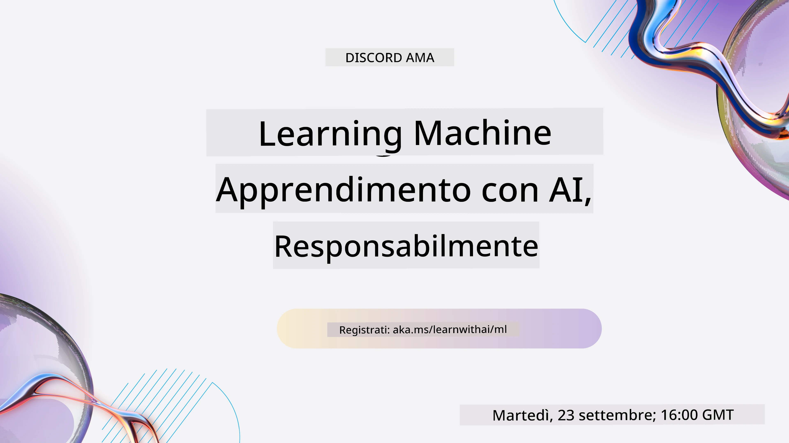
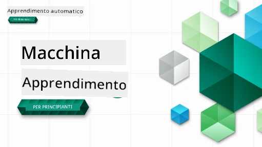

[](https://github.com/microsoft/ML-For-Beginners/blob/master/LICENSE)
[](https://GitHub.com/microsoft/ML-For-Beginners/graphs/contributors/)
[](https://GitHub.com/microsoft/ML-For-Beginners/issues/)
[](https://GitHub.com/microsoft/ML-For-Beginners/pulls/)
[](http://makeapullrequest.com)

[](https://GitHub.com/microsoft/ML-For-Beginners/watchers/)
[](https://GitHub.com/microsoft/ML-For-Beginners/network/)
[](https://GitHub.com/microsoft/ML-For-Beginners/stargazers/)

### 🌐 Supporto Multilingue

#### Supportato tramite GitHub Action (Automatizzato e Sempre Aggiornato)

<!-- CO-OP TRANSLATOR LANGUAGES TABLE START -->
[Arabo](../ar/README.md) | [Bengalese](../bn/README.md) | [Bulgaro](../bg/README.md) | [Birmano (Myanmar)](../my/README.md) | [Cinese (Semplificato)](../zh-CN/README.md) | [Cinese (Tradizionale, Hong Kong)](../zh-HK/README.md) | [Cinese (Tradizionale, Macau)](../zh-MO/README.md) | [Cinese (Tradizionale, Taiwan)](../zh-TW/README.md) | [Croato](../hr/README.md) | [Ceco](../cs/README.md) | [Danese](../da/README.md) | [Olandese](../nl/README.md) | [Estone](../et/README.md) | [Finlandese](../fi/README.md) | [Francese](../fr/README.md) | [Tedesco](../de/README.md) | [Greco](../el/README.md) | [Ebraico](../he/README.md) | [Hindi](../hi/README.md) | [Ungherese](../hu/README.md) | [Indonesiano](../id/README.md) | [Italiano](./README.md) | [Giapponese](../ja/README.md) | [Kannada](../kn/README.md) | [Khmer](../km/README.md) | [Coreano](../ko/README.md) | [Lituano](../lt/README.md) | [Malese](../ms/README.md) | [Malayalam](../ml/README.md) | [Marathi](../mr/README.md) | [Nepalese](../ne/README.md) | [Pidgin Nigeriano](../pcm/README.md) | [Norvegese](../no/README.md) | [Persiano (Farsi)](../fa/README.md) | [Polacco](../pl/README.md) | [Portoghese (Brasile)](../pt-BR/README.md) | [Portoghese (Portogallo)](../pt-PT/README.md) | [Punjabi (Gurmukhi)](../pa/README.md) | [Rumeno](../ro/README.md) | [Russo](../ru/README.md) | [Serbo (Cirillico)](../sr/README.md) | [Slovacco](../sk/README.md) | [Sloveno](../sl/README.md) | [Spagnolo](../es/README.md) | [Swahili](../sw/README.md) | [Svedese](../sv/README.md) | [Tagalog (Filippino)](../tl/README.md) | [Tamil](../ta/README.md) | [Telugu](../te/README.md) | [Thailandese](../th/README.md) | [Turco](../tr/README.md) | [Ucraino](../uk/README.md) | [Urdu](../ur/README.md) | [Vietnamita](../vi/README.md)

> **Preferisci clonare localmente?**
>
> Questo repository include oltre 50 traduzioni linguistiche che aumentano significativamente la dimensione del download. Per clonare senza traduzioni, usa l'estrazione sparsa:
>
> **Bash / macOS / Linux:**
> ```bash
> git clone --filter=blob:none --sparse https://github.com/microsoft/ML-For-Beginners.git
> cd ML-For-Beginners
> git sparse-checkout set --no-cone '/*' '!translations' '!translated_images'
> ```
>
> **CMD (Windows):**
> ```cmd
> git clone --filter=blob:none --sparse https://github.com/microsoft/ML-For-Beginners.git
> cd ML-For-Beginners
> git sparse-checkout set --no-cone "/*" "!translations" "!translated_images"
> ```
>
> Questo ti fornirà tutto il necessario per completare il corso con un download molto più veloce.
<!-- CO-OP TRANSLATOR LANGUAGES TABLE END -->

#### Unisciti alla nostra Community

[](https://discord.gg/nTYy5BXMWG)

Abbiamo una serie su Discord chiamata learn with AI in corso, scopri di più e unisciti a noi su [Learn with AI Series](https://aka.ms/learnwithai/discord) dal 18 al 30 settembre 2025. Riceverai suggerimenti e trucchi per utilizzare GitHub Copilot per Data Science.



# Machine Learning per Principianti - Un Curriculum

> 🌍 Viaggia intorno al mondo mentre esploriamo il Machine Learning attraverso le culture del mondo 🌍

I Cloud Advocates di Microsoft sono lieti di offrire un curriculum di 12 settimane, 26 lezioni, tutto dedicato al **Machine Learning**. In questo curriculum, imparerai ciò che a volte viene chiamato **machine learning classico**, usando principalmente Scikit-learn come libreria ed evitando il deep learning, che è trattato nel nostro [curriculum AI for Beginners](https://aka.ms/ai4beginners). Abbina queste lezioni anche al nostro ['Data Science for Beginners curriculum'](https://aka.ms/ds4beginners)!

Viaggia con noi intorno al mondo mentre applichiamo queste tecniche classiche a dati provenienti da molte aree del mondo. Ogni lezione include quiz pre- e post-lezione, istruzioni scritte per completare la lezione, una soluzione, un incarico e altro. La nostra pedagogia basata sui progetti ti permette di imparare mentre costruisci, un metodo comprovato per fissare nuove competenze.

**✍️ Sentiti ringraziamenti ai nostri autori** Jen Looper, Stephen Howell, Francesca Lazzeri, Tomomi Imura, Cassie Breviu, Dmitry Soshnikov, Chris Noring, Anirban Mukherjee, Ornella Altunyan, Ruth Yakubu e Amy Boyd

**🎨 Grazie anche ai nostri illustratori** Tomomi Imura, Dasani Madipalli e Jen Looper

**🙏 Ringraziamenti speciali 🙏 ai nostri autori, revisori e contributori di contenuti Microsoft Student Ambassador**, in particolare Rishit Dagli, Muhammad Sakib Khan Inan, Rohan Raj, Alexandru Petrescu, Abhishek Jaiswal, Nawrin Tabassum, Ioan Samuila e Snigdha Agarwal

**🤩 Ulteriori ringraziamenti a Microsoft Student Ambassadors Eric Wanjau, Jasleen Sondhi e Vidushi Gupta per le nostre lezioni in R!**

# Iniziando

Segui questi passaggi:
1. **Fork del Repository**: Clicca sul pulsante "Fork" nell'angolo in alto a destra di questa pagina.
2. **Clona il Repository**:   `git clone https://github.com/microsoft/ML-For-Beginners.git`

> 💡 **Suggerimento Rapido:** Vuoi iniziare in un browser senza configurare Python localmente? Usa [GitHub Codespaces](https://github.com/features/codespaces) per creare un ambiente di sviluppo cloud per il tuo fork. Apri il menu verde **Code**, seleziona **Codespaces** e crea un codespace; installa le dipendenze richieste di ogni lezione al suo interno secondo necessità.

> [trova tutte le risorse aggiuntive per questo corso nella nostra raccolta Microsoft Learn](https://learn.microsoft.com/en-us/collections/qrqzamz1nn2wx3?WT.mc_id=academic-77952-bethanycheum)

> 🔧 **Hai bisogno di aiuto?** Consulta la nostra [Guida alla risoluzione dei problemi](TROUBLESHOOTING.md) per soluzioni a problemi comuni con l'installazione, la configurazione e l'esecuzione delle lezioni.


**[Studenti](https://aka.ms/student-page)**, per usare questo curriculum, fai il fork dell’intero repository nel tuo account GitHub e completa gli esercizi da solo o in gruppo:

- Inizia con un quiz pre-lezione.
- Leggi la lezione e completa le attività, facendo pause e riflessioni a ogni verifica di conoscenza.
- Prova a creare i progetti comprendendo le lezioni, anziché eseguire il codice della soluzione; tuttavia quel codice è disponibile nelle cartelle `/solution` in ogni lezione orientata al progetto.
- Fai il quiz post-lezione.
- Completa la sfida.
- Completa l’incarico.
- Dopo aver completato un gruppo di lezioni, visita il [Discussion Board](https://github.com/microsoft/ML-For-Beginners/discussions) e "impara ad alta voce" compilando il rubric PAT appropriato. Un 'PAT' è uno Strumento di Valutazione del Progresso che è una rubrica che compili per approfondire l’apprendimento. Puoi anche reagire ad altri PAT in modo che possiamo imparare insieme.

> Per ulteriori studi, consigliamo di seguire questi moduli e percorsi di apprendimento [Microsoft Learn](https://docs.microsoft.com/en-us/users/jenlooper-2911/collections/k7o7tg1gp306q4?WT.mc_id=academic-77952-leestott).

**Insegnanti**, abbiamo [incluso alcune suggerimenti](for-teachers.md) su come usare questo curriculum.

---

## Video esplicativi

Alcune lezioni sono disponibili come video brevi. Puoi trovarli tutti inseriti nelle lezioni, o nella [playlist ML for Beginners sul canale YouTube Microsoft Developer](https://aka.ms/ml-beginners-videos) cliccando sull’immagine qui sotto.

[](https://aka.ms/ml-beginners-videos)

---

## Incontra il Team

[](https://youtu.be/Tj1XWrDSYJU)

**Gif by** [Mohit Jaisal](https://linkedin.com/in/mohitjaisal)

> 🎥 Clicca l’immagine sopra per un video sul progetto e le persone che lo hanno creato!

---

## Pedagogia

Abbiamo scelto due principi pedagogici durante la costruzione di questo curriculum: garantire che sia pratico **basato su progetti** e che includa **quiz frequenti**. Inoltre, questo curriculum ha un **tema** comune per dargli coesione.

Garantendo che il contenuto sia allineato ai progetti, il processo diventa più coinvolgente per gli studenti e la memorizzazione dei concetti sarà aumentata. Inoltre, un quiz a bassa pressione prima della lezione pone l’intento dello studente verso l’apprendimento di un argomento, mentre un secondo quiz dopo la lezione assicura un ulteriore consolidamento. Questo curriculum è stato progettato per essere flessibile e divertente e può essere seguito per intero o in parte. I progetti iniziano piccoli e diventano via via più complessi alla fine del ciclo di 12 settimane. Questo curriculum include anche un post scriptum sulle applicazioni reali del ML, che può essere usato come credito extra o come base per la discussione.

> Trova il nostro [Codice di Condotta](CODE_OF_CONDUCT.md), [Contributi](CONTRIBUTING.md), [Traduzioni](..) e linee guida per la [Risoluzione dei Problemi](TROUBLESHOOTING.md). Accogliamo con piacere il tuo feedback costruttivo!

## Ogni lezione include

- sketchnote opzionale
- video supplementare opzionale
- video esplicativo (alcune lezioni solo)
- [quiz di riscaldamento pre-lezione](https://ff-quizzes.netlify.app/en/ml/)
- lezione scritta
- per le lezioni basate su progetti, guide passo-passo su come costruire il progetto
- verifiche di conoscenza
- una sfida
- letture supplementari
- incarico
- [quiz post-lezione](https://ff-quizzes.netlify.app/en/ml/)

> **Una nota sulle lingue**: Queste lezioni sono principalmente scritte in Python, ma molte sono disponibili anche in R. Per completare una lezione in R, vai alla cartella `/solution` e cerca le lezioni in R. Includono un'estensione .rmd che rappresenta un file **R Markdown**, definibile semplicemente come un incapsulamento di `code chunks` (di R o altre lingue) e un `header YAML` (che guida come formattare le uscite come PDF) in un `documento Markdown`. Di conseguenza, serve come un quadro esemplare per l'autore di data science in quanto permette di combinare codice, output e riflessioni scrivendole in Markdown. Inoltre, i documenti R Markdown possono essere resi in formati di output come PDF, HTML o Word.

> **Una nota sui quiz**: Tutti i quiz si trovano nella [cartella Quiz App](../../quiz-app), per un totale di 52 quiz ciascuno con tre domande. Sono collegati all’interno delle lezioni ma l’app quiz può essere eseguita localmente; segui le istruzioni nella cartella `quiz-app` per ospitarla localmente o distribuirla su Azure.

| Numero Lezione |                             Argomento                             |                   Raggruppamento Lezioni                   | Obiettivi di Apprendimento                                                                                                            |                                                              Lezione Collegata                                                               |                        Autore                        |
| :-----------: | :------------------------------------------------------------: | :-------------------------------------------------: | ------------------------------------------------------------------------------------------------------------------------------- | :--------------------------------------------------------------------------------------------------------------------------------------: | :--------------------------------------------------: |
|      01       |                Introduzione al machine learning                |      [Introduction](1-Introduction/README.md)       | Impara i concetti base alla base del machine learning                                                                              |                                             [Lesson](1-Introduction/1-intro-to-ML/README.md)                                            |                       Muhammad                       |
|      02       |                La storia del machine learning                   |      [Introduction](1-Introduction/README.md)       | Scopri la storia che sta alla base di questo campo                                                                                  |                                            [Lesson](1-Introduction/2-history-of-ML/README.md)                                            |                     Jen e Amy                       |
|      03       |                 Equità e machine learning                       |      [Introduction](1-Introduction/README.md)       | Quali sono le importanti questioni filosofiche sull'equità che gli studenti dovrebbero considerare quando costruiscono e applicano modelli ML? |                                              [Lesson](1-Introduction/3-fairness/README.md)                                               |                        Tomomi                        |
|      04       |                Tecniche per il machine learning                 |      [Introduction](1-Introduction/README.md)       | Quali tecniche usano i ricercatori ML per costruire modelli ML?                                                                    |                                          [Lesson](1-Introduction/4-techniques-of-ML/README.md)                                           |                    Chris e Jen                      |
|      05       |                   Introduzione alla regressione                 |        [Regression](2-Regression/README.md)         | Inizia con Python e Scikit-learn per modelli di regressione                                                                        |         [Python](2-Regression/1-Tools/README.md) • [R](../../2-Regression/1-Tools/solution/R/lesson_1.html)         |      Jen • Eric Wanjau       |
|      06       |                Prezzi delle zucche nordamericane 🎃             |        [Regression](2-Regression/README.md)         | Visualizza e pulisci i dati in preparazione per ML                                                                                  |          [Python](2-Regression/2-Data/README.md) • [R](../../2-Regression/2-Data/solution/R/lesson_2.html)          |      Jen • Eric Wanjau       |
|      07       |                Prezzi delle zucche nordamericane 🎃             |        [Regression](2-Regression/README.md)         | Costruisci modelli di regressione lineare e polinomiale                                                                             |        [Python](2-Regression/3-Linear/README.md) • [R](../../2-Regression/3-Linear/solution/R/lesson_3.html)        |      Jen e Dmitry • Eric Wanjau       |
|      08       |                Prezzi delle zucche nordamericane 🎃             |        [Regression](2-Regression/README.md)         | Costruisci un modello di regressione logistica                                                                                      |     [Python](2-Regression/4-Logistic/README.md) • [R](../../2-Regression/4-Logistic/solution/R/lesson_4.html)      |      Jen • Eric Wanjau       |
|      09       |                          Un'app web 🔌                          |           [Web App](3-Web-App/README.md)            | Costruisci un'app web per usare il tuo modello addestrato                                                                           |                                                 [Python](3-Web-App/1-Web-App/README.md)                                                  |                         Jen                          |
|      10       |                 Introduzione alla classificazione               |    [Classification](4-Classification/README.md)     | Pulisci, prepara e visualizza i dati; introduzione alla classificazione                                                             | [Python](4-Classification/1-Introduction/README.md) • [R](../../4-Classification/1-Introduction/solution/R/lesson_10.html)  | Jen e Cassie • Eric Wanjau |
|      11       |             Deliziose cucine asiatiche e indiane 🍜             |    [Classification](4-Classification/README.md)     | Introduzione ai classificatori                                                                                                      | [Python](4-Classification/2-Classifiers-1/README.md) • [R](../../4-Classification/2-Classifiers-1/solution/R/lesson_11.html) | Jen e Cassie • Eric Wanjau |
|      12       |             Deliziose cucine asiatiche e indiane 🍜             |    [Classification](4-Classification/README.md)     | Altri classificatori                                                                                                               | [Python](4-Classification/3-Classifiers-2/README.md) • [R](../../4-Classification/3-Classifiers-2/solution/R/lesson_12.html) | Jen e Cassie • Eric Wanjau |
|      13       |             Deliziose cucine asiatiche e indiane 🍜             |    [Classification](4-Classification/README.md)     | Costruisci un'app web di raccomandazione usando il tuo modello                                                                      |                                              [Python](4-Classification/4-Applied/README.md)                                              |                         Jen                          |
|      14       |                   Introduzione al clustering                     |        [Clustering](5-Clustering/README.md)         | Pulisci, prepara e visualizza i dati; introduzione al clustering                                                                    |         [Python](5-Clustering/1-Visualize/README.md) • [R](../../5-Clustering/1-Visualize/solution/R/lesson_14.html)         |      Jen • Eric Wanjau       |
|      15       |              Esplorando i gusti musicali nigeriani 🎧           |        [Clustering](5-Clustering/README.md)         | Esplora il metodo di clustering K-Means                                                                                           |           [Python](5-Clustering/2-K-Means/README.md) • [R](../../5-Clustering/2-K-Means/solution/R/lesson_15.html)           |      Jen • Eric Wanjau       |
|      16       |        Introduzione al natural language processing ☕️           |   [Natural language processing](6-NLP/README.md)    | Impara le basi dell'NLP costruendo un semplice bot                                                                                 |                                             [Python](6-NLP/1-Introduction-to-NLP/README.md)                                              |                       Stephen                        |
|      17       |                      Compiti comuni di NLP ☕️                   |   [Natural language processing](6-NLP/README.md)    | Approfondisci la tua conoscenza NLP comprendendo i compiti comuni necessari quando si lavora con le strutture linguistiche           |                                                    [Python](6-NLP/2-Tasks/README.md)                                                     |                       Stephen                        |
|      18       |             Traduzione e analisi del sentiment ♥️                |   [Natural language processing](6-NLP/README.md)    | Traduzione e analisi del sentiment con Jane Austen                                                                                 |                                            [Python](6-NLP/3-Translation-Sentiment/README.md)                                             |                       Stephen                        |
|      19       |                  Hotel romantici d'Europa ♥️                     |   [Natural language processing](6-NLP/README.md)    | Analisi del sentiment con recensioni di hotel 1                                                                                   |                                               [Python](6-NLP/4-Hotel-Reviews-1/README.md)                                                |                       Stephen                        |
|      20       |                  Hotel romantici d'Europa ♥️                     |   [Natural language processing](6-NLP/README.md)    | Analisi del sentiment con recensioni di hotel 2                                                                                   |                                               [Python](6-NLP/5-Hotel-Reviews-2/README.md)                                                |                       Stephen                        |
|      21       |            Introduzione alla previsione di serie temporali      |        [Time series](7-TimeSeries/README.md)        | Introduzione alla previsione di serie temporali                                                                                   |                                             [Python](7-TimeSeries/1-Introduction/README.md)                                              |                      Francesca                       |
|      22       | ⚡️ Consumo energetico mondiale ⚡️ - previsione di serie temporali con ARIMA |        [Time series](7-TimeSeries/README.md)        | Previsione di serie temporali con ARIMA                                                                                            |                                                 [Python](7-TimeSeries/2-ARIMA/README.md)                                                 |                      Francesca                       |
|      23       |  ⚡️ Consumo energetico mondiale ⚡️ - previsione di serie temporali con SVR  |        [Time series](7-TimeSeries/README.md)        | Previsione di serie temporali con Support Vector Regressor                                                                         |                                                  [Python](7-TimeSeries/3-SVR/README.md)                                                  |                       Anirban                        |
|      24       |             Introduzione al reinforcement learning              | [Reinforcement learning](8-Reinforcement/README.md) | Introduzione al reinforcement learning con Q-Learning                                                                              |                                             [Python](8-Reinforcement/1-QLearning/README.md)                                              |                        Dmitry                        |
|      25       |                 Aiuta Peter a evitare il lupo! 🐺               | [Reinforcement learning](8-Reinforcement/README.md) | Reinforcement learning Gym                                                                                                        |                                                [Python](8-Reinforcement/2-Gym/README.md)                                                 |                        Dmitry                        |
|  Postscript   |            Casi e applicazioni reali di ML                       |      [ML in the Wild](9-Real-World/README.md)       | Applicazioni interessanti e rivelatrici del ML classico nel mondo reale                                                            |                                             [Lesson](9-Real-World/1-Applications/README.md)                                              |                         Team                         |
|  Postscript   |            Debug di modelli ML usando la dashboard RAI          |      [ML in the Wild](9-Real-World/README.md)       | Debug di modelli nel machine learning usando componenti della dashboard Responsible AI                                             |                                             [Lesson](9-Real-World/2-Debugging-ML-Models/README.md)                                              |                     Ruth Yakubu                      |

> [trova tutte le risorse aggiuntive per questo corso nella nostra collezione Microsoft Learn](https://learn.microsoft.com/en-us/collections/qrqzamz1nn2wx3?WT.mc_id=academic-77952-bethanycheum)

## Accesso offline

Puoi usare questa documentazione offline utilizzando [Docsify](https://docsify.js.org/#/). Fai un fork di questo repo, [installa Docsify](https://docsify.js.org/#/quickstart) sulla tua macchina locale, poi nella cartella radice di questo repo, digita `docsify serve`. Il sito sarà servito sulla porta 3000 del tuo localhost: `localhost:3000`.

## PDF

Trova un pdf del curriculum con link [qui](https://microsoft.github.io/ML-For-Beginners/pdf/readme.pdf).


## 🎒 Altri corsi

Il nostro team produce altri corsi! Dai un'occhiata a:

<!-- CO-OP TRANSLATOR OTHER COURSES START -->
### LangChain
[](https://aka.ms/langchain4j-for-beginners)
[](https://aka.ms/langchainjs-for-beginners?WT.mc_id=m365-94501-dwahlin)
[](https://github.com/microsoft/langchain-for-beginners?WT.mc_id=m365-94501-dwahlin)
---

### Azure / Edge / MCP / Agenti
[](https://github.com/microsoft/AZD-for-beginners?WT.mc_id=academic-105485-koreyst)
[](https://github.com/microsoft/edgeai-for-beginners?WT.mc_id=academic-105485-koreyst)
[](https://github.com/microsoft/mcp-for-beginners?WT.mc_id=academic-105485-koreyst)
[](https://github.com/microsoft/ai-agents-for-beginners?WT.mc_id=academic-105485-koreyst)

---
 
### Serie di AI generativa
[](https://github.com/microsoft/generative-ai-for-beginners?WT.mc_id=academic-105485-koreyst)
[-9333EA?style=for-the-badge&labelColor=E5E7EB&color=9333EA)](https://github.com/microsoft/Generative-AI-for-beginners-dotnet?WT.mc_id=academic-105485-koreyst)
[-C084FC?style=for-the-badge&labelColor=E5E7EB&color=C084FC)](https://github.com/microsoft/generative-ai-for-beginners-java?WT.mc_id=academic-105485-koreyst)
[-E879F9?style=for-the-badge&labelColor=E5E7EB&color=E879F9)](https://github.com/microsoft/generative-ai-with-javascript?WT.mc_id=academic-105485-koreyst)

---
 
### Apprendimento di base
[](https://aka.ms/ml-beginners?WT.mc_id=academic-105485-koreyst)
[](https://aka.ms/datascience-beginners?WT.mc_id=academic-105485-koreyst)
[](https://aka.ms/ai-beginners?WT.mc_id=academic-105485-koreyst)
[](https://github.com/microsoft/Security-101?WT.mc_id=academic-96948-sayoung)
[](https://aka.ms/webdev-beginners?WT.mc_id=academic-105485-koreyst)
[](https://aka.ms/iot-beginners?WT.mc_id=academic-105485-koreyst)
[](https://github.com/microsoft/xr-development-for-beginners?WT.mc_id=academic-105485-koreyst)

---
 
### Serie Copilot
[](https://aka.ms/GitHubCopilotAI?WT.mc_id=academic-105485-koreyst)
[](https://github.com/microsoft/mastering-github-copilot-for-dotnet-csharp-developers?WT.mc_id=academic-105485-koreyst)
[](https://github.com/microsoft/CopilotAdventures?WT.mc_id=academic-105485-koreyst)
<!-- CO-OP TRANSLATOR OTHER COURSES END -->

## Ottenere aiuto

Se rimani bloccato o hai domande mentre impari il Machine Learning o costruisci applicazioni AI, non preoccuparti — l'aiuto è disponibile.

Puoi partecipare alle discussioni con altri studenti e sviluppatori, fare domande e condividere le tue idee con la community.

- Partecipa alla community per fare domande e imparare con gli altri
- Discuta concetti di Machine Learning e idee di progetto
- Ottieni consigli da sviluppatori esperti

Una community di supporto è un ottimo modo per migliorare le tue competenze e risolvere i problemi più rapidamente.

[Microsoft Foundry Discord Community](https://discord.gg/nTYy5BXMWG)

Se incontri bug, errori, o hai suggerimenti per miglioramenti, puoi anche aprire un **Issue** in questo repository per segnalare il problema.

Per feedback sul prodotto o per cercare nei post già esistenti, visita il Forum per sviluppatori:

[](https://aka.ms/foundry/forum)

## Consigli aggiuntivi per l'apprendimento

- Rivedi i notebook dopo ogni lezione per una migliore comprensione.
- Esercitati a implementare algoritmi autonomamente.
- Esplora set di dati reali usando i concetti appresi.

---

<!-- CO-OP TRANSLATOR DISCLAIMER START -->
**Disclaimer**:
Questo documento è stato tradotto utilizzando il servizio di traduzione AI [Co-op Translator](https://github.com/Azure/co-op-translator). Sebbene ci impegniamo per garantire la precisione, si prega di notare che le traduzioni automatizzate possono contenere errori o imprecisioni. Il documento originale nella sua lingua nativa deve essere considerato la fonte autorevole. Per informazioni critiche, si raccomanda una traduzione professionale effettuata da un essere umano. Non siamo responsabili per eventuali malintesi o interpretazioni errate derivanti dall’uso di questa traduzione.
<!-- CO-OP TRANSLATOR DISCLAIMER END -->