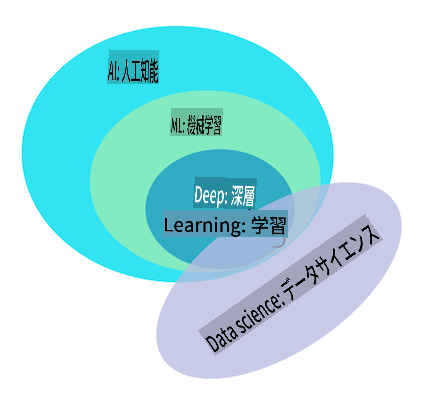

# 機械学習の入門

## [事前講義クイズ](https://gray-sand-07a10f403.1.azurestaticapps.net/quiz/1/)

---

> 🎥 上の画像をクリックすると、このレッスンの短い動画が再生されます。

初心者向けの古典的な機械学習コースへようこそ！このトピックに全くの初心者であっても、または経験豊富なML実践者であっても、私たちはあなたを歓迎します！私たちは、あなたのML学習のための親しみやすい出発点を作りたいと考えており、あなたの[フィードバック](https://github.com/microsoft/ML-For-Beginners/discussions)を評価し、対応し、取り入れることを喜んで行います。

> 🎥 上の画像をクリックすると、MITのJohn Guttagが機械学習を紹介する動画が再生されます。

---
## 機械学習の始め方

このカリキュラムを始める前に、ノートブックをローカルで実行するためにコンピュータのセットアップを行う必要があります。

- **これらのビデオでマシンを構成する**。システムに[Pythonをインストールする方法](https://youtu.be/CXZYvNRIAKM)と、開発のための[テキストエディタを設定する](https://youtu.be/EU8eayHWoZg)方法を学ぶために以下のリンクを使用してください。
- **Pythonを学ぶ**。このコースで使用するデータサイエンティストに役立つプログラミング言語である[Python](https://docs.microsoft.com/learn/paths/python-language/?WT.mc_id=academic-77952-leestott)の基本的な理解も推奨されます。
- **Node.jsとJavaScriptを学ぶ**。このコースでは、Webアプリを作成する際にJavaScriptも数回使用するため、[node](https://nodejs.org)と[npm](https://www.npmjs.com/)をインストールし、[Visual Studio Code](https://code.visualstudio.com/)をPythonとJavaScriptの開発に利用できるようにする必要があります。
- **GitHubアカウントを作成する**。あなたが[GitHub](https://github.com)で私たちを見つけたのであれば、すでにアカウントを持っているかもしれませんが、そうでない場合はアカウントを作成し、このカリキュラムをフォークして自分で使用してください。（星を付けていただけると嬉しいです😊）
- **Scikit-learnを探索する**。これらのレッスンで参照する一連のMLライブラリである[Scikit-learn](https://scikit-learn.org/stable/user_guide.html)に慣れてください。

---
## 機械学習とは何か？

「機械学習」という用語は、今日最も人気があり頻繁に使用される用語の一つです。技術に多少なりとも親しみがあれば、どの分野で働いていても、この用語を少なくとも一度は聞いたことがある可能性があります。しかし、機械学習の仕組みは多くの人にとって謎です。機械学習の初心者にとって、このテーマは時に圧倒的に感じられることがあります。したがって、機械学習が実際に何であるかを理解し、実践的な例を通じて一歩一歩学んでいくことが重要です。

---
## ハイプカーブ

> Google Trendsが示す最近の「機械学習」のハイプカーブ

---
## 謎に満ちた宇宙

私たちは魅力的な謎に満ちた宇宙に住んでいます。スティーブン・ホーキングやアルバート・アインシュタインなどの偉大な科学者たちは、周囲の世界の謎を解き明かす有意義な情報を探求するために一生を捧げました。これは学習という人間の条件です。人間の子供は、新しいことを学び、成長するにつれて世界の構造を年々明らかにしていきます。

---
## 子供の脳

子供の脳と感覚は周囲の事実を知覚し、徐々に生活の隠れたパターンを学び、それによって学んだパターンを識別するための論理的なルールを作成します。人間の脳の学習プロセスは、人間をこの世界で最も高度な生き物にします。隠れたパターンを発見し続け、それに基づいて革新することで、生涯を通じて自分自身をより良くしていくことができます。この学習能力と進化能力は、[脳の可塑性](https://www.simplypsychology.org/brain-plasticity.html)という概念に関連しています。表面的には、人間の脳の学習プロセスと機械学習の概念との間には、いくつかの動機的な類似点を引き出すことができます。

---
## 人間の脳

[人間の脳](https://www.livescience.com/29365-human-brain.html)は現実世界から物事を知覚し、知覚した情報を処理し、合理的な決定を下し、状況に応じて特定の行動を取ります。これが知的に振る舞うと呼ばれるものです。知的な行動プロセスの模倣を機械にプログラムすることを人工知能（AI）と呼びます。

---
## 用語の説明

用語が混同されることがありますが、機械学習（ML）は人工知能の重要なサブセットです。**MLは、知覚されたデータから有意義な情報を発見し、隠れたパターンを見つけて合理的な意思決定プロセスを裏付けるために特化したアルゴリズムを使用することに関心があります**。

---
## AI、ML、ディープラーニング

> AI、ML、ディープラーニング、データサイエンスの関係を示す図。インフォグラフィックは[Jen Looper](https://twitter.com/jenlooper)によって、この[グラフィック](https://softwareengineering.stackexchange.com/questions/366996/distinction-between-ai-ml-neural-networks-deep-learning-and-data-mining)にインスパイアされて作成されました。

---
## カバーする概念

このカリキュラムでは、初心者が知っておくべき機械学習の基本概念のみをカバーします。主にScikit-learnを使用して「古典的な機械学習」をカバーします。これは多くの学生が基本を学ぶために使用する優れたライブラリです。人工知能やディープラーニングの広範な概念を理解するためには、機械学習の強固な基礎知識が不可欠であり、ここでそれを提供したいと考えています。

---
## このコースで学ぶこと

- 機械学習の基本概念
- 機械学習の歴史
- 機械学習と公平性
- 回帰ML技術
- 分類ML技術
- クラスタリングML技術
- 自然言語処理ML技術
- 時系列予測ML技術
- 強化学習
- 機械学習の実世界での応用

---
## カバーしないこと

- ディープラーニング
- ニューラルネットワーク
- AI

より良い学習体験を提供するために、ニューラルネットワークの複雑さ、「ディープラーニング」 - ニューラルネットワークを使用した多層モデル構築 - およびAIを避けます。これらは別のカリキュラムで取り上げます。また、データサイエンスに焦点を当てたカリキュラムも今後提供する予定です。

---
## なぜ機械学習を学ぶのか？

システムの観点から見ると、機械学習は、データから隠れたパターンを学習し、知的な意思決定を支援する自動化システムの作成と定義されます。

この動機は、人間の脳が外界から知覚したデータに基づいて特定のことを学習する方法に緩やかに触発されています。

✅ ビジネスがハードコードされたルールベースのエンジンを作成するのではなく、機械学習戦略を使用しようとする理由について考えてみてください。

---
## 機械学習の応用

機械学習の応用は今やほぼどこにでもあり、私たちの社会を流れるデータ、スマートフォン、接続されたデバイス、およびその他のシステムによって生成されるデータと同様に普及しています。最先端の機械学習アルゴリズムの膨大な可能性を考慮して、研究者たちはその能力を多次元および多分野の実生活の問題を解決するために探求し、素晴らしい成果を上げています。

---
## 機械学習の応用例

**機械学習をさまざまな方法で使用できます**：

- 患者の医療履歴やレポートから病気の可能性を予測する。
- 天気データを利用して天気イベントを予測する。
- テキストの感情を理解する。
- 偽ニュースを検出してプロパガンダの拡散を防ぐ。

金融、経済学、地球科学、宇宙探査、生物医学工学、認知科学、さらには人文学の分野でも、機械学習を適用して、その領域の厄介でデータ処理の重い問題を解決しています。

---
## 結論

機械学習は、現実世界のデータや生成されたデータから有意義な洞察を見つけることでパターン発見のプロセスを自動化します。ビジネス、健康、金融などのアプリケーションにおいて非常に価値があることが証明されています。

近い将来、機械学習の基本を理解することは、その広範な採用のため、どの分野の人々にとっても必須になるでしょう。

---
# 🚀 チャレンジ

紙や[Excalidraw](https://excalidraw.com/)のようなオンラインアプリを使用して、AI、ML、ディープラーニング、データサイエンスの違いについての理解をスケッチしてください。これらの技術が得意とする問題のアイデアも追加してください。

# [講義後のクイズ](https://gray-sand-07a10f403.1.azurestaticapps.net/quiz/2/)

---
# レビューと自主学習

クラウドでMLアルゴリズムを使用する方法について詳しく学ぶには、この[学習パス](https://docs.microsoft.com/learn/paths/create-no-code-predictive-models-azure-machine-learning/?WT.mc_id=academic-77952-leestott)を参照してください。

MLの基本についての[学習パス](https://docs.microsoft.com/learn/modules/introduction-to-machine-learning/?WT.mc_id=academic-77952-leestott)を受講してください。

---
# 課題

[セットアップと実行](assignment.md)

**免責事項**：
この文書は、機械ベースのAI翻訳サービスを使用して翻訳されています。正確性を期していますが、自動翻訳にはエラーや不正確さが含まれる場合があることにご注意ください。元の言語の文書が権威ある情報源と見なされるべきです。重要な情報については、専門の人間による翻訳を推奨します。この翻訳の使用に起因する誤解や誤訳について、当社は一切の責任を負いません。