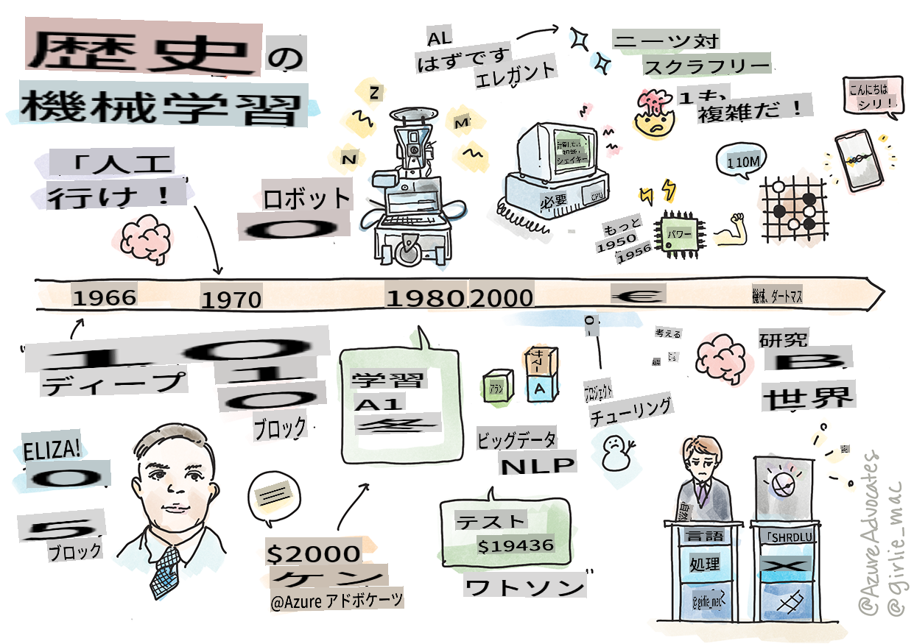
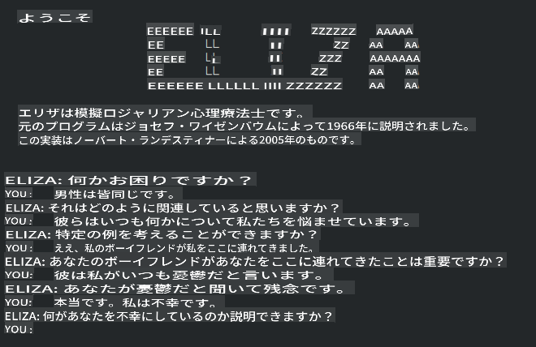

# 機械学習の歴史

> スケッチノート: [Tomomi Imura](https://www.twitter.com/girlie_mac)

## [講義前のクイズ](https://gray-sand-07a10f403.1.azurestaticapps.net/quiz/3/)

---

> 🎥 上の画像をクリックすると、このレッスンの短い動画が再生されます。

このレッスンでは、機械学習と人工知能の歴史における主要なマイルストーンを見ていきます。

人工知能（AI）の歴史は機械学習の歴史と密接に関連しています。なぜなら、MLを支えるアルゴリズムや計算の進歩がAIの発展に寄与しているからです。これらの分野が1950年代に独立した研究領域として結晶化し始めた一方で、重要な[アルゴリズム、統計、数学、計算、および技術的発見](https://wikipedia.org/wiki/Timeline_of_machine_learning)はその前から存在し、重なり合っていました。実際、人々は[何百年も前から](https://wikipedia.org/wiki/History_of_artificial_intelligence)これらの問題について考えてきました。この記事では、「考える機械」のアイデアの歴史的な知的基盤について議論しています。

---
## 重要な発見

- 1763年、1812年 [ベイズの定理](https://wikipedia.org/wiki/Bayes%27_theorem) とその前身。この定理とその応用は、事前の知識に基づいてイベントが発生する確率を説明します。
- 1805年 [最小二乗法](https://wikipedia.org/wiki/Least_squares) フランスの数学者Adrien-Marie Legendreによる。この理論はデータフィッティングに役立ち、回帰ユニットで学びます。
- 1913年 [マルコフ連鎖](https://wikipedia.org/wiki/Markov_chain)、ロシアの数学者Andrey Markovにちなんで名付けられたもので、前の状態に基づいて一連の可能なイベントを説明します。
- 1957年 [パーセプトロン](https://wikipedia.org/wiki/Perceptron) アメリカの心理学者Frank Rosenblattによって発明された線形分類器の一種で、深層学習の進歩の基礎となっています。

---

- 1967年 [最近傍法](https://wikipedia.org/wiki/Nearest_neighbor) 元々はルートをマッピングするために設計されたアルゴリズムで、MLの文脈ではパターンを検出するために使用されます。
- 1970年 [逆伝播](https://wikipedia.org/wiki/Backpropagation) [フィードフォワードニューラルネットワーク](https://wikipedia.org/wiki/Feedforward_neural_network) を訓練するために使用されます。
- 1982年 [リカレントニューラルネットワーク](https://wikipedia.org/wiki/Recurrent_neural_network) フィードフォワードニューラルネットワークから派生した人工ニューラルネットワークで、時間的なグラフを作成します。

✅ 少し調べてみましょう。MLとAIの歴史において他に重要な日付は何でしょうか？

---
## 1950年: 考える機械

2019年に[一般投票で](https://wikipedia.org/wiki/Icons:_The_Greatest_Person_of_the_20th_Century) 20世紀の偉大な科学者に選ばれたAlan Turingは、「考える機械」の概念の基礎を築いたとされています。彼は、この概念に対する反対意見や自身の経験的証拠の必要性に取り組むために[チューリングテスト](https://www.bbc.com/news/technology-18475646) を作成しました。このテストについてはNLPレッスンで探求します。

---
## 1956年: ダートマス夏季研究プロジェクト

「ダートマス夏季研究プロジェクトは、人工知能という分野にとって画期的なイベントであり、ここで『人工知能』という用語が生まれました」([source](https://250.dartmouth.edu/highlights/artificial-intelligence-ai-coined-dartmouth))。

> 学習やその他の知能の特徴のすべては、原則として、機械がそれをシミュレートできるほど正確に記述することができます。

---

主任研究者である数学教授John McCarthyは、「学習やその他の知能の特徴のすべては、原則として、機械がそれをシミュレートできるほど正確に記述することができる」という仮定に基づいて進めたいと考えていました。参加者には、分野のもう一人の著名人であるMarvin Minskyも含まれていました。

このワークショップは、「シンボリックメソッドの台頭、限定されたドメインに焦点を当てたシステム（初期のエキスパートシステム）、および帰納システムと演繹システムの議論」などの議論を始め、奨励したとされています ([source](https://wikipedia.org/wiki/Dartmouth_workshop))。

---
## 1956年 - 1974年: 「黄金時代」

1950年代から1970年代半ばにかけて、AIが多くの問題を解決できるという希望に満ちていました。1967年、Marvin Minskyは「一世代のうちに…『人工知能』を作成する問題は実質的に解決されるだろう」と自信を持って述べました (Minsky, Marvin (1967), Computation: Finite and Infinite Machines, Englewood Cliffs, N.J.: Prentice-Hall)。

自然言語処理の研究が盛んになり、検索が洗練され強力になり、「マイクロワールド」という概念が生まれ、簡単なタスクが平易な言語指示で完了されました。

---

政府機関からの研究資金が豊富で、計算とアルゴリズムの進歩があり、インテリジェントな機械のプロトタイプが作られました。これらの機械のいくつかには次のようなものがあります：

* [Shakey the robot](https://wikipedia.org/wiki/Shakey_the_robot)、タスクを「知的に」実行する方法を決定しながら移動できるロボット。

    
    > 1972年のShakey

---

* Eliza、初期の「チャターボット」、人々と会話し、原始的な「セラピスト」として機能しました。ElizaについてはNLPレッスンでさらに学びます。

    
    > チャットボットの一バージョン、Eliza

---

* 「ブロックワールド」は、ブロックを積み重ねたり分類したりするマイクロワールドの例で、機械に意思決定を教える実験が行われました。 [SHRDLU](https://wikipedia.org/wiki/SHRDLU) などのライブラリを使用して構築された進歩が言語処理を推進しました。

    

    > 🎥 上の画像をクリックすると、SHRDLUを使ったブロックワールドの動画が再生されます

---
## 1974年 - 1980年: 「AIの冬」

1970年代半ばまでに、「知的な機械」を作ることの複雑さが過小評価されており、利用可能な計算能力に対するその約束が過大評価されていたことが明らかになりました。資金は枯渇し、分野への信頼は低下しました。信頼を損なった問題には次のようなものがあります：
---
- **限界**。計算能力が限られていました。
- **組み合わせ爆発**。コンピュータに求めることが増えるにつれて、トレーニングする必要のあるパラメータの数が指数関数的に増加しましたが、計算能力と能力の進化が並行していませんでした。
- **データの不足**。アルゴリズムのテスト、開発、改良を妨げるデータの不足がありました。
- **正しい質問をしているのか？**。研究者が取り組んでいる質問自体が疑問視され始めました。研究者たちはそのアプローチに対して批判を受けるようになりました：
  - チューリングテストは、「デジタルコンピュータをプログラムすることで言語を理解しているように見せることはできるが、実際の理解を生み出すことはできない」という『中国語の部屋理論』などのアイデアによって疑問視されました ([source](https://plato.stanford.edu/entries/chinese-room/))。
  - 「セラピスト」ELIZAのような人工知能を社会に導入する倫理が問われました。

---

同時に、さまざまなAIの学派が形成され始めました。「[スクラフィー]と[ニートAI](https://wikipedia.org/wiki/Neats_and_scruffies)」の実践の間に二分化が確立されました。_スクラフィー_の研究室は、望む結果が得られるまでプログラムを微調整しました。_ニート_の研究室は「論理と形式的な問題解決」に焦点を当てました。ELIZAとSHRDLUはよく知られた_スクラフィー_システムでした。1980年代に入り、MLシステムを再現可能にする需要が高まると、その結果がより説明可能であるため、_ニート_アプローチが徐々に主流になりました。

---
## 1980年代 エキスパートシステム

分野が成長するにつれて、そのビジネスへの利益が明確になり、1980年代には「エキスパートシステム」の普及が進みました。「エキスパートシステムは、最初に成功した人工知能（AI）ソフトウェアの一つです」([source](https://wikipedia.org/wiki/Expert_system))。

このタイプのシステムは実際には_ハイブリッド_であり、ビジネス要件を定義するルールエンジンと、ルールシステムを活用して新しい事実を推論する推論エンジンから部分的に構成されています。

この時代はまた、ニューラルネットワークに対する関心が高まった時期でもあります。

---
## 1987年 - 1993年: AIの冷却期

専門化されたエキスパートシステムハードウェアの普及は、残念ながらあまりにも専門化されすぎました。パーソナルコンピュータの普及もこれらの大規模で専門化された集中システムと競合しました。コンピューティングの民主化が始まり、最終的にはビッグデータの現代の爆発の道を開きました。

---
## 1993年 - 2011年

この時代は、データと計算能力の不足によって引き起こされた問題を解決するための新しい時代を迎えました。データの量は急速に増加し、より広く利用可能になり、特に2007年頃のスマートフォンの登場とともに、良くも悪くも広まりました。計算能力は指数関数的に拡大し、アルゴリズムもそれに伴って進化しました。この分野は、過去の自由奔放な日々から真の学問分野へと結晶化し始めました。

---
## 現在

今日、機械学習とAIは私たちの生活のほぼすべての部分に触れています。この時代は、これらのアルゴリズムが人間の生活に与えるリスクと影響を慎重に理解することを求めています。MicrosoftのBrad Smithは、「情報技術はプライバシーや表現の自由などの基本的人権保護の核心に関わる問題を提起します。これらの問題は、これらの製品を作成する技術企業に対する責任を高めます。私たちの見解では、思慮深い政府の規制と許容される使用に関する規範の発展も必要です」([source](https://www.technologyreview.com/2019/12/18/102365/the-future-of-ais-impact-on-society/))と述べています。

---

将来がどうなるかはまだわかりませんが、これらのコンピュータシステムとそれらが実行するソフトウェアやアルゴリズムを理解することが重要です。このカリキュラムが、あなた自身が判断するためのより良い理解を得るのに役立つことを願っています。

> 🎥 上の画像をクリックすると、Yann LeCunがディープラーニングの歴史について講演する動画が再生されます

---
## 🚀チャレンジ

これらの歴史的な瞬間の一つに掘り下げて、その背後にいる人々についてもっと学びましょう。魅力的なキャラクターがいて、どんな科学的発見も文化的な真空の中で生まれたわけではありません。何を発見しますか？

## [講義後のクイズ](https://gray-sand-07a10f403.1.azurestaticapps.net/quiz/4/)

---
## 復習と自己学習

以下のアイテムを見たり聞いたりしましょう：

[Amy BoydがAIの進化について話すこのポッドキャスト](http://runasradio.com/Shows/Show/739)

---

## 課題

[タイムラインを作成する](assignment.md)

**免責事項**:
この文書は機械翻訳AIサービスを使用して翻訳されています。正確さを期しておりますが、自動翻訳には誤りや不正確さが含まれる場合がありますのでご注意ください。原文がその言語での権威ある情報源と見なされるべきです。重要な情報については、専門の人間による翻訳をお勧めします。この翻訳の使用に起因する誤解や誤った解釈について、当社は一切の責任を負いません。