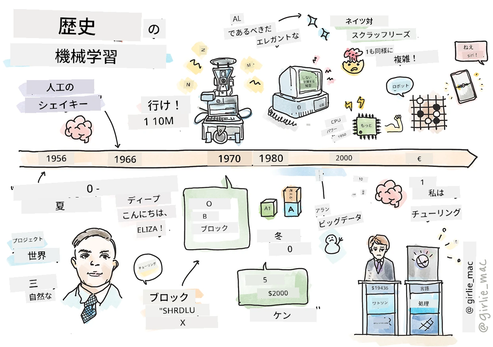
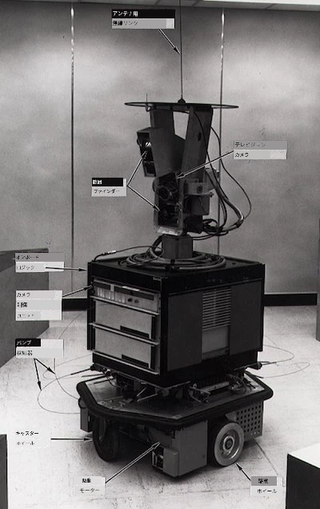
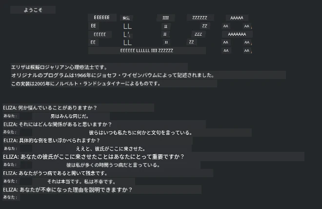

# 機械学習の歴史

> [Tomomi Imura](https://www.twitter.com/girlie_mac)によるスケッチノート

## [講義前クイズ](https://ff-quizzes.netlify.app/en/ml/)

---

> 🎥 上の画像をクリックすると、このレッスンの解説動画が見られます。

このレッスンでは、機械学習と人工知能の歴史における主要な里程標をたどります。

人工知能（AI）という分野の歴史は、機械学習の歴史と密接に絡み合っています。機械学習を支えるアルゴリズムや計算の進展がAIの発展に寄与したためです。これらの分野が1950年代に独立した研究領域として結晶化し始めた一方で、重要な[アルゴリズム、統計学、数学、計算技術や技術的発見](https://wikipedia.org/wiki/Timeline_of_machine_learning)はそれ以前から存在し、この時代と重なっています。実際、人々は[何百年も前から](https://wikipedia.org/wiki/History_of_artificial_intelligence)これらの問題について考えてきました。この文章では「思考する機械」という概念の歴史的な知的基盤について論じています。

---
## 注目すべき発見

- 1763年および1812年の[ベイズの定理](https://wikipedia.org/wiki/Bayes%27_theorem)とその前身。これは推論の基盤となり、既知の情報をもとに事象が起こる確率を記述します。
- 1805年、フランスの数学者アドリアン＝マリー・ルジャンドルによる[最小二乗法](https://wikipedia.org/wiki/Least_squares)。この理論は本コースの回帰分析単元で学び、データフィッティングに役立ちます。
- 1913年、ロシアの数学者アンドレイ・マルコフにちなんで名付けられた[マルコフ連鎖](https://wikipedia.org/wiki/Markov_chain)。これは前の状態に基づいて起こりうる事象の系列を表します。
- 1957年、アメリカの心理学者フランク・ローゼンブラットが発明した[パーセプトロン](https://wikipedia.org/wiki/Perceptron)。深層学習の進展の基礎となった線形分類器の一種です。

---

- 1967年、ルートマッピング用に設計された[近傍法](https://wikipedia.org/wiki/Nearest_neighbor)。機械学習ではパターン検出に使われます。
- 1970年、[逆伝播法](https://wikipedia.org/wiki/Backpropagation)は[フィードフォワードニューラルネットワーク](https://wikipedia.org/wiki/Feedforward_neural_network)の学習に用いられます。
- 1982年、フィードフォワードニューラルネットワークから派生した[再帰型ニューラルネットワーク](https://wikipedia.org/wiki/Recurrent_neural_network)は時系列グラフを作成します。

✅ 少し調べてみましょう。機械学習やAIの歴史で他に重要な年はありますか？

---
## 1950年：思考する機械

2019年に[一般投票で](https://wikipedia.org/wiki/Icons:_The_Greatest_Person_of_the_20th_Century)20世紀最大の科学者に選ばれたアラン・チューリングは、「思考できる機械」の概念の土台を築いた人物として知られています。彼は懐疑論者と自身の経験的証拠への必要性に取り組み、その一環として後のNLPレッスンで扱う[チューリングテスト](https://www.bbc.com/news/technology-18475646)を考案しました。

---
## 1956年：ダートマス夏季研究プロジェクト

「ダートマスの人工知能に関する夏季研究プロジェクトは、人工知能という分野にとって画期的な出来事であり、ここで『人工知能』という言葉が生まれた」（[出典](https://250.dartmouth.edu/highlights/artificial-intelligence-ai-coined-dartmouth)）

> 学習のあらゆる側面や知能のその他の特徴は、理論的には機械が模倣できるほど精密に記述可能である。

---

主任研究者の数学教授ジョン・マッカーシーは、「学習のあらゆる側面や知能の特徴が、理論的に正確に記述可能であり、機械で模倣できる」という仮説に基づいて研究を進めることを望みました。参加者には、分野のもう一人の重鎮マーヴィン・ミンスキーが含まれていました。

このワークショップは、「記号的方法の台頭、限定ドメインに特化したシステム（初期のエキスパートシステム）、演繹システムと帰納システムの対比」といった議論を促進したと評価されています。（[出典](https://wikipedia.org/wiki/Dartmouth_workshop)）

---
## 1956年〜1974年：「黄金時代」

1950年代から70年代半ばまで、AIが多くの問題を解決するという楽観論が根強くありました。1967年にマーヴィン・ミンスキーは「一世代のうちに...『人工知能』創造の問題は大部分解決されるだろう」と自信を持って述べました（Minsky, Marvin (1967), Computation: Finite and Infinite Machines, Englewood Cliffs, N.J.: Prentice-Hall）。

自然言語処理研究は盛んになり、検索手法は洗練され強力となり、『マイクロワールド』という単純なタスクを言語命令で実行する概念も生まれました。

---

研究には政府機関から潤沢な資金援助があり、計算機とアルゴリズムが進歩し、知的機械のプロトタイプも作られました。その中には次のようなものがありました：

* [Shakey the robot](https://wikipedia.org/wiki/Shakey_the_robot)、知的にタスクを遂行し動作を判断できるロボット。

    
    > 1972年のShakey

---

* 初期の『チャターボット』Elizaは人と会話し、原始的な『セラピスト』として機能しました。ElizaについてはNLPレッスンでさらに学びます。

    
    > チャットボットElizaの一例

---

* 『ブロックワールド』はブロックを積み上げたり整理したりできるマイクロワールドの例で、機械に意思決定を教える実験が行われました。 [SHRDLU](https://wikipedia.org/wiki/SHRDLU)のようなライブラリを使った進歩が言語処理の前進を後押ししました。

    

    > 🎥 上の画像をクリックすると動画が見られます：SHRDLUでのブロックワールド

---
## 1974年〜1980年：「AIの冬」

1970年代半ばまでに、「知的機械」を作ることの複雑さが過小評価されていたこと、当時の計算能力では見込みが過大評価されていたことが明らかになりました。資金は枯渇し、分野への信頼は低下しました。信頼に影響を与えた問題には以下がありました：
---
- <strong>制約</strong>。計算能力が不足していました。
- <strong>組合せ爆発</strong>。コンピュータに求められるパラメータ数が指数的に増加しましたが、計算能力や性能はそれに追いつきませんでした。
- <strong>データ不足</strong>。アルゴリズムのテスト、開発、改良を妨げるデータの不足がありました。
- **私たちは正しい問いを立てているか？**。研究者の手法に対し批判が生じ、問われることもありました：
  - チューリングテストは、『中国語の部屋』理論などで疑問視されました。この理論では「デジタルコンピュータのプログラミングは言語理解を装うが真の理解はできない」と主張されています。([出典](https://plato.stanford.edu/entries/chinese-room/))
  - 「セラピスト」Elizaのような人工知能を社会に導入する倫理的問題も議論されました。

---

同時に、様々なAIの思想が形成されました。["ラフ（scruffy）対クリーン（neat）AI"](https://wikipedia.org/wiki/Neats_and_scruffies)の二分法が確立しました。_ラフ_な研究所は望む結果を得るまでプログラムを何時間も調整しました。_クリーン_な研究所は「論理と形式的問題解決に集中」しました。ElizaやSHRDLUは有名な_ラフ_なシステムでした。1980年代には、機械学習システムの再現性の需要が高まり、_クリーン_な手法が分かりやすい結果をもたらすため主流となりました。

---
## 1980年代：エキスパートシステム

分野が成長するにしたがい、ビジネスへの恩恵が明確となり、1980年代にエキスパートシステムが普及しました。「エキスパートシステムは人工知能（AI）ソフトウェアとして最も初期の真に成功した形態の一つでした。」（[出典](https://wikipedia.org/wiki/Expert_system)）

この種のシステムは実際には_ハイブリッド_であり、ビジネス要件を定義するルールエンジンとそのルールを使い新たな事実を推論する推論エンジンで構成されています。

この時代はニューラルネットワークにも注目が集まりました。

---
## 1987年〜1993年：AIの『停滞期』

専用エキスパートシステムハードウェアの普及は専門化しすぎるという不幸な結果を招きました。パーソナルコンピュータの台頭もこれらの大型で専門的な集中システムと競合しました。コンピューティングの民主化が始まり、後にビッグデータの爆発的増加の道を開きました。

---
## 1993年〜2011年

この時代は、かつてデータ不足と計算能力の制約で生じた問題が解決され始めた新しい時代でした。データ量が急増し、スマートフォンの登場（2007年頃）を機により広く利用可能になりました。計算能力も指数関数的に増加し、アルゴリズムも進化しました。分野は成熟し、かつての自由闊達な時代から真の学問分野へと結実していきました。

---
## 現代

今日、機械学習とAIは私たちの生活のほぼすべての部分に関わっています。この時代は、これらのアルゴリズムが人間の生活に与えるリスクと潜在的影響を慎重に理解することを求めています。マイクロソフトのブラッド・スミスは「情報技術はプライバシーや表現の自由といった基本的な人権保護の核心にかかわる問題を提起します。これらの問題は、これらの製品を作る技術企業に対する責任を強めます。私たちの見解では、思慮深い政府規制と許容される使用に関する規範の策定も必要です」と述べています（[出典](https://www.technologyreview.com/2019/12/18/102365/the-future-of-ais-impact-on-society/)）。

---

未来がどうなるかはこれから分かりますが、これらのコンピュータシステムやそれを動かすソフトウェア、アルゴリズムを理解することが重要です。このカリキュラムが理解を深め、皆さん自身で判断できる助けになることを願っています。

> 🎥 上の画像をクリックすると動画が見られます：ヤン・ルカンがこの講義で深層学習の歴史を語っています

---
## 🚀チャレンジ

これらの歴史的な瞬間の一つに深く調べて、関わった人々についてもっと学びましょう。魅力的な人物が多く、科学的発見は決して文化的な真空状態で生まれたものではありません。どんな発見がありますか？

## [講義後クイズ](https://ff-quizzes.netlify.app/en/ml/)

---
## 復習 & 自主学習

以下を視聴・聴講してください：

[Amy BoydによるAIの進化を解説するポッドキャスト](http://runasradio.com/Shows/Show/739)

---

## 課題

[タイムラインを作成する](assignment.md)

---

<!-- CO-OP TRANSLATOR DISCLAIMER START -->
**免責事項**：
本書類は AI 翻訳サービス [Co-op Translator](https://github.com/Azure/co-op-translator) を使用して翻訳されています。正確性を期していますが、自動翻訳には誤りや不正確な部分が含まれる可能性があることをご承知おきください。原文の原語版が正式な情報源とみなされるべきです。重要な情報については、専門の人間による翻訳を推奨します。本翻訳の利用により生じたいかなる誤解や解釈違いについても、当方は責任を負いかねます。
<!-- CO-OP TRANSLATOR DISCLAIMER END -->