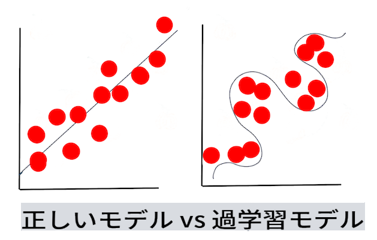

# 機械学習のテクニック

機械学習モデルを構築、使用、維持するプロセスと、それに使用するデータの管理は、他の多くの開発ワークフローとは大きく異なります。このレッスンでは、そのプロセスを解明し、知っておくべき主要なテクニックを概説します。以下のことを学びます：

- 機械学習のプロセスを高いレベルで理解する。
- 「モデル」、「予測」、「トレーニングデータ」といった基本概念を探る。

## [講義前のクイズ](https://gray-sand-07a10f403.1.azurestaticapps.net/quiz/7/)

> 🎥 上の画像をクリックすると、このレッスンの短いビデオが再生されます。

## はじめに

高いレベルでは、機械学習（ML）プロセスを作成する技術は以下のいくつかのステップから成り立っています：

1. **質問を決める**。ほとんどのMLプロセスは、単純な条件付きプログラムやルールベースのエンジンでは答えられない質問から始まります。これらの質問は、データのコレクションに基づく予測に関することが多いです。
2. **データを収集し準備する**。質問に答えるためにはデータが必要です。データの質や量が、最初の質問にどれだけうまく答えられるかを決定します。このフェーズではデータの可視化も重要です。また、データをトレーニング用とテスト用に分割してモデルを構築することも含まれます。
3. **トレーニング方法を選ぶ**。質問とデータの性質に応じて、モデルをどのようにトレーニングするかを選びます。これはMLプロセスの中で特定の専門知識が必要であり、多くの場合、かなりの実験が必要な部分です。
4. **モデルをトレーニングする**。トレーニングデータを使用して、データのパターンを認識するモデルをトレーニングします。モデルは内部の重みを調整して、データの特定の部分を他よりも優先することで、より良いモデルを構築することができます。
5. **モデルを評価する**。収集したデータセットから見たことのないデータ（テストデータ）を使用して、モデルのパフォーマンスを確認します。
6. **パラメータ調整**。モデルのパフォーマンスに基づいて、異なるパラメータやアルゴリズムを使用してプロセスを再実行することができます。
7. **予測する**。新しい入力を使用して、モデルの精度をテストします。

## どの質問をするか

コンピュータはデータの中に隠れたパターンを発見するのが得意です。この能力は、条件ベースのルールエンジンを作成するだけでは簡単に答えられない質問を持つ研究者にとって非常に役立ちます。例えば、アクチュアリアルなタスクを考えると、データサイエンティストは喫煙者と非喫煙者の死亡率に関する手作りのルールを構築できるかもしれません。

しかし、他の多くの変数が関与すると、過去の健康履歴に基づいて将来の死亡率を予測するためにMLモデルがより効率的である可能性があります。より楽しい例として、緯度、経度、気候変動、海への近さ、ジェット気流のパターンなどのデータに基づいて、特定の場所の4月の天気予測をすることが挙げられます。

✅ この[スライドデッキ](https://www2.cisl.ucar.edu/sites/default/files/2021-10/0900%20June%2024%20Haupt_0.pdf)は、天気予報モデルにおけるMLの使用に関する歴史的な視点を提供しています。

## モデル構築前のタスク

モデルを構築する前に、いくつかのタスクを完了する必要があります。質問をテストし、モデルの予測に基づいて仮説を形成するために、いくつかの要素を特定し、設定する必要があります。

### データ

質問に確実に答えるためには、適切な種類のデータが十分に必要です。この時点で行うべきことは2つあります：

- **データを収集する**。前のレッスンでデータ分析の公平性について学んだことを念頭に置き、データを慎重に収集します。このデータのソース、その中に含まれるバイアス、その出所を文書化します。
- **データを準備する**。データ準備プロセスにはいくつかのステップがあります。データを収集して正規化する必要があるかもしれません。データの質と量を向上させるために、文字列を数値に変換するなどの方法を使用することができます（[クラスタリング](../../5-Clustering/1-Visualize/README.md)で行うように）。また、元のデータに基づいて新しいデータを生成することもできます（[分類](../../4-Classification/1-Introduction/README.md)で行うように）。データをクリーンアップし、編集することもできます（[Webアプリ](../../3-Web-App/README.md)のレッスンの前に行うように）。最後に、トレーニングテクニックに応じて、データをランダム化し、シャッフルする必要があるかもしれません。

✅ データを収集し処理した後、その形状が意図した質問に答えるのに適しているか確認してください。データが与えられたタスクでうまく機能しないことがあるかもしれません（[クラスタリング](../../5-Clustering/1-Visualize/README.md)のレッスンで発見するように）。

### 特徴量とターゲット

[特徴量](https://www.datasciencecentral.com/profiles/blogs/an-introduction-to-variable-and-feature-selection)はデータの測定可能な特性です。多くのデータセットでは、「日付」、「サイズ」、「色」などの列見出しとして表現されます。特徴量変数は通常コードでは`X`として表され、モデルをトレーニングするために使用される入力変数を表します。

ターゲットは予測しようとしているものです。ターゲットは通常コードでは`y`として表され、データに対して尋ねようとしている質問の答えを表します：12月にはどの**色**のカボチャが最も安いのか？サンフランシスコではどの地区が最も良い不動産**価格**を持つのか？ターゲットはラベル属性とも呼ばれることがあります。

### 特徴量変数の選択

🎓 **特徴選択と特徴抽出** モデルを構築する際にどの変数を選択するかどうかをどうやって知るのか？おそらく特徴選択や特徴抽出のプロセスを経て、最もパフォーマンスの良いモデルのための適切な変数を選ぶことになるでしょう。しかし、これらは同じことではありません：「特徴抽出は元の特徴の関数から新しい特徴を作成するのに対し、特徴選択は特徴のサブセットを返します。」（[出典](https://wikipedia.org/wiki/Feature_selection)）

### データの可視化

データサイエンティストのツールキットの重要な側面は、SeabornやMatPlotLibのような優れたライブラリを使用してデータを可視化する力です。データを視覚的に表現することで、活用できる隠れた相関関係を見つけることができます。また、バイアスや不均衡なデータを発見するのにも役立ちます（[分類](../../4-Classification/2-Classifiers-1/README.md)で発見するように）。

### データセットの分割

トレーニングの前に、データセットを不均等なサイズの2つ以上の部分に分割し、それでもデータをよく表現する必要があります。

- **トレーニング**。データセットのこの部分は、モデルにフィットしてトレーニングします。このセットは元のデータセットの大部分を構成します。
- **テスト**。テストデータセットは、元のデータから収集された独立したデータのグループで、構築されたモデルのパフォーマンスを確認するために使用します。
- **検証**。検証セットは、モデルのハイパーパラメータやアーキテクチャを調整してモデルを改善するために使用する小さな独立したデータのグループです。データのサイズと質問に応じて、この3つ目のセットを構築する必要がないかもしれません（[時系列予測](../../7-TimeSeries/1-Introduction/README.md)で注目するように）。

## モデルの構築

トレーニングデータを使用して、さまざまなアルゴリズムを使用してデータの統計的表現であるモデルを構築することが目標です。モデルをトレーニングすることで、データに対する仮定を行い、発見したパターンを検証し、受け入れたり拒否したりします。

### トレーニング方法を決定する

質問とデータの性質に応じて、トレーニング方法を選択します。このコースで使用する[Scikit-learnのドキュメント](https://scikit-learn.org/stable/user_guide.html)をステップバイステップで進めることで、モデルをトレーニングするための多くの方法を探ることができます。経験に応じて、最適なモデルを構築するためにいくつかの異なる方法を試す必要があるかもしれません。データサイエンティストが未見のデータをフィードしてモデルのパフォーマンスを評価し、精度、バイアス、その他の品質低下の問題をチェックし、タスクに最も適したトレーニング方法を選択するプロセスを経ることが多いです。

### モデルをトレーニングする

トレーニングデータを用意したら、モデルを「フィット」させる準備が整います。多くのMLライブラリでは、「model.fit」というコードを見つけることができます。このときに特徴量変数（通常は「X」）とターゲット変数（通常は「y」）を値の配列として送信します。

### モデルを評価する

トレーニングプロセスが完了すると（大規模なモデルをトレーニングするには多くの反復や「エポック」が必要な場合があります）、テストデータを使用してモデルのパフォーマンスを評価することができます。このデータは、モデルが以前に分析していない元のデータのサブセットです。モデルの品質に関するメトリクスのテーブルを印刷することができます。

🎓 **モデルのフィッティング**

機械学習の文脈では、モデルのフィッティングとは、モデルの基礎となる関数が未知のデータを分析しようとする際の精度を指します。

🎓 **アンダーフィッティング**と**オーバーフィッティング**は、モデルの品質を低下させる一般的な問題です。モデルがトレーニングデータに対して適合しすぎるか、適合しなさすぎるかのいずれかです。オーバーフィットしたモデルは、データの詳細やノイズを学びすぎるため、トレーニングデータを非常によく予測します。アンダーフィットしたモデルは、トレーニングデータも未知のデータも正確に分析できないため、精度が低いです。

> インフォグラフィック by [Jen Looper](https://twitter.com/jenlooper)

## パラメータ調整

初期トレーニングが完了したら、モデルの品質を観察し、「ハイパーパラメータ」を調整することで改善することを考えます。プロセスの詳細は[ドキュメント](https://docs.microsoft.com/en-us/azure/machine-learning/how-to-tune-hyperparameters?WT.mc_id=academic-77952-leestott)を参照してください。

## 予測

これは、完全に新しいデータを使用してモデルの精度をテストする瞬間です。「応用」ML設定では、モデルを実際に使用するためのWebアセットを構築する場合、このプロセスはユーザー入力（例えばボタンの押下）を収集し、変数を設定してモデルに推論または評価のために送信することを含むかもしれません。

これらのレッスンでは、準備、構築、テスト、評価、予測のステップを使用して、データサイエンティストとしてのジェスチャーを学び、より「フルスタック」なMLエンジニアになるための旅を進めていきます。

---

## 🚀チャレンジ

ML実践者のステップを反映したフローチャートを描いてください。現在のプロセスのどこにいると感じますか？どこで困難を感じると予測しますか？何が簡単に感じますか？

## [講義後のクイズ](https://gray-sand-07a10f403.1.azurestaticapps.net/quiz/8/)

## 復習と自主学習

データサイエンティストが日常の仕事について話しているインタビューをオンラインで検索してください。ここに[一例](https://www.youtube.com/watch?v=Z3IjgbbCEfs)があります。

## 課題

[データサイエンティストにインタビューする](assignment.md)

**免責事項**:
この文書は機械ベースのAI翻訳サービスを使用して翻訳されています。正確性を期すため努力しておりますが、自動翻訳には誤りや不正確さが含まれる可能性があることをご理解ください。原文はその言語での正式な文書と見なされるべきです。重要な情報については、専門の人間による翻訳をお勧めします。この翻訳の使用に起因する誤解や誤訳について、当方は一切の責任を負いません。