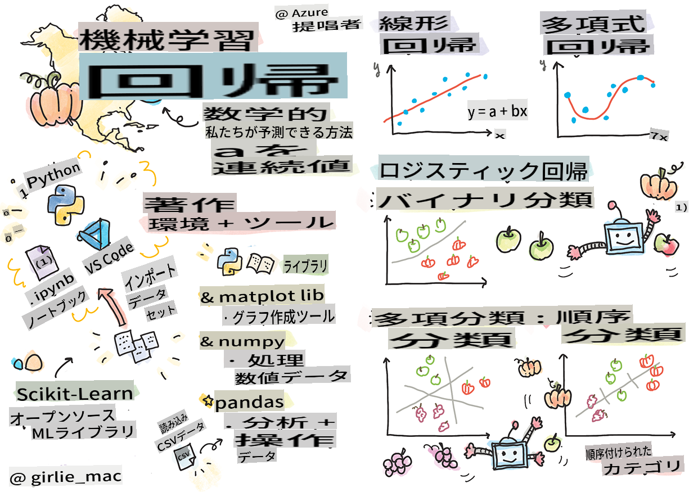
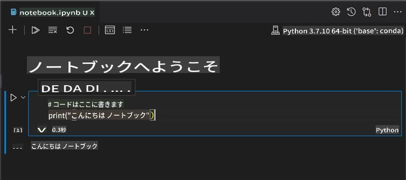
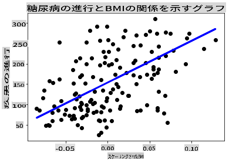

# PythonとScikit-learnで回帰モデルを始めよう



> スケッチノート by [Tomomi Imura](https://www.twitter.com/girlie_mac)

## [プレレクチャークイズ](https://gray-sand-07a10f403.1.azurestaticapps.net/quiz/9/)

> ### [このレッスンはRでも利用可能です！](../../../../2-Regression/1-Tools/solution/R/lesson_1.html)

## はじめに

これらの4つのレッスンで、回帰モデルの構築方法を学びます。これが何のためにあるのかについては、すぐに説明します。しかし、何かを始める前に、プロセスを開始するための適切なツールが揃っていることを確認してください！

このレッスンでは、以下のことを学びます：

- ローカル機械学習タスクのためにコンピュータを設定する方法
- Jupyterノートブックの使用方法
- Scikit-learnのインストールと使用方法
- ハンズオンエクササイズで線形回帰を探求する方法

## インストールと設定

[](https://youtu.be/-DfeD2k2Kj0 "ML for beginners -Setup your tools ready to build Machine Learning models")

> 🎥 上の画像をクリックして、コンピュータをML用に設定する短いビデオをご覧ください。

1. **Pythonをインストールする**。コンピュータに[Python](https://www.python.org/downloads/)がインストールされていることを確認してください。Pythonは多くのデータサイエンスや機械学習タスクで使用されます。ほとんどのコンピュータシステムには既にPythonがインストールされています。一部のユーザーにとってセットアップを簡単にするための便利な[Python Coding Packs](https://code.visualstudio.com/learn/educators/installers?WT.mc_id=academic-77952-leestott)もあります。

   ただし、Pythonの使用法によっては、特定のバージョンが必要な場合があります。そのため、[仮想環境](https://docs.python.org/3/library/venv.html)で作業することが便利です。

2. **Visual Studio Codeをインストールする**。コンピュータにVisual Studio Codeがインストールされていることを確認してください。基本的なインストール手順については、[Visual Studio Codeのインストール](https://code.visualstudio.com/)に従ってください。このコースではVisual Studio CodeでPythonを使用するので、[Visual Studio CodeのPython開発用の設定](https://docs.microsoft.com/learn/modules/python-install-vscode?WT.mc_id=academic-77952-leestott)についても確認しておくと良いでしょう。

   > このコレクションの[Learnモジュール](https://docs.microsoft.com/users/jenlooper-2911/collections/mp1pagggd5qrq7?WT.mc_id=academic-77952-leestott)を通してPythonに慣れてください。
   >
   > [](https://youtu.be/yyQM70vi7V8 "Setup Python with Visual Studio Code")
   >
   > 🎥 上の画像をクリックして、VS Code内でPythonを使用するビデオをご覧ください。

3. **Scikit-learnをインストールする**。詳細は[こちらの手順](https://scikit-learn.org/stable/install.html)に従ってください。Python 3を使用する必要があるため、仮想環境を使用することをお勧めします。M1 Macにこのライブラリをインストールする場合は、上記のページに特別な指示があります。

4. **Jupyter Notebookをインストールする**。 [Jupyterパッケージ](https://pypi.org/project/jupyter/)をインストールする必要があります。

## あなたのML著作環境

**ノートブック**を使用してPythonコードを開発し、機械学習モデルを作成します。このタイプのファイルはデータサイエンティストにとって一般的なツールであり、拡張子`.ipynb`で識別できます。

ノートブックは、開発者がコードを書くだけでなく、コードに関するメモやドキュメントを追加することができるインタラクティブな環境であり、実験的または研究指向のプロジェクトに非常に役立ちます。

[](https://youtu.be/7E-jC8FLA2E "ML for beginners - Set up Jupyter Notebooks to start building regression models")

> 🎥 上の画像をクリックして、このエクササイズを進める短いビデオをご覧ください。

### エクササイズ - ノートブックを使う

このフォルダには、_notebook.ipynb_というファイルがあります。

1. _notebook.ipynb_をVisual Studio Codeで開きます。

   JupyterサーバーがPython 3+で起動します。ノートブックの中には`run`、コードの部分があります。再生ボタンのようなアイコンを選択してコードブロックを実行できます。

1. `md`アイコンを選択し、マークダウンを少し追加し、次のテキストを追加します **# Welcome to your notebook**。

   次に、Pythonコードを追加します。

1. コードブロックに**print('hello notebook')**と入力します。
1. 矢印を選択してコードを実行します。

   以下の出力が表示されるはずです：

    ```output
    hello notebook
    ```



コードとコメントを交互に記述してノートブックを自己文書化できます。

✅ ウェブ開発者の作業環境とデータサイエンティストの作業環境の違いについて少し考えてみてください。

## Scikit-learnのセットアップ

Pythonがローカル環境に設定され、Jupyterノートブックに慣れたところで、次はScikit-learnに慣れていきましょう（発音は `sci` as in `science`）。Scikit-learnはMLタスクを実行するための[広範なAPI](https://scikit-learn.org/stable/modules/classes.html#api-ref)を提供しています。

彼らの[ウェブサイト](https://scikit-learn.org/stable/getting_started.html)によると、「Scikit-learnは、教師あり学習と教師なし学習をサポートするオープンソースの機械学習ライブラリです。また、モデルフィッティング、データ前処理、モデル選択と評価、その他多くのユーティリティのためのさまざまなツールを提供します。」

このコースでは、Scikit-learnやその他のツールを使用して、いわゆる「伝統的な機械学習」タスクを実行するための機械学習モデルを構築します。ニューラルネットワークやディープラーニングは含まれていませんが、それらについては今後の「AI for Beginners」カリキュラムで詳しく取り上げます。

Scikit-learnはモデルの構築と評価を簡単に行えるようにします。主に数値データの使用に焦点を当てており、学習ツールとして使用できるいくつかの既成のデータセットも含まれています。また、学生が試すための事前構築されたモデルも含まれています。パッケージ化されたデータを読み込み、基本的なデータを使用してScikit-learnで最初のMLモデルを構築するプロセスを探りましょう。

## エクササイズ - 初めてのScikit-learnノートブック

> このチュートリアルは、Scikit-learnのウェブサイトにある[線形回帰の例](https://scikit-learn.org/stable/auto_examples/linear_model/plot_ols.html#sphx-glr-auto-examples-linear-model-plot-ols-py)に触発されました。

[](https://youtu.be/2xkXL5EUpS0 "ML for beginners - Your First Linear Regression Project in Python")

> 🎥 上の画像をクリックして、このエクササイズを進める短いビデオをご覧ください。

このレッスンに関連する_notebook.ipynb_ファイル内のすべてのセルをゴミ箱アイコンを押してクリアします。

このセクションでは、学習目的でScikit-learnに組み込まれている糖尿病に関する小さなデータセットを使用します。糖尿病患者の治療をテストしたいと考えているとします。機械学習モデルは、変数の組み合わせに基づいて、どの患者が治療に反応しやすいかを判断するのに役立つかもしれません。非常に基本的な回帰モデルでも、視覚化すると、理論的な臨床試験を整理するのに役立つ変数に関する情報を示すかもしれません。

✅ 回帰方法には多くの種類があり、どの方法を選ぶかは求める答えによって異なります。ある年齢の人の予想身長を予測したい場合は、線形回帰を使用します。なぜなら、**数値の値**を求めているからです。ある料理がビーガンかどうかを調べたい場合は、**カテゴリの割り当て**を求めているので、ロジスティック回帰を使用します。ロジスティック回帰については後で詳しく学びます。データに対してどのような質問をすることができるか、そしてどの方法が適切かについて少し考えてみてください。

このタスクを始めましょう。

### ライブラリをインポートする

このタスクのためにいくつかのライブラリをインポートします：

- **matplotlib**。便利な[グラフツール](https://matplotlib.org/)で、ラインプロットを作成するために使用します。
- **numpy**。 [numpy](https://numpy.org/doc/stable/user/whatisnumpy.html)は、Pythonで数値データを扱うのに便利なライブラリです。
- **sklearn**。これは[Scikit-learn](https://scikit-learn.org/stable/user_guide.html)ライブラリです。

タスクを助けるためにいくつかのライブラリをインポートします。

1. 次のコードを入力してインポートを追加します：

   ```python
   import matplotlib.pyplot as plt
   import numpy as np
   from sklearn import datasets, linear_model, model_selection
   ```

   上記では、`matplotlib`, `numpy` and you are importing `datasets`, `linear_model` and `model_selection` from `sklearn`. `model_selection` is used for splitting data into training and test sets.

### The diabetes dataset

The built-in [diabetes dataset](https://scikit-learn.org/stable/datasets/toy_dataset.html#diabetes-dataset) includes 442 samples of data around diabetes, with 10 feature variables, some of which include:

- age: age in years
- bmi: body mass index
- bp: average blood pressure
- s1 tc: T-Cells (a type of white blood cells)

✅ This dataset includes the concept of 'sex' as a feature variable important to research around diabetes. Many medical datasets include this type of binary classification. Think a bit about how categorizations such as this might exclude certain parts of a population from treatments.

Now, load up the X and y data.

> 🎓 Remember, this is supervised learning, and we need a named 'y' target.

In a new code cell, load the diabetes dataset by calling `load_diabetes()`. The input `return_X_y=True` signals that `X` will be a data matrix, and `y`は回帰ターゲットになります。

1. データマトリックスの形状とその最初の要素を表示するためにいくつかのprintコマンドを追加します：

    ```python
    X, y = datasets.load_diabetes(return_X_y=True)
    print(X.shape)
    print(X[0])
    ```

    返される応答はタプルです。タプルの最初の2つの値をそれぞれ`X` and `y`に割り当てています。 [タプルについて](https://wikipedia.org/wiki/Tuple)の詳細を学びましょう。

    このデータは10個の要素で構成された配列の442アイテムがあることがわかります：

    ```text
    (442, 10)
    [ 0.03807591  0.05068012  0.06169621  0.02187235 -0.0442235  -0.03482076
    -0.04340085 -0.00259226  0.01990842 -0.01764613]
    ```

    ✅ データと回帰ターゲットの関係について少し考えてみてください。線形回帰は特徴量Xとターゲット変数yの関係を予測します。このドキュメントで糖尿病データセットの[ターゲット](https://scikit-learn.org/stable/datasets/toy_dataset.html#diabetes-dataset)を見つけることができますか？ターゲットを考えると、このデータセットは何を示しているのでしょうか？

2. 次に、このデータセットの一部を選択してプロットするために、データセットの3番目の列を選択します。これは`：` operator to select all rows, and then selecting the 3rd column using the index (2). You can also reshape the data to be a 2D array - as required for plotting - by using `reshape(n_rows, n_columns)`を使用して行うことができます。パラメータの1つが-1の場合、対応する次元は自動的に計算されます。

   ```python
   X = X[:, 2]
   X = X.reshape((-1,1))
   ```

   ✅ いつでもデータを印刷してその形状を確認してください。

3. データがプロットする準備ができたら、このデータセットの数値間に論理的な分割を見つけるために機械を使用できるかどうかを確認できます。これを行うには、データ（X）とターゲット（y）の両方をテストセットとトレーニングセットに分割する必要があります。Scikit-learnにはこれを簡単に行う方法があります。指定したポイントでテストデータを分割できます。

   ```python
   X_train, X_test, y_train, y_test = model_selection.train_test_split(X, y, test_size=0.33)
   ```

4. モデルをトレーニングする準備ができました！線形回帰モデルをロードし、Xとyのトレーニングセットを使用して`model.fit()`でトレーニングします：

    ```python
    model = linear_model.LinearRegression()
    model.fit(X_train, y_train)
    ```

    ✅ `model.fit()` is a function you'll see in many ML libraries such as TensorFlow

5. Then, create a prediction using test data, using the function `predict()`。これはデータグループ間に線を引くために使用されます。

    ```python
    y_pred = model.predict(X_test)
    ```

6. データをプロットに表示する時が来ました。Matplotlibはこのタスクに非常に便利なツールです。すべてのXとyテストデータの散布図を作成し、モデルのデータグループ間に最も適切な場所に線を引くために予測を使用します。

    ```python
    plt.scatter(X_test, y_test,  color='black')
    plt.plot(X_test, y_pred, color='blue', linewidth=3)
    plt.xlabel('Scaled BMIs')
    plt.ylabel('Disease Progression')
    plt.title('A Graph Plot Showing Diabetes Progression Against BMI')
    plt.show()
    ```

   

   ✅ ここで何が起こっているのか少し考えてみてください。多くの小さなデータ点の間に一直線が引かれていますが、具体的に何をしているのでしょうか？この線を使用して、新しい見えないデータポイントがプロットのy軸との関係でどこにフィットするべきかを予測できることがわかりますか？このモデルの実際の使用法を言葉で表現してみてください。

おめでとうございます、最初の線形回帰モデルを構築し、それを使用して予測を作成し、プロットに表示しました！

---
## 🚀チャレンジ

このデータセットから別の変数をプロットしてください。ヒント：この行を編集します：`X = X[:,2]`。このデータセットのターゲットを考えると、糖尿病の進行について何を発見できるでしょうか？
## [ポストレクチャークイズ](https://gray-sand-07a10f403.1.azurestaticapps.net/quiz/10/)

## レビュー＆自己学習

このチュートリアルでは、単回帰ではなく、単変量回帰または多重回帰を使用しました。これらの方法の違いについて少し読んでみるか、[このビデオ](https://www.coursera.org/lecture/quantifying-relationships-regression-models/linear-vs-nonlinear-categorical-variables-ai2Ef)を見てみてください。

回帰の概念についてさらに読み、どのような質問にこの技術で答えることができるか考えてみてください。この[チュートリアル](https://docs.microsoft.com/learn/modules/train-evaluate-regression-models?WT.mc_id=academic-77952-leestott)を受けて、理解を深めてください。

## 課題

[別のデータセット](assignment.md)

**免責事項**:
この文書は機械翻訳AIサービスを使用して翻訳されています。正確さを期すために努力しておりますが、自動翻訳には誤りや不正確さが含まれる場合があります。原文の言語で書かれた文書を権威ある情報源とみなすべきです。重要な情報については、専門の人間による翻訳を推奨します。この翻訳の使用に起因する誤解や誤った解釈について、当社は一切の責任を負いません。