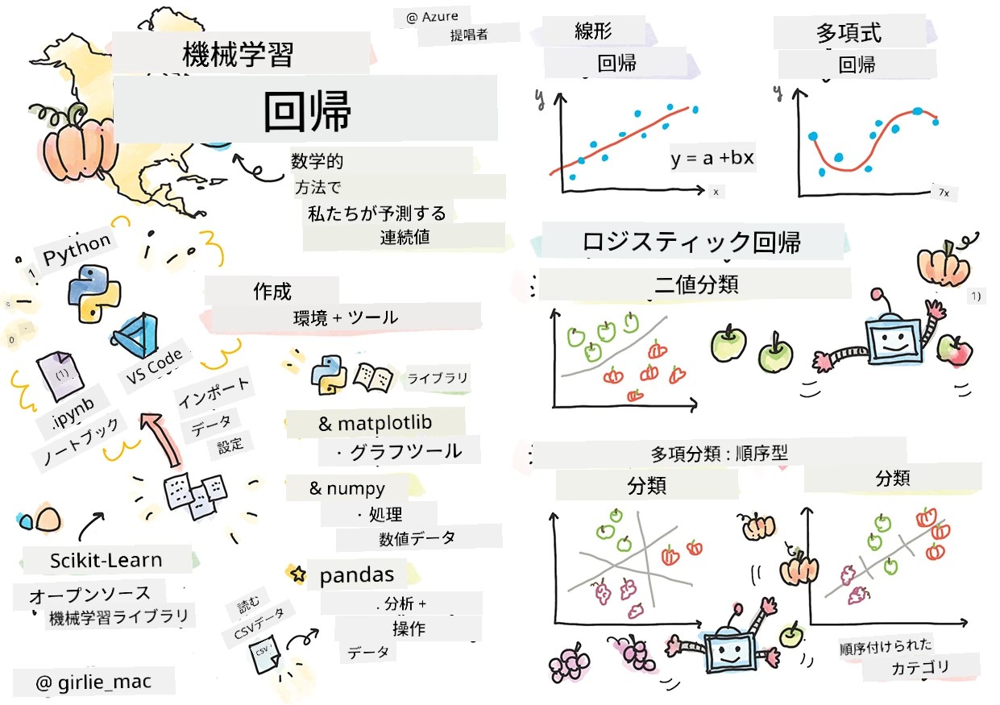
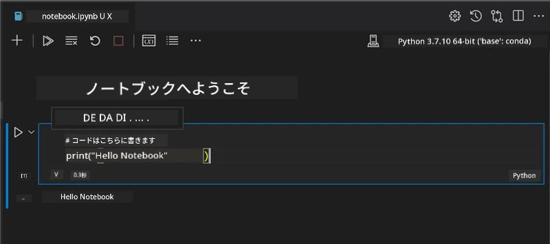
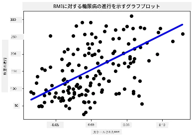

# PythonとScikit-learnで回帰モデルを始めよう



> スケッチノート: [Tomomi Imura](https://www.twitter.com/girlie_mac)

## [事前講義クイズ](https://ff-quizzes.netlify.app/en/ml/)

> ### [このレッスンはRでも利用可能です！](../../../../2-Regression/1-Tools/solution/R/lesson_1.html)

## はじめに

この4つのレッスンで、回帰モデルの構築方法を学びます。これらが何のために使われるかをすぐに説明します。その前に、プロセスを始めるために適切なツールが揃っていることを確認しましょう！

このレッスンでは、以下を学びます:

- ローカルでの機械学習タスクのためにコンピューターの設定を行う方法。
- Jupyterノートブックの使い方。
- Scikit-learnの使用方法（インストールを含む）。
- 実践演習で線形回帰を探究する。

## インストールと設定

[](https://youtu.be/-DfeD2k2Kj0 "初心者向け機械学習 - 機械学習モデル構築準備のためのツールセットアップ")

> 🎥 上の画像をクリックすると、機械学習用コンピューターの設定を解説する短い動画が視聴できます。

1. **Pythonをインストール**。[Python](https://www.python.org/downloads/)がコンピューターにインストールされていることを確認してください。Pythonは多くのデータサイエンスや機械学習タスクに利用されます。ほとんどのコンピューターには既にPythonがインストールされています。セットアップが簡単になるように、便利な [Python Coding Packs](https://code.visualstudio.com/learn/educators/installers?WT.mc_id=academic-77952-leestott) も利用可能です。

   しかし、Pythonの用途によっては異なるバージョンが必要となる場合があり、そのために [仮想環境](https://docs.python.org/3/library/venv.html) を使うことが有効です。

2. **Visual Studio Codeをインストール**。コンピューターにVisual Studio Codeがインストールされていることを確認してください。基本インストールについては、[Visual Studio Codeをインストールする手順](https://code.visualstudio.com/)に従ってください。このコースではVisual Studio Code上でPythonを使うので、[Python開発用にVisual Studio Codeを設定する方法](https://docs.microsoft.com/learn/modules/python-install-vscode?WT.mc_id=academic-77952-leestott)も確認しておくと良いでしょう。

   > このコレクションの [学習モジュール](https://docs.microsoft.com/users/jenlooper-2911/collections/mp1pagggd5qrq7?WT.mc_id=academic-77952-leestott) に取り組みながらPythonに慣れましょう。
   >
   > [](https://youtu.be/yyQM70vi7V8 "Visual Studio CodeでPythonをセットアップ")
   >
   > 🎥 上の画像をクリックするとVS Code内でPythonを使う動画が視聴できます。

3. **Scikit-learnをインストール**。[こちらの手順](https://scikit-learn.org/stable/install.html)に従ってください。Python 3を使う必要があるため、仮想環境の利用をお勧めします。M1 Macでインストールする場合は、リンク先に特別な指示があります。

4. **Jupyter Notebookをインストール**。[Jupyterパッケージ](https://pypi.org/project/jupyter/)をインストールしてください。

## あなたのML開発環境

ノートブックを使ってPythonコードを書き、機械学習モデルを作成します。この種のファイルはデータサイエンティストに一般的で、拡張子 `.ipynb` で識別できます。

ノートブックはインタラクティブな環境で、コードだけでなくメモやドキュメントを書くことができ、実験や研究志向のプロジェクトに非常に役立ちます。

[](https://youtu.be/7E-jC8FLA2E "初心者向け機械学習 - Jupyterノートブックのセットアップで回帰モデルを構築開始")

> 🎥 上の画像をクリックすると、この演習の解説動画が視聴できます。

### 演習 - ノートブックを使ってみる

このフォルダーに _notebook.ipynb_ ファイルがあります。

1. Visual Studio Codeで _notebook.ipynb_ を開きます。

   JupyterサーバーがPython 3+で起動します。ノートブック内には `run` 可能なコードブロックがあります。再生ボタンのようなアイコンを選択してコードブロックを実行できます。

2. `md` アイコンを選択し、少しマークダウンを書き、次のテキストを追加します：**# Welcome to your notebook**。

   次に、Pythonコードを追加します。

3. コードブロックに **print('hello notebook')** と入力します。
4. 実行矢印を選択してコードを実行します。

   出力は次のように表示されるはずです：

    ```output
    hello notebook
    ```



コードにコメントを挟みながらノートブックを自己文書化することもできます。

✅ ウェブ開発者の作業環境とデータサイエンティストの環境の違いについて少し考えてみましょう。

## Scikit-learnを使いこなそう

Pythonがローカル環境に設定され、Jupyterノートブックに慣れたら、Scikit-learn（`sci`は「サイエンス」の発音に似ています）も同様に使いこなしましょう。Scikit-learnは機械学習タスクをサポートする[豊富なAPI](https://scikit-learn.org/stable/modules/classes.html#api-ref)を提供します。

[公式サイト](https://scikit-learn.org/stable/getting_started.html)によると、「Scikit-learnは、教師あり学習と教師なし学習をサポートするオープンソースの機械学習ライブラリです。また、モデルフィッティング、データ前処理、モデル選択と評価、その他多くのユーティリティも提供しています。」

このコースでは、Scikit-learnなどのツールを使って、いわゆる「伝統的な機械学習」タスクを実行するモデルを構築します。ニューラルネットワークやディープラーニングは扱わず、後の「初心者向けAI」カリキュラムで詳しく扱います。

Scikit-learnはモデル構築と評価を簡単に行えるよう設計されており、主に数値データを扱い、学習用の既製データセットもいくつか備えています。学生が試せる事前構築モデルも含まれています。まずは、パッケージ済みデータの読み込みと組み込み推定器を使った初めてのMLモデルを基本データで試してみましょう。

## 演習 - Scikit-learnノートブックで最初のモデルを作る

> このチュートリアルはScikit-learnのウェブサイトにある[線形回帰の例](https://scikit-learn.org/stable/auto_examples/linear_model/plot_ols.html#sphx-glr-auto-examples-linear-model-plot-ols-py)を参考にしています。


[](https://youtu.be/2xkXL5EUpS0 "初心者向け機械学習 - Pythonで最初の線形回帰プロジェクト")

> 🎥 上の画像をクリックすると、この演習を解説する短い動画が視聴できます。

_notebook.ipynb_ ファイルでは、すべてのセルを「ゴミ箱」アイコンを押してクリアしてください。

このセクションでは、学習用にScikit-learnに組み込まれている糖尿病に関する小さなデータセットで作業します。糖尿病患者の治療法をテストする場合を想像してください。機械学習モデルは、複数の変数の組み合わせに基づいて、どの患者が治療により良い反応を示すかを判断するのに役立つかもしれません。とても基本的な回帰モデルでも視覚化することで、理論的な臨床試験のための変数に関する情報が得られるかもしれません。

✅ 回帰方法には様々なタイプがあり、どれを選ぶかは答えたい質問によります。年齢に対する推定身長など、<strong>数値的な値</strong>を予測したい場合は線形回帰を使います。料理の種類がビーガンかどうかの<strong>カテゴリー割り当て</strong>を知りたい場合はロジスティック回帰を使います。ロジスティック回帰は後で詳しく学びます。データに対してどんな質問をできるか、どの方法が適切か少し考えてみてください。

では、このタスクを始めましょう。

### ライブラリのインポート

このタスクのために次のライブラリをインポートします:

- **matplotlib**。便利な[グラフ作成ツール](https://matplotlib.org/)で、折れ線グラフを作るのに使います。
- **numpy**。[numpy](https://numpy.org/doc/stable/user/whatisnumpy.html)はPythonで数値データを扱うライブラリです。
- **sklearn**。これは[Scikit-learn](https://scikit-learn.org/stable/user_guide.html)ライブラリです。

作業に役立つライブラリをインポートします。

1. 以下のコードを入力してインポートします：

   ```python
   import matplotlib.pyplot as plt
   import numpy as np
   from sklearn import datasets, linear_model, model_selection
   ```

   ここでは `matplotlib` と `numpy` をインポートし、`sklearn` からは `datasets` 、 `linear_model` 、 `model_selection` をインポートしています。`model_selection` はデータを訓練用とテスト用に分割するのに使います。

### 糖尿病データセット

組み込みの [糖尿病データセット](https://scikit-learn.org/stable/datasets/toy_dataset.html#diabetes-dataset)は、442のサンプルを含み、10の特徴変数があります。主なものは以下です：

- age: 年齢（歳）
- bmi: 体格指数
- bp: 平均血圧
- s1 tc: T細胞（白血球の一種）

✅ このデータセットには糖尿病研究で重要な特徴変数として「性別」が含まれています。多くの医療データセットにはこの種の二値分類が含まれます。こうした分類が特定の集団を治療から排除する可能性について少し考えてみてください。

では、Xとyのデータを読み込みます。

> 🎓 これは教師あり学習であり、名前付きの「y」ターゲットが必要です。

新しいコードセルで、`load_diabetes()` を使って糖尿病データセットを読み込みます。引数 `return_X_y=True` は `X` がデータ行列、`y` が回帰ターゲットであることを示します。

1. データ行列の形状と最初の要素を表示するために、次のprint文を追加します：

    ```python
    X, y = datasets.load_diabetes(return_X_y=True)
    print(X.shape)
    print(X[0])
    ```

    返されるのはタプルです。最初の2つの値をそれぞれ `X` と `y` に割り当てています。[タプル](https://wikipedia.org/wiki/Tuple)について学びましょう。

    このデータが442項目で、それぞれ10要素の配列で構成されていることがわかります：

    ```text
    (442, 10)
    [ 0.03807591  0.05068012  0.06169621  0.02187235 -0.0442235  -0.03482076
    -0.04340085 -0.00259226  0.01990842 -0.01764613]
    ```

    ✅ データと回帰ターゲットの関係について少し考えてみましょう。線形回帰は特徴量Xとターゲット変数yの関係を予測します。糖尿病データセットの[ターゲット](https://scikit-learn.org/stable/datasets/toy_dataset.html#diabetes-dataset)はドキュメントで何を示しているでしょうか？このデータセットが示す内容は何でしょう？

2. 次に、データセットの3列目を選択してプロット用のデータを用意します。`:` 操作子で全行を選び、インデックス `2` で3列目を選択します。プロットに必要な2次元配列に変換するには `reshape(n_rows, n_columns)` を使います。 `-1` を指定すると、その次元は自動的に計算されます。

   ```python
   X = X[:, 2]
   X = X.reshape((-1,1))
   ```

   ✅ 必要なら都度データの形状をプリントして確認しましょう。

3. プロット準備ができたら、データの論理的な分割を機械に判別させてみましょう。そのために、データ(X)とターゲット(y)を訓練用とテスト用に分割します。Scikit-learnはこれを簡単に行える方法があります。任意の点でデータを分割できます。

   ```python
   X_train, X_test, y_train, y_test = model_selection.train_test_split(X, y, test_size=0.33)
   ```

4. これでモデルの訓練準備ができました！線形回帰モデルをロードし、`model.fit()` を使ってXとyの訓練セットで学習させましょう：

    ```python
    model = linear_model.LinearRegression()
    model.fit(X_train, y_train)
    ```

    ✅ `model.fit()` はTensorFlowなど多くのMLライブラリで使われる関数です。

5. 次に `predict()` 関数を使ってテストデータから予測を作成します。これはデータグループの間に線を描くために使います。

    ```python
    y_pred = model.predict(X_test)
    ```

6. 最後にデータをプロットしてみましょう。Matplotlibはこの作業に非常に便利なツールです。テスト用のXとyの散布図を作成し、予測を使ってモデルのデータグループ間に最も適切な場所に線を引きます。

    ```python
    plt.scatter(X_test, y_test,  color='black')
    plt.plot(X_test, y_pred, color='blue', linewidth=3)
    plt.xlabel('Scaled BMIs')
    plt.ylabel('Disease Progression')
    plt.title('A Graph Plot Showing Diabetes Progression Against BMI')
    plt.show()
    ```

   


   ✅ ここで何が起こっているのか少し考えてみてください。直線が多くの小さなデータ点の間を通っていますが、それは正確には何をしているのでしょうか？ この直線を使って、新しい、見たことのないデータ点がプロットのy軸に対してどこに位置するべきか予測できることがわかりますか？ このモデルの実用的な使い道を言葉にしてみましょう。

おめでとうございます、あなたは最初の線形回帰モデルを構築し、それを使って予測を作成し、それをプロットに表示しました！

---
## 🚀チャレンジ

このデータセットの別の変数をプロットしてみましょう。ヒント：この行を編集してください：`X = X[:,2]`。このデータセットのターゲットを考慮して、糖尿病という病気の進行について何がわかりますか？
## [講義後クイズ](https://ff-quizzes.netlify.app/en/ml/)

## 復習と自己学習

このチュートリアルでは、単回帰を使いましたが、多変量回帰や単変量回帰とは異なります。これらの方法の違いについて少し読んでみるか、[この動画](https://www.coursera.org/lecture/quantifying-relationships-regression-models/linear-vs-nonlinear-categorical-variables-ai2Ef)をご覧ください。

回帰という概念についてより深く理解し、この技術でどのような疑問に答えられるか考えてみましょう。理解を深めるためにこの[チュートリアル](https://docs.microsoft.com/learn/modules/train-evaluate-regression-models?WT.mc_id=academic-77952-leestott)を受講してください。

## 課題

[別のデータセット](assignment.md)

---

<!-- CO-OP TRANSLATOR DISCLAIMER START -->
**免責事項**：
本書類は AI 翻訳サービス [Co-op Translator](https://github.com/Azure/co-op-translator) を使用して翻訳されています。正確性を期していますが、自動翻訳には誤りや不正確な部分が含まれる可能性があることをご承知おきください。原文の原語版が正式な情報源とみなされるべきです。重要な情報については、専門の人間による翻訳を推奨します。本翻訳の利用により生じたいかなる誤解や解釈違いについても、当方は責任を負いかねます。
<!-- CO-OP TRANSLATOR DISCLAIMER END -->