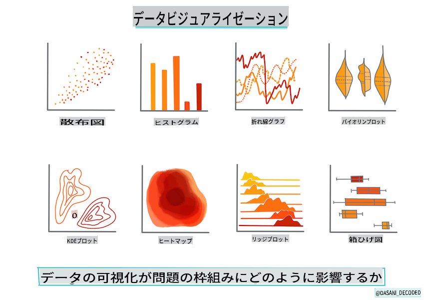
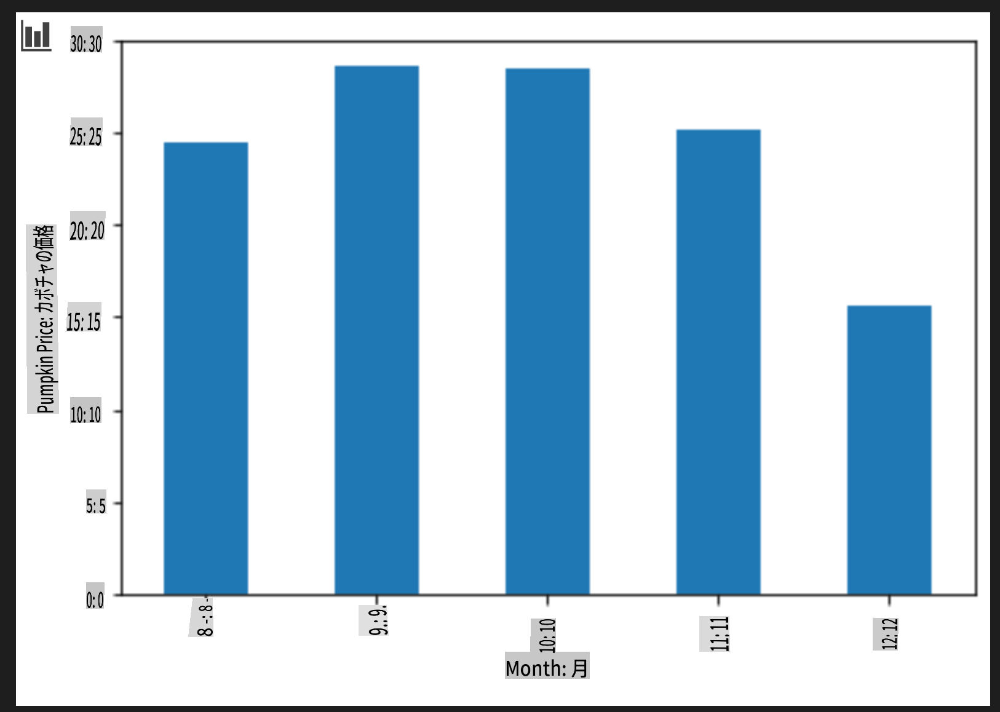

# Scikit-learnで回帰モデルを構築する: データの準備と可視化



インフォグラフィック作成者: [Dasani Madipalli](https://twitter.com/dasani_decoded)

## [講義前クイズ](https://gray-sand-07a10f403.1.azurestaticapps.net/quiz/11/)

> ### [このレッスンはRでも利用可能です！](../../../../2-Regression/2-Data/solution/R/lesson_2.html)

## はじめに

Scikit-learnを使って機械学習モデルを構築するためのツールをセットアップしたので、データに対して質問を始める準備が整いました。データを扱い、MLソリューションを適用する際には、データセットの可能性を正しく引き出すために適切な質問をすることが非常に重要です。

このレッスンでは以下を学びます：

- モデル構築のためのデータの準備方法
- Matplotlibを使ったデータの可視化方法

## データに対して適切な質問をする

解決したい質問が、使用するMLアルゴリズムの種類を決定します。そして、得られる回答の質はデータの性質に大きく依存します。

このレッスンで提供される[データ](https://github.com/microsoft/ML-For-Beginners/blob/main/2-Regression/data/US-pumpkins.csv)を見てみましょう。この.csvファイルをVS Codeで開くことができます。ざっと見ると、空白や文字列と数値データの混在があることがすぐにわかります。また、「Package」という奇妙な列があり、データは「sacks」、「bins」などの値が混在しています。実際、このデータは少し乱雑です。

[](https://youtu.be/5qGjczWTrDQ "初心者向けML - データセットの分析とクリーニング方法")

> 🎥 上の画像をクリックして、このレッスンのデータ準備を進める短いビデオを視聴してください。

実際、完全に使える状態のデータセットをそのまま受け取ることはあまり一般的ではありません。このレッスンでは、標準的なPythonライブラリを使用して生データセットを準備する方法を学びます。また、データを可視化するためのさまざまな手法も学びます。

## ケーススタディ: 'かぼちゃ市場'

このフォルダには、ルート`data`フォルダに[US-pumpkins.csv](https://github.com/microsoft/ML-For-Beginners/blob/main/2-Regression/data/US-pumpkins.csv)という名前の.csvファイルがあります。これは、都市ごとに分類されたかぼちゃ市場に関する1757行のデータを含んでいます。これは、米国農務省が配布している[Specialty Crops Terminal Markets Standard Reports](https://www.marketnews.usda.gov/mnp/fv-report-config-step1?type=termPrice)から抽出された生データです。

### データの準備

このデータはパブリックドメインにあります。USDAのウェブサイトから都市ごとに多数の別々のファイルとしてダウンロードできます。あまりにも多くの別々のファイルを避けるために、すべての都市データを1つのスプレッドシートに連結しましたので、すでに少しデータを準備しています。次に、データを詳しく見てみましょう。

### かぼちゃデータ - 初期の結論

このデータについて何に気づきますか？すでに文字列、数値、空白、奇妙な値が混在していることがわかりました。

回帰手法を使用してこのデータにどのような質問ができますか？例えば、「特定の月に販売されるかぼちゃの価格を予測する」といった質問はどうでしょうか。データを再度見てみると、このタスクに必要なデータ構造を作成するためにいくつかの変更が必要です。

## 演習 - かぼちゃデータの分析

[Pandas](https://pandas.pydata.org/)（名前は`Python Data Analysis`の略です）というデータの整形に非常に役立つツールを使用して、このかぼちゃデータを分析・準備しましょう。

### まず、欠損している日付を確認する

まず、欠損している日付を確認するための手順を踏む必要があります：

1. 日付を月形式に変換します（これらは米国の日付なので、形式は`MM/DD/YYYY`です）。
2. 新しい列に月を抽出します。

Visual Studio Codeで_notebook.ipynb_ファイルを開き、スプレッドシートを新しいPandasデータフレームにインポートします。

1. `head()`関数を使用して最初の5行を表示します。

    ```python
    import pandas as pd
    pumpkins = pd.read_csv('../data/US-pumpkins.csv')
    pumpkins.head()
    ```

    ✅ 最後の5行を表示するにはどの関数を使用しますか？

1. 現在のデータフレームに欠損データがあるかどうかを確認します：

    ```python
    pumpkins.isnull().sum()
    ```

    欠損データがありますが、現在のタスクには影響がないかもしれません。

1. データフレームを扱いやすくするために、以下の例のように必要な列だけを選択します。`loc` function which extracts from the original dataframe a group of rows (passed as first parameter) and columns (passed as second parameter). The expression `:`は「すべての行」を意味します。

    ```python
    columns_to_select = ['Package', 'Low Price', 'High Price', 'Date']
    pumpkins = pumpkins.loc[:, columns_to_select]
    ```

### 次に、かぼちゃの平均価格を決定する

特定の月におけるかぼちゃの平均価格を決定する方法を考えてみましょう。このタスクにはどの列を選びますか？ヒント：3つの列が必要です。

解決策：`Low Price` and `High Price`列の平均を取って新しいPrice列を作成し、Date列を月だけ表示するように変換します。幸い、上記のチェックによると、日付や価格に欠損データはありません。

1. 平均を計算するために、次のコードを追加します：

    ```python
    price = (pumpkins['Low Price'] + pumpkins['High Price']) / 2

    month = pd.DatetimeIndex(pumpkins['Date']).month

    ```

   ✅ `print(month)`を使用して、必要なデータをチェックすることができます。

2. 変換したデータを新しいPandasデータフレームにコピーします：

    ```python
    new_pumpkins = pd.DataFrame({'Month': month, 'Package': pumpkins['Package'], 'Low Price': pumpkins['Low Price'],'High Price': pumpkins['High Price'], 'Price': price})
    ```

    データフレームを印刷すると、新しい回帰モデルを構築するためのきれいで整理されたデータセットが表示されます。

### しかし、まだ奇妙な点があります

`Package` column, pumpkins are sold in many different configurations. Some are sold in '1 1/9 bushel' measures, and some in '1/2 bushel' measures, some per pumpkin, some per pound, and some in big boxes with varying widths.

> Pumpkins seem very hard to weigh consistently

Digging into the original data, it's interesting that anything with `Unit of Sale` equalling 'EACH' or 'PER BIN' also have the `Package` type per inch, per bin, or 'each'. Pumpkins seem to be very hard to weigh consistently, so let's filter them by selecting only pumpkins with the string 'bushel' in their `Package`列を見てください。

1. 最初の.csvインポートの下にフィルタを追加します：

    ```python
    pumpkins = pumpkins[pumpkins['Package'].str.contains('bushel', case=True, regex=True)]
    ```

    データを印刷すると、バスケット単位でかぼちゃを含む約415行のデータのみが表示されます。

### しかし、もう一つやるべきことがあります

バスケットの量が行ごとに異なることに気づきましたか？価格を標準化するために、バスケットごとの価格を表示するように計算を行います。

1. 新しい_pumpkinsデータフレームを作成するブロックの後に、次の行を追加します：

    ```python
    new_pumpkins.loc[new_pumpkins['Package'].str.contains('1 1/9'), 'Price'] = price/(1 + 1/9)

    new_pumpkins.loc[new_pumpkins['Package'].str.contains('1/2'), 'Price'] = price/(1/2)
    ```

✅ [The Spruce Eats](https://www.thespruceeats.com/how-much-is-a-bushel-1389308)によると、バスケットの重量は産物の種類によって異なります。これは体積の測定だからです。「例えば、トマトのバスケットは56ポンドの重量があるとされています... 葉物や野菜は空間を多く取り、重量が少ないため、ほうれん草のバスケットは20ポンドしかありません。」これは非常に複雑です！バスケットからポンドへの変換は行わず、バスケットごとの価格を表示することにしましょう。このかぼちゃのバスケットに関する研究は、データの性質を理解することの重要性を示しています！

これで、バスケットの測定に基づいて単位ごとの価格を分析できます。データをもう一度印刷すると、標準化されたことがわかります。

✅ 半バスケットで販売されているかぼちゃが非常に高価であることに気づきましたか？なぜかを考えてみましょう。ヒント：小さなかぼちゃは大きなかぼちゃよりもはるかに高価です。なぜなら、大きな中空のパイかぼちゃが占める未使用のスペースが多いからです。

## 可視化戦略

データサイエンティストの役割の一つは、彼らが扱っているデータの質と性質を示すことです。そのために、しばしば興味深い可視化、プロット、グラフ、チャートを作成し、データのさまざまな側面を示します。このようにして、視覚的に関係やギャップを示すことができ、それを発見するのが難しいことがあります。

[](https://youtu.be/SbUkxH6IJo0 "初心者向けML - Matplotlibを使ったデータの可視化方法")

> 🎥 上の画像をクリックして、このレッスンのデータ可視化を進める短いビデオを視聴してください。

可視化は、データに最も適した機械学習手法を決定するのにも役立ちます。例えば、線に沿っているように見える散布図は、データが線形回帰演習に適していることを示します。

Jupyterノートブックでよく機能するデータ可視化ライブラリの一つに[Matplotlib](https://matplotlib.org/)があります（前のレッスンでも見ました）。

> データ可視化の経験をさらに積むために、[これらのチュートリアル](https://docs.microsoft.com/learn/modules/explore-analyze-data-with-python?WT.mc_id=academic-77952-leestott)を参照してください。

## 演習 - Matplotlibを試してみる

作成した新しいデータフレームを表示するために、いくつかの基本的なプロットを作成してみましょう。基本的な折れ線グラフはどのように見えるでしょうか？

1. ファイルの上部に、Pandasのインポートの下にMatplotlibをインポートします：

    ```python
    import matplotlib.pyplot as plt
    ```

1. ノートブック全体を再実行してリフレッシュします。
1. ノートブックの下部に、データをボックスプロットとしてプロットするセルを追加します：

    ```python
    price = new_pumpkins.Price
    month = new_pumpkins.Month
    plt.scatter(price, month)
    plt.show()
    ```

    

    このプロットは役に立ちますか？何か驚くことがありますか？

    特に役に立ちません。データを月ごとの点の広がりとして表示するだけです。

### 役に立つものにする

有用なデータを表示するためには、通常データを何らかの方法でグループ化する必要があります。y軸に月を表示し、データが分布を示すプロットを作成してみましょう。

1. グループ化された棒グラフを作成するセルを追加します：

    ```python
    new_pumpkins.groupby(['Month'])['Price'].mean().plot(kind='bar')
    plt.ylabel("Pumpkin Price")
    ```

    

    これはより有用なデータ可視化です！9月と10月にかぼちゃの最高価格が発生しているようです。それはあなたの期待に合っていますか？なぜそう思いますか？

---

## 🚀チャレンジ

Matplotlibが提供するさまざまな種類の可視化を探ってみましょう。回帰問題に最も適した種類はどれですか？

## [講義後クイズ](https://gray-sand-07a10f403.1.azurestaticapps.net/quiz/12/)

## レビューと自己学習

データを可視化するさまざまな方法を見てみましょう。利用可能なさまざまなライブラリのリストを作成し、特定のタスクに最適なものをメモしてください。例えば、2D可視化と3D可視化の違いについて調べてみてください。何がわかりましたか？

## 課題

[可視化の探索](assignment.md)

**免責事項**:
この文書は機械ベースのAI翻訳サービスを使用して翻訳されています。正確さを期しておりますが、自動翻訳には誤りや不正確さが含まれる場合があります。原文の母国語の文書を権威ある情報源と見なしてください。重要な情報については、専門の人間による翻訳をお勧めします。この翻訳の使用に起因する誤解や誤った解釈については、一切の責任を負いかねます。