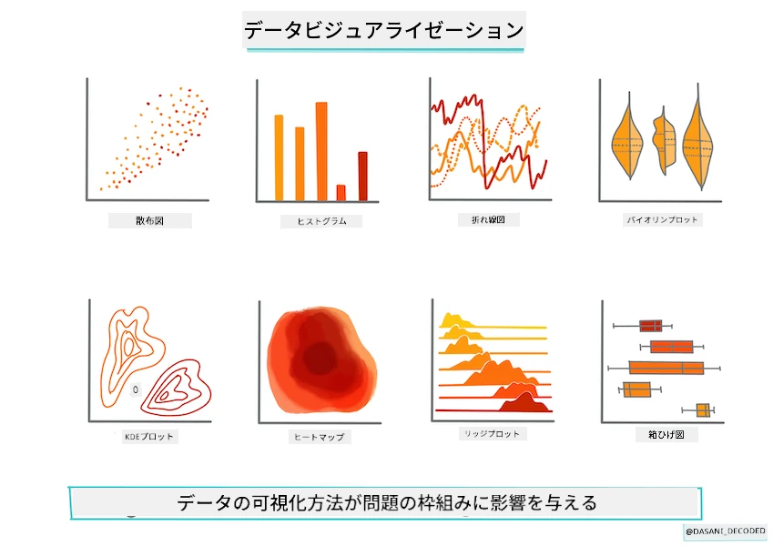
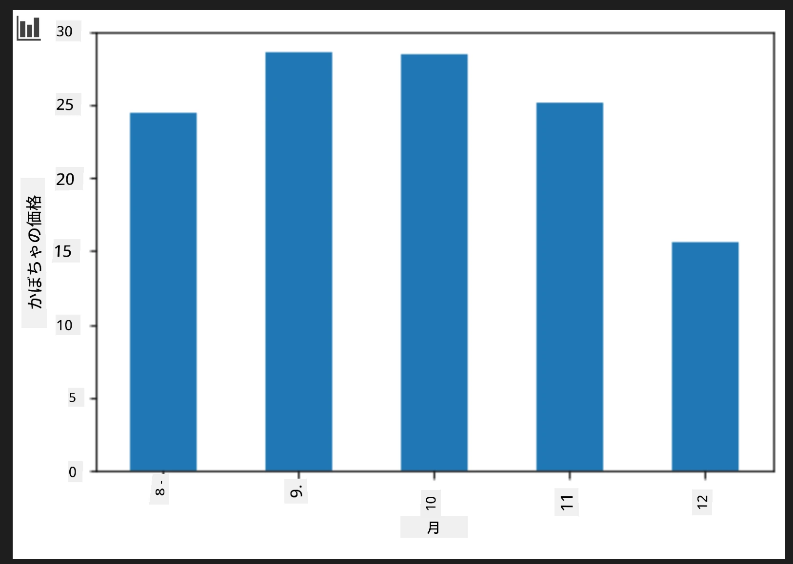
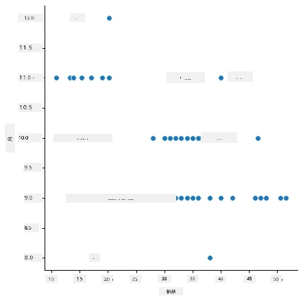
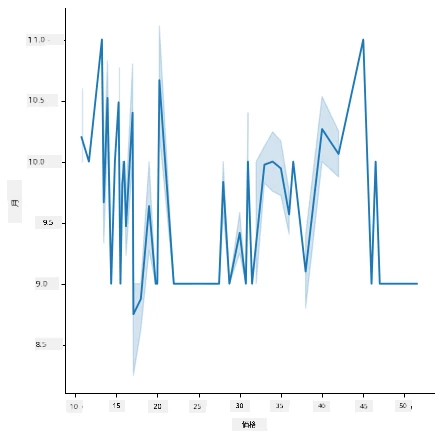
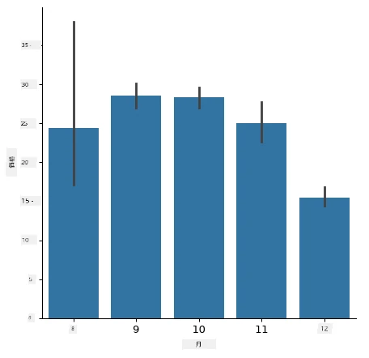
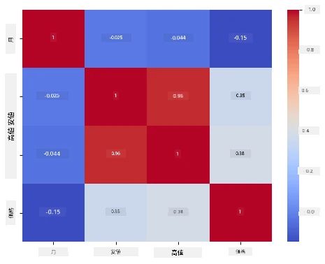

# Scikit-learnを使って回帰モデルを構築する: データの準備と可視化



インフォグラフィック提供者: [Dasani Madipalli](https://twitter.com/dasani_decoded)

## [事前講義クイズ](https://ff-quizzes.netlify.app/en/ml/)

> ### [このレッスンはRでも利用可能です！](../../../../2-Regression/2-Data/solution/R/lesson_2.html)

## はじめに

Scikit-learnを用いた機械学習モデル構築に必要なツールのセットアップが完了したので、いよいよデータに対して問いかけを始める準備ができました。データを扱いMLソリューションを適用する際には、データセットの可能性を正しく引き出すために適切な質問の仕方を理解することが非常に重要です。

このレッスンでは、以下を学びます:

- モデル構築のためのデータ準備方法。
- Matplotlibを用いたデータの可視化方法。
- より表現力のある可視化のためのSeabornの使い方。

## データに対して適切な質問をする

どんな質問をするかによって、使用する機械学習アルゴリズムの種類が決まります。また、返ってくる答えの質はデータの性質に大きく依存します。

このレッスンで提供されている [データ](https://github.com/microsoft/ML-For-Beginners/blob/main/2-Regression/data/US-pumpkins.csv) を見てみましょう。この.csvファイルはVS Codeで開くことができます。ざっと見ただけでも空欄があったり、文字列と数値の混在が見られます。また、「Package」という奇妙な列があり、そこには「sacks」や「bins」などの混在した値が含まれています。実際、このデータは少しばかり乱雑です。

[](https://youtu.be/5qGjczWTrDQ "初心者向けML - データセットの分析とクリーンアップ方法")

> 🎥 画像をクリックすると、このレッスンのデータ準備の流れを解説した短い動画が見られます。

実際には、すぐに使える状態のデータセットが丸ごと与えられることはあまりありません。このレッスンでは、標準的なPythonライブラリを使って未加工データを準備する方法を学びます。また、様々な手法によるデータの可視化も学びます。

## ケーススタディ：「カボチャ市場」

このフォルダには、ルートの`data`フォルダに [US-pumpkins.csv](https://github.com/microsoft/ML-For-Beginners/blob/main/2-Regression/data/US-pumpkins.csv) というファイルがあり、これは都市ごとに分類されたカボチャ市場に関する1757行のデータが含まれています。この生データは、米国農務省が配布している [Specialty Crops Terminal Markets Standard Reports](https://www.marketnews.usda.gov/mnp/fv-report-config-step1?type=termPrice) から抽出されたものです。

### データの準備

このデータはパブリックドメインです。米農務省のサイトでは、多くのファイルが都市別に分かれてダウンロード可能です。多数の分割ファイルを避けるために、すべての都市データを一つのスプレッドシートに結合しており、ある程度データの「準備」は済ませています。次にデータをより詳しく見ていきましょう。

### カボチャデータ - 初期の結論

このデータから何が気づきますか？すでに文字列、数値、空欄、変な値の混在があることが見えていますね。

回帰技術を使ってこのデータにどんな質問ができるでしょうか？「特定の月に販売されるカボチャの価格を予測する」というのはどうでしょう。再度データを見ると、その課題に必要なデータ構造にするためにいくつか変更する必要があることがわかります。
## 演習 - カボチャデータ分析

データ整形に便利なツールである [Pandas](https://pandas.pydata.org/) （名前は`Python Data Analysis`の頭文字）を使って、このカボチャデータを分析し準備しましょう。

### まずは欠損している日付をチェックする

最初に以下の手順で、欠損している日付がないかどうか確認します:

1. 日付を月の形式に変換する（米国の日付形式のため、フォーマットは`MM/DD/YYYY`です）。
2. 月を新しい列に抽出する。

Visual Studio Codeで_notebook.ipynb_ファイルを開き、スプレッドシートを新しいPandasデータフレームにインポートします。

1. `head()`関数を使って最初の5行を表示しましょう。

    ```python
    import pandas as pd
    pumpkins = pd.read_csv('../data/US-pumpkins.csv')
    pumpkins.head()
    ```

    ✅ 最後の5行を表示するにはどの関数を使いますか？

1. 現在のデータフレームに欠損データがないかチェックします:

    ```python
    pumpkins.isnull().sum()
    ```

    欠損データはありますが、今回の課題には影響しないかもしれません。

1. 作業を簡単にするために、`loc`関数を使って必要な列だけ選択しましょう。`loc`は元のデータフレームから特定の行（第1引数）と列（第2引数）を抽出します。下記の`:`は「すべての行」を意味します。

    ```python
    columns_to_select = ['Package', 'Low Price', 'High Price', 'Date']
    pumpkins = pumpkins.loc[:, columns_to_select]
    ```

### 次に、カボチャの平均価格を算出する

特定月のカボチャの平均価格をどうやって求めるか考えてみてください。この課題に必要な列は何でしょう？ヒント: 3列必要です。

解決策: `Low Price`列と`High Price`列の平均を新しいPrice列として作成し、Date列は月のみ表示に変換します。幸い上記チェックによると、日付や価格の欠損はありません。

1. 平均を計算するには、次のコードを追加します:

    ```python
    price = (pumpkins['Low Price'] + pumpkins['High Price']) / 2

    month = pd.DatetimeIndex(pumpkins['Date']).month

    ```

   ✅ チェックしたいデータは`print(month)`を使って自由に出力してみてください。

2. 変換済みデータを新しいPandasデータフレームにコピーしましょう:

    ```python
    new_pumpkins = pd.DataFrame({'Month': month, 'Package': pumpkins['Package'], 'Low Price': pumpkins['Low Price'],'High Price': pumpkins['High Price'], 'Price': price})
    ```

    データフレームを印刷すると、きれいで整理されたデータセットが表示され、新しい回帰モデルの構築に使えます。

### しかし！ちょっと変な点があります

`Package`列を見ると、カボチャが様々な形態で販売されていることがわかります。中には「1 1/9 ブッシェル」や「1/2 ブッシェル」といった単位もあれば、1個単位、1ポンド単位、大きな箱で幅の異なるものもあります。

> カボチャは一貫して重さを量るのが非常に難しいようです。

元データを詳しく見ると、`Unit of Sale`が 'EACH' または 'PER BIN' のものには、`Package`タイプがインチ単位、ビンごと、または 'each' となっていることがわかります。カボチャは非常に重量が一定ではないようなので、`Package`列に「bushel」という文字列が含まれるカボチャだけを選択してフィルタ処理しましょう。

1. 最初の.csvインポート下にフィルターを追加します:

    ```python
    pumpkins = pumpkins[pumpkins['Package'].str.contains('bushel', case=True, regex=True)]
    ```

    これで印刷すると、bushel単位のカボチャ約415行のみが抽出されているのがわかります。

### しかし！もう一つやることがあります

bushelの量は行によって異なることに気づきましたか？価格をbushelあたりに正規化する必要があるので、標準化のための計算を行いましょう。

1. new_pumpkinsデータフレームを作成するブロックの後に、次の行を追加します:

    ```python
    new_pumpkins.loc[new_pumpkins['Package'].str.contains('1 1/9'), 'Price'] = price/(1 + 1/9)

    new_pumpkins.loc[new_pumpkins['Package'].str.contains('1/2'), 'Price'] = price/(1/2)
    ```

✅ [The Spruce Eats](https://www.thespruceeats.com/how-much-is-a-bushel-1389308) によれば、ブッシェルの重量は品目によって異なり、容積単位です。例えば「トマトの1ブッシェルは56ポンド」、「葉物や青菜は容積が大きくても重量は軽く、ほうれん草の1ブッシェルは20ポンド」。非常に複雑です！ポンド換算はせずにbushel単位で価格を扱いましょう。これらのカボチャのbushel調査は、データの性質を理解することの重要性を示しています！

これでbushel単位の価格を分析できます。もう一度データを印刷すると、標準化された様子が見えます。

✅ 半ブッシェル単位で販売されているカボチャは非常に高価なのに気づきましたか？理由を考えられますか？ヒント: 小さなカボチャは大きいものよりもずっと高価です。おそらく大きな空洞のパイ用カボチャが一つ入るスペースに、小さなカボチャがたくさん入るためです。

## 可視化の戦略

データサイエンティストの役割の一部は、扱うデータの質や性質を示すことです。そのため、しばしば興味深い可視化（プロット、グラフ、チャート）を作成し、異なる側面を示します。こうすることで、目に見えて関係性やデータの穴を明らかにできます。

[](https://youtu.be/SbUkxH6IJo0 "初心者向けML - Matplotlibによるデータ可視化方法")

> 🎥 画像をクリックすると、このレッスンのデータ可視化を解説した短い動画が見られます。

可視化は、データに最も適した機械学習手法を決めるのにも役立ちます。例えば、散布図が直線に沿っているようであれば、そのデータは線形回帰に適していることを示唆します。

Jupyterノートブックでよく使われるデータ可視化ライブラリの一つに[Matplotlib](https://matplotlib.org/)（前のレッスンでも登場しました）があります。

> [これらのチュートリアル](https://docs.microsoft.com/learn/modules/explore-analyze-data-with-python?WT.mc_id=academic-77952-leestott)でデータ可視化の経験をさらに積みましょう。

## 演習 - Matplotlibを試してみる

新しく作成したデータフレームを表示する基本的なプロットを作成してみましょう。基本的な線グラフではどんな表示になるでしょうか？

1. ファイルの先頭、Pandasのインポートの下にMatplotlibをインポートします:

    ```python
    import matplotlib.pyplot as plt
    ```

1. ノートブック全体を再実行して更新します。
1. ノートブックの下部に、箱ひげ図を描くセルを追加します:

    ```python
    price = new_pumpkins.Price
    month = new_pumpkins.Month
    plt.scatter(price, month)
    plt.show()
    ```

    

    これは有用なグラフでしょうか？何か驚いた点はありますか？

    入力データの散布図としてポイントを散らしているだけなので、特に役に立つわけではありません。

### もっと有用にするには

有益なデータを示すには通常、何らかの方法でデータをグループ化する必要があります。月をy軸に取り、データの分布を示すグラフを作成してみましょう。

1. グループ化した棒グラフを作るセルを追加します:

    ```python
    new_pumpkins.groupby(['Month'])['Price'].mean().plot(kind='bar')
    plt.ylabel("Pumpkin Price")
    ```

    

    これの方が有用なデータ可視化です！カボチャの最高価格は9月と10月に見られるようです。これは予想通りでしょうか？なぜそう思いますか？

## 演習 - Seabornを試してみる

Matplotlibは強力ですが、完成度の高いグラフを作るには多くのコードが必要になることがあります。[Seaborn](https://seaborn.pydata.org/)はMatplotlibの「上に構築された」ライブラリで、統計的データ可視化に特化しています。Pandasデータフレームと直接連携し、魅力的なデフォルトスタイルを適用し、少ないコードで分かりやすいプロットが作成できます。SeabornはMatplotlibオブジェクトを返すため、既存のMatplotlibの知識もそのまま使って細かな調整が可能です。

> まだSeabornをインストールしていない場合は、`pip install seaborn`でインストールしてください。

1. ノートブックの先頭、他のインポートの下にSeabornをインポートします。通常`sns`の名前でインポートします:

    ```python
    import seaborn as sns
    ```

### 散布図で関係性を示す

モデル構築前のデータ探索の大部分は、変数間の_関係_を探すことです。[散布図](https://en.wikipedia.org/wiki/Scatter_plot)はそのための最良のツールのひとつで、点が直線上に並ぶようなら、その2変数間に相関があり、線形回帰モデルの適用が期待できます。

1. 先ほどの価格と月の散布図を、今回はSeabornの[`relplot()`](https://seaborn.pydata.org/generated/seaborn.relplot.html)（関係プロット）を使って再作成します。`relplot()`はデータフレームの列を直接扱えます:

    ```python
    sns.relplot(x="Price", y="Month", data=new_pumpkins)
    ```

    

    列名とデータフレームを渡すだけで、軸ラベルはSeabornが自動で付けてくれるのがわかります。

2. `kind="line"`を渡して線グラフに切り替えることもできます。Seabornは線のまわりに信頼区間の帯も描いてくれます:

    ```python
    sns.relplot(x="Price", y="Month", kind="line", data=new_pumpkins)
    ```

    

    この特定のデータはノイズが多いため線グラフは最適ではありませんが、Seabornでチャートタイプを簡単に変更できる様子が示されています。

### 棒グラフで分布を示す


前に手動でデータをグループ化してMatplotlibで棒グラフを作成しました。Seabornの[`catplot()`](https://seaborn.pydata.org/generated/seaborn.catplot.html)（カテゴリカルプロット）は、グループ化と集約を自動で行ってくれます。デフォルトで `kind="bar"` は各カテゴリの平均値を表示し、信頼区間を示す黒い線が付加されます。

1. 月ごとの平均価格の棒グラフを作成します：

    ```python
    sns.catplot(x="Month", y="Price", data=new_pumpkins, kind="bar")
    ```

    

    これはMatplotlibで見たものを確認するものです — 価格は9月と10月にピークを迎えます — しかしSeabornは各月の価格がどれほど_変動_するかも可視化しています。

### 相関を示すヒートマップ

散布図は2つの変数を比較しますが、複数の数値列がある場合は[ヒートマップ](https://en.wikipedia.org/wiki/Heat_map)を使うと、_すべての_列のペア間の関係の強さを一度に見ることができます。これは、モデルにどの特徴量を入力するかを選ぶ前に最も関連の強い特徴を見つける一般的な方法であり（また同じ種類のグラフは後に分類で混同行列を表示する際にも使われます）。

1. Pandasで相関行列を作成し、Seabornの[`heatmap()`](https://seaborn.pydata.org/generated/seaborn.heatmap.html)で描画します。`annot=True`オプションは各セルに相関値を表示します：

    ```python
    correlations = new_pumpkins[['Month', 'Low Price', 'High Price', 'Price']].corr()
    sns.heatmap(correlations, annot=True, cmap="coolwarm")
    ```

    

    `1`（または `-1`）に近い値は列同士が強く_線形_に相関していることを意味します。`Low Price`と`High Price`がほぼ完全に相関しているのに注目してください。一方で`Month`は価格との線形相関が弱いことがわかります — たとえ上記の棒グラフで9月と10月に明確な季節的ピークが示されていてもです。これは重要な教訓です：相関係数は_直線的な_関係しか測定できないため、季節的あるいはその他非線形のパターンを見逃す可能性があります。 ✅ なぜヒートマップと棒グラフのようなチャートの両方を見て使う列を決定すると有効なのでしょうか？

### MatplotlibとSeaborn、どちらがよい？

両方のライブラリは知っておく価値があります：

- **Matplotlib** はチャートのあらゆる要素を細かく制御でき、ほぼすべての他のPythonプロットライブラリが基盤にしているものです。
- **Seaborn** は統計チャート用の高レベルな関数と魅力的なデフォルトを備え、データフレームと直接動作し、探索的データ解析により早く使えることが多いです。

一般的なワークフローは、まずSeabornで素早くデータを探査し、詳細をカスタマイズしたいときにMatplotlibに切り替えるというものです。

---

## 🚀チャレンジ

MatplotlibとSeabornが提供するさまざまな種類の可視化を調べてみましょう。どのタイプが回帰問題に最も適しているでしょうか？

## [講義後クイズ](https://ff-quizzes.netlify.app/en/ml/)

## 復習 & 自主学習

多様なデータ可視化の方法に目を通しましょう。利用可能なさまざまなライブラリをリストアップし、2D可視化と3D可視化など、特定のタスクに最適なものを記録してみてください。何を発見しますか？

## 課題

[可視化の探求](assignment.md)

---

<!-- CO-OP TRANSLATOR DISCLAIMER START -->
**免責事項**：
本書類は AI 翻訳サービス [Co-op Translator](https://github.com/Azure/co-op-translator) を使用して翻訳されています。正確性を期していますが、自動翻訳には誤りや不正確な部分が含まれる可能性があることをご承知おきください。原文の原語版が正式な情報源とみなされるべきです。重要な情報については、専門の人間による翻訳を推奨します。本翻訳の利用により生じたいかなる誤解や解釈違いについても、当方は責任を負いかねます。
<!-- CO-OP TRANSLATOR DISCLAIMER END -->