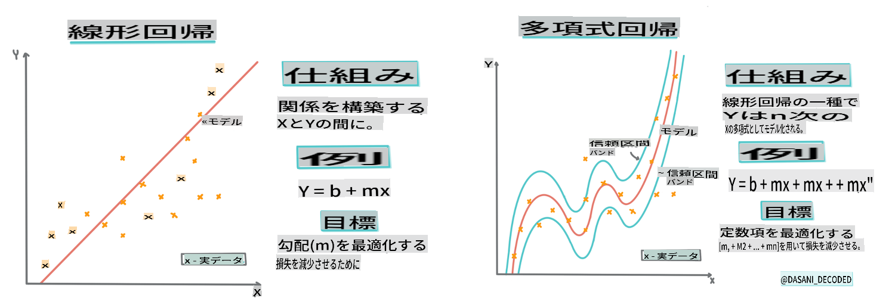
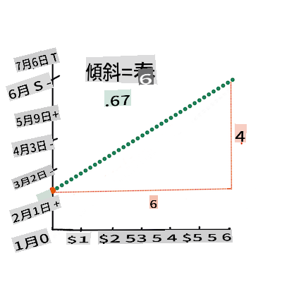
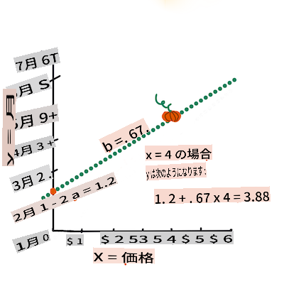

# Scikit-learnを使用して回帰モデルを構築する: 回帰の4つの方法


> インフォグラフィック作成者 [Dasani Madipalli](https://twitter.com/dasani_decoded)
## [講義前クイズ](https://gray-sand-07a10f403.1.azurestaticapps.net/quiz/13/)

> ### [このレッスンはRでも利用可能です！](../../../../2-Regression/3-Linear/solution/R/lesson_3.html)
### はじめに

これまでに、かぼちゃの価格データセットから収集したサンプルデータを使用して、回帰が何であるかを調査しました。また、Matplotlibを使用してそれを視覚化しました。

今度は、MLの回帰についてさらに深く掘り下げる準備ができました。視覚化はデータを理解するのに役立ちますが、機械学習の本当の力はモデルのトレーニングにあります。モデルは過去のデータに基づいてデータの依存関係を自動的にキャプチャし、モデルが以前に見たことのない新しいデータの結果を予測できるようにします。

このレッスンでは、基本的な線形回帰と多項式回帰の2種類の回帰について学びます。これらのモデルを使用して、異なる入力データに基づいてかぼちゃの価格を予測できるようになります。

[](https://youtu.be/CRxFT8oTDMg "初心者向けML - 線形回帰の理解")

> 🎥 上の画像をクリックすると、線形回帰の概要を短いビデオで確認できます。

> このカリキュラム全体を通じて、数学の知識が最小限であることを前提としており、他の分野から来る学生にも理解しやすいように、ノート、🧮 コールアウト、図表、その他の学習ツールを活用しています。

### 前提条件

これまでに、調査しているかぼちゃデータの構造に慣れているはずです。このレッスンの_notebook.ipynb_ファイルに、あらかじめ読み込まれ、前処理された状態でデータが含まれています。ファイルには、かぼちゃの価格が新しいデータフレームでブッシェルごとに表示されています。これらのノートブックをVisual Studio Codeのカーネルで実行できるようにしてください。

### 準備

データを読み込む目的を思い出してください。

- かぼちゃを買うのに最適な時期はいつですか？
- ミニチュアかぼちゃ1ケースの価格はどのくらいですか？
- それらを半ブッシェルバスケットで買うべきですか、それとも1 1/9ブッシェルボックスで買うべきですか？
このデータをさらに掘り下げてみましょう。

前のレッスンでは、Pandasデータフレームを作成し、元のデータセットの一部を取り込み、ブッシェル単位で価格を標準化しました。しかし、その結果、約400のデータポイントしか収集できず、秋の数か月分のデータしかありませんでした。

このレッスンのノートブックに事前に読み込まれたデータを見てみましょう。データは事前に読み込まれ、月ごとのデータを示す初期の散布図が描かれています。データをさらにクリーンアップすることで、データの性質についてもう少し詳細を得ることができるかもしれません。

## 線形回帰のライン

レッスン1で学んだように、線形回帰の目的は次のことができるようにラインをプロットすることです：

- **変数の関係を示す**。変数間の関係を示す
- **予測を行う**。新しいデータポイントがそのラインに対してどこに位置するかを正確に予測する

このタイプのラインを描くのは、通常、**最小二乗法回帰**です。「最小二乗」とは、回帰線の周りのすべてのデータポイントを二乗してから合計することを意味します。理想的には、その最終的な合計ができるだけ小さいことが望まれます。なぜなら、エラーの数を少なくしたいからです。

すべてのデータポイントからの累積距離が最小になるようにラインをモデル化したいからです。また、方向よりも大きさを重視するため、項を加算する前に二乗します。

> **🧮 数学を見せて**
> 
> このライン、最適フィットラインは[方程式](https://en.wikipedia.org/wiki/Simple_linear_regression)で表すことができます：
> 
> ```
> Y = a + bX
> ```
>
> `X` is the 'explanatory variable'. `Y` is the 'dependent variable'. The slope of the line is `b` and `a` is the y-intercept, which refers to the value of `Y` when `X = 0`. 
>
>
>
> First, calculate the slope `b`. Infographic by [Jen Looper](https://twitter.com/jenlooper)
>
> In other words, and referring to our pumpkin data's original question: "predict the price of a pumpkin per bushel by month", `X` would refer to the price and `Y` would refer to the month of sale. 
>
>
>
> Calculate the value of Y. If you're paying around $4, it must be April! Infographic by [Jen Looper](https://twitter.com/jenlooper)
>
> The math that calculates the line must demonstrate the slope of the line, which is also dependent on the intercept, or where `Y` is situated when `X = 0`.
>
> You can observe the method of calculation for these values on the [Math is Fun](https://www.mathsisfun.com/data/least-squares-regression.html) web site. Also visit [this Least-squares calculator](https://www.mathsisfun.com/data/least-squares-calculator.html) to watch how the numbers' values impact the line.

## Correlation

One more term to understand is the **Correlation Coefficient** between given X and Y variables. Using a scatterplot, you can quickly visualize this coefficient. A plot with datapoints scattered in a neat line have high correlation, but a plot with datapoints scattered everywhere between X and Y have a low correlation.

A good linear regression model will be one that has a high (nearer to 1 than 0) Correlation Coefficient using the Least-Squares Regression method with a line of regression.

✅ Run the notebook accompanying this lesson and look at the Month to Price scatterplot. Does the data associating Month to Price for pumpkin sales seem to have high or low correlation, according to your visual interpretation of the scatterplot? Does that change if you use more fine-grained measure instead of `Month`, eg. *day of the year* (i.e. number of days since the beginning of the year)?

In the code below, we will assume that we have cleaned up the data, and obtained a data frame called `new_pumpkins`, similar to the following:

ID | Month | DayOfYear | Variety | City | Package | Low Price | High Price | Price
---|-------|-----------|---------|------|---------|-----------|------------|-------
70 | 9 | 267 | PIE TYPE | BALTIMORE | 1 1/9 bushel cartons | 15.0 | 15.0 | 13.636364
71 | 9 | 267 | PIE TYPE | BALTIMORE | 1 1/9 bushel cartons | 18.0 | 18.0 | 16.363636
72 | 10 | 274 | PIE TYPE | BALTIMORE | 1 1/9 bushel cartons | 18.0 | 18.0 | 16.363636
73 | 10 | 274 | PIE TYPE | BALTIMORE | 1 1/9 bushel cartons | 17.0 | 17.0 | 15.454545
74 | 10 | 281 | PIE TYPE | BALTIMORE | 1 1/9 bushel cartons | 15.0 | 15.0 | 13.636364

> The code to clean the data is available in [`notebook.ipynb`](../../../../2-Regression/3-Linear/notebook.ipynb). We have performed the same cleaning steps as in the previous lesson, and have calculated `DayOfYear` カラムを次の式を使用して計算します：

```python
day_of_year = pd.to_datetime(pumpkins['Date']).apply(lambda dt: (dt-datetime(dt.year,1,1)).days)
```

線形回帰の数学的背景を理解したので、回帰モデルを作成して、どのパッケージのかぼちゃが最も良い価格を持つかを予測してみましょう。ホリデーパンプキンパッチのためにかぼちゃを購入する人は、この情報を利用してかぼちゃパッケージの購入を最適化することができるでしょう。

## 相関を探す

[](https://youtu.be/uoRq-lW2eQo "初心者向けML - 相関を探す: 線形回帰の鍵")

> 🎥 上の画像をクリックすると、相関の概要を短いビデオで確認できます。

前のレッスンで、異なる月の平均価格が次のように見えることに気づいたかもしれません：


これは、ある種の相関があることを示唆しており、`Month` and `Price`, or between `DayOfYear` and `Price`. Here is the scatter plot that shows the latter relationship:

 

Let's see if there is a correlation using the `corr` 関数を使用して相関を計算してみることができます：

```python
print(new_pumpkins['Month'].corr(new_pumpkins['Price']))
print(new_pumpkins['DayOfYear'].corr(new_pumpkins['Price']))
```

相関はかなり小さいようです、`Month` and -0.17 by the `DayOfMonth`, but there could be another important relationship. It looks like there are different clusters of prices corresponding to different pumpkin varieties. To confirm this hypothesis, let's plot each pumpkin category using a different color. By passing an `ax` parameter to the `scatter` プロット関数を使用してすべてのポイントを同じグラフにプロットできます：

```python
ax=None
colors = ['red','blue','green','yellow']
for i,var in enumerate(new_pumpkins['Variety'].unique()):
    df = new_pumpkins[new_pumpkins['Variety']==var]
    ax = df.plot.scatter('DayOfYear','Price',ax=ax,c=colors[i],label=var)
```

 

私たちの調査は、実際の販売日よりも品種が全体の価格に影響を与えることを示唆しています。これを棒グラフで確認できます：

```python
new_pumpkins.groupby('Variety')['Price'].mean().plot(kind='bar')
```

 

今のところ、'パイタイプ'のかぼちゃ品種にのみ焦点を当て、日付が価格に与える影響を見てみましょう：

```python
pie_pumpkins = new_pumpkins[new_pumpkins['Variety']=='PIE TYPE']
pie_pumpkins.plot.scatter('DayOfYear','Price') 
```
 

`Price` and `DayOfYear` using `corr` function, we will get something like `-0.27` の相関を計算すると、予測モデルのトレーニングが意味を持つことがわかります。

> 線形回帰モデルをトレーニングする前に、データがクリーンであることを確認することが重要です。線形回帰は欠損値に対してうまく機能しないため、すべての空のセルを取り除くことが理にかなっています：

```python
pie_pumpkins.dropna(inplace=True)
pie_pumpkins.info()
```

もう一つのアプローチは、それらの空の値を対応する列の平均値で埋めることです。

## 単純な線形回帰

[](https://youtu.be/e4c_UP2fSjg "初心者向けML - Scikit-learnを使用した線形および多項式回帰")

> 🎥 上の画像をクリックすると、線形回帰と多項式回帰の概要を短いビデオで確認できます。

線形回帰モデルをトレーニングするために、**Scikit-learn**ライブラリを使用します。

```python
from sklearn.linear_model import LinearRegression
from sklearn.metrics import mean_squared_error
from sklearn.model_selection import train_test_split
```

まず、入力値（特徴）と予想出力（ラベル）を別々のnumpy配列に分けます：

```python
X = pie_pumpkins['DayOfYear'].to_numpy().reshape(-1,1)
y = pie_pumpkins['Price']
```

> 入力データに`reshape`を実行する必要があることに注意してください。線形回帰は2D配列を入力として期待し、配列の各行が入力特徴のベクトルに対応します。私たちの場合、入力が1つしかないため、形状がN×1の配列が必要です。Nはデータセットのサイズです。

次に、データをトレーニングデータセットとテストデータセットに分割し、トレーニング後にモデルを検証できるようにします：

```python
X_train, X_test, y_train, y_test = train_test_split(X, y, test_size=0.2, random_state=0)
```

最後に、実際の線形回帰モデルのトレーニングは2行のコードで行います。`LinearRegression` object, and fit it to our data using the `fit` メソッドを定義します：

```python
lin_reg = LinearRegression()
lin_reg.fit(X_train,y_train)
```

`LinearRegression` object after `fit`-ting contains all the coefficients of the regression, which can be accessed using `.coef_` property. In our case, there is just one coefficient, which should be around `-0.017`. It means that prices seem to drop a bit with time, but not too much, around 2 cents per day. We can also access the intersection point of the regression with Y-axis using `lin_reg.intercept_` - it will be around `21` が示しているように、年の初めの価格を示しています。

モデルの精度を確認するために、テストデータセットで価格を予測し、予測値と期待値の違いを測定します。これは、期待値と予測値のすべての二乗誤差の平均である平均二乗誤差（MSE）を使用して行うことができます。

```python
pred = lin_reg.predict(X_test)

mse = np.sqrt(mean_squared_error(y_test,pred))
print(f'Mean error: {mse:3.3} ({mse/np.mean(pred)*100:3.3}%)')
```

誤差は約2ポイントで、約17％です。あまり良くありません。モデルの品質のもう一つの指標は**決定係数**であり、次のように取得できます：

```python
score = lin_reg.score(X_train,y_train)
print('Model determination: ', score)
```
値が0の場合、モデルは入力データを考慮せず、*最悪の線形予測器*として機能し、単に結果の平均値を示します。値が1の場合、すべての期待出力を完全に予測できることを意味します。私たちの場合、決定係数は約0.06で、かなり低いです。

テストデータと回帰ラインを一緒にプロットして、回帰がどのように機能するかをよりよく見ることができます：

```python
plt.scatter(X_test,y_test)
plt.plot(X_test,pred)
```


## 多項式回帰

もう一つの線形回帰のタイプは多項式回帰です。変数間に線形関係がある場合がありますが、例えば、かぼちゃの体積が大きいほど価格が高くなる場合がありますが、これらの関係は平面や直線としてプロットできないことがあります。

✅ ここに[いくつかの例](https://online.stat.psu.edu/stat501/lesson/9/9.8)があります。多項式回帰を使用できるデータの例です。

日付と価格の関係をもう一度見てみましょう。この散布図は直線で分析すべきだと思いますか？価格は変動する可能性がありますか？この場合、多項式回帰を試すことができます。

✅ 多項式は、1つ以上の変数と係数で構成される数学的表現です。

多項式回帰は、非線形データにより適合する曲線を作成します。私たちの場合、入力データに`DayOfYear`の二乗変数を含めると、年のある時点で最小値を持つ放物線をフィットさせることができます。

Scikit-learnには、データ処理の異なるステップを組み合わせるための便利な[パイプラインAPI](https://scikit-learn.org/stable/modules/generated/sklearn.pipeline.make_pipeline.html?highlight=pipeline#sklearn.pipeline.make_pipeline)が含まれています。**パイプライン**は、**推定器**のチェーンです。私たちの場合、まずモデルに多項式特徴を追加し、その後回帰をトレーニングするパイプラインを作成します：

```python
from sklearn.preprocessing import PolynomialFeatures
from sklearn.pipeline import make_pipeline

pipeline = make_pipeline(PolynomialFeatures(2), LinearRegression())

pipeline.fit(X_train,y_train)
```

`PolynomialFeatures(2)` means that we will include all second-degree polynomials from the input data. In our case it will just mean `DayOfYear`<sup>2</sup>, but given two input variables X and Y, this will add X<sup>2</sup>, XY and Y<sup>2</sup>. We may also use higher degree polynomials if we want.

Pipelines can be used in the same manner as the original `LinearRegression` object, i.e. we can `fit` the pipeline, and then use `predict` to get the prediction results. Here is the graph showing test data, and the approximation curve:


Using Polynomial Regression, we can get slightly lower MSE and higher determination, but not significantly. We need to take into account other features!

> You can see that the minimal pumpkin prices are observed somewhere around Halloween. How can you explain this? 

🎃 Congratulations, you just created a model that can help predict the price of pie pumpkins. You can probably repeat the same procedure for all pumpkin types, but that would be tedious. Let's learn now how to take pumpkin variety into account in our model!

## Categorical Features

In the ideal world, we want to be able to predict prices for different pumpkin varieties using the same model. However, the `Variety` column is somewhat different from columns like `Month`, because it contains non-numeric values. Such columns are called **categorical**.

[](https://youtu.be/DYGliioIAE0 "ML for beginners - Categorical Feature Predictions with Linear Regression")

> 🎥 Click the image above for a short video overview of using categorical features.

Here you can see how average price depends on variety:


To take variety into account, we first need to convert it to numeric form, or **encode** it. There are several way we can do it:

* Simple **numeric encoding** will build a table of different varieties, and then replace the variety name by an index in that table. This is not the best idea for linear regression, because linear regression takes the actual numeric value of the index, and adds it to the result, multiplying by some coefficient. In our case, the relationship between the index number and the price is clearly non-linear, even if we make sure that indices are ordered in some specific way.
* **One-hot encoding** will replace the `Variety` column by 4 different columns, one for each variety. Each column will contain `1` if the corresponding row is of a given variety, and `0` ということになります。つまり、線形回帰には4つの係数があり、各かぼちゃ品種ごとに1つの係数があり、その品種の「開始価格」（または「追加価格」）を表します。

以下のコードは、品種をワンホットエンコードする方法を示しています：

```python
pd.get_dummies(new_pumpkins['Variety'])
```

 ID | FAIRYTALE | MINIATURE | MIXED HEIRLOOM VARIETIES | PIE TYPE
----|-----------|-----------|--------------------------|----------
70 | 0 | 0 | 0 | 1
71 | 0 | 0 | 0 | 1
... | ... | ... | ... | ...
1738 | 0 | 1 | 0 | 0
1739 | 0 | 1 | 0 | 0
1740 | 0 | 1 | 0 | 0
1741 | 0 | 1 | 0 | 0
1742 | 0 | 1 | 0 | 0

ワンホットエンコードされた品種を使用して線形回帰をトレーニングするには、`X` and `y`データを正しく初期化するだけです：

```python
X = pd.get_dummies(new_pumpkins['Variety'])
y = new_pumpkins['Price']
```

他のコードは、上記で使用した線形回帰をトレーニングするためのコードと同じです。試してみると、平均二乗誤差はほぼ同じですが、決定係数が大幅に高くなります（約77％）。さらに正確な予測を行うために、より多くのカテゴリカル特徴や数値的特徴（例えば`Month` or `DayOfYear`. To get one large array of features, we can use `join`）を考慮することができます：

```python
X = pd.get_dummies(new_pumpkins['Variety']) \
        .join(new_pumpkins['Month']) \
        .join(pd.get_dummies(new_pumpkins['City'])) \
        .join(pd.get_dummies(new_pumpkins['Package']))
y = new_pumpkins['Price']
```

ここでは、`City` and `Package`タイプも考慮しており、MSEは2.84（10％）、決定係数は0.94です！

## すべてをまとめる

最良のモデルを作成するために、上記の例からの結合データ（ワンホットエンコードされたカテゴリカルデータ＋数値データ）と多項式回帰を使用します。ここに完全なコードがあります：

```python
# set up training data
X = pd.get_dummies(new_pumpkins['Variety']) \
        .join(new_pumpkins['Month']) \
        .join(pd.get_dummies(new_pumpkins['City'])) \
        .join(pd.get_dummies(new_pumpkins['Package']))
y = new_pumpkins['Price']

# make train-test split
X_train, X_test, y_train, y_test = train_test_split(X, y, test_size=0.2, random_state=0)

# setup and train the pipeline
pipeline = make_pipeline(PolynomialFeatures(2), LinearRegression())
pipeline.fit(X_train,y_train)

# predict results for test data
pred = pipeline.predict(X_test)

# calculate MSE and determination
mse = np.sqrt(mean_squared_error(y_test,pred))
print(f'Mean error: {mse:3.3} ({mse/np.mean(pred)*100:3.3}%)')

score = pipeline.score(X_train,y_train)
print('Model determination: ', score)
```

これにより、決定係数がほぼ97％、MSE=2.23（約8％の予測誤差）となります。

| モデル | MSE | 決定係数 |
|-------|-----|---------------|
| `DayOfYear` Linear | 2.77 (17.2%) | 0.07 |
| `DayOfYear` Polynomial | 2.73 (17.0%) | 0.08 |
| `Variety` 線形 | 5.24 (19.7%) | 0.77 |
| すべての特徴 線形 | 2.84 (10.5%) | 0.94 |
| すべての特徴 多項式 | 2.23 (8.25%) | 0.97 |

🏆 よくできました！1つのレッスンで4つの回帰モデルを作成し、モデルの品質を97％に向上させました。回帰の最終セクションでは、ロジスティック回帰について学び、カテゴリを

**免責事項**:
この文書は機械翻訳サービスを使用して翻訳されています。正確さを期すよう努めていますが、自動翻訳には誤りや不正確さが含まれる場合があります。原文の言語による文書が権威ある情報源と見なされるべきです。重要な情報については、専門の人間による翻訳をお勧めします。この翻訳の使用に起因する誤解や誤認について、当社は一切の責任を負いません。