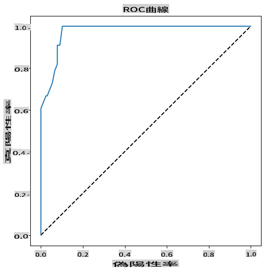

<!--
CO_OP_TRANSLATOR_METADATA:
{
  "original_hash": "72b5bae0879baddf6aafc82bb07b8776",
  "translation_date": "2025-09-03T22:25:12+00:00",
  "source_file": "2-Regression/4-Logistic/README.md",
  "language_code": "ja"
}
-->
# カテゴリ予測のためのロジスティック回帰


## [講義前のクイズ](https://gray-sand-07a10f403.1.azurestaticapps.net/quiz/15/)

> ### [このレッスンはRでも利用可能です！](../../../../2-Regression/4-Logistic/solution/R/lesson_4.html)

## はじめに

回帰に関する最後のレッスンでは、基本的な「クラシック」な機械学習技術の一つであるロジスティック回帰を学びます。この技術を使えば、パターンを発見して二値カテゴリを予測することができます。このキャンディはチョコレートかどうか？この病気は伝染性かどうか？この顧客はこの商品を選ぶかどうか？

このレッスンで学ぶ内容：

- 新しいデータ可視化ライブラリ
- ロジスティック回帰の技術

✅ この[学習モジュール](https://docs.microsoft.com/learn/modules/train-evaluate-classification-models?WT.mc_id=academic-77952-leestott)で、この回帰タイプの理解を深めましょう。

## 前提条件

かぼちゃデータを扱ったことで、このデータには扱える二値カテゴリがあることがわかりました。それは `Color` です。

いくつかの変数を基にして、_特定のかぼちゃの色がオレンジ 🎃 か白 👻 かを予測する_ ロジスティック回帰モデルを構築してみましょう。

> なぜ回帰に関するレッスンで二値分類について話しているのでしょうか？それは言語的な便宜上の理由だけであり、ロジスティック回帰は[実際には分類方法](https://scikit-learn.org/stable/modules/linear_model.html#logistic-regression)であり、線形ベースのものです。次のレッスンでは、データを分類する他の方法について学びます。

## 問題を定義する

今回の目的では、これを二値として表現します：'White' または 'Not White'。データセットには 'striped' というカテゴリもありますが、インスタンスが少ないため使用しません。データセットから欠損値を削除すると、このカテゴリは消えてしまいます。

> 🎃 面白い事実：白いかぼちゃは時々「ゴースト」かぼちゃと呼ばれます。彫刻するのは難しいため、オレンジのかぼちゃほど人気はありませんが、見た目はクールです！したがって、質問を次のように再構成することもできます：'Ghost' または 'Not Ghost' 👻。

## ロジスティック回帰について

ロジスティック回帰は、以前学んだ線形回帰とはいくつかの重要な点で異なります。

[](https://youtu.be/KpeCT6nEpBY "初心者向け機械学習 - ロジスティック回帰の理解")

> 🎥 上の画像をクリックしてロジスティック回帰の概要を短い動画で確認してください。

### 二値分類

ロジスティック回帰は線形回帰と同じ機能を提供しません。前者は二値カテゴリ（「白か白でないか」）についての予測を提供しますが、後者は継続的な値を予測することができます。例えば、かぼちゃの産地と収穫時期を基にして、_その価格がどれだけ上昇するか_ を予測することができます。


> インフォグラフィック作成者：[Dasani Madipalli](https://twitter.com/dasani_decoded)

### 他の分類

ロジスティック回帰には、他にも多項式や順序型などの種類があります：

- **多項式**: 複数のカテゴリを持つ場合 - 「オレンジ、白、縞模様」。
- **順序型**: 順序付けられたカテゴリを扱う場合。例えば、かぼちゃのサイズ（mini, sm, med, lg, xl, xxl）を論理的に順序付ける場合に役立ちます。


### 変数は相関している必要はない

線形回帰がより相関のある変数でうまく機能することを覚えていますか？ロジスティック回帰はその逆で、変数が一致している必要はありません。このデータには相関が弱い変数があるため、適しています。

### 多くのクリーンなデータが必要

ロジスティック回帰は、データが多いほど正確な結果を提供します。このタスクには小さなデータセットは最適ではないため、その点を考慮してください。

[](https://youtu.be/B2X4H9vcXTs "初心者向け機械学習 - ロジスティック回帰のためのデータ分析と準備")

> 🎥 上の画像をクリックして線形回帰のためのデータ準備の概要を短い動画で確認してください。

✅ ロジスティック回帰に適したデータの種類について考えてみましょう。

## 演習 - データを整理する

まず、データを少し整理し、欠損値を削除していくつかの列を選択します：

1. 以下のコードを追加してください：

    ```python
  
    columns_to_select = ['City Name','Package','Variety', 'Origin','Item Size', 'Color']
    pumpkins = full_pumpkins.loc[:, columns_to_select]

    pumpkins.dropna(inplace=True)
    ```

    新しいデータフレームを確認することもできます：

    ```python
    pumpkins.info
    ```

### 可視化 - カテゴリプロット

これまでに、かぼちゃデータを[スターターノートブック](./notebook.ipynb)に読み込み、いくつかの変数を含むデータセットを保持するように整理しました。ノートブックでデータフレームを可視化するために、以前使用したMatplotlibを基にした異なるライブラリ：[Seaborn](https://seaborn.pydata.org/index.html) を使用してみましょう。

Seabornはデータを可視化するための便利な方法を提供します。例えば、`Variety` と `Color` のデータ分布をカテゴリプロットで比較することができます。

1. `catplot` 関数を使用して、かぼちゃデータ `pumpkins` を指定し、各かぼちゃカテゴリ（オレンジまたは白）の色マッピングを指定してプロットを作成します：

    ```python
    import seaborn as sns
    
    palette = {
    'ORANGE': 'orange',
    'WHITE': 'wheat',
    }

    sns.catplot(
    data=pumpkins, y="Variety", hue="Color", kind="count",
    palette=palette, 
    )
    ```

    

    データを観察することで、ColorデータがVarietyとどのように関連しているかがわかります。

    ✅ このカテゴリプロットを基に、どのような興味深い探索が考えられますか？

### データ前処理：特徴とラベルのエンコーディング

かぼちゃデータセットのすべての列には文字列値が含まれています。カテゴリデータは人間にとって直感的ですが、機械にとってはそうではありません。機械学習アルゴリズムは数値データでうまく機能します。そのため、エンコーディングはデータ前処理フェーズで非常に重要なステップです。これにより、カテゴリデータを数値データに変換し、情報を失うことなく処理できます。適切なエンコーディングは良いモデル構築につながります。

特徴エンコーディングには主に2つのタイプがあります：

1. 順序エンコーダー：順序型変数に適しており、カテゴリ変数が論理的な順序に従う場合に使用します。データセットの `Item Size` 列がこれに該当します。各カテゴリを列内の順序に基づいて数値で表現するマッピングを作成します。

    ```python
    from sklearn.preprocessing import OrdinalEncoder

    item_size_categories = [['sml', 'med', 'med-lge', 'lge', 'xlge', 'jbo', 'exjbo']]
    ordinal_features = ['Item Size']
    ordinal_encoder = OrdinalEncoder(categories=item_size_categories)
    ```

2. カテゴリエンコーダー：名義変数に適しており、カテゴリ変数が論理的な順序に従わない場合に使用します。データセットの `Item Size` 以外のすべての特徴がこれに該当します。これはワンホットエンコーディングであり、各カテゴリがバイナリ列で表現されます：エンコードされた変数がそのVarietyに属している場合は1、それ以外の場合は0です。

    ```python
    from sklearn.preprocessing import OneHotEncoder

    categorical_features = ['City Name', 'Package', 'Variety', 'Origin']
    categorical_encoder = OneHotEncoder(sparse_output=False)
    ```

次に、`ColumnTransformer` を使用して複数のエンコーダーを単一のステップに統合し、適切な列に適用します。

```python
    from sklearn.compose import ColumnTransformer
    
    ct = ColumnTransformer(transformers=[
        ('ord', ordinal_encoder, ordinal_features),
        ('cat', categorical_encoder, categorical_features)
        ])
    
    ct.set_output(transform='pandas')
    encoded_features = ct.fit_transform(pumpkins)
```

一方、ラベルをエンコードするために、scikit-learnの `LabelEncoder` クラスを使用します。このクラスはラベルを正規化し、0からn_classes-1（ここでは0と1）の値のみを含むようにします。

```python
    from sklearn.preprocessing import LabelEncoder

    label_encoder = LabelEncoder()
    encoded_label = label_encoder.fit_transform(pumpkins['Color'])
```

特徴とラベルをエンコードしたら、それらを新しいデータフレーム `encoded_pumpkins` に統合できます。

```python
    encoded_pumpkins = encoded_features.assign(Color=encoded_label)
```

✅ `Item Size` 列に順序エンコーダーを使用する利点は何ですか？

### 変数間の関係を分析する

データを前処理した後、特徴とラベル間の関係を分析して、モデルが特徴を基にラベルをどれだけうまく予測できるかのアイデアをつかむことができます。
この種の分析を行う最良の方法はデータをプロットすることです。再びSeabornの `catplot` 関数を使用して、`Item Size`、`Variety`、`Color` の関係をカテゴリプロットで可視化します。データをより良くプロットするために、エンコードされた `Item Size` 列と未エンコードの `Variety` 列を使用します。

```python
    palette = {
    'ORANGE': 'orange',
    'WHITE': 'wheat',
    }
    pumpkins['Item Size'] = encoded_pumpkins['ord__Item Size']

    g = sns.catplot(
        data=pumpkins,
        x="Item Size", y="Color", row='Variety',
        kind="box", orient="h",
        sharex=False, margin_titles=True,
        height=1.8, aspect=4, palette=palette,
    )
    g.set(xlabel="Item Size", ylabel="").set(xlim=(0,6))
    g.set_titles(row_template="{row_name}")
```


### スウォームプロットを使用する

Colorは二値カテゴリ（WhiteまたはNot）であるため、これを可視化するには「[特化したアプローチ](https://seaborn.pydata.org/tutorial/categorical.html?highlight=bar)」が必要です。他の変数との関係を可視化する方法もあります。

Seabornプロットを使用して変数を並べて可視化できます。

1. 値の分布を示す「スウォーム」プロットを試してみましょう：

    ```python
    palette = {
    0: 'orange',
    1: 'wheat'
    }
    sns.swarmplot(x="Color", y="ord__Item Size", data=encoded_pumpkins, palette=palette)
    ```

    

**注意**: 上記のコードは警告を生成する可能性があります。Seabornが大量のデータポイントをスウォームプロットに表現するのに失敗するためです。解決策として、マーカーのサイズを減らすために 'size' パラメータを使用することができます。ただし、これによりプロットの読みやすさが影響を受ける可能性があります。

> **🧮 数学を見せて**
>
> ロジスティック回帰は「最大尤度」の概念に基づいており、[シグモイド関数](https://wikipedia.org/wiki/Sigmoid_function)を使用します。プロット上の「シグモイド関数」は「S」字型の形状をしています。値を取り、それを0から1の間にマッピングします。その曲線は「ロジスティック曲線」とも呼ばれます。その公式は次のようになります：
>
> 
>
> シグモイドの中点はxの0点に位置し、Lは曲線の最大値、kは曲線の急峻さを表します。この関数の結果が0.5以上の場合、該当するラベルは二値選択のクラス「1」として分類されます。それ以外の場合は「0」として分類されます。

## モデルを構築する

Scikit-learnでこの二値分類を見つけるモデルを構築するのは驚くほど簡単です。

[](https://youtu.be/MmZS2otPrQ8 "初心者向け機械学習 - データ分類のためのロジスティック回帰")

> 🎥 上の画像をクリックして線形回帰モデル構築の概要を短い動画で確認してください。

1. 分類モデルで使用したい変数を選択し、`train_test_split()` を呼び出してトレーニングセットとテストセットを分割します：

    ```python
    from sklearn.model_selection import train_test_split
    
    X = encoded_pumpkins[encoded_pumpkins.columns.difference(['Color'])]
    y = encoded_pumpkins['Color']

    X_train, X_test, y_train, y_test = train_test_split(X, y, test_size=0.2, random_state=0)
    
    ```

2. 次に、トレーニングデータを使用して `fit()` を呼び出し、モデルをトレーニングし、その結果を出力します：

    ```python
    from sklearn.metrics import f1_score, classification_report 
    from sklearn.linear_model import LogisticRegression

    model = LogisticRegression()
    model.fit(X_train, y_train)
    predictions = model.predict(X_test)

    print(classification_report(y_test, predictions))
    print('Predicted labels: ', predictions)
    print('F1-score: ', f1_score(y_test, predictions))
    ```

    モデルのスコアボードを確認してください。約1000行のデータしかないことを考慮すると悪くありません：

    ```output
                       precision    recall  f1-score   support
    
                    0       0.94      0.98      0.96       166
                    1       0.85      0.67      0.75        33
    
        accuracy                                0.92       199
        macro avg           0.89      0.82      0.85       199
        weighted avg        0.92      0.92      0.92       199
    
        Predicted labels:  [0 0 0 0 0 0 0 0 0 0 0 0 0 0 0 0 0 0 0 0 1 0 0 1 0 0 0 0 0 0 0 0 1 0 0 0 0
        0 0 0 0 0 1 0 1 0 0 1 0 0 0 0 0 1 0 1 0 1 0 1 0 0 0 0 0 0 0 0 0 0 0 0 0 0
        1 0 0 0 0 0 0 0 1 0 0 0 0 0 0 0 1 0 0 0 0 0 0 0 0 1 0 1 0 0 0 0 0 0 0 1 0
        0 0 0 0 0 0 0 0 0 0 0 0 0 0 0 0 0 0 0 0 0 1 0 0 0 0 0 0 0 0 1 0 0 0 1 1 0
        0 0 0 0 1 0 0 0 0 0 1 0 0 0 0 0 0 0 0 0 0 0 0 0 0 0 0 0 0 0 0 0 0 0 0 0 1
        0 0 0 1 0 0 0 0 0 0 0 0 1 1]
        F1-score:  0.7457627118644068
    ```

## 混同行列による理解の向上

上記の項目を印刷してスコアボードレポート[用語](https://scikit-learn.org/stable/modules/generated/sklearn.metrics.classification_report.html?highlight=classification_report#sklearn.metrics.classification_report)を取得することができますが、[混同行列](https://scikit-learn.org/stable/modules/model_evaluation.html#confusion-matrix)を使用してモデルをより簡単に理解することができます。

> 🎓 '[混同行列](https://wikipedia.org/wiki/Confusion_matrix)'（または 'エラーマトリックス'）は、モデルの真陽性と偽陽性、真陰性と偽陰性を表す表であり、予測の精度を評価します。

1. 混同行列を使用するには、`confusion_matrix()` を呼び出します：

    ```python
    from sklearn.metrics import confusion_matrix
    confusion_matrix(y_test, predictions)
    ```

    モデルの混同行列を確認してください：

    ```output
    array([[162,   4],
           [ 11,  22]])
    ```

Scikit-learnでは、混同行列の行（軸0）は実際のラベル、列（軸1）は予測されたラベルを表します。

|       |   0   |   1   |
| :---: | :---: | :---: |
|   0   |  TN   |  FP   |
|   1   |  FN   |  TP   |

ここで何が起こっているのでしょうか？モデルがかぼちゃを二値カテゴリ、カテゴリ 'white' とカテゴリ 'not-white' の間で分類するよう求められたとします。

- モデルがかぼちゃを 'not-white' と予測し、実際にカテゴリ 'not-white' に属している場合、それを真陰性（TN）と呼びます。これは左上の数字で示されます。
- モデルがかぼちゃを 'white' と予測し、実際にはカテゴリ 'not-white' に属している場合、それを偽陰性（FN）と呼びます。これは左下の数字で示されます。
- モデルがかぼちゃを 'not-white' と予測し、実際にはカテゴリ 'white' に属している場合、それを偽陽性（FP）と呼びます。これは右上の数字で示されます。
- モデルがかぼちゃを 'white' と予測し、実際にカテゴリ 'white' に属している場合、それを真陽性（TP）と呼びます。これは右下の数字で示されます。

予想される通り、真陽性と真陰性の数が多く、偽陽性と偽陰性の数が少ない方がモデルの性能が良いことを意味します。
混同行列は、精度と再現率とどのように関連しているのでしょうか？上記で出力された分類レポートでは、精度（0.85）と再現率（0.67）が示されていました。

精度 = tp / (tp + fp) = 22 / (22 + 4) = 0.8461538461538461

再現率 = tp / (tp + fn) = 22 / (22 + 11) = 0.6666666666666666

✅ Q: 混同行列によると、このモデルの性能はどうでしたか？  
A: 悪くないです。真のネガティブが多くありますが、いくつかの偽陰性も存在します。

混同行列のTP/TNとFP/FNのマッピングを使って、以前見た用語を再確認しましょう：

🎓 精度: TP/(TP + FP)  
取得されたインスタンスの中で関連性のあるインスタンスの割合（例: 正しくラベル付けされたもの）

🎓 再現率: TP/(TP + FN)  
関連性のあるインスタンスのうち、取得されたインスタンスの割合（正しくラベル付けされているかどうかは問わない）

🎓 f1スコア: (2 * 精度 * 再現率)/(精度 + 再現率)  
精度と再現率の加重平均。最高値は1、最低値は0。

🎓 サポート:  
取得された各ラベルの出現回数

🎓 正確度: (TP + TN)/(TP + TN + FP + FN)  
サンプルに対して正確に予測されたラベルの割合。

🎓 マクロ平均:  
ラベルの不均衡を考慮せず、各ラベルの非加重平均を計算したもの。

🎓 加重平均:  
ラベルの不均衡を考慮し、サポート（各ラベルの真のインスタンス数）によって重み付けされた平均を計算したもの。

✅ 偽陰性の数を減らしたい場合、どの指標を注視すべきか考えられますか？

## このモデルのROC曲線を視覚化する

[](https://youtu.be/GApO575jTA0 "初心者向け機械学習 - ROC曲線を使ったロジスティック回帰の性能分析")

> 🎥 上の画像をクリックしてROC曲線の概要を短い動画で確認してください

もう一つの視覚化を行い、いわゆる「ROC」曲線を見てみましょう：

```python
from sklearn.metrics import roc_curve, roc_auc_score
import matplotlib
import matplotlib.pyplot as plt
%matplotlib inline

y_scores = model.predict_proba(X_test)
fpr, tpr, thresholds = roc_curve(y_test, y_scores[:,1])

fig = plt.figure(figsize=(6, 6))
plt.plot([0, 1], [0, 1], 'k--')
plt.plot(fpr, tpr)
plt.xlabel('False Positive Rate')
plt.ylabel('True Positive Rate')
plt.title('ROC Curve')
plt.show()
```

Matplotlibを使用して、モデルの[受信者動作特性（ROC）](https://scikit-learn.org/stable/auto_examples/model_selection/plot_roc.html?highlight=roc)をプロットします。ROC曲線は、分類器の出力を真陽性と偽陽性の観点から見るためによく使用されます。「ROC曲線は通常、Y軸に真陽性率、X軸に偽陽性率を特徴とします。」したがって、曲線の急峻さと中間線と曲線の間の空間が重要です。曲線が急速に上昇し、線を越えることが望ましいです。今回の場合、最初に偽陽性が存在し、その後線が適切に上昇して越えています：



最後に、Scikit-learnの[`roc_auc_score` API](https://scikit-learn.org/stable/modules/generated/sklearn.metrics.roc_auc_score.html?highlight=roc_auc#sklearn.metrics.roc_auc_score)を使用して、実際の「曲線下面積（AUC）」を計算します：

```python
auc = roc_auc_score(y_test,y_scores[:,1])
print(auc)
```  
結果は `0.9749908725812341` です。AUCは0から1の範囲であり、予測が100%正確なモデルはAUCが1になります。この場合、モデルは「かなり良い」と言えます。

今後の分類に関するレッスンでは、モデルのスコアを改善する方法について学びます。しかし、今のところおめでとうございます！これで回帰に関するレッスンを完了しました！

---
## 🚀チャレンジ

ロジスティック回帰にはまだまだ学ぶべきことがあります！しかし、最良の学習方法は実験です。このタイプの分析に適したデータセットを見つけて、モデルを構築してみましょう。何を学びましたか？  
ヒント: [Kaggle](https://www.kaggle.com/search?q=logistic+regression+datasets)で興味深いデータセットを探してみてください。

## [講義後のクイズ](https://gray-sand-07a10f403.1.azurestaticapps.net/quiz/16/)

## 復習と自己学習

[スタンフォード大学のこの論文](https://web.stanford.edu/~jurafsky/slp3/5.pdf)の最初の数ページを読んで、ロジスティック回帰の実用的な使用例について学びましょう。これまで学んだ回帰タスクの中で、どのタスクがどのタイプの回帰に適しているかを考えてみてください。どちらが最適でしょうか？

## 課題

[この回帰を再試行する](assignment.md)

---

**免責事項**:  
この文書は、AI翻訳サービス [Co-op Translator](https://github.com/Azure/co-op-translator) を使用して翻訳されています。正確性を追求しておりますが、自動翻訳には誤りや不正確な部分が含まれる可能性があることをご承知ください。元の言語で記載された文書が正式な情報源とみなされるべきです。重要な情報については、専門の人間による翻訳を推奨します。この翻訳の使用に起因する誤解や誤った解釈について、当方は一切の責任を負いません。