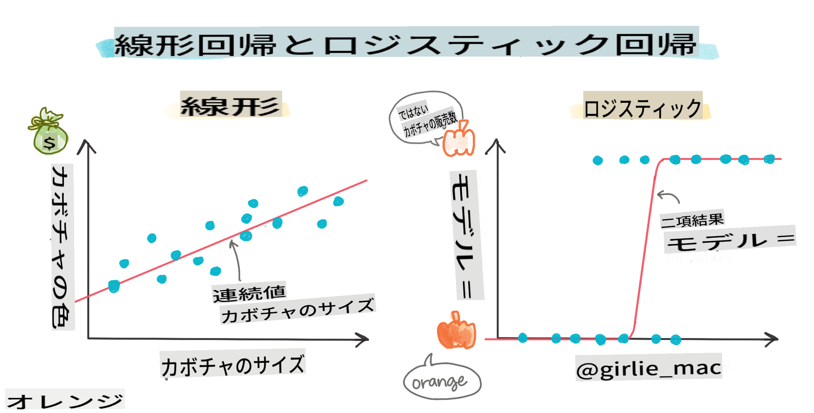
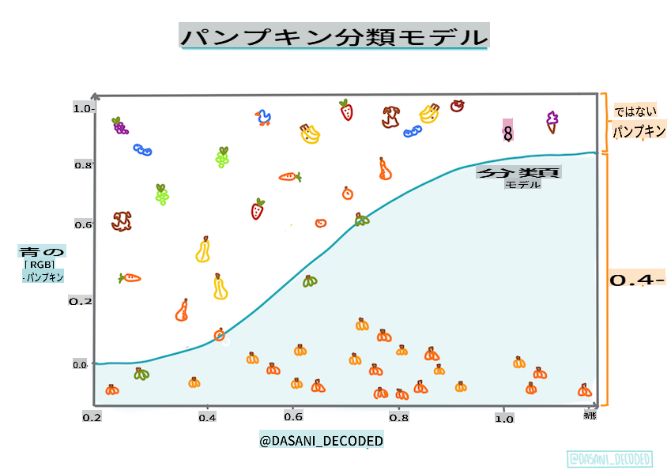
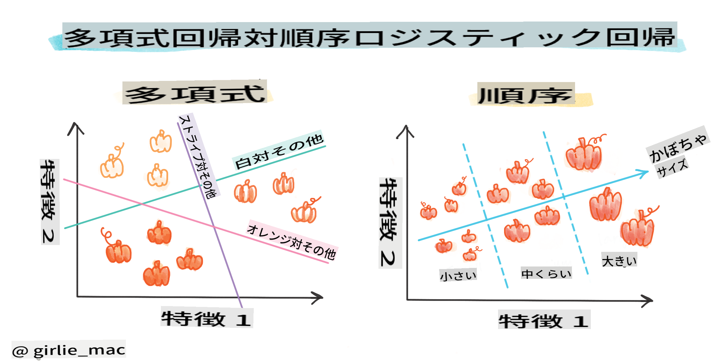
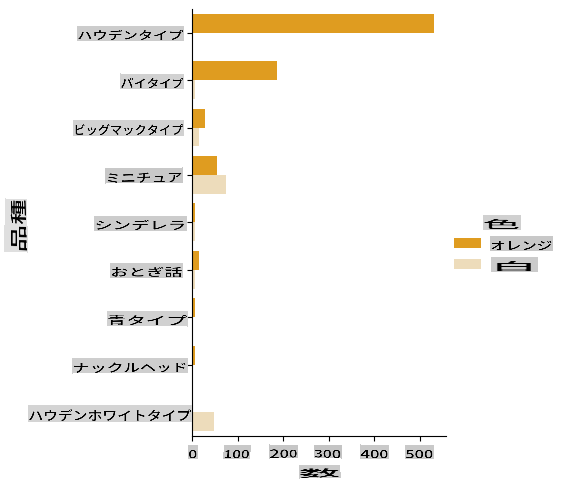
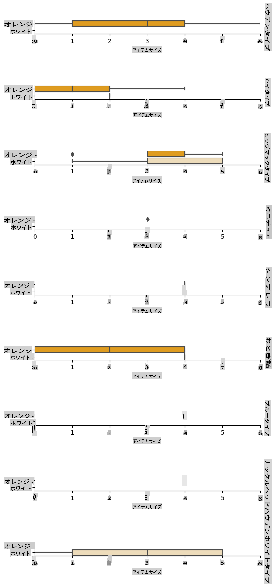
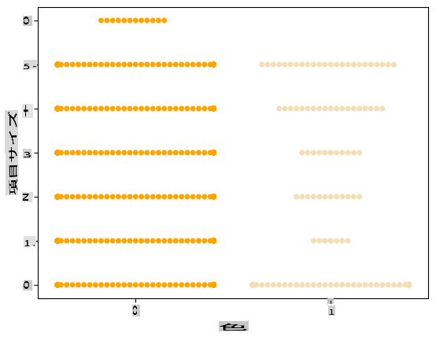
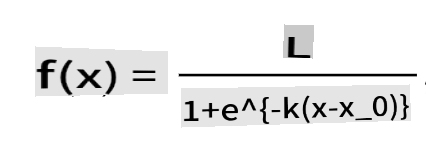

# カテゴリー予測のためのロジスティック回帰



## [講義前クイズ](https://gray-sand-07a10f403.1.azurestaticapps.net/quiz/15/)

> ### [このレッスンはRでも利用可能です！](../../../../2-Regression/4-Logistic/solution/R/lesson_4.html)

## はじめに

この回帰に関する最終レッスンでは、基本的な _クラシック_ な機械学習技術の一つであるロジスティック回帰について見ていきます。この技術を使用して、二値のカテゴリーを予測するパターンを発見することができます。このキャンディーはチョコレートかどうか？この病気は伝染するかどうか？この顧客はこの製品を選ぶかどうか？

このレッスンで学ぶこと：

- データビジュアライゼーションのための新しいライブラリ
- ロジスティック回帰の技術

✅ このタイプの回帰を扱う理解を深めるために、この [Learnモジュール](https://docs.microsoft.com/learn/modules/train-evaluate-classification-models?WT.mc_id=academic-77952-leestott) を参照してください。

## 前提条件

パンプキンデータを扱ってきたので、二値のカテゴリーが一つあることに気づくことができました：`Color`。

いくつかの変数を与えられた場合に、_特定のカボチャの色がオレンジ 🎃 か白 👻 かを予測する_ ロジスティック回帰モデルを構築しましょう。

> なぜ回帰に関するレッスンで二値分類について話しているのか？それは言語的な便宜のためであり、ロジスティック回帰は [実際には分類方法](https://scikit-learn.org/stable/modules/linear_model.html#logistic-regression) ですが、線形に基づいているためです。次のレッスングループでは、データを分類する他の方法について学びます。

## 質問を定義する

私たちの目的のために、これを「白」または「白ではない」として表現します。データセットには「ストライプ」カテゴリもありますが、インスタンスが少ないため使用しません。データセットからnull値を削除すると、いずれにせよ消えます。

> 🎃 面白い事実：白いカボチャを「ゴーストカボチャ」と呼ぶことがあります。彫るのが難しいので、オレンジのカボチャほど人気はありませんが、見た目はクールです！したがって、質問を「ゴースト」または「ゴーストではない」と再定義することもできます。👻

## ロジスティック回帰について

ロジスティック回帰は、以前に学んだ線形回帰とはいくつかの重要な点で異なります。

[](https://youtu.be/KpeCT6nEpBY "ML初心者向け - 機械学習分類のためのロジスティック回帰の理解")

> 🎥 上の画像をクリックして、ロジスティック回帰の概要を短いビデオで確認してください。

### 二値分類

ロジスティック回帰は、線形回帰と同じ機能を提供しません。前者は二値のカテゴリー（「白か白ではない」）についての予測を提供しますが、後者は連続的な値を予測することができます。たとえば、カボチャの産地と収穫時期を考慮して、_その価格がどの程度上昇するか_ を予測できます。


> インフォグラフィック by [Dasani Madipalli](https://twitter.com/dasani_decoded)

### 他の分類

ロジスティック回帰には、他にも多項式や順序などの種類があります：

- **多項式**：複数のカテゴリを持つもの - 「オレンジ、白、ストライプ」。
- **順序**：順序付けられたカテゴリを持つもの。たとえば、カボチャのサイズ（ミニ、小、中、大、XL、XXL）で順序付ける場合など。



### 変数が相関している必要はない

線形回帰がより相関のある変数でうまく機能することを覚えていますか？ロジスティック回帰はその逆で、変数が一致する必要はありません。このデータには、やや弱い相関がありますが、それでも機能します。

### たくさんのクリーンなデータが必要

ロジスティック回帰は、データが多いほど正確な結果をもたらします。私たちの小さなデータセットはこのタスクには最適ではないので、それを念頭に置いてください。

[](https://youtu.be/B2X4H9vcXTs "ML初心者向け - ロジスティック回帰のためのデータ分析と準備")

> 🎥 上の画像をクリックして、線形回帰のためのデータ準備の概要を短いビデオで確認してください。

✅ ロジスティック回帰に適したデータの種類について考えてみてください。

## 演習 - データの整頓

まず、データを少しクリーンにし、null値を削除し、いくつかの列のみを選択します：

1. 以下のコードを追加します：

    ```python
  
    columns_to_select = ['City Name','Package','Variety', 'Origin','Item Size', 'Color']
    pumpkins = full_pumpkins.loc[:, columns_to_select]

    pumpkins.dropna(inplace=True)
    ```

    新しいデータフレームを覗いてみることもできます：

    ```python
    pumpkins.info
    ```

### ビジュアライゼーション - カテゴリカルプロット

これまでに、パンプキンデータを再度読み込み、いくつかの変数を含むデータセットを保持するようにクリーニングした [スターターノートブック](../../../../2-Regression/4-Logistic/notebook.ipynb) をロードしました。ノートブックでデータフレームを新しいライブラリを使ってビジュアライズしましょう：[Seaborn](https://seaborn.pydata.org/index.html) は、以前使用したMatplotlibの上に構築されています。

Seabornはデータをビジュアライズするための便利な方法を提供します。たとえば、`Variety`と`Color`のデータの分布をカテゴリカルプロットで比較することができます。

1. `catplot` function, using our pumpkin data `pumpkins` を使用して、各カボチャカテゴリ（オレンジまたは白）の色マッピングを指定して、プロットを作成します：

    ```python
    import seaborn as sns
    
    palette = {
    'ORANGE': 'orange',
    'WHITE': 'wheat',
    }

    sns.catplot(
    data=pumpkins, y="Variety", hue="Color", kind="count",
    palette=palette, 
    )
    ```

    

    データを観察することで、色データがVarietyにどのように関連しているかがわかります。

    ✅ このカテゴリカルプロットを見て、どのような興味深い探索ができるか考えてみてください。

### データ前処理：特徴とラベルのエンコーディング
私たちのカボチャデータセットには、すべての列に文字列値が含まれています。カテゴリカルデータを扱うことは人間にとっては直感的ですが、機械にはそうではありません。機械学習アルゴリズムは数値でうまく機能します。そのため、エンコーディングはデータ前処理フェーズで非常に重要なステップです。これにより、カテゴリカルデータを数値データに変換することができ、情報を失うことなく行えます。良いエンコーディングは良いモデルの構築につながります。

特徴エンコーディングには2つの主要なエンコーダーがあります：

1. 順序エンコーダー：これは順序変数に適しています。順序変数は、データが論理的な順序に従うカテゴリカル変数です。私たちのデータセットの`Item Size`列のようなものです。各カテゴリを数値で表し、その列の順序に従ってマッピングを作成します。

    ```python
    from sklearn.preprocessing import OrdinalEncoder

    item_size_categories = [['sml', 'med', 'med-lge', 'lge', 'xlge', 'jbo', 'exjbo']]
    ordinal_features = ['Item Size']
    ordinal_encoder = OrdinalEncoder(categories=item_size_categories)
    ```

2. カテゴリカルエンコーダー：これは名義変数に適しています。名義変数は、データが論理的な順序に従わないカテゴリカル変数です。データセットの`Item Size`以外のすべての特徴がこれに該当します。これはワンホットエンコーディングであり、各カテゴリをバイナリ列で表します。エンコードされた変数が1の場合、そのカボチャがそのVarietyに属し、0の場合はそうではありません。

    ```python
    from sklearn.preprocessing import OneHotEncoder

    categorical_features = ['City Name', 'Package', 'Variety', 'Origin']
    categorical_encoder = OneHotEncoder(sparse_output=False)
    ```
その後、`ColumnTransformer`を使用して、複数のエンコーダーを1つのステップに組み合わせて適切な列に適用します。

```python
    from sklearn.compose import ColumnTransformer
    
    ct = ColumnTransformer(transformers=[
        ('ord', ordinal_encoder, ordinal_features),
        ('cat', categorical_encoder, categorical_features)
        ])
    
    ct.set_output(transform='pandas')
    encoded_features = ct.fit_transform(pumpkins)
```
一方、ラベルをエンコードするために、scikit-learnの`LabelEncoder`クラスを使用します。これは、ラベルを0からn_classes-1（ここでは0と1）の間の値のみを含むように正規化するユーティリティクラスです。

```python
    from sklearn.preprocessing import LabelEncoder

    label_encoder = LabelEncoder()
    encoded_label = label_encoder.fit_transform(pumpkins['Color'])
```
特徴とラベルをエンコードしたら、新しいデータフレーム`encoded_pumpkins`にマージできます。

```python
    encoded_pumpkins = encoded_features.assign(Color=encoded_label)
```
✅ 順序エンコーダーを`Item Size` column?

### Analyse relationships between variables

Now that we have pre-processed our data, we can analyse the relationships between the features and the label to grasp an idea of how well the model will be able to predict the label given the features.
The best way to perform this kind of analysis is plotting the data. We'll be using again the Seaborn `catplot` function, to visualize the relationships between `Item Size`,  `Variety`および`Color`にカテゴリカルプロットで使用する利点は何ですか？データをよりよくプロットするために、エンコードされた`Item Size` column and the unencoded `Variety`列を使用します。

```python
    palette = {
    'ORANGE': 'orange',
    'WHITE': 'wheat',
    }
    pumpkins['Item Size'] = encoded_pumpkins['ord__Item Size']

    g = sns.catplot(
        data=pumpkins,
        x="Item Size", y="Color", row='Variety',
        kind="box", orient="h",
        sharex=False, margin_titles=True,
        height=1.8, aspect=4, palette=palette,
    )
    g.set(xlabel="Item Size", ylabel="").set(xlim=(0,6))
    g.set_titles(row_template="{row_name}")
```


### スウォームプロットを使用する

色は二値のカテゴリ（白か白ではない）であるため、ビジュアライゼーションには「[特化したアプローチ](https://seaborn.pydata.org/tutorial/categorical.html?highlight=bar)」が必要です。このカテゴリと他の変数の関係をビジュアライズする他の方法もあります。

Seabornプロットを使用して変数を並べて視覚化することができます。

1. 値の分布を示すために「スウォーム」プロットを試してみてください：

    ```python
    palette = {
    0: 'orange',
    1: 'wheat'
    }
    sns.swarmplot(x="Color", y="ord__Item Size", data=encoded_pumpkins, palette=palette)
    ```

    

**注意**：上記のコードは警告を生成する可能性があります。これはSeabornがスウォームプロットに多くのデータポイントを表示するのに失敗するためです。解決策として、マーカーのサイズを「size」パラメーターを使用して小さくすることが考えられます。ただし、これによりプロットの可読性が影響を受ける可能性があることに注意してください。

> **🧮 数学を見せて**
>
> ロジスティック回帰は「最大尤度」の概念に依存しており、[シグモイド関数](https://wikipedia.org/wiki/Sigmoid_function)を使用します。プロット上の「シグモイド関数」は「S」字型に見えます。これは値を取り、それを0から1の間のどこかにマッピングします。この曲線は「ロジスティック曲線」とも呼ばれます。その公式は次のようになります：
>
> 
>
> ここで、シグモイドの中点はxの0点にあり、Lは曲線の最大値、kは曲線の急峻さです。関数の結果が0.5を超える場合、そのラベルは二値選択の「1」として分類されます。それ以外の場合は「0」として分類されます。

## モデルを構築する

Scikit-learnでこの二値分類を見つけるモデルを構築するのは驚くほど簡単です。

[](https://youtu.be/MmZS2otPrQ8 "ML初心者向け - データの分類のためのロジスティック回帰")

> 🎥 上の画像をクリックして、線形回帰モデルの構築についての短いビデオを確認してください。

1. 分類モデルで使用する変数を選択し、`train_test_split()`を呼び出してトレーニングセットとテストセットに分割します：

    ```python
    from sklearn.model_selection import train_test_split
    
    X = encoded_pumpkins[encoded_pumpkins.columns.difference(['Color'])]
    y = encoded_pumpkins['Color']

    X_train, X_test, y_train, y_test = train_test_split(X, y, test_size=0.2, random_state=0)
    
    ```

2. 次に、トレーニングデータを使用してモデルをトレーニングし、結果を出力します：

    ```python
    from sklearn.metrics import f1_score, classification_report 
    from sklearn.linear_model import LogisticRegression

    model = LogisticRegression()
    model.fit(X_train, y_train)
    predictions = model.predict(X_test)

    print(classification_report(y_test, predictions))
    print('Predicted labels: ', predictions)
    print('F1-score: ', f1_score(y_test, predictions))
    ```

    モデルのスコアボードを見てみましょう。約1000行のデータしかないことを考えると、悪くないです：

    ```output
                       precision    recall  f1-score   support
    
                    0       0.94      0.98      0.96       166
                    1       0.85      0.67      0.75        33
    
        accuracy                                0.92       199
        macro avg           0.89      0.82      0.85       199
        weighted avg        0.92      0.92      0.92       199
    
        Predicted labels:  [0 0 0 0 0 0 0 0 0 0 0 0 0 0 0 0 0 0 0 0 1 0 0 1 0 0 0 0 0 0 0 0 1 0 0 0 0
        0 0 0 0 0 1 0 1 0 0 1 0 0 0 0 0 1 0 1 0 1 0 1 0 0 0 0 0 0 0 0 0 0 0 0 0 0
        1 0 0 0 0 0 0 0 1 0 0 0 0 0 0 0 1 0 0 0 0 0 0 0 0 1 0 1 0 0 0 0 0 0 0 1 0
        0 0 0 0 0 0 0 0 0 0 0 0 0 0 0 0 0 0 0 0 0 1 0 0 0 0 0 0 0 0 1 0 0 0 1 1 0
        0 0 0 0 1 0 0 0 0 0 1 0 0 0 0 0 0 0 0 0 0 0 0 0 0 0 0 0 0 0 0 0 0 0 0 0 1
        0 0 0 1 0 0 0 0 0 0 0 0 1 1]
        F1-score:  0.7457627118644068
    ```

## 混同行列による理解の向上

上記の項目を印刷してスコアボードレポートを取得することもできますが、[混同行列](https://scikit-learn.org/stable/modules/model_evaluation.html#confusion-matrix)を使用してモデルのパフォーマンスを理解する方が簡単かもしれません。

> 🎓 「[混同行列](https://wikipedia.org/wiki/Confusion_matrix)」または「エラーマトリックス」は、モデルの真陽性と偽陽性、および真陰性と偽陰性を表現する表であり、予測の正確性を測定します。

1. 混同行列を使用するには、`confusion_matrix()`を呼び出します：

    ```python
    from sklearn.metrics import confusion_matrix
    confusion_matrix(y_test, predictions)
    ```

    モデルの混同行列を見てみましょう：

    ```output
    array([[162,   4],
           [ 11,  22]])
    ```

Scikit-learnの混同行列では、行（軸0）は実際のラベルであり、列（軸1）は予測されたラベルです。

|       |   0   |   1   |
| :---: | :---: | :---: |
|   0   |  TN   |  FP   |
|   1   |  FN   |  TP   |

ここで何が起こっているのでしょうか？たとえば、モデルがカボチャを「白」と「白ではない」という二値カテゴリに分類するとしましょう。

- モデルがカボチャを「白ではない」と予測し、実際に「白ではない」カテゴリに属する場合、これを真陰性（TN）と呼びます。これは左上の数字で示されます。
- モデルがカボチャを「白」と予測し、実際に「白ではない」カテゴリに属する場合、これを偽陰性（FN）と呼びます。これは左下の数字で示されます。
- モデルがカボチャを「白ではない」と予測し、実際に「白」カテゴリに属する場合、これを偽陽性（FP）と呼びます。これは右上の数字で示されます。
- モデルがカボチャを「白」と予測し、実際に「白」カテゴリに属する場合、これを真陽性（TP）と呼びます。これは右下の数字で示されます。

予想通り、真陽性と真陰性の数が多く、偽陽性と偽陰性の数が少ない方が、モデルのパフォーマンスが優れていることを示します。

混同行列が精度と再現率にどのように関連しているかを見てみましょう。前述の分類レポートには精度（0.85）と再現率（0.67）が表示されました。

精度 = tp / (tp + fp) = 22 / (22 + 4) = 0.8461538461538461

再現率 = tp / (tp + fn) = 22 / (22 + 11) = 0.6666666666666666

✅ Q: 混同行列によると、モデルはどうでしたか？ A: 悪くないです。真陰性の数が多いですが、偽陰性もいくつかあります。

混同行列のTP/TNとFP/FNのマッピングを使用して、先ほど見た用語を再確認しましょう：

🎓 精度：TP/(TP + FP) 

**免責事項**:
この文書は機械ベースのAI翻訳サービスを使用して翻訳されています。正確さを期しておりますが、自動翻訳には誤りや不正確さが含まれる場合がありますのでご注意ください。原文の言語による元の文書を信頼できる情報源とみなすべきです。重要な情報については、専門の人間による翻訳をお勧めします。この翻訳の使用に起因する誤解や誤訳について、当社は一切の責任を負いません。