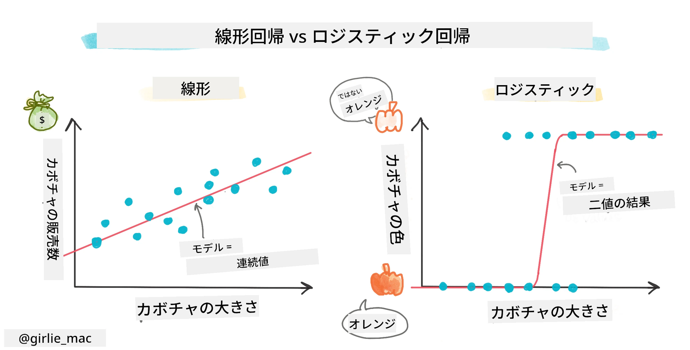
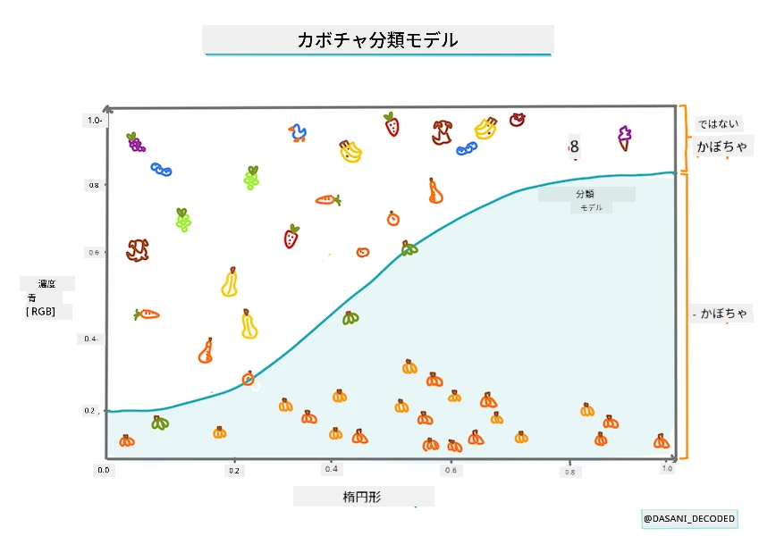
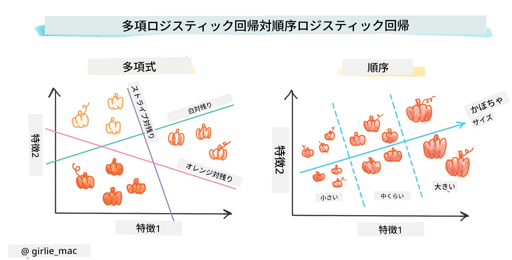
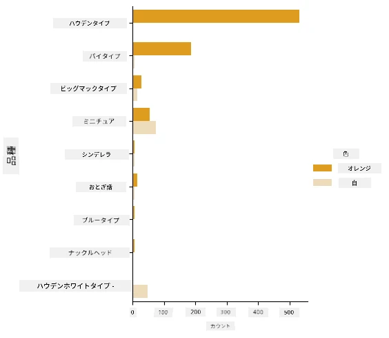
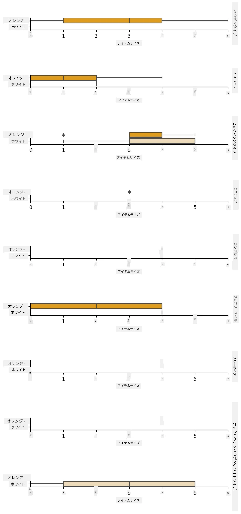
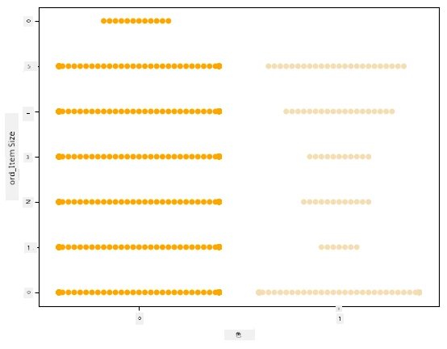
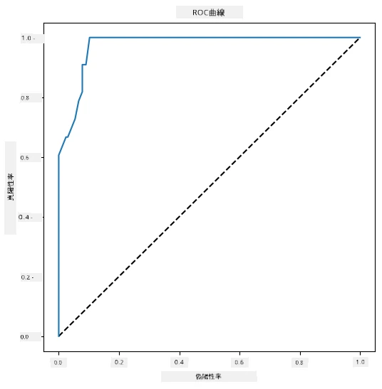

# カテゴリを予測するためのロジスティック回帰



## [講義前クイズ](https://ff-quizzes.netlify.app/en/ml/)

> ### [このレッスンはRでも利用可能です！](../../../../2-Regression/4-Logistic/solution/R/lesson_4.html)

## はじめに

この回帰分析の最終レッスンでは、基本的な_古典的_機械学習技術の一つであるロジスティック回帰を見ていきます。この手法は、2値のカテゴリを予測するパターンを見つけるために使います。このキャンディはチョコレートか？この病気は伝染性か？この顧客はこの製品を選ぶか？というような予測です。

このレッスンで学ぶこと:

- 新しいデータ可視化ライブラリー
- ロジスティック回帰の技法

✅ このタイプの回帰を使う理解を深めるには、この [Learn モジュール](https://docs.microsoft.com/learn/modules/train-evaluate-classification-models?WT.mc_id=academic-77952-leestott) をご覧ください

## 前提条件

かぼちゃのデータで作業したことで、`Color`という2値カテゴリがあることは十分に理解しています。

それを予測するロジスティック回帰モデルを構築しましょう。与えられた変数から、_かぼちゃがどの色である可能性が高いか_（オレンジ 🎃か白 👻か）を予測します。

> なぜ回帰のグループのレッスンで2値分類の話をするのか？それは言語的な便宜のためだけです。ロジスティック回帰は[実際には分類手法](https://scikit-learn.org/stable/modules/linear_model.html#logistic-regression)であり、線形ベースの分類法だからです。次のレッスングループで他のデータ分類の方法を学びます。

## 質問を定義する

ここでは、2値として「白」か「白でない」かで表します。データセットには「縞模様」というカテゴリーもありますが、事例数が少ないため使用しません。欠損値を取り除くと消えてしまいます。

> 🎃 面白いことに、白かぼちゃは「ゴースト」かぼちゃと呼ぶことがあります。彫るのが難しいのでオレンジより人気はありませんが見た目はかっこいいです！質問を「ゴーストか否か」に変えることもできます。👻

## ロジスティック回帰について

ロジスティック回帰は、前に学んだ線形回帰といくつか重要な点で異なります。

[](https://youtu.be/KpeCT6nEpBY "初心者向けML - 機械学習の分類のためのロジスティック回帰の理解")

> 🎥 上の画像をクリックするとロジスティック回帰の短いビデオ概要がご覧になれます。

### 2値分類

ロジスティック回帰は線形回帰と同じ特徴を提供しません。前者は2値カテゴリ（「白か白でないか」）の予測を行うのに対し、後者は連続値、例えばかぼちゃの産地や収穫時期から「価格がどれだけ上がるか」を予測できます。


> インフォグラフィック [Dasani Madipalli](https://twitter.com/dasani_decoded) 提供

### 他の分類

ロジスティック回帰には、多項および順序分類もあります：

- <strong>多項分類</strong>は複数のカテゴリを対象にします - 「オレンジ、白、縞模様」。
- <strong>順序分類</strong>は順序付けられたカテゴリに対応し、かぼちゃのサイズのように（mini, sm, med, lg, xl, xxl）順序がある場合に役立ちます。



### 変数は必ずしも相関している必要はない

線形回帰はより相関の強い変数があるほど効果的でしたが、ロジスティック回帰は逆で、変数が一致している必要はありません。このデータは相関がやや弱いので適しています。

### 多くのクリーンなデータが必要

ロジスティック回帰は多くのデータを使うほど精度が上がります。私たちの小さなデータセットは最適ではないことを念頭に置いてください。

[](https://youtu.be/B2X4H9vcXTs "初心者向けML - ロジスティック回帰のためのデータ分析と準備")

> 🎥 上の画像をクリックすると線形回帰のためのデータ準備の短いビデオ概要が見られます

✅ ロジスティック回帰に適したデータの種類を考えてみましょう

## 演習 - データを整える

まず、欠損値を削除し、一部の列だけ選択してデータを少し清掃しましょう：

1. 以下のコードを追加：

    ```python
  
    columns_to_select = ['City Name','Package','Variety', 'Origin','Item Size', 'Color']
    pumpkins = full_pumpkins.loc[:, columns_to_select]

    pumpkins.dropna(inplace=True)
    ```

    新しいデータフレームをのぞいてみましょう：

    ```python
    pumpkins.info
    ```

### 可視化 - カテゴリカルプロット

ここまでに、[スターターノートブック](./notebook.ipynb)を使って再びかぼちゃのデータを読み込み、`Color`を含む数個の変数を保持するデータセットに整形しました。異なるライブラリでデータフレームを可視化しましょう。[Seaborn](https://seaborn.pydata.org/index.html)はMatplotlibを基盤としており、以前使いました。

Seabornにはデータ可視化の便利な手法がいくつかあります。例えば、`Variety`と`Color`ごとの分布をカテゴリカルプロットで比較できます。

1. `catplot`関数で、このプロットを作ります。かぼちゃデータ`pumpkins`を使い、かぼちゃの各カテゴリ（オレンジか白か）の色指定もします：

    ```python
    import seaborn as sns
    
    palette = {
    'ORANGE': 'orange',
    'WHITE': 'wheat',
    }

    sns.catplot(
    data=pumpkins, y="Variety", hue="Color", kind="count",
    palette=palette, 
    )
    ```

    

    データを観察すると、ColorデータがVarietyとどう関係あるか見られます。

    ✅ このカテゴリカルプロットを見て、どんな興味深い探索ができそうですか？

### データ前処理：特徴量とラベルのエンコーディング
かぼちゃのデータセットは全て文字列です。カテゴリデータは人間には直感的ですが、機械にはそうではありません。機械学習アルゴリズムは数字が得意です。だからエンコードはとても重要で、情報を失わずにカテゴリデータを数値データに変換します。良いエンコードは良いモデルを作ります。

特徴量エンコードには主に2種類あります：

1. 順序エンコーダ：順序付き変数（例えばこのデータセットの`Item Size`列）に適し、各カテゴリを列内の順序に従い番号で表します。

    ```python
    from sklearn.preprocessing import OrdinalEncoder

    item_size_categories = [['sml', 'med', 'med-lge', 'lge', 'xlge', 'jbo', 'exjbo']]
    ordinal_features = ['Item Size']
    ordinal_encoder = OrdinalEncoder(categories=item_size_categories)
    ```

2. カテゴリエンコーダ：名義変数（`Item Size`以外の特徴量）に適し、ワンホットエンコードで各カテゴリを二進の列で表します。対象のかぼちゃがそのVarietyなら1、それ以外は0です。

    ```python
    from sklearn.preprocessing import OneHotEncoder

    categorical_features = ['City Name', 'Package', 'Variety', 'Origin']
    categorical_encoder = OneHotEncoder(sparse_output=False)
    ```
次に`ColumnTransformer`を使って複数のエンコーダを1ステップにまとめて適用します。

```python
    from sklearn.compose import ColumnTransformer
    
    ct = ColumnTransformer(transformers=[
        ('ord', ordinal_encoder, ordinal_features),
        ('cat', categorical_encoder, categorical_features)
        ])
    
    ct.set_output(transform='pandas')
    encoded_features = ct.fit_transform(pumpkins)
```
ラベルのエンコードにはscikit-learnの`LabelEncoder`クラスを使います。これはラベルを0からn_classes-1（ここでは0と1）の値に正規化するユーティリティクラスです。

```python
    from sklearn.preprocessing import LabelEncoder

    label_encoder = LabelEncoder()
    encoded_label = label_encoder.fit_transform(pumpkins['Color'])
```
特徴量とラベルをエンコードしたら、新しいデータフレーム`encoded_pumpkins`に結合できます。

```python
    encoded_pumpkins = encoded_features.assign(Color=encoded_label)
```
✅ `Item Size`列に順序エンコーダを使う利点は何ですか？

### 変数間の関係を分析する

データを前処理したので、特徴量とラベルの関係を分析しましょう。モデルが特徴量からラベルをどれだけ正確に予測できるか把握できます。
分析の最良の方法はデータをプロットすることです。再びSeabornの`catplot`関数で、`Item Size`、`Variety`、`Color`の関係をカテゴリカルプロットで可視化します。ここではエンコードした`Item Size`列とエンコードしていない`Variety`列を使います。

```python
    palette = {
    'ORANGE': 'orange',
    'WHITE': 'wheat',
    }
    pumpkins['Item Size'] = encoded_pumpkins['ord__Item Size']

    g = sns.catplot(
        data=pumpkins,
        x="Item Size", y="Color", row='Variety',
        kind="box", orient="h",
        sharex=False, margin_titles=True,
        height=1.8, aspect=4, palette=palette,
    )
    g.set(xlabel="Item Size", ylabel="").set(xlim=(0,6))
    g.set_titles(row_template="{row_name}")
```


### スウォームプロットを使う

Colorは2値カテゴリ（白か否か）なので、「[専門的な手法](https://seaborn.pydata.org/tutorial/categorical.html?highlight=bar)」を使って可視化する必要があります。このカテゴリと他の変数の関係を表現する他の方法もあります。

Seabornプロットを使い変数を並べて可視化できます。

1. 「スウォーム」プロットを試して、値の分布を示しましょう：

    ```python
    palette = {
    0: 'orange',
    1: 'wheat'
    }
    sns.swarmplot(x="Color", y="ord__Item Size", data=encoded_pumpkins, palette=palette)
    ```

    

<strong>注意</strong>：上のコードはデータ数が多いため警告を出す場合があります。'size'パラメーターでマーカーのサイズを小さくすると解決しますが、読みやすさが下がることに注意してください。


> **🧮 数学的な解説**
>
> ロジスティック回帰は[シグモイド関数](https://wikipedia.org/wiki/Sigmoid_function)を使った「最尤推定」の概念に基づいています。プロット上の「シグモイド関数」はS字型をしており、値を0から1の間に写像します。この曲線は「ロジスティック曲線」とも呼ばれます。数式は以下のようになります：
>
> 
>
> シグモイドの中点はxの0点にあり、Lは曲線の最大値、kは傾きの急さを示します。関数の出力が0.5より大きければ、そのラベルはバイナリ選択の「1」クラスに分類されます。そうでなければ「0」となります。

## モデルを構築する

2値分類を見つけるモデル構築はScikit-learnでは驚くほど簡単です。

[](https://youtu.be/MmZS2otPrQ8 "初心者向けML - データの分類のためのロジスティック回帰")

> 🎥 上の画像をクリックすると線形回帰モデル構築の短いビデオ概要が見られます

1. 分類モデルに使いたい変数を選択し、`train_test_split()`で訓練・テストデータに分割します：

    ```python
    from sklearn.model_selection import train_test_split
    
    X = encoded_pumpkins[encoded_pumpkins.columns.difference(['Color'])]
    y = encoded_pumpkins['Color']

    X_train, X_test, y_train, y_test = train_test_split(X, y, test_size=0.2, random_state=0)
    
    ```

2. 訓練データに対して`fit()`を呼び出しモデルを訓練し、その結果を表示します：

    ```python
    from sklearn.metrics import f1_score, classification_report 
    from sklearn.linear_model import LogisticRegression

    model = LogisticRegression()
    model.fit(X_train, y_train)
    predictions = model.predict(X_test)

    print(classification_report(y_test, predictions))
    print('Predicted labels: ', predictions)
    print('F1-score: ', f1_score(y_test, predictions))
    ```

    モデルのスコアボードを確認しましょう。約1000行のデータしかない割には悪くありません：

    ```output
                       precision    recall  f1-score   support
    
                    0       0.94      0.98      0.96       166
                    1       0.85      0.67      0.75        33
    
        accuracy                                0.92       199
        macro avg           0.89      0.82      0.85       199
        weighted avg        0.92      0.92      0.92       199
    
        Predicted labels:  [0 0 0 0 0 0 0 0 0 0 0 0 0 0 0 0 0 0 0 0 1 0 0 1 0 0 0 0 0 0 0 0 1 0 0 0 0
        0 0 0 0 0 1 0 1 0 0 1 0 0 0 0 0 1 0 1 0 1 0 1 0 0 0 0 0 0 0 0 0 0 0 0 0 0
        1 0 0 0 0 0 0 0 1 0 0 0 0 0 0 0 1 0 0 0 0 0 0 0 0 1 0 1 0 0 0 0 0 0 0 1 0
        0 0 0 0 0 0 0 0 0 0 0 0 0 0 0 0 0 0 0 0 0 1 0 0 0 0 0 0 0 0 1 0 0 0 1 1 0
        0 0 0 0 1 0 0 0 0 0 1 0 0 0 0 0 0 0 0 0 0 0 0 0 0 0 0 0 0 0 0 0 0 0 0 0 1
        0 0 0 1 0 0 0 0 0 0 0 0 1 1]
        F1-score:  0.7457627118644068
    ```

## 混同行列でより深く理解する

スコアボード報告は[こちらの用語](https://scikit-learn.org/stable/modules/generated/sklearn.metrics.classification_report.html?highlight=classification_report#sklearn.metrics.classification_report)を印字して得られますが、[混同行列](https://scikit-learn.org/stable/modules/model_evaluation.html#confusion-matrix)を使うとモデルの性能をより理解しやすくなります。

> 🎓 '[混同行列](https://wikipedia.org/wiki/Confusion_matrix)'（あるいは「エラー行列」）とは、モデルの真陽性、偽陽性、真陰性、偽陰性を表す表で、予測精度を測るものです。

1. 混同行列を使うには、`confusion_matrix()`を呼び出します：

    ```python
    from sklearn.metrics import confusion_matrix
    confusion_matrix(y_test, predictions)
    ```

    モデルの混同行列を見てみましょう：

    ```output
    array([[162,   4],
           [ 11,  22]])
    ```

Scikit-learnの混同行列では行（軸0）が実際のラベル、列（軸1）が予測ラベルです。

|       |   0   |   1   |
| :---: | :---: | :---: |
|   0   |  TN   |  FP   |
|   1   |  FN   |  TP   |

これはどういう意味でしょう？モデルに、かぼちゃの2つのカテゴリ「白」と「白でない」を分類するように依頼されたとします。

- モデルがかぼちゃを白でないと予測し、実際も「白でない」なら真陰性で、左上の数字で示されます。
- モデルがかぼちゃを白と予測し、実際は「白でない」なら偽陽性で、左下の数字で示されます。
- モデルがかぼちゃを白でないと予測し、実際は「白」なら偽陰性で、右上の数字で示されます。
- モデルがかぼちゃを白と予測し、実際も「白」なら真陽性で、右下の数字で示されます。


ご想像の通り、真陽性と真陰性の数が多く、偽陽性と偽陰性の数が少ない方が望ましく、これはモデルの性能が良いことを意味します。

混同行列は精度（Precision）と再現率（Recall）にどのように関連していますか？上で表示された分類レポートは、精度（0.85）と再現率（0.67）を示していましたね。

精度 = tp / (tp + fp) = 22 / (22 + 4) = 0.8461538461538461

再現率 = tp / (tp + fn) = 22 / (22 + 11) = 0.6666666666666666

✅ 質問: 混同行列によるとモデルはどうでしたか？ 答え: 悪くはありません。真陰性は十分にありますが、いくつか偽陰性もあります。

混同行列のTP/TNとFP/FNの対応を使って、以前見た用語を再確認しましょう：

🎓 精度（Precision）: TP/(TP + FP) 検索されたインスタンスのうち関連のあるものの割合（例：どのラベルが正しくラベル付けされたか）

🎓 再現率（Recall）: TP/(TP + FN) 検索された関連インスタンスの割合（正しくラベル付けされているかどうかに関わらず）

🎓 f1スコア: (2 * precision * recall)/(precision + recall) 精度と再現率の加重平均であり、最高は1、最低は0

🎓 サポート（Support）: 各ラベルの出現数

🎓 精度（Accuracy）: (TP + TN)/(TP + TN + FP + FN) サンプルに対して正確に予測されたラベルの割合。

🎓 マクロ平均（Macro Avg）: ラベルごとの重みなし平均メトリクスの計算。ラベルの不均衡は考慮しない。

🎓 重み付き平均（Weighted Avg）: ラベルごとにそのサポート（各ラベルの真のインスタンス数）で重み付けして、不均衡を考慮した平均メトリクスの計算。

✅ 偽陰性の数を減らしたい場合、どの指標に注目すべきだと思いますか？

## このモデルのROC曲線を可視化する

[](https://youtu.be/GApO575jTA0 "ML for beginners - Analyzing Logistic Regression Performance with ROC Curves")

> 🎥 上の画像をクリックするとROC曲線の短い動画概要を見ることができます

では、いわゆる「ROC」曲線をもう一つ可視化してみましょう：

```python
from sklearn.metrics import roc_curve, roc_auc_score
import matplotlib
import matplotlib.pyplot as plt
%matplotlib inline

y_scores = model.predict_proba(X_test)
fpr, tpr, thresholds = roc_curve(y_test, y_scores[:,1])

fig = plt.figure(figsize=(6, 6))
plt.plot([0, 1], [0, 1], 'k--')
plt.plot(fpr, tpr)
plt.xlabel('False Positive Rate')
plt.ylabel('True Positive Rate')
plt.title('ROC Curve')
plt.show()
```

Matplotlibを使用して、モデルの[受信者操作特性](https://scikit-learn.org/stable/auto_examples/model_selection/plot_roc.html?highlight=roc)またはROCをプロットします。ROC曲線は通常、真陽性率と偽陽性率から分類器の出力を視覚的に把握するために使われます。 「ROC曲線は通常Y軸に真陽性率、X軸に偽陽性率を示します。」したがって、曲線の急勾配と中間線と曲線との間の空間が重要であり、急速に上昇して中間線を超える曲線を望みます。今回の場合、最初に偽陽性があり、その後きちんと上昇してラインを超えています：



最後に、Scikit-learnの[`roc_auc_score` API](https://scikit-learn.org/stable/modules/generated/sklearn.metrics.roc_auc_score.html?highlight=roc_auc#sklearn.metrics.roc_auc_score)を使って実際の「曲線下面積」（AUC）を計算します：

```python
auc = roc_auc_score(y_test,y_scores[:,1])
print(auc)
```
結果は `0.9749908725812341` です。AUCは0から1の範囲で、大きなスコアが望ましく、予測が100％正確なモデルはAUCが1になります。この場合、モデルは_かなり良い_と言えます。

今後の分類に関するレッスンで、モデルのスコアを改善するために反復する方法を学びますが、今回はおめでとうございます！これらの回帰のレッスンを修了しました！

---
## 🚀チャレンジ

ロジスティック回帰についてはまだまだ解明することがたくさんあります！しかし学ぶ最良の方法は実験することです。このタイプの解析に適したデータセットを見つけてモデルを構築してみましょう。何を学びますか？ヒント: 興味深いデータセットは[ Kaggle](https://www.kaggle.com/search?q=logistic+regression+datasets)で探せます。

## [講義後のクイズ](https://ff-quizzes.netlify.app/en/ml/)

## 復習と自習

[Stanfordのこの論文](https://web.stanford.edu/~jurafsky/slp3/5.pdf)の最初の数ページを読んで、ロジスティック回帰の実用的な利用例を考えてみてください。これまでに学習したタイプの回帰タスクのどちらかにより適したタスクは何でしょうか？どれが最適に働くでしょうか？

## 課題

[この回帰を再挑戦する](assignment.md)

---

<!-- CO-OP TRANSLATOR DISCLAIMER START -->
**免責事項**：
本書類は AI 翻訳サービス [Co-op Translator](https://github.com/Azure/co-op-translator) を使用して翻訳されています。正確性を期していますが、自動翻訳には誤りや不正確な部分が含まれる可能性があることをご承知おきください。原文の原語版が正式な情報源とみなされるべきです。重要な情報については、専門の人間による翻訳を推奨します。本翻訳の利用により生じたいかなる誤解や解釈違いについても、当方は責任を負いかねます。
<!-- CO-OP TRANSLATOR DISCLAIMER END -->