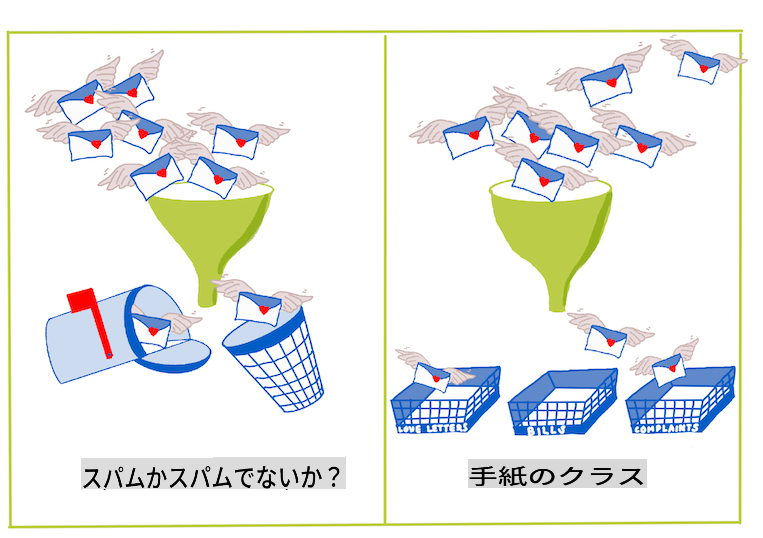
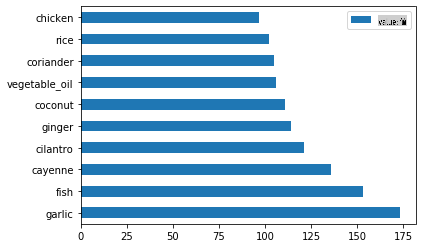
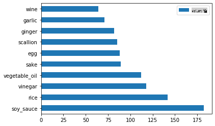
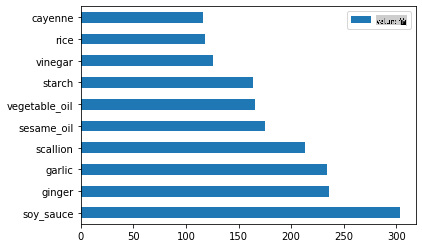
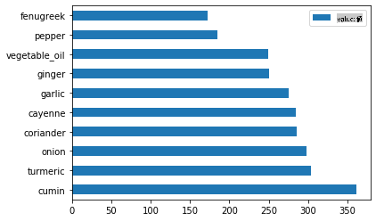
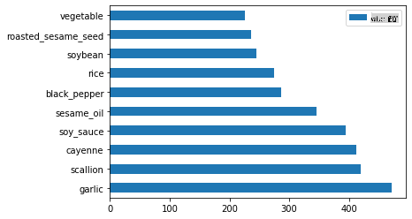

# 分類の紹介

この4つのレッスンでは、クラシックな機械学習の基本的な焦点である_分類_について探ります。アジアとインドの素晴らしい料理に関するデータセットを使用して、さまざまな分類アルゴリズムを使用する方法を説明します。お腹が空いてきましたか？


> これらのレッスンでパンアジア料理を祝おう！画像提供：[Jen Looper](https://twitter.com/jenlooper)

分類は、回帰技術と多くの共通点を持つ[教師あり学習](https://wikipedia.org/wiki/Supervised_learning)の一形態です。機械学習がデータセットを使用して値や名前を予測することに関するものであるならば、分類は一般的に2つのグループに分かれます：_二値分類_と_多クラス分類_です。

[](https://youtu.be/eg8DJYwdMyg "Introduction to classification")

> 🎥 上の画像をクリックしてビデオを視聴：MITのJohn Guttagが分類を紹介

覚えておいてください：

- **線形回帰**は、変数間の関係を予測し、新しいデータポイントがその線とどのように関係するかを正確に予測するのに役立ちました。例えば、_9月と12月のカボチャの価格_を予測することができました。
- **ロジスティック回帰**は、「二値カテゴリ」を発見するのに役立ちました：この価格帯では、_このカボチャはオレンジ色か、オレンジ色でないか_？

分類は、データポイントのラベルやクラスを決定するためにさまざまなアルゴリズムを使用します。この料理データを使用して、材料のグループを観察することで、その料理の起源を特定できるかどうかを見てみましょう。

## [事前クイズ](https://gray-sand-07a10f403.1.azurestaticapps.net/quiz/19/)

> ### [このレッスンはRでも利用可能です！](../../../../4-Classification/1-Introduction/solution/R/lesson_10.html)

### はじめに

分類は、機械学習研究者やデータサイエンティストの基本的な活動の1つです。二値値の基本的な分類（「このメールはスパムかどうか」）から、コンピュータビジョンを使用した複雑な画像分類やセグメンテーションまで、データをクラスに分類し、それに質問する能力は常に役立ちます。

プロセスをより科学的に述べると、分類法は入力変数と出力変数の関係をマッピングする予測モデルを作成します。



> 分類アルゴリズムが処理する二値問題と多クラス問題。インフォグラフィック提供：[Jen Looper](https://twitter.com/jenlooper)

データのクリーニング、視覚化、およびMLタスクの準備を開始する前に、データを分類するために機械学習を使用するさまざまな方法について学びましょう。

[統計学](https://wikipedia.org/wiki/Statistical_classification)に由来する、クラシックな機械学習を使用した分類は、`smoker`、`weight`、および`age`などの特徴を使用して、_X病を発症する可能性_を決定します。以前に行った回帰演習と同様の教師あり学習技術として、データはラベル付けされ、MLアルゴリズムはこれらのラベルを使用してデータセットのクラス（または「特徴」）を分類および予測し、それらをグループまたは結果に割り当てます。

✅ 料理に関するデータセットを想像してみてください。多クラスモデルでは何が答えられるでしょうか？二値モデルでは何が答えられるでしょうか？ある料理がフェヌグリークを使用する可能性があるかどうかを判断したい場合はどうでしょうか？星アニス、アーティチョーク、カリフラワー、ホースラディッシュが入った食料袋をプレゼントされた場合、典型的なインド料理を作れるかどうかを確認したい場合はどうでしょうか？

[](https://youtu.be/GuTeDbaNoEU "Crazy mystery baskets")

> 🎥 上の画像をクリックしてビデオを視聴。ショー「Chopped」の全体の前提は、「ミステリーバスケット」で、シェフがランダムな材料の選択から料理を作らなければならないというものです。確かにMLモデルが役立ったでしょう！

## こんにちは「分類器」

この料理データセットに関して私たちが尋ねたい質問は、実際には**多クラスの質問**です。私たちにはいくつかの潜在的な国の料理があるためです。一連の材料が与えられた場合、そのデータはこれらの多くのクラスのどれに適合するでしょうか？

Scikit-learnは、解決したい問題の種類に応じて、データを分類するために使用できるさまざまなアルゴリズムを提供しています。次の2つのレッスンでは、これらのアルゴリズムのいくつかについて学びます。

## 演習 - データをクリーンアップしてバランスを取る

このプロジェクトを開始する前の最初のタスクは、データをクリーンアップして**バランスを取る**ことです。これにより、より良い結果が得られます。このフォルダーのルートにある空の_notebook.ipynb_ファイルから始めます。

最初にインストールするものは[imblearn](https://imbalanced-learn.org/stable/)です。これはScikit-learnパッケージで、データのバランスをより良く取ることができます（このタスクについては後で詳しく学びます）。

1. `imblearn`をインストールするには、次のように`pip install`を実行します：

    ```python
    pip install imblearn
    ```

1. データをインポートして視覚化するために必要なパッケージをインポートし、`imblearn`から`SMOTE`もインポートします。

    ```python
    import pandas as pd
    import matplotlib.pyplot as plt
    import matplotlib as mpl
    import numpy as np
    from imblearn.over_sampling import SMOTE
    ```

    これで、次にデータをインポートする準備が整いました。

1. 次のタスクはデータのインポートです：

    ```python
    df  = pd.read_csv('../data/cuisines.csv')
    ```

   `read_csv()` will read the content of the csv file _cusines.csv_ and place it in the variable `df`を使用します。

1. データの形状を確認します：

    ```python
    df.head()
    ```

   最初の5行は次のようになります：

    ```output
    |     | Unnamed: 0 | cuisine | almond | angelica | anise | anise_seed | apple | apple_brandy | apricot | armagnac | ... | whiskey | white_bread | white_wine | whole_grain_wheat_flour | wine | wood | yam | yeast | yogurt | zucchini |
    | --- | ---------- | ------- | ------ | -------- | ----- | ---------- | ----- | ------------ | ------- | -------- | --- | ------- | ----------- | ---------- | ----------------------- | ---- | ---- | --- | ----- | ------ | -------- |
    | 0   | 65         | indian  | 0      | 0        | 0     | 0          | 0     | 0            | 0       | 0        | ... | 0       | 0           | 0          | 0                       | 0    | 0    | 0   | 0     | 0      | 0        |
    | 1   | 66         | indian  | 1      | 0        | 0     | 0          | 0     | 0            | 0       | 0        | ... | 0       | 0           | 0          | 0                       | 0    | 0    | 0   | 0     | 0      | 0        |
    | 2   | 67         | indian  | 0      | 0        | 0     | 0          | 0     | 0            | 0       | 0        | ... | 0       | 0           | 0          | 0                       | 0    | 0    | 0   | 0     | 0      | 0        |
    | 3   | 68         | indian  | 0      | 0        | 0     | 0          | 0     | 0            | 0       | 0        | ... | 0       | 0           | 0          | 0                       | 0    | 0    | 0   | 0     | 0      | 0        |
    | 4   | 69         | indian  | 0      | 0        | 0     | 0          | 0     | 0            | 0       | 0        | ... | 0       | 0           | 0          | 0                       | 0    | 0    | 0   | 0     | 1      | 0        |
    ```

1. `info()`を呼び出してこのデータに関する情報を取得します：

    ```python
    df.info()
    ```

    出力は次のようになります：

    ```output
    <class 'pandas.core.frame.DataFrame'>
    RangeIndex: 2448 entries, 0 to 2447
    Columns: 385 entries, Unnamed: 0 to zucchini
    dtypes: int64(384), object(1)
    memory usage: 7.2+ MB
    ```

## 演習 - 料理について学ぶ

ここからが面白くなります。料理ごとのデータの分布を見てみましょう。

1. `barh()`を呼び出してデータをバーとしてプロットします：

    ```python
    df.cuisine.value_counts().plot.barh()
    ```

    

    料理の数は限られていますが、データの分布は不均一です。これを修正できます！その前に、もう少し探ってみましょう。

1. 料理ごとに利用可能なデータの量を調べて印刷します：

    ```python
    thai_df = df[(df.cuisine == "thai")]
    japanese_df = df[(df.cuisine == "japanese")]
    chinese_df = df[(df.cuisine == "chinese")]
    indian_df = df[(df.cuisine == "indian")]
    korean_df = df[(df.cuisine == "korean")]
    
    print(f'thai df: {thai_df.shape}')
    print(f'japanese df: {japanese_df.shape}')
    print(f'chinese df: {chinese_df.shape}')
    print(f'indian df: {indian_df.shape}')
    print(f'korean df: {korean_df.shape}')
    ```

    出力は次のようになります：

    ```output
    thai df: (289, 385)
    japanese df: (320, 385)
    chinese df: (442, 385)
    indian df: (598, 385)
    korean df: (799, 385)
    ```

## 材料の発見

次に、データをさらに深く掘り下げて、各料理の典型的な材料を学びます。料理間の混乱を引き起こす再発データをクリーニングする必要があるので、この問題について学びましょう。

1. Pythonで`create_ingredient()`関数を作成して材料データフレームを作成します。この関数は、役に立たない列を削除し、カウントによって材料をソートすることから始めます：

    ```python
    def create_ingredient_df(df):
        ingredient_df = df.T.drop(['cuisine','Unnamed: 0']).sum(axis=1).to_frame('value')
        ingredient_df = ingredient_df[(ingredient_df.T != 0).any()]
        ingredient_df = ingredient_df.sort_values(by='value', ascending=False,
        inplace=False)
        return ingredient_df
    ```

   これで、この関数を使用して、料理ごとのトップ10の人気材料のアイデアを得ることができます。

1. `create_ingredient()` and plot it calling `barh()`を呼び出します：

    ```python
    thai_ingredient_df = create_ingredient_df(thai_df)
    thai_ingredient_df.head(10).plot.barh()
    ```

    

1. 日本のデータについても同じことを行います：

    ```python
    japanese_ingredient_df = create_ingredient_df(japanese_df)
    japanese_ingredient_df.head(10).plot.barh()
    ```

    

1. 次に、中国の材料についても同じことを行います：

    ```python
    chinese_ingredient_df = create_ingredient_df(chinese_df)
    chinese_ingredient_df.head(10).plot.barh()
    ```

    

1. インドの材料をプロットします：

    ```python
    indian_ingredient_df = create_ingredient_df(indian_df)
    indian_ingredient_df.head(10).plot.barh()
    ```

    

1. 最後に、韓国の材料をプロットします：

    ```python
    korean_ingredient_df = create_ingredient_df(korean_df)
    korean_ingredient_df.head(10).plot.barh()
    ```

    

1. `drop()`を呼び出して、異なる料理間で混乱を引き起こす最も一般的な材料を削除します：

   みんなお米、にんにく、しょうがが大好きです！

    ```python
    feature_df= df.drop(['cuisine','Unnamed: 0','rice','garlic','ginger'], axis=1)
    labels_df = df.cuisine #.unique()
    feature_df.head()
    ```

## データセットのバランスを取る

データをクリーンアップしたので、[SMOTE](https://imbalanced-learn.org/dev/references/generated/imblearn.over_sampling.SMOTE.html) - 「合成少数オーバーサンプリング技術」 - を使用してバランスを取ります。

1. `fit_resample()`を呼び出します。この戦略は、補間によって新しいサンプルを生成します。

    ```python
    oversample = SMOTE()
    transformed_feature_df, transformed_label_df = oversample.fit_resample(feature_df, labels_df)
    ```

    データのバランスを取ることで、分類時により良い結果が得られます。二値分類を考えてみてください。データのほとんどが1つのクラスである場合、MLモデルはそのクラスをより頻繁に予測します。なぜなら、そのクラスのデータが多いためです。データのバランスを取ることで、偏ったデータを取り除き、この不均衡を解消するのに役立ちます。

1. 次に、材料ごとのラベルの数を確認します：

    ```python
    print(f'new label count: {transformed_label_df.value_counts()}')
    print(f'old label count: {df.cuisine.value_counts()}')
    ```

    出力は次のようになります：

    ```output
    new label count: korean      799
    chinese     799
    indian      799
    japanese    799
    thai        799
    Name: cuisine, dtype: int64
    old label count: korean      799
    indian      598
    chinese     442
    japanese    320
    thai        289
    Name: cuisine, dtype: int64
    ```

    データはきれいでバランスが取れており、とてもおいしそうです！

1. 最後のステップは、ラベルと特徴を含むバランスの取れたデータを新しいデータフレームに保存し、ファイルにエクスポートできるようにすることです：

    ```python
    transformed_df = pd.concat([transformed_label_df,transformed_feature_df],axis=1, join='outer')
    ```

1. `transformed_df.head()` and `transformed_df.info()`を使用してデータをもう一度確認できます。今後のレッスンで使用するためにこのデータのコピーを保存します：

    ```python
    transformed_df.head()
    transformed_df.info()
    transformed_df.to_csv("../data/cleaned_cuisines.csv")
    ```

    この新しいCSVはルートデータフォルダーにあります。

---

## 🚀チャレンジ

このカリキュラムにはいくつかの興味深いデータセットが含まれています。`data`フォルダーを掘り下げて、二値または多クラス分類に適したデータセットが含まれているかどうかを確認してください。このデータセットにどのような質問をしますか？

## [事後クイズ](https://gray-sand-07a10f403.1.azurestaticapps.net/quiz/20/)

## レビューと自己学習

SMOTEのAPIを探ってみてください。どのようなユースケースに最適ですか？どのような問題を解決しますか？

## 課題

[分類方法を探る](assignment.md)

**免責事項**:
この文書は、機械ベースのAI翻訳サービスを使用して翻訳されています。正確さを期していますが、自動翻訳にはエラーや不正確さが含まれる可能性があることをご了承ください。原文の言語で書かれたオリジナル文書を権威ある情報源とみなしてください。重要な情報については、専門の人間による翻訳を推奨します。この翻訳の使用に起因する誤解や誤訳については、一切の責任を負いかねます。