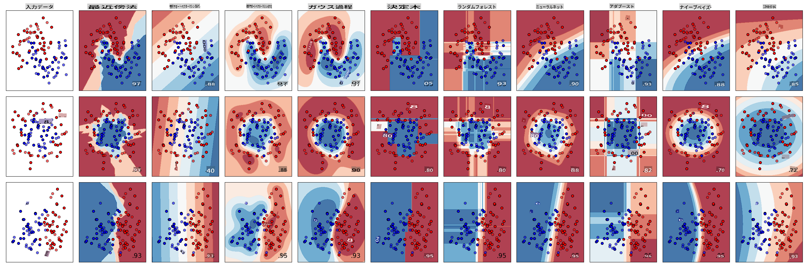
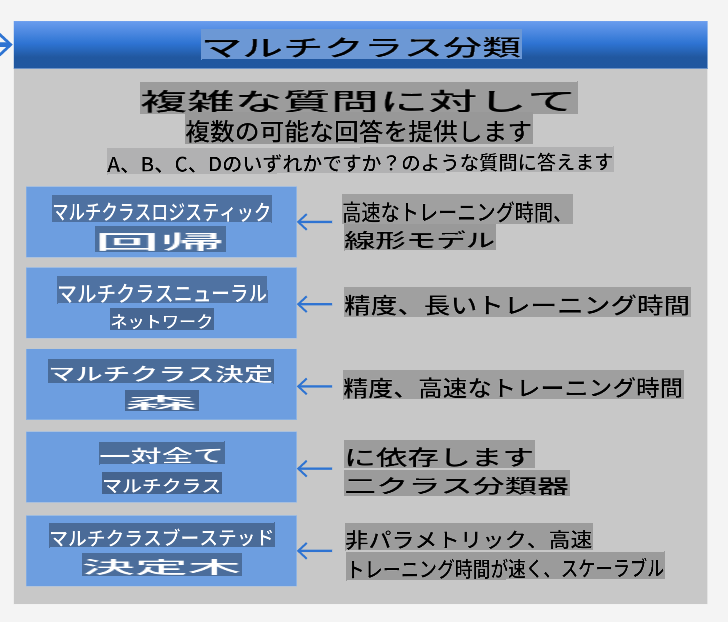
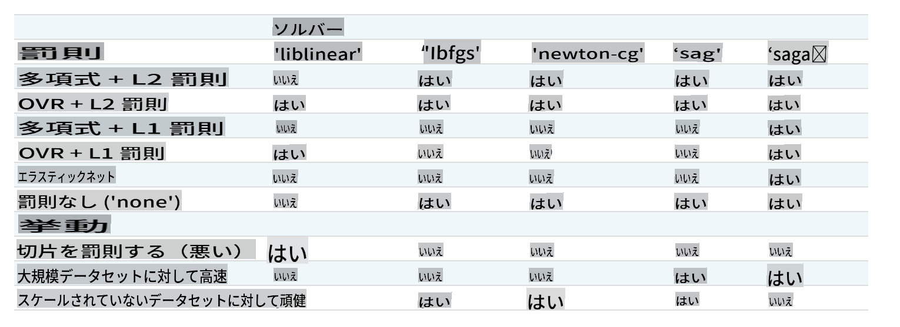

# Cuisine classifiers 1

このレッスンでは、前回のレッスンで保存した、バランスの取れたきれいなデータセットを使って、料理に関する予測を行います。

このデータセットを使って、さまざまな分類器を使用し、_材料のグループに基づいて特定の国の料理を予測_します。その過程で、アルゴリズムを分類タスクに利用する方法についてさらに学びます。

## [事前クイズ](https://gray-sand-07a10f403.1.azurestaticapps.net/quiz/21/)
# 準備

[Lesson 1](../1-Introduction/README.md)を完了したと仮定して、_cleaned_cuisines.csv_ ファイルがルート `/data` フォルダーに存在することを確認してください。このファイルは4つのレッスンで使用されます。

## 演習 - 国の料理を予測する

1. このレッスンの _notebook.ipynb_ フォルダーで、そのファイルとPandasライブラリをインポートします:

    ```python
    import pandas as pd
    cuisines_df = pd.read_csv("../data/cleaned_cuisines.csv")
    cuisines_df.head()
    ```

    データは次のように見えます:

|     | Unnamed: 0 | cuisine | almond | angelica | anise | anise_seed | apple | apple_brandy | apricot | armagnac | ... | whiskey | white_bread | white_wine | whole_grain_wheat_flour | wine | wood | yam | yeast | yogurt | zucchini |
| --- | ---------- | ------- | ------ | -------- | ----- | ---------- | ----- | ------------ | ------- | -------- | --- | ------- | ----------- | ---------- | ----------------------- | ---- | ---- | --- | ----- | ------ | -------- |
| 0   | 0          | indian  | 0      | 0        | 0     | 0          | 0     | 0            | 0       | 0        | ... | 0       | 0           | 0          | 0                       | 0    | 0    | 0   | 0     | 0      | 0        |
| 1   | 1          | indian  | 1      | 0        | 0     | 0          | 0     | 0            | 0       | 0        | ... | 0       | 0           | 0          | 0                       | 0    | 0    | 0   | 0     | 0      | 0        |
| 2   | 2          | indian  | 0      | 0        | 0     | 0          | 0     | 0            | 0       | 0        | ... | 0       | 0           | 0          | 0                       | 0    | 0    | 0   | 0     | 0      | 0        |
| 3   | 3          | indian  | 0      | 0        | 0     | 0          | 0     | 0            | 0       | 0        | ... | 0       | 0           | 0          | 0                       | 0    | 0    | 0   | 0     | 0      | 0        |
| 4   | 4          | indian  | 0      | 0        | 0     | 0          | 0     | 0            | 0       | 0        | ... | 0       | 0           | 0          | 0                       | 0    | 0    | 0   | 0     | 1      | 0        |
  

1. 次に、いくつかのライブラリをインポートします:

    ```python
    from sklearn.linear_model import LogisticRegression
    from sklearn.model_selection import train_test_split, cross_val_score
    from sklearn.metrics import accuracy_score,precision_score,confusion_matrix,classification_report, precision_recall_curve
    from sklearn.svm import SVC
    import numpy as np
    ```

1. Xとyの座標を2つのデータフレームに分けてトレーニングします。`cuisine`をラベルデータフレームにします:

    ```python
    cuisines_label_df = cuisines_df['cuisine']
    cuisines_label_df.head()
    ```

    次のように見えます:

    ```output
    0    indian
    1    indian
    2    indian
    3    indian
    4    indian
    Name: cuisine, dtype: object
    ```

1. `Unnamed: 0` column and the `cuisine` column, calling `drop()`をドロップします。残りのデータをトレーニング可能な特徴として保存します:

    ```python
    cuisines_feature_df = cuisines_df.drop(['Unnamed: 0', 'cuisine'], axis=1)
    cuisines_feature_df.head()
    ```

    あなたの特徴は次のように見えます:

|      | almond | angelica | anise | anise_seed | apple | apple_brandy | apricot | armagnac | artemisia | artichoke |  ... | whiskey | white_bread | white_wine | whole_grain_wheat_flour | wine | wood |  yam | yeast | yogurt | zucchini |
| ---: | -----: | -------: | ----: | ---------: | ----: | -----------: | ------: | -------: | --------: | --------: | ---: | ------: | ----------: | ---------: | ----------------------: | ---: | ---: | ---: | ----: | -----: | -------: |
|    0 |      0 |        0 |     0 |          0 |     0 |            0 |       0 |        0 |         0 |         0 |  ... |       0 |           0 |          0 |                       0 |    0 |    0 |    0 |     0 |      0 |        0 | 0 |
|    1 |      1 |        0 |     0 |          0 |     0 |            0 |       0 |        0 |         0 |         0 |  ... |       0 |           0 |          0 |                       0 |    0 |    0 |    0 |     0 |      0 |        0 | 0 |
|    2 |      0 |        0 |     0 |          0 |     0 |            0 |       0 |        0 |         0 |         0 |  ... |       0 |           0 |          0 |                       0 |    0 |    0 |    0 |     0 |      0 |        0 | 0 |
|    3 |      0 |        0 |     0 |          0 |     0 |            0 |       0 |        0 |         0 |         0 |  ... |       0 |           0 |          0 |                       0 |    0 |    0 |    0 |     0 |      0 |        0 | 0 |
|    4 |      0 |        0 |     0 |          0 |     0 |            0 |       0 |        0 |         0 |         0 |  ... |       0 |           0 |          0 |                       0 |    0 |    0 |    0 |     0 |      1 |        0 | 0 |

これでモデルのトレーニングの準備が整いました！

## 分類器の選択

データがきれいになり、トレーニングの準備が整ったので、どのアルゴリズムを使用するかを決定する必要があります。

Scikit-learnは分類を教師あり学習の下にグループ化しており、そのカテゴリーでは多くの分類方法があります。[この多様性](https://scikit-learn.org/stable/supervised_learning.html)は最初は非常に圧倒されるかもしれません。以下の方法にはすべて分類技術が含まれます:

- 線形モデル
- サポートベクターマシン
- 確率的勾配降下法
- 最近傍法
- ガウス過程
- 決定木
- アンサンブル法（投票分類器）
- マルチクラスおよびマルチアウトプットアルゴリズム（マルチクラスおよびマルチラベル分類、マルチクラス-マルチアウトプット分類）

> データを分類するために[ニューラルネットワークを使用する](https://scikit-learn.org/stable/modules/neural_networks_supervised.html#classification)こともできますが、これはこのレッスンの範囲外です。

### どの分類器を選ぶべきか？

では、どの分類器を選ぶべきでしょうか？多くの場合、いくつかの分類器を試して良い結果を探すのが一つの方法です。Scikit-learnは[KNeighbors、SVCの2つの方法、GaussianProcessClassifier、DecisionTreeClassifier、RandomForestClassifier、MLPClassifier、AdaBoostClassifier、GaussianNB、QuadraticDiscrinationAnalysis](https://scikit-learn.org/stable/auto_examples/classification/plot_classifier_comparison.html)の比較を行い、結果を視覚化して表示します:


> Scikit-learnのドキュメントで生成されたプロット

> AutoMLはこれらの比較をクラウドで実行し、データに最適なアルゴリズムを選択できるようにすることで、この問題をうまく解決します。試してみてください [こちら](https://docs.microsoft.com/learn/modules/automate-model-selection-with-azure-automl/?WT.mc_id=academic-77952-leestott)

### より良いアプローチ

しかし、無作為に推測するよりも、ダウンロード可能な[ML Cheat Sheet](https://docs.microsoft.com/azure/machine-learning/algorithm-cheat-sheet?WT.mc_id=academic-77952-leestott)のアイデアに従う方が良いです。ここでは、マルチクラスの問題に対していくつかの選択肢があることがわかります:


> マイクロソフトのアルゴリズムチートシートの一部、マルチクラス分類オプションの詳細

✅ このチートシートをダウンロードし、印刷して壁に貼りましょう！

### 理由付け

制約を考慮して、異なるアプローチを検討してみましょう:

- **ニューラルネットワークは重すぎる**。きれいだが最小限のデータセットと、ノートブックを使ってローカルでトレーニングを実行するという事実を考えると、ニューラルネットワークはこのタスクには重すぎます。
- **2クラス分類器は使用しない**。2クラス分類器は使用しないため、one-vs-allは除外されます。
- **決定木やロジスティック回帰が使える**。決定木やマルチクラスデータのロジスティック回帰が使えるかもしれません。
- **マルチクラスブーステッド決定木は異なる問題を解決する**。マルチクラスブーステッド決定木は非パラメトリックなタスク、例えばランキングを作成するタスクに最も適しているため、私たちには役立ちません。

### Scikit-learnの使用

データを分析するためにScikit-learnを使用します。しかし、Scikit-learnでロジスティック回帰を使用する方法はたくさんあります。[渡すパラメータ](https://scikit-learn.org/stable/modules/generated/sklearn.linear_model.LogisticRegression.html?highlight=logistic%20regressio#sklearn.linear_model.LogisticRegression)を確認してください。

本質的に、重要なパラメータは2つあります - `multi_class` and `solver` - that we need to specify, when we ask Scikit-learn to perform a logistic regression. The `multi_class` value applies a certain behavior. The value of the solver is what algorithm to use. Not all solvers can be paired with all `multi_class` values.

According to the docs, in the multiclass case, the training algorithm:

- **Uses the one-vs-rest (OvR) scheme**, if the `multi_class` option is set to `ovr`
- **Uses the cross-entropy loss**, if the `multi_class` option is set to `multinomial`. (Currently the `multinomial` option is supported only by the ‘lbfgs’, ‘sag’, ‘saga’ and ‘newton-cg’ solvers.)"

> 🎓 The 'scheme' here can either be 'ovr' (one-vs-rest) or 'multinomial'. Since logistic regression is really designed to support binary classification, these schemes allow it to better handle multiclass classification tasks. [source](https://machinelearningmastery.com/one-vs-rest-and-one-vs-one-for-multi-class-classification/)

> 🎓 The 'solver' is defined as "the algorithm to use in the optimization problem". [source](https://scikit-learn.org/stable/modules/generated/sklearn.linear_model.LogisticRegression.html?highlight=logistic%20regressio#sklearn.linear_model.LogisticRegression).

Scikit-learn offers this table to explain how solvers handle different challenges presented by different kinds of data structures:



## Exercise - split the data

We can focus on logistic regression for our first training trial since you recently learned about the latter in a previous lesson.
Split your data into training and testing groups by calling `train_test_split()`です:

```python
X_train, X_test, y_train, y_test = train_test_split(cuisines_feature_df, cuisines_label_df, test_size=0.3)
```

## 演習 - ロジスティック回帰を適用する

マルチクラスの場合、どのスキームを使用するか、どのソルバーを設定するかを選択する必要があります。マルチクラス設定と**liblinear**ソルバーを使用してロジスティック回帰をトレーニングします。

1. multi_classを`ovr` and the solver set to `liblinear`に設定してロジスティック回帰を作成します:

    ```python
    lr = LogisticRegression(multi_class='ovr',solver='liblinear')
    model = lr.fit(X_train, np.ravel(y_train))
    
    accuracy = model.score(X_test, y_test)
    print ("Accuracy is {}".format(accuracy))
    ```

    ✅ `lbfgs`, which is often set as default

    > Note, use Pandas [`ravel`](https://pandas.pydata.org/pandas-docs/stable/reference/api/pandas.Series.ravel.html)関数を試して、必要に応じてデータをフラットにします。

    正確度は**80%**を超えています！

1. データの1行（#50）をテストすることで、このモデルを実際に見ることができます:

    ```python
    print(f'ingredients: {X_test.iloc[50][X_test.iloc[50]!=0].keys()}')
    print(f'cuisine: {y_test.iloc[50]}')
    ```

    結果が表示されます:

   ```output
   ingredients: Index(['cilantro', 'onion', 'pea', 'potato', 'tomato', 'vegetable_oil'], dtype='object')
   cuisine: indian
   ```

   ✅ 別の行番号を試して結果を確認してみてください

1. この予測の正確性を確認するために、さらに掘り下げてみましょう:

    ```python
    test= X_test.iloc[50].values.reshape(-1, 1).T
    proba = model.predict_proba(test)
    classes = model.classes_
    resultdf = pd.DataFrame(data=proba, columns=classes)
    
    topPrediction = resultdf.T.sort_values(by=[0], ascending = [False])
    topPrediction.head()
    ```

    結果が表示されます - インド料理が最も高い確率で予測されています:

    |          |        0 |
    | -------: | -------: |
    |   indian | 0.715851 |
    |  chinese | 0.229475 |
    | japanese | 0.029763 |
    |   korean | 0.017277 |
    |     thai | 0.007634 |

    ✅ なぜこのモデルがインド料理だと確信しているのか説明できますか？

1. 回帰レッスンで行ったように、分類レポートを印刷して詳細を確認します:

    ```python
    y_pred = model.predict(X_test)
    print(classification_report(y_test,y_pred))
    ```

    |              | precision | recall | f1-score | support |
    | ------------ | --------- | ------ | -------- | ------- |
    | chinese      | 0.73      | 0.71   | 0.72     | 229     |
    | indian       | 0.91      | 0.93   | 0.92     | 254     |
    | japanese     | 0.70      | 0.75   | 0.72     | 220     |
    | korean       | 0.86      | 0.76   | 0.81     | 242     |
    | thai         | 0.79      | 0.85   | 0.82     | 254     |
    | accuracy     | 0.80      | 1199   |          |         |
    | macro avg    | 0.80      | 0.80   | 0.80     | 1199    |
    | weighted avg | 0.80      | 0.80   | 0.80     | 1199    |

## 🚀チャレンジ

このレッスンでは、クリーンなデータを使用して、材料の一連のリストに基づいて国の料理を予測する機械学習モデルを構築しました。Scikit-learnがデータを分類するために提供する多くのオプションを読み、さらに掘り下げてみてください。ソルバーの概念を深く理解し、背後で何が起こっているのかを理解してください。

## [事後クイズ](https://gray-sand-07a10f403.1.azurestaticapps.net/quiz/22/)

## レビュー & 自己学習

[このレッスン](https://people.eecs.berkeley.edu/~russell/classes/cs194/f11/lectures/CS194%20Fall%202011%20Lecture%2006.pdf)でロジスティック回帰の数学についてさらに掘り下げてみてください。
## 課題 

[ソルバーを研究する](assignment.md)

**免責事項**:
この文書は、機械ベースのAI翻訳サービスを使用して翻訳されています。正確さを期しておりますが、自動翻訳には誤りや不正確さが含まれる可能性があることにご注意ください。元の言語での原文を権威ある情報源と見なすべきです。重要な情報については、専門の人間による翻訳をお勧めします。この翻訳の使用に起因する誤解や誤訳について、当社は一切の責任を負いません。