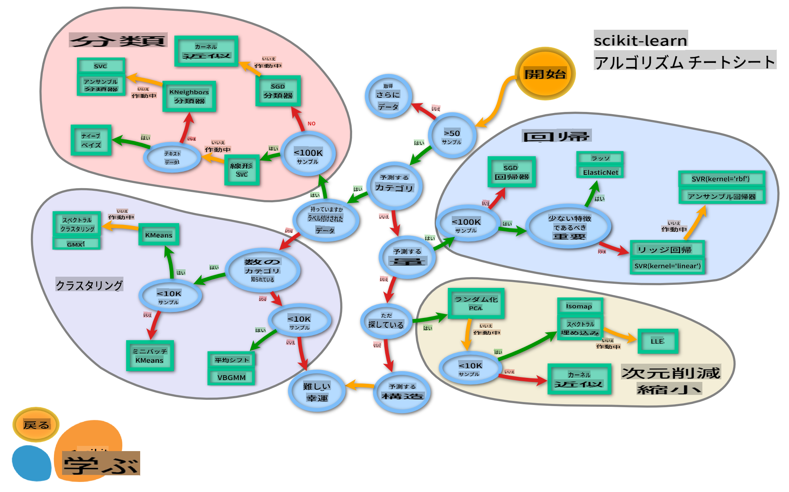

# 料理の分類器 2

この第2の分類レッスンでは、数値データを分類するためのさまざまな方法を探求します。また、異なる分類器を選択することの影響についても学びます。

## [講義前のクイズ](https://gray-sand-07a10f403.1.azurestaticapps.net/quiz/23/)

### 前提条件

前のレッスンを完了し、この4つのレッスンフォルダーのルートにある `data` フォルダーに _cleaned_cuisines.csv_ という名前のクリーンなデータセットがあることを前提としています。

### 準備

クリーンなデータセットを使用して _notebook.ipynb_ ファイルを読み込み、モデル構築プロセスに向けて X と y のデータフレームに分割しました。

## 分類マップ

以前、Microsoftのチートシートを使用してデータを分類する際のさまざまなオプションについて学びました。Scikit-learnも同様の、しかしより詳細なチートシートを提供しており、推定器（分類器の別名）をさらに絞り込むのに役立ちます：


> Tip: [このマップをオンラインで見る](https://scikit-learn.org/stable/tutorial/machine_learning_map/)と、パスに沿ってクリックしてドキュメントを読むことができます。

### 計画

このマップはデータの理解が深まると非常に役立ちます。パスに沿って歩きながら決定を下すことができます：

- 50以上のサンプルがあります
- カテゴリを予測したい
- ラベル付きデータがあります
- 100K未満のサンプルがあります
- ✨ Linear SVCを選択できます
- それがうまくいかない場合、数値データがあるので
    - ✨ KNeighbors Classifierを試すことができます
      - それもうまくいかない場合、✨ SVCや✨ Ensemble Classifiersを試してみることができます

これは非常に役立つルートです。

## 演習 - データを分割する

このパスに従って、使用するライブラリをインポートすることから始めましょう。

1. 必要なライブラリをインポートします：

    ```python
    from sklearn.neighbors import KNeighborsClassifier
    from sklearn.linear_model import LogisticRegression
    from sklearn.svm import SVC
    from sklearn.ensemble import RandomForestClassifier, AdaBoostClassifier
    from sklearn.model_selection import train_test_split, cross_val_score
    from sklearn.metrics import accuracy_score,precision_score,confusion_matrix,classification_report, precision_recall_curve
    import numpy as np
    ```

1. トレーニングデータとテストデータを分割します：

    ```python
    X_train, X_test, y_train, y_test = train_test_split(cuisines_feature_df, cuisines_label_df, test_size=0.3)
    ```

## Linear SVC分類器

サポートベクタークラスタリング（SVC）は、サポートベクターマシンのML技術ファミリーの一部です（詳細は以下を参照）。この方法では、ラベルをクラスタリングする方法を決定するための「カーネル」を選択できます。「C」パラメータは「正則化」を指し、パラメータの影響を調整します。カーネルは[いくつかの](https://scikit-learn.org/stable/modules/generated/sklearn.svm.SVC.html#sklearn.svm.SVC) から選択でき、ここでは線形SVCを利用するために「linear」に設定します。確率はデフォルトで「false」ですが、ここでは確率推定を収集するために「true」に設定します。ランダム状態を「0」に設定してデータをシャッフルし、確率を取得します。

### 演習 - 線形SVCを適用する

分類器の配列を作成することから始めます。テストを進めるにつれてこの配列に追加していきます。

1. Linear SVCから始めます：

    ```python
    C = 10
    # Create different classifiers.
    classifiers = {
        'Linear SVC': SVC(kernel='linear', C=C, probability=True,random_state=0)
    }
    ```

2. Linear SVCを使用してモデルをトレーニングし、レポートを出力します：

    ```python
    n_classifiers = len(classifiers)
    
    for index, (name, classifier) in enumerate(classifiers.items()):
        classifier.fit(X_train, np.ravel(y_train))
    
        y_pred = classifier.predict(X_test)
        accuracy = accuracy_score(y_test, y_pred)
        print("Accuracy (train) for %s: %0.1f%% " % (name, accuracy * 100))
        print(classification_report(y_test,y_pred))
    ```

    結果はかなり良好です：

    ```output
    Accuracy (train) for Linear SVC: 78.6% 
                  precision    recall  f1-score   support
    
         chinese       0.71      0.67      0.69       242
          indian       0.88      0.86      0.87       234
        japanese       0.79      0.74      0.76       254
          korean       0.85      0.81      0.83       242
            thai       0.71      0.86      0.78       227
    
        accuracy                           0.79      1199
       macro avg       0.79      0.79      0.79      1199
    weighted avg       0.79      0.79      0.79      1199
    ```

## K-Neighbors分類器

K-Neighborsは「neighbors」ファミリーのMLメソッドの一部で、これは教師あり学習と教師なし学習の両方に使用できます。この方法では、事前に定義されたポイントの周りにデータを集め、一般化されたラベルをデータに対して予測できるようにします。

### 演習 - K-Neighbors分類器を適用する

前の分類器は良好で、データにうまく適合しましたが、さらに精度を向上させることができるかもしれません。K-Neighbors分類器を試してみましょう。

1. 分類器の配列に行を追加します（Linear SVC項目の後にカンマを追加）：

    ```python
    'KNN classifier': KNeighborsClassifier(C),
    ```

    結果は少し悪くなります：

    ```output
    Accuracy (train) for KNN classifier: 73.8% 
                  precision    recall  f1-score   support
    
         chinese       0.64      0.67      0.66       242
          indian       0.86      0.78      0.82       234
        japanese       0.66      0.83      0.74       254
          korean       0.94      0.58      0.72       242
            thai       0.71      0.82      0.76       227
    
        accuracy                           0.74      1199
       macro avg       0.76      0.74      0.74      1199
    weighted avg       0.76      0.74      0.74      1199
    ```

    ✅ [K-Neighbors](https://scikit-learn.org/stable/modules/neighbors.html#neighbors) について学びましょう

## サポートベクター分類器

サポートベクター分類器は、分類と回帰タスクに使用される[サポートベクターマシン](https://wikipedia.org/wiki/Support-vector_machine)ファミリーの一部です。SVMは「トレーニング例を空間のポイントにマップ」して、2つのカテゴリ間の距離を最大化します。その後のデータはこの空間にマップされ、カテゴリを予測できます。

### 演習 - サポートベクター分類器を適用する

サポートベクター分類器を使用して、さらに精度を向上させましょう。

1. K-Neighbors項目の後にカンマを追加し、この行を追加します：

    ```python
    'SVC': SVC(),
    ```

    結果は非常に良好です！

    ```output
    Accuracy (train) for SVC: 83.2% 
                  precision    recall  f1-score   support
    
         chinese       0.79      0.74      0.76       242
          indian       0.88      0.90      0.89       234
        japanese       0.87      0.81      0.84       254
          korean       0.91      0.82      0.86       242
            thai       0.74      0.90      0.81       227
    
        accuracy                           0.83      1199
       macro avg       0.84      0.83      0.83      1199
    weighted avg       0.84      0.83      0.83      1199
    ```

    ✅ [サポートベクター](https://scikit-learn.org/stable/modules/svm.html#svm) について学びましょう

## アンサンブル分類器

前のテストは非常に良好でしたが、最後までパスをたどってみましょう。ランダムフォレストとAdaBoostのようなアンサンブル分類器を試してみましょう：

```python
  'RFST': RandomForestClassifier(n_estimators=100),
  'ADA': AdaBoostClassifier(n_estimators=100)
```

結果は非常に良好で、特にランダムフォレストは優れています：

```output
Accuracy (train) for RFST: 84.5% 
              precision    recall  f1-score   support

     chinese       0.80      0.77      0.78       242
      indian       0.89      0.92      0.90       234
    japanese       0.86      0.84      0.85       254
      korean       0.88      0.83      0.85       242
        thai       0.80      0.87      0.83       227

    accuracy                           0.84      1199
   macro avg       0.85      0.85      0.84      1199
weighted avg       0.85      0.84      0.84      1199

Accuracy (train) for ADA: 72.4% 
              precision    recall  f1-score   support

     chinese       0.64      0.49      0.56       242
      indian       0.91      0.83      0.87       234
    japanese       0.68      0.69      0.69       254
      korean       0.73      0.79      0.76       242
        thai       0.67      0.83      0.74       227

    accuracy                           0.72      1199
   macro avg       0.73      0.73      0.72      1199
weighted avg       0.73      0.72      0.72      1199
```

✅ [アンサンブル分類器](https://scikit-learn.org/stable/modules/ensemble.html) について学びましょう

この機械学習の方法は、「いくつかの基本推定器の予測を組み合わせる」ことでモデルの質を向上させます。私たちの例では、ランダムツリーとAdaBoostを使用しました。

- [ランダムフォレスト](https://scikit-learn.org/stable/modules/ensemble.html#forest) は、平均化法であり、ランダム性を取り入れた「決定木」の「森」を構築して過学習を回避します。n_estimatorsパラメータは木の数を設定します。

- [AdaBoost](https://scikit-learn.org/stable/modules/generated/sklearn.ensemble.AdaBoostClassifier.html) は、データセットに分類器を適合させ、その分類器のコピーを同じデータセットに適合させます。誤分類されたアイテムの重みを重視し、次の分類器の適合を調整して修正します。

---

## 🚀チャレンジ

これらの技術のそれぞれには、多くの調整可能なパラメータがあります。それぞれのデフォルトパラメータを調査し、これらのパラメータを調整することがモデルの質にどのような影響を与えるかを考えてみてください。

## [講義後のクイズ](https://gray-sand-07a10f403.1.azurestaticapps.net/quiz/24/)

## 復習と自己学習

これらのレッスンには多くの専門用語が含まれているため、[この用語集](https://docs.microsoft.com/dotnet/machine-learning/resources/glossary?WT.mc_id=academic-77952-leestott) を見直してみましょう！

## 課題

[パラメータの調整](assignment.md)

**免責事項**:
この文書は、機械ベースのAI翻訳サービスを使用して翻訳されています。正確性を期すために努めていますが、自動翻訳には誤りや不正確さが含まれる場合があります。元の言語での文書を権威ある情報源と見なすべきです。重要な情報については、専門の人間による翻訳をお勧めします。この翻訳の使用に起因する誤解や誤訳について、当社は一切の責任を負いません。