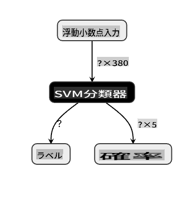
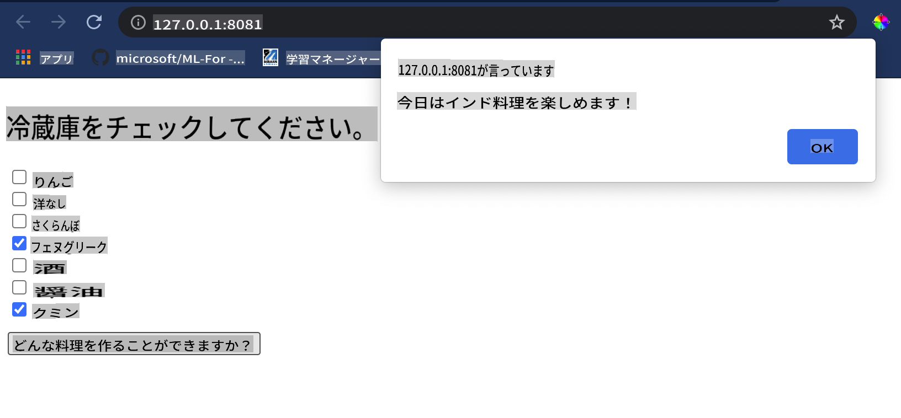

# 料理推薦Webアプリを作成しよう

このレッスンでは、以前のレッスンで学んだ技術と、このシリーズ全体で使用されているおいしい料理データセットを使用して、分類モデルを構築します。さらに、保存したモデルを使用する小さなWebアプリを構築し、OnnxのWebランタイムを活用します。

機械学習の最も実用的な用途の一つは推薦システムの構築であり、今日からその方向に一歩を踏み出すことができます！

[](https://youtu.be/17wdM9AHMfg "Applied ML")

> 🎥 上の画像をクリックしてビデオを見る: Jen Looperが分類された料理データを使用してWebアプリを構築します

## [レッスン前クイズ](https://gray-sand-07a10f403.1.azurestaticapps.net/quiz/25/)

このレッスンで学ぶこと:

- モデルを構築してOnnxモデルとして保存する方法
- Netronを使用してモデルを検査する方法
- 推論のためにWebアプリでモデルを使用する方法

## モデルを構築しよう

ビジネスシステムにこれらの技術を活用するためには、応用機械学習システムを構築することが重要です。Onnxを使用することで、Webアプリケーション内でモデルを使用し（必要に応じてオフラインコンテキストでも使用可能）、JavaScriptアプリケーションで使用することができます。

[前のレッスン](../../3-Web-App/1-Web-App/README.md)では、UFO目撃情報についての回帰モデルを構築し、それをFlaskアプリで使用しました。このアーキテクチャは非常に有用ですが、フルスタックのPythonアプリであり、JavaScriptアプリケーションを使用する要件があるかもしれません。

このレッスンでは、推論のための基本的なJavaScriptベースのシステムを構築できます。しかし、まずモデルを訓練し、Onnxで使用するために変換する必要があります。

## 演習 - 分類モデルを訓練しよう

まず、使用したクリーンな料理データセットを使用して分類モデルを訓練します。

1. 有用なライブラリをインポートすることから始めます：

    ```python
    !pip install skl2onnx
    import pandas as pd 
    ```

    Scikit-learnモデルをOnnx形式に変換するために '[skl2onnx](https://onnx.ai/sklearn-onnx/)' が必要です。

1. 次に、前のレッスンと同じ方法でデータを処理し、`read_csv()`を使用してCSVファイルを読み込みます：

    ```python
    data = pd.read_csv('../data/cleaned_cuisines.csv')
    data.head()
    ```

1. 不要な最初の2列を削除し、残りのデータを 'X' として保存します：

    ```python
    X = data.iloc[:,2:]
    X.head()
    ```

1. ラベルを 'y' として保存します：

    ```python
    y = data[['cuisine']]
    y.head()
    
    ```

### 訓練ルーチンを開始しよう

'SVC' ライブラリを使用します。これは高い精度を持っています。

1. Scikit-learnから適切なライブラリをインポートします：

    ```python
    from sklearn.model_selection import train_test_split
    from sklearn.svm import SVC
    from sklearn.model_selection import cross_val_score
    from sklearn.metrics import accuracy_score,precision_score,confusion_matrix,classification_report
    ```

1. 訓練セットとテストセットを分けます：

    ```python
    X_train, X_test, y_train, y_test = train_test_split(X,y,test_size=0.3)
    ```

1. 前のレッスンで行ったように、SVC分類モデルを構築します：

    ```python
    model = SVC(kernel='linear', C=10, probability=True,random_state=0)
    model.fit(X_train,y_train.values.ravel())
    ```

1. 次に、`predict()`を呼び出してモデルをテストします：

    ```python
    y_pred = model.predict(X_test)
    ```

1. モデルの品質を確認するために分類レポートを出力します：

    ```python
    print(classification_report(y_test,y_pred))
    ```

    以前見たように、精度は良好です：

    ```output
                    precision    recall  f1-score   support
    
         chinese       0.72      0.69      0.70       257
          indian       0.91      0.87      0.89       243
        japanese       0.79      0.77      0.78       239
          korean       0.83      0.79      0.81       236
            thai       0.72      0.84      0.78       224
    
        accuracy                           0.79      1199
       macro avg       0.79      0.79      0.79      1199
    weighted avg       0.79      0.79      0.79      1199
    ```

### モデルをOnnxに変換しよう

適切なテンソル数で変換を行うことを確認してください。このデータセットには380の成分が記載されているため、`FloatTensorType`にその数を記載する必要があります：

1. 380のテンソル数を使用して変換します。

    ```python
    from skl2onnx import convert_sklearn
    from skl2onnx.common.data_types import FloatTensorType
    
    initial_type = [('float_input', FloatTensorType([None, 380]))]
    options = {id(model): {'nocl': True, 'zipmap': False}}
    ```

1. onxを作成し、ファイル **model.onnx** として保存します：

    ```python
    onx = convert_sklearn(model, initial_types=initial_type, options=options)
    with open("./model.onnx", "wb") as f:
        f.write(onx.SerializeToString())
    ```

    > Note、変換スクリプトに[オプション](https://onnx.ai/sklearn-onnx/parameterized.html)を渡すことができます。この場合、'nocl'をTrue、'zipmap'をFalseに設定しました。これは分類モデルなので、辞書のリストを生成するZipMapを削除するオプションがあります（必要ありません）。`nocl` refers to class information being included in the model. Reduce your model's size by setting `nocl` to 'True'. 

Running the entire notebook will now build an Onnx model and save it to this folder.

## View your model

Onnx models are not very visible in Visual Studio code, but there's a very good free software that many researchers use to visualize the model to ensure that it is properly built. Download [Netron](https://github.com/lutzroeder/Netron) and  open your model.onnx file. You can see your simple model visualized, with its 380 inputs and classifier listed:



Netron is a helpful tool to view your models.

Now you are ready to use this neat model in a web app. Let's build an app that will come in handy when you look in your refrigerator and try to figure out which combination of your leftover ingredients you can use to cook a given cuisine, as determined by your model.

## Build a recommender web application

You can use your model directly in a web app. This architecture also allows you to run it locally and even offline if needed. Start by creating an `index.html` file in the same folder where you stored your `model.onnx`ファイル。

1. このファイル _index.html_ に次のマークアップを追加します：

    ```html
    <!DOCTYPE html>
    <html>
        <header>
            <title>Cuisine Matcher</title>
        </header>
        <body>
            ...
        </body>
    </html>
    ```

1. 次に、`body`タグ内で、いくつかの成分を反映するチェックボックスのリストを表示するための少しのマークアップを追加します：

    ```html
    <h1>Check your refrigerator. What can you create?</h1>
            <div id="wrapper">
                <div class="boxCont">
                    <input type="checkbox" value="4" class="checkbox">
                    <label>apple</label>
                </div>
            
                <div class="boxCont">
                    <input type="checkbox" value="247" class="checkbox">
                    <label>pear</label>
                </div>
            
                <div class="boxCont">
                    <input type="checkbox" value="77" class="checkbox">
                    <label>cherry</label>
                </div>
    
                <div class="boxCont">
                    <input type="checkbox" value="126" class="checkbox">
                    <label>fenugreek</label>
                </div>
    
                <div class="boxCont">
                    <input type="checkbox" value="302" class="checkbox">
                    <label>sake</label>
                </div>
    
                <div class="boxCont">
                    <input type="checkbox" value="327" class="checkbox">
                    <label>soy sauce</label>
                </div>
    
                <div class="boxCont">
                    <input type="checkbox" value="112" class="checkbox">
                    <label>cumin</label>
                </div>
            </div>
            <div style="padding-top:10px">
                <button onClick="startInference()">What kind of cuisine can you make?</button>
            </div> 
    ```

    各チェックボックスには値が与えられています。これは、データセットに従って成分が見つかるインデックスを反映しています。例えば、リンゴはこのアルファベット順のリストの5番目の列を占めるため、その値は'4'です（0から数え始めます）。[成分スプレッドシート](../../../../4-Classification/data/ingredient_indexes.csv)を参照して、特定の成分のインデックスを確認できます。

    index.htmlファイルでの作業を続け、最終的な閉じタグ`</div>`の後にモデルを呼び出すスクリプトブロックを追加します。

1. まず、[Onnxランタイム](https://www.onnxruntime.ai/)をインポートします：

    ```html
    <script src="https://cdn.jsdelivr.net/npm/onnxruntime-web@1.9.0/dist/ort.min.js"></script> 
    ```

    > Onnxランタイムは、幅広いハードウェアプラットフォームでOnnxモデルを実行できるようにするために使用され、最適化と使用するためのAPIを提供します。

1. ランタイムが設定されたら、それを呼び出します：

    ```html
    <script>
        const ingredients = Array(380).fill(0);
        
        const checks = [...document.querySelectorAll('.checkbox')];
        
        checks.forEach(check => {
            check.addEventListener('change', function() {
                // toggle the state of the ingredient
                // based on the checkbox's value (1 or 0)
                ingredients[check.value] = check.checked ? 1 : 0;
            });
        });

        function testCheckboxes() {
            // validate if at least one checkbox is checked
            return checks.some(check => check.checked);
        }

        async function startInference() {

            let atLeastOneChecked = testCheckboxes()

            if (!atLeastOneChecked) {
                alert('Please select at least one ingredient.');
                return;
            }
            try {
                // create a new session and load the model.
                
                const session = await ort.InferenceSession.create('./model.onnx');

                const input = new ort.Tensor(new Float32Array(ingredients), [1, 380]);
                const feeds = { float_input: input };

                // feed inputs and run
                const results = await session.run(feeds);

                // read from results
                alert('You can enjoy ' + results.label.data[0] + ' cuisine today!')

            } catch (e) {
                console.log(`failed to inference ONNX model`);
                console.error(e);
            }
        }
               
    </script>
    ```

このコードでは、いくつかのことが行われています：

1. モデルに送信するために、成分チェックボックスがチェックされているかどうかに応じて設定される380の可能な値（1または0）の配列を作成しました。
2. チェックボックスの配列を作成し、それらがチェックされているかどうかを決定する方法を`init` function that is called when the application starts. When a checkbox is checked, the `ingredients` array is altered to reflect the chosen ingredient.
3. You created a `testCheckboxes` function that checks whether any checkbox was checked.
4. You use `startInference` function when the button is pressed and, if any checkbox is checked, you start inference.
5. The inference routine includes:
   1. Setting up an asynchronous load of the model
   2. Creating a Tensor structure to send to the model
   3. Creating 'feeds' that reflects the `float_input` input that you created when training your model (you can use Netron to verify that name)
   4. Sending these 'feeds' to the model and waiting for a response

## Test your application

Open a terminal session in Visual Studio Code in the folder where your index.html file resides. Ensure that you have [http-server](https://www.npmjs.com/package/http-server) installed globally, and type `http-server`プロンプトで。ローカルホストが開き、Webアプリを見ることができます。さまざまな成分に基づいてどの料理が推奨されるかを確認してください：



おめでとうございます、いくつかのフィールドを持つ「推薦」Webアプリを作成しました。このシステムを構築するために時間をかけてください！
## 🚀チャレンジ

Webアプリは非常にミニマルなので、[ingredient_indexes](../../../../4-Classification/data/ingredient_indexes.csv)データの成分とそのインデックスを使用して引き続き構築してください。どのような風味の組み合わせが特定の国の料理を作るのに役立ちますか？

## [レッスン後クイズ](https://gray-sand-07a10f403.1.azurestaticapps.net/quiz/26/)

## レビューと自己学習

このレッスンでは、食材の推薦システムの作成の有用性について簡単に触れましたが、この分野のMLアプリケーションには多くの例があります。これらのシステムがどのように構築されているかについてもっと読んでください：

- https://www.sciencedirect.com/topics/computer-science/recommendation-engine
- https://www.technologyreview.com/2014/08/25/171547/the-ultimate-challenge-for-recommendation-engines/
- https://www.technologyreview.com/2015/03/23/168831/everything-is-a-recommendation/

## 課題 

[新しい推薦システムを構築する](assignment.md)

**免責事項**:
この文書は、機械ベースのAI翻訳サービスを使用して翻訳されています。正確性を期すために努力していますが、自動翻訳には誤りや不正確さが含まれる場合があります。元の言語での原文を権威ある情報源と見なすべきです。重要な情報については、専門の人間による翻訳をお勧めします。この翻訳の使用に起因する誤解や誤解について、当社は責任を負いません。