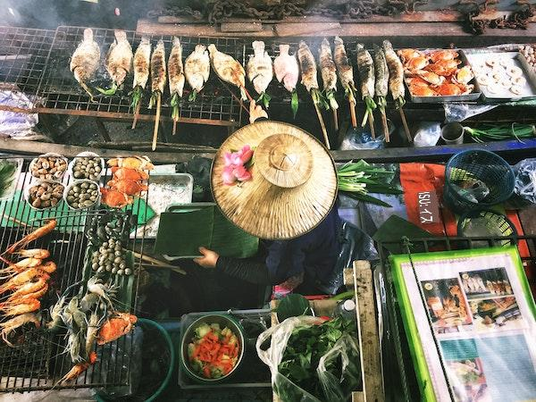

# 分類の始め方

## 地域のトピック: 美味しいアジアとインドの料理 🍜

アジアとインドでは、食文化が非常に多様であり、非常に美味しいです！地域の料理に関するデータを見て、その材料を理解してみましょう。

> <a href="https://unsplash.com/@changlisheng?utm_source=unsplash&utm_medium=referral&utm_content=creditCopyText">Lisheng Chang</a>による写真 <a href="https://unsplash.com/s/photos/asian-food?utm_source=unsplash&utm_medium=referral&utm_content=creditCopyText">Unsplash</a>
  
## 学べること

このセクションでは、回帰に関する以前の学習を基にして、データをよりよく理解するために使用できる他の分類器について学びます。

> 分類モデルを扱うことを学ぶのに役立つ低コードツールがあります。このタスクには [Azure ML](https://docs.microsoft.com/learn/modules/create-classification-model-azure-machine-learning-designer/?WT.mc_id=academic-77952-leestott) を試してみてください。

## レッスン

1. [分類の紹介](1-Introduction/README.md)
2. [その他の分類器](2-Classifiers-1/README.md)
3. [さらに別の分類器](3-Classifiers-2/README.md)
4. [応用機械学習: ウェブアプリを作成する](4-Applied/README.md)

## クレジット

「分類の始め方」は [Cassie Breviu](https://www.twitter.com/cassiebreviu) と [Jen Looper](https://www.twitter.com/jenlooper) によって♥️で書かれました。

美味しい料理のデータセットは [Kaggle](https://www.kaggle.com/hoandan/asian-and-indian-cuisines) から提供されました。

**免責事項**:
この文書は機械ベースのAI翻訳サービスを使用して翻訳されています。正確さを期すために努力しておりますが、自動翻訳には誤りや不正確さが含まれる可能性があります。原文の言語で書かれた元の文書が権威ある情報源と見なされるべきです。重要な情報については、専門の人間による翻訳をお勧めします。この翻訳の使用に起因する誤解や誤解については責任を負いかねます。