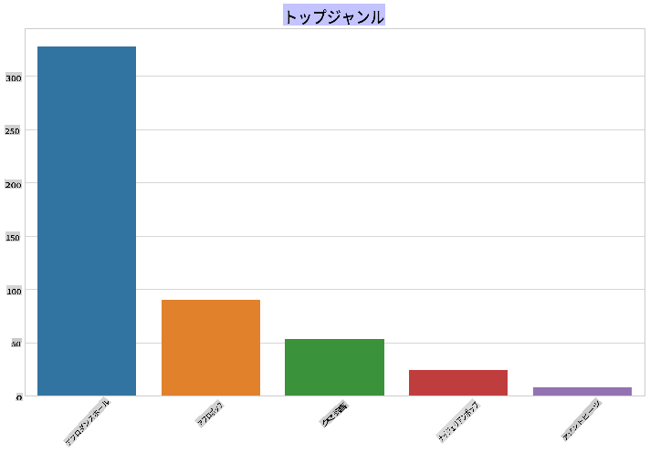
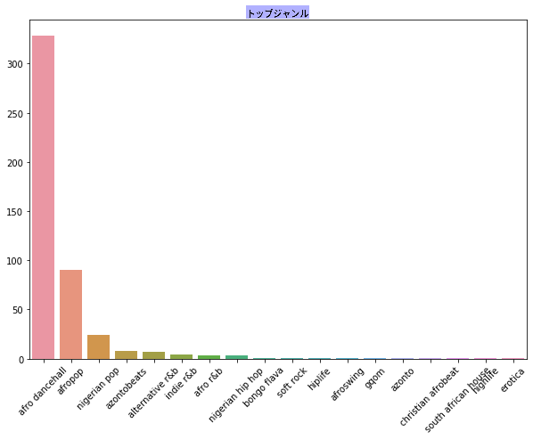
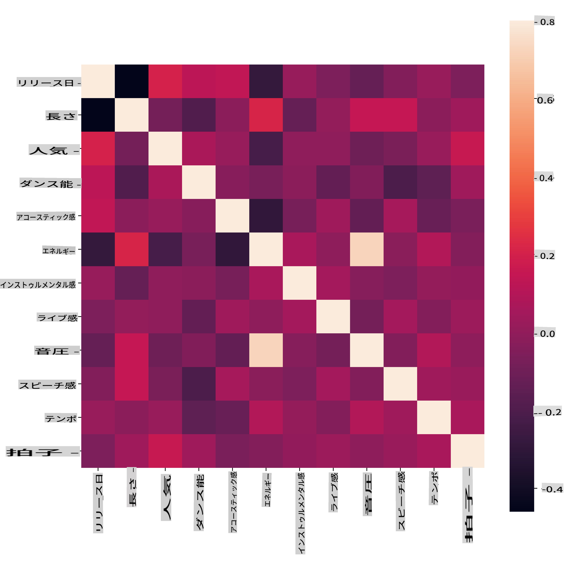
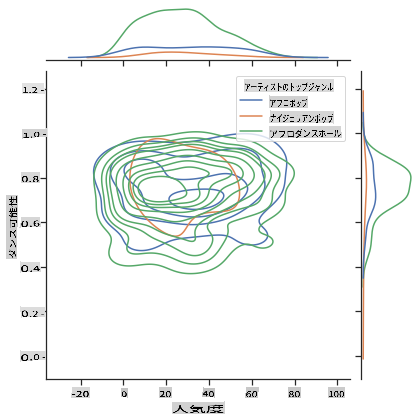
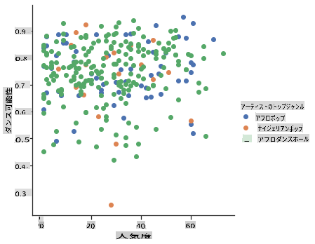

<!--
CO_OP_TRANSLATOR_METADATA:
{
  "original_hash": "0ab69b161efd7a41d325ee28b29415d7",
  "translation_date": "2025-09-03T22:59:41+00:00",
  "source_file": "5-Clustering/1-Visualize/README.md",
  "language_code": "ja"
}
-->
# クラスタリングの紹介

クラスタリングは、[教師なし学習](https://wikipedia.org/wiki/Unsupervised_learning)の一種で、データセットがラベル付けされていない、または入力が事前定義された出力と一致していないことを前提としています。さまざまなアルゴリズムを使用してラベルのないデータを分類し、データ内で認識されるパターンに基づいてグループ化を提供します。

[](https://youtu.be/ty2advRiWJM "PSquareによるNo One Like You")

> 🎥 上の画像をクリックしてビデオを視聴してください。クラスタリングを使った機械学習を学びながら、ナイジェリアのダンスホールトラックを楽しんでください。これはPSquareによる2014年の高評価の曲です。
## [講義前のクイズ](https://gray-sand-07a10f403.1.azurestaticapps.net/quiz/27/)
### はじめに

[クラスタリング](https://link.springer.com/referenceworkentry/10.1007%2F978-0-387-30164-8_124)はデータ探索に非常に役立ちます。ナイジェリアの観客が音楽を消費する方法における傾向やパターンを発見できるかどうか見てみましょう。

✅ クラスタリングの用途について少し考えてみてください。日常生活では、家族の服を仕分けするために洗濯物の山を整理する際にクラスタリングが行われます 🧦👕👖🩲。データサイエンスでは、ユーザーの好みを分析したり、ラベルのないデータセットの特性を特定したりする際にクラスタリングが行われます。クラスタリングは、靴下の引き出しのような混乱を整理するのに役立つ方法です。

[](https://youtu.be/esmzYhuFnds "クラスタリングの紹介")

> 🎥 上の画像をクリックしてビデオを視聴してください: MITのJohn Guttagがクラスタリングを紹介します

プロフェッショナルな環境では、クラスタリングは市場セグメンテーションを決定したり、どの年齢層がどの商品を購入するかを特定したりするのに使用できます。また、不正検出のためにクレジットカード取引のデータセットから異常を検出するのにも役立ちます。あるいは、医療スキャンのバッチから腫瘍を特定するためにクラスタリングを使用することもできます。

✅ 銀行、eコマース、またはビジネス環境で「野生の」クラスタリングに遭遇したことがあるかどうか、少し考えてみてください。

> 🎓 興味深いことに、クラスタ分析は1930年代に人類学と心理学の分野で始まりました。それがどのように使用されたか想像できますか？

また、検索結果をグループ化するために使用することもできます。例えば、ショッピングリンク、画像、レビューなどです。クラスタリングは、大規模なデータセットを縮小し、より詳細な分析を行いたい場合に役立ちます。この技術は、他のモデルを構築する前にデータについて学ぶために使用できます。

✅ データがクラスタに整理されると、クラスタIDを割り当てることができます。この技術はデータセットのプライバシーを保護する際に役立ちます。より明確な識別可能なデータではなく、クラスタIDでデータポイントを参照することができます。他の要素ではなくクラスタIDを使用して識別する理由を考えてみてください。

クラスタリング技術についての理解を深めるには、この[学習モジュール](https://docs.microsoft.com/learn/modules/train-evaluate-cluster-models?WT.mc_id=academic-77952-leestott)を参照してください。
## クラスタリングの始め方

[Scikit-learnは多くの方法](https://scikit-learn.org/stable/modules/clustering.html)を提供してクラスタリングを実行します。選択するタイプはユースケースによって異なります。ドキュメントによると、各方法にはさまざまな利点があります。以下は、Scikit-learnでサポートされている方法とその適切なユースケースを簡略化した表です：

| メソッド名                  | ユースケース                                                               |
| :--------------------------- | :--------------------------------------------------------------------- |
| K-Means                      | 一般的な目的、帰納的                                             |
| Affinity propagation         | 多くの不均一なクラスタ、帰納的                                       |
| Mean-shift                   | 多くの不均一なクラスタ、帰納的                                       |
| Spectral clustering          | 少数の均一なクラスタ、推論的                                       |
| Ward hierarchical clustering | 多くの制約されたクラスタ、推論的                               |
| Agglomerative clustering     | 多くの制約された非ユークリッド距離、推論的               |
| DBSCAN                       | 非平坦な幾何学、不均一なクラスタ、推論的                       |
| OPTICS                       | 非平坦な幾何学、密度が変化する不均一なクラスタ、推論的 |
| Gaussian mixtures            | 平坦な幾何学、帰納的                                               |
| BIRCH                        | 外れ値を含む大規模データセット、帰納的                                 |

> 🎓 クラスタを作成する方法は、データポイントをグループにまとめる方法に大きく関係しています。いくつかの用語を解説しましょう：
>
> 🎓 ['推論的' vs. '帰納的'](https://wikipedia.org/wiki/Transduction_(machine_learning))
> 
> 推論的推論は、特定のテストケースに対応する観察されたトレーニングケースから導き出されます。帰納的推論は、一般的なルールに対応するトレーニングケースから導き出され、それがテストケースに適用されます。
> 
> 例：データセットが部分的にラベル付けされていると仮定します。一部は「レコード」、一部は「CD」、一部は空白です。空白にラベルを付けるのがあなたの仕事です。帰納的アプローチを選択した場合、「レコード」と「CD」を探すモデルをトレーニングし、そのラベルをラベルのないデータに適用します。このアプローチは実際には「カセット」を分類するのに苦労します。一方、推論的アプローチは、未知のデータをより効果的に処理し、類似したアイテムをグループ化してからグループにラベルを適用します。この場合、クラスタは「丸い音楽的なもの」と「四角い音楽的なもの」を反映するかもしれません。
> 
> 🎓 ['非平坦' vs. '平坦'な幾何学](https://datascience.stackexchange.com/questions/52260/terminology-flat-geometry-in-the-context-of-clustering)
> 
> 数学的な用語から派生した非平坦 vs. 平坦な幾何学は、クラスタ内のポイント間の距離を「平坦」（[ユークリッド](https://wikipedia.org/wiki/Euclidean_geometry)）または「非平坦」（非ユークリッド）な幾何学的方法で測定することを指します。
>
>'平坦'はユークリッド幾何学（その一部は「平面」幾何学として教えられる）を指し、非平坦は非ユークリッド幾何学を指します。幾何学が機械学習と何の関係があるのでしょうか？数学に根ざした2つの分野として、クラスタ内のポイント間の距離を測定する共通の方法が必要であり、それはデータの性質に応じて「平坦」または「非平坦」な方法で行うことができます。[ユークリッド距離](https://wikipedia.org/wiki/Euclidean_distance)は2点間の線分の長さとして測定されます。[非ユークリッド距離](https://wikipedia.org/wiki/Non-Euclidean_geometry)は曲線に沿って測定されます。データが視覚化され、平面上に存在しないように見える場合、専門的なアルゴリズムを使用する必要があるかもしれません。
>

> インフォグラフィック作成者 [Dasani Madipalli](https://twitter.com/dasani_decoded)
> 
> 🎓 ['距離'](https://web.stanford.edu/class/cs345a/slides/12-clustering.pdf)
> 
> クラスタは距離行列、つまりポイント間の距離によって定義されます。この距離はいくつかの方法で測定できます。ユークリッドクラスタはポイント値の平均によって定義され、'セントロイド'または中心点を含みます。距離はそのセントロイドへの距離によって測定されます。非ユークリッド距離は'クラストロイド'、つまり他のポイントに最も近いポイントを指します。クラストロイドはさまざまな方法で定義できます。
> 
> 🎓 ['制約'](https://wikipedia.org/wiki/Constrained_clustering)
> 
> [制約付きクラスタリング](https://web.cs.ucdavis.edu/~davidson/Publications/ICDMTutorial.pdf)は、この教師なし方法に「半教師あり」学習を導入します。ポイント間の関係は「リンク不可」または「リンク必須」としてフラグ付けされ、データセットにいくつかのルールが強制されます。
>
>例：アルゴリズムがラベル付けされていないまたは半ラベル付けされたデータのバッチで自由に動作する場合、生成されるクラスタは質が低い可能性があります。上記の例では、クラスタは「丸い音楽的なもの」、「四角い音楽的なもの」、「三角形のもの」、「クッキー」をグループ化するかもしれません。いくつかの制約、つまり従うべきルール（「アイテムはプラスチック製でなければならない」、「アイテムは音楽を生成できる必要がある」）が与えられると、アルゴリズムがより良い選択をするのに役立ちます。
> 
> 🎓 '密度'
> 
> 「ノイズの多い」データは「密度が高い」と見なされます。各クラスタ内のポイント間の距離は、調査すると、より密集しているか、または「混雑している」可能性があり、このデータは適切なクラスタリング方法で分析する必要があります。[この記事](https://www.kdnuggets.com/2020/02/understanding-density-based-clustering.html)は、ノイズの多いデータセットを探索するためにK-MeansクラスタリングとHDBSCANアルゴリズムを使用する違いを示しています。

## クラスタリングアルゴリズム

クラスタリングアルゴリズムは100以上あり、その使用は手元のデータの性質によります。主要なものについて説明しましょう：

- **階層型クラスタリング**。オブジェクトが近くのオブジェクトとの近接性によって分類される場合、クラスタは他のオブジェクトとの距離に基づいて形成されます。Scikit-learnの凝集型クラスタリングは階層型です。

   
   > インフォグラフィック作成者 [Dasani Madipalli](https://twitter.com/dasani_decoded)

- **セントロイドクラスタリング**。この人気のあるアルゴリズムでは、クラスタを形成する数「k」を選択した後、アルゴリズムがクラスタの中心点を決定し、そのポイントの周りにデータを集めます。[K-meansクラスタリング](https://wikipedia.org/wiki/K-means_clustering)はセントロイドクラスタリングの人気バージョンです。中心は最も近い平均によって決定されるため、この名前が付けられています。クラスタからの二乗距離が最小化されます。

   
   > インフォグラフィック作成者 [Dasani Madipalli](https://twitter.com/dasani_decoded)

- **分布ベースのクラスタリング**。統計モデリングに基づき、分布ベースのクラスタリングはデータポイントがクラスタに属する確率を決定し、それに応じて割り当てます。ガウス混合法はこのタイプに属します。

- **密度ベースのクラスタリング**。データポイントは密度、つまり互いに集まるグループに基づいてクラスタに割り当てられます。グループから遠いデータポイントは外れ値またはノイズと見なされます。DBSCAN、Mean-shift、OPTICSはこのタイプのクラスタリングに属します。

- **グリッドベースのクラスタリング**。多次元データセットの場合、グリッドが作成され、データがグリッドのセルに分割されることでクラスタが作成されます。

## 演習 - データをクラスタリングする

クラスタリングは適切な視覚化によって大いに助けられるため、音楽データを視覚化することから始めましょう。この演習では、このデータの性質に最も効果的なクラスタリング方法を決定するのに役立ちます。

1. このフォルダ内の[_notebook.ipynb_](https://github.com/microsoft/ML-For-Beginners/blob/main/5-Clustering/1-Visualize/notebook.ipynb)ファイルを開きます。

1. データ視覚化に優れた`Seaborn`パッケージをインポートします。

    ```python
    !pip install seaborn
    ```

1. [_nigerian-songs.csv_](https://github.com/microsoft/ML-For-Beginners/blob/main/5-Clustering/data/nigerian-songs.csv)から曲データを追加します。曲に関するデータを含むデータフレームをロードします。ライブラリをインポートしてデータをダンプすることで、このデータを探索する準備をします：

    ```python
    import matplotlib.pyplot as plt
    import pandas as pd
    
    df = pd.read_csv("../data/nigerian-songs.csv")
    df.head()
    ```

    データの最初の数行を確認します：

    |     | name                     | album                        | artist              | artist_top_genre | release_date | length | popularity | danceability | acousticness | energy | instrumentalness | liveness | loudness | speechiness | tempo   | time_signature |
    | --- | ------------------------ | ---------------------------- | ------------------- | ---------------- | ------------ | ------ | ---------- | ------------ | ------------ | ------ | ---------------- | -------- | -------- | ----------- | ------- | -------------- |
    | 0   | Sparky                   | Mandy & The Jungle           | Cruel Santino       | alternative r&b  | 2019         | 144000 | 48         | 0.666        | 0.851        | 0.42   | 0.534            | 0.11     | -6.699   | 0.0829      | 133.015 | 5              |
    | 1   | shuga rush               | EVERYTHING YOU HEARD IS TRUE | Odunsi (The Engine) | afropop          | 2020         | 89488  | 30         | 0.71         | 0.0822       | 0.683  | 0.000169         | 0.101    | -5.64    | 0.36        | 129.993 | 3              |
| 2   | LITT!                    | LITT!                        | AYLØ                | indie r&b        | 2018         | 207758 | 40         | 0.836        | 0.272        | 0.564  | 0.000537         | 0.11     | -7.127   | 0.0424      | 130.005 | 4              |
| 3   | Confident / Feeling Cool | Enjoy Your Life              | Lady Donli          | nigerian pop     | 2019         | 175135 | 14         | 0.894        | 0.798        | 0.611  | 0.000187         | 0.0964   | -4.961   | 0.113       | 111.087 | 4              |
| 4   | wanted you               | rare.                        | Odunsi (The Engine) | afropop          | 2018         | 152049 | 25         | 0.702        | 0.116        | 0.833  | 0.91             | 0.348    | -6.044   | 0.0447      | 105.115 | 4              |

1. データフレームの情報を取得するために、`info()`を呼び出します:

    ```python
    df.info()
    ```

   出力は以下のようになります:

    ```output
    <class 'pandas.core.frame.DataFrame'>
    RangeIndex: 530 entries, 0 to 529
    Data columns (total 16 columns):
     #   Column            Non-Null Count  Dtype  
    ---  ------            --------------  -----  
     0   name              530 non-null    object 
     1   album             530 non-null    object 
     2   artist            530 non-null    object 
     3   artist_top_genre  530 non-null    object 
     4   release_date      530 non-null    int64  
     5   length            530 non-null    int64  
     6   popularity        530 non-null    int64  
     7   danceability      530 non-null    float64
     8   acousticness      530 non-null    float64
     9   energy            530 non-null    float64
     10  instrumentalness  530 non-null    float64
     11  liveness          530 non-null    float64
     12  loudness          530 non-null    float64
     13  speechiness       530 non-null    float64
     14  tempo             530 non-null    float64
     15  time_signature    530 non-null    int64  
    dtypes: float64(8), int64(4), object(4)
    memory usage: 66.4+ KB
    ```

1. `isnull()`を呼び出して、合計が0であることを確認し、欠損値がないか二重チェックします:

    ```python
    df.isnull().sum()
    ```

    問題なし:

    ```output
    name                0
    album               0
    artist              0
    artist_top_genre    0
    release_date        0
    length              0
    popularity          0
    danceability        0
    acousticness        0
    energy              0
    instrumentalness    0
    liveness            0
    loudness            0
    speechiness         0
    tempo               0
    time_signature      0
    dtype: int64
    ```

1. データを記述します:

    ```python
    df.describe()
    ```

    |       | release_date | length      | popularity | danceability | acousticness | energy   | instrumentalness | liveness | loudness  | speechiness | tempo      | time_signature |
    | ----- | ------------ | ----------- | ---------- | ------------ | ------------ | -------- | ---------------- | -------- | --------- | ----------- | ---------- | -------------- |
    | count | 530          | 530         | 530        | 530          | 530          | 530      | 530              | 530      | 530       | 530         | 530        | 530            |
    | mean  | 2015.390566  | 222298.1698 | 17.507547  | 0.741619     | 0.265412     | 0.760623 | 0.016305         | 0.147308 | -4.953011 | 0.130748    | 116.487864 | 3.986792       |
    | std   | 3.131688     | 39696.82226 | 18.992212  | 0.117522     | 0.208342     | 0.148533 | 0.090321         | 0.123588 | 2.464186  | 0.092939    | 23.518601  | 0.333701       |
    | min   | 1998         | 89488       | 0          | 0.255        | 0.000665     | 0.111    | 0                | 0.0283   | -19.362   | 0.0278      | 61.695     | 3              |
    | 25%   | 2014         | 199305      | 0          | 0.681        | 0.089525     | 0.669    | 0                | 0.07565  | -6.29875  | 0.0591      | 102.96125  | 4              |
    | 50%   | 2016         | 218509      | 13         | 0.761        | 0.2205       | 0.7845   | 0.000004         | 0.1035   | -4.5585   | 0.09795     | 112.7145   | 4              |
    | 75%   | 2017         | 242098.5    | 31         | 0.8295       | 0.403        | 0.87575  | 0.000234         | 0.164    | -3.331    | 0.177       | 125.03925  | 4              |
    | max   | 2020         | 511738      | 73         | 0.966        | 0.954        | 0.995    | 0.91             | 0.811    | 0.582     | 0.514       | 206.007    | 5              |

> 🤔 クラスタリングはラベル付けされたデータを必要としない教師なし手法であるにもかかわらず、なぜラベル付きデータを表示しているのでしょうか？データ探索の段階では役立ちますが、クラスタリングアルゴリズムが機能するためには必須ではありません。列ヘッダーを削除し、列番号でデータを参照することも可能です。

データの一般的な値を確認してください。人気度が「0」である場合、ランキングがない曲を示しています。これをすぐに削除しましょう。

1. 棒グラフを使用して最も人気のあるジャンルを調べます:

    ```python
    import seaborn as sns
    
    top = df['artist_top_genre'].value_counts()
    plt.figure(figsize=(10,7))
    sns.barplot(x=top[:5].index,y=top[:5].values)
    plt.xticks(rotation=45)
    plt.title('Top genres',color = 'blue')
    ```

    

✅ より多くの上位値を確認したい場合は、`[:5]`を大きな値に変更するか、削除してすべてを表示してください。

ジャンルが「Missing」と記述されている場合、それはSpotifyが分類しなかったことを意味しますので、これを削除しましょう。

1. 欠損データをフィルタリングして削除します:

    ```python
    df = df[df['artist_top_genre'] != 'Missing']
    top = df['artist_top_genre'].value_counts()
    plt.figure(figsize=(10,7))
    sns.barplot(x=top.index,y=top.values)
    plt.xticks(rotation=45)
    plt.title('Top genres',color = 'blue')
    ```

    次にジャンルを再確認します:

    

1. このデータセットでは、上位3つのジャンルが圧倒的に多いです。`afro dancehall`、`afropop`、`nigerian pop`に集中し、さらに人気度が0のデータを削除します（これはデータセットで人気度が分類されていないことを意味し、目的に対してノイズと見なされます）:

    ```python
    df = df[(df['artist_top_genre'] == 'afro dancehall') | (df['artist_top_genre'] == 'afropop') | (df['artist_top_genre'] == 'nigerian pop')]
    df = df[(df['popularity'] > 0)]
    top = df['artist_top_genre'].value_counts()
    plt.figure(figsize=(10,7))
    sns.barplot(x=top.index,y=top.values)
    plt.xticks(rotation=45)
    plt.title('Top genres',color = 'blue')
    ```

1. データが特に強い相関を持つかどうかを簡単にテストします:

    ```python
    corrmat = df.corr(numeric_only=True)
    f, ax = plt.subplots(figsize=(12, 9))
    sns.heatmap(corrmat, vmax=.8, square=True)
    ```

    

    `energy`と`loudness`の間に強い相関があることがわかります。これは、音量の大きい音楽が通常非常にエネルギッシュであるため、驚くべきことではありません。それ以外の相関は比較的弱いです。このデータでクラスタリングアルゴリズムが何を見つけるか興味深いですね。

    > 🎓 相関は因果関係を意味しないことに注意してください！相関の証拠はありますが、因果関係の証拠はありません。[面白いウェブサイト](https://tylervigen.com/spurious-correlations)では、この点を強調する視覚的な例がいくつか紹介されています。

このデータセットでは、曲の人気度とダンス性に関して収束が見られるでしょうか？FacetGridを使用すると、ジャンルに関係なく同心円が並ぶことがわかります。このジャンルにおいて、ナイジェリアの嗜好が特定のダンス性レベルに収束している可能性はあるでしょうか？

✅ 異なるデータポイント（energy、loudness、speechiness）や他の音楽ジャンルを試してみてください。何が発見できるでしょうか？`df.describe()`テーブルを見て、データポイントの一般的な分布を確認してください。

### 演習 - データ分布

これらの3つのジャンルは、人気度に基づいてダンス性の認識において大きく異なるでしょうか？

1. 上位3つのジャンルの人気度とダンス性のデータ分布を、指定されたx軸とy軸に沿って調べます。

    ```python
    sns.set_theme(style="ticks")
    
    g = sns.jointplot(
        data=df,
        x="popularity", y="danceability", hue="artist_top_genre",
        kind="kde",
    )
    ```

    一般的な収束点の周りに同心円を発見することができ、ポイントの分布を示しています。

    > 🎓 この例では、複数の分布を扱う際にデータを解釈するための連続的な確率密度曲線を使用するKDE（カーネル密度推定）グラフを使用しています。

    一般的に、これら3つのジャンルは人気度とダンス性に関して緩やかに一致しています。この緩やかに一致したデータでクラスタを決定するのは難しいでしょう:

    

1. 散布図を作成します:

    ```python
    sns.FacetGrid(df, hue="artist_top_genre", height=5) \
       .map(plt.scatter, "popularity", "danceability") \
       .add_legend()
    ```

    同じ軸の散布図は、収束パターンを類似して示します。

    

一般的に、クラスタリングでは、データのクラスタを示すために散布図を使用できます。このタイプの視覚化を習得することは非常に有用です。次のレッスンでは、このフィルタリングされたデータを使用して、k-meansクラスタリングを適用し、興味深い方法で重なるグループを発見します。

---

## 🚀チャレンジ

次のレッスンに向けて、実際の環境で使用される可能性のあるさまざまなクラスタリングアルゴリズムについてのチャートを作成してください。クラスタリングが解決しようとしている問題の種類は何でしょうか？

## [講義後のクイズ](https://gray-sand-07a10f403.1.azurestaticapps.net/quiz/28/)

## レビューと自己学習

クラスタリングアルゴリズムを適用する前に、学んだようにデータセットの性質を理解することが重要です。このトピックについてさらに読むには[こちら](https://www.kdnuggets.com/2019/10/right-clustering-algorithm.html)をご覧ください。

[この役立つ記事](https://www.freecodecamp.org/news/8-clustering-algorithms-in-machine-learning-that-all-data-scientists-should-know/)では、さまざまなクラスタリングアルゴリズムが異なるデータ形状に対してどのように動作するかを説明しています。

## 課題

[クラスタリングのための他の視覚化を調査する](assignment.md)

---

**免責事項**:  
この文書は、AI翻訳サービス [Co-op Translator](https://github.com/Azure/co-op-translator) を使用して翻訳されています。正確性を期すよう努めておりますが、自動翻訳には誤りや不正確な表現が含まれる可能性があります。元の言語で記載された原文を公式な情報源としてご参照ください。重要な情報については、専門の人間による翻訳を推奨します。この翻訳の利用に起因する誤解や誤認について、当社は一切の責任を負いません。