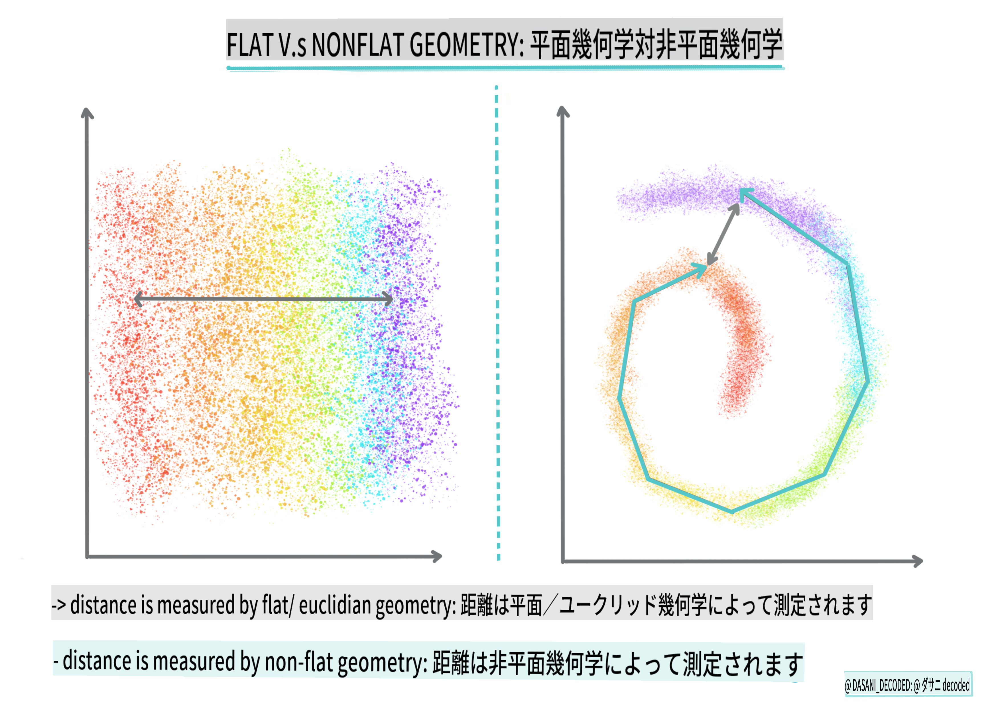
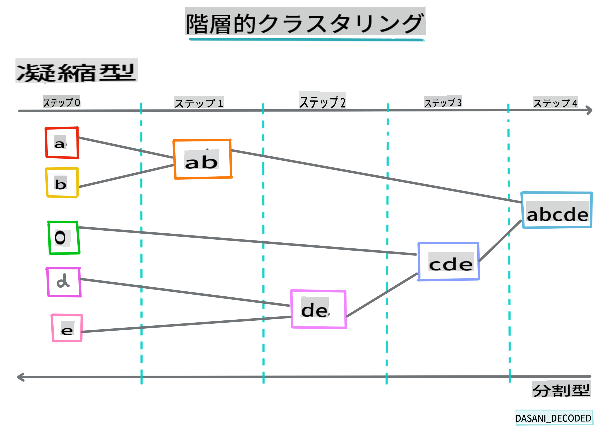

# クラスタリング入門

クラスタリングは、データセットがラベル付けされていない、またはその入力が事前定義された出力と一致していないことを前提とする[教師なし学習](https://wikipedia.org/wiki/Unsupervised_learning)の一種です。さまざまなアルゴリズムを使用してラベルのないデータを整理し、データ内のパターンに従ってグループ化を提供します。

[](https://youtu.be/ty2advRiWJM "No One Like You by PSquare")

> 🎥 上の画像をクリックするとビデオが再生されます。クラスタリングを使った機械学習を勉強しながら、ナイジェリアのダンスホールトラックを楽しんでください。これはPSquareの2014年の高評価の曲です。

## [プレ講義クイズ](https://gray-sand-07a10f403.1.azurestaticapps.net/quiz/27/)
### イントロダクション

[クラスタリング](https://link.springer.com/referenceworkentry/10.1007%2F978-0-387-30164-8_124)はデータ探索に非常に役立ちます。ナイジェリアの聴衆が音楽を消費する方法に関するトレンドやパターンを発見できるかどうか見てみましょう。

✅ クラスタリングの利用方法について少し考えてみてください。現実世界では、洗濯物を家族ごとに仕分けるときにクラスタリングが行われます🧦👕👖🩲。データサイエンスでは、ユーザーの好みを分析したり、ラベルのないデータセットの特性を決定したりする際にクラスタリングが行われます。クラスタリングは、混沌とした状況を整理するのに役立ちます。例えば、靴下の引き出しのように。

[](https://youtu.be/esmzYhuFnds "Introduction to Clustering")

> 🎥 上の画像をクリックするとビデオが再生されます。MITのジョン・グットタグがクラスタリングを紹介します。

プロフェッショナルな設定では、クラスタリングは市場セグメンテーションや、どの年齢層がどの商品を購入するかの決定などに使用されます。別の使用例としては、クレジットカード取引のデータセットから詐欺を検出するための異常検出があります。また、医療スキャンのバッチから腫瘍を特定するためにクラスタリングを使用することもできます。

✅ 銀行、eコマース、ビジネスの設定で「野生の中で」クラスタリングに遭遇した方法について考えてみてください。

> 🎓 興味深いことに、クラスタ分析は1930年代に人類学と心理学の分野で始まりました。どのように使用されたか想像できますか？

また、検索結果をグループ化するために使用することもできます。例えば、ショッピングリンク、画像、レビューなど。クラスタリングは、大規模なデータセットを減らし、より詳細な分析を行いたいときに役立ちます。この技術は、他のモデルを構築する前にデータを理解するために使用されます。

✅ データがクラスタに整理されると、クラスタIDを割り当てます。この技術はデータセットのプライバシーを保護する際に役立ちます。クラスタIDでデータポイントを参照することで、より具体的な識別可能なデータを使用せずに済みます。他の要素ではなくクラスタIDを使用して識別する理由を考えてみてください。

クラスタリング技術の理解を深めるために、この[Learnモジュール](https://docs.microsoft.com/learn/modules/train-evaluate-cluster-models?WT.mc_id=academic-77952-leestott)を参照してください。

## クラスタリングの始め方

[Scikit-learnは](https://scikit-learn.org/stable/modules/clustering.html)クラスタリングを実行するための多くの方法を提供しています。選択するタイプは使用ケースに依存します。ドキュメントによると、各方法にはさまざまな利点があります。以下は、Scikit-learnでサポートされている方法とその適切な使用ケースの簡略化された表です：

| メソッド名                    | 使用ケース                                                               |
| :--------------------------- | :--------------------------------------------------------------------- |
| K-Means                      | 一般的な目的、帰納的                                                   |
| Affinity propagation         | 多くの、不均一なクラスタ、帰納的                                       |
| Mean-shift                   | 多くの、不均一なクラスタ、帰納的                                       |
| Spectral clustering          | 少数の、均一なクラスタ、推論的                                         |
| Ward hierarchical clustering | 多くの、制約されたクラスタ、推論的                                     |
| Agglomerative clustering     | 多くの、制約された、非ユークリッド距離、推論的                         |
| DBSCAN                       | 非平坦な幾何学、不均一なクラスタ、推論的                               |
| OPTICS                       | 非平坦な幾何学、変動密度の不均一なクラスタ、推論的                     |
| Gaussian mixtures            | 平坦な幾何学、帰納的                                                   |
| BIRCH                        | 外れ値のある大規模なデータセット、帰納的                               |

> 🎓 クラスタを作成する方法は、データポイントをグループにまとめる方法に大きく関係しています。いくつかの用語を解説しましょう：
>
> 🎓 ['推論的' vs. '帰納的'](https://wikipedia.org/wiki/Transduction_(machine_learning))
> 
> 推論的推論は、特定のテストケースにマッピングされる観察されたトレーニングケースから導かれます。帰納的推論は、一般的なルールにマッピングされるトレーニングケースから導かれ、それがテストケースに適用されます。
> 
> 例：部分的にラベル付けされたデータセットがあると想像してください。いくつかは「レコード」、いくつかは「CD」、いくつかは空白です。あなたの仕事は空白にラベルを付けることです。帰納的アプローチを選択すると、「レコード」と「CD」を探すモデルをトレーニングし、そのラベルをラベルのないデータに適用します。このアプローチは、実際には「カセット」であるものを分類するのに苦労します。一方、推論的アプローチは、似たアイテムをグループ化し、そのグループにラベルを適用することで、この未知のデータをより効果的に処理します。この場合、クラスタは「丸い音楽のもの」や「四角い音楽のもの」を反映するかもしれません。
> 
> 🎓 ['非平坦' vs. '平坦'な幾何学](https://datascience.stackexchange.com/questions/52260/terminology-flat-geometry-in-the-context-of-clustering)
> 
> 数学的用語から派生した非平坦 vs. 平坦な幾何学は、ポイント間の距離を「平坦」（[ユークリッド](https://wikipedia.org/wiki/Euclidean_geometry)）または「非平坦」（非ユークリッド）な幾何学的方法で測定することを指します。
>
>'平坦'はユークリッド幾何学（部分的には「平面」幾何学として教えられる）を指し、非平坦は非ユークリッド幾何学を指します。幾何学が機械学習と何の関係があるのでしょうか？数学に根ざした2つの分野として、クラスタ内のポイント間の距離を測定する共通の方法が必要であり、それはデータの性質に応じて「平坦」または「非平坦」な方法で行うことができます。[ユークリッド距離](https://wikipedia.org/wiki/Euclidean_distance)は、2つのポイント間の線分の長さとして測定されます。[非ユークリッド距離](https://wikipedia.org/wiki/Non-Euclidean_geometry)は曲線に沿って測定されます。データが平面上に存在しないように見える場合、特殊なアルゴリズムを使用する必要があるかもしれません。
>

> インフォグラフィック: [Dasani Madipalli](https://twitter.com/dasani_decoded)
> 
> 🎓 ['距離'](https://web.stanford.edu/class/cs345a/slides/12-clustering.pdf)
> 
> クラスタは、その距離行列、つまりポイント間の距離によって定義されます。この距離は、いくつかの方法で測定できます。ユークリッドクラスタはポイント値の平均によって定義され、「重心」または中心点を含みます。距離はその重心までの距離によって測定されます。非ユークリッド距離は「クラストロイド」と呼ばれる最も近いポイントによって測定されます。クラストロイドはさまざまな方法で定義できます。
> 
> 🎓 ['制約された'](https://wikipedia.org/wiki/Constrained_clustering)
> 
> [制約付きクラスタリング](https://web.cs.ucdavis.edu/~davidson/Publications/ICDMTutorial.pdf)は、この教師なし方法に「半教師あり」学習を導入します。ポイント間の関係は「リンクできない」または「リンクしなければならない」としてフラグが立てられ、データセットにいくつかのルールが適用されます。
>
>例：アルゴリズムがラベルのないまたは半ラベルのデータのバッチに自由に設定されると、生成されるクラスタは質が低い可能性があります。上記の例では、クラスタは「丸い音楽のもの」、「四角い音楽のもの」、「三角形のもの」、「クッキー」をグループ化するかもしれません。いくつかの制約、つまりフォローするルール（「アイテムはプラスチックでなければならない」、「アイテムは音楽を生成できる必要がある」）を与えると、アルゴリズムがより良い選択をするのに役立ちます。
> 
> 🎓 '密度'
> 
> 'ノイズ'の多いデータは「密度が高い」と見なされます。そのクラスタ内のポイント間の距離は、調査の結果、より密度が高い、または低い、つまり「混雑している」ことがわかるかもしれません。このデータは適切なクラスタリング方法で分析する必要があります。[この記事](https://www.kdnuggets.com/2020/02/understanding-density-based-clustering.html)は、不均一なクラスタ密度を持つノイズの多いデータセットを探索するためにK-MeansクラスタリングとHDBSCANアルゴリズムを使用する違いを示しています。

## クラスタリングアルゴリズム

クラスタリングアルゴリズムは100以上あり、その使用は手元のデータの性質に依存します。主要なものをいくつか紹介しましょう：

- **階層的クラスタリング**。オブジェクトが遠くのオブジェクトよりも近くのオブジェクトに基づいて分類される場合、クラスタはメンバーの他のオブジェクトとの距離に基づいて形成されます。Scikit-learnの凝集クラスタリングは階層的です。

   
   > インフォグラフィック: [Dasani Madipalli](https://twitter.com/dasani_decoded)

- **重心クラスタリング**。この人気のあるアルゴリズムは、'k'、つまり形成するクラスタの数を選択する必要があります。その後、アルゴリズムはクラスタの中心点を決定し、その点の周りにデータを収集します。[K-meansクラスタリング](https://wikipedia.org/wiki/K-means_clustering)は重心クラスタリングの人気バージョンです。中心は最も近い平均によって決定されるため、この名前が付いています。クラスタからの二乗距離が最小化されます。

   
   > インフォグラフィック: [Dasani Madipalli](https://twitter.com/dasani_decoded)

- **分布ベースのクラスタリング**。統計モデリングに基づいており、分布ベースのクラスタリングはデータポイントがクラスタに属する確率を決定し、それに応じて割り当てます。ガウス混合法はこのタイプに属します。

- **密度ベースのクラスタリング**。データポイントはその密度、つまり互いの周りにグループ化されることに基づいてクラスタに割り当てられます。グループから遠く離れたデータポイントは外れ値またはノイズと見なされます。DBSCAN、Mean-shift、およびOPTICSはこのタイプのクラスタリングに属します。

- **グリッドベースのクラスタリング**。多次元データセットの場合、グリッドが作成され、データはグリッドのセルに分割され、それによってクラスタが作成されます。

## 演習 - データをクラスタリングする

クラスタリング技術は適切な視覚化によって大いに助けられるので、音楽データを視覚化することから始めましょう。この演習は、このデータの性質に最も効果的なクラスタリング方法を決定するのに役立ちます。

1. このフォルダ内の[_notebook.ipynb_](https://github.com/microsoft/ML-For-Beginners/blob/main/5-Clustering/1-Visualize/notebook.ipynb)ファイルを開きます。

1. 良いデータ視覚化のために`Seaborn`パッケージをインポートします。

    ```python
    !pip install seaborn
    ```

1. [_nigerian-songs.csv_](https://github.com/microsoft/ML-For-Beginners/blob/main/5-Clustering/data/nigerian-songs.csv)から曲データを追加します。曲に関するデータでデータフレームを読み込みます。ライブラリをインポートし、データをダンプしてこのデータを探索する準備をします：

    ```python
    import matplotlib.pyplot as plt
    import pandas as pd
    
    df = pd.read_csv("../data/nigerian-songs.csv")
    df.head()
    ```

    最初の数行のデータを確認します：

    |     | name                     | album                        | artist              | artist_top_genre | release_date | length | popularity | danceability | acousticness | energy | instrumentalness | liveness | loudness | speechiness | tempo   | time_signature |
    | --- | ------------------------ | ---------------------------- | ------------------- | ---------------- | ------------ | ------ | ---------- | ------------ | ------------ | ------ | ---------------- | -------- | -------- | ----------- | ------- | -------------- |
    | 0   | Sparky                   | Mandy & The Jungle           | Cruel Santino       | alternative r&b  | 2019         | 144000 | 48         | 0.666        | 0.851        | 0.42   | 0.534            | 0.11     | -6.699   | 0.0829      | 133.015 | 5              |
    | 1   | shuga rush               | EVERYTHING YOU HEARD IS TRUE | Odunsi (The Engine) | afropop          | 2020         | 89488  | 30         | 0.71         | 0.0822       | 0.683  | 0.000169         | 0.101    | -5.64    | 0.36        | 129.993 | 3              |
    | 2   | LITT!                    | LITT!                        | AYLØ                | indie r&b        | 2018         | 207758 | 40         | 0.836        | 0.272        | 0.564  | 0.000537         | 0.11     | -7.127   | 0.0424      | 130.005 | 4              |
    | 3   | Confident / Feeling Cool | Enjoy Your Life              | Lady Donli          | nigerian pop     | 2019         | 175135 | 14         | 0.894        | 0.798        | 0.611  | 0.000187         | 0.0964   | -4.961   | 0.113       | 111.087 | 4              |
    | 4   | wanted you               | rare.                        | Odunsi (The Engine) | afropop          | 2018         | 152049 | 25
## [講義後のクイズ](https://gray-sand-07a10f403.1.azurestaticapps.net/quiz/28/)

## 復習と自主学習

クラスタリングアルゴリズムを適用する前に、データセットの性質を理解することが重要です。このトピックについてもっと知りたい方は[こちら](https://www.kdnuggets.com/2019/10/right-clustering-algorithm.html)をご覧ください。

[この役立つ記事](https://www.freecodecamp.org/news/8-clustering-algorithms-in-machine-learning-that-all-data-scientists-should-know/)では、さまざまなデータ形状に応じた異なるクラスタリングアルゴリズムの挙動について説明しています。

## 課題

[クラスタリングの他の可視化方法を調査する](assignment.md)

**免責事項**:
この文書は、機械ベースのAI翻訳サービスを使用して翻訳されています。正確さを期していますが、自動翻訳にはエラーや不正確さが含まれる場合がありますのでご注意ください。元の言語での原文が権威ある情報源と見なされるべきです。重要な情報については、専門の人間による翻訳をお勧めします。この翻訳の使用に起因する誤解や誤解について、当社は責任を負いません。