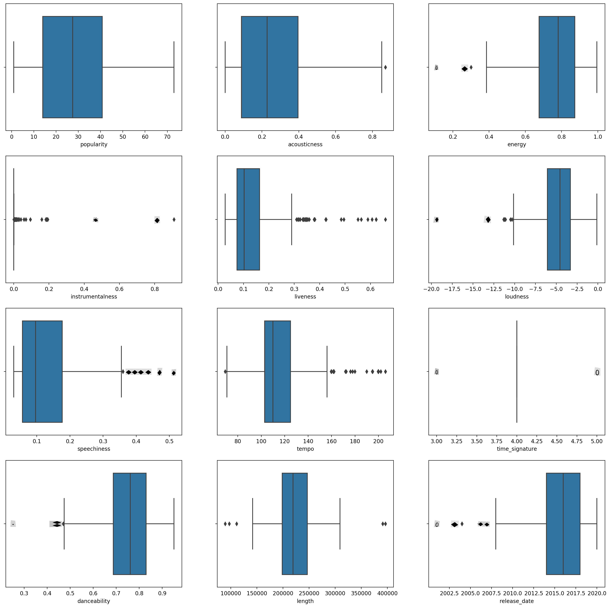
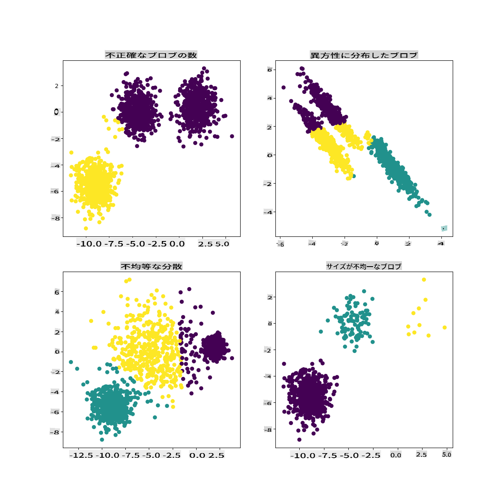

# K-Means クラスタリング

## [事前講義クイズ](https://gray-sand-07a10f403.1.azurestaticapps.net/quiz/29/)

このレッスンでは、以前にインポートしたナイジェリア音楽データセットを使用して、Scikit-learnを使ったクラスタリングの作成方法を学びます。K-Meansクラスタリングの基本について説明します。前のレッスンで学んだように、クラスタリングには多くの方法があり、使用する方法はデータに依存します。K-Meansは最も一般的なクラスタリング技術なので、これを試してみましょう！

学ぶ用語:

- シルエットスコア
- エルボー法
- 慣性
- 分散

## 導入

[K-Meansクラスタリング](https://wikipedia.org/wiki/K-means_clustering)は、信号処理の分野から派生した手法です。データのグループを 'k' クラスターに分割し、観察を通じてクラスタリングを行います。各観察は、与えられたデータポイントを最も近い '平均'、つまりクラスターの中心点にグループ化するために機能します。

クラスタは、点（または '種子'）とその対応する領域を含む[ボロノイ図](https://wikipedia.org/wiki/Voronoi_diagram)として視覚化できます。


> インフォグラフィック by [Jen Looper](https://twitter.com/jenlooper)

K-Meansクラスタリングのプロセスは[3ステップで実行されます](https://scikit-learn.org/stable/modules/clustering.html#k-means):

1. アルゴリズムはデータセットからサンプリングしてk個の中心点を選択します。その後、以下をループします:
    1. 各サンプルを最も近いセントロイドに割り当てます。
    2. 前のセントロイドに割り当てられたすべてのサンプルの平均値を取って新しいセントロイドを作成します。
    3. その後、新旧のセントロイドの差を計算し、セントロイドが安定するまで繰り返します。

K-Meansの使用には、 'k' 、つまりセントロイドの数を設定する必要があるという欠点があります。幸いにも、 'エルボー法' は 'k' の適切な開始値を推定するのに役立ちます。すぐに試してみましょう。

## 前提条件

このレッスンの[_notebook.ipynb_](https://github.com/microsoft/ML-For-Beginners/blob/main/5-Clustering/2-K-Means/notebook.ipynb)ファイルで作業します。このファイルには、前のレッスンで行ったデータのインポートと事前クリーニングが含まれています。

## 演習 - 準備

もう一度、曲のデータを見てみましょう。

1. 各列に対して `boxplot()` を呼び出してボックスプロットを作成します:

    ```python
    plt.figure(figsize=(20,20), dpi=200)
    
    plt.subplot(4,3,1)
    sns.boxplot(x = 'popularity', data = df)
    
    plt.subplot(4,3,2)
    sns.boxplot(x = 'acousticness', data = df)
    
    plt.subplot(4,3,3)
    sns.boxplot(x = 'energy', data = df)
    
    plt.subplot(4,3,4)
    sns.boxplot(x = 'instrumentalness', data = df)
    
    plt.subplot(4,3,5)
    sns.boxplot(x = 'liveness', data = df)
    
    plt.subplot(4,3,6)
    sns.boxplot(x = 'loudness', data = df)
    
    plt.subplot(4,3,7)
    sns.boxplot(x = 'speechiness', data = df)
    
    plt.subplot(4,3,8)
    sns.boxplot(x = 'tempo', data = df)
    
    plt.subplot(4,3,9)
    sns.boxplot(x = 'time_signature', data = df)
    
    plt.subplot(4,3,10)
    sns.boxplot(x = 'danceability', data = df)
    
    plt.subplot(4,3,11)
    sns.boxplot(x = 'length', data = df)
    
    plt.subplot(4,3,12)
    sns.boxplot(x = 'release_date', data = df)
    ```

    このデータは少しノイズが多いです: 各列をボックスプロットとして観察すると、外れ値が見えます。

    

データセットを通じてこれらの外れ値を削除することもできますが、それではデータが非常に少なくなります。

1. クラスタリング演習に使用する列を選択します。範囲が似ているものを選び、 `artist_top_genre` 列を数値データとしてエンコードします:

    ```python
    from sklearn.preprocessing import LabelEncoder
    le = LabelEncoder()
    
    X = df.loc[:, ('artist_top_genre','popularity','danceability','acousticness','loudness','energy')]
    
    y = df['artist_top_genre']
    
    X['artist_top_genre'] = le.fit_transform(X['artist_top_genre'])
    
    y = le.transform(y)
    ```

1. 次に、ターゲットとするクラスタ数を選択する必要があります。データセットから3つの曲のジャンルがあることがわかっているので、3つを試してみましょう:

    ```python
    from sklearn.cluster import KMeans
    
    nclusters = 3 
    seed = 0
    
    km = KMeans(n_clusters=nclusters, random_state=seed)
    km.fit(X)
    
    # Predict the cluster for each data point
    
    y_cluster_kmeans = km.predict(X)
    y_cluster_kmeans
    ```

データフレームの各行に対して予測されたクラスタ（0, 1, 2）が含まれた配列が表示されます。

1. この配列を使用して 'シルエットスコア' を計算します:

    ```python
    from sklearn import metrics
    score = metrics.silhouette_score(X, y_cluster_kmeans)
    score
    ```

## シルエットスコア

シルエットスコアは1に近いほど良いです。このスコアは-1から1まで変動し、スコアが1の場合、クラスターは密集しており他のクラスターとよく分離されています。0に近い値は、隣接するクラスターの決定境界に非常に近いサンプルを持つオーバーラップするクラスターを表します。 [(ソース)](https://dzone.com/articles/kmeans-silhouette-score-explained-with-python-exam)

私たちのスコアは**.53**ですので、中間です。これは、このタイプのクラスタリングにデータが特に適していないことを示していますが、続けてみましょう。

### 演習 - モデルの構築

1. `KMeans` をインポートし、クラスタリングプロセスを開始します。

    ```python
    from sklearn.cluster import KMeans
    wcss = []
    
    for i in range(1, 11):
        kmeans = KMeans(n_clusters = i, init = 'k-means++', random_state = 42)
        kmeans.fit(X)
        wcss.append(kmeans.inertia_)
    
    ```

    ここには説明する価値のあるいくつかの部分があります。

    > 🎓 range: クラスタリングプロセスの反復回数です

    > 🎓 random_state: "セントロイドの初期化のための乱数生成を決定します。" [ソース](https://scikit-learn.org/stable/modules/generated/sklearn.cluster.KMeans.html#sklearn.cluster.KMeans)

    > 🎓 WCSS: "within-cluster sums of squares" は、クラスター内のすべてのポイントのクラスターセントロイドへの平均距離の平方を測定します。 [ソース](https://medium.com/@ODSC/unsupervised-learning-evaluating-clusters-bd47eed175ce).

    > 🎓 Inertia: K-Meansアルゴリズムは 'inertia' を最小化するセントロイドを選択しようとします。これは、"クラスターが内部的にどれだけ一貫しているかを測定するものです。" [ソース](https://scikit-learn.org/stable/modules/clustering.html). この値は各反復でwcss変数に追加されます。

    > 🎓 k-means++: [Scikit-learn](https://scikit-learn.org/stable/modules/clustering.html#k-means) では、'k-means++' 最適化を使用できます。これは、"セントロイドをお互いに（一般的に）遠くに初期化し、ランダムな初期化よりもおそらく良い結果をもたらします。

### エルボー法

以前、3つの曲のジャンルをターゲットにしているため、3つのクラスターを選択するべきだと推測しました。しかし、それは本当でしょうか？

1. 'エルボー法' を使用して確認します。

    ```python
    plt.figure(figsize=(10,5))
    sns.lineplot(x=range(1, 11), y=wcss, marker='o', color='red')
    plt.title('Elbow')
    plt.xlabel('Number of clusters')
    plt.ylabel('WCSS')
    plt.show()
    ```

    前のステップで構築した `wcss` 変数を使用して、クラスターの最適な数を示す 'エルボー' の曲がりを示すチャートを作成します。おそらくそれは **3** です！

    

## 演習 - クラスタを表示する

1. 今度は3つのクラスターを設定してプロセスを再試行し、クラスタを散布図として表示します:

    ```python
    from sklearn.cluster import KMeans
    kmeans = KMeans(n_clusters = 3)
    kmeans.fit(X)
    labels = kmeans.predict(X)
    plt.scatter(df['popularity'],df['danceability'],c = labels)
    plt.xlabel('popularity')
    plt.ylabel('danceability')
    plt.show()
    ```

1. モデルの精度を確認します:

    ```python
    labels = kmeans.labels_
    
    correct_labels = sum(y == labels)
    
    print("Result: %d out of %d samples were correctly labeled." % (correct_labels, y.size))
    
    print('Accuracy score: {0:0.2f}'. format(correct_labels/float(y.size)))
    ```

    このモデルの精度はあまり良くなく、クラスタの形状がその理由を示しています。

    

    このデータは不均衡で、相関が少なく、列の値の間に大きなばらつきがあり、うまくクラスタリングできません。実際、形成されるクラスタは、上で定義した3つのジャンルカテゴリに大きく影響されているか、偏っている可能性があります。これは学習プロセスでした！

    Scikit-learnのドキュメントでは、このようにクラスタがあまりよく区別されていないモデルは '分散' の問題があるとされています:

    
    > Infographic from Scikit-learn

## 分散

分散は "平均からの平方の差の平均" と定義されます [(ソース)](https://www.mathsisfun.com/data/standard-deviation.html). このクラスタリング問題の文脈では、データセットの数値が平均から少し離れすぎることを指します。

✅ これは、この問題を解決するためのすべての方法を考える良い機会です。データをもう少し調整しますか？他の列を使用しますか？別のアルゴリズムを使用しますか？ヒント: [データをスケーリング](https://www.mygreatlearning.com/blog/learning-data-science-with-k-means-clustering/) して正規化し、他の列をテストしてみてください。

> この '[分散計算機](https://www.calculatorsoup.com/calculators/statistics/variance-calculator.php)' を試して、概念をもう少し理解してください。

---

## 🚀チャレンジ

このノートブックでパラメータを調整してみてください。データをさらにクリーニングすることでモデルの精度を向上させることができますか（たとえば、外れ値を削除するなど）？特定のデータサンプルに重みをつけることもできます。他にどのようにしてより良いクラスタを作成できますか？

ヒント: データをスケーリングしてみてください。ノートブックには、データ列が範囲の点で互いにより似るように標準スケーリングを追加するコメント付きのコードがあります。シルエットスコアは下がりますが、エルボーグラフの '曲がり' が滑らかになります。これは、データをスケーリングせずに放置すると、分散が少ないデータがより多くの重みを持つことになるためです。この問題についてさらに読みたい場合は、[こちら](https://stats.stackexchange.com/questions/21222/are-mean-normalization-and-feature-scaling-needed-for-k-means-clustering/21226#21226)を参照してください。

## [事後講義クイズ](https://gray-sand-07a10f403.1.azurestaticapps.net/quiz/30/)

## レビューと自主学習

このK-Meansシミュレーター[こちら](https://user.ceng.metu.edu.tr/~akifakkus/courses/ceng574/k-means/)を見てみてください。このツールを使用して、サンプルデータポイントを視覚化し、そのセントロイドを決定できます。データのランダム性、クラスタの数、セントロイドの数を編集できます。これにより、データがどのようにグループ化されるかのアイデアが得られますか？

また、スタンフォードの[K-Meansに関するハンドアウト](https://stanford.edu/~cpiech/cs221/handouts/kmeans.html)も見てみてください。

## 課題

[さまざまなクラスタリング手法を試してみてください](assignment.md)

**免責事項**:
この文書は機械ベースのAI翻訳サービスを使用して翻訳されています。正確さを期すよう努めておりますが、自動翻訳には誤りや不正確さが含まれる可能性があります。原文が記載された母国語の文書が信頼できる情報源と見なされるべきです。重要な情報については、専門の人間による翻訳をお勧めします。この翻訳の使用により生じる誤解や誤認について、当社は一切の責任を負いません。