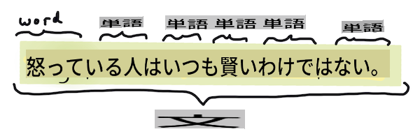
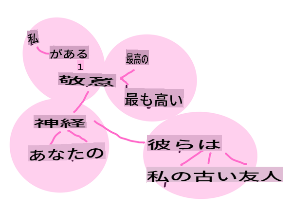
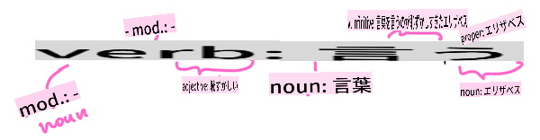

# 一般的な自然言語処理タスクと技術

ほとんどの*自然言語処理*タスクでは、処理するテキストを分解し、調査し、その結果をルールやデータセットと照合する必要があります。これらのタスクにより、プログラマーはテキスト内の用語や単語の_意味_や_意図_、または単に_頻度_を導き出すことができます。

## [事前クイズ](https://gray-sand-07a10f403.1.azurestaticapps.net/quiz/33/)

テキスト処理に使用される一般的な技術を見てみましょう。これらの技術は機械学習と組み合わせることで、大量のテキストを効率的に分析するのに役立ちます。しかし、これらのタスクにMLを適用する前に、NLPの専門家が直面する問題を理解しておきましょう。

## NLPに共通するタスク

作業中のテキストを分析する方法はいくつかあります。これらのタスクを実行することで、テキストの理解を深め、結論を導き出すことができます。通常、これらのタスクは一連の手順で行います。

### トークン化

おそらくほとんどのNLPアルゴリズムが最初に行うことは、テキストをトークンや単語に分割することです。これが簡単に思えるかもしれませんが、句読点や異なる言語の単語や文の区切りを考慮する必要があるため、難しくなることがあります。区切りを判断するためにさまざまな方法を使用する必要があるかもしれません。


> **高慢と偏見**からの文をトークン化する。インフォグラフィック提供：[Jen Looper](https://twitter.com/jenlooper)

### 埋め込み

[単語の埋め込み](https://wikipedia.org/wiki/Word_embedding)は、テキストデータを数値的に変換する方法です。埋め込みは、意味が似ている単語や一緒に使われる単語がクラスターとして集まるように行われます。


> "I have the highest respect for your nerves, they are my old friends." - **高慢と偏見**の文に対する単語の埋め込み。インフォグラフィック提供：[Jen Looper](https://twitter.com/jenlooper)

✅ [この興味深いツール](https://projector.tensorflow.org/)を試して、単語の埋め込みを実験してみてください。ある単語をクリックすると、似た単語のクラスターが表示されます：'toy'は'disney', 'lego', 'playstation', 'console'とクラスターを形成します。

### 解析と品詞タグ付け

トークン化されたすべての単語は、名詞、動詞、形容詞などの品詞としてタグ付けされます。文 `the quick red fox jumped over the lazy brown dog` は、fox = 名詞、jumped = 動詞として品詞タグ付けされるかもしれません。



> **高慢と偏見**からの文を解析する。インフォグラフィック提供：[Jen Looper](https://twitter.com/jenlooper)

解析とは、文中のどの単語が互いに関連しているかを認識することです。例えば、`the quick red fox jumped` は形容詞-名詞-動詞のシーケンスであり、`lazy brown dog` シーケンスとは別です。

### 単語とフレーズの頻度

大規模なテキストを分析する際に有用な手法は、興味のあるすべての単語やフレーズの辞書を作成し、それがどのくらいの頻度で出現するかを記録することです。フレーズ `the quick red fox jumped over the lazy brown dog` は、the の単語頻度が2です。

単語の頻度をカウントする例文を見てみましょう。ラドヤード・キップリングの詩「The Winners」には次の節があります：

```output
What the moral? Who rides may read.
When the night is thick and the tracks are blind
A friend at a pinch is a friend, indeed,
But a fool to wait for the laggard behind.
Down to Gehenna or up to the Throne,
He travels the fastest who travels alone.
```

フレーズの頻度は、大文字小文字を区別する場合や区別しない場合があります。フレーズ `a friend` has a frequency of 2 and `the` has a frequency of 6, and `travels` は2です。

### N-gram

テキストは、一定の長さの単語のシーケンスに分割できます。単一の単語（ユニグラム）、2つの単語（バイグラム）、3つの単語（トライグラム）または任意の数の単語（n-gram）です。

例えば、`the quick red fox jumped over the lazy brown dog` を2-gramスコアで分割すると、次のn-gramが生成されます：

1. the quick 
2. quick red 
3. red fox
4. fox jumped 
5. jumped over 
6. over the 
7. the lazy 
8. lazy brown 
9. brown dog

これは文の上にスライドするボックスとして視覚化するのが簡単かもしれません。3単語のn-gramの場合、各文でn-gramが太字で示されています：

1.   <u>**the quick red**</u> fox jumped over the lazy brown dog
2.   the **<u>quick red fox</u>** jumped over the lazy brown dog
3.   the quick **<u>red fox jumped</u>** over the lazy brown dog
4.   the quick red **<u>fox jumped over</u>** the lazy brown dog
5.   the quick red fox **<u>jumped over the</u>** lazy brown dog
6.   the quick red fox jumped **<u>over the lazy</u>** brown dog
7.   the quick red fox jumped over <u>**the lazy brown**</u> dog
8.   the quick red fox jumped over the **<u>lazy brown dog</u>**


> N-gram値3: インフォグラフィック提供：[Jen Looper](https://twitter.com/jenlooper)

### 名詞句抽出

ほとんどの文には、主語または目的語としての名詞があります。英語では、しばしば 'a' や 'an' または 'the' が前に置かれていることで識別できます。文の意味を理解しようとする際に、名詞句を抽出して文の主語または目的語を特定することは、NLPで一般的なタスクです。

✅ "I cannot fix on the hour, or the spot, or the look or the words, which laid the foundation. It is too long ago. I was in the middle before I knew that I had begun." という文で、名詞句を特定できますか？

文 `the quick red fox jumped over the lazy brown dog` には、2つの名詞句があります：**quick red fox** と **lazy brown dog**。

### 感情分析

文やテキストは、その*ポジティブ*または*ネガティブ*な感情を分析することができます。感情は*極性*および*客観性/主観性*で測定されます。極性は-1.0から1.0（ネガティブからポジティブ）で測定され、0.0から1.0（最も客観的から最も主観的）で測定されます。

✅ 後で、機械学習を使用して感情を判定するさまざまな方法を学びますが、一つの方法は、ポジティブまたはネガティブに分類された単語やフレーズのリストを人間の専門家が作成し、そのモデルをテキストに適用して極性スコアを計算することです。この方法がどのように機能するか、またはうまく機能しない場合があるかを理解できますか？

### 屈折

屈折は、単語を取り、その単語の単数形または複数形を取得することを可能にします。

### レンマ化

*レンマ*は、一連の単語の根本または主要な単語です。例えば、*flew*, *flies*, *flying* は動詞 *fly* のレンマです。

NLP研究者にとって有用なデータベースもあります。特に：

### WordNet

[WordNet](https://wordnet.princeton.edu/)は、異なる言語のすべての単語の同義語、反義語、およびその他の詳細を含むデータベースです。翻訳、スペルチェッカー、または任意の種類の言語ツールを構築する際に非常に役立ちます。

## NLPライブラリ

幸いなことに、これらの技術をすべて自分で構築する必要はありません。自然言語処理や機械学習に特化していない開発者にもアクセスしやすくする優れたPythonライブラリがあります。次のレッスンではこれらの例をさらに紹介しますが、ここでは次のタスクに役立ついくつかの有用な例を学びます。

### 演習 - `TextBlob` library

Let's use a library called TextBlob as it contains helpful APIs for tackling these types of tasks. TextBlob "stands on the giant shoulders of [NLTK](https://nltk.org) and [pattern](https://github.com/clips/pattern), and plays nicely with both." It has a considerable amount of ML embedded in its API.

> Note: A useful [Quick Start](https://textblob.readthedocs.io/en/dev/quickstart.html#quickstart) guide is available for TextBlob that is recommended for experienced Python developers 

When attempting to identify *noun phrases*, TextBlob offers several options of extractors to find noun phrases. 

1. Take a look at `ConllExtractor`を使用する

    ```python
    from textblob import TextBlob
    from textblob.np_extractors import ConllExtractor
    # import and create a Conll extractor to use later 
    extractor = ConllExtractor()
    
    # later when you need a noun phrase extractor:
    user_input = input("> ")
    user_input_blob = TextBlob(user_input, np_extractor=extractor)  # note non-default extractor specified
    np = user_input_blob.noun_phrases                                    
    ```

    > ここで何が起こっているのか？ [ConllExtractor](https://textblob.readthedocs.io/en/dev/api_reference.html?highlight=Conll#textblob.en.np_extractors.ConllExtractor) は「ConLL-2000トレーニングコーパスで訓練されたチャンク解析を使用する名詞句抽出器」です。ConLL-2000は、2000年の計算言語学学習に関する会議を指します。毎年、この会議は難解なNLP問題に取り組むワークショップを開催しており、2000年には名詞チャンクに焦点を当てました。モデルはWall Street Journalで訓練され、「セクション15-18を訓練データ（211727トークン）として使用し、セクション20をテストデータ（47377トークン）として使用しました」。使用された手順は[こちら](https://www.clips.uantwerpen.be/conll2000/chunking/)で、[結果](https://ifarm.nl/erikt/research/np-chunking.html)を確認できます。

### チャレンジ - NLPでボットを改良する

前のレッスンでは、非常にシンプルなQ&Aボットを作成しました。今回は、入力の感情を分析して感情に応じた応答を出力することで、マーヴィンを少し共感的にします。また、`noun_phrase`を特定し、そのトピックについてさらに入力を求める必要があります。

より良い会話ボットを構築する際の手順：

1. ユーザーにボットとの対話方法を指示する
2. ループを開始する 
   1. ユーザー入力を受け取る
   2. ユーザーが終了を求めた場合は終了する
   3. ユーザー入力を処理し、適切な感情応答を決定する
   4. 感情に名詞句が含まれている場合、その名詞句を複数形にしてそのトピックについてさらに入力を求める
   5. 応答を出力する
3. ステップ2に戻る

TextBlobを使用して感情を判定するコードスニペットはこちらです。感情応答の*勾配*は4つしかありません（もっと増やしても構いません）：

```python
if user_input_blob.polarity <= -0.5:
  response = "Oh dear, that sounds bad. "
elif user_input_blob.polarity <= 0:
  response = "Hmm, that's not great. "
elif user_input_blob.polarity <= 0.5:
  response = "Well, that sounds positive. "
elif user_input_blob.polarity <= 1:
  response = "Wow, that sounds great. "
```

以下は参考となるサンプル出力です（ユーザー入力は>で始まる行です）：

```output
Hello, I am Marvin, the friendly robot.
You can end this conversation at any time by typing 'bye'
After typing each answer, press 'enter'
How are you today?
> I am ok
Well, that sounds positive. Can you tell me more?
> I went for a walk and saw a lovely cat
Well, that sounds positive. Can you tell me more about lovely cats?
> cats are the best. But I also have a cool dog
Wow, that sounds great. Can you tell me more about cool dogs?
> I have an old hounddog but he is sick
Hmm, that's not great. Can you tell me more about old hounddogs?
> bye
It was nice talking to you, goodbye!
```

タスクの一つの解決策は[こちら](https://github.com/microsoft/ML-For-Beginners/blob/main/6-NLP/2-Tasks/solution/bot.py)です。

✅ 知識チェック

1. 共感的な応答が、ボットが実際に理解していると人を「騙す」ことができると思いますか？
2. 名詞句を特定することで、ボットがより「信じられる」ものになりますか？
3. 文から名詞句を抽出することが有用な理由は何ですか？

---

前の知識チェックでボットを実装し、友人にテストしてみてください。それが彼らを騙すことができますか？ボットをもっと「信じられる」ものにすることができますか？

## 🚀チャレンジ

前の知識チェックでのタスクを実装してみてください。ボットを友人にテストしてみてください。それが彼らを騙すことができますか？ボットをもっと「信じられる」ものにすることができますか？

## [事後クイズ](https://gray-sand-07a10f403.1.azurestaticapps.net/quiz/34/)

## レビュー＆自習

次のいくつかのレッスンでは、感情分析についてさらに学びます。この記事のようなものを読んで、この興味深い技術を研究してみてください。[KDNuggets](https://www.kdnuggets.com/tag/nlp)

## 課題

[Make a bot talk back](assignment.md)

**免責事項**:
この文書は機械翻訳AIサービスを使用して翻訳されています。正確さを期しておりますが、自動翻訳には誤りや不正確さが含まれる可能性があることをご理解ください。権威ある情報源としては、元の言語で書かれた原文を参照してください。重要な情報については、専門の人間による翻訳を推奨します。この翻訳の使用に起因する誤解や誤認については、当方は一切の責任を負いません。