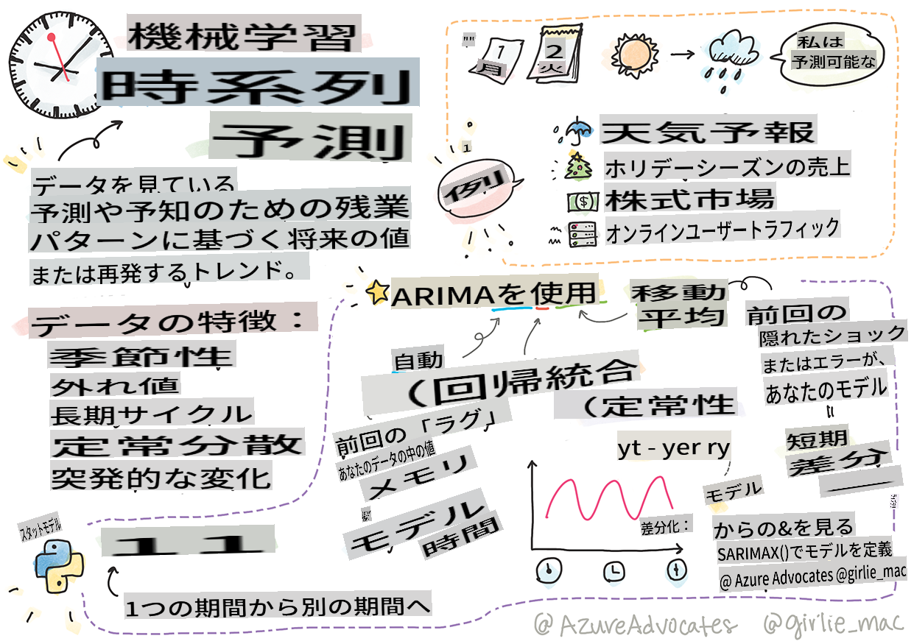
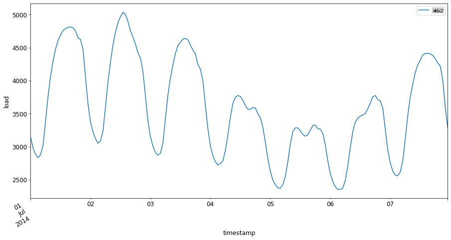

# 時系列予測の入門



> スケッチノート by [Tomomi Imura](https://www.twitter.com/girlie_mac)

このレッスンと次のレッスンでは、時系列予測について学びます。これは、価格などの変数の過去のパフォーマンスに基づいて、将来の潜在的な価値を予測することができる、ML科学者のレパートリーの一部であり、他のトピックほど知られていない興味深く価値のある分野です。

[](https://youtu.be/cBojo1hsHiI "時系列予測の入門")

> 🎥 上の画像をクリックして、時系列予測についてのビデオをご覧ください

## [講義前のクイズ](https://gray-sand-07a10f403.1.azurestaticapps.net/quiz/41/)

価格設定、在庫、サプライチェーンの問題に直接応用できるため、ビジネスにとって非常に価値のある興味深い分野です。深層学習技術が将来のパフォーマンスをより良く予測するために使われ始めていますが、時系列予測は依然として古典的なML技術によって大いに支えられています。

> ペンシルベニア州立大学の有用な時系列カリキュラムは[こちら](https://online.stat.psu.edu/stat510/lesson/1)にあります

## はじめに

あなたがスマート駐車メーターのデータを管理していて、その使用頻度や使用時間のデータを持っているとしましょう。

> メーターの過去のパフォーマンスに基づいて、需要と供給の法則に従って将来の価値を予測できたらどうでしょう？

目標を達成するための適切な行動タイミングを正確に予測することは、時系列予測で解決できる課題です。忙しい時に駐車スペースを探している人々に対して料金を上げるのは喜ばれないかもしれませんが、街を清掃するための収益を確保する確実な方法です！

さまざまな時系列アルゴリズムを探り、データをクリーンアップして準備するためのノートブックを開始しましょう。この例では、GEFCom2014予測コンペティションから取得したデータを分析します。2012年から2014年までの3年間の毎時の電力負荷と温度の値が含まれています。電力負荷と温度の過去のパターンに基づいて、将来の電力負荷の値を予測することができます。

この例では、過去の負荷データのみを使用して、1ステップ先を予測する方法を学びます。ただし、開始する前に、舞台裏で何が起こっているのかを理解することが有益です。

## いくつかの定義

'時系列'という用語に出会ったとき、さまざまな文脈での使用法を理解する必要があります。

🎓 **時系列**

数学では、「時系列は、時間順にインデックス付け（またはリスト化またはグラフ化）されたデータポイントの系列です。最も一般的には、時系列は等間隔の連続した時間ポイントで取得されたシーケンスです。」時系列の例として、[ダウ・ジョーンズ工業株平均](https://wikipedia.org/wiki/Time_series)の終値があります。時系列プロットや統計モデリングの使用は、信号処理、天気予報、地震予測などのイベントが発生し、データポイントが時間とともにプロットされる他の分野で頻繁に見られます。

🎓 **時系列分析**

時系列分析は、上記の時系列データの分析です。時系列データは、'中断された時系列'のように、中断イベントの前後の時系列の進化パターンを検出するなど、さまざまな形式を取ることがあります。時系列の分析に必要なタイプは、データの性質によります。時系列データ自体は、数字や文字の系列の形式を取ることができます。

実行される分析は、周波数領域と時間領域、線形と非線形など、さまざまな方法を使用します。この種のデータを分析する多くの方法については、[こちら](https://www.itl.nist.gov/div898/handbook/pmc/section4/pmc4.htm)を参照してください。

🎓 **時系列予測**

時系列予測は、過去に発生したデータによって表示されたパターンに基づいて将来の値を予測するためにモデルを使用することです。時間インデックスをプロット上のx変数として使用して時系列データを探索するために回帰モデルを使用することは可能ですが、そのようなデータは特別なタイプのモデルを使用して最もよく分析されます。

時系列データは、線形回帰で分析できるデータとは異なり、順序付けられた観察値のリストです。最も一般的なものは、"自己回帰移動平均モデル"を意味するARIMAです。

[ARIMAモデル](https://online.stat.psu.edu/stat510/lesson/1/1.1)は「現在のシリーズの値を過去の値および過去の予測誤差に関連付けます。」これらは、データが時間とともに順序付けられる時間領域データの分析に最も適しています。

> いくつかのタイプのARIMAモデルがあり、[こちら](https://people.duke.edu/~rnau/411arim.htm)で学ぶことができます。また、次のレッスンで触れます。

次のレッスンでは、[単変量時系列](https://itl.nist.gov/div898/handbook/pmc/section4/pmc44.htm)を使用してARIMAモデルを構築します。これは、時間とともにその値が変化する1つの変数に焦点を当てます。この種のデータの例として、マウナ・ロア観測所で記録された月ごとのCO2濃度の[このデータセット](https://itl.nist.gov/div898/handbook/pmc/section4/pmc4411.htm)があります：

|  CO2   | YearMonth | Year  | Month |
| :----: | :-------: | :---: | :---: |
| 330.62 |  1975.04  | 1975  |   1   |
| 331.40 |  1975.13  | 1975  |   2   |
| 331.87 |  1975.21  | 1975  |   3   |
| 333.18 |  1975.29  | 1975  |   4   |
| 333.92 |  1975.38  | 1975  |   5   |
| 333.43 |  1975.46  | 1975  |   6   |
| 331.85 |  1975.54  | 1975  |   7   |
| 330.01 |  1975.63  | 1975  |   8   |
| 328.51 |  1975.71  | 1975  |   9   |
| 328.41 |  1975.79  | 1975  |  10   |
| 329.25 |  1975.88  | 1975  |  11   |
| 330.97 |  1975.96  | 1975  |  12   |

✅ このデータセットで時間とともに変化する変数を特定してください

## 時系列データの特性に注意する

時系列データを見ると、そのパターンをよりよく理解するために考慮し、軽減する必要がある[特定の特性](https://online.stat.psu.edu/stat510/lesson/1/1.1)があることに気付くかもしれません。時系列データを分析したい'信号'として考えると、これらの特性は'ノイズ'と見なすことができます。これらの特性の一部を統計技術を使用して相殺することにより、この'ノイズ'を削減する必要があることがよくあります。

時系列を扱うために知っておくべきいくつかの概念は次のとおりです：

🎓 **トレンド**

トレンドは、時間とともに測定可能な増減として定義されます。[詳細はこちら](https://machinelearningmastery.com/time-series-trends-in-python)。時系列の文脈では、トレンドを使用し、必要に応じて時系列からトレンドを削除する方法について説明します。

🎓 **[季節性](https://machinelearningmastery.com/time-series-seasonality-with-python/)**

季節性は、例えば、販売に影響を与える可能性のある休日のラッシュのような周期的な変動として定義されます。データにおける季節性を表示するさまざまなタイプのプロットについては、[こちら](https://itl.nist.gov/div898/handbook/pmc/section4/pmc443.htm)を参照してください。

🎓 **外れ値**

外れ値は、標準データの分散から遠く離れたものです。

🎓 **長期サイクル**

季節性とは無関係に、データは1年以上続く経済の低迷のような長期サイクルを示すことがあります。

🎓 **一定の分散**

時間とともに、いくつかのデータは、昼夜のエネルギー使用量のように一定の変動を示します。

🎓 **急激な変化**

データはさらなる分析が必要な急激な変化を示すことがあります。例えば、COVIDによる企業の突然の閉鎖は、データに変化をもたらしました。

✅ [こちらのサンプル時系列プロット](https://www.kaggle.com/kashnitsky/topic-9-part-1-time-series-analysis-in-python)は、数年間にわたる日ごとのゲーム内通貨の支出を示しています。このデータに上記の特性のいくつかを特定できますか？


## 演習 - 電力使用データの開始

過去の使用量に基づいて将来の電力使用量を予測するための時系列モデルを作成しましょう。

> この例のデータは、GEFCom2014予測コンペティションから取得したものです。2012年から2014年までの3年間の毎時の電力負荷と温度の値が含まれています。
>
> Tao Hong, Pierre Pinson, Shu Fan, Hamidreza Zareipour, Alberto Troccoli and Rob J. Hyndman, "Probabilistic energy forecasting: Global Energy Forecasting Competition 2014 and beyond", International Journal of Forecasting, vol.32, no.3, pp 896-913, July-September, 2016.

1. このレッスンの `working` フォルダーで、_notebook.ipynb_ ファイルを開きます。データを読み込み、可視化するためのライブラリを追加することから始めましょう

    ```python
    import os
    import matplotlib.pyplot as plt
    from common.utils import load_data
    %matplotlib inline
    ```

    注：含まれている `common` folder which set up your environment and handle downloading the data.

2. Next, examine the data as a dataframe calling `load_data()` and `head()` のファイルを使用しています：

    ```python
    data_dir = './data'
    energy = load_data(data_dir)[['load']]
    energy.head()
    ```

    日付と負荷を表す2つの列があることがわかります：

    |                     |  load  |
    | :-----------------: | :----: |
    | 2012-01-01 00:00:00 | 2698.0 |
    | 2012-01-01 01:00:00 | 2558.0 |
    | 2012-01-01 02:00:00 | 2444.0 |
    | 2012-01-01 03:00:00 | 2402.0 |
    | 2012-01-01 04:00:00 | 2403.0 |

3. 次に、`plot()`を呼び出してデータをプロットします：

    ```python
    energy.plot(y='load', subplots=True, figsize=(15, 8), fontsize=12)
    plt.xlabel('timestamp', fontsize=12)
    plt.ylabel('load', fontsize=12)
    plt.show()
    ```

    

4. 次に、2014年7月の最初の週を `energy` in `[from date]: [to date]` パターンとして入力してプロットします：

    ```python
    energy['2014-07-01':'2014-07-07'].plot(y='load', subplots=True, figsize=(15, 8), fontsize=12)
    plt.xlabel('timestamp', fontsize=12)
    plt.ylabel('load', fontsize=12)
    plt.show()
    ```

    

    素晴らしいプロットです！これらのプロットを見て、上記の特性のいくつかを特定できますか？データを視覚化することによって何を推測できますか？

次のレッスンでは、ARIMAモデルを作成していくつかの予測を行います。

---

## 🚀チャレンジ

時系列予測から利益を得ることができるすべての業界と調査分野のリストを作成してください。これらの技術の応用を芸術に思いつきますか？計量経済学？生態学？小売業？産業？金融？他にはどこがありますか？

## [講義後のクイズ](https://gray-sand-07a10f403.1.azurestaticapps.net/quiz/42/)

## 復習と自主学習

ここでは取り上げませんが、ニューラルネットワークは時系列予測の古典的な方法を強化するために時々使用されます。[この記事](https://medium.com/microsoftazure/neural-networks-for-forecasting-financial-and-economic-time-series-6aca370ff412)で詳しく読むことができます。

## 課題

[さらに時系列を可視化する](assignment.md)

**免責事項**:
この文書は機械ベースのAI翻訳サービスを使用して翻訳されています。正確性を期していますが、自動翻訳には誤りや不正確さが含まれる可能性があることをご了承ください。元の言語の文書が権威ある情報源と見なされるべきです。重要な情報については、専門の人間による翻訳を推奨します。この翻訳の使用に起因する誤解や誤訳について、当社は責任を負いません。