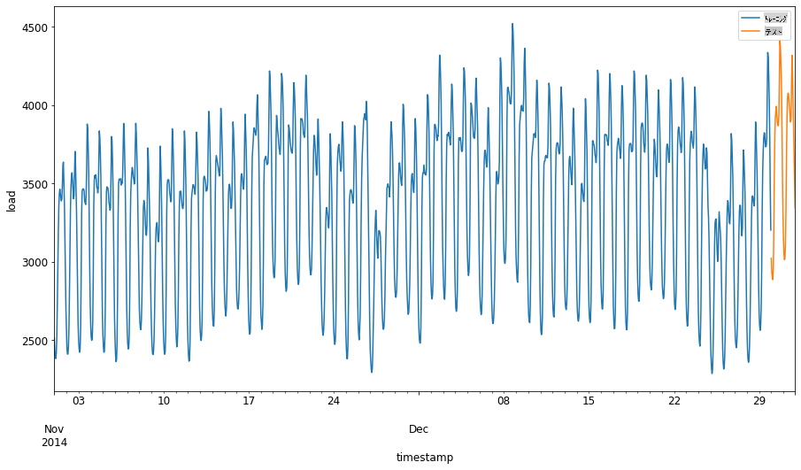
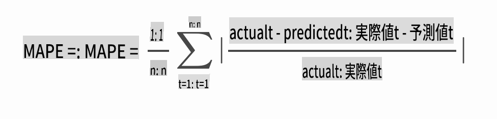

# ARIMAを使った時系列予測

前のレッスンでは、時系列予測について少し学び、ある期間における電力負荷の変動を示すデータセットを読み込みました。

[](https://youtu.be/IUSk-YDau10 "ARIMAの紹介")

> 🎥 上の画像をクリックしてビデオを見る: ARIMAモデルの簡単な紹介。例はRで行われていますが、概念は普遍的です。

## [講義前クイズ](https://gray-sand-07a10f403.1.azurestaticapps.net/quiz/43/)

## はじめに

このレッスンでは、[ARIMA: *A*uto*R*egressive *I*ntegrated *M*oving *A*verage](https://wikipedia.org/wiki/Autoregressive_integrated_moving_average)を使ってモデルを構築する具体的な方法を学びます。ARIMAモデルは、[非定常性](https://wikipedia.org/wiki/Stationary_process)を示すデータに特に適しています。

## 一般的な概念

ARIMAを使うためには、いくつか知っておくべき概念があります：

- 🎓 **定常性**。統計的な文脈では、定常性とは、時間をシフトしても分布が変わらないデータを指します。非定常データは、分析のために変換が必要な傾向による変動を示します。例えば、季節性はデータに変動をもたらし、「季節差分」というプロセスで除去できます。

- 🎓 **[差分](https://wikipedia.org/wiki/Autoregressive_integrated_moving_average#Differencing)**。統計的な文脈でデータを差分化するとは、非定常データを定常化するためにその非一定の傾向を取り除くプロセスを指します。「差分は時系列のレベルの変化を取り除き、傾向と季節性を排除し、結果として時系列の平均を安定させます。」[Shixiongらの論文](https://arxiv.org/abs/1904.07632)

## 時系列におけるARIMA

ARIMAの各部分を解説し、時系列をどのようにモデル化し、予測に役立てるかを理解しましょう。

- **AR - 自己回帰**。自己回帰モデルは、その名前が示すように、過去のデータを分析して仮定を立てます。これらの過去の値は「ラグ」と呼ばれます。例えば、月ごとの鉛筆の販売データがあるとします。各月の販売総数はデータセットの「進化変数」とみなされます。このモデルは「興味のある進化変数がそのラグ（すなわち、前の値）に回帰される」として構築されます。[wikipedia](https://wikipedia.org/wiki/Autoregressive_integrated_moving_average)

- **I - 統合**。類似の'ARMA'モデルとは異なり、ARIMAの'I'はその*[統合](https://wikipedia.org/wiki/Order_of_integration)*側面を指します。データは非定常性を排除するために差分ステップが適用されると「統合」されます。

- **MA - 移動平均**。このモデルの[移動平均](https://wikipedia.org/wiki/Moving-average_model)側面は、現在および過去のラグの値を観察することによって決定される出力変数を指します。

結論: ARIMAは、時系列データの特殊な形式にできるだけ近づけるためにモデルを作成するために使用されます。

## 演習 - ARIMAモデルの構築

このレッスンの[_/working_](https://github.com/microsoft/ML-For-Beginners/tree/main/7-TimeSeries/2-ARIMA/working)フォルダーを開き、[_notebook.ipynb_](https://github.com/microsoft/ML-For-Beginners/blob/main/7-TimeSeries/2-ARIMA/working/notebook.ipynb)ファイルを見つけてください。

1. ノートブックを実行して`statsmodels` Pythonライブラリを読み込みます。これはARIMAモデルに必要です。

1. 必要なライブラリを読み込む

1. データをプロットするために便利なライブラリをいくつか読み込みます：

    ```python
    import os
    import warnings
    import matplotlib.pyplot as plt
    import numpy as np
    import pandas as pd
    import datetime as dt
    import math

    from pandas.plotting import autocorrelation_plot
    from statsmodels.tsa.statespace.sarimax import SARIMAX
    from sklearn.preprocessing import MinMaxScaler
    from common.utils import load_data, mape
    from IPython.display import Image

    %matplotlib inline
    pd.options.display.float_format = '{:,.2f}'.format
    np.set_printoptions(precision=2)
    warnings.filterwarnings("ignore") # specify to ignore warning messages
    ```

1. `/data/energy.csv`ファイルからデータをPandasデータフレームに読み込み、確認します：

    ```python
    energy = load_data('./data')[['load']]
    energy.head(10)
    ```

1. 2012年1月から2014年12月までの全てのエネルギーデータをプロットします。前のレッスンで見たデータなので驚くことはないでしょう：

    ```python
    energy.plot(y='load', subplots=True, figsize=(15, 8), fontsize=12)
    plt.xlabel('timestamp', fontsize=12)
    plt.ylabel('load', fontsize=12)
    plt.show()
    ```

    では、モデルを構築しましょう！

### トレーニングとテストデータセットの作成

データが読み込まれたので、トレーニングセットとテストセットに分けます。トレーニングセットでモデルをトレーニングします。通常、モデルのトレーニングが終了したら、テストセットを使用してその精度を評価します。モデルが将来の時間帯から情報を得ないようにするために、テストセットがトレーニングセットよりも後の期間をカバーしていることを確認する必要があります。

1. 2014年9月1日から10月31日までの2か月間をトレーニングセットに割り当てます。テストセットには2014年11月1日から12月31日までの2か月間が含まれます：

    ```python
    train_start_dt = '2014-11-01 00:00:00'
    test_start_dt = '2014-12-30 00:00:00'
    ```

    このデータは日々のエネルギー消費を反映しているため、強い季節的パターンがありますが、消費は最近の日々の消費に最も似ています。

1. 差異を視覚化します：

    ```python
    energy[(energy.index < test_start_dt) & (energy.index >= train_start_dt)][['load']].rename(columns={'load':'train'}) \
        .join(energy[test_start_dt:][['load']].rename(columns={'load':'test'}), how='outer') \
        .plot(y=['train', 'test'], figsize=(15, 8), fontsize=12)
    plt.xlabel('timestamp', fontsize=12)
    plt.ylabel('load', fontsize=12)
    plt.show()
    ```

    

    したがって、データのトレーニングには比較的小さな時間枠を使用することが適切です。

    > 注: ARIMAモデルをフィットさせるために使用する関数はフィッティング中にインサンプル検証を行うため、検証データは省略します。

### トレーニングのためのデータ準備

次に、データをフィルタリングおよびスケーリングしてトレーニングの準備をします。必要な期間と列のみを含むようにデータセットをフィルタリングし、データが0から1の範囲に投影されるようにスケーリングします。

1. 元のデータセットをフィルタリングし、前述の期間ごとのセットと、必要な列「load」と日付のみを含むようにします：

    ```python
    train = energy.copy()[(energy.index >= train_start_dt) & (energy.index < test_start_dt)][['load']]
    test = energy.copy()[energy.index >= test_start_dt][['load']]

    print('Training data shape: ', train.shape)
    print('Test data shape: ', test.shape)
    ```

    データの形状を確認できます：

    ```output
    Training data shape:  (1416, 1)
    Test data shape:  (48, 1)
    ```

1. データを(0, 1)の範囲にスケーリングします。

    ```python
    scaler = MinMaxScaler()
    train['load'] = scaler.fit_transform(train)
    train.head(10)
    ```

1. 元のデータとスケーリングされたデータを視覚化します：

    ```python
    energy[(energy.index >= train_start_dt) & (energy.index < test_start_dt)][['load']].rename(columns={'load':'original load'}).plot.hist(bins=100, fontsize=12)
    train.rename(columns={'load':'scaled load'}).plot.hist(bins=100, fontsize=12)
    plt.show()
    ```

    

    > 元のデータ

    

    > スケーリングされたデータ

1. スケーリングされたデータをキャリブレーションしたので、テストデータをスケーリングします：

    ```python
    test['load'] = scaler.transform(test)
    test.head()
    ```

### ARIMAの実装

いよいよARIMAの実装です！先ほどインストールした`statsmodels`ライブラリを使用します。

次にいくつかのステップを実行する必要があります

   1. `SARIMAX()` and passing in the model parameters: p, d, and q parameters, and P, D, and Q parameters.
   2. Prepare the model for the training data by calling the fit() function.
   3. Make predictions calling the `forecast()` function and specifying the number of steps (the `horizon`) to forecast.

> 🎓 What are all these parameters for? In an ARIMA model there are 3 parameters that are used to help model the major aspects of a time series: seasonality, trend, and noise. These parameters are:

`p`: the parameter associated with the auto-regressive aspect of the model, which incorporates *past* values.
`d`: the parameter associated with the integrated part of the model, which affects the amount of *differencing* (🎓 remember differencing 👆?) to apply to a time series.
`q`: the parameter associated with the moving-average part of the model.

> Note: If your data has a seasonal aspect - which this one does - , we use a seasonal ARIMA model (SARIMA). In that case you need to use another set of parameters: `P`, `D`, and `Q` which describe the same associations as `p`, `d`, and `q`を呼び出してモデルを定義しますが、これはモデルの季節成分に対応します。

1. 好みのホライズン値を設定します。3時間を試してみましょう：

    ```python
    # Specify the number of steps to forecast ahead
    HORIZON = 3
    print('Forecasting horizon:', HORIZON, 'hours')
    ```

    ARIMAモデルのパラメータの最適な値を選択するのは難しい場合があります。これは主観的であり、時間がかかるためです。`auto_arima()` function from the [`pyramid`ライブラリ](https://alkaline-ml.com/pmdarima/0.9.0/modules/generated/pyramid.arima.auto_arima.html)を使用することを検討するかもしれません。

1. まずは手動でいくつかの選択を試して、良いモデルを見つけます。

    ```python
    order = (4, 1, 0)
    seasonal_order = (1, 1, 0, 24)

    model = SARIMAX(endog=train, order=order, seasonal_order=seasonal_order)
    results = model.fit()

    print(results.summary())
    ```

    結果の表が表示されます。

最初のモデルを構築しました！次に、これを評価する方法を見つける必要があります。

### モデルの評価

モデルを評価するために、いわゆる`ウォークフォワード`検証を実行できます。実際には、新しいデータが利用可能になるたびに時系列モデルは再トレーニングされます。これにより、モデルは各時点で最適な予測を行うことができます。

この技術を使用して時系列の最初から始め、トレーニングデータセットでモデルをトレーニングします。その後、次の時点で予測を行います。予測は既知の値と比較されます。トレーニングセットは既知の値を含むように拡張され、このプロセスが繰り返されます。

> 注: トレーニングセットウィンドウを固定して効率的なトレーニングを行うために、新しい観測値をトレーニングセットに追加するたびに、セットの最初から観測値を削除します。

このプロセスは、モデルが実際にどのように動作するかのより堅牢な推定を提供します。ただし、多くのモデルを作成する計算コストがかかります。データが小さい場合やモデルがシンプルな場合は許容範囲ですが、スケールが大きい場合は問題になる可能性があります。

ウォークフォワード検証は時系列モデルの評価のゴールドスタンダードであり、独自のプロジェクトに推奨されます。

1. まず、各ホライズンステップのテストデータポイントを作成します。

    ```python
    test_shifted = test.copy()

    for t in range(1, HORIZON+1):
        test_shifted['load+'+str(t)] = test_shifted['load'].shift(-t, freq='H')

    test_shifted = test_shifted.dropna(how='any')
    test_shifted.head(5)
    ```

    |            |          | load | load+1 | load+2 |
    | ---------- | -------- | ---- | ------ | ------ |
    | 2014-12-30 | 00:00:00 | 0.33 | 0.29   | 0.27   |
    | 2014-12-30 | 01:00:00 | 0.29 | 0.27   | 0.27   |
    | 2014-12-30 | 02:00:00 | 0.27 | 0.27   | 0.30   |
    | 2014-12-30 | 03:00:00 | 0.27 | 0.30   | 0.41   |
    | 2014-12-30 | 04:00:00 | 0.30 | 0.41   | 0.57   |

    データはホライズンポイントに従って水平方向にシフトされます。

1. このスライディングウィンドウアプローチを使用して、テストデータで予測を行い、テストデータの長さのループで実行します：

    ```python
    %%time
    training_window = 720 # dedicate 30 days (720 hours) for training

    train_ts = train['load']
    test_ts = test_shifted

    history = [x for x in train_ts]
    history = history[(-training_window):]

    predictions = list()

    order = (2, 1, 0)
    seasonal_order = (1, 1, 0, 24)

    for t in range(test_ts.shape[0]):
        model = SARIMAX(endog=history, order=order, seasonal_order=seasonal_order)
        model_fit = model.fit()
        yhat = model_fit.forecast(steps = HORIZON)
        predictions.append(yhat)
        obs = list(test_ts.iloc[t])
        # move the training window
        history.append(obs[0])
        history.pop(0)
        print(test_ts.index[t])
        print(t+1, ': predicted =', yhat, 'expected =', obs)
    ```

    トレーニングが行われるのを観察できます：

    ```output
    2014-12-30 00:00:00
    1 : predicted = [0.32 0.29 0.28] expected = [0.32945389435989236, 0.2900626678603402, 0.2739480752014323]

    2014-12-30 01:00:00
    2 : predicted = [0.3  0.29 0.3 ] expected = [0.2900626678603402, 0.2739480752014323, 0.26812891674127126]

    2014-12-30 02:00:00
    3 : predicted = [0.27 0.28 0.32] expected = [0.2739480752014323, 0.26812891674127126, 0.3025962399283795]
    ```

1. 予測と実際の負荷を比較します：

    ```python
    eval_df = pd.DataFrame(predictions, columns=['t+'+str(t) for t in range(1, HORIZON+1)])
    eval_df['timestamp'] = test.index[0:len(test.index)-HORIZON+1]
    eval_df = pd.melt(eval_df, id_vars='timestamp', value_name='prediction', var_name='h')
    eval_df['actual'] = np.array(np.transpose(test_ts)).ravel()
    eval_df[['prediction', 'actual']] = scaler.inverse_transform(eval_df[['prediction', 'actual']])
    eval_df.head()
    ```

    出力
    |     |            | timestamp | h   | prediction | actual   |
    | --- | ---------- | --------- | --- | ---------- | -------- |
    | 0   | 2014-12-30 | 00:00:00  | t+1 | 3,008.74   | 3,023.00 |
    | 1   | 2014-12-30 | 01:00:00  | t+1 | 2,955.53   | 2,935.00 |
    | 2   | 2014-12-30 | 02:00:00  | t+1 | 2,900.17   | 2,899.00 |
    | 3   | 2014-12-30 | 03:00:00  | t+1 | 2,917.69   | 2,886.00 |
    | 4   | 2014-12-30 | 04:00:00  | t+1 | 2,946.99   | 2,963.00 |


    時間ごとのデータの予測を観察し、実際の負荷と比較します。どれくらい正確ですか？

### モデルの精度を確認する

全ての予測に対して平均絶対誤差率（MAPE）をテストしてモデルの精度を確認します。

> **🧮 数学を見せて**
>
> 
>
>  [MAPE](https://www.linkedin.com/pulse/what-mape-mad-msd-time-series-allameh-statistics/)は、上記の式で定義される比率として予測精度を示すために使用されます。実際値<sub>t</sub>と予測値<sub>t</sub>の差を実際値<sub>t</sub>で割ります。「この計算の絶対値は、予測されたすべての時点で合計され、フィットされたポイントの数nで割られます。」[wikipedia](https://wikipedia.org/wiki/Mean_absolute_percentage_error)

1. 式をコードで表現します：

    ```python
    if(HORIZON > 1):
        eval_df['APE'] = (eval_df['prediction'] - eval_df['actual']).abs() / eval_df['actual']
        print(eval_df.groupby('h')['APE'].mean())
    ```

1. 1ステップのMAPEを計算します：

    ```python
    print('One step forecast MAPE: ', (mape(eval_df[eval_df['h'] == 't+1']['prediction'], eval_df[eval_df['h'] == 't+1']['actual']))*100, '%')
    ```

    1ステップ予測MAPE:  0.5570581332313952 %

1. 複数ステップ予測のMAPEを表示します：

    ```python
    print('Multi-step forecast MAPE: ', mape(eval_df['prediction'], eval_df['actual'])*100, '%')
    ```

    ```output
    Multi-step forecast MAPE:  1.1460048657704118 %
    ```

    低い数値が良い: 予測のMAPEが10であれば、10%の誤差があることを意味します。

1. しかし、いつものように、このような精度の測定を視覚的に見る方が簡単ですので、プロットしてみましょう：

    ```python
     if(HORIZON == 1):
        ## Plotting single step forecast
        eval_df.plot(x='timestamp', y=['actual', 'prediction'], style=['r', 'b'], figsize=(15, 8))

    else:
        ## Plotting multi step forecast
        plot_df = eval_df[(eval_df.h=='t+1')][['timestamp', 'actual']]
        for t in range(1, HORIZON+1):
            plot_df['t+'+str(t)] = eval_df[(eval_df.h=='t+'+str(t))]['prediction'].values

        fig = plt.figure(figsize=(15, 8))
        ax = plt.plot(plot_df['timestamp'], plot_df['actual'], color='red', linewidth=4.0)
        ax = fig.add_subplot(111)
        for t in range(1, HORIZON+1):
            x = plot_df['timestamp'][(t-1):]
            y = plot_df['t+'+str(t)][0:len(x)]
            ax.plot(x, y, color='blue', linewidth=4*math.pow(.9,t), alpha=math.pow(0.8,t))

        ax.legend(loc='best')

    plt.xlabel('timestamp', fontsize=12)
    plt.ylabel('load', fontsize=12)
    plt.show()
    ```

    

🏆 非常に良いプロットで、良い精度のモデルを示しています。よくできました！

---

## 🚀チャレンジ

時系列モデルの精度をテストする方法を掘り下げてみましょう。このレッスンではMAPEに触れましたが、他に使用できる方法はありますか？それらを調査して注釈を付けてください。役立つドキュメントは[こちら](https://otexts.com/fpp2/accuracy.html)にあります。

## [講義後クイズ](https://gray-sand-07a10f403.1.azurestaticapps.net/quiz/44/)

## レビューと自習

このレッスンでは、ARIMAを使った時系列予測の基本に触れました。時間をかけて[このリポジトリ](https://microsoft.github.io/forecasting/)とそのさまざまなモデルタイプを掘り下げ、他の時系列モデルの構築方法を学んでください。

## 課題

[新しいARIMAモデル](assignment.md)

**免責事項**:
この文書は機械ベースのAI翻訳サービスを使用して翻訳されています。正確さを期すために努めていますが、自動翻訳には誤りや不正確さが含まれる場合があります。原文の言語で記載された元の文書を権威ある情報源と見なしてください。重要な情報については、専門の人間による翻訳をお勧めします。この翻訳の使用に起因する誤解や誤解釈について、当社は一切の責任を負いません。