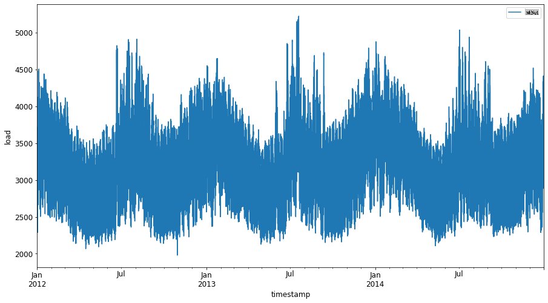
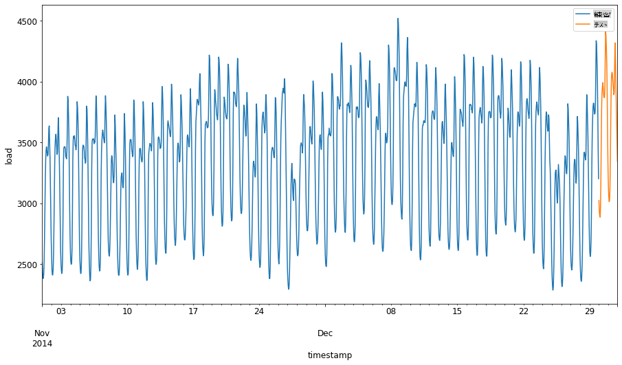
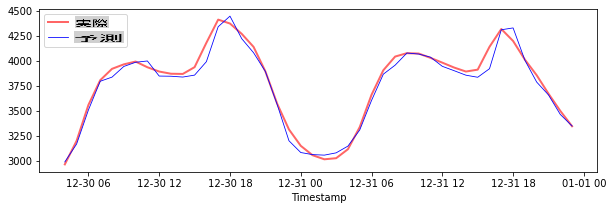
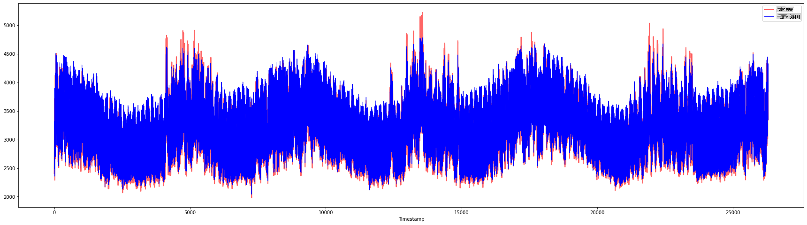

# サポートベクター回帰を用いた時系列予測

前回のレッスンでは、ARIMAモデルを使用して時系列予測を行う方法を学びました。今回は、連続データを予測するために使用される回帰モデルであるサポートベクター回帰モデルについて見ていきます。

## [事前クイズ](https://gray-sand-07a10f403.1.azurestaticapps.net/quiz/51/) 

## はじめに

このレッスンでは、回帰のための[**SVM**: **S**upport **V**ector **M**achine](https://en.wikipedia.org/wiki/Support-vector_machine)、つまり**SVR: サポートベクター回帰**を用いてモデルを構築する具体的な方法を学びます。

### 時系列におけるSVRの役割 [^1]

時系列予測におけるSVRの重要性を理解する前に、知っておくべき重要な概念をいくつか紹介します：

- **回帰:** 与えられた入力セットから連続値を予測するための教師あり学習技術です。アイデアは、特徴空間内の最大数のデータポイントを持つ曲線（または直線）にフィットさせることです。詳細は[こちら](https://en.wikipedia.org/wiki/Regression_analysis)をクリックしてください。
- **サポートベクターマシン (SVM):** 分類、回帰、および外れ値検出のために使用される教師あり機械学習モデルの一種です。モデルは特徴空間内の超平面であり、分類の場合は境界として機能し、回帰の場合は最適なフィットラインとして機能します。SVMでは、カーネル関数を使用してデータセットをより高次元の空間に変換し、容易に分離可能にすることが一般的です。SVMの詳細は[こちら](https://en.wikipedia.org/wiki/Support-vector_machine)をクリックしてください。
- **サポートベクター回帰 (SVR):** SVMの一種で、最大数のデータポイントを持つ最適なフィットライン（SVMの場合は超平面）を見つけるためのものです。

### なぜSVRを使うのか？ [^1]

前回のレッスンでは、時系列データを予測するための非常に成功した統計的線形方法であるARIMAについて学びました。しかし、多くの場合、時系列データには線形モデルではマッピングできない*非線形性*が含まれています。このような場合、回帰タスクにおいてデータの非線形性を考慮できるSVMの能力が、時系列予測においてSVRを成功させる理由となります。

## 演習 - SVRモデルの構築

データ準備の最初のステップは、前回の[ARIMA](https://github.com/microsoft/ML-For-Beginners/tree/main/7-TimeSeries/2-ARIMA)のレッスンと同じです。

このレッスンの[_/working_](https://github.com/microsoft/ML-For-Beginners/tree/main/7-TimeSeries/3-SVR/working)フォルダーを開き、[_notebook.ipynb_](https://github.com/microsoft/ML-For-Beginners/blob/main/7-TimeSeries/3-SVR/working/notebook.ipynb)ファイルを見つけてください。[^2]

1. ノートブックを実行し、必要なライブラリをインポートします:  [^2]

   ```python
   import sys
   sys.path.append('../../')
   ```

   ```python
   import os
   import warnings
   import matplotlib.pyplot as plt
   import numpy as np
   import pandas as pd
   import datetime as dt
   import math
   
   from sklearn.svm import SVR
   from sklearn.preprocessing import MinMaxScaler
   from common.utils import load_data, mape
   ```

2. `/data/energy.csv`ファイルからデータをPandasデータフレームに読み込み、確認します:  [^2]

   ```python
   energy = load_data('../../data')[['load']]
   ```

3. 2012年1月から2014年12月までの利用可能なすべてのエネルギーデータをプロットします: [^2]

   ```python
   energy.plot(y='load', subplots=True, figsize=(15, 8), fontsize=12)
   plt.xlabel('timestamp', fontsize=12)
   plt.ylabel('load', fontsize=12)
   plt.show()
   ```

   

   それでは、SVRモデルを構築しましょう。

### トレーニングデータとテストデータの作成

データが読み込まれたので、トレーニングセットとテストセットに分割します。その後、SVRに必要なタイムステップベースのデータセットを作成するためにデータを再形成します。モデルはトレーニングセットでトレーニングされます。トレーニングが終了した後、トレーニングセット、テストセット、そして全データセットでその精度を評価し、全体的なパフォーマンスを確認します。テストセットがトレーニングセットより後の期間をカバーするようにして、モデルが将来の時間から情報を得ないようにする必要があります[^2]（これは*過剰適合*と呼ばれる状況です）。

1. トレーニングセットには2014年9月1日から10月31日までの2ヶ月間を割り当てます。テストセットには2014年11月1日から12月31日までの2ヶ月間が含まれます: [^2]

   ```python
   train_start_dt = '2014-11-01 00:00:00'
   test_start_dt = '2014-12-30 00:00:00'
   ```

2. 違いを視覚化します: [^2]

   ```python
   energy[(energy.index < test_start_dt) & (energy.index >= train_start_dt)][['load']].rename(columns={'load':'train'}) \
       .join(energy[test_start_dt:][['load']].rename(columns={'load':'test'}), how='outer') \
       .plot(y=['train', 'test'], figsize=(15, 8), fontsize=12)
   plt.xlabel('timestamp', fontsize=12)
   plt.ylabel('load', fontsize=12)
   plt.show()
   ```

   

### トレーニング用データの準備

次に、データをフィルタリングおよびスケーリングしてトレーニング用に準備する必要があります。必要な期間と列のみを含むようにデータセットをフィルタリングし、データが0から1の範囲に投影されるようにスケーリングします。

1. 元のデータセットをフィルタリングして、前述の期間ごとのセットと、必要な列「load」と日付のみを含むようにします: [^2]

   ```python
   train = energy.copy()[(energy.index >= train_start_dt) & (energy.index < test_start_dt)][['load']]
   test = energy.copy()[energy.index >= test_start_dt][['load']]
   
   print('Training data shape: ', train.shape)
   print('Test data shape: ', test.shape)
   ```

   ```output
   Training data shape:  (1416, 1)
   Test data shape:  (48, 1)
   ```
   
2. トレーニングデータを(0, 1)の範囲にスケーリングします: [^2]

   ```python
   scaler = MinMaxScaler()
   train['load'] = scaler.fit_transform(train)
   ```
   
4. 次に、テストデータをスケーリングします: [^2]

   ```python
   test['load'] = scaler.transform(test)
   ```

### タイムステップを持つデータの作成 [^1]

SVRのために、入力データを`[batch, timesteps]`. So, you reshape the existing `train_data` and `test_data`の形式に変換します。新しい次元がタイムステップを参照するようになります。

```python
# Converting to numpy arrays
train_data = train.values
test_data = test.values
```

この例では、`timesteps = 5`とします。つまり、モデルへの入力は最初の4つのタイムステップのデータであり、出力は5番目のタイムステップのデータとなります。

```python
timesteps=5
```

ネストされたリスト内包表記を使用してトレーニングデータを2Dテンソルに変換します:

```python
train_data_timesteps=np.array([[j for j in train_data[i:i+timesteps]] for i in range(0,len(train_data)-timesteps+1)])[:,:,0]
train_data_timesteps.shape
```

```output
(1412, 5)
```

テストデータを2Dテンソルに変換します:

```python
test_data_timesteps=np.array([[j for j in test_data[i:i+timesteps]] for i in range(0,len(test_data)-timesteps+1)])[:,:,0]
test_data_timesteps.shape
```

```output
(44, 5)
```

トレーニングデータとテストデータから入力と出力を選択します:

```python
x_train, y_train = train_data_timesteps[:,:timesteps-1],train_data_timesteps[:,[timesteps-1]]
x_test, y_test = test_data_timesteps[:,:timesteps-1],test_data_timesteps[:,[timesteps-1]]

print(x_train.shape, y_train.shape)
print(x_test.shape, y_test.shape)
```

```output
(1412, 4) (1412, 1)
(44, 4) (44, 1)
```

### SVRの実装 [^1]

それでは、SVRを実装する時が来ました。この実装について詳しく知りたい場合は、[このドキュメント](https://scikit-learn.org/stable/modules/generated/sklearn.svm.SVR.html)を参照してください。私たちの実装では、以下のステップに従います：

  1. `SVR()`を呼び出してモデルを定義し、`fit()` and passing in the model hyperparameters: kernel, gamma, c and epsilon
  2. Prepare the model for the training data by calling the `predict()`関数を使用します。

次に、SVRモデルを作成します。ここでは[RBFカーネル](https://scikit-learn.org/stable/modules/svm.html#parameters-of-the-rbf-kernel)を使用し、ハイパーパラメータgamma、C、およびepsilonをそれぞれ0.5、10、および0.05に設定します。

```python
model = SVR(kernel='rbf',gamma=0.5, C=10, epsilon = 0.05)
```

#### トレーニングデータにモデルを適合させる [^1]

```python
model.fit(x_train, y_train[:,0])
```

```output
SVR(C=10, cache_size=200, coef0=0.0, degree=3, epsilon=0.05, gamma=0.5,
    kernel='rbf', max_iter=-1, shrinking=True, tol=0.001, verbose=False)
```

#### モデル予測を行う [^1]

```python
y_train_pred = model.predict(x_train).reshape(-1,1)
y_test_pred = model.predict(x_test).reshape(-1,1)

print(y_train_pred.shape, y_test_pred.shape)
```

```output
(1412, 1) (44, 1)
```

SVRを構築しました！次に、それを評価する必要があります。

### モデルの評価 [^1]

評価のために、まずデータを元のスケールに戻します。次に、パフォーマンスを確認するために、元の時系列プロットと予測された時系列プロットをプロットし、MAPE結果も出力します。

予測された出力と元の出力をスケールバックします:

```python
# Scaling the predictions
y_train_pred = scaler.inverse_transform(y_train_pred)
y_test_pred = scaler.inverse_transform(y_test_pred)

print(len(y_train_pred), len(y_test_pred))
```

```python
# Scaling the original values
y_train = scaler.inverse_transform(y_train)
y_test = scaler.inverse_transform(y_test)

print(len(y_train), len(y_test))
```

#### トレーニングデータとテストデータでモデルのパフォーマンスを確認する [^1]

データセットからタイムスタンプを抽出し、プロットのx軸に表示します。最初の```timesteps-1```値を最初の出力の入力として使用しているため、出力のタイムスタンプはその後に開始します。

```python
train_timestamps = energy[(energy.index < test_start_dt) & (energy.index >= train_start_dt)].index[timesteps-1:]
test_timestamps = energy[test_start_dt:].index[timesteps-1:]

print(len(train_timestamps), len(test_timestamps))
```

```output
1412 44
```

トレーニングデータの予測をプロットします:

```python
plt.figure(figsize=(25,6))
plt.plot(train_timestamps, y_train, color = 'red', linewidth=2.0, alpha = 0.6)
plt.plot(train_timestamps, y_train_pred, color = 'blue', linewidth=0.8)
plt.legend(['Actual','Predicted'])
plt.xlabel('Timestamp')
plt.title("Training data prediction")
plt.show()
```


トレーニングデータのMAPEを出力します

```python
print('MAPE for training data: ', mape(y_train_pred, y_train)*100, '%')
```

```output
MAPE for training data: 1.7195710200875551 %
```

テストデータの予測をプロットします

```python
plt.figure(figsize=(10,3))
plt.plot(test_timestamps, y_test, color = 'red', linewidth=2.0, alpha = 0.6)
plt.plot(test_timestamps, y_test_pred, color = 'blue', linewidth=0.8)
plt.legend(['Actual','Predicted'])
plt.xlabel('Timestamp')
plt.show()
```



テストデータのMAPEを出力します

```python
print('MAPE for testing data: ', mape(y_test_pred, y_test)*100, '%')
```

```output
MAPE for testing data:  1.2623790187854018 %
```

🏆 テストデータセットで非常に良い結果を得ました！

### 全データセットでモデルのパフォーマンスを確認する [^1]

```python
# Extracting load values as numpy array
data = energy.copy().values

# Scaling
data = scaler.transform(data)

# Transforming to 2D tensor as per model input requirement
data_timesteps=np.array([[j for j in data[i:i+timesteps]] for i in range(0,len(data)-timesteps+1)])[:,:,0]
print("Tensor shape: ", data_timesteps.shape)

# Selecting inputs and outputs from data
X, Y = data_timesteps[:,:timesteps-1],data_timesteps[:,[timesteps-1]]
print("X shape: ", X.shape,"\nY shape: ", Y.shape)
```

```output
Tensor shape:  (26300, 5)
X shape:  (26300, 4) 
Y shape:  (26300, 1)
```

```python
# Make model predictions
Y_pred = model.predict(X).reshape(-1,1)

# Inverse scale and reshape
Y_pred = scaler.inverse_transform(Y_pred)
Y = scaler.inverse_transform(Y)
```

```python
plt.figure(figsize=(30,8))
plt.plot(Y, color = 'red', linewidth=2.0, alpha = 0.6)
plt.plot(Y_pred, color = 'blue', linewidth=0.8)
plt.legend(['Actual','Predicted'])
plt.xlabel('Timestamp')
plt.show()
```



```python
print('MAPE: ', mape(Y_pred, Y)*100, '%')
```

```output
MAPE:  2.0572089029888656 %
```

🏆 素晴らしいプロットで、精度の高いモデルを示しています。よくできました！

---

## 🚀チャレンジ

- モデルを作成する際にハイパーパラメータ（gamma、C、epsilon）を調整して、テストデータでの最適な結果を得るセットを評価してみてください。これらのハイパーパラメータについて詳しく知りたい場合は、[こちらのドキュメント](https://scikit-learn.org/stable/modules/svm.html#parameters-of-the-rbf-kernel)を参照してください。
- モデルに対して異なるカーネル関数を使用し、データセットでのパフォーマンスを分析してみてください。役立つドキュメントは[こちら](https://scikit-learn.org/stable/modules/svm.html#kernel-functions)にあります。
- モデルが予測を行うために振り返る`timesteps`の値を異なるものにしてみてください。

## [事後クイズ](https://gray-sand-07a10f403.1.azurestaticapps.net/quiz/52/)

## レビューと自己学習

このレッスンでは、時系列予測のためのSVRの応用を紹介しました。SVRについてさらに詳しく知りたい場合は、[このブログ](https://www.analyticsvidhya.com/blog/2020/03/support-vector-regression-tutorial-for-machine-learning/)を参照してください。この[scikit-learnのドキュメント](https://scikit-learn.org/stable/modules/svm.html)では、SVM全般、[SVR](https://scikit-learn.org/stable/modules/svm.html#regression)、および異なる[カーネル関数](https://scikit-learn.org/stable/modules/svm.html#kernel-functions)の使用方法やそのパラメータなど、他の実装の詳細についても包括的な説明が提供されています。

## 課題

[新しいSVRモデル](assignment.md)


## クレジット


[^1]: このセクションのテキスト、コード、および出力は[AnirbanMukherjeeXD](https://github.com/AnirbanMukherjeeXD)によって提供されました。
[^2]: このセクションのテキスト、コード、および出力は[ARIMA](https://github.com/microsoft/ML-For-Beginners/tree/main/7-TimeSeries/2-ARIMA)から引用されました。

**免責事項**:
この文書は、機械ベースのAI翻訳サービスを使用して翻訳されています。正確さを期していますが、自動翻訳には誤りや不正確さが含まれる可能性があることをご了承ください。元の言語で書かれた原文が権威ある情報源と見なされるべきです。重要な情報については、専門の人間による翻訳をお勧めします。この翻訳の使用に起因する誤解や誤認については、一切の責任を負いかねます。