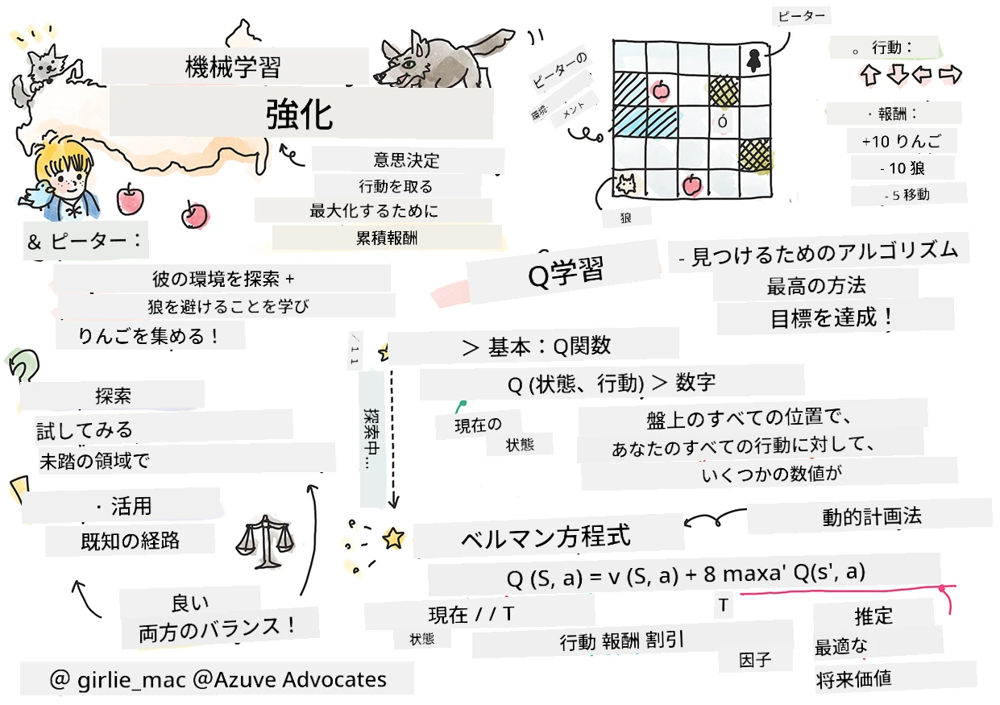
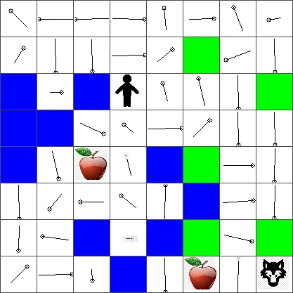

# 強化学習とQ学習の紹介


> [Tomomi Imura](https://www.twitter.com/girlie_mac)によるスケッチノート

強化学習は、エージェント、いくつかの状態、および各状態ごとの行動のセットという3つの重要な概念を含みます。特定の状態で行動を実行すると、エージェントに報酬が与えられます。再びコンピューターゲームのスーパーマリオを想像してください。あなたはマリオで、ゲームのレベルにいて、崖の端に立っています。あなたの上にはコインがあります。マリオであり、ゲームのレベルの特定の位置にいる…それがあなたの状態です。右に一歩動く（行動すると）と崖から落ちてしまい、数値的に低いスコアが与えられます。しかし、ジャンプボタンを押すとポイントを獲得し、生き続けることができます。それは良い結果であり、正の数値スコアを与えられるべきです。

強化学習とシミュレーター（ゲーム）を使うことで、生き残り、できるだけ多くのポイントを獲得することを最大化するためのゲームのプレイ方法を学習できます。

[](https://www.youtube.com/watch?v=lDq_en8RNOo)

> 🎥 上の画像をクリックして、Dmitryの強化学習についての解説を聞いてください

## [事前講義クイズ](https://ff-quizzes.netlify.app/en/ml/)

## 前提条件とセットアップ

このレッスンでは、Pythonでいくつかのコードを実験します。あなたのコンピューターかクラウドのどこかで、このレッスンのJupyter Notebookコードを実行できる必要があります。

[レッスンのノートブック](https://github.com/microsoft/ML-For-Beginners/blob/main/8-Reinforcement/1-QLearning/notebook.ipynb)を開いて、このレッスンを進めてください。

> **注意：** クラウドからこのコードを開く場合、ノートブックコードで使用されている[`rlboard.py`](https://github.com/microsoft/ML-For-Beginners/blob/main/8-Reinforcement/1-QLearning/rlboard.py)ファイルも取得する必要があります。ノートブックと同じディレクトリに追加してください。

## イントロダクション

このレッスンでは、ロシアの作曲家[セルゲイ・プロコフィエフ](https://en.wikipedia.org/wiki/Sergei_Prokofiev)による音楽童話に触発された<strong>[ピーターと狼](https://en.wikipedia.org/wiki/Peter_and_the_Wolf)</strong>の世界を探検します。<strong>強化学習</strong>を用いて、ピーターが環境を探検し、美味しいリンゴを集め、狼に会わないようにします。

<strong>強化学習</strong>（RL）は、多くの実験を行うことで、ある<strong>環境</strong>における<strong>エージェント</strong>の最適な行動を学習する手法です。この環境のエージェントには、<strong>報酬関数</strong>によって定義される目標があります。

## 環境

単純化のために、ピーターの世界を `幅` x `高さ` の正方形の盤として考えましょう。このような感じです：


この盤上の各セルは以下のいずれかです：

* <strong>地面</strong>、ピーターや他の生き物が歩ける場所。
* <strong>水</strong>、もちろん歩けない場所。
* <strong>木</strong>や<strong>草</strong>、休憩できる場所。
* <strong>リンゴ</strong>、ピーターが自分を養うために見つけたいもの。
* <strong>狼</strong>、危険で避けるべきもの。

この環境で作業するコードは別のPythonモジュール、[`rlboard.py`](https://github.com/microsoft/ML-For-Beginners/blob/main/8-Reinforcement/1-QLearning/rlboard.py)にあります。概念理解には重要ではないため、このモジュールをインポートしてサンプル盤を作成します（コードブロック1）：

```python
from rlboard import *

width, height = 8,8
m = Board(width,height)
m.randomize(seed=13)
m.plot()
```

このコードは上記の環境に似た絵を表示するはずです。

## 行動と方策

この例でのピーターの目標は、狼や障害物を避けながらリンゴを見つけることです。つまり、リンゴを見つけるまで歩き回ることができます。

したがって、どの位置でも次の4つの行動のうちの一つを選べます：上、下、左、右。

これらの行動は辞書として定義し、対応する座標変化のペアにマッピングします。例えば右に移動（`R`）はペア `(1,0)` に対応します。（コードブロック2）

```python
actions = { "U" : (0,-1), "D" : (0,1), "L" : (-1,0), "R" : (1,0) }
action_idx = { a : i for i,a in enumerate(actions.keys()) }
```

要約すると、このシナリオの戦略と目標は以下の通りです：

- <strong>戦略</strong>：エージェント（ピーター）の戦略はいわゆる<strong>方策</strong>によって定義されます。方策は任意の状態での行動を返す関数です。ここで問題の状態は、プレイヤーの現在位置を含んだ盤で表されます。

- <strong>目標</strong>：強化学習の目標は、問題を効率よく解く良い方策を最終的に学習することです。ただし基準として最も単純な方策である<strong>ランダムウォーク</strong>を考えます。

## ランダムウォーク

まずはランダムウォーク戦略を実装して問題を解きましょう。ランダムウォークでは、許可された行動の中から次の行動をランダムに選び、リンゴに到達するまで実行します（コードブロック3）。

1. 以下のコードでランダムウォークを実装してください：

    ```python
    def random_policy(m):
        return random.choice(list(actions))
    
    def walk(m,policy,start_position=None):
        n = 0 # ステップ数
        # 初期位置を設定
        if start_position:
            m.human = start_position 
        else:
            m.random_start()
        while True:
            if m.at() == Board.Cell.apple:
                return n # 成功！
            if m.at() in [Board.Cell.wolf, Board.Cell.water]:
                return -1 # オオカミに食べられたか溺れた
            while True:
                a = actions[policy(m)]
                new_pos = m.move_pos(m.human,a)
                if m.is_valid(new_pos) and m.at(new_pos)!=Board.Cell.water:
                    m.move(a) # 実際の移動を行う
                    break
            n+=1
    
    walk(m,random_policy)
    ```

    `walk` の呼び出しは、実行ごとに異なる場合がある対応パスの長さを返すはずです。

1. ウォーク実験を複数回（例: 100回）実行し、その結果の統計を出力してください（コードブロック4）：

    ```python
    def print_statistics(policy):
        s,w,n = 0,0,0
        for _ in range(100):
            z = walk(m,policy)
            if z<0:
                w+=1
            else:
                s += z
                n += 1
        print(f"Average path length = {s/n}, eaten by wolf: {w} times")
    
    print_statistics(random_policy)
    ```

    パスの平均長さは30〜40歩前後で、最寄りのリンゴまでの平均距離5〜6歩と比較してかなり長いことに注意してください。

    また、ピーターの動きをランダムウォーク中に見ることもできます：

    

## 報酬関数

方策をより賢くするために、どの動きが「より良い」かを理解する必要があります。そのためには目標を定義します。

目標は<strong>報酬関数</strong>で定義され、各状態に対してスコア値を返します。数値が高いほどより良い報酬となります。（コードブロック5）

```python
move_reward = -0.1
goal_reward = 10
end_reward = -10

def reward(m,pos=None):
    pos = pos or m.human
    if not m.is_valid(pos):
        return end_reward
    x = m.at(pos)
    if x==Board.Cell.water or x == Board.Cell.wolf:
        return end_reward
    if x==Board.Cell.apple:
        return goal_reward
    return move_reward
```

報酬関数で興味深いのは、多くの場合、<em>ゲームの最後にしか十分な報酬が与えられない</em>ことです。つまりアルゴリズムは最終的に正の報酬を得る「良い」ステップを覚えて重視し、逆に悪い結果を招く動きを抑制しなければなりません。

## Q学習

ここで議論するアルゴリズムは<strong>Q-Learning</strong>と呼ばれます。このアルゴリズムでは、方策は<strong>Q-Table</strong>と呼ばれる関数（またはデータ構造）で定義されます。これは与えられた状態での各行動の「良さ」を記録します。

Q-Tableはしばしば表や多次元配列として表現されるためその名前が付いています。盤のサイズが `width` x `height` であるため、Q-Tableは形状 `width` x `height` x `len(actions)` のnumpy配列として表せます：（コードブロック6）

```python
Q = np.ones((width,height,len(actions)),dtype=np.float)*1.0/len(actions)
```

Q-Tableのすべての値を等しい値（ここでは0.25）で初期化しています。これは「ランダムウォーク」方策に対応し、各状態でのすべての動きが均等に良いことを意味します。Q-Tableを `plot` 関数に渡して盤上に可視化できます： `m.plot(Q)`。


各セルの中央に「矢印」があり、好ましい移動方向を示します。すべての方向が等しい場合は点が表示されます。

次にシミュレーションを実行し、環境を探検してQ-Tableの値の分布を改善し、リンゴへの経路をより速く見つけられるようにします。

## Q学習の本質：ベルマン方程式

動き始めると、それぞれの行動には即時の報酬があり、理論的には最高の即時報酬に基づいて次の行動を選べます。しかしほとんどの状態では、この動きだけではリンゴに到達できず、どの方向が良いか即座に決められません。

> 大事なのは即時の結果ではなく、シミュレーションの終了時に得られる最終結果であることを覚えておいてください。

遅延した報酬を考慮するために、<strong>[動的計画法](https://en.wikipedia.org/wiki/Dynamic_programming)</strong>の原理を用います。これにより問題を再帰的に考えることができます。

今、状態 *s* にいて、次に状態 *s'* に移動するとします。このとき、報酬関数で定義された即時報酬 *r(s,a)* と将来の報酬を受け取ります。もしQ-Tableが各行動の「魅力度」を正しく反映していると仮定すると、状態 *s'* では最大値の *Q(s',a')* を持つ行動 *a* を選びます。つまり、状態 *s* で得られる可能な最高の将来報酬は `max`<sub>a'</sub>*Q(s',a')* となります（ここで最大は状態 *s'* のすべての可能な行動 *a'* にわたって計算）。

これにより状態 *s*、行動 *a* におけるQ-Tableの値を計算する<strong>ベルマン方程式</strong>が得られます：


ここで γ は<strong>割引率</strong>と呼ばれ、将来の報酬に対して現在の報酬をどの程度重視するかを決定します。

## 学習アルゴリズム

上記の式に基づき、学習アルゴリズムの擬似コードは以下の通りです：

* すべての状態と行動で等しい値でQ-Table Qを初期化する
* 学習率 α ← 1 に設定する
* シミュレーションを多数回繰り返す
   1. ランダムな位置から開始する
   1. 繰り返す
        1. 状態 *s* で行動 *a* を選択する
        2. 行動を実行し新しい状態 *s'* に移動する
        3. ゲーム終了条件に達したか報酬が小さすぎる場合はシミュレーションを終了する
        4. 新しい状態で報酬 *r* を計算する
        5. ベルマン方程式にしたがってQ関数を更新する： *Q(s,a)* ← *(1-α)Q(s,a)+α(r+γ max<sub>a'</sub>Q(s',a'))*
        6. *s* ← *s'*
        7. 合計報酬を更新し、αを減少させる

## 活用と探索

上記のアルゴリズムでは、ステップ2.1でどのように行動を選ぶかは明記していません。もし行動をランダムに選ぶなら環境をランダムに<strong>探索</strong>し、頻繁に死ぬことや通常は行かない場所を探検することになります。別の方法は、既知のQ-Tableの値を<strong>活用（エクスプロイト）</strong>し、状態 *s* で最も高いQ-Table値の行動を選ぶことです。しかしこれでは他の状態を探索できず最適解に到達できない可能性があります。

したがって、探索と活用のバランスが最善です。これはQ-Tableの値に比例した確率で行動を選択することで実現できます。はじめはQ-Tableの値がすべて同じなのでランダム選択となりますが、学習が進むにつれて最適経路を辿りつつもエージェントが時々未探索の経路を選べるようになります。

## Python実装

これで学習アルゴリズムの実装準備が整いました。まずQ-Tableの任意の数値を対応する行動の確率ベクトルに変換する関数が必要です。

1. `probs()`関数を作成：

    ```python
    def probs(v,eps=1e-4):
        v = v-v.min()+eps
        v = v/v.sum()
        return v
    ```

    初期状態でベクトルの全成分が同じ場合に0除算を避けるために、元のベクトルにいくつかの `eps` を加えています。

5000回の実験、すなわち<strong>エポック</strong>で学習アルゴリズムを実行してください：（コードブロック8）
```python
    for epoch in range(5000):
    
        # 初期地点を選択する
        m.random_start()
        
        # 移動を開始する
        n=0
        cum_reward = 0
        while True:
            x,y = m.human
            v = probs(Q[x,y])
            a = random.choices(list(actions),weights=v)[0]
            dpos = actions[a]
            m.move(dpos,check_correctness=False) # プレイヤーがボードの外に移動することを許可し、それがエピソードの終了となる
            r = reward(m)
            cum_reward += r
            if r==end_reward or cum_reward < -1000:
                lpath.append(n)
                break
            alpha = np.exp(-n / 10e5)
            gamma = 0.5
            ai = action_idx[a]
            Q[x,y,ai] = (1 - alpha) * Q[x,y,ai] + alpha * (r + gamma * Q[x+dpos[0], y+dpos[1]].max())
            n+=1
```

このアルゴリズム実行後、Q-Tableは各ステップで異なる行動の魅力度を定義する値で更新されます。Q-Tableを視覚化するため、各セルに移動方向を示すベクトルをプロットできます。単純化のために矢印の代わりに小さな円を描きます。



## 方策の検証

Q-Tableは各状態での行動の「魅力度」を示すため、これを使って効率的なナビゲーションが簡単に定義できます。最も単純には、最も高いQ-Table値に対応する行動を選択します：（コードブロック9）

```python
def qpolicy_strict(m):
        x,y = m.human
        v = probs(Q[x,y])
        a = list(actions)[np.argmax(v)]
        return a

walk(m,qpolicy_strict)
```


> 上記のコードを何度か試すと、時々「ハング」してしまい、ノートブックのSTOPボタンを押して中断しなければならないことに気づくかもしれません。これは、最適なQ値の観点で2つの状態がお互いを「指している」状況が起きる可能性があり、その場合エージェントがそれらの状態間を無限に行き来してしまうために起こります。

## 🚀チャレンジ

> **タスク1:** `walk`関数を修正して経路の最大長さを一定のステップ数（例えば100）に制限し、上記のコードが時々その値を返すのを確認してください。

> **タスク2:** `walk`関数を修正して、既に訪れた場所に戻らないようにしてください。これにより`walk`のループは防げますが、エージェントが脱出不能な場所に「閉じ込められる」可能性は依然として残ります。

## ナビゲーション

より良いナビゲーション方針は、トレーニング中に用いたものと同じで、活用と探索を組み合わせたものです。この方針では、Qテーブルの値に比例した確率で各アクションを選択します。この戦略でもエージェントがすでに探索した位置に戻ることがありますが、以下のコードのように、目的地への平均経路は非常に短くなります（`print_statistics`はシミュレーションを100回実行することに注意してください）：(コードブロック 10)

```python
def qpolicy(m):
        x,y = m.human
        v = probs(Q[x,y])
        a = random.choices(list(actions),weights=v)[0]
        return a

print_statistics(qpolicy)
```

このコードを実行すると、平均経路長が以前よりかなり短くなり、3～6あたりの範囲になるはずです。

## 学習プロセスの調査

述べたように、学習プロセスは探索と獲得した知識の活用のバランスです。学習の結果（エージェントが短い経路で目標に到達する能力）が向上したことが分かりましたが、学習過程で平均経路長がどのように変化するか観察するのも興味深いです：


学習内容は以下の通りまとめられます：

- <strong>平均経路長の増加</strong>。最初は平均経路長が増えます。これは環境について何も知らない状態で、悪い状態（水やオオカミ）に捕まる可能性が高いためと考えられます。知識が増え使い始めると環境をより長く探索できますが、リンゴの場所はまだよく分かっていません。

- <strong>学ぶにつれて経路長は短くなる</strong>。十分に学習できると、エージェントが目標を達成しやすくなり経路長が短くなります。ただし探索も続けるため、最適経路から外れて新しい選択肢を探しに行くことがあり、経路が最適より長くなってしまいます。

- <strong>経路長の突然の増加</strong>。このグラフではある時点で経路長が突然増えています。これはプロセスの確率的な性質を示しており、新しい値でQテーブルの係数を上書きして「壊してしまう」ことがあるためです。これを理想的には学習率を下げて抑えます（例えば、学習の最後の方ではQテーブルの値を少しずつしか調整しません）。

全体として、学習率、学習率減衰、割引率などのパラメータが学習の成功と品質に大きく影響することを忘れないでください。これらはトレーニング中に最適化する<strong>パラメータ</strong>（例えばQテーブルの係数）と区別するために<strong>ハイパーパラメータ</strong>と呼ばれます。最適なハイパーパラメータを見つける過程は<strong>ハイパーパラメータ最適化</strong>と呼ばれ、別のトピックに値します。

## [講義後クイズ](https://ff-quizzes.netlify.app/en/ml/)

## 課題 
[より現実的な世界](assignment.md)

---

<!-- CO-OP TRANSLATOR DISCLAIMER START -->
**免責事項**：
本書類は AI 翻訳サービス [Co-op Translator](https://github.com/Azure/co-op-translator) を使用して翻訳されています。正確性を期していますが、自動翻訳には誤りや不正確な部分が含まれる可能性があることをご承知おきください。原文の原語版が正式な情報源とみなされるべきです。重要な情報については、専門の人間による翻訳を推奨します。本翻訳の利用により生じたいかなる誤解や解釈違いについても、当方は責任を負いかねます。
<!-- CO-OP TRANSLATOR DISCLAIMER END -->