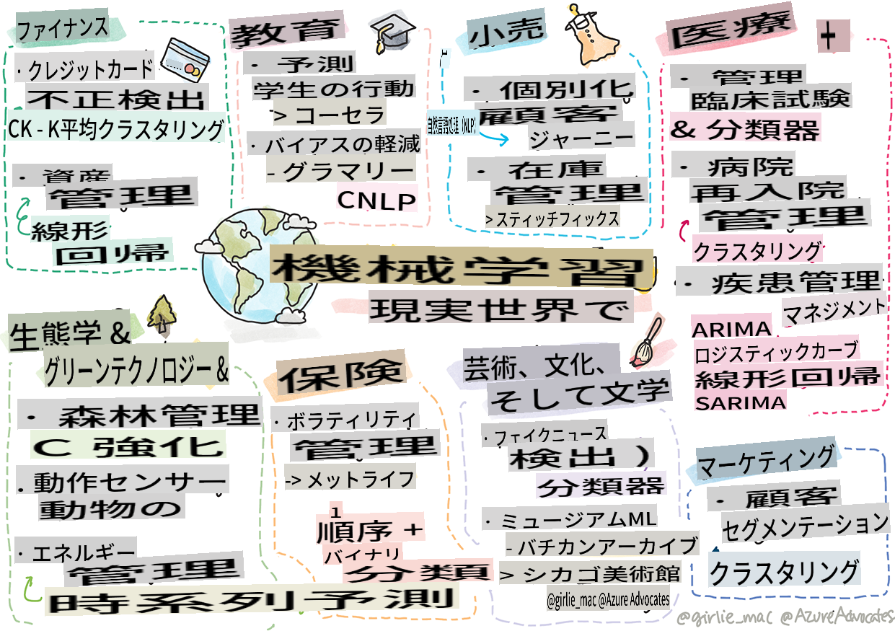

# 後書き: 実世界での機械学習

> スケッチノート: [Tomomi Imura](https://www.twitter.com/girlie_mac)

このカリキュラムでは、データをトレーニングのために準備し、機械学習モデルを作成するための多くの方法を学びました。クラシックな回帰、クラスタリング、分類、自然言語処理、時系列モデルの一連を構築しました。おめでとうございます！さて、これらのモデルが実際に何のために使われるのか気になっているかもしれません。実世界でのこれらのモデルの応用例とは何でしょうか？

業界では深層学習を利用したAIが注目されていますが、クラシックな機械学習モデルにも価値のある応用例があります。実際に、今日でもこれらの応用例のいくつかを使っているかもしれません。このレッスンでは、8つの異なる業界や専門分野がこれらのモデルをどのように使ってアプリケーションをより高性能、信頼性、知能的、価値あるものにしているかを探ります。

## [レクチャー前のクイズ](https://gray-sand-07a10f403.1.azurestaticapps.net/quiz/49/)

## 💰 ファイナンス

ファイナンス分野は機械学習に多くの機会を提供します。この分野の多くの問題は、MLを使用してモデル化し解決することができます。

### クレジットカード詐欺検出

以前のコースで[k-meansクラスタリング](../../5-Clustering/2-K-Means/README.md)について学びましたが、これをクレジットカード詐欺に関連する問題解決にどのように使えるのでしょうか？

k-meansクラスタリングは、**異常検出**と呼ばれるクレジットカード詐欺検出技術で役立ちます。データセットに関する観測の逸脱や異常は、クレジットカードが通常の方法で使用されているか、何か異常が起きているかを教えてくれます。以下のリンクされた論文に示されているように、k-meansクラスタリングアルゴリズムを使用してクレジットカードデータを分類し、各取引をどれだけ異常であるかに基づいてクラスターに割り当てることができます。その後、最もリスクの高いクラスターを評価し、詐欺と正当な取引を区別します。
[参考](https://citeseerx.ist.psu.edu/viewdoc/download?doi=10.1.1.680.1195&rep=rep1&type=pdf)

### 資産管理

資産管理では、個人や企業がクライアントのために投資を扱います。彼らの仕事は長期的に資産を維持し増やすことなので、良いパフォーマンスを示す投資を選ぶことが重要です。

特定の投資がどのようにパフォーマンスを発揮するかを評価する一つの方法は、統計的回帰です。[線形回帰](../../2-Regression/1-Tools/README.md)は、ファンドのパフォーマンスをベンチマークに対して理解するための価値あるツールです。また、回帰の結果が統計的に有意かどうか、つまりクライアントの投資にどれだけ影響を与えるかを推測することもできます。さらに、複数のリスク要因を考慮に入れて多重回帰を使用して分析を拡張することもできます。具体的なファンドのパフォーマンスを回帰を使って評価する方法については、以下の論文を参照してください。
[参考](http://www.brightwoodventures.com/evaluating-fund-performance-using-regression/)

## 🎓 教育

教育分野もまた、MLが適用できる非常に興味深い分野です。試験やエッセイのカンニングを検出することや、意図的であれ無意識であれ、修正プロセスでのバイアスを管理することなど、興味深い問題があります。

### 学生の行動予測

オンラインオープンコースプロバイダーである[Coursera](https://coursera.com)には、多くのエンジニアリング決定について議論する素晴らしいテックブログがあります。このケーススタディでは、低いNPS（ネットプロモータースコア）評価とコースの継続率や中途退学との相関関係を探るために回帰線をプロットしました。
[参考](https://medium.com/coursera-engineering/controlled-regression-quantifying-the-impact-of-course-quality-on-learner-retention-31f956bd592a)

### バイアスの軽減

スペルや文法エラーをチェックするライティングアシスタントである[Grammarly](https://grammarly.com)は、製品全体で高度な[自然言語処理システム](../../6-NLP/README.md)を使用しています。彼らは、機械学習におけるジェンダーバイアスにどのように対処したかについて、テックブログで興味深いケーススタディを公開しました。これは、私たちの[公平性に関する導入レッスン](../../1-Introduction/3-fairness/README.md)で学んだ内容です。
[参考](https://www.grammarly.com/blog/engineering/mitigating-gender-bias-in-autocorrect/)

## 👜 小売

小売業界は、顧客体験の向上から在庫の最適な管理まで、MLの利用によって大いに恩恵を受けることができます。

### 顧客体験のパーソナライズ

家具などの家庭用品を販売する会社であるWayfairでは、顧客が自分の好みやニーズに合った製品を見つけるのを助けることが最も重要です。この記事では、同社のエンジニアがMLとNLPをどのように使用して「顧客に最適な結果を提供するか」について説明しています。特に、彼らのQuery Intent Engineは、エンティティ抽出、分類器トレーニング、アセットおよび意見抽出、感情タグ付けを顧客レビューに対して行うように設計されています。これは、オンライン小売におけるNLPの典型的な使用例です。
[参考](https://www.aboutwayfair.com/tech-innovation/how-we-use-machine-learning-and-natural-language-processing-to-empower-search)

### 在庫管理

[StitchFix](https://stitchfix.com)のような革新的で敏捷な企業は、推奨と在庫管理にMLを大いに活用しています。彼らのスタイリングチームは、実際には商品チームと協力しています。「私たちのデータサイエンティストの一人が遺伝的アルゴリズムをいじり、それをアパレルに適用して、今日存在しない成功する可能性のある衣料品を予測しました。それを商品チームに持ち込み、彼らはそれをツールとして使用できるようになりました。」
[参考](https://www.zdnet.com/article/how-stitch-fix-uses-machine-learning-to-master-the-science-of-styling/)

## 🏥 医療

医療分野では、研究タスクの最適化や患者の再入院管理、病気の拡散防止などのロジスティックな問題にMLを活用できます。

### 臨床試験の管理

臨床試験における毒性は薬品メーカーにとって大きな懸念事項です。どの程度の毒性が許容されるのでしょうか？この研究では、さまざまな臨床試験方法を分析することで、臨床試験の結果を予測するための新しいアプローチが開発されました。具体的には、ランダムフォレストを使用して、薬剤のグループを区別する[分類器](../../4-Classification/README.md)を作成することができました。
[参考](https://www.sciencedirect.com/science/article/pii/S2451945616302914)

### 病院の再入院管理

病院でのケアは高コストであり、特に患者が再入院する場合はなおさらです。この論文では、[クラスタリング](../../5-Clustering/README.md)アルゴリズムを使用して再入院の可能性を予測する企業について議論しています。これらのクラスターは、「共通の原因を共有する可能性のある再入院のグループを発見する」ためにアナリストを支援します。
[参考](https://healthmanagement.org/c/healthmanagement/issuearticle/hospital-readmissions-and-machine-learning)

### 病気の管理

最近のパンデミックは、機械学習が病気の拡散を防ぐためにどのように役立つかを明らかにしました。この記事では、ARIMA、ロジスティック曲線、線形回帰、SARIMAの使用が認識されます。「この研究は、ウイルスの拡散率を計算し、死亡者、回復者、確認されたケースを予測する試みであり、これによって私たちがより良く準備し、生き延びるのに役立つことを目指しています。」
[参考](https://www.ncbi.nlm.nih.gov/pmc/articles/PMC7979218/)

## 🌲 エコロジーとグリーンテック

自然とエコロジーは、動物と自然の相互作用が注目される多くの繊細なシステムで構成されています。これらのシステムを正確に測定し、森林火災や動物の個体数減少などの問題が発生した場合に適切に対処することが重要です。

### 森林管理

以前のレッスンで[強化学習](../../8-Reinforcement/README.md)について学びました。これは自然のパターンを予測する際に非常に有用です。特に、森林火災や侵入種の拡散などの生態学的問題を追跡するために使用できます。カナダでは、研究者のグループが衛星画像から森林火災の動態モデルを構築するために強化学習を使用しました。革新的な「空間的拡散プロセス（SSP）」を使用して、森林火災を「景観内の任意のセルでのエージェント」として視覚化しました。「火災が任意の時点で特定の場所から取ることができる行動のセットには、北、南、東、西への拡散や拡散しないことが含まれます。」

このアプローチは、対応するマルコフ決定プロセス（MDP）の動態が即時の火災拡散のための既知の関数であるため、通常のRLセットアップを逆転させます。以下のリンクで、このグループが使用したクラシックなアルゴリズムについて詳しく読むことができます。
[参考](https://www.frontiersin.org/articles/10.3389/fict.2018.00006/full)

### 動物の動きのモーションセンシング

ディープラーニングは動物の動きを視覚的に追跡する革命をもたらしました（ここで自分自身の[ホッキョクグマ追跡器](https://docs.microsoft.com/learn/modules/build-ml-model-with-azure-stream-analytics/?WT.mc_id=academic-77952-leestott)を作ることができます）が、クラシックなMLもこのタスクにおいて依然として役割を果たしています。

農場の動物の動きを追跡するセンサーやIoTはこの種の視覚処理を利用しますが、より基本的なML技術はデータを前処理するのに役立ちます。例えば、この論文では、羊の姿勢がさまざまな分類器アルゴリズムを使用して監視および分析されました。ページ335のROC曲線を認識するかもしれません。
[参考](https://druckhaus-hofmann.de/gallery/31-wj-feb-2020.pdf)

### ⚡️ エネルギー管理
  
[時系列予測](../../7-TimeSeries/README.md)のレッスンでは、供給と需要を理解することに基づいて町の収益を生み出すスマート駐車メーターの概念を導入しました。この記事では、クラスタリング、回帰、および時系列予測を組み合わせて、スマートメーターを基にしたアイルランドの将来のエネルギー使用量を予測する方法について詳しく説明しています。
[参考](https://www-cdn.knime.com/sites/default/files/inline-images/knime_bigdata_energy_timeseries_whitepaper.pdf)

## 💼 保険

保険業界は、実行可能な金融およびアクチュアリーモデルを構築および最適化するためにMLを使用するもう一つの分野です。

### 変動性管理

生命保険提供者であるMetLifeは、金融モデルの変動性を分析および軽減する方法について率直に説明しています。この記事では、バイナリおよび序数分類の視覚化が見られます。また、予測の視覚化も発見できます。
[参考](https://investments.metlife.com/content/dam/metlifecom/us/investments/insights/research-topics/macro-strategy/pdf/MetLifeInvestmentManagement_MachineLearnedRanking_070920.pdf)

## 🎨 芸術、文化、文学

ジャーナリズムなどの芸術分野には多くの興味深い問題があります。フェイクニュースの検出は大きな問題であり、人々の意見に影響を与え、さらには民主主義を揺るがすことが証明されています。博物館も、アーティファクト間のリンクを見つけることからリソース計画に至るまで、MLの使用から恩恵を受けることができます。

### フェイクニュース検出

今日のメディアでフェイクニュースを検出することは、いたちごっこのようなものです。この記事では、研究者が複数のML技術を組み合わせたシステムをテストし、最適なモデルを展開することを提案しています。「このシステムは、データから特徴を抽出するための自然言語処理に基づいており、これらの特徴がナイーブベイズ、サポートベクターマシン（SVM）、ランダムフォレスト（RF）、確率的勾配降下（SGD）、ロジスティック回帰（LR）などの機械学習分類器のトレーニングに使用されます。」
[参考](https://www.irjet.net/archives/V7/i6/IRJET-V7I6688.pdf)

この記事は、異なるMLドメインを組み合わせることで、フェイクニュースの拡散を防ぎ、実際の被害を防ぐために興味深い結果を生み出すことができることを示しています。この場合、COVID治療に関する噂の拡散が暴力を引き起こしたことが動機となりました。

### 博物館ML

博物館は、コレクションのカタログ化やデジタル化、アーティファクト間のリンクを見つけることが技術の進歩により容易になっているAI革命の最前線にいます。[In Codice Ratio](https://www.sciencedirect.com/science/article/abs/pii/S0306457321001035#:~:text=1.,studies%20over%20large%20historical%20sources.)などのプロジェクトは、バチカンのアーカイブのようなアクセス不可能なコレクションの謎を解き明かすのに役立っています。しかし、博物館のビジネス面もMLモデルから恩恵を受けています。

例えば、シカゴ美術館は、観客が何に興味を持ち、いつ展示を訪れるかを予測するモデルを構築しました。目標は、ユーザーが博物館を訪れるたびに個別化され最適化された体験を提供することです。「2017年度中、モデルは1％の精度で入場者数と入場料を予測しました」とシカゴ美術館の上級副社長であるAndrew Simnick氏は述べています。
[Reference](https://www.chicagobusiness.com/article/20180518/ISSUE01/180519840/art-institute-of-chicago-uses-data-to-make-exhibit-choices)

## 🏷 マーケティング

### 顧客セグメンテーション

最も効果的なマーケティング戦略は、さまざまなグループに基づいて顧客を異なる方法でターゲットにします。この記事では、差別化されたマーケティングをサポートするためにクラスタリングアルゴリズムの使用について議論されています。差別化されたマーケティングは、企業がブランド認知を向上させ、より多くの顧客にリーチし、より多くの利益を上げるのに役立ちます。
[Reference](https://ai.inqline.com/machine-learning-for-marketing-customer-segmentation/)

## 🚀 チャレンジ

このカリキュラムで学んだ技術のいくつかが恩恵を受ける別のセクターを特定し、そのセクターがどのようにMLを使用しているかを調べてください。

## [講義後のクイズ](https://gray-sand-07a10f403.1.azurestaticapps.net/quiz/50/)

## レビューと自己学習

Wayfairのデータサイエンスチームは、彼らの会社でどのようにMLを使用しているかについての興味深いビデオをいくつか提供しています。ぜひ[チェック](https://www.youtube.com/channel/UCe2PjkQXqOuwkW1gw6Ameuw/videos)してみてください！

## 課題

[A ML scavenger hunt](assignment.md)

**免責事項**：
この文書は機械翻訳AIサービスを使用して翻訳されています。正確さを期すよう努めておりますが、自動翻訳には誤りや不正確さが含まれる場合があります。原文の言語で書かれたオリジナルの文書が権威ある情報源と見なされるべきです。重要な情報については、専門の人間による翻訳を推奨します。この翻訳の使用に起因する誤解や誤解について、当社は一切の責任を負いません。