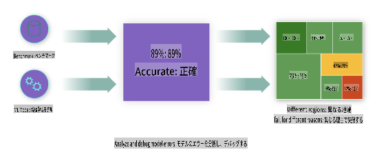
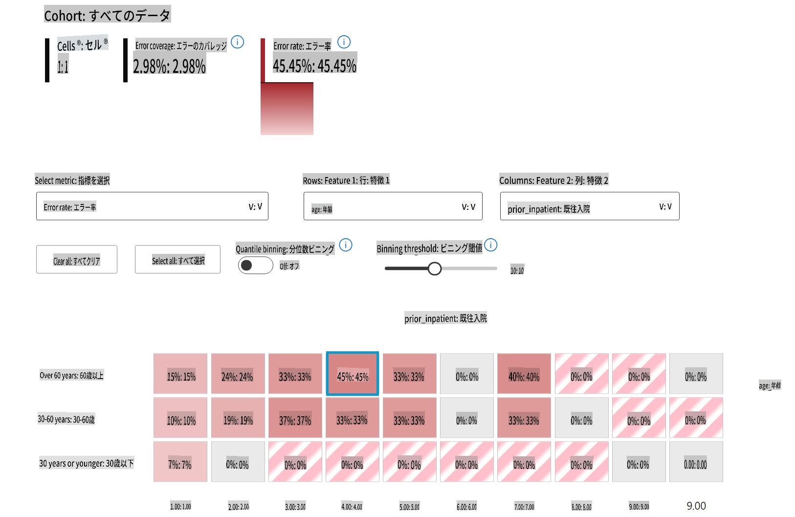
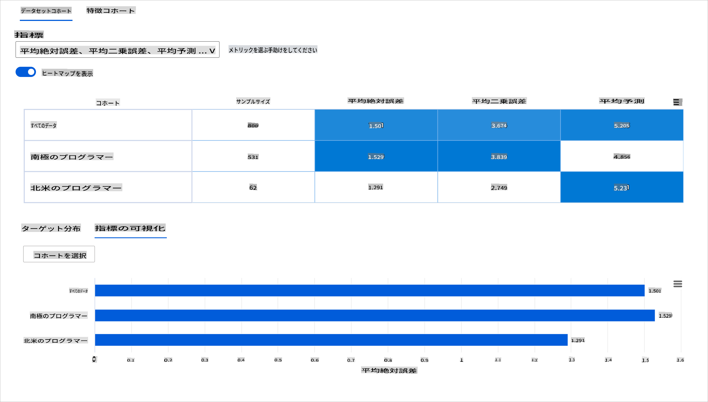
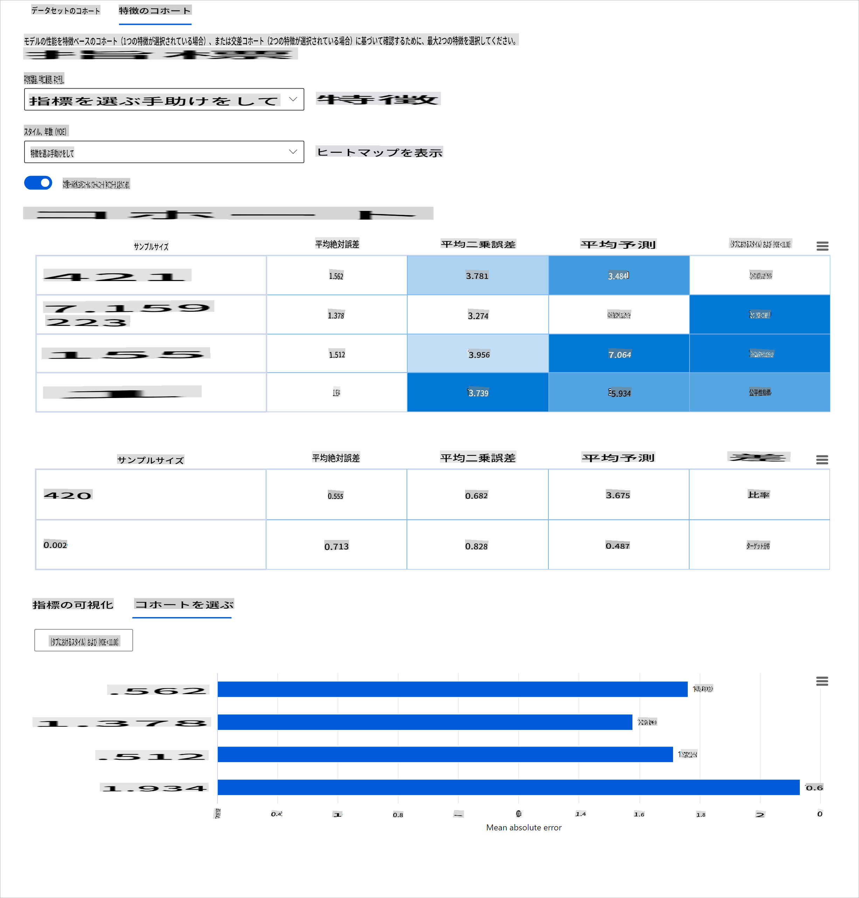
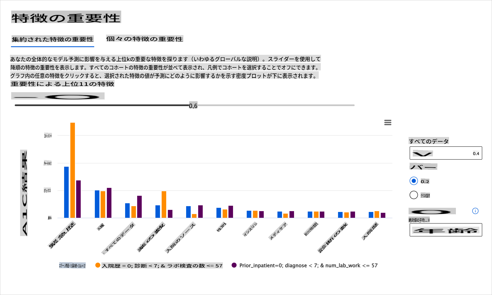

# 後書き: 責任あるAIダッシュボードコンポーネントを用いた機械学習モデルのデバッグ

## [講義前クイズ](https://gray-sand-07a10f403.1.azurestaticapps.net/quiz/5/)

## はじめに

機械学習は私たちの日常生活に大きな影響を与えています。AIは、医療、金融、教育、雇用など、私たち個人や社会に影響を与える最も重要なシステムの一部に浸透しています。例えば、システムやモデルは、医療診断や詐欺検出などの日常的な意思決定タスクに関与しています。その結果、AIの進歩と急速な採用に伴い、社会の期待も進化し、規制も増加しています。AIシステムが期待を裏切る場面が続出し、新たな課題が浮き彫りになり、政府もAIソリューションを規制し始めています。したがって、これらのモデルが公平で信頼性があり、包括的で透明性があり、責任ある結果を提供することを確認することが重要です。

このカリキュラムでは、モデルに責任あるAIの問題があるかどうかを評価するために使用できる実践的なツールを見ていきます。従来の機械学習デバッグ技術は、集計された精度や平均誤差損失などの定量的な計算に基づく傾向があります。使用しているデータが人種、性別、政治的見解、宗教などの特定の人口統計を欠いている場合、またはこれらの人口統計を過剰に代表している場合に何が起こるかを想像してみてください。モデルの出力が特定の人口統計を優遇するように解釈される場合はどうでしょうか。これにより、モデルから公平性、包括性、信頼性の問題が発生する可能性があります。さらに、機械学習モデルはブラックボックスと見なされるため、モデルの予測を駆動するものを理解し説明することが難しいです。これらはすべて、データサイエンティストやAI開発者が、モデルの公平性や信頼性をデバッグおよび評価するための適切なツールを持っていない場合に直面する課題です。

このレッスンでは、次の方法でモデルをデバッグする方法を学びます：

- **エラー分析**: データ分布のどこでモデルが高いエラー率を持っているかを特定します。
- **モデル概要**: 異なるデータコホート間で比較分析を行い、モデルのパフォーマンス指標の格差を発見します。
- **データ分析**: データの過剰または過少表現がモデルの偏りを引き起こす可能性のある場所を調査します。
- **特徴重要度**: モデルの予測をグローバルレベルまたはローカルレベルで駆動する特徴を理解します。

## 前提条件

前提条件として、[開発者向けの責任あるAIツール](https://www.microsoft.com/ai/ai-lab-responsible-ai-dashboard)をレビューしてください。

> 

## エラー分析

従来のモデルパフォーマンス指標は、主に正しい予測と間違った予測に基づいた計算です。例えば、モデルが89%の精度を持ち、エラー損失が0.001であると判断される場合、それは良いパフォーマンスと見なされるかもしれません。エラーは基礎となるデータセットに均等に分布していないことがよくあります。89%のモデル精度スコアを得ることができても、モデルが42%の確率で失敗するデータの異なる領域があることがわかるかもしれません。これらの失敗パターンの結果として、特定のデータグループで公平性や信頼性の問題が発生する可能性があります。モデルがうまく機能しているかどうかを理解することが重要です。モデルに不正確なデータ領域が多い場合、それは重要なデータ人口統計である可能性があります。

RAIダッシュボードのエラー分析コンポーネントは、ツリービジュアライゼーションを使用して、さまざまなコホートにわたるモデルの失敗がどのように分布しているかを示します。これは、データセットに高いエラー率がある特徴や領域を特定するのに役立ちます。モデルの不正確さがどこから来ているかを確認することで、根本原因を調査し始めることができます。データコホートを作成して分析を行うこともできます。これらのデータコホートは、あるコホートでモデルのパフォーマンスが良好である理由を特定し、別のコホートでエラーが発生する理由を特定するのに役立ちます。

ツリーマップの視覚的なインジケーターは、問題領域をより迅速に特定するのに役立ちます。例えば、ツリーノードの赤の濃い色合いが濃いほど、エラー率が高いことを示しています。

ヒートマップは、エラー率を調査するための別の視覚化機能であり、1つまたは2つの特徴を使用してデータセット全体またはコホート全体でモデルエラーの原因を見つけるのに役立ちます。

エラー分析を使用する場面：

* データセット全体および複数の入力および特徴次元にわたるモデルの失敗の分布を深く理解する必要がある場合。
* 集計パフォーマンス指標を分解して、ターゲットとする緩和ステップを通知するために誤ったコホートを自動的に発見する場合。

## モデル概要

機械学習モデルのパフォーマンスを評価するには、その動作を全体的に理解する必要があります。これは、エラー率、精度、リコール、精度、MAE（平均絶対誤差）など、複数の指標を確認して、パフォーマンス指標の間に格差がないかを見つけることで達成できます。あるパフォーマンス指標は優れているように見えるかもしれませんが、別の指標では不正確さが露呈することがあります。さらに、データセット全体またはコホート間で指標を比較して格差を見つけることで、モデルがどこでうまく機能しているかを明らかにするのに役立ちます。特に、敏感な特徴（例：患者の人種、性別、年齢）と非敏感な特徴の間でモデルのパフォーマンスを見ることが重要です。例えば、敏感な特徴を持つコホートでモデルがより多くのエラーを発生させていることがわかると、モデルに潜在的な不公平があることが明らかになるかもしれません。

RAIダッシュボードのモデル概要コンポーネントは、コホート内のデータ表現のパフォーマンス指標を分析するだけでなく、異なるコホート間でモデルの動作を比較する機能をユーザーに提供します。

コンポーネントの特徴ベースの分析機能を使用すると、特定の特徴内のデータサブグループを絞り込んで、詳細レベルで異常を特定することができます。例えば、ダッシュボードにはユーザーが選択した特徴（例：「time_in_hospital < 3」または「time_in_hospital >= 7」）に基づいてコホートを自動的に生成するための組み込みのインテリジェンスがあります。これにより、ユーザーは大きなデータグループから特定の特徴を分離して、それがモデルの誤った結果を引き起こす主要な要因であるかどうかを確認できます。

モデル概要コンポーネントは、次の2つのクラスの格差指標をサポートします：

**モデルパフォーマンスの格差**: これらの指標セットは、データのサブグループ間で選択されたパフォーマンス指標の値の格差（差異）を計算します。いくつかの例を以下に示します：

* 精度率の格差
* エラー率の格差
* 精度の格差
* リコールの格差
* 平均絶対誤差（MAE）の格差

**選択率の格差**: この指標は、サブグループ間の選択率（好ましい予測）の違いを含みます。例えば、ローン承認率の格差です。選択率とは、各クラスで1と分類されたデータポイントの割合（バイナリ分類）または予測値の分布（回帰）を意味します。

## データ分析

> 「データを十分に拷問すれば、何でも白状する」 - ロナルド・コース

この言葉は極端に聞こえるかもしれませんが、データはどんな結論をも支持するように操作できることは事実です。このような操作は、時には意図せずに行われることもあります。私たち人間は皆、バイアスを持っており、データにバイアスを導入していることを意識的に知ることは難しいことがよくあります。AIと機械学習の公平性を保証することは依然として複雑な課題です。

データは従来のモデルパフォーマンス指標にとって大きな盲点です。高い精度スコアを持っていても、データセットに潜在するバイアスを反映しているとは限りません。例えば、ある会社の幹部ポジションに女性が27％、男性が73％いるデータセットがある場合、このデータを基にトレーニングされた求人広告AIモデルは、主に男性向けのシニアポジションの求人をターゲットにする可能性があります。このようなデータの不均衡は、モデルの予測が一方の性別を優遇することにつながります。これにより、AIモデルに性別バイアスがあることが明らかになります。

RAIダッシュボードのデータ分析コンポーネントは、データセットに過剰または過少表現がある場所を特定するのに役立ちます。データの不均衡や特定のデータグループの欠如から生じるエラーや公平性の問題の根本原因を診断するのに役立ちます。これにより、予測結果や実際の結果、エラーグループ、特定の特徴に基づいてデータセットを視覚化する機能を提供します。時には、過少表現されたデータグループを発見することで、モデルがうまく学習していないことが明らかになり、高い不正確さが生じることがあります。データバイアスを持つモデルは、公平性の問題だけでなく、包括性や信頼性の欠如を示しています。

データ分析を使用する場面：

* 異なるフィルターを選択してデータセット統計を探索し、データを異なる次元（コホートとしても知られる）に分割する必要がある場合。
* 異なるコホートや特徴グループにわたるデータセットの分布を理解する必要がある場合。
* データセットの分布に起因する公平性、エラー分析、因果関係（他のダッシュボードコンポーネントから導き出される）に関連する発見を判断する必要がある場合。
* 表現の問題から生じるエラーを緩和するために、どの領域でより多くのデータを収集するかを決定する必要がある場合。

## モデルの解釈可能性

機械学習モデルはブラックボックスと見なされることが多いです。モデルの予測を駆動する主要なデータ特徴を理解することは難しいです。モデルが特定の予測を行う理由に透明性を提供することが重要です。例えば、AIシステムが糖尿病患者が30日以内に再入院するリスクがあると予測する場合、その予測の根拠となるデータを提供する必要があります。支持データの指標を持つことで、臨床医や病院が十分な情報に基づいた意思決定を行うのに役立ちます。さらに、個々の患者に対してモデルが予測を行った理由を説明することで、医療規制に対する説明責任が果たされます。人々の生活に影響を与える方法で機械学習モデルを使用する場合、モデルの行動に影響を与える要因を理解し説明することが重要です。モデルの解釈可能性と説明可能性は、次のシナリオで質問に答えるのに役立ちます：

* モデルのデバッグ: モデルがこのミスを犯した理由は何ですか？モデルを改善する方法は何ですか？
* 人間とAIの協力: モデルの決定を理解し信頼する方法は何ですか？
* 規制遵守: モデルが法的要件を満たしているかどうか？

RAIダッシュボードの特徴重要度コンポーネントは、モデルがどのように予測を行うかをデバッグし包括的に理解するのに役立ちます。また、機械学習の専門家や意思決定者がモデルの行動に影響を与える特徴を説明し、規制遵守のための証拠を示すのにも役立ちます。次に、ユーザーはグローバルおよびローカルの説明を探索して、モデルの予測を駆動する特徴を検証できます。グローバル説明は、モデルの全体的な予測に影響を与えた上位の特徴をリストします。ローカル説明は、個々のケースに対してモデルが予測を行った特徴を表示します。ローカル説明を評価する能力は、特定のケースをデバッグまたは監査して、モデルが正確または不正確な予測を行った理由をよりよく理解し解釈するのにも役立ちます。

* グローバル説明: 例えば、糖尿病の病院再入院モデルの全体的な行動に影響を与える特徴は何ですか？
* ローカル説明: 例えば、60歳以上の糖尿病患者が30日以内に再入院するかどうかを予測した理由は何ですか？

異なるコホートにわたるモデルのパフォーマンスを調べるデバッグプロセスでは、特徴重要度がコホート全体でどの程度の影響を持っているかを示します。モデルの誤った予測を駆動する特徴の影響レベルを比較することで異常を明らかにするのに役立ちます。特徴重要度コンポーネントは、特徴の値がモデルの結果にどのようにプラスまたはマイナスの影響を与えたかを示すことができます。例えば、モデルが不正確な予測を行った場合、コンポーネントは予測を駆動した特徴や特徴値を特定するために詳細に掘り下げる能力を提供します。このレベルの詳細は、デバッグだけでなく、監査状況での透明性と説明責任を提供するのにも役立ちます。最後に、特徴重要度コンポーネントは公平性の問題を特定するのにも役立ちます。例えば、民族性や性別などの敏感な特徴がモデルの予測を駆動する際に大きな影響を与える場合、それはモデルに人種や性別のバイアスがある兆候かもしれ

**免責事項**:

この文書は、機械ベースのAI翻訳サービスを使用して翻訳されています。正確さを期すために努めておりますが、自動翻訳にはエラーや不正確さが含まれる可能性があることをご了承ください。元の言語で書かれた原文を権威ある情報源と見なすべきです。重要な情報については、専門の人間による翻訳をお勧めします。この翻訳の使用によって生じた誤解や誤訳について、当社は一切責任を負いません。