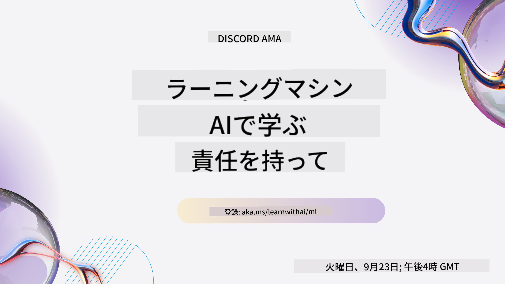
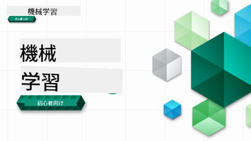

<!--
CO_OP_TRANSLATOR_METADATA:
{
  "original_hash": "7a13afb3674838f557d61f8d67e4d5f8",
  "translation_date": "2025-10-24T08:58:49+00:00",
  "source_file": "README.md",
  "language_code": "ja"
}
-->
  
  
  
  
  

  
  
  

### 🌐 多言語対応

#### GitHub Actionによるサポート (自動化＆常に最新)

<!-- CO-OP TRANSLATOR LANGUAGES TABLE START -->
[アラビア語](../ar/README.md) | [ベンガル語](../bn/README.md) | [ブルガリア語](../bg/README.md) | [ビルマ語 (ミャンマー)](../my/README.md) | [中国語 (簡体字)](../zh/README.md) | [中国語 (繁体字、香港)](../hk/README.md) | [中国語 (繁体字、マカオ)](../mo/README.md) | [中国語 (繁体字、台湾)](../tw/README.md) | [クロアチア語](../hr/README.md) | [チェコ語](../cs/README.md) | [デンマーク語](../da/README.md) | [オランダ語](../nl/README.md) | [エストニア語](../et/README.md) | [フィンランド語](../fi/README.md) | [フランス語](../fr/README.md) | [ドイツ語](../de/README.md) | [ギリシャ語](../el/README.md) | [ヘブライ語](../he/README.md) | [ヒンディー語](../hi/README.md) | [ハンガリー語](../hu/README.md) | [インドネシア語](../id/README.md) | [イタリア語](../it/README.md) | [日本語](./README.md) | [韓国語](../ko/README.md) | [リトアニア語](../lt/README.md) | [マレー語](../ms/README.md) | [マラーティー語](../mr/README.md) | [ネパール語](../ne/README.md) | [ノルウェー語](../no/README.md) | [ペルシャ語 (ファルシー)](../fa/README.md) | [ポーランド語](../pl/README.md) | [ポルトガル語 (ブラジル)](../br/README.md) | [ポルトガル語 (ポルトガル)](../pt/README.md) | [パンジャブ語 (グルムキー)](../pa/README.md) | [ルーマニア語](../ro/README.md) | [ロシア語](../ru/README.md) | [セルビア語 (キリル文字)](../sr/README.md) | [スロバキア語](../sk/README.md) | [スロベニア語](../sl/README.md) | [スペイン語](../es/README.md) | [スワヒリ語](../sw/README.md) | [スウェーデン語](../sv/README.md) | [タガログ語 (フィリピン)](../tl/README.md) | [タミル語](../ta/README.md) | [タイ語](../th/README.md) | [トルコ語](../tr/README.md) | [ウクライナ語](../uk/README.md) | [ウルドゥー語](../ur/README.md) | [ベトナム語](../vi/README.md)  
<!-- CO-OP TRANSLATOR LANGUAGES TABLE END -->

#### コミュニティに参加しよう

現在、AI学習シリーズをDiscordで開催中です。詳細を確認し、2025年9月18日から30日までの[AI学習シリーズ](https://aka.ms/learnwithai/discord)に参加してください。GitHub Copilotを使ったデータサイエンスのコツやテクニックを学べます。

# 初心者向け機械学習 - カリキュラム

> 🌍 世界中を旅しながら、世界の文化を通じて機械学習を探求しましょう 🌍

Microsoftのクラウドアドボケイトが提供する12週間、26レッスンのカリキュラムで、**機械学習**について学びましょう。このカリキュラムでは、主にScikit-learnライブラリを使用し、**クラシック機械学習**と呼ばれることもある技術を学びます。ディープラーニングについては、[AI初心者向けカリキュラム](https://aka.ms/ai4beginners)で取り扱っています。また、このレッスンを['データサイエンス初心者向けカリキュラム'](https://aka.ms/ds4beginners)と組み合わせて学ぶこともできます。

世界中のデータを使ってクラシックな技術を適用しながら、私たちと一緒に旅をしましょう。各レッスンには、事前・事後のクイズ、レッスンを完了するための書面による指示、解答、課題などが含まれています。プロジェクトベースの教育法により、学びながら構築することで、新しいスキルを定着させることができます。

**✍️ 著者に感謝** Jen Looper, Stephen Howell, Francesca Lazzeri, Tomomi Imura, Cassie Breviu, Dmitry Soshnikov, Chris Noring, Anirban Mukherjee, Ornella Altunyan, Ruth Yakubu, Amy Boyd

**🎨 イラストレーターにも感謝** Tomomi Imura, Dasani Madipalli, Jen Looper

**🙏 特別な感謝 🙏 Microsoft Student Ambassadorの著者、レビューアー、コンテンツ提供者** Rishit Dagli, Muhammad Sakib Khan Inan, Rohan Raj, Alexandru Petrescu, Abhishek Jaiswal, Nawrin Tabassum, Ioan Samuila, Snigdha Agarwal

**🤩 Microsoft Student Ambassador Eric Wanjau, Jasleen Sondhi, Vidushi GuptaによるRレッスンにも特別な感謝！**

# 始め方

以下の手順に従ってください:
1. **リポジトリをフォークする**: このページの右上にある「Fork」ボタンをクリックしてください。
2. **リポジトリをクローンする**: `git clone https://github.com/microsoft/ML-For-Beginners.git`

> [このコースの追加リソースはMicrosoft Learnコレクションで見つけることができます](https://learn.microsoft.com/en-us/collections/qrqzamz1nn2wx3?WT.mc_id=academic-77952-bethanycheum)

> 🔧 **ヘルプが必要ですか？** [トラブルシューティングガイド](TROUBLESHOOTING.md)でインストール、セットアップ、レッスン実行に関する一般的な問題の解決策を確認してください。

**[学生](https://aka.ms/student-page)** の皆さん、このカリキュラムを使用するには、リポジトリ全体を自分のGitHubアカウントにフォークし、個人またはグループで演習を完了してください:

- レクチャー前のクイズから始めましょう。
- レクチャーを読み、各知識チェックで一時停止して考えながら活動を完了してください。
- レッスンを理解しながらプロジェクトを作成することを試みてください。ただし、解答コードは各プロジェクト指向のレッスンの`/solution`フォルダーにあります。
- レクチャー後のクイズを受けましょう。
- チャレンジを完了してください。
- 課題を完了してください。
- レッスングループを完了した後、[ディスカッションボード](https://github.com/microsoft/ML-For-Beginners/discussions)にアクセスし、適切なPATルーブリックを記入して「声を出して学びましょう」。PATは学習を進めるための進捗評価ツールで、ルーブリックを記入することで学習を深めることができます。他のPATに反応することで、共に学ぶことができます。

> さらに学びたい場合は、これらの[Microsoft Learn](https://docs.microsoft.com/en-us/users/jenlooper-2911/collections/k7o7tg1gp306q4?WT.mc_id=academic-77952-leestott)モジュールと学習パスをフォローすることをお勧めします。

**教師の皆さん**、このカリキュラムの使用方法について[いくつかの提案](for-teachers.md)を含めています。

---

## ビデオウォークスルー

一部のレッスンは短い形式のビデオとして利用可能です。これらはレッスン内でインラインで見つけることができます。または、Microsoft Developer YouTubeチャンネルの[初心者向け機械学習プレイリスト](https://aka.ms/ml-beginners-videos)で画像をクリックして視聴できます。

---

## チーム紹介

**Gif作成者** [Mohit Jaisal](https://linkedin.com/in/mohitjaisal)

> 🎥 上の画像をクリックして、プロジェクトと作成者についてのビデオをご覧ください！

---

## 教育法

このカリキュラムを構築する際に選んだ教育的な原則は、**プロジェクトベース**であることと、**頻繁なクイズ**を含むことです。また、このカリキュラムには共通の**テーマ**があり、統一感を持たせています。

プロジェクトに合わせてコンテンツを整えることで、学生にとってより魅力的なプロセスとなり、概念の定着が促進されます。また、授業前の低リスクなクイズは、学生がトピックを学ぶ意図を設定し、授業後のクイズはさらに定着を確実にします。このカリキュラムは柔軟で楽しいものとして設計されており、全体または部分的に受講することができます。プロジェクトは小さなものから始まり、12週間のサイクルの終わりには徐々に複雑になります。このカリキュラムには、機械学習の実世界での応用に関する後書きも含まれており、追加のクレジットや議論の基礎として使用できます。

> [行動規範](CODE_OF_CONDUCT.md)、[貢献](CONTRIBUTING.md)、[翻訳](TRANSLATIONS.md)、[トラブルシューティング](TROUBLESHOOTING.md)ガイドラインをご覧ください。建設的なフィードバックを歓迎します！

## 各レッスンには以下が含まれます

- オプションのスケッチノート
- オプションの補足ビデオ
- ビデオウォークスルー (一部のレッスンのみ)
- [レクチャー前のウォームアップクイズ](https://ff-quizzes.netlify.app/en/ml/)
- 書面によるレッスン
- プロジェクトベースのレッスンの場合、プロジェクトの構築方法に関するステップバイステップガイド
- 知識チェック
- チャレンジ
- 補足読書
- 課題
- [レクチャー後のクイズ](https://ff-quizzes.netlify.app/en/ml/)

> **言語についての注意**: これらのレッスンは主にPythonで書かれていますが、多くはRでも利用可能です。Rレッスンを完了するには、`/solution`フォルダーに移動し、Rレッスンを探してください。それらには`.rmd`拡張子が含まれており、これは**R Markdown**ファイルを表します。R Markdownファイルは、`コードチャンク` (Rや他の言語のコード) と `YAMLヘッダー` (PDFなどの出力形式をガイドするもの) を `Markdownドキュメント`に埋め込んだものとして簡単に定義できます。このため、データサイエンスのための優れた著作フレームワークとして機能し、コード、出力、考えをMarkdownに記述することができます。さらに、R MarkdownドキュメントはPDF、HTML、Wordなどの出力形式にレンダリングすることができます。

> **クイズについての注意**: すべてのクイズは[Quiz Appフォルダー](../../quiz-app)に含まれており、合計52のクイズが各3問ずつあります。これらはレッスン内からリンクされていますが、クイズアプリはローカルで実行可能です。`quiz-app`フォルダー内の指示に従って、ローカルでホストするかAzureにデプロイしてください。

| レッスン番号 |                             トピック                              |                   レッスングループ                   | 学習目標                                                                                                             |                                                              リンクされたレッスン                                                               |                        著者                        |
| :-----------: | :------------------------------------------------------------: | :-------------------------------------------------: | ------------------------------------------------------------------------------------------------------------------------------- | :--------------------------------------------------------------------------------------------------------------------------------------: | :--------------------------------------------------: |
|      01       |                機械学習の紹介                |      [Introduction](1-Introduction/README.md)       | 機械学習の基本的な概念を学びます                                                                                |                                             [Lesson](1-Introduction/1-intro-to-ML/README.md)                                             |                       Muhammad                       |
|      02       |                機械学習の歴史                 |      [Introduction](1-Introduction/README.md)       | この分野の歴史を学びます                                                                                         |                                            [Lesson](1-Introduction/2-history-of-ML/README.md)                                            |                     Jen and Amy                      |
|      03       |                 公平性と機械学習                  |      [Introduction](1-Introduction/README.md)       | 学生がMLモデルを構築・適用する際に考慮すべき公平性に関する重要な哲学的問題とは？ |                                              [Lesson](1-Introduction/3-fairness/README.md)                                               |                        Tomomi                        |
|      04       |                機械学習の技術                 |      [Introduction](1-Introduction/README.md)       | ML研究者がMLモデルを構築する際に使用する技術とは？                                                                       |                                          [Lesson](1-Introduction/4-techniques-of-ML/README.md)                                           |                    Chris and Jen                     |
|      05       |                   回帰の紹介                   |        [Regression](2-Regression/README.md)         | PythonとScikit-learnを使って回帰モデルを始めましょう                                                                  |         [Python](2-Regression/1-Tools/README.md) • [R](../../2-Regression/1-Tools/solution/R/lesson_1.html)         |      Jen • Eric Wanjau       |
|      06       |                北米のカボチャ価格 🎃                |        [Regression](2-Regression/README.md)         | MLの準備としてデータを視覚化し、クリーンアップ                                                                                  |          [Python](2-Regression/2-Data/README.md) • [R](../../2-Regression/2-Data/solution/R/lesson_2.html)          |      Jen • Eric Wanjau       |
|      07       |                北米のカボチャ価格 🎃                |        [Regression](2-Regression/README.md)         | 線形回帰モデルと多項式回帰モデルを構築                                                                                   |        [Python](2-Regression/3-Linear/README.md) • [R](../../2-Regression/3-Linear/solution/R/lesson_3.html)        |      Jen and Dmitry • Eric Wanjau       |
|      08       |                北米のカボチャ価格 🎃                |        [Regression](2-Regression/README.md)         | ロジスティック回帰モデルを構築                                                                                               |     [Python](2-Regression/4-Logistic/README.md) • [R](../../2-Regression/4-Logistic/solution/R/lesson_4.html)      |      Jen • Eric Wanjau       |
|      09       |                          Webアプリ 🔌                          |           [Web App](3-Web-App/README.md)            | 訓練済みモデルを使用するWebアプリを構築                                                                                       |                                                 [Python](3-Web-App/1-Web-App/README.md)                                                  |                         Jen                          |
|      10       |                 分類の紹介                 |    [Classification](4-Classification/README.md)     | データをクリーンアップ、準備、視覚化し、分類の紹介を行います                                                            | [Python](4-Classification/1-Introduction/README.md) • [R](../../4-Classification/1-Introduction/solution/R/lesson_10.html)  | Jen and Cassie • Eric Wanjau |
|      11       |             美味しいアジアとインド料理 🍜             |    [Classification](4-Classification/README.md)     | 分類器の紹介                                                                                                     | [Python](4-Classification/2-Classifiers-1/README.md) • [R](../../4-Classification/2-Classifiers-1/solution/R/lesson_11.html) | Jen and Cassie • Eric Wanjau |
|      12       |             美味しいアジアとインド料理 🍜             |    [Classification](4-Classification/README.md)     | さらに多くの分類器                                                                                                                | [Python](4-Classification/3-Classifiers-2/README.md) • [R](../../4-Classification/3-Classifiers-2/solution/R/lesson_12.html) | Jen and Cassie • Eric Wanjau |
|      13       |             美味しいアジアとインド料理 🍜             |    [Classification](4-Classification/README.md)     | モデルを使用して推薦Webアプリを構築                                                                                    |                                              [Python](4-Classification/4-Applied/README.md)                                              |                         Jen                          |
|      14       |                   クラスタリングの紹介                   |        [Clustering](5-Clustering/README.md)         | データをクリーンアップ、準備、視覚化し、クラスタリングの紹介を行います                                                                |         [Python](5-Clustering/1-Visualize/README.md) • [R](../../5-Clustering/1-Visualize/solution/R/lesson_14.html)         |      Jen • Eric Wanjau       |
|      15       |              ナイジェリアの音楽の好みを探る 🎧              |        [Clustering](5-Clustering/README.md)         | K-Meansクラスタリング手法を探ります                                                                                           |           [Python](5-Clustering/2-K-Means/README.md) • [R](../../5-Clustering/2-K-Means/solution/R/lesson_15.html)           |      Jen • Eric Wanjau       |
|      16       |        自然言語処理の紹介 ☕️         |   [Natural language processing](6-NLP/README.md)    | 簡単なボットを構築してNLPの基本を学びます                                                                             |                                             [Python](6-NLP/1-Introduction-to-NLP/README.md)                                              |                       Stephen                        |
|      17       |                      一般的なNLPタスク ☕️                      |   [Natural language processing](6-NLP/README.md)    | 言語構造を扱う際に必要な一般的なタスクを理解することでNLPの知識を深めます                          |                                                    [Python](6-NLP/2-Tasks/README.md)                                                     |                       Stephen                        |
|      18       |             翻訳と感情分析 ♥️              |   [Natural language processing](6-NLP/README.md)    | ジェーン・オースティンを使った翻訳と感情分析                                                                             |                                            [Python](6-NLP/3-Translation-Sentiment/README.md)                                             |                       Stephen                        |
|      19       |                  ヨーロッパのロマンチックなホテル ♥️                  |   [Natural language processing](6-NLP/README.md)    | ホテルレビューを使った感情分析1                                                                                         |                                               [Python](6-NLP/4-Hotel-Reviews-1/README.md)                                                |                       Stephen                        |
|      20       |                  ヨーロッパのロマンチックなホテル ♥️                  |   [Natural language processing](6-NLP/README.md)    | ホテルレビューを使った感情分析2                                                                                         |                                               [Python](6-NLP/5-Hotel-Reviews-2/README.md)                                                |                       Stephen                        |
|      21       |            時系列予測の紹介             |        [Time series](7-TimeSeries/README.md)        | 時系列予測の紹介                                                                                         |                                             [Python](7-TimeSeries/1-Introduction/README.md)                                              |                      Francesca                       |
|      22       | ⚡️ 世界の電力使用 ⚡️ - ARIMAによる時系列予測 |        [Time series](7-TimeSeries/README.md)        | ARIMAによる時系列予測                                                                                              |                                                 [Python](7-TimeSeries/2-ARIMA/README.md)                                                 |                      Francesca                       |
|      23       |  ⚡️ 世界の電力使用 ⚡️ - SVRによる時系列予測  |        [Time series](7-TimeSeries/README.md)        | サポートベクター回帰による時系列予測                                                                           |                                                  [Python](7-TimeSeries/3-SVR/README.md)                                                  |                       Anirban                        |
|      24       |             強化学習の紹介             | [Reinforcement learning](8-Reinforcement/README.md) | Q-Learningを使った強化学習の紹介                                                                          |                                             [Python](8-Reinforcement/1-QLearning/README.md)                                              |                        Dmitry                        |
|      25       |                 ピーターをオオカミから守ろう！ 🐺                  | [Reinforcement learning](8-Reinforcement/README.md) | 強化学習Gym                                                                                                      |                                                [Python](8-Reinforcement/2-Gym/README.md)                                                 |                        Dmitry                        |
|  Postscript   |            実世界のMLシナリオと応用            |      [ML in the Wild](9-Real-World/README.md)       | 古典的なMLの興味深く、示唆に富む実世界の応用                                                               |                                             [Lesson](9-Real-World/1-Applications/README.md)                                              |                         Team                         |
|  Postscript   |            RAIダッシュボードを使ったMLモデルのデバッグ          |      [ML in the Wild](9-Real-World/README.md)       | 責任あるAIダッシュボードコンポーネントを使用した機械学習モデルのデバッグ                                                              |                                             [Lesson](9-Real-World/2-Debugging-ML-Models/README.md)                                              |                         Ruth Yakubu                       |

> [このコースの追加リソースはMicrosoft Learnコレクションで見つけることができます](https://learn.microsoft.com/en-us/collections/qrqzamz1nn2wx3?WT.mc_id=academic-77952-bethanycheum)

## オフラインアクセス

[Docsify](https://docsify.js.org/#/)を使用して、このドキュメントをオフラインで実行できます。このリポジトリをフォークし、[Docsifyをインストール](https://docsify.js.org/#/quickstart)してローカルマシンにセットアップしてください。その後、このリポジトリのルートフォルダで`docsify serve`を入力します。ウェブサイトはローカルホストのポート3000で提供されます: `localhost:3000`.

## PDF

リンク付きのカリキュラムのPDFは[こちら](https://microsoft.github.io/ML-For-Beginners/pdf/readme.pdf)で見つけることができます。

## 🎒 その他のコース 

私たちのチームは他のコースも制作しています！ぜひチェックしてください:

<!-- CO-OP TRANSLATOR OTHER COURSES START -->
### Azure / Edge / MCP / Agents

---
 
### ジェネレーティブAIシリーズ

[-9333EA?style=for-the-badge&labelColor=E5E7EB&color=9333EA)](https://github.com/microsoft/Generative-AI-for-beginners-dotnet?WT.mc_id=academic-105485-koreyst)
[-C084FC?style=for-the-badge&labelColor=E5E7EB&color=C084FC)](https://github.com/microsoft/generative-ai-for-beginners-java?WT.mc_id=academic-105485-koreyst)
[-E879F9?style=for-the-badge&labelColor=E5E7EB&color=E879F9)](https://github.com/microsoft/generative-ai-with-javascript?WT.mc_id=academic-105485-koreyst)

---
 
### コア学習
  
  
  
  
  
  
  

---

### Copilotシリーズ  
  
  
  
<!-- CO-OP TRANSLATOR OTHER COURSES END -->

## ヘルプを得る

AIアプリの構築で行き詰まったり質問がある場合は、以下に参加してください：

  

製品に関するフィードバックや構築中のエラーについては以下を訪問してください：

  

---

**免責事項**:  
この文書はAI翻訳サービス[Co-op Translator](https://github.com/Azure/co-op-translator)を使用して翻訳されています。正確性を追求しておりますが、自動翻訳には誤りや不正確な部分が含まれる可能性があります。元の言語で記載された文書が正式な情報源とみなされるべきです。重要な情報については、専門の人間による翻訳を推奨します。この翻訳の使用に起因する誤解や誤解について、当社は責任を負いません。