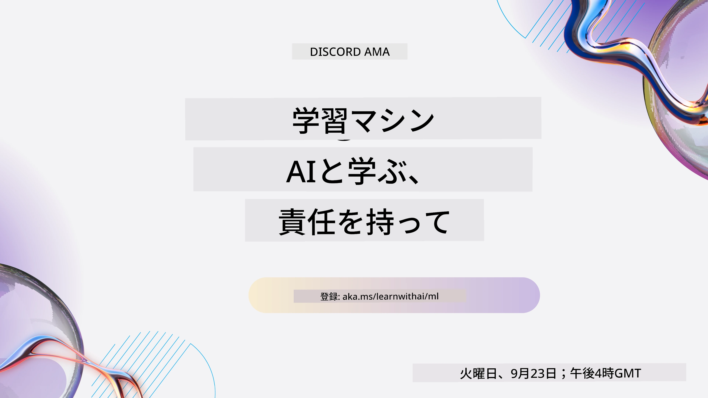
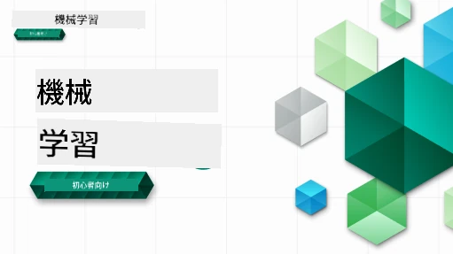

<!--
CO_OP_TRANSLATOR_METADATA:
{
  "original_hash": "ec8385130a8239ad9d827175126a0722",
  "translation_date": "2026-01-01T10:49:00+00:00",
  "source_file": "README.md",
  "language_code": "ja"
}
-->

### 🌐 多言語サポート

#### GitHub Action によるサポート（自動化および常に最新）

<!-- CO-OP TRANSLATOR LANGUAGES TABLE START -->
[アラビア語](../ar/README.md) | [ベンガル語](../bn/README.md) | [ブルガリア語](../bg/README.md) | [ビルマ語（ミャンマー）](../my/README.md) | [中国語（簡体字）](../zh/README.md) | [中国語（繁体字、香港）](../hk/README.md) | [中国語（繁体字、マカオ）](../mo/README.md) | [中国語（繁体字、台湾）](../tw/README.md) | [クロアチア語](../hr/README.md) | [チェコ語](../cs/README.md) | [デンマーク語](../da/README.md) | [オランダ語](../nl/README.md) | [エストニア語](../et/README.md) | [フィンランド語](../fi/README.md) | [フランス語](../fr/README.md) | [ドイツ語](../de/README.md) | [ギリシャ語](../el/README.md) | [ヘブライ語](../he/README.md) | [ヒンディー語](../hi/README.md) | [ハンガリー語](../hu/README.md) | [インドネシア語](../id/README.md) | [イタリア語](../it/README.md) | [日本語](./README.md) | [カンナダ語](../kn/README.md) | [韓国語](../ko/README.md) | [リトアニア語](../lt/README.md) | [マレー語](../ms/README.md) | [マラヤーラム語](../ml/README.md) | [マラーティー語](../mr/README.md) | [ネパール語](../ne/README.md) | [ナイジェリア・ピジン](../pcm/README.md) | [ノルウェー語](../no/README.md) | [ペルシア語（ファールシー）](../fa/README.md) | [ポーランド語](../pl/README.md) | [ポルトガル語（ブラジル）](../br/README.md) | [ポルトガル語（ポルトガル）](../pt/README.md) | [パンジャービー語（グルムキー）](../pa/README.md) | [ルーマニア語](../ro/README.md) | [ロシア語](../ru/README.md) | [セルビア語（キリル文字）](../sr/README.md) | [スロバキア語](../sk/README.md) | [スロベニア語](../sl/README.md) | [スペイン語](../es/README.md) | [スワヒリ語](../sw/README.md) | [スウェーデン語](../sv/README.md) | [タガログ語（フィリピン）](../tl/README.md) | [タミル語](../ta/README.md) | [テルグ語](../te/README.md) | [タイ語](../th/README.md) | [トルコ語](../tr/README.md) | [ウクライナ語](../uk/README.md) | [ウルドゥー語](../ur/README.md) | [ベトナム語](../vi/README.md)
<!-- CO-OP TRANSLATOR LANGUAGES TABLE END -->

#### コミュニティに参加する

私たちは Discord 上で「Learn with AI」シリーズを開催しています。詳細や参加は 2025年9月18日～30日の期間に [Learn with AI シリーズ](https://aka.ms/learnwithai/discord) でご案内しています。データサイエンス向けの GitHub Copilot の使い方に関するヒントやコツが得られます。

# 機械学習入門 - カリキュラム

> 🌍 世界の文化を通して機械学習を探求しながら世界を旅しましょう 🌍

Microsoft の Cloud Advocates は、12 週間・26 課からなる **機械学習** に関するカリキュラムを提供できることを嬉しく思います。本カリキュラムでは、主に Scikit-learn をライブラリとして使用し、ディープラーニングを避ける、いわゆる **クラシック機械学習** を学びます。ディープラーニングは私たちの [AI for Beginners のカリキュラム](https://aka.ms/ai4beginners) で扱っています。これらのレッスンは ['Data Science for Beginners' のカリキュラム](https://aka.ms/ds4beginners) と組み合わせても学習できます。

世界各地のデータにこれらのクラシックな手法を適用しながら一緒に旅をしましょう。各レッスンには、事前・事後のクイズ、レッスンを完了するための文書による手順、解答、課題などが含まれます。プロジェクトベースの教育法により、実際に作りながら学ぶことで新しいスキルが定着しやすくなります。

**✍️ 著者の皆様へ心より感謝** Jen Looper, Stephen Howell, Francesca Lazzeri, Tomomi Imura, Cassie Breviu, Dmitry Soshnikov, Chris Noring, Anirban Mukherjee, Ornella Altunyan, Ruth Yakubu and Amy Boyd

**🎨 イラストレーターの皆様にも感謝** Tomomi Imura, Dasani Madipalli, and Jen Looper

**🙏 特別な感謝 🙏 Microsoft Student Ambassador の著者、レビュワー、コンテンツ寄稿者の皆様へ** 特に Rishit Dagli, Muhammad Sakib Khan Inan, Rohan Raj, Alexandru Petrescu, Abhishek Jaiswal, Nawrin Tabassum, Ioan Samuila, and Snigdha Agarwal に感謝します

**🤩 R レッスンに関しては Microsoft Student Ambassadors の Eric Wanjau, Jasleen Sondhi, そして Vidushi Gupta に特別な感謝を！**

# はじめに

次の手順に従ってください：
1. **リポジトリをフォークする**: このページの右上にある「Fork」ボタンをクリックしてください。
2. **リポジトリをクローンする**:   `git clone https://github.com/microsoft/ML-For-Beginners.git`

> [このコースの追加リソースはすべて Microsoft Learn コレクションで確認できます](https://learn.microsoft.com/en-us/collections/qrqzamz1nn2wx3?WT.mc_id=academic-77952-bethanycheum)

> 🔧 **ヘルプが必要ですか？** インストール、セットアップ、レッスンの実行に関する一般的な問題の解決策は [トラブルシューティング ガイド](TROUBLESHOOTING.md) をご確認ください。

**[学生の皆さん](https://aka.ms/student-page)**、このカリキュラムを使用するには、リポジトリ全体を自分の GitHub アカウントにフォークし、個人またはグループで演習を完了してください:

- 事前講義クイズから始めてください。
- 講義を読み、各知識確認時に立ち止まって振り返りながらアクティビティを完了してください。
- 解答コードを実行するのではなく、学んだ内容を理解してプロジェクトを作成することを試みてください。ただし、そのコードは各プロジェクト指向レッスンの `/solution` フォルダーに用意されています。
- 講義後のクイズを受けてください。
- チャレンジを完了してください。
- 課題を完了してください。
- レッスングループを完了したら、[ディスカッションボード](https://github.com/microsoft/ML-For-Beginners/discussions) にアクセスして、適切な PAT ルーブリックに記入することで「学んでいることを公開」してください。'PAT' は学習を深めるために記入する進捗評価ツール（Progress Assessment Tool）です。他の PAT にリアクションすることもでき、一緒に学べます。

> さらなる学習には、これらの [Microsoft Learn](https://docs.microsoft.com/en-us/users/jenlooper-2911/collections/k7o7tg1gp306q4?WT.mc_id=academic-77952-leestott) のモジュールと学習パスをおすすめします。

**教育者の皆様**、このカリキュラムの使い方に関する [いくつかの提案](for-teachers.md) を含めています。

---

## ビデオウォークスルー

一部のレッスンは短い動画として利用できます。これらはレッスン内でインラインに表示されているほか、下の画像をクリックして [Microsoft Developer の YouTube チャンネル上の ML for Beginners プレイリスト](https://aka.ms/ml-beginners-videos) でもご覧いただけます。

---

## チーム紹介

**Gif 制作者** [Mohit Jaisal](https://linkedin.com/in/mohitjaisal)

> 🎥 上の画像をクリックすると、このプロジェクトと作成者に関するビデオをご覧いただけます！

---

## 教授法

このカリキュラムを構築するにあたり、私たちは二つの教育原則を選びました：ハンズオンであること（プロジェクトベース）と、頻繁なクイズを含めることです。さらに、このカリキュラムには一貫性を持たせるための共通の **テーマ** があります。

コンテンツをプロジェクトに整合させることで、学習者の興味が引き出され、概念の定着が強化されます。授業前の低リスクなクイズは学習への意図づけを行い、授業後のクイズはさらなる定着を促します。このカリキュラムは柔軟で楽しく、全体または一部を受講することができます。プロジェクトは小さく始まり、12 週間のサイクルの終わりまでに段階的に複雑になります。また、このカリキュラムには機械学習の実世界での応用に関する付録が含まれており、追加クレジットや討論の基盤として利用できます。

> 私たちの [行動規範](CODE_OF_CONDUCT.md)、[貢献ガイド](CONTRIBUTING.md)、[翻訳](TRANSLATIONS.md)、および [トラブルシューティング](TROUBLESHOOTING.md) のガイドラインもご覧ください。建設的なフィードバックをお待ちしています！

## 各レッスンに含まれるもの

- スケッチノート（オプション）
- 補助ビデオ（オプション）
- ビデオウォークスルー（レッスンによる）
- [講義前ウォームアップクイズ](https://ff-quizzes.netlify.app/en/ml/)
- テキストによるレッスン
- プロジェクトベースのレッスンには、プロジェクト構築の手順ガイド
- 知識確認
- チャレンジ
- 補足読み物
- 課題
- [講義後のクイズ](https://ff-quizzes.netlify.app/en/ml/)

> **言語についての注**: これらのレッスンは主に Python で書かれていますが、多くは R でも利用可能です。R のレッスンを完了するには、/solution フォルダーに移動して R レッスンを探してください。これらには .rmd 拡張子が含まれており、**R Markdown** ファイルを表します。これは簡単に言えば、`code chunks`（R や他の言語の）と `YAML header`（PDF などの出力形式の書式を指示する）を `Markdown document` に埋め込んだものと定義できます。このため、コード、その出力、そして考察を Markdown に書き下ろすことで組み合わせられ、データサイエンスのための優れた作成フレームワークとなります。さらに、R Markdown ドキュメントは PDF、HTML、Word といった出力形式にレンダリングできます。

> **クイズについての注**: すべてのクイズは [Quiz App フォルダー](../../quiz-app) に含まれており、全 52 回のクイズがあり、それぞれ 3 問です。クイズはレッスン内からリンクされていますが、クイズアプリはローカルでも実行できます。ローカルでホストするか Azure にデプロイするには、`quiz-app` フォルダー内の手順に従ってください。

| レッスン番号 |                             トピック                              |                   レッスンの分類                   | 学習目標                                                                                                             |                                                              関連レッスン                                                               |                        著者                        |
| :-----------: | :------------------------------------------------------------: | :-------------------------------------------------: | ------------------------------------------------------------------------------------------------------------------------------- | :--------------------------------------------------------------------------------------------------------------------------------------: | :--------------------------------------------------: |
|      01       |                機械学習入門                |      [導入](1-Introduction/README.md)       | 機械学習の基本概念を学ぶ                                                                                |                                             [レッスン](1-Introduction/1-intro-to-ML/README.md)                                             |                       Muhammad                       |
|      02       |                機械学習の歴史                 |      [導入](1-Introduction/README.md)       | この分野における歴史を学ぶ                                                                                         |                                            [レッスン](1-Introduction/2-history-of-ML/README.md)                                            |                     Jen and Amy                      |
|      03       |                 公平性と機械学習                  |      [導入](1-Introduction/README.md)       | 学生がMLモデルを構築・適用する際に考慮すべき、公平性に関する重要な哲学的問題は何か？ |                                              [レッスン](1-Introduction/3-fairness/README.md)                                               |                        Tomomi                        |
|      04       |                機械学習の手法                 |      [導入](1-Introduction/README.md)       | ML研究者がMLモデルを構築するために用いる手法は何か？                                                                       |                                          [レッスン](1-Introduction/4-techniques-of-ML/README.md)                                           |                    Chris and Jen                     |
|      05       |                   回帰入門                   |        [回帰](2-Regression/README.md)         | 回帰モデルのためのPythonとScikit-learnの入門                                                                  |         [Python](2-Regression/1-Tools/README.md) • [R](../../2-Regression/1-Tools/solution/R/lesson_1.html)         |      Jen • Eric Wanjau       |
|      06       |                北米のかぼちゃの価格 🎃                |        [回帰](2-Regression/README.md)         | MLの準備としてデータを可視化し、クリーニングする                                                                                  |          [Python](2-Regression/2-Data/README.md) • [R](../../2-Regression/2-Data/solution/R/lesson_2.html)          |      Jen • Eric Wanjau       |
|      07       |                北米のかぼちゃの価格 🎃                |        [回帰](2-Regression/README.md)         | 線形および多項式回帰モデルを構築する                                                                                   |        [Python](2-Regression/3-Linear/README.md) • [R](../../2-Regression/3-Linear/solution/R/lesson_3.html)        |      Jen and Dmitry • Eric Wanjau       |
|      08       |                北米のかぼちゃの価格 🎃                |        [回帰](2-Regression/README.md)         | ロジスティック回帰モデルを構築する                                                                                               |     [Python](2-Regression/4-Logistic/README.md) • [R](../../2-Regression/4-Logistic/solution/R/lesson_4.html)      |      Jen • Eric Wanjau       |
|      09       |                          Webアプリ 🔌                          |           [Web App](3-Web-App/README.md)            | 学習済みモデルを利用するWebアプリを構築する                                                                                       |                                                 [Python](3-Web-App/1-Web-App/README.md)                                                  |                         Jen                          |
|      10       |                 分類入門                 |    [分類](4-Classification/README.md)     | データのクリーンアップ、前処理、可視化；分類の入門                                                            | [Python](4-Classification/1-Introduction/README.md) • [R](../../4-Classification/1-Introduction/solution/R/lesson_10.html)  | Jen and Cassie • Eric Wanjau |
|      11       |             おいしいアジア・インド料理 🍜             |    [分類](4-Classification/README.md)     | 分類器の入門                                                                                                     | [Python](4-Classification/2-Classifiers-1/README.md) • [R](../../4-Classification/2-Classifiers-1/solution/R/lesson_11.html) | Jen and Cassie • Eric Wanjau |
|      12       |             おいしいアジア・インド料理 🍜             |    [分類](4-Classification/README.md)     | その他の分類器                                                                                                                | [Python](4-Classification/3-Classifiers-2/README.md) • [R](../../4-Classification/3-Classifiers-2/solution/R/lesson_12.html) | Jen and Cassie • Eric Wanjau |
|      13       |             おいしいアジア・インド料理 🍜             |    [分類](4-Classification/README.md)     | モデルを使ってレコメンダーのWebアプリを構築する                                                                                    |                                              [Python](4-Classification/4-Applied/README.md)                                              |                         Jen                          |
|      14       |                   クラスタリング入門                   |        [クラスタリング](5-Clustering/README.md)         | データのクリーンアップ、前処理、可視化；クラスタリングの入門                                                                |         [Python](5-Clustering/1-Visualize/README.md) • [R](../../5-Clustering/1-Visualize/solution/R/lesson_14.html)         |      Jen • Eric Wanjau       |
|      15       |              ナイジェリアの音楽の好みを探る 🎧              |        [クラスタリング](5-Clustering/README.md)         | K平均法（K-Means）クラスタリング手法を探る                                                                                           |           [Python](5-Clustering/2-K-Means/README.md) • [R](../../5-Clustering/2-K-Means/solution/R/lesson_15.html)           |      Jen • Eric Wanjau       |
|      16       |        自然言語処理入門 ☕️         |   [自然言語処理](6-NLP/README.md)    | 簡単なボットを構築してNLPの基本を学ぶ                                                                             |                                             [Python](6-NLP/1-Introduction-to-NLP/README.md)                                              |                       Stephen                        |
|      17       |                      一般的なNLPタスク ☕️                      |   [自然言語処理](6-NLP/README.md)    | 言語構造を扱う際に必要となる一般的なタスクを理解することでNLPの知識を深める                          |                                                    [Python](6-NLP/2-Tasks/README.md)                                                     |                       Stephen                        |
|      18       |             翻訳と感情分析 ♥️              |   [自然言語処理](6-NLP/README.md)    | ジェーン・オースティンの作品を用いた翻訳と感情分析                                                                             |                                            [Python](6-NLP/3-Translation-Sentiment/README.md)                                             |                       Stephen                        |
|      19       |                  ヨーロッパのロマンチックなホテル ♥️                  |   [自然言語処理](6-NLP/README.md)    | ホテルレビューを用いた感情分析 1                                                                                         |                                               [Python](6-NLP/4-Hotel-Reviews-1/README.md)                                                |                       Stephen                        |
|      20       |                  ヨーロッパのロマンチックなホテル ♥️                  |   [自然言語処理](6-NLP/README.md)    | ホテルレビューを用いた感情分析 2                                                                                         |                                               [Python](6-NLP/5-Hotel-Reviews-2/README.md)                                                |                       Stephen                        |
|      21       |            時系列予測入門             |        [時系列](7-TimeSeries/README.md)        | 時系列予測の入門                                                                                         |                                             [Python](7-TimeSeries/1-Introduction/README.md)                                              |                      Francesca                       |
|      22       | ⚡️ 世界の電力使用量 ⚡️ - ARIMAによる時系列予測 |        [時系列](7-TimeSeries/README.md)        | ARIMAによる時系列予測                                                                                              |                                                 [Python](7-TimeSeries/2-ARIMA/README.md)                                                 |                      Francesca                       |
|      23       |  ⚡️ 世界の電力使用量 ⚡️ - SVRによる時系列予測  |        [時系列](7-TimeSeries/README.md)        | サポートベクター回帰（SVR）による時系列予測                                                                           |                                                  [Python](7-TimeSeries/3-SVR/README.md)                                                  |                       Anirban                        |
|      24       |             強化学習入門             | [強化学習](8-Reinforcement/README.md) | Q学習による強化学習の入門                                                                          |                                             [Python](8-Reinforcement/1-QLearning/README.md)                                              |                        Dmitry                        |
|      25       |                 ピーターがオオカミを避けるのを助けよう！ 🐺                  | [強化学習](8-Reinforcement/README.md) | Gymを使った強化学習                                                                                                      |                                                [Python](8-Reinforcement/2-Gym/README.md)                                                 |                        Dmitry                        |
|  Postscript   |            実世界のMLシナリオと適用例            |      [ML in the Wild](9-Real-World/README.md)       | 古典的なMLの興味深く示唆に富む実世界での応用例                                                               |                                             [レッスン](9-Real-World/1-Applications/README.md)                                              |                         チーム                         |
|  Postscript   |            RAIダッシュボードを使用したMLにおけるモデルデバッグ          |      [ML in the Wild](9-Real-World/README.md)       | Responsible AIダッシュボードコンポーネントを使用した機械学習モデルのデバッグ                                                              |                                             [レッスン](9-Real-World/2-Debugging-ML-Models/README.md)                                              |                         Ruth Yakubu                       |

> [このコースの追加リソースはすべて、Microsoft Learn コレクションで見つけられます](https://learn.microsoft.com/en-us/collections/qrqzamz1nn2wx3?WT.mc_id=academic-77952-bethanycheum)

## オフラインアクセス

このドキュメントは [Docsify](https://docsify.js.org/#/) を使用してオフラインで実行できます。リポジトリをフォークし、ローカルマシンに [Docsify をインストール](https://docsify.js.org/#/quickstart) した後、このリポジトリのルートフォルダーで `docsify serve` と入力してください。Webサイトはローカルホストのポート3000で提供されます: `localhost:3000`.

## PDF

リンク付きのカリキュラムのPDFは[こちら](https://microsoft.github.io/ML-For-Beginners/pdf/readme.pdf)にあります。

## 🎒 その他のコース 

私たちのチームは他のコースも制作しています！ぜひご覧ください:

<!-- CO-OP TRANSLATOR OTHER COURSES START -->
### LangChain

---

### Azure / Edge / MCP / Agents

---
 
### 生成AIシリーズ

[-9333EA?style=for-the-badge&labelColor=E5E7EB&color=9333EA)](https://github.com/microsoft/Generative-AI-for-beginners-dotnet?WT.mc_id=academic-105485-koreyst)
[-C084FC?style=for-the-badge&labelColor=E5E7EB&color=C084FC)](https://github.com/microsoft/generative-ai-for-beginners-java?WT.mc_id=academic-105485-koreyst)
[-E879F9?style=for-the-badge&labelColor=E5E7EB&color=E879F9)](https://github.com/microsoft/generative-ai-with-javascript?WT.mc_id=academic-105485-koreyst)

---
 
### コア学習

---
 
### Copilot シリーズ

<!-- CO-OP TRANSLATOR OTHER COURSES END -->

## ヘルプを得る

AI アプリの構築中に行き詰まったり質問がある場合は、他の学習者や経験豊富な開発者と MCP に関するディスカッションに参加してください。そこは質問が歓迎され、知識が自由に共有されるサポートに満ちたコミュニティです。

構築中に製品のフィードバックやエラーがある場合は、次をご覧ください:

---

<!-- CO-OP TRANSLATOR DISCLAIMER START -->
免責事項：
この文書はAI翻訳サービス「Co‑op Translator」(https://github.com/Azure/co-op-translator)を使用して翻訳されました。正確性には努めていますが、自動翻訳には誤りや不正確な表現が含まれる可能性があることにご注意ください。原文（原言語の文書）を正式な出典としてご参照ください。重要な情報については専門の人間による翻訳を推奨します。本翻訳の利用により生じた誤解や解釈の相違について、当方は責任を負いません。
<!-- CO-OP TRANSLATOR DISCLAIMER END -->