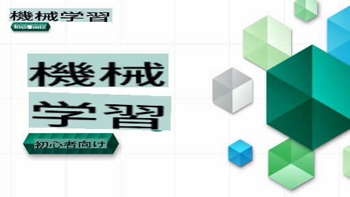

# 初心者のための機械学習 - カリキュラム

> 🌍 世界中を旅しながら、世界の文化を通じて機械学習を学びましょう 🌍

MicrosoftのCloud Advocatesは、**機械学習**に関する12週間、26レッスンのカリキュラムを提供します。このカリキュラムでは、主にScikit-learnライブラリを使用して、**クラシックな機械学習**と呼ばれることもある技術を学びます。ディープラーニングは含まれていませんが、それについては[AI for Beginners' カリキュラム](https://aka.ms/ai4beginners)で学ぶことができます。このレッスンを['データサイエンス初心者向けカリキュラム'](https://aka.ms/ds4beginners)と組み合わせることもお勧めします。

世界各地のデータを使って、クラシックな技術を適用しながら一緒に学びましょう。各レッスンには、事前・事後のクイズ、レッスンを完了するための書面による指示、解答、課題などが含まれています。プロジェクトベースの教育方法により、学びながら実践することで新しいスキルが定着しやすくなります。

**✍️ 著者の皆さんに心からの感謝を** Jen Looper, Stephen Howell, Francesca Lazzeri, Tomomi Imura, Cassie Breviu, Dmitry Soshnikov, Chris Noring, Anirban Mukherjee, Ornella Altunyan, Ruth Yakubu, Amy Boyd

**🎨 イラストレーターの皆さんにも感謝を** Tomomi Imura, Dasani Madipalli, Jen Looper

**🙏 特別な感謝 🙏 Microsoft Student Ambassadorの著者、レビューアー、コンテンツ貢献者の皆さんに、特に Rishit Dagli, Muhammad Sakib Khan Inan, Rohan Raj, Alexandru Petrescu, Abhishek Jaiswal, Nawrin Tabassum, Ioan Samuila, Snigdha Agarwal

**🤩 Rレッスンに関して、Microsoft Student Ambassadorsの Eric Wanjau, Jasleen Sondhi, Vidushi Gupta に特別な感謝を！**

# 始めに

以下の手順に従ってください：
1. **リポジトリをフォークする**: このページの右上にある「Fork」ボタンをクリックします。
2. **リポジトリをクローンする**: `git clone https://github.com/microsoft/ML-For-Beginners.git`

> [このコースの追加リソースはMicrosoft Learnコレクションにあります](https://learn.microsoft.com/en-us/collections/qrqzamz1nn2wx3?WT.mc_id=academic-77952-bethanycheum)

**[学生の皆さん](https://aka.ms/student-page)**、このカリキュラムを使用するには、リポジトリ全体を自分のGitHubアカウントにフォークし、自分でまたはグループで演習を完了してください：

- レクチャー前のクイズから始めます。
- レクチャーを読み、各知識チェックで一時停止し、反省します。
- 解答コードを実行するのではなく、レッスンを理解しながらプロジェクトを作成してみてください。ただし、そのコードは各プロジェクト指向のレッスンの`/solution`フォルダーにあります。
- レクチャー後のクイズを受けます。
- チャレンジを完了します。
- 課題を完了します。
- レッスングループを完了した後、[ディスカッションボード](https://github.com/microsoft/ML-For-Beginners/discussions)にアクセスし、適切なPATルーブリックを記入して「声に出して学ぶ」ことをお勧めします。PATは進捗評価ツールで、学習を深めるために記入するルーブリックです。他のPATに反応することもでき、一緒に学びましょう。

> さらなる学習のために、これらの[Microsoft Learn](https://docs.microsoft.com/en-us/users/jenlooper-2911/collections/k7o7tg1gp306q4?WT.mc_id=academic-77952-leestott)モジュールと学習パスをお勧めします。

**教師の皆さん**、このカリキュラムの使用方法について[いくつかの提案](for-teachers.md)を含めています。

---

## ビデオウォークスルー

いくつかのレッスンは短い形式のビデオとして提供されています。これらはレッスン内にインラインで見つけることができます。または、Microsoft Developer YouTubeチャンネルの[ML for Beginnersプレイリスト](https://aka.ms/ml-beginners-videos)で画像をクリックして視聴できます。

---

## チーム紹介

**Gif by** [Mohit Jaisal](https://linkedin.com/in/mohitjaisal)

> 🎥 上の画像をクリックして、プロジェクトと作成者についてのビデオをご覧ください！

---

## 教育方法

このカリキュラムを作成する際に、2つの教育的な原則を選びました：それが実践的な**プロジェクトベース**であることと、**頻繁なクイズ**を含むことです。さらに、このカリキュラムには一貫性を持たせるための共通の**テーマ**があります。

プロジェクトに合わせてコンテンツを整えることで、学習者にとってより魅力的なプロセスとなり、概念の定着が強化されます。また、クラス前の低リスクのクイズは、学習者の意図をトピックに向けさせ、クラス後の2回目のクイズはさらなる定着を確保します。このカリキュラムは柔軟で楽しいものとして設計されており、全体または一部を受講することができます。プロジェクトは小さなものから始まり、12週間のサイクルの終わりまでに徐々に複雑になります。また、このカリキュラムには、MLの実世界での応用に関する後書きが含まれており、追加のクレジットやディスカッションの基礎として使用できます。

> [行動規範](CODE_OF_CONDUCT.md)、[貢献](CONTRIBUTING.md)、および[翻訳](TRANSLATIONS.md)ガイドラインをご覧ください。建設的なフィードバックを歓迎します！

## 各レッスンには以下が含まれます

- オプションのスケッチノート
- オプションの補足ビデオ
- ビデオウォークスルー（いくつかのレッスンのみ）
- レクチャー前のウォームアップクイズ
- 書面によるレッスン
- プロジェクトベースのレッスンの場合、プロジェクトを構築するためのステップバイステップガイド
- 知識チェック
- チャレンジ
- 補足読書
- 課題
- レクチャー後のクイズ

> **言語に関する注意**: これらのレッスンは主にPythonで書かれていますが、多くはRでも利用可能です。Rレッスンを完了するには、`/solution`フォルダーに移動し、Rレッスンを探してください。それらには.rmd拡張子が含まれており、`code chunks`（Rまたは他の言語の）と`YAML header`（PDFなどの出力をフォーマットする方法を指示する）を`Markdown document`に埋め込んだものと簡単に定義できます。したがって、データサイエンスのための優れた著作フレームワークとして機能し、コード、その出力、およびMarkdownで書き留めることができる考えを組み合わせることができます。さらに、R MarkdownドキュメントはPDF、HTML、Wordなどの出力形式にレンダリングできます。

> **クイズに関する注意**: すべてのクイズは[Quiz Appフォルダー](../../quiz-app)に含まれており、合計52のクイズがあり、それぞれ3つの質問が含まれています。それらはレッスン内からリンクされていますが、クイズアプリはローカルで実行できます。ローカルでホストするかAzureにデプロイする手順は`quiz-app`フォルダーに従ってください。

| レッスン番号 |                             トピック                             |                   レッスングループ                   | 学習目標                                                                                                               |                                                              リンク先レッスン                                                               |                        著者                        |
| :-----------: | :------------------------------------------------------------: | :-------------------------------------------------: | ------------------------------------------------------------------------------------------------------------------------------- | :--------------------------------------------------------------------------------------------------------------------------------------: | :--------------------------------------------------: |
|      01       |                機械学習の紹介                |      [Introduction](1-Introduction/README.md)       | 機械学習の基本的な概念を学ぶ                                                                                |                                             [レッスン](1-Introduction/1-intro-to-ML/README.md)                                             |                       Muhammad                       |
|      02       |                機械学習の歴史                 |      [Introduction](1-Introduction/README.md)       | この分野の歴史を学ぶ                                                                                         |                                            [レッスン](1-Introduction/2-history-of-ML/README.md)                                            |                     Jen and Amy                      |
|      03       |                 公平性と機械学習                  |      [Introduction](1-Introduction/README.md)       | 学生がMLモデルを構築および適用する際に考慮すべき重要な哲学的問題とは？ |                                              [レッスン](1-Introduction/3-fairness/README.md)                                               |                        Tomomi                        |
|      04       |                機械学習のテクニック                 |      [Introduction](1-Introduction/README.md)       | ML研究者がMLモデルを構築するために使用するテクニックとは？                                                                       |                                          [Lesson](1-Introduction/4-techniques-of-ML/README.md)                                           |                    Chris and Jen                     |
|      05       |                   回帰の入門                   |        [Regression](2-Regression/README.md)         | 回帰モデルのためのPythonとScikit-learnの入門                                                                  |         <ul><li>[Python](2-Regression/1-Tools/README.md)</li><li>[R](../../2-Regression/1-Tools/solution/R/lesson_1.html)</li></ul>         |      <ul><li>Jen</li><li>Eric Wanjau</li></ul>       |
|      06       |                北米のカボチャの価格 🎃                |        [Regression](2-Regression/README.md)         | MLの準備としてデータの可視化とクリーニング                                                                                  |          <ul><li>[Python](2-Regression/2-Data/README.md)</li><li>[R](../../2-Regression/2-Data/solution/R/lesson_2.html)</li></ul>          |      <ul><li>Jen</li><li>Eric Wanjau</li></ul>       |
|      07       |                北米のカボチャの価格 🎃                |        [Regression](2-Regression/README.md)         | 線形および多項式回帰モデルの構築                                                                                   |        <ul><li>[Python](2-Regression/3-Linear/README.md)</li><li>[R](../../2-Regression/3-Linear/solution/R/lesson_3.html)</li></ul>        |      <ul><li>Jen and Dmitry</li><li>Eric Wanjau</li></ul>       |
|      08       |                北米のカボチャの価格 🎃                |        [Regression](2-Regression/README.md)         | ロジスティック回帰モデルの構築                                                                                               |     <ul><li>[Python](2-Regression/4-Logistic/README.md) </li><li>[R](../../2-Regression/4-Logistic/solution/R/lesson_4.html)</li></ul>      |      <ul><li>Jen</li><li>Eric Wanjau</li></ul>       |
|      09       |                          ウェブアプリ 🔌                          |           [Web App](3-Web-App/README.md)            | トレーニング済みモデルを使用するウェブアプリの構築                                                                                       |                                                 [Python](3-Web-App/1-Web-App/README.md)                                                  |                         Jen                          |
|      10       |                 分類の入門                 |    [Classification](4-Classification/README.md)     | データのクリーニング、準備、可視化；分類の入門                                                            | <ul><li> [Python](4-Classification/1-Introduction/README.md) </li><li>[R](../../4-Classification/1-Introduction/solution/R/lesson_10.html)  | <ul><li>Jen and Cassie</li><li>Eric Wanjau</li></ul> |
|      11       |             美味しいアジアとインドの料理 🍜             |    [Classification](4-Classification/README.md)     | クラス分類器の入門                                                                                                     | <ul><li> [Python](4-Classification/2-Classifiers-1/README.md)</li><li>[R](../../4-Classification/2-Classifiers-1/solution/R/lesson_11.html) | <ul><li>Jen and Cassie</li><li>Eric Wanjau</li></ul> |
|      12       |             美味しいアジアとインドの料理 🍜             |    [Classification](4-Classification/README.md)     | さらに多くのクラス分類器                                                                                                                | <ul><li> [Python](4-Classification/3-Classifiers-2/README.md)</li><li>[R](../../4-Classification/3-Classifiers-2/solution/R/lesson_12.html) | <ul><li>Jen and Cassie</li><li>Eric Wanjau</li></ul> |
|      13       |             美味しいアジアとインドの料理 🍜             |    [Classification](4-Classification/README.md)     | モデルを使用してレコメンダーウェブアプリを構築                                                                                    |                                              [Python](4-Classification/4-Applied/README.md)                                              |                         Jen                          |
|      14       |                   クラスタリングの入門                   |        [Clustering](5-Clustering/README.md)         | データのクリーニング、準備、可視化；クラスタリングの入門                                                                |         <ul><li> [Python](5-Clustering/1-Visualize/README.md)</li><li>[R](../../5-Clustering/1-Visualize/solution/R/lesson_14.html)         |      <ul><li>Jen</li><li>Eric Wanjau</li></ul>       |
|      15       |              ナイジェリアの音楽の好みを探る 🎧              |        [Clustering](5-Clustering/README.md)         | K-Meansクラスタリング法を探求する                                                                                           |           <ul><li> [Python](5-Clustering/2-K-Means/README.md)</li><li>[R](../../5-Clustering/2-K-Means/solution/R/lesson_15.html)           |      <ul><li>Jen</li><li>Eric Wanjau</li></ul>       |
|      16       |        自然言語処理の紹介 ☕️         |   [Natural language processing](6-NLP/README.md)    | シンプルなボットを作成してNLPの基本を学ぶ                                                                             |                                             [Python](6-NLP/1-Introduction-to-NLP/README.md)                                              |                       Stephen                        |
|      17       |                      一般的なNLPタスク ☕️                      |   [Natural language processing](6-NLP/README.md)    | 言語構造を扱う際に必要な一般的なタスクを理解してNLPの知識を深める                          |                                                    [Python](6-NLP/2-Tasks/README.md)                                                     |                       Stephen                        |
|      18       |             翻訳と感情分析 ♥️              |   [Natural language processing](6-NLP/README.md)    | ジェーン・オースティンを使った翻訳と感情分析                                                                             |                                            [Python](6-NLP/3-Translation-Sentiment/README.md)                                             |                       Stephen                        |
|      19       |                  ヨーロッパのロマンチックなホテル ♥️                  |   [Natural language processing](6-NLP/README.md)    | ホテルレビューを使った感情分析 1                                                                                         |                                               [Python](6-NLP/4-Hotel-Reviews-1/README.md)                                                |                       Stephen                        |
|      20       |                  ヨーロッパのロマンチックなホテル ♥️                  |   [Natural language processing](6-NLP/README.md)    | ホテルレビューを使った感情分析 2                                                                                         |                                               [Python](6-NLP/5-Hotel-Reviews-2/README.md)                                                |                       Stephen                        |
|      21       |            時系列予測の紹介             |        [Time series](7-TimeSeries/README.md)        | 時系列予測の紹介                                                                                         |                                             [Python](7-TimeSeries/1-Introduction/README.md)                                              |                      Francesca                       |
|      22       | ⚡️ 世界の電力使用 ⚡️ - ARIMAによる時系列予測 |        [Time series](7-TimeSeries/README.md)        | ARIMAによる時系列予測                                                                                              |                                                 [Python](7-TimeSeries/2-ARIMA/README.md)                                                 |                      Francesca                       |
|      23       |  ⚡️ 世界の電力使用 ⚡️ - SVRによる時系列予測  |        [Time series](7-TimeSeries/README.md)        | サポートベクターレグレッサーによる時系列予測                                                                           |                                                  [Python](7-TimeSeries/3-SVR/README.md)                                                  |                       Anirban                        |
|      24       |             強化学習の紹介             | [Reinforcement learning](8-Reinforcement/README.md) | Q-Learningによる強化学習の紹介                                                                          |                                             [Python](8-Reinforcement/1-QLearning/README.md)                                              |                        Dmitry                        |
|      25       |                 ピーターがオオカミを避けるのを助けよう！ 🐺                  | [Reinforcement learning](8-Reinforcement/README.md) | 強化学習ジム                                                                                                      |                                                [Python](8-Reinforcement/2-Gym/README.md)                                                 |                        Dmitry                        |
|  Postscript   |            現実世界のMLシナリオとアプリケーション            |      [ML in the Wild](9-Real-World/README.md)       | 古典的なMLの興味深く、明らかな現実世界のアプリケーション                                                               |                                             [Lesson](9-Real-World/1-Applications/README.md)                                              |                         Team                         |
|  Postscript   |            RAIダッシュボードを使用したMLのモデルデバッグ          |      [ML in the Wild](9-Real-World/README.md)       | Responsible AIダッシュボードコンポーネントを使用した機械学習のモデルデバッグ                                                              |                                             [Lesson](9-Real-World/2-Debugging-ML-Models/README.md)                                              |                         Ruth Yakubu                       |

> [このコースの追加リソースはMicrosoft Learnのコレクションで見つけることができます](https://learn.microsoft.com/en-us/collections/qrqzamz1nn2wx3?WT.mc_id=academic-77952-bethanycheum)

## オフラインアクセス

[Docsify](https://docsify.js.org/#/)を使用してこのドキュメントをオフラインで実行できます。このリポジトリをフォークし、ローカルマシンに[Docsifyをインストール](https://docsify.js.org/#/quickstart)し、このリポジトリのルートフォルダで`docsify serve`を入力します。ウェブサイトはlocalhostのポート3000で提供されます：`localhost:3000`。

## PDFs
[ここ](https://microsoft.github.io/ML-For-Beginners/pdf/readme.pdf)でリンク付きのカリキュラムのPDFを見つけてください。

## 助けが必要です

翻訳に貢献したいですか？私たちの[翻訳ガイドライン](TRANSLATIONS.md)を読んで、作業負荷を管理するためのテンプレート化されたイシューを[こちら](https://github.com/microsoft/ML-For-Beginners/issues)に追加してください。

## その他のカリキュラム

私たちのチームは他のカリキュラムも制作しています！以下をご覧ください：

- [AI for Beginners](https://aka.ms/ai4beginners)
- [Data Science for Beginners](https://aka.ms/datascience-beginners)
- [**New Version 2.0** - Generative AI for Beginners](https://aka.ms/genai-beginners)
- [**NEW** Cybersecurity for Beginners](https://github.com/microsoft/Security-101??WT.mc_id=academic-96948-sayoung)
- [Web Dev for Beginners](https://aka.ms/webdev-beginners)
- [IoT for Beginners](https://aka.ms/iot-beginners)
- [Machine Learning for Beginners](https://aka.ms/ml4beginners)
- [XR Development for Beginners](https://aka.ms/xr-dev-for-beginners)
- [Mastering GitHub Copilot for AI Paired Programming](https://aka.ms/GitHubCopilotAI)

**免責事項**:

この文書は機械翻訳サービスを使用して翻訳されています。正確性を期しておりますが、自動翻訳には誤りや不正確さが含まれる場合があります。原文が信頼できる情報源と見なされるべきです。重要な情報については、専門の人間による翻訳をお勧めします。この翻訳の使用により生じた誤解や誤認については、一切の責任を負いかねます。