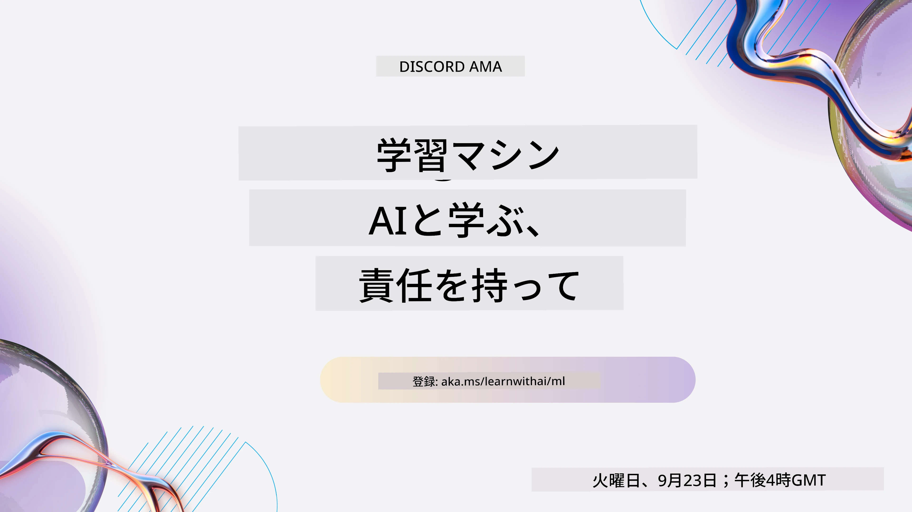
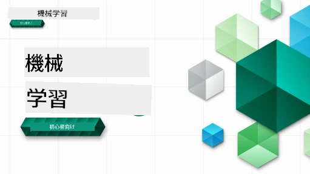

[](https://github.com/microsoft/ML-For-Beginners/blob/master/LICENSE)
[](https://GitHub.com/microsoft/ML-For-Beginners/graphs/contributors/)
[](https://GitHub.com/microsoft/ML-For-Beginners/issues/)
[](https://GitHub.com/microsoft/ML-For-Beginners/pulls/)
[](http://makeapullrequest.com)

[](https://GitHub.com/microsoft/ML-For-Beginners/watchers/)
[](https://GitHub.com/microsoft/ML-For-Beginners/network/)
[](https://GitHub.com/microsoft/ML-For-Beginners/stargazers/)

### 🌐 多言語対応

#### GitHub Actionによるサポート（自動化＆常に最新）

<!-- CO-OP TRANSLATOR LANGUAGES TABLE START -->
[Arabic](../ar/README.md) | [Bengali](../bn/README.md) | [Bulgarian](../bg/README.md) | [Burmese (Myanmar)](../my/README.md) | [Chinese (Simplified)](../zh-CN/README.md) | [Chinese (Traditional, Hong Kong)](../zh-HK/README.md) | [Chinese (Traditional, Macau)](../zh-MO/README.md) | [Chinese (Traditional, Taiwan)](../zh-TW/README.md) | [Croatian](../hr/README.md) | [Czech](../cs/README.md) | [Danish](../da/README.md) | [Dutch](../nl/README.md) | [Estonian](../et/README.md) | [Finnish](../fi/README.md) | [French](../fr/README.md) | [German](../de/README.md) | [Greek](../el/README.md) | [Hebrew](../he/README.md) | [Hindi](../hi/README.md) | [Hungarian](../hu/README.md) | [Indonesian](../id/README.md) | [Italian](../it/README.md) | [Japanese](./README.md) | [Kannada](../kn/README.md) | [Khmer](../km/README.md) | [Korean](../ko/README.md) | [Lithuanian](../lt/README.md) | [Malay](../ms/README.md) | [Malayalam](../ml/README.md) | [Marathi](../mr/README.md) | [Nepali](../ne/README.md) | [Nigerian Pidgin](../pcm/README.md) | [Norwegian](../no/README.md) | [Persian (Farsi)](../fa/README.md) | [Polish](../pl/README.md) | [Portuguese (Brazil)](../pt-BR/README.md) | [Portuguese (Portugal)](../pt-PT/README.md) | [Punjabi (Gurmukhi)](../pa/README.md) | [Romanian](../ro/README.md) | [Russian](../ru/README.md) | [Serbian (Cyrillic)](../sr/README.md) | [Slovak](../sk/README.md) | [Slovenian](../sl/README.md) | [Spanish](../es/README.md) | [Swahili](../sw/README.md) | [Swedish](../sv/README.md) | [Tagalog (Filipino)](../tl/README.md) | [Tamil](../ta/README.md) | [Telugu](../te/README.md) | [Thai](../th/README.md) | [Turkish](../tr/README.md) | [Ukrainian](../uk/README.md) | [Urdu](../ur/README.md) | [Vietnamese](../vi/README.md)

> **ローカルでクローンしたいですか？**
>
> このリポジトリには50以上の言語翻訳が含まれており、ダウンロードサイズが大幅に増加します。翻訳なしでクローンするにはスパースチェックアウトを使用してください：
>
> **Bash / macOS / Linux:**
> ```bash
> git clone --filter=blob:none --sparse https://github.com/microsoft/ML-For-Beginners.git
> cd ML-For-Beginners
> git sparse-checkout set --no-cone '/*' '!translations' '!translated_images'
> ```
>
> **CMD (Windows):**
> ```cmd
> git clone --filter=blob:none --sparse https://github.com/microsoft/ML-For-Beginners.git
> cd ML-For-Beginners
> git sparse-checkout set --no-cone "/*" "!translations" "!translated_images"
> ```
>
> コースを完了するのに必要なものがすべて揃い、より高速なダウンロードが可能です。
<!-- CO-OP TRANSLATOR LANGUAGES TABLE END -->

#### コミュニティに参加しよう

[](https://discord.gg/nTYy5BXMWG)

私たちはDiscordでAIと学ぶシリーズを実施中です。2025年9月18日から30日までの期間中、[Learn with AI Series](https://aka.ms/learnwithai/discord)で詳細を確認し、参加してください。GitHub Copilotを使ったデータサイエンスのヒントやコツが得られます。



# 初心者向け機械学習 - カリキュラム

> 🌍 世界の文化を通じて機械学習を探検しながら世界を旅しよう 🌍

マイクロソフトのクラウドアドボケーツは、<strong>機械学習</strong>に関する12週間、26レッスンのカリキュラムを提供しています。このカリキュラムでは、主にScikit-learnライブラリを使った、いわゆる<strong>古典的機械学習</strong>について学びます。深層学習は、[AI for Beginners' curriculum](https://aka.ms/ai4beginners)で扱っています。さらに、私たちの['Data Science for Beginners' curriculum](https://aka.ms/ds4beginners)と組み合わせて学習することをお勧めします。

世界中のデータにこれらの古典的な手法を適用しながら、一緒に旅しましょう。各レッスンには事前・事後のクイズ、書面による指示、解答例、課題などが含まれています。プロジェクトベースの教育法で、実際に作りながら学習でき、新しいスキルが定着しやすくなります。

**✍️ 著者の皆様へ心から感謝します** Jen Looper、Stephen Howell、Francesca Lazzeri、Tomomi Imura、Cassie Breviu、Dmitry Soshnikov、Chris Noring、Anirban Mukherjee、Ornella Altunyan、Ruth Yakubu、Amy Boyd

**🎨 イラストレーターの皆様にも感謝** Tomomi Imura、Dasani Madipalli、Jen Looper

**🙏 特別な感謝🙏 マイクロソフト学生アンバサダーの著者、レビュアー、コンテンツ協力者の皆様へ** とりわけRishit Dagli、Muhammad Sakib Khan Inan、Rohan Raj、Alexandru Petrescu、Abhishek Jaiswal、Nawrin Tabassum、Ioan Samuila、Snigdha Agarwal

**🤩 Rレッスンに特に感謝 Microsoft Student Ambassadors Eric Wanjau、Jasleen Sondhi、Vidushi Gupta！**

# はじめに

次の手順に従ってください：
1. <strong>リポジトリをフォークする</strong>: このページ右上の「Fork」ボタンをクリックします。
2. <strong>リポジトリをクローンする</strong>:   `git clone https://github.com/microsoft/ML-For-Beginners.git`

> 💡 **クイックスタートのヒント:** Pythonをローカルにセットアップせずブラウザで始めたいですか？[GitHub Codespaces](https://github.com/features/codespaces)を使ってあなたのフォーク用のクラウド開発環境を作成しましょう。緑の<strong>Code</strong>メニューを開き、<strong>Codespaces</strong>を選択してコードスペースを作成します。必要に応じて各レッスンの依存関係をインストールしてください。

> [このコースのすべての追加リソースはMicrosoft Learnコレクションで見つけられます](https://learn.microsoft.com/en-us/collections/qrqzamz1nn2wx3?WT.mc_id=academic-77952-bethanycheum)

> 🔧 **助けが必要ですか？** インストール、セットアップ、レッスンの実行に関する一般的な問題の解決策は[トラブルシューティングガイド](TROUBLESHOOTING.md)を参照してください。


**[学生の方へ](https://aka.ms/student-page)**、このカリキュラムを利用するには、リポジトリ全体を自分のGitHubアカウントにフォークし、個人でまたはグループで演習を完了してください：

- 事前のクイズから始めます。
- 講義を読み、知識確認で立ち止まって振り返りながらアクティビティを完了します。
- 解答コードを実行するのではなく、レッスンを理解してプロジェクトを作成してみてください。ただし、そのコードは各プロジェクト指向レッスンの `/solution` フォルダーにあります。
- 講義後のクイズを受けます。
- チャレンジを完了します。
- 課題を完了します。
- レッスングループを終えたら、[ディスカッションボード](https://github.com/microsoft/ML-For-Beginners/discussions)を訪れ、適切なPATルーブリックを記入して「声をあげて学びましょう」。PATはProgress Assessment Toolの略で、学習の進捗確認のために記入するルーブリックです。ほかのPATにもリアクションできますので、一緒に学びましょう。

> さらなる学習のために、これらの[Microsoft Learn](https://docs.microsoft.com/en-us/users/jenlooper-2911/collections/k7o7tg1gp306q4?WT.mc_id=academic-77952-leestott)モジュールとラーニングパスの受講をお勧めします。

<strong>先生方へ</strong>、このカリキュラムの活用方法について[提案を含めています](for-teachers.md)。

---

## 動画ウォークスルー

一部のレッスンは短い動画で利用可能です。これらはレッスン内に埋め込まれているほか、[マイクロソフト開発者YouTubeチャンネルのML for Beginnersプレイリスト](https://aka.ms/ml-beginners-videos)でも確認でき、下の画像をクリックするとアクセスできます。

[](https://aka.ms/ml-beginners-videos)

---

## チーム紹介

[](https://youtu.be/Tj1XWrDSYJU)

**Gif 作成者** [Mohit Jaisal](https://linkedin.com/in/mohitjaisal)

> 🎥 上の画像をクリックすると、プロジェクトとその作成者についてのビデオが見られます！

---

## 教育理念

このカリキュラム構築にあたり、2つの教育原則を選びました：実践的な<strong>プロジェクトベース</strong>であることと、<strong>頻繁なクイズ</strong>を含むことです。さらに、このカリキュラムには一貫性を持たせるための共通の<strong>テーマ</strong>があります。

内容をプロジェクトに合わせることで、学生の関心を引き付けやすくし、概念の定着を促します。また、授業前のライトなクイズで学生の学習意図を設定し、授業後のクイズでさらに理解を深めます。このカリキュラムは柔軟で楽しく、全編または一部だけで受講可能です。プロジェクトは小規模から始まり、12週間の最後には複雑になります。実世界の機械学習応用に関する追記も含まれており、追加の単位取得や議論の基盤として利用可能です。

> [行動規範](CODE_OF_CONDUCT.md)、[貢献ガイド](CONTRIBUTING.md)、[翻訳](..)、[トラブルシューティング](TROUBLESHOOTING.md)のガイドラインをご覧ください。建設的なフィードバックをお待ちしています！

## 各レッスンに含まれるもの

- 任意のスケッチノート
- 任意の補足動画
- 動画ウォークスルー（一部のレッスンのみ）
- [事前講義ウォームアップクイズ](https://ff-quizzes.netlify.app/en/ml/)
- 書面によるレッスン
- プロジェクトベースのレッスンでは、プロジェクト作成のステップバイステップ ガイド
- 知識確認
- チャレンジ
- 補足読書
- 課題
- [事後講義クイズ](https://ff-quizzes.netlify.app/en/ml/)

> <strong>言語に関する注意</strong>: これらのレッスンは主にPythonで書かれていますが、多くはRでも利用可能です。Rレッスンを完了するには、`/solution`フォルダー内のRレッスンを探してください。.rmd拡張子が付いており、これは<strong>R Markdown</strong>ファイルを意味します。R Markdownは`コードチャンク`（Rや他言語のコード）と`YAMLヘッダー`（PDFなどの出力フォーマット指定）をMarkdown文章に埋め込むための作者向けフレームワークです。そのため、コード、出力、考えを書き留めることができ、データサイエンスの執筆に最適です。さらに、R MarkdownはPDF、HTML、Wordなどの出力フォーマットにレンダリングできます。

> <strong>クイズに関する注意</strong>: すべてのクイズは[Quiz Appフォルダー](../../quiz-app)に含まれており、合計52回、それぞれ3問です。レッスン内からリンクされていますが、クイズアプリはローカルで実行可能です。`quiz-app`フォルダーの説明に従ってローカルホストまたはAzureデプロイできます。

| Lesson Number |                             Topic                              |                   Lesson Grouping                   | Learning Objectives                                                                                                             |                                                              Linked Lesson                                                               |                        Author                        |
| :-----------: | :------------------------------------------------------------: | :-------------------------------------------------: | ------------------------------------------------------------------------------------------------------------------------------- | :--------------------------------------------------------------------------------------------------------------------------------------: | :--------------------------------------------------: |
|      01       |                機械学習の紹介                |      [Introduction](1-Introduction/README.md)       | 機械学習の基本的な概念を学びます                                                                                |                                             [Lesson](1-Introduction/1-intro-to-ML/README.md)                                             |                       Muhammad                       |
|      02       |                機械学習の歴史                 |      [Introduction](1-Introduction/README.md)       | この分野の歴史を学びます                                                                                         |                                            [Lesson](1-Introduction/2-history-of-ML/README.md)                                            |                     Jen and Amy                      |
|      03       |                 公平性と機械学習                  |      [Introduction](1-Introduction/README.md)       | 学生がMLモデルの構築と適用時に考慮すべき重要な公平性に関する哲学的問題は何ですか？ |                                              [Lesson](1-Introduction/3-fairness/README.md)                                               |                        Tomomi                        |
|      04       |                機械学習の技術                 |      [Introduction](1-Introduction/README.md)       | ML研究者がMLモデルを構築するために使用する技術は何ですか？                                                                       |                                          [Lesson](1-Introduction/4-techniques-of-ML/README.md)                                           |                    Chris and Jen                     |
|      05       |                   回帰の紹介                   |        [Regression](2-Regression/README.md)         | 回帰モデルのためのPythonとScikit-learnの使い方を始めましょう                                                                  |         [Python](2-Regression/1-Tools/README.md) • [R](../../2-Regression/1-Tools/solution/R/lesson_1.html)         |      Jen • Eric Wanjau       |
|      06       |                北米のかぼちゃ価格 🎃                |        [Regression](2-Regression/README.md)         | MLに向けてデータの可視化とクレンジングを行います                                                                                  |          [Python](2-Regression/2-Data/README.md) • [R](../../2-Regression/2-Data/solution/R/lesson_2.html)          |      Jen • Eric Wanjau       |
|      07       |                北米のかぼちゃ価格 🎃                |        [Regression](2-Regression/README.md)         | 線形回帰モデルと多項式回帰モデルを構築します                                                                                   |        [Python](2-Regression/3-Linear/README.md) • [R](../../2-Regression/3-Linear/solution/R/lesson_3.html)        |      Jen and Dmitry • Eric Wanjau       |
|      08       |                北米のかぼちゃ価格 🎃                |        [Regression](2-Regression/README.md)         | ロジスティック回帰モデルを構築します                                                                                               |     [Python](2-Regression/4-Logistic/README.md) • [R](../../2-Regression/4-Logistic/solution/R/lesson_4.html)      |      Jen • Eric Wanjau       |
|      09       |                          Webアプリ 🔌                          |           [Web App](3-Web-App/README.md)            | 訓練したモデルを使うWebアプリを作成します                                                                                       |                                                 [Python](3-Web-App/1-Web-App/README.md)                                                  |                         Jen                          |
|      10       |                 分類の紹介                 |    [Classification](4-Classification/README.md)     | データのクレンジング、準備、可視化；分類の紹介                                                            | [Python](4-Classification/1-Introduction/README.md) • [R](../../4-Classification/1-Introduction/solution/R/lesson_10.html)  | Jen and Cassie • Eric Wanjau |
|      11       |             おいしいアジアとインドの料理 🍜             |    [Classification](4-Classification/README.md)     | 分類器の紹介                                                                                                     | [Python](4-Classification/2-Classifiers-1/README.md) • [R](../../4-Classification/2-Classifiers-1/solution/R/lesson_11.html) | Jen and Cassie • Eric Wanjau |
|      12       |             おいしいアジアとインドの料理 🍜             |    [Classification](4-Classification/README.md)     | さらなる分類器                                                                                                                | [Python](4-Classification/3-Classifiers-2/README.md) • [R](../../4-Classification/3-Classifiers-2/solution/R/lesson_12.html) | Jen and Cassie • Eric Wanjau |
|      13       |             おいしいアジアとインドの料理 🍜             |    [Classification](4-Classification/README.md)     | あなたのモデルを使ったレコメンダーWebアプリの作成                                                                                   |                                              [Python](4-Classification/4-Applied/README.md)                                              |                         Jen                          |
|      14       |                   クラスタリングの紹介                   |        [Clustering](5-Clustering/README.md)         | データのクレンジング、準備、可視化；クラスタリングの紹介                                                                |         [Python](5-Clustering/1-Visualize/README.md) • [R](../../5-Clustering/1-Visualize/solution/R/lesson_14.html)         |      Jen • Eric Wanjau       |
|      15       |              ナイジェリアの音楽の嗜好を探る 🎧              |        [Clustering](5-Clustering/README.md)         | K-平均クラスタリング手法を探る                                                                                           |           [Python](5-Clustering/2-K-Means/README.md) • [R](../../5-Clustering/2-K-Means/solution/R/lesson_15.html)           |      Jen • Eric Wanjau       |
|      16       |        自然言語処理の紹介 ☕️         |   [Natural language processing](6-NLP/README.md)    | シンプルなボットを作りながらNLPの基礎を学ぶ                                                                             |                                             [Python](6-NLP/1-Introduction-to-NLP/README.md)                                              |                       Stephen                        |
|      17       |                      一般的なNLPタスク ☕️                      |   [Natural language processing](6-NLP/README.md)    | 言語構造を扱う際に必要な一般的なタスクを理解してNLPの知識を深める                          |                                                    [Python](6-NLP/2-Tasks/README.md)                                                     |                       Stephen                        |
|      18       |             翻訳と感情分析 ♥️              |   [Natural language processing](6-NLP/README.md)    | ジェーン・オースティンの翻訳と感情分析                                                                             |                                            [Python](6-NLP/3-Translation-Sentiment/README.md)                                             |                       Stephen                        |
|      19       |                  ヨーロッパのロマンチックホテル ♥️                  |   [Natural language processing](6-NLP/README.md)    | ホテルのレビューによる感情分析1                                                                                         |                                               [Python](6-NLP/4-Hotel-Reviews-1/README.md)                                                |                       Stephen                        |
|      20       |                  ヨーロッパのロマンチックホテル ♥️                  |   [Natural language processing](6-NLP/README.md)    | ホテルのレビューによる感情分析2                                                                                         |                                               [Python](6-NLP/5-Hotel-Reviews-2/README.md)                                                |                       Stephen                        |
|      21       |            時系列予測の紹介             |        [Time series](7-TimeSeries/README.md)        | 時系列予測の紹介                                                                                         |                                             [Python](7-TimeSeries/1-Introduction/README.md)                                              |                      Francesca                       |
|      22       | ⚡️ 世界の電力使用量 ⚡️ - ARIMAを用いた時系列予測 |        [Time series](7-TimeSeries/README.md)        | ARIMAによる時系列予測                                                                                              |                                                 [Python](7-TimeSeries/2-ARIMA/README.md)                                                 |                      Francesca                       |
|      23       |  ⚡️ 世界の電力使用量 ⚡️ - SVRを用いた時系列予測  |        [Time series](7-TimeSeries/README.md)        | サポートベクター回帰を用いた時系列予測                                                                           |                                                  [Python](7-TimeSeries/3-SVR/README.md)                                                  |                       Anirban                        |
|      24       |             強化学習の紹介             | [Reinforcement learning](8-Reinforcement/README.md) | Q-学習による強化学習の紹介                                                                          |                                             [Python](8-Reinforcement/1-QLearning/README.md)                                              |                        Dmitry                        |
|      25       |                 ピーターをオオカミから守ろう! 🐺                  | [Reinforcement learning](8-Reinforcement/README.md) | 強化学習用Gym                                                                                                      |                                                [Python](8-Reinforcement/2-Gym/README.md)                                                 |                        Dmitry                        |
|  ポストスクリプト   |            実世界のMLシナリオと応用            |      [ML in the Wild](9-Real-World/README.md)       | 古典的なMLの興味深く啓発的な実世界の応用例                                                               |                                             [Lesson](9-Real-World/1-Applications/README.md)                                              |                         チーム                         |
|  ポストスクリプト   |            RAIダッシュボードを使ったMLのモデルデバッグ            |      [ML in the Wild](9-Real-World/README.md)       | Responsible AIダッシュボードコンポーネントを使った機械学習のモデルデバッグ                                                              |                                             [Lesson](9-Real-World/2-Debugging-ML-Models/README.md)                                              |                     Ruth Yakubu                      |

> [このコースの追加リソースはMicrosoft Learnコレクションで見つけてください](https://learn.microsoft.com/en-us/collections/qrqzamz1nn2wx3?WT.mc_id=academic-77952-bethanycheum)

## オフラインアクセス

[Docsify](https://docsify.js.org/#/)を使用して、このドキュメントをオフラインで実行できます。このリポジトリをフォークし、ローカルマシンに[Docsifyをインストール](https://docsify.js.org/#/quickstart)し、このリポジトリのルートフォルダで `docsify serve` を入力してください。ウェブサイトはlocalhostのポート3000で提供されます: `localhost:3000`。

## PDF

カリキュラムのPDF版とリンクはこちらから見つけられます [here](https://microsoft.github.io/ML-For-Beginners/pdf/readme.pdf)。


## 🎒 その他のコース 

私たちのチームは他のコースも制作しています！ぜひご覧ください:

<!-- CO-OP TRANSLATOR OTHER COURSES START -->
### LangChain
[](https://aka.ms/langchain4j-for-beginners)
[](https://aka.ms/langchainjs-for-beginners?WT.mc_id=m365-94501-dwahlin)
[](https://github.com/microsoft/langchain-for-beginners?WT.mc_id=m365-94501-dwahlin)
---

### Azure / Edge / MCP / エージェント
[](https://github.com/microsoft/AZD-for-beginners?WT.mc_id=academic-105485-koreyst)
[](https://github.com/microsoft/edgeai-for-beginners?WT.mc_id=academic-105485-koreyst)
[](https://github.com/microsoft/mcp-for-beginners?WT.mc_id=academic-105485-koreyst)
[](https://github.com/microsoft/ai-agents-for-beginners?WT.mc_id=academic-105485-koreyst)

---
 
### 生成AIシリーズ
[](https://github.com/microsoft/generative-ai-for-beginners?WT.mc_id=academic-105485-koreyst)
[-9333EA?style=for-the-badge&labelColor=E5E7EB&color=9333EA)](https://github.com/microsoft/Generative-AI-for-beginners-dotnet?WT.mc_id=academic-105485-koreyst)
[-C084FC?style=for-the-badge&labelColor=E5E7EB&color=C084FC)](https://github.com/microsoft/generative-ai-for-beginners-java?WT.mc_id=academic-105485-koreyst)
[-E879F9?style=for-the-badge&labelColor=E5E7EB&color=E879F9)](https://github.com/microsoft/generative-ai-with-javascript?WT.mc_id=academic-105485-koreyst)

---
 
### コアラーニング
[](https://aka.ms/ml-beginners?WT.mc_id=academic-105485-koreyst)
[](https://aka.ms/datascience-beginners?WT.mc_id=academic-105485-koreyst)
[](https://aka.ms/ai-beginners?WT.mc_id=academic-105485-koreyst)
[](https://github.com/microsoft/Security-101?WT.mc_id=academic-96948-sayoung)
[](https://aka.ms/webdev-beginners?WT.mc_id=academic-105485-koreyst)
[](https://aka.ms/iot-beginners?WT.mc_id=academic-105485-koreyst)
[](https://github.com/microsoft/xr-development-for-beginners?WT.mc_id=academic-105485-koreyst)

---
 
### Copilot シリーズ
[](https://aka.ms/GitHubCopilotAI?WT.mc_id=academic-105485-koreyst)
[](https://github.com/microsoft/mastering-github-copilot-for-dotnet-csharp-developers?WT.mc_id=academic-105485-koreyst)
[](https://github.com/microsoft/CopilotAdventures?WT.mc_id=academic-105485-koreyst)
<!-- CO-OP TRANSLATOR OTHER COURSES END -->

## ヘルプを得る

機械学習を学習したりAIアプリケーションを構築している途中で困ったり質問がある場合でも、ご安心ください — ヘルプは利用可能です。

他の学習者や開発者とディスカッションに参加し、質問をしたり、アイデアをコミュニティと共有することができます。

- コミュニティに参加して質問したり他の人と学ぶ
- 機械学習の概念やプロジェクトのアイデアを議論する
- 経験豊富な開発者からの指導を受ける

スポーティブなコミュニティはスキルを伸ばし問題をより早く解決するための優れた方法です。

[Microsoft Foundry Discord Community](https://discord.gg/nTYy5BXMWG)

バグやエラーが発生した場合、または改善の提案があれば、このリポジトリに<strong>Issue</strong>を開いて問題を報告することもできます。

製品フィードバックや既存のコミュニティ投稿を検索したい場合は、開発者フォーラムをご覧ください:

[](https://aka.ms/foundry/forum)

## 追加の学習ヒント

- 各レッスン後にノートブックを復習して理解を深めましょう。
- アルゴリズムを自分で実装する練習をしましょう。
- 学んだ概念を使って実世界のデータセットを探索しましょう。

---

<!-- CO-OP TRANSLATOR DISCLAIMER START -->
**免責事項**：
本書類は AI 翻訳サービス [Co-op Translator](https://github.com/Azure/co-op-translator) を使用して翻訳されています。正確性を期していますが、自動翻訳には誤りや不正確な部分が含まれる可能性があることをご承知おきください。原文の原語版が正式な情報源とみなされるべきです。重要な情報については、専門の人間による翻訳を推奨します。本翻訳の利用により生じたいかなる誤解や解釈違いについても、当方は責任を負いかねます。
<!-- CO-OP TRANSLATOR DISCLAIMER END -->