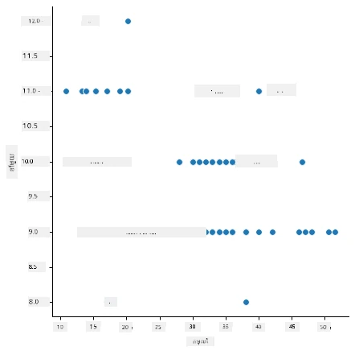
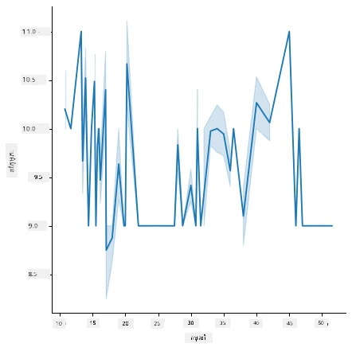
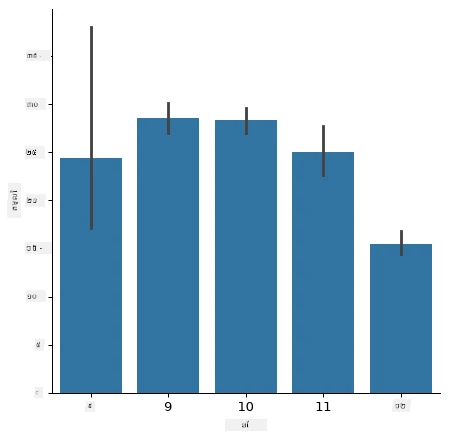
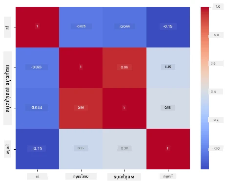

# សង់ម៉ូដែលការត្រួតពិនិត្យតម្លៃវិញដោយប្រើ Scikit-learn: រៀបចំនិងបង្ហាញទិន្នន័យ


រូបភាពបង្ហាញដោយ [Dasani Madipalli](https://twitter.com/dasani_decoded)

## [សំណួរពីមុនបោះពុម្ព](https://ff-quizzes.netlify.app/en/ml/)

> ### [មេរៀននេះមាននៅក្នុងភាសា R!](../../../../2-Regression/2-Data/solution/R/lesson_2.html)

## ការណែនាំ

ឥឡូវនេះដែលអ្នកបានរៀបចំឧបករណ៍ដែលត្រូវការដើម្បីចាប់ផ្តើមសាងម៉ូដែលបច្ចេកវិទ្យាសិក្សា​ម៉ាស៊ីនជាមួយ Scikit-learn អ្នករួចរាល់ដើម្បីចាប់ផ្តើមសួរបញ្ហានៅលើទិន្នន័យរបស់អ្នក។ នៅពេលដែលអ្នកប្រើទិន្នន័យនិងអនុវត្តដំណោះស្រាយ ML វាមានសារៈសំខាន់ណាស់ក្នុងការយល់ពីរបៀបសួរបញ្ហាដូចត្រូវដើម្បីដោះស្រាយសមត្ថភាពរបស់ទិន្នន័យរបស់អ្នកបានត្រឹមត្រូវ។

ក្នុងមេរៀននេះ អ្នកនឹងសិក្សា:

- របៀបរៀបចំទិន្នន័យសម្រាប់ការសង់ម៉ូដែល។
- របៀបប្រើ Matplotlib សម្រាប់បង្ហាញទិន្នន័យ។
- របៀបប្រើ Seaborn សម្រាប់បង្ហាញទិន្នន័យយ៉ាងមានអារម្មណ៍ច្រើនជាងនេះ។

## សួរបញ្ហាដូចត្រូវនៅលើទិន្នន័យរបស់អ្នក

បញ្ហាដែលអ្នកត្រូវការជួបចម្លើយនឹងកំណត់ប្រភេទអាល់ហ្គរីធម៍ ML ដែលអ្នកនឹងប្រើប្រាស់។ ហើយគុណភាពនៃចម្លើយដែលអ្នកទទួលបាននឹងសង្កត់សំខាន់ផ្អែកលើធម្មជាតិរបស់ទិន្នន័យរបស់អ្នក។

សូមមើលទិន្នន័យ [data](https://github.com/microsoft/ML-For-Beginners/blob/main/2-Regression/data/US-pumpkins.csv) ដែលផ្តល់សម្រាប់មេរៀននេះ។ អ្នកអាចបើកឯកសារ .csv នេះនៅក្នុង VS Code បាន។ ការមើលវាបន្ទាន់បង្ហាញថាមានកន្លែងទទេនិងមានការភាន់ច្រឡំរវាងខ្សែអក្សរនិងទិន្នន័យគណិតវិទ្យា។ មានជួរឈរធម្មតាដែលហៅថា 'Package' ដែលទិន្នន័យត្រូវបានចែកចាយរវាង 'sacks', 'bins' និងតម្លៃផ្សេងទៀត។ ទិន្នន័យពិតជារំខានបន្តិច។

[](https://youtu.be/5qGjczWTrDQ "ML for beginners - របៀបវិភាគនិងសម្អាតទិន្នន័យ")

> 🎥 ចុចលើរូបភាពខាងលើសម្រាប់វីដេអូចំណីទស្សនាខ្លីដែលបង្ហាញពីការត្រៀមទិន្នន័យសម្រាប់មេរៀននេះ។

ពិតណាស់ វាមិនធម្មតាទេដែលទទួលបាន dataset ដែលរៀបចំរួចហើយសម្រាប់បង្កើតម៉ូដែល ML ចេញពីប្រអប់។ ក្នុងមេរៀននេះ អ្នកនឹងរៀនរបៀបរៀបចំ dataset ដើមដោយប្រើបណ្ណាល័យ Python ស្តង់ដារ។ អ្នកនឹងរៀនបច្ចេកទេសខុសៗគ្នាដើម្បីបង្ហាញទិន្នន័យ។

## ករណីសិក្សា៖ 'ទីផ្សារផ្លែទុរក្រហម'

នៅក្នុងថតនេះ អ្នកនឹងរកឃើញឯកសារ .csv ក្នុងថត `data` ដែលឈ្មោះ [US-pumpkins.csv](https://github.com/microsoft/ML-For-Beginners/blob/main/2-Regression/data/US-pumpkins.csv) ដែលមានបន្ទាត់ទិន្នន័យ ១៧៥៧ ស្តីពីទីផ្សារផ្លែទុរក្រហម ដែលត្រូវបានចាត់ថ្នាក់ជាក្រុមដោយទីក្រុង។ ទិន្នន័យដើមនេះបានកွត់ដោយរបាយការណ៍ស្តង់ដារជួរទីផ្សារផ្លុំផលផ្លែឈើ [Specialty Crops Terminal Markets Standard Reports](https://www.marketnews.usda.gov/mnp/fv-report-config-step1?type=termPrice) ដែលចែកចាយដោយក្រសួងកសិកម្មសហរដ្ឋអាមេរិក។

### រៀបចំទិន្នន័យ

ទិន្នន័យនេះគឺជាទ្រព្យសាធារណៈ។ អ្នកអាចទាញយកវាជាជាច្រើនឯកសារផ្សេងៗ ដោយបញ្ជាក់មួយទីក្រុង ពីវែបសាយ USDA។ ដើម្បីជៀសវាងឯកសារច្រើនពេក យើងបានបញ្ចូលទិន្នន័យទីក្រុងទាំងអស់ចូលទៅក្នុងសៀវភៅកំណត់ត្រាមួយ ដូច្នេះហើយ យើងបានរៀបចំទិន្នន័យមានផាសុកភាពបន្តិច។ បន្ទាប់មក សូមមើលទិន្នន័យជិតស្និទ្ធ។

### ទិន្នន័យផ្លែទុរក្រហម - សេចក្ដីសន្និដ្ឋានដើម

អ្វីដែលអ្នកគួររំខានអំពីទិន្នន័យនេះ? អ្នកបានឃើញហើយថាមានការភាន់ច្រឡំនៃខ្សែអក្សរ លេខ ទទេ និងតម្លៃដ៏អស្ចារ្យដែលអ្នកត្រូវស្វែងយល់។

តើអ្នកអាចសួរបញ្ហាអ្វីពីទិន្នន័យនេះ ដោយប្រើប្រាស់បច្ចេកទេសការត្រួតពិនិត្យតម្លៃវិញ (Regression)? តើអ្វីអំពី "ទស្សនាវដ្តីតម្លៃផ្លែទុរក្រហមសម្រាប់លក់នៅខែណាមួយ"។ មើលឡើងវិញទិន្នន័យ មានការផ្លាស់ប្តូរខ្លះដែលអ្នកត្រូវធ្វើដើម្បីបង្កើតរចនាសម្ព័ន្ធទិន្នន័យចាំបាច់សម្រាប់ភារកិច្ចនេះ។
## លំហាត់ - វិភាគទិន្នន័យផ្លែទុរក្រហម

យើងនឹងប្រើ [Pandas](https://pandas.pydata.org/), (ឈ្មោះមានន័យថា `Python Data Analysis`) គ្រឿងចក្រ ។ ។ ដែលមានប្រយោជន៍សម្រាប់រៀបចំទិន្នន័យ ដើម្បីវិភាគនិងរៀបចំទិន្នន័យផ្លែទុរក្រហមនេះ។

### ជំហ៊ានដំបូង ពិនិត្យកាលបរិច្ឆេទខ្វះ

អ្នកត្រូវចាប់ផ្តើមដោយចាត់វិធានការ ដូច្នេះពិនិត្យកាលបរិច្ឆេទដែលខ្វះ:

1. បម្លែងកាលបរិច្ឆេទទៅទ្រង់ទ្រាយខែ (ជាកាលបរិច្ឆេទសហរដ្ឋអាមេរិក ហើយទ្រង់ទ្រាយគឺជា `MM/DD/YYYY`)។
2. ទាញខែទៅជាជួរឈរថ្មីមួយ។

បើកឯកសារ _notebook.ipynb_ នៅក្នុង Visual Studio Code ហើយនាំចូលសៀវភៅកំណត់ត្រាទៅជាការដាក់កថាខណ្ឌថ្មីក្នុង Pandas dataframe។

1. ប្រើមុខងារ `head()` ដើម្បីមើលប្រាំជួរដំបូង។

    ```python
    import pandas as pd
    pumpkins = pd.read_csv('../data/US-pumpkins.csv')
    pumpkins.head()
    ```

    ✅ តើមុខងារអ្វីដែលអ្នកនឹងប្រើដើម្បីមើលប្រាំជួរចុងក្រោយ?

1. ពិនិត្យមើលថាតើមានទិន្នន័យខ្វះក្នុង dataframe បច្ចុប្បន្នទេ:

    ```python
    pumpkins.isnull().sum()
    ```

    មានទិន្នន័យខ្វះ។ ប៉ុន្តែប្រហែលជានឹងមិនមានប្រសិទ្ធិភាពសម្រាប់ភារកិច្ចនេះទេ។

1. ដើម្បីធ្វើឲ្យ dataframe របស់អ្នកងាយស្រួលក្នុងការងារ ជ្រើសយកតែជួរឈរដែលអ្នកត្រូវការ តាមរយៈមុខងារ `loc` ដែលទាញយកពី dataframe ដើមជាក្រុមជួរដេកមួយ (បញ្ជូនជาพ៉ារ៉ាម៉ែត្រដំបូង) និងជួរឈរ (បញ្ជូនជាជាម៉ារ៉ាម៉ែត្រទីពីរ)។ ប្រើសញ្ញា `:` ក្នុងករណីនេះមានន័យថា "ជួរដេកទាំងអស់"។

    ```python
    columns_to_select = ['Package', 'Low Price', 'High Price', 'Date']
    pumpkins = pumpkins.loc[:, columns_to_select]
    ```

### ជំហ៊ានទីពីរ កំណត់តម្លៃមធ្យមនៃផ្លែទុរក្រហម

សូមគិតពីរបៀបកំណត់តម្លៃមធ្យមនៃផ្លែទុរក្រហមនៅក្នុងខែណាមួយ។ តើជួរឈរអ្វីដែលអ្នកនឹងជ្រើសសម្រាប់ភារកិច្ចនេះ? ការណែនាំ៖ អ្នកនឹងត្រូវការជួរឈរបី។

ដំណោះស្រាយ៖ យកតម្លៃមធ្យមនៃជួរឈរ `Low Price` និង `High Price` ដើម្បីបញ្ចូលទៅក្នុងជួរឈរថ្មី Price ហើយបម្លែងជួរឈរ Date ដើម្បីបង្ហាញតែខែប៉ុណ្ណោះ។ មហាសំណាង តាមការត្រួតពិនិត្យខាងលើ គ្មានទិន្នន័យខ្វះសម្រាប់កាលបរិច្ឆេទឬតម្លៃឡើយ។

1. ដើម្បីគណនាមធ្យម បន្ថែមកូដដូចខាងក្រោម៖

    ```python
    price = (pumpkins['Low Price'] + pumpkins['High Price']) / 2

    month = pd.DatetimeIndex(pumpkins['Date']).month

    ```

   ✅ អ្នកអាចបោះពុម្ពទិន្នន័យណាមួយដែលចង់ពិនិត្យដោយប្រើ `print(month)`។

2. ឥឡូវនេះ ចម្លងទិន្នន័យបម្លែងរបស់អ្នកទៅជា dataframe Pandas ថ្មីមួយ៖

    ```python
    new_pumpkins = pd.DataFrame({'Month': month, 'Package': pumpkins['Package'], 'Low Price': pumpkins['Low Price'],'High Price': pumpkins['High Price'], 'Price': price})
    ```

    ការបោះពុម្ព dataframe របស់អ្នកនឹងបង្ហាញ dataset ដែលបានសម្អាត និងមានរបៀបល្អសម្រាប់បង្កើតម៉ូដែលត្រួតពិនិត្យតម្លៃវិញថ្មី។

### ប៉ុន្ដែរង់ចាំ! មានអ្វីមួយចម្លែកនៅទីនេះ

ប្រសិនបើអ្នកមើលជួរឈរ `Package` ផ្លែទុរក្រហមត្រូវបានលក់ក្នុងការរៀបចំបួនពហុក្បាល។ មួយចំនួនត្រូវបានលក់ក្នុងវិមាត្រដូចជា '1 1/9 bushel' និង '1/2 bushel' មួយចំនួនតាមផ្លែ ទម្ងន់ និងខ្ទង់ធំៗ។

> ផ្លែទុរក្រហមហាក់ដូចជាលំបាកក្នុងការវាស់ទម្ងន់យ៉ាងមានលក្ខណៈស្តង់ដារ។

ការវិភាគទិន្នន័យដើម គួរឱ្យចាប់អារម្មណ៍ថា ណាមួយដែលមាន `Unit of Sale` ស្មើនឹង 'EACH' ឬ 'PER BIN' ក៏មានប្រភេទ `Package` ជាម៉ែត្ររយៈ, ប្រអប់ ឬ 'មួយ'។ ផ្លែទុរក្រហមហាក់មិនងាយក្នុងការវាស់ទម្ងន់យ៉ាងមានលក្ខណៈស្តង់ដារ ដូច្នេះយើងចាប់ជម្រើសតែផ្លែទុរក្រហមដែលមានខ្សែអក្សរថា 'bushel' នៅក្នុងជួរឈរ `Package`។

1. បន្ថែមស្ត្រង់កំណត់នៅលើទំព័រឯកសារ ខាងក្រោមការនាំចូល .csv ដំបូង៖

    ```python
    pumpkins = pumpkins[pumpkins['Package'].str.contains('bushel', case=True, regex=True)]
    ```

    ប្រសិនបើអ្នកបោះពុម្ពទិន្នន័យឥឡូវនេះ អ្នកនឹងមើលឃើញតែប្រហែល ៤១៥ ជួរដេកនៃទិន្នន័យដែលមានផ្លែទុរក្រហមដោយ bushel។

### ប៉ុន្ដែរង់ចាំ! មានរឿងត្រូវធ្វើបន្ថែមទៀត

តើអ្នកបានយកចិត្តទុកដាក់ទេថាបរិមាណ bushel ផ្លែទុរក្រហមប្រែប្រួលទៅតាមជួរដេក? អ្នកត្រូវត្រួតត្រាតម្លៃឲ្យស្តង់ដារឡើង ដូច្នេះត្រូវធ្វើកិច្ចការ គណនា ដើម្បីធ្វើឲ្យវាដោយស្តង់ដារ។

1. បន្ថែមបន្ទាត់ទាំងនេះនៅបន្ទាប់ប្លុកបង្កើត dataframe new_pumpkins:

    ```python
    new_pumpkins.loc[new_pumpkins['Package'].str.contains('1 1/9'), 'Price'] = price/(1 + 1/9)

    new_pumpkins.loc[new_pumpkins['Package'].str.contains('1/2'), 'Price'] = price/(1/2)
    ```

✅ យោងទៅតាម [The Spruce Eats](https://www.thespruceeats.com/how-much-is-a-bushel-1389308) ទម្ងន់មួយ bushel អាស្រ័យទៅលើប្រភេទផលិតផល ដូចជាវាជាមាត្របម្រុងទំហំ។ "Bushel មួយនៃត្របែក ត្រូវវាស់ទម្ងន់បាន ៥៦ ផោន... ស្លឹកបន្លែ និងបន្លែមានទំហំធំ និងទម្ងន់តិច ដូច្នេះ bushel នៃសាឡាដត្រជាក់ គឺមានទម្ងន់ត្រឹម ២០ ផោន។" វាជារឿងស្មុគស្មាញណាស់! មិនត្រូវបំភាយការបម្លែងពី bushel ទៅផោន ទៅជាទម្ងន់ទេ ហើយត្រូវកំណត់តម្លៃដោយ bushel ពេញលេញ។ ការសិក្សាទាំងនេះអំពី bushel ផ្លែទុរក្រហមបង្ហាញថាសំខាន់ណាស់ក្នុងការយល់ដឹងពីធម្មជាតិទិន្នន័យរបស់អ្នក!

ឥឡូវនេះ អ្នកអាចវិភាគតម្លៃក្នុងមួយឯកតា ដែលអាស្រ័យលើការវាស់វែង bushel។ ប្រសិនបើអ្នកបោះពុម្ពទិន្នន័យម្ដងទៀត អ្នកនឹងឃើញវាបានស្តង់ដាររួចហើយ។

✅ តើអ្នកត្រូវដឹងទេថា ផ្លែទុរក្រហមដែលលក់ដោយមួយថូ bushel តម្លៃថ្លៃណាស់? តើអ្នកអាចកំណត់ហេតុផលបានទេ? ការណែនាំ៖ ផ្លែទុរក្រហមតូចៗថ្លៃជាងវាល្អ ព្រោះមានច្រើនជាងក្នុងមួយ bushel បើប្រៀបធៀបនឹងផ្លែធំមួយ សម្រាប់រាងខោអាវដូចជា pumpkin hollow pie ដែលមានកន្លែងទទេ។

## វិធីសាស្រ្តបង្ហាញទិន្នន័យ

ភាគមួយនៃតួអង្គរបស់អ្នកវិទ្យាសាស្ត្រទិន្នន័យគឺបង្ហាញគុណភាពនិងធម្មជាតិទិន្នន័យដែលពួកគេចង់ដំណើរការជាមួយ។ ដើម្បីធ្វើដូចនេះ ពួកគេជាញឹកញាប់បង្កើតការបង្ហាញទិន្នន័យគួរឱ្យចាប់អារម្មណ៍ ឬក្រាហ្វិក, គំនូស និងតារាង បង្ហាញបំណែកផ្សេងៗនៃទិន្នន័យ។ ដោយវិធីនេះ ពួកគេអាចបង្ហាញចំណងជើងនិងចន្លោះដែលលំបាកក្នុងការរកឃើញ។

[](https://youtu.be/SbUkxH6IJo0 "ML for beginners - របៀបបង្ហាញទិន្នន័យជាមួយ Matplotlib")

> 🎥 ចុចលើរូបភាពខាងលើសម្រាប់វីដេអូចំណីទស្សនាខ្លីដែលបង្ហាញពីការបង្ហាញទិន្នន័យសម្រាប់មេរៀននេះ។

ការបង្ហាញទិន្នន័យអាចជួយកំណត់បច្ចេកទេសសិក្សាម៉ាស៊ីនដែលសមស្របជាងសម្រាប់ទិន្នន័យ។ គំនូស scatterplot ដែលហាក់ដូចតាមស្រឡាយបង្ហាញថាទិន្នន័យគឺជាក្រុមដែលសមស្របសម្រាប់តេស្តការត្រួតពិនិត្យតម្លៃវិញបច្ចេកទេសវិធីសាស្រ្តបន្ទាត់។

មួយក្នុងចំណោមបណ្ណាល័យបង្ហាញទិន្នន័យដែលដំណើរការល្អក្នុង Jupyter notebooks គឺ [Matplotlib](https://matplotlib.org/) (ដែលអ្នកបានមើលក្នុងមេរៀនមុន)។

> ទទួលបានបទពិសោធន៍បន្ថែមនៃការបង្ហាញទិន្នន័យនៅក្នុង [មេរៀនទាំងនេះ](https://docs.microsoft.com/learn/modules/explore-analyze-data-with-python?WT.mc_id=academic-77952-leestott)។

## លំហាត់ - សាកល្បងជាមួយ Matplotlib

ព្យាយាមបង្កើតគំនូសមូលដ្ឋានខ្លះៗ ដើម្បីបង្ហាញ dataframe ថ្មីដែលអ្នកទើបបង្កើត។ គំនូសបន្ទាត់មូលដ្ឋាននឹងបង្ហាញអ្វី?

1. នាំចូល Matplotlib នៅលើផ្ទៃឯកសារ ខាងក្រោមនាំចូល Pandas:

    ```python
    import matplotlib.pyplot as plt
    ```

1. រត់ម្តងទៀតនូវសៀវភៅកំណត់ត្រាទាំងមូល ដើម្បីធ្វើឱ្យទាន់សម័យ។
1. នៅចុងសៀវភៅកំណត់ត្រា បន្ថែមកោសិកាមួយសម្រាប់គំនូសទិន្នន័យជាតារាងប្រអប់ (box):

    ```python
    price = new_pumpkins.Price
    month = new_pumpkins.Month
    plt.scatter(price, month)
    plt.show()
    ```

    

    តើនេះជាគំនូសមានប្រយោជន៍ដែរឬទេ? តើមានអ្វីដែលធ្វើឲ្យអ្នកភ្ញាក់ផ្អើលទេ?

    វាមិនមានប្រយោជន៍ពិសេស យ៉ាងហោចណាស់វាបង្ហាញតែចំណុចចែកចាយទិន្នន័យនៅខែមួយ។

### ធ្វើឲ្យវាមានប្រយោជន៍

ដើម្បីឲ្យតារាងបង្ហាញទិន្នន័យមានប្រយោជន៍ អ្នកភ្លឹតត្រូវតែក្រុមទិន្នន័យមួយរបៀបណាមួយ។ ព្យាយាមបង្កើតគំនូសដែលពីអ័ក្ស y បង្ហាញខែ ខណ:ដែលទិន្នន័យបង្ហាញពីចំណែកនៃទិន្នន័យ។

1. បន្ថែមកោសិកាមួយសម្រាប់បង្កើតគំនូសតារាងបន្ទាត់ជាក្រុម (grouped bar chart):

    ```python
    new_pumpkins.groupby(['Month'])['Price'].mean().plot(kind='bar')
    plt.ylabel("Pumpkin Price")
    ```

    

    នេះជាការបង្ហាញទិន្នន័យមានប្រយោជន៍ជាង! វាលើកឡើងថាតម្លៃផ្កាផ្លែទុរក្រហមខ្ពស់ក្នុងខែកញ្ញានិងតុលា។ តើវាដូចដែលអ្នករំពឹងទុករឺទេ? ហេតុអ្វីបានជាឬមិន?

## លំហាត់ - សាកល្បងជាមួយ Seaborn

Matplotlib មានអំណាច ប៉ុន្តែការបង្កើតគំនូសល្អៗទាមទារកូដច្រើន។ [Seaborn](https://seaborn.pydata.org/) ជាបណ្ណាល័យដែលសង់លើ Matplotlib ដែលមានគោលបំណងសម្រាប់ការបង្ហាញទិន្នន័យស្ថិតិ។ វាដំណើរការផ្ទាល់ជាមួយ Pandas dataframe អនុវត្តស្ទីលរចនាដ៏ទាក់ទាញដើម, ហើយអនុញ្ញាតឲ្យអ្នកបង្កើតគំនូសពត៌មានជាមួយកូដតិចជ្រុល។ ពីព្រោះ Seaborn បញ្ជូនតម្លៃវត្ថុ Matplotlib អ្នកនៅតែអាចប្រើប្រាស់អ្វីដែលអ្នកស្គាល់ពី Matplotlib ដើម្បីកែប្រែលទ្ធផលបាន។

> ប្រសិនបើអ្នកមិនទាន់ដំឡើង Seaborn, ដំឡើងវា ដោយប្រើ `pip install seaborn`។

1. នាំចូល Seaborn នៅលើផ្ទៃសៀវភៅកំណត់ត្រា តាមក្រោមនាំចូលផ្សេងទៀត។ វាត្រូវបាននាំចូលជាទូទៅជាមួយឈ្មោះ `sns`៖

    ```python
    import seaborn as sns
    ```

### គំនូស scatter ເພື່ອបង្ហាញទំនាក់ទំនង

ភាគមួយធំនៃការស្វែងរកទិន្នន័យមុនការសាងម៉ូដែលគឺរកឲ្យឃើញ _ទំនាក់ទំនង_ រវាងអថេរ។ គំនូស [scatter plot](https://en.wikipedia.org/wiki/Scatter_plot) គឺជាឧបករណ៍ល្អបំផុតមួយ សម្រាប់នេះ៖ បើចំណុចហាក់ដូចតាមបន្ទាត់ អថេរពីរនេះអាចមានទំនាក់ទំនងគ្នា ដែលជាសញ្ញាល្អថាម៉ូដែលការត្រួតពិនិត្យតម្លៃវិញបន្ទាត់អាចដំណើរការ។

1. បង្កើតឡើងវិញគំនូស scatter plot តម្លៃទៅខែពីមុន ពេលនេះប្រើ Seaborn's [`relplot()`](https://seaborn.pydata.org/generated/seaborn.relplot.html) (គំនូសទំនាក់ទំនង) ដែលដំណើរការផ្ទាល់ជាមួយជួរឈរ dataframe របស់អ្នក៖

    ```python
    sns.relplot(x="Price", y="Month", data=new_pumpkins)
    ```

    

    សូមចាប់អារម្មណ៍ថាអ្នកផ្ដល់​ឈ្មោះជួរឈរ និង dataframe ហើយ Seaborn រក្សាថ្លា​ទម្រង់អ័ក្សសម្រាប់អ្នក។

2. អ្នកអាចប្ដូរទៅគំនូសបន្ទាត់ដោយផ្ដល់ `kind="line"`។ Seaborn គូរពណ៌ស្រមោលបង្ហាញចន្លោះទំនុកចិត្តជុំវិញបន្ទាត់ៈ

    ```python
    sns.relplot(x="Price", y="Month", kind="line", data=new_pumpkins)
    ```

    

    ទិន្នន័យនេះស្ងើចស្ងាត់គ្នា ដោយហើយគំនូសបន្ទាត់មិនមែនជាជម្រើសច្បាស់លាស់បំផុត ទោះជាយ៉ាងណាក៏ដោយ វាបង្ហាញពីរបៀបដែលអ្នកអាចប្ដូរប្រភេទគំនូសក្នុង Seaborn បានយ៉ាងងាយស្រួល។

### គំនូសតារាងបន្ទាត់បង្ហាញចំណែក


មុននេះ អ្នកបានបំបែកទិន្នន័យដោយដៃ ដើម្បីបង្កើតតារាងស្រោមជាមួយ Matplotlib។ Seaborn's [`catplot()`](https://seaborn.pydata.org/generated/seaborn.catplot.html) (តារាងប្រភេទ) អាចធ្វើការបំបែក និងសរុបសម្រាប់អ្នកបាន។ ជាពីលំនាំដើម `kind="bar"` បង្ហាញមធ្យមភាគរបស់ក្រុមប្រភេទនីមួយៗជាមួយខ្សែខ្មៅដែលបង្ហាញពីមាឌកំណត់ទំនុកចិត្ត។

1. បង្កើតតារាងស្រោមបង្ហាញតម្លៃមធ្យមក្នុងមួយខែ:

    ```python
    sns.catplot(x="Month", y="Price", data=new_pumpkins, kind="bar")
    ```

    

    នេះបញ្ជាក់អ្វីដែលអ្នកបានឃើញជាមួយ Matplotlib — តម្លៃកើនឡើងជិតខែកញ្ញានឹងតុលា — ប៉ុន្តែ Seaborn ក៏បង្ហាញទ្រព្យសម្បត្តិយ៉ាងខ្លាំងថាតម្លៃ _ប្រែប្រួល_ នៅក្នុងមួយខែ។

### តារាងកម្តៅដើម្បីបង្ហាញការភ្ជាប់ទាក់ទង

តារាងចុចបញ្ចូលប្រៀបធៀបអថេរពីរពេលមួយ។ ពេលដែលអ្នកមានជួរឈរលេខច្រើន មួយ [heatmap](https://en.wikipedia.org/wiki/Heat_map) អនុញ្ញាតឱ្យអ្នកមើលកម្លាំងនៃទំនាក់ទំនងរវាង _គូ_ ជួរឈរទាំងអស់នៅពេលតែមួយ។ នេះជាវិធីទូទៅក្នុងការរកមើលលក្ខណៈដែលភ្ជាប់ទាក់ទងខ្លាំងជាងគេ មុននឹងជ្រើសរើសអ្វីដែលត្រូវបញ្ចូលទៅក្នុងម៉ូដែល (និងតារាងដូចគ្នានេះបង្ហាញពីក្រឡាចរណ៍ការភាន់ច្រឡំក្នុងការបែងចែកថ្នាក់នៅពេលក្រោយ)។

1. បង្កើតម៉ាទ្រីសការភ្ជាប់ទាក់ទងជាមួយ Pandas បន្ទាប់មកគូរវាជាមួយ [`heatmap()`](https://seaborn.pydata.org/generated/seaborn.heatmap.html) របស់ Seaborn។ ជម្រើស `annot=True` បង្ហាញតម្លៃការភ្ជាប់នៅលើក្រឡា និងជួរឈរ៖

    ```python
    correlations = new_pumpkins[['Month', 'Low Price', 'High Price', 'Price']].corr()
    sns.heatmap(correlations, annot=True, cmap="coolwarm")
    ```

    

    តម្លៃជិតនឹង `1` (ឬ `-1`) មានន័យថាជួរឈរនេះភ្ជាប់ _បន្ទាត់ស្រប_ យ៉ាងខ្លាំង។ សូមចំណាំថា `Low Price` និង `High Price` ត្រូវបានភ្ជាប់យ៉ាងពេញលេញ។ `Month` មួយទៀត បង្ហាញការភ្ជាប់បន្ទាត់ស្របខ្សែអតិផរណា នឹងតម្លៃ — ទោះបីជាតារាងស្រោមខាងលើបង្ហាញចំណាប់អារម្មណ៍រដូវកាលច្បាស់លាស់នៅខែកញ្ញានិងតុលា។ នេះគឺជមLesson មួយសំខាន់៖ សមាមាត្រ correlation គឺវាស់តែទំនាក់ទំនង _បន្ទាត់ស្រប_ ដែលឆ្លងកាត់ខ្សែ ហើយវាអាចខកចិត្តលើបំណះរដូវកាល ឬលំនាំដែលមិនមែនបន្ទាត់ស្របឡើយ។ ✅ ហេតុអ្វីដែរ គឺមានប្រយោជន៍ក្នុងការមើលទាំង heatmap *និង* តារាងដូចតារាងស្រោម មួយទៀតមុនពេលសម្រេចចិត្តជ្រើសរើសជួរឈរមួយ?

### Matplotlib ឬ Seaborn?

ទាំងពីររាយបញ្ជីនេះគួរតែស្គាល់៖

- **Matplotlib** ផ្តល់ឱ្យអ្នកការគ្រប់គ្រងល្អមែនល្អលើធាតុរបស់តារាង និងជាផ្នែកមូលដ្ឋានសម្រាប់រោងចក្រ Python plotting ផ្សេងទៀតភាគច្រើន។
- **Seaborn** ផ្តល់មុខងារលំដាប់ខ្ពស់ជាមួយលំនាំស្អាតសម្រាប់តារាងស្ថិតិ ដំណើរការយ៉ាងផ្ទាល់ជាមួយ DataFrame និងខ្លាំងធំក្នុងការវិភាគទិន្នន័យយ៉ាងឆាប់រហ័ស។

វិធីធម្មតាមួយគឺប្រើការសំរាប់បំពេញ Seaborn ដើម្បីស្វែងរកទិន្នន័យយ៉ាងឆាប់រហ័ស បន្ទាប់មកចុះទៅ Matplotlib ក្រោមពេលដែលអ្នកត្រូវការប្ដូរតម្រង់លម្អិត។

---

## 🚀ការប្រកួតប្រជែង

ស្វែងយល់ពីប្រភេទនៃការមើលឃើញដែល Matplotlib និង Seaborn ផ្តល់ជូន។ តើប្រភេទណាខ្លះគួរឱ្យសមសម្រាប់បញ្ហាធ្វើបាត់បង់?

## [សំណួរប្រឡងបន្ទាប់មក](https://ff-quizzes.netlify.app/en/ml/)

## ការពិនិត្យឡើងវិញ និង ស្រាវជ្រាវផ្ទាល់ខ្លួន

មើលមុខវិធីជាច្រើនក្នុងការមើលឃើញទិន្នន័យ។ បំបែកបញ្ជីបណ្ណាល័យនានាដែលមាន នៅតែមើលថាអ្វីខ្លះសមល្អសម្រាប់បេសកកម្មណាមួយដូចជា 2D និង 3D ទិដ្ឋភាព។ តើអ្នករកឃើញអ្វីខ្លះ?

## ភារកិច្ច

[ស្វែងយល់ពីការមើលឃើញ](assignment.md)

---

<!-- CO-OP TRANSLATOR DISCLAIMER START -->
**ការបដិសេធ**:
ឯកសារនេះត្រូវបានបម្លែងភាសា ដោយប្រើសេវាបម្លែងភាសា AI [Co-op Translator](https://github.com/Azure/co-op-translator)។ ទោះយើងខ្ញុំមានក្តីប្រាថ្នាឱ្យបានច្បាស់លាស់ តែសូមយល់ដឹងថាការបម្លែងដោយស្វ័យប្រវត្តិក៏អាចមានកំហុសឬភាពមិនត្រឹមត្រូវ។ ឯកសារដើមជាភាសាទីតាំងគួរត្រូវបានគេប្រើជាប្រភពច្បាស់លាស់។ សម្រាប់ព័ត៌មានសំខាន់ៗ សូមណែនាំឱ្យប្រើប្រាស់ការប្រែដោយមនុស្សជំនាញ។ យើងខ្ញុំមិនទទួលខុសត្រូវចំពោះការយល់ច្រឡំ ឬការបកស្រាយខុសបន្ទាប់ពីការប្រើប្រាស់ការបម្លែងនេះនោះទេ។
<!-- CO-OP TRANSLATOR DISCLAIMER END -->