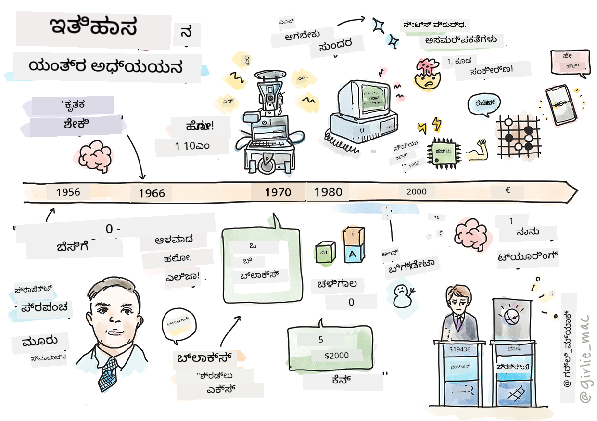
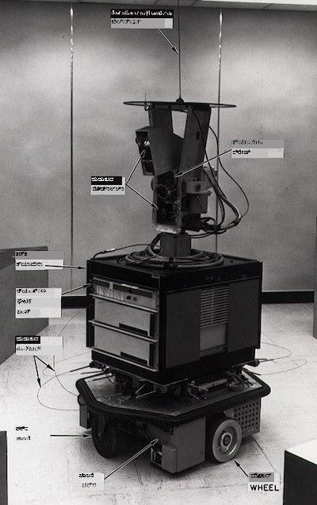
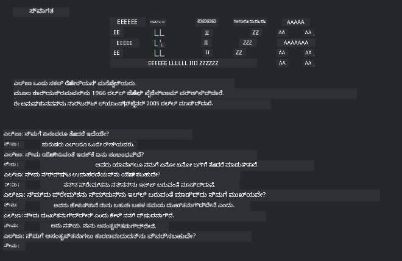

<!--
CO_OP_TRANSLATOR_METADATA:
{
  "original_hash": "6a05fec147e734c3e6bfa54505648e2b",
  "translation_date": "2025-12-19T13:30:50+00:00",
  "source_file": "1-Introduction/2-history-of-ML/README.md",
  "language_code": "kn"
}
-->
# ಯಂತ್ರ ಅಧ್ಯಯನದ ಇತಿಹಾಸ

> ಸ್ಕೆಚ್‌ನೋಟ್: [ಟೊಮೊಮಿ ಇಮುರಾ](https://www.twitter.com/girlie_mac)

## [ಪೂರ್ವ-ಪಾಠ ಪ್ರಶ್ನೋತ್ತರ](https://ff-quizzes.netlify.app/en/ml/)

---

> 🎥 ಈ ಪಾಠವನ್ನು ವಿವರಿಸುವ ಚಿಕ್ಕ ವೀಡಿಯೊಗಾಗಿ ಮೇಲಿನ ಚಿತ್ರವನ್ನು ಕ್ಲಿಕ್ ಮಾಡಿ.

ಈ ಪಾಠದಲ್ಲಿ, ನಾವು ಯಂತ್ರ ಅಧ್ಯಯನ ಮತ್ತು ಕೃತಕ ಬುದ್ಧಿಮತ್ತೆಯ ಇತಿಹಾಸದ ಪ್ರಮುಖ ಮೈಲಿಗಲ್ಲುಗಳನ್ನು ಪರಿಶೀಲಿಸುವೆವು.

ಕೃತಕ ಬುದ್ಧಿಮತ್ತೆ (AI) ಕ್ಷೇತ್ರದ ಇತಿಹಾಸವು ಯಂತ್ರ ಅಧ್ಯಯನದ ಇತಿಹಾಸದೊಂದಿಗೆ絡ಗೊಂಡಿದೆ, ಏಕೆಂದರೆ ML ಅನ್ನು ಆಧರಿಸುವ ಅಲ್ಗಾರಿದಮ್ಗಳು ಮತ್ತು ಗಣನಾತ್ಮಕ ಪ್ರಗತಿಗಳು AI ಅಭಿವೃದ್ಧಿಗೆ ಸಹಾಯ ಮಾಡಿವೆ. ಈ ಕ್ಷೇತ್ರಗಳು 1950ರ ದಶಕದಲ್ಲಿ ಪ್ರತ್ಯೇಕ ವಿಚಾರಣಾ ಕ್ಷೇತ್ರಗಳಾಗಿ ರೂಪುಗೊಂಡರೂ, ಪ್ರಮುಖ [ಅಲ್ಗಾರಿದಮಿಕ್, ಸಾಂಖ್ಯಿಕ, ಗಣಿತೀಯ, ಗಣನಾತ್ಮಕ ಮತ್ತು ತಾಂತ್ರಿಕ ಆವಿಷ್ಕಾರಗಳು](https://wikipedia.org/wiki/Timeline_of_machine_learning) ಈ ಕಾಲಘಟ್ಟಕ್ಕಿಂತ ಮುಂಚಿತವಾಗಿಯೂ ಮತ್ತು ಅಡ್ಡವಾಗಿ ನಡೆದಿವೆ. ವಾಸ್ತವವಾಗಿ, ಜನರು ಈ ಪ್ರಶ್ನೆಗಳ ಬಗ್ಗೆ [ನೂರು ವರ್ಷಗಳಿಂದ](https://wikipedia.org/wiki/History_of_artificial_intelligence) ಯೋಚಿಸುತ್ತಿದ್ದಾರೆ: ಈ ಲೇಖನವು 'ಚಿಂತಿಸುವ ಯಂತ್ರ' ಎಂಬ ಕಲ್ಪನೆಯ ಇತಿಹಾಸಾತ್ಮಕ ಬೌದ್ಧಿಕ ಆಧಾರಗಳನ್ನು ಚರ್ಚಿಸುತ್ತದೆ.

---
## ಪ್ರಮುಖ ಆವಿಷ್ಕಾರಗಳು

- 1763, 1812 [ಬೇಯ್ಸ್ ಸಿದ್ಧಾಂತ](https://wikipedia.org/wiki/Bayes%27_theorem) ಮತ್ತು ಅದರ ಪೂರ್ವಜರು. ಈ ಸಿದ್ಧಾಂತ ಮತ್ತು ಅದರ ಅನ್ವಯಗಳು ನಿರ್ಣಯಕ್ಕೆ ಆಧಾರವಾಗಿದ್ದು, ಹಿಂದಿನ ಜ್ಞಾನ ಆಧಾರದ ಮೇಲೆ ಘಟನೆ ಸಂಭವಿಸುವ ಸಾಧ್ಯತೆಯನ್ನು ವಿವರಿಸುತ್ತದೆ.
- 1805 [ಕನಿಷ್ಠ ಚದರ ಸಿದ್ಧಾಂತ](https://wikipedia.org/wiki/Least_squares) ಫ್ರೆಂಚ್ ಗಣಿತಜ್ಞ ಅಡ್ರಿಯನ್-ಮೇರಿ ಲೆಜೆಂಡ್ರ್ ರವರಿಂದ. ಈ ಸಿದ್ಧಾಂತವನ್ನು ನೀವು ನಮ್ಮ ರಿಗ್ರೆಷನ್ ಘಟಕದಲ್ಲಿ ಕಲಿಯುತ್ತೀರಿ, ಇದು ಡೇಟಾ ಹೊಂದಾಣಿಕೆಗೆ ಸಹಾಯ ಮಾಡುತ್ತದೆ.
- 1913 [ಮಾರ್ಕೋವ್ ಸರಪಳಿ](https://wikipedia.org/wiki/Markov_chain), ರಷ್ಯನ್ ಗಣಿತಜ್ಞ ಆಂಡ್ರೇ ಮಾರ್ಕೋವ್ ಅವರ ಹೆಸರಿನಲ್ಲಿ, ಹಿಂದಿನ ಸ್ಥಿತಿಯ ಆಧಾರದ ಮೇಲೆ ಸಂಭವನೀಯ ಘಟನೆಗಳ ಸರಣಿಯನ್ನು ವಿವರಿಸಲು ಬಳಸಲಾಗುತ್ತದೆ.
- 1957 [ಪರ್ಸೆಪ್ಟ್ರಾನ್](https://wikipedia.org/wiki/Perceptron) ಅಮೆರಿಕನ್ ಮನೋವೈಜ್ಞಾನಿಕ ಫ್ರಾಂಕ್ ರೋಸೆನ್‌ಬ್ಲಾಟ್ ರವರಿಂದ ಆವಿಷ್ಕೃತ ಲೀನಿಯರ್ ವರ್ಗೀಕರಣದ ಒಂದು ಪ್ರಕಾರ, ಇದು ಡೀಪ್ ಲರ್ನಿಂಗ್‌ನಲ್ಲಿ ಪ್ರಗತಿಗೆ ಆಧಾರವಾಗಿದೆ.

---

- 1967 [ನಿಕಟಮ ಸನ್ನಿಹಿತ](https://wikipedia.org/wiki/Nearest_neighbor) ಮೂಲತಃ ಮಾರ್ಗಗಳನ್ನು ನಕ್ಷೆ ಮಾಡಲು ವಿನ್ಯಾಸಗೊಳಿಸಲಾದ ಅಲ್ಗಾರಿದಮ್. ML ಸನ್ನಿವೇಶದಲ್ಲಿ ಇದು ಮಾದರಿಗಳನ್ನು ಪತ್ತೆಹಚ್ಚಲು ಬಳಸಲಾಗುತ್ತದೆ.
- 1970 [ಬ್ಯಾಕ್‌ಪ್ರೊಪಾಗೇಶನ್](https://wikipedia.org/wiki/Backpropagation) [ಫೀಡ್‌ಫಾರ್ವರ್ಡ್ ನ್ಯೂರಲ್ ನೆಟ್‌ವರ್ಕ್‌ಗಳನ್ನು](https://wikipedia.org/wiki/Feedforward_neural_network) ತರಬೇತಿಗೆ ಬಳಸಲಾಗುತ್ತದೆ.
- 1982 [ರಿಕರೆಂಟ್ ನ್ಯೂರಲ್ ನೆಟ್‌ವರ್ಕ್‌ಗಳು](https://wikipedia.org/wiki/Recurrent_neural_network) ಫೀಡ್‌ಫಾರ್ವರ್ಡ್ ನ್ಯೂರಲ್ ನೆಟ್‌ವರ್ಕ್‌ಗಳಿಂದ ಉತ್ಪನ್ನವಾದ ಕೃತಕ ನ್ಯೂರಲ್ ನೆಟ್‌ವರ್ಕ್‌ಗಳು, ಅವು ಕಾಲಾತೀತ ಗ್ರಾಫ್‌ಗಳನ್ನು ರಚಿಸುತ್ತವೆ.

✅ ಸ್ವಲ್ಪ ಸಂಶೋಧನೆ ಮಾಡಿ. ML ಮತ್ತು AI ಇತಿಹಾಸದಲ್ಲಿ ಇನ್ನೇನು ಪ್ರಮುಖ ದಿನಾಂಕಗಳು ಗಮನಾರ್ಹವಾಗಿವೆ?

---
## 1950: ಚಿಂತಿಸುವ ಯಂತ್ರಗಳು

ಅಲನ್ ಟ್ಯೂರಿಂಗ್, 2019 ರಲ್ಲಿ [ಸಾರ್ವಜನಿಕರಿಂದ](https://wikipedia.org/wiki/Icons:_The_Greatest_Person_of_the_20th_Century) 20ನೇ ಶತಮಾನದ ಅತ್ಯುತ್ತಮ ವಿಜ್ಞಾನಿಯಾಗಿ ಮತದಾನಗೊಂಡ ಅತ್ಯಂತ ಅದ್ಭುತ ವ್ಯಕ್ತಿ, 'ಚಿಂತಿಸುವ ಯಂತ್ರ' ಎಂಬ ಕಲ್ಪನೆಗೆ ಆಧಾರವನ್ನು ನೀಡಿದವರಾಗಿ ಗುರುತಿಸಲ್ಪಟ್ಟಿದ್ದಾರೆ. ಅವರು ಈ ಕಲ್ಪನೆಯ ಪ್ರಾಯೋಗಿಕ ಸಾಕ್ಷ್ಯಕ್ಕಾಗಿ ತೀವ್ರವಾಗಿ ಯೋಚಿಸಿ, [ಟ್ಯೂರಿಂಗ್ ಪರೀಕ್ಷೆ](https://www.bbc.com/news/technology-18475646) ರಚಿಸಿದರು, ಇದನ್ನು ನೀವು ನಮ್ಮ NLP ಪಾಠಗಳಲ್ಲಿ ಅನ್ವೇಷಿಸುವಿರಿ.

---
## 1956: ಡಾರ್ಟ್‌ಮೌತ್ ಬೇಸಿಗೆ ಸಂಶೋಧನಾ ಯೋಜನೆ

"ಕೃತಕ ಬುದ್ಧಿಮತ್ತೆ ಕ್ಷೇತ್ರದ ಪ್ರಮುಖ ಘಟನೆ ಆಗಿದ್ದ ಡಾರ್ಟ್‌ಮೌತ್ ಬೇಸಿಗೆ ಸಂಶೋಧನಾ ಯೋಜನೆ," ಇಲ್ಲಿ 'ಕೃತಕ ಬುದ್ಧಿಮತ್ತೆ' ಪದವನ್ನು ರೂಪಿಸಲಾಯಿತು ([ಮೂಲ](https://250.dartmouth.edu/highlights/artificial-intelligence-ai-coined-dartmouth)).

> ಕಲಿಕೆಯ ಪ್ರತಿಯೊಂದು ಅಂಶ ಅಥವಾ ಬುದ್ಧಿಮತ್ತೆಯ ಯಾವುದೇ ವೈಶಿಷ್ಟ್ಯವನ್ನು ಯಂತ್ರವು ನಕಲಿಸಲು ಸಾಧ್ಯವಾಗುವಂತೆ ನಿಖರವಾಗಿ ವರ್ಣಿಸಬಹುದು.

---

ಮುಖ್ಯ ಸಂಶೋಧಕ, ಗಣಿತ ಪ್ರಾಧ್ಯಾಪಕ ಜಾನ್ ಮ್ಯಾಕಾರ್ಥಿ, "ಕಲಿಕೆಯ ಪ್ರತಿಯೊಂದು ಅಂಶ ಅಥವಾ ಬುದ್ಧಿಮತ್ತೆಯ ಯಾವುದೇ ವೈಶಿಷ್ಟ್ಯವನ್ನು ಯಂತ್ರವು ನಕಲಿಸಲು ಸಾಧ್ಯವಾಗುವಂತೆ ನಿಖರವಾಗಿ ವರ್ಣಿಸಬಹುದು" ಎಂಬ ಊಹಾಪೋಹದ ಆಧಾರದ ಮೇಲೆ ಮುಂದುವರೆಯಲು ಆಶಿಸಿದರು. ಭಾಗವಹಿಸಿದವರಲ್ಲಿ ಮತ್ತೊಬ್ಬ ಪ್ರಸಿದ್ಧ ವ್ಯಕ್ತಿ ಮಾರ್ವಿನ್ ಮಿನ್ಸ್ಕಿ ಇದ್ದರು.

ಈ ಕಾರ್ಯಾಗಾರವು "ಪ್ರತೀಕಾತ್ಮಕ ವಿಧಾನಗಳ ಏರಿಕೆ, ನಿರ್ದಿಷ್ಟ ಕ್ಷೇತ್ರಗಳ ಮೇಲೆ ಕೇಂದ್ರೀಕೃತ ವ್ಯವಸ್ಥೆಗಳು (ಆರಂಭಿಕ ತಜ್ಞ ವ್ಯವಸ್ಥೆಗಳು), ಮತ್ತು ನಿರೂಪಣಾತ್ಮಕ ವ್ಯವಸ್ಥೆಗಳು ವಿರುದ್ಧ ಅನುಪಾತಾತ್ಮಕ ವ್ಯವಸ್ಥೆಗಳು" ಸೇರಿದಂತೆ ಹಲವು ಚರ್ಚೆಗಳನ್ನು ಪ್ರಾರಂಭಿಸಿ ಉತ್ತೇಜನ ನೀಡಿದಂತೆ ಗುರುತಿಸಲಾಗಿದೆ ([ಮೂಲ](https://wikipedia.org/wiki/Dartmouth_workshop)).

---
## 1956 - 1974: "ಸುವರ್ಣ ಯುಗ"

1950ರ ದಶಕದಿಂದ 1970ರ ಮಧ್ಯದವರೆಗೆ, AI ಅನೇಕ ಸಮಸ್ಯೆಗಳನ್ನು ಪರಿಹರಿಸಬಹುದು ಎಂಬ ಭರವಸೆ ಉತ್ಕೃಷ್ಟವಾಗಿತ್ತು. 1967 ರಲ್ಲಿ ಮಾರ್ವಿನ್ ಮಿನ್ಸ್ಕಿ ನಂಬಿಕೆಯಿಂದ ಹೇಳಿದಂತೆ, "ಒಂದು ತಲೆಮಾರಿಗೆ ಒಳಗಾಗಿ ... 'ಕೃತಕ ಬುದ್ಧಿಮತ್ತೆ' ಸೃಷ್ಟಿಸುವ ಸಮಸ್ಯೆ ಬಹುಮಟ್ಟಿಗೆ ಪರಿಹಾರವಾಗುತ್ತದೆ." (ಮಿನ್ಸ್ಕಿ, ಮಾರ್ವಿನ್ (1967), ಗಣನೆ: ಸೀಮಿತ ಮತ್ತು ಅನಂತ ಯಂತ್ರಗಳು, ಎಂಗಲ್‌ವುಡ್ ಕ್ಲಿಫ್ಸ್, N.J.: ಪ್ರೆಂಟಿಸ್-ಹಾಲ್)

ಸ್ವಾಭಾವಿಕ ಭಾಷಾ ಪ್ರಕ್ರಿಯೆ ಸಂಶೋಧನೆ ಬೆಳವಣಿಗೆ ಕಂಡಿತು, ಹುಡುಕಾಟವನ್ನು ಸುಧಾರಿಸಿ ಶಕ್ತಿಶಾಲಿ ಮಾಡಲಾಯಿತು, ಮತ್ತು 'ಮೈಕ್ರೋ-ವಿಶ್ವಗಳು' ಎಂಬ ಕಲ್ಪನೆ ಹುಟ್ಟಿತು, ಇಲ್ಲಿ ಸರಳ ಕಾರ್ಯಗಳನ್ನು ಸರಳ ಭಾಷಾ ಸೂಚನೆಗಳ ಮೂಲಕ ಪೂರ್ಣಗೊಳಿಸಲಾಗುತ್ತಿತ್ತು.

---

ಸರ್ಕಾರಿ ಸಂಸ್ಥೆಗಳ ಮೂಲಕ ಸಂಶೋಧನೆಗೆ ಉತ್ತಮ ಹಣಕಾಸು ದೊರಕಿತು, ಗಣನೆ ಮತ್ತು ಅಲ್ಗಾರಿದಮ್ಗಳಲ್ಲಿ ಪ್ರಗತಿ ಕಂಡುಬಂದಿತು, ಮತ್ತು ಬುದ್ಧಿವಂತ ಯಂತ್ರಗಳ ಪ್ರೋಟೋಟೈಪ್ಗಳು ನಿರ್ಮಿಸಲ್ಪಟ್ಟವು. ಕೆಲವು ಯಂತ್ರಗಳು:

* [ಶೇಕಿ ರೋಬೋಟ್](https://wikipedia.org/wiki/Shakey_the_robot), ಯಾರು 'ಬುದ್ಧಿವಂತಿಕೆಯಿಂದ' ಕಾರ್ಯಗಳನ್ನು ನಿರ್ವಹಿಸಲು ಮತ್ತು ನಿರ್ಧರಿಸಲು ಸಾಧ್ಯವಿತ್ತು.

    
    > 1972 ರಲ್ಲಿ ಶೇಕಿ

---

* ಎಲಿಜಾ, ಆರಂಭಿಕ 'ಚಾಟ್‌ಬಾಟ್', ಜನರೊಂದಿಗೆ ಸಂಭಾಷಣೆ ನಡೆಸಲು ಮತ್ತು ಪ್ರಾಥಮಿಕ 'ಥೆರಪಿಸ್ಟ್' ಆಗ ಕಾರ್ಯನಿರ್ವಹಿಸಲು ಸಾಧ್ಯವಿತ್ತು. NLP ಪಾಠಗಳಲ್ಲಿ ನೀವು ಎಲಿಜಾ ಬಗ್ಗೆ ಹೆಚ್ಚು ತಿಳಿಯುತ್ತೀರಿ.

    
    > ಎಲಿಜಾ, ಒಂದು ಚಾಟ್‌ಬಾಟ್‌ನ ಆವೃತ್ತಿ

---

* "ಬ್ಲಾಕ್ಸ್ ವರ್ಲ್ಡ್" ಎಂಬ ಮೈಕ್ರೋ-ವಿಶ್ವದಲ್ಲಿ ಬ್ಲಾಕ್ಗಳನ್ನು ಸರಿದೂಗಿಸಿ ವಿಂಗಡಿಸಲಾಗುತ್ತಿತ್ತು, ಮತ್ತು ಯಂತ್ರಗಳಿಗೆ ನಿರ್ಧಾರಗಳನ್ನು ಕಲಿಸುವ ಪ್ರಯೋಗಗಳನ್ನು ಪರೀಕ್ಷಿಸಲಾಗುತ್ತಿತ್ತು. [SHRDLU](https://wikipedia.org/wiki/SHRDLU) ಮುಂತಾದ ಗ್ರಂಥಾಲಯಗಳೊಂದಿಗೆ ನಿರ್ಮಿತ ಪ್ರಗತಿಗಳು ಭಾಷಾ ಪ್ರಕ್ರಿಯೆಯನ್ನು ಮುಂದುವರಿಸಲು ಸಹಾಯ ಮಾಡಿತು.

    

    > 🎥 ಮೇಲಿನ ಚಿತ್ರವನ್ನು ಕ್ಲಿಕ್ ಮಾಡಿ ವೀಡಿಯೊ: SHRDLU ಜೊತೆಗೆ ಬ್ಲಾಕ್ಸ್ ವರ್ಲ್ಡ್

---
## 1974 - 1980: "AI ಚಳಿಗಾಲ"

1970ರ ಮಧ್ಯದಲ್ಲಿ, 'ಬುದ್ಧಿವಂತ ಯಂತ್ರಗಳನ್ನು' ನಿರ್ಮಿಸುವ ಸಂಕೀರ್ಣತೆ ಕಡಿಮೆ ಅಂದಾಜಿತವಾಗಿದ್ದು, ಲಭ್ಯವಿರುವ ಗಣನ ಶಕ್ತಿಯೊಂದಿಗೆ ಅದರ ಭರವಸೆ ಹೆಚ್ಚಾಗಿ ಹೇಳಲ್ಪಟ್ಟಿತು ಎಂಬುದು ಸ್ಪಷ್ಟವಾಯಿತು. ಹಣಕಾಸು ಕಡಿಮೆಯಾಯಿತು ಮತ್ತು ಕ್ಷೇತ್ರದ ಮೇಲೆ ನಂಬಿಕೆ ಕುಗ್ಗಿತು. ನಂಬಿಕೆಗೆ ಪರಿಣಾಮ ಬೀರುವ ಕೆಲವು ಸಮಸ್ಯೆಗಳು:

---
- **ಮಿತಿಗಳು**. ಗಣನ ಶಕ್ತಿ ತುಂಬಾ ಸೀಮಿತವಾಗಿತ್ತು.
- **ಸಂಯೋಜನಾತ್ಮಕ ಸ್ಫೋಟ**. ಗಣಕಗಳಿಗೆ ಹೆಚ್ಚು ಕೇಳಿದಂತೆ ತರಬೇತಿಗೆ ಬೇಕಾದ ಪರಿಮಾಣಗಳು ಗಣನೀಯವಾಗಿ ಹೆಚ್ಚಾಗುತ್ತಿದ್ದು, ಗಣನ ಶಕ್ತಿ ಮತ್ತು ಸಾಮರ್ಥ್ಯದ ಸಮಕಾಲೀನ ಬೆಳವಣಿಗೆ ಇಲ್ಲದೆ ಇತ್ತು.
- **ಡೇಟಾ ಕೊರತೆ**. ಪರೀಕ್ಷೆ, ಅಭಿವೃದ್ಧಿ ಮತ್ತು ಅಲ್ಗಾರಿದಮ್ಗಳ ಸುಧಾರಣೆಗೆ ಡೇಟಾ ಕೊರತೆ ಅಡ್ಡಿಪಡಿಸಿತು.
- **ನಾವು ಸರಿಯಾದ ಪ್ರಶ್ನೆಗಳನ್ನು ಕೇಳುತ್ತಿದ್ದೇವೇ?**. ಕೇಳಲಾಗುತ್ತಿದ್ದ ಪ್ರಶ್ನೆಗಳೇ ಪ್ರಶ್ನೆಗೆ ಒಳಗಾದವು. ಸಂಶೋಧಕರು ತಮ್ಮ ವಿಧಾನಗಳ ಬಗ್ಗೆ ಟೀಕೆಗಳನ್ನು ಎದುರಿಸಿದರು:
  - ಟ್ಯೂರಿಂಗ್ ಪರೀಕ್ಷೆಗಳನ್ನು 'ಚೈನೀಸ್ ರೂಮ್ ಸಿದ್ಧಾಂತ' ಮುಂತಾದ ಕಲ್ಪನೆಗಳ ಮೂಲಕ ಪ್ರಶ್ನಿಸಲಾಯಿತು, ಇದು "ಡಿಜಿಟಲ್ ಕಂಪ್ಯೂಟರ್ ಪ್ರೋಗ್ರಾಮಿಂಗ್ ಭಾಷೆಯನ್ನು ಅರ್ಥಮಾಡಿಕೊಳ್ಳುವಂತೆ ತೋರುತ್ತದೆ ಆದರೆ ನಿಜವಾದ ಅರ್ಥಮಾಡಿಕೊಳಲು ಸಾಧ್ಯವಿಲ್ಲ" ಎಂದು ಹೇಳುತ್ತದೆ ([ಮೂಲ](https://plato.stanford.edu/entries/chinese-room/)).
  - "ಥೆರಪಿಸ್ಟ್" ಎಲಿಜಾ ಮುಂತಾದ ಕೃತಕ ಬುದ್ಧಿಮತ್ತೆಗಳನ್ನು ಸಮಾಜಕ್ಕೆ ಪರಿಚಯಿಸುವ ನೈತಿಕತೆ ಪ್ರಶ್ನಿಸಲಾಯಿತು.

---

ಅದೇ ಸಮಯದಲ್ಲಿ, ವಿವಿಧ AI ಚಿಂತನೆ ಶಾಲೆಗಳು ರೂಪುಗೊಂಡವು. ["ಸ್ಕ್ರಫಿ" ಮತ್ತು "ನೀಟ್ AI"](https://wikipedia.org/wiki/Neats_and_scruffies) ಅಭ್ಯಾಸಗಳ ನಡುವೆ ವಿಭಜನೆ ಸ್ಥಾಪಿತವಾಯಿತು. _ಸ್ಕ್ರಫಿ_ ಪ್ರಯೋಗಾಲಯಗಳು ಗಂಟೆಗಳ ಕಾಲ ಪ್ರೋಗ್ರಾಮ್‌ಗಳನ್ನು ತಿದ್ದುಪಡಿ ಮಾಡಿ ಬೇಕಾದ ಫಲಿತಾಂಶಗಳನ್ನು ಪಡೆದವು. _ನೀಟ್_ ಪ್ರಯೋಗಾಲಯಗಳು "ತರ್ಕ ಮತ್ತು ಅಧಿಕೃತ ಸಮಸ್ಯೆ ಪರಿಹಾರ" ಮೇಲೆ ಕೇಂದ್ರೀಕರಿಸಿದವು. ಎಲಿಜಾ ಮತ್ತು SHRDLU ಪ್ರಸಿದ್ಧ _ಸ್ಕ್ರಫಿ_ ವ್ಯವಸ್ಥೆಗಳಾಗಿದ್ದವು. 1980ರ ದಶಕದಲ್ಲಿ, ML ವ್ಯವಸ್ಥೆಗಳನ್ನು ಪುನರಾವರ್ತಿಸಬಹುದಾದಂತೆ ಮಾಡಲು ಬೇಡಿಕೆ ಬಂದಾಗ, _ನೀಟ್_ ವಿಧಾನವು ಮುಂಚೂಣಿಗೆ ಬಂತು ಏಕೆಂದರೆ ಅದರ ಫಲಿತಾಂಶಗಳು ಹೆಚ್ಚು ವಿವರಿಸಬಹುದಾಗಿವೆ.

---
## 1980ರ ದಶಕ ತಜ್ಞ ವ್ಯವಸ್ಥೆಗಳು

ಕ್ಷೇತ್ರ ಬೆಳೆಯುತ್ತಾ, ಅದರ ವ್ಯವಹಾರಕ್ಕೆ ಲಾಭ ಸ್ಪಷ್ಟವಾಗುತ್ತಾ, 1980ರ ದಶಕದಲ್ಲಿ 'ತಜ್ಞ ವ್ಯವಸ್ಥೆಗಳ' ವ್ಯಾಪಾರವೂ ಹೆಚ್ಚಿತು. "ತಜ್ಞ ವ್ಯವಸ್ಥೆಗಳು ಕೃತಕ ಬುದ್ಧಿಮತ್ತೆ (AI) ಸಾಫ್ಟ್‌ವೇರ್‌ನ ಮೊದಲ ಯಶಸ್ವಿ ರೂಪಗಳಲ್ಲಿ ಒಂದಾಗಿವೆ." ([ಮೂಲ](https://wikipedia.org/wiki/Expert_system)).

ಈ ರೀತಿಯ ವ್ಯವಸ್ಥೆ ಭಾಗಶಃ ನಿಯಮ ಇಂಜಿನ್ ಮತ್ತು ನಿಯಮ ವ್ಯವಸ್ಥೆಯನ್ನು ಉಪಯೋಗಿಸಿ ಹೊಸ ತತ್ವಗಳನ್ನು ನಿರ್ಣಯಿಸುವ ನಿರ್ಣಯ ಇಂಜಿನ್‌ನಿಂದ ಕೂಡಿದೆ.

ಈ ಕಾಲದಲ್ಲಿ ನ್ಯೂರಲ್ ನೆಟ್‌ವರ್ಕ್‌ಗಳಿಗೆ ಹೆಚ್ಚುವರಿ ಗಮನ ನೀಡಲಾಯಿತು.

---
## 1987 - 1993: AI 'ಚಿಲ್'

ವಿಶೇಷ ತಜ್ಞ ವ್ಯವಸ್ಥೆಗಳ ಹಾರ್ಡ್‌ವೇರ್ ವ್ಯಾಪಾರವು ತುಂಬಾ ವಿಶೇಷೀಕೃತವಾಗುವ ಪರಿಣಾಮ ಉಂಟುಮಾಡಿತು. ವೈಯಕ್ತಿಕ ಕಂಪ್ಯೂಟರ್‌ಗಳ ಏರಿಕೆ ಈ ದೊಡ್ಡ, ವಿಶೇಷೀಕೃತ, ಕೇಂದ್ರಿತ ವ್ಯವಸ್ಥೆಗಳಿಗೆ ಸ್ಪರ್ಧೆ ನೀಡಿತು. ಗಣನದ ಪ್ರಜಾಪ್ರಭುತ್ವ ಆರಂಭವಾಯಿತು ಮತ್ತು ಇದು ದೊಡ್ಡ ಡೇಟಾ ಸ್ಫೋಟಕ್ಕೆ ದಾರಿ ಮಾಡಿಕೊಟ್ಟಿತು.

---
## 1993 - 2011

ಈ ಕಾಲಘಟ್ಟದಲ್ಲಿ ML ಮತ್ತು AI ಹೊಸ ಯುಗವನ್ನು ಕಂಡವು, ಮೊದಲಿನ ಡೇಟಾ ಮತ್ತು ಗಣನ ಶಕ್ತಿಯ ಕೊರತೆಗಳಿಂದ ಉಂಟಾದ ಸಮಸ್ಯೆಗಳನ್ನು ಪರಿಹರಿಸಲು ಸಾಧ್ಯವಾಯಿತು. ಡೇಟಾ ಪ್ರಮಾಣವು ವೇಗವಾಗಿ ಹೆಚ್ಚಿತು ಮತ್ತು ಹೆಚ್ಚು ಲಭ್ಯವಾಯಿತು, ವಿಶೇಷವಾಗಿ 2007 ರ ಸ್ಮಾರ್ಟ್‌ಫೋನ್ ಆಗಮನದೊಂದಿಗೆ. ಗಣನ ಶಕ್ತಿ ಗಣನೀಯವಾಗಿ ವೃದ್ಧಿಸಿತು ಮತ್ತು ಅಲ್ಗಾರಿದಮ್ಗಳು ಸಹ ಬೆಳವಣಿಗೆ ಕಂಡವು. ಕ್ಷೇತ್ರವು ವಯಸ್ಕತೆಯನ್ನು ಪಡೆದುಕೊಂಡಿತು ಮತ್ತು ಮುಂಚಿನ ಮುಕ್ತ ಚಟುವಟಿಕೆಗಳು ನಿಜವಾದ ಶಿಸ್ತಿನ ರೂಪದಲ್ಲಿ ರೂಪುಗೊಂಡವು.

---
## ಈಗ

ಇಂದು ಯಂತ್ರ ಅಧ್ಯಯನ ಮತ್ತು AI ನಮ್ಮ ಜೀವನದ ಬಹುತೇಕ ಭಾಗಗಳನ್ನು ಸ್ಪರ್ಶಿಸುತ್ತವೆ. ಈ ಯುಗವು ಈ ಅಲ್ಗಾರಿದಮ್ಗಳ ಮಾನವ ಜೀವನದ ಮೇಲೆ ಇರುವ ಅಪಾಯಗಳು ಮತ್ತು ಸಾಧ್ಯತೆಗಳನ್ನು ಜಾಗರೂಕತೆಯಿಂದ ಅರ್ಥಮಾಡಿಕೊಳ್ಳಬೇಕಾಗಿದೆ. ಮೈಕ್ರೋಸಾಫ್ಟ್‌ನ ಬ್ರಾಡ್ ಸ್ಮಿತ್ ಹೇಳಿರುವಂತೆ, "ಮಾಹಿತಿ ತಂತ್ರಜ್ಞಾನವು ಗೌಪ್ಯತೆ ಮತ್ತು ಅಭಿವ್ಯಕ್ತಿಯ ಸ್ವಾತಂತ್ರ್ಯಗಳಂತಹ ಮೂಲಭೂತ ಮಾನವ ಹಕ್ಕುಗಳ ರಕ್ಷಣೆಗಳಿಗೆ ಸಂಬಂಧಿಸಿದ ವಿಷಯಗಳನ್ನು ಎತ್ತಿಹಿಡಿಯುತ್ತದೆ. ಈ ಉತ್ಪನ್ನಗಳನ್ನು ಸೃಷ್ಟಿಸುವ ತಂತ್ರಜ್ಞಾನ ಕಂಪನಿಗಳ ಹೊಣೆಗಾರಿಕೆ ಹೆಚ್ಚಿಸುತ್ತದೆ. ನಮ್ಮ ದೃಷ್ಟಿಯಲ್ಲಿ, ಇದು ಯೋಚನಾಶೀಲ ಸರ್ಕಾರ ನಿಯಂತ್ರಣ ಮತ್ತು ಸ್ವೀಕಾರ್ಯ ಬಳಕೆಗಳ ಸುತ್ತಲೂ ನಿಯಮಗಳ ಅಭಿವೃದ್ಧಿಯನ್ನು ಕರೆದೊಯ್ಯುತ್ತದೆ" ([ಮೂಲ](https://www.technologyreview.com/2019/12/18/102365/the-future-of-ais-impact-on-society/)).

---

ಭವಿಷ್ಯದಲ್ಲಿ ಏನು ಸಂಭವಿಸುವುದು ನೋಡಬೇಕಾಗುತ್ತದೆ, ಆದರೆ ಈ ಕಂಪ್ಯೂಟರ್ ವ್ಯವಸ್ಥೆಗಳು ಮತ್ತು ಅವು ಚಾಲನೆ ಮಾಡುವ ಸಾಫ್ಟ್‌ವೇರ್ ಮತ್ತು ಅಲ್ಗಾರಿದಮ್ಗಳನ್ನು ಅರ್ಥಮಾಡಿಕೊಳ್ಳುವುದು ಮುಖ್ಯ. ಈ ಪಠ್ಯಕ್ರಮವು ನಿಮಗೆ ಉತ್ತಮ ಅರ್ಥಮಾಡಿಕೊಳ್ಳಲು ಸಹಾಯ ಮಾಡುತ್ತದೆ ಎಂದು ನಾವು ಆಶಿಸುತ್ತೇವೆ, ನೀವು ಸ್ವತಃ ನಿರ್ಧರಿಸಬಹುದು.

> 🎥 ಮೇಲಿನ ಚಿತ್ರವನ್ನು ಕ್ಲಿಕ್ ಮಾಡಿ ವೀಡಿಯೊ: ಯಾನ್ ಲೆಕನ್ ಈ ಉಪನ್ಯಾಸದಲ್ಲಿ ಡೀಪ್ ಲರ್ನಿಂಗ್ ಇತಿಹಾಸವನ್ನು ಚರ್ಚಿಸುತ್ತಾರೆ

---
## 🚀ಸವಾಲು

ಈ ಇತಿಹಾಸಾತ್ಮಕ ಕ್ಷಣಗಳಲ್ಲಿ ಒಂದನ್ನು ಆಳವಾಗಿ ಅಧ್ಯಯನ ಮಾಡಿ ಮತ್ತು ಅದರ ಹಿಂದೆ ಇರುವ ಜನರನ್ನು ತಿಳಿದುಕೊಳ್ಳಿ. ಅದ್ಭುತ ವ್ಯಕ್ತಿತ್ವಗಳಿವೆ, ಮತ್ತು ಯಾವುದೇ ವೈಜ್ಞಾನಿಕ ಆವಿಷ್ಕಾರವು ಸಾಂಸ್ಕೃತಿಕ ಖಾಲಿಯಲ್ಲಿ ಸೃಷ್ಟಿಸಲ್ಪಟ್ಟಿಲ್ಲ. ನೀವು ಏನು ಕಂಡುಹಿಡಿಯುತ್ತೀರಿ?

## [ಪೋಸ್ಟ್-ಪಾಠ ಪ್ರಶ್ನೋತ್ತರ](https://ff-quizzes.netlify.app/en/ml/)

---
## ವಿಮರ್ಶೆ ಮತ್ತು ಸ್ವಯಂ ಅಧ್ಯಯನ

ಇಲ್ಲಿ ವೀಕ್ಷಿಸಲು ಮತ್ತು ಕೇಳಲು ಐಟಂಗಳು ಇವೆ:

[ಈ ಪಾಡ್‌ಕಾಸ್ಟ್‌ನಲ್ಲಿ ಎಮಿ ಬಾಯ್ಡ್ AI ಅಭಿವೃದ್ಧಿಯನ್ನು ಚರ್ಚಿಸುತ್ತಾರೆ](http://runasradio.com/Shows/Show/739)

---

## ನಿಯೋಜನೆ

[ಟೈಮ್‌ಲೈನ್ ರಚಿಸಿ](assignment.md)

---

<!-- CO-OP TRANSLATOR DISCLAIMER START -->
**ಅಸ್ವೀಕರಣ**:  
ಈ ದಸ್ತಾವೇಜು [Co-op Translator](https://github.com/Azure/co-op-translator) ಎಂಬ AI ಅನುವಾದ ಸೇವೆಯನ್ನು ಬಳಸಿ ಅನುವಾದಿಸಲಾಗಿದೆ. ನಾವು ಶುದ್ಧತೆಯತ್ತ ಪ್ರಯತ್ನಿಸುತ್ತಿದ್ದರೂ, ಸ್ವಯಂಚಾಲಿತ ಅನುವಾದಗಳಲ್ಲಿ ತಪ್ಪುಗಳು ಅಥವಾ ಅಸತ್ಯತೆಗಳು ಇರಬಹುದು ಎಂದು ದಯವಿಟ್ಟು ಗಮನಿಸಿ. ಮೂಲ ಭಾಷೆಯಲ್ಲಿರುವ ಮೂಲ ದಸ್ತಾವೇಜನ್ನು ಅಧಿಕೃತ ಮೂಲವೆಂದು ಪರಿಗಣಿಸಬೇಕು. ಪ್ರಮುಖ ಮಾಹಿತಿಗಾಗಿ, ವೃತ್ತಿಪರ ಮಾನವ ಅನುವಾದವನ್ನು ಶಿಫಾರಸು ಮಾಡಲಾಗುತ್ತದೆ. ಈ ಅನುವಾದ ಬಳಕೆಯಿಂದ ಉಂಟಾಗುವ ಯಾವುದೇ ತಪ್ಪು ಅರ್ಥಮಾಡಿಕೊಳ್ಳುವಿಕೆ ಅಥವಾ ತಪ್ಪು ವಿವರಣೆಗಳಿಗೆ ನಾವು ಹೊಣೆಗಾರರಾಗುವುದಿಲ್ಲ.
<!-- CO-OP TRANSLATOR DISCLAIMER END -->