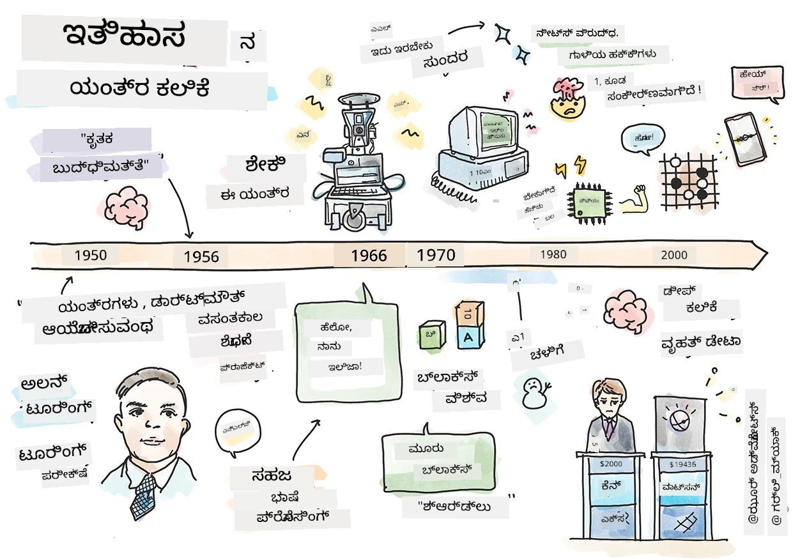
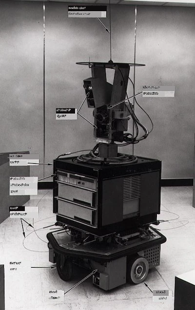
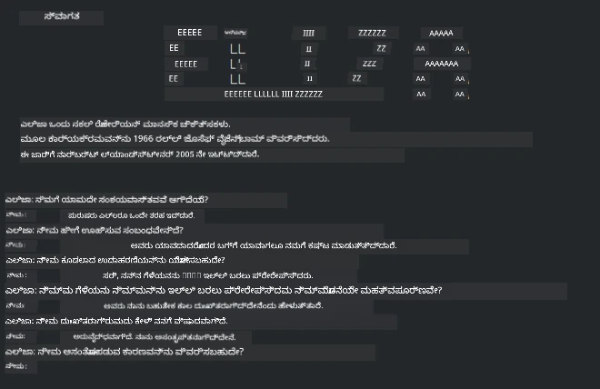

# ಯಂತ್ರ ಶಿಕ್ಷಣದ ಇತಿಹಾಸ  

> ಸಕೇಚ್ನೋಟ್ ರಚನೆ: [ನು ಟೊಮೊಮಿ ಇಮುುರಾ](https://www.twitter.com/girlie_mac)

## [ಪೂರ್ವ-ಪಾಠ ಕ್ವಿಜ್](https://ff-quizzes.netlify.app/en/ml/)

---

> 🎥 ಈ ಪಾಠದ ಮೂಲಕ ಇರುವ ಒಂದು ಚಿಕ್ಕ ವಿಡಿಯೋ ನೋಡಲು ಮೇಲಿನ ಚಿತ್ರವನ್ನು ಕ್ಲಿಕ್ ಮಾಡಿ.

ಈ ಪಾಠದಲ್ಲಿ, ನಾವು ಯಂತ್ರ ಶಿಕ್ಷಣ ಮತ್ತು ಕೃತಕ ಬುದ್ಧಿಮತ್ತೆಯ ಇತಿಹಾಸದ ಪ್ರಮುಖ ಮೈಲುಗಲ್ಲುಗಳನ್ನು ವಿಶ್ಲೇಷಿಸೋಣ.

ಕೃತಕ ಬುದ್ಧಿಮತ್ತೆ (AI) ಕ್ಷೇತ್ರದ ಇತಿಹಾಸವು ಯಂತ್ರ ಶಿಕ್ಷಣದ ಇತಿಹಾಸದೊಂದಿಗೆ絡ಗೊಂಡಿದ್ದು, ML ನ ಆಧಾರದ_algorithms ಮತ್ತು ಗಣಕ ತಾಂತ್ರಿಕ ಪ್ರಗತಿಗಳು AI ನ ಅಭಿವೃದ್ಧಿಗೆ ಕಾರಣವಾಗಿದೆ. ಈ ಕ್ಷೇತ್ರಗಳು 1950 ರಲ್ಲಿ ವಿಶಿಷ್ಟ ಅಭ್ಯಾಸಗಳಾಗಿ ಪ್ರಾರಂಭವಾದರೂ, [ಆಲ್ಗೋರಿದ್ಧ್ಮಿಕ, ಸಾಂಖ್ಯಿಕ, ಗಣಿತೀಯ, ಗಣಕ ಮತ್ತು ತಾಂತ್ರಿಕ ಅನ್ವೇಷಣೆಗಳು](https://wikipedia.org/wiki/Timeline_of_machine_learning) ಈ ಕಾಲವನ್ನು ಮೀರಿಸಿ ಇನ್ನೂ ಶತಗಳು ಹಿಂದೆ ಇವೆ. ನಿಜಕ್ಕೂ, ಜನರು ಈ ಪ್ರಶ್ನೆಗಳ ಬಗ್ಗೆ [ನೂರಾರು ವರ್ಷಗಳಿಂದ](https://wikipedia.org/wiki/History_of_artificial_intelligence) ಯೋಚಿಸುತ್ತಿದ್ದರೆಂದು ನಾವು ತಿಳಿದುಕೊಳ್ಳಬಹುದು: ಈ ಲೇಖನ 'ಯೋಚಿಸುವ ಯಂತ್ರ' ಎನ್ನುವ ಕಲ್ಪನೆಯ ವಿಚಾರಾತ್ಮಕ ಮೂಲಗಳನ್ನು ಚರ್ಚಿಸುತ್ತದೆ.

---
## ಪ್ರಮುಖ ಆವಿಷ್ಕಾರಗಳು

- 1763, 1812 [ಬೇಯ್ಸ್ ಸಿದ್ಧಾಂತ](https://wikipedia.org/wiki/Bayes%27_theorem) ಮತ್ತು ಅದರ ಹಿಂದಿನ ಸಿದ್ಧಾಂತಗಳು. ಈ ಸಿದ್ಧಾಂತ ಮತ್ತು ಅದರ ಅನ್ವಯಗಳು ವಾರ್ತೆಯ ಸಂಭವನೀಯತೆಯನ್ನು ಹಿಂದಿನ ಜ್ಞಾನ ಆಧಾರದಲ್ಲಿ ವಿವರಿಸುತ್ತವೆ.
- 1805 ಫ್ರೆಂಚ್ ಗಣಿತಜ್ಞ ಅ드್ರಿಯನ್-ಮ್ಯಾರಿ ಲೆಜೆಂದ್ರೆ ಅವರ [ಲೀಸ್ಟ್ ಸ್ಕ್ವೇರ್ ಸಿದ್ದಾಂತ](https://wikipedia.org/wiki/Least_squares). ನೀವು ಇಲ್ಲಿ ನಮ್ಮ ರಿಗ್ರೆಷನ್ ವಿಭಾಗದಲ್ಲಿ ಈ ಸಿದ್ಧಾಂತವನ್ನು ಕಲಿಯೋಿರಿ, ಇದು ಡೇಟಾ ಹೊಂದಿಸುವಿಕೆಗೆ ಸಹಾಯಮಾಡುತ್ತದೆ.
- 1913 ರಷ್ಯನ್ ಗಣಿತಜ್ಞ ಅಂದ್ರೇ ಮೈರ್ಕೊವ್ ಅವರ ಹೆಸರಿನ [ಮಾರ್ಕೋವ್ ಸರಪಳಿಗಳು](https://wikipedia.org/wiki/Markov_chain), ಇದು ಹಿಂದಿನ ಸ್ಥಿತಿಯನ್ನು ಆಧರಿಸಿ ಸಾಧ್ಯವಿರುವ ಘಟನೆಗಳ ಸರಣಿಯನ್ನು ವಿವರಿಸುತ್ತದೆ.
- 1957 ಅಮೆರಿಕನ್ ಮನೋವೈಜ್ಞಾನಿಕ ಫ್ರ್ಯಾಂಕ್ ರೊಸೆನ್‌ಬ್ಲಾಟ್ ಅವರ ಕಂಡುಬಂದ [ಪರ್ಸೆಪ್ಟ್ರಾನ್](https://wikipedia.org/wiki/Perceptron), ಇದು ಡೀಪ್ ಲರ್ನಿಂಗ್ ಅಭಿವೃದ್ಧಿಗೆ ಮೂಲವಾಗಿದೆ.

---

- 1967 ರಲ್ಲಿ ಬೇರೆದ [ನಿಕಟದ ಶ್ರೇಯಾಸಿ](https://wikipedia.org/wiki/Nearest_neighbor) ಮೂಲತಃ ಮಾರ್ಗಗಳ ನಕ್ಷೆಮಾಡಲು ವಿನ್ಯಾಸಗೊಳ್ಳಿತ್ತು. ML ಪ್ರ_CONTEXT ನಲ್ಲಿ ಇದು ಮಾದರಿಗಳನ್ನು ಪತ್ತೆಮಾಡಲು ಬಳಸಲ್ಪಡುತ್ತದೆ.
- 1970 ರಲ್ಲಿ [ಬ್ಯಾಕ್‌ಪ್ರೋಪಾಗೇಷನ್](https://wikipedia.org/wiki/Backpropagation) ಬಳಸಿ [ಫೀಡ್ಫಾರ್ವರ್ಡ್ ನ್ಯೂರಲ್ ನೆಟ್ವರ್ಕ್‌ಗಳು](https://wikipedia.org/wiki/Feedforward_neural_network) ತರಬೇತಿ ಪಡೆಯುತ್ತವೆ.
- 1982 ರಲ್ಲಿ [ರಿಕರೆಂಟ್ ನ್ಯೂರಲ್ ನೆಟ್ವರ್ಕ್‌ಗಳು](https://wikipedia.org/wiki/Recurrent_neural_network) ಫೀಡ್ಫಾರ್ವರ್ಡ್ ನ್ಯೂರಲ್ ನೆಟ್ವರ್ಕ್‌ಗಳಿಂದ ಉತ್ಪತ್ತಿಯಾಗಿದ್ದು ಎಂದುಕೊಳ್ಳುವ ತಾತ್ಕಾಲಿಕ ಗ್ರಾಫ್ಸ್ ರಚಿಸುತ್ತವೆ.

✅ ಸ್ವಲ್ಪ ಸಂಶೋಧನೆ ಮಾಡಿ. ML ಮತ್ತು AI ಇತಿಹಾಸದಲ್ಲಿ ಮತ್ತಷ್ಟು ಪ್ರಮುಖವಾಗಿ ಕಾಣುವ ದಿನಾಂಕ ಯಾವುದು?

---
## 1950: ಯೋಚಿಸುವ ಯಂತ್ರಗಳು

ಅಲನ್ ಟೂರಿಂಗ್, 20ನೇ ಶತಮಾನದ ಅತ್ಯುತ್ತಮ ವಿಜ್ಞಾನಿಯಾಗಿ [ಜನಸಾಮೂಹಿಕ ಮತದಾನದಲ್ಲಿ 2019 ರಲ್ಲಿ](https://wikipedia.org/wiki/Icons:_The_Greatest_Person_of_the_20th_Century) ಆಯ್ಕೆಯಾಗಿದ್ದ ಈ ಮಹತ್ವದ ವ್ಯಕ್ತಿ, 'ಯೋಚಿಸಲು ಸಾಧ್ಯವಿರುವ ಯಂತ್ರ' ಎಂಬ ಕಲ್ಪನೆಯ ಮೆಲುಕು ಹಾಕಲು ಸಹಾಯಮಾಡಿದವರು. ಆತನಿಗೆ ಟೂರಿಂಗ್ ಪರೀಕ್ಷೆ [Turing Test](https://www.bbc.com/news/technology-18475646) ಒದಗಿತ್ತು, ಇದು ನಿಮ್ಮ NLP ಪಾಠಗಳಲ್ಲಿ ವಿವರಿಸಲಾಗುವುದು.

---
## 1956: ಡಾರ್ಟ್‌ಮೌತ್ ಬೇಸಿಗೆ ಸಂಶೋಧನಾ ಯೋಜನೆ

"ಕೃತಕ ಬುದ್ಧಿಮತ್ತೆ (AI) ಕ್ಷೇತ್ರಕ್ಕೆ ಡಾರ್ಟ್‌ಮೌತ್ ಬೇಸಿಗೆ ಸಂಶೋಧನಾ ಯೋಜನೆ ಮಹತ್ವಪೂರ್ಣ ಕಾರ್ಯಕ್ರಮವಾಯಿತು," ಮತ್ತು ಇದರಲ್ಲೇ 'ಕೃತಕ ಬುದ್ಧಿಮತ್ತೆ' ಪದಕ್ಕೆ ಹುಟ್ಟುಹಾಕಲಾಯಿತು ([ಮೂಲ](https://250.dartmouth.edu/highlights/artificial-intelligence-ai-coined-dartmouth)).

> ಕಲಿಕೆ ಅಥವಾ ಬುದ್ಧಿಮತ್ತೆಯ ಯಾವುದೇ ಅಂಶವನ್ನು ನಿಖರವಾಗಿ ವರ್ಣಿಸುವ ಮೂಲಕ, ಅದನ್ನು ಯಂತ್ರ ಸ್ವರೂಪದಲ್ಲಿ ಸಿಮ್ಯುಲೇಟ್ ಮಾಡಬಹುದು.

---

ಮುಖ್ಯ ಸಂಶೋಧಕರು, ಗಣಿತ ಪ್ರಾಧ್ಯಾಪಕ ಜಾನ್ ಮೆಕಾರ್ಥಿ, "ಕಲಿಕೆ ಅಥವಾ ಬುದ್ಧಿಮತ್ತೆಯ ಎಲ್ಲ ಅಂಶಗಳನ್ನು ಯಶಸ್ವಿಯಾಗಿ ವರ್ಣಿಸಬಹುದು" ಎಂದು ನಿರೀಕ್ಷಿಸಿದರು. ಈ ಕಾರ್ಯಕ್ರಮದಲ್ಲಿ ಮತ್ತೊಬ್ಬ ಪರೂಷ [ಮಾರ್ವಿನ್ ಮಿಂಸ್ಕಿ] ಕೂಡ ಇದ್ದರು.

ಈ ವರ್ಕ್‌ಶಾಪ್ "ಸಂಖ್ಯಾತ್ಮಕ ವಿಧಾನಗಳ ಏರಿಕೆ, ನಿರ್ದಿಷ್ಟ ಕ್ಷೇತ್ರಗಳ ಮೇಲೆ ಕೇಂದ್ರಿತ ವ್ಯವಸ್ಥೆಗಳು (ಆರಂಭಿಕ ತಜ್ಞ ವ್ಯವಸ್ಥೆಗಳು), ಅನುಮಾನಾತ್ಮಕ ಮತ್ತು ನಿರ್ಧಾರಾತ್ಮಕ ಪದ್ಧತಿಗಳ ಕುರಿತ चर्चೆಗಳು" ಆರಂಭಿಸಲಾಯಿತು. ([ಮೂಲ](https://wikipedia.org/wiki/Dartmouth_workshop)).

---
## 1956 - 1974: "ಸುವರ್ಣ ಯುಗ"

1950ರಿಂದ 1970ರ ಉಷ್ಮವಾಗಿದ್ದ ನಡುವೆ AI ಅನೇಕ ಸಮಸ್ಯೆಗಳನ್ನು ಪರಿಹರಿಸುವ ಶಕ್ತಿಯಿತ್ತು ಎಂದು ಭರವಸೆ ಇತ್ತು. 1967 ರಲ್ಲಿ ಮಾರ್ವಿನ್ ಮಿಂಸ್ಕಿ "ಒಂದು ತಲೆಮಾರಿನಲ್ಲಿ ... 'ಕೃತಕ ಬುದ್ಧಿಮತ್ತೆ' ಸೃಷ್ಟಿಸುವ ಸಮಸ್ಯೆ ಬಹುತೇಕ ಪರಿಹಾರವಾಗುತ್ತದೆ" ಎಂದರು. (ಮಿಂಸ್ಕಿ, ಮಾರ್ವಿನ್ (1967), ಗಣನೆ: ಸೀಮಿತ ಮತ್ತು ಅನಂತ ಯಂತ್ರಗಳು, ಎಂಗಲ್‌ವುಡ್ ಕ್ಲಿಫ್ಸ್, N.J.: ಪ್ರೆಂಟಿಸ್-ಹಾಲ್)

ನೈಸರ್ಗಿಕ ಭಾಷಾ ಸಂಸ್ಕರಣೆ ಸಂಶೋಧನೆಗಳು ಬೆಳೆದವು, ಹುಡುಕಾಟ ಸಶಕ್ತಗೊಂಡಿತು ಮತ್ತು 'ಮೈಕ್ರೋ-ವಿಶ್ವಗಳ' ಕಲ್ಪನೆ ಬೆಳವಣಿಗೆಯಾಗಿತ್ತು, ಅಲ್ಲಿ ಸರಳ ಕಾರ್ಯಗಳು ಸರಳ ಭಾಷಾ ಸೂಚನೆಗಳ ಮೂಲಕ ನೆರವೇರಿಸಿದವು.

---

ಸರ್ಕಾರ ಸಂಬಂಧಿತ ಸಂಸ್ಥೆಗಳ ಮೂಲಕ ಸಂಶೋಧನೆಗೆ ಒಳ್ಳೆಯ ಹಣಕಾಸು ಬೆಂಬಲ ದೊರಕಿತು, ಗಣನೆ ಮತ್ತು ಆಲ್ಗೋರಿಥಂಗಳಲ್ಲಿ ಪ್ರಗತಿ ಕಂಡುಹಿಡಿಯಲಾಯಿತು, ಒಳ್ಳೆಯ ಯಂತ್ರಗಳ ಮೊದಲರೂಪಗಳು ರಚಿಸಲ್ಪಟ್ಟವು. ಇವುಗಳಲ್ಲಿ ಕೆಲವು ಯಂತ್ರಗಳು:

* [ಶೇಕಿ ರೊಬೋಟ್](https://wikipedia.org/wiki/Shakey_the_robot), ಅವರು ಟಾಸ್ಕ್‌ಗಳನ್ನು 'ಬುದ್ಧಿವಂತಿಕೆಯೊಂದಿಗೆ' ನಿರ್ವಹಿಸುತ್ತಿದ್ದ.

    
    > ಶೇಕಿ 1972 ರಲ್ಲಿ

---

* ಎಲಿಜಾ, ಆರಂಭಿಕ 'ಚಾಟರ್ ಬಾಟ್', ಜನರ ಜೊತೆಗೆ ಸಂಭಾಷಣೆ ನಡೆಸುತ್ತ, ಸಹಜ ' ಚಿಕಿತ್ಸೆಗಾರ'ನಂತೆ ವರ್ತಿಸುತ್ತಿತ್ತು. NLP ಪಾಠಗಳಲ್ಲಿ ನೀವು ಎಲಿಜಾ ಬಗ್ಗೆ ಇನ್ನಷ್ಟು ಕಲಿಯುತ್ತೀರಿ.

    
    > ಚಾಟ್ ಬಾಟ್ ಎಲಿಜಾದ ಒಂದು ಆವೃತ್ತಿ

---

* "ಬ್ಲಾಕ್ಸ್ ವರ್ಲ್ಡ್" ಎಂಬ ಮೈಕ್ರೋ-ವಿಶ್ವವು, ಅಲ್ಲಿ ಬ್ಲಾಕ್ಸ್ ಮೇರಿಸಲಾಗುತ್ತಿದ್ದು, ಯಂತ್ರಗಳನ್ನು ನಿರ್ಧಾರಮಾಡಲು ತರಬೇತಿ ನೀಡಲಾಗುತ್ತಿತ್ತು. [SHRDLU](https://wikipedia.org/wiki/SHRDLU) ಮುಂತಾದ ಗ್ರಂಥಾಲಯಗಳಿಂದ ಭಾಷಾ ಸಂಸ್ಕರಣೆಯಲ್ಲಿ ಮುನ್ನಡೆ ಕಂಡಿತು.

    

    > 🎥 ಮೇಲಿನ ಚಿತ್ರವನ್ನು ಕ್ಲಿಕ್ ಮಾಡಿ: SHRDLUನೊಂದಿಗೆ ಬ್ಲಾಕ್ಸ್ ವರ್ಲ್ಡ್

---
## 1974 - 1980: "AI ಚಳಿ"

1970ರ ಮಧ್ಯದಲ್ಲಿ, 'ಬುದ್ಧಿವಂತ ಯಂತ್ರಗಳನ್ನು' ಸೃಷ್ಟಿಸುವ ಕಷ್ಟತೆ ಮತ್ತು ಲಭ್ಯ ಗೃಹನಿಗಮಗೆ ಮೀರಿ ಹೋದ ಭರವಸೆ ಸ್ಪಷ್ಟವಾಯಿತು. ಹಣಕಾಸು ಕಡಿಮೆಯಾಯಿತು ಮತ್ತು ಕ್ಷೇತ್ರದ ನಂಬಿಕೆ ನಿಧಾನಗೊಂಡಿತು. ಕೆಲವು ಅಂಶಗಳು ಈ ನಂಬಿಕೆಗೆ ಹೊಡೆತ ನೀಡಿದ್ದವು:
---
- **ಮಿತಿಗಳು**. ಗಣನೆ ಶಕ್ತಿಗೆ ಗಡಿಬಿಡಿ ನಿರ್ಬಂಧವಿತ್ತು.
- **ಸಂಯೋಜನೆ ಬಿರುಗಾಳಿ**. ತರಬೇತಿಗೆ ಬೇಕಾದ ಪರಿಮಾಣಗಳು ಗಣನೆ ಶಕ್ತಿಗೆ ತುಚ್ಛವಾಗಿ ಹೆಚ್ಚಾಗುತ್ತಿರಲಿಲ್ಲ.
- **ದತ್ತಾಂಶದ ಕೊರತೆ**. ಅಲ್ಗೋರಿಥಂ ಪರೀಕ್ಷೆ, ಅಭಿವೃದ್ಧಿ, ಸುಧಾರಣೆಗೆ ಸಾಕಷ್ಟು ದತ್ತಾಂಶ ಇಲ್ಲದಿದ್ದು ಉಂಟಾಗಿತ್ತು.
- **ನಮಗೆ ಸರಿಯಾದ ಪ್ರಶ್ನೆಗಳು ಕೇಳುತ್ತಿದ್ದೀವೆಯೇ?**. ಸಂಜೆ ಪ್ರಶ್ನೆಗಳಿಗೂ ಪ್ರಶ್ನೆಗಳೂ ಬಂತು. ಸಂಶೋಧಕರು ತಮ್ಮ ವ್ಯಕ್ತಿಗಳ ಮೇಲೆ ಟೀಕೆಗಳನ್ನು ಎದುರಿಸಿದರು:
  - ಟೂರಿಂಗ್ ಟೆಸ್ಟ್ ಸರಿಯಾದದು ಎಂದು ಪ್ರಶ್ನೆಯಾಯಿತು, `'ಚೈನೀಸ್ ರೂಮ್ ಸಿದ್ದಾಂತ'` ಯಲ್ಲೊಂದು ಅಂದಾಜು ಮಾಡಿತು, "ಡಿಜಿಟಲ್ ಕಂಪ್ಯೂಟರ್ ಭಾಷೆಯನ್ನು ಅರ್ಥಮಾಡಿಕೊಳ್ಳುವಂತೆ ಇರುವುದು ಆದರೆ ನಿಜವಾದ ಅರ್ಥಮಾಡಿಕೊಳದುಕೊಳ್ಳುವುದಕ್ಕೆ ಸಾಧ್ಯವಿಲ್ಲ." ([ಮೂಲ](https://plato.stanford.edu/entries/chinese-room/))
  - "ಚಿಕಿತ್ಸಕ" ELIZA ಮುಂತಾದ ಕೃತಕ ಬುದ್ಧಿಮತ್ತೆಗಳ ತಯಾರಿಕೆ ತತ್ವಶಾಸ್ತ್ರವು ಪ್ರಶ್ನಿಸಲ್ಪಟ್ಟಿತು.

---

ಅಂತೆಯೇ, ವಿಭಿನ್ನ AI ಸ್ಕೂಲುಗಳು ಹುಟ್ಟಿಕೊಳ್ಳಲು ಆರಂಭವಾಯಿತು. ["ಸ್ಕ್ರಫಿ" ಮತ್ತು "ನೀಟ್ AI"](https://wikipedia.org/wiki/Neats_and_scruffies)ಗಳ ನಡುವೆ ವಿಭಜನೆಯನ್ನು ಕಂಡವು. _ಸ್ಕ್ರಫಿ_ ಪ್ರಯೋಗಾಲಯಗಳಲ್ಲಿ ಪ್ರೋಗ್ರಾಮುಗಳು ಗಂಟೆಗಂಟೆಗಳ ಕಾಲ ಸೂಕ್ಷ್ಮವಾಗಿ ಪರಿಷ್ಕರಿಸತಕ್ಕವು. _ನೀಟ್_ ಪ್ರಯೋಗಾಲಯಗಳು ಲಾಜಿಕ್ ಮತ್ತು ಪ್ರಾಮಾಣಿಕ ಸಮಸ್ಯಾಪ್ರತಿಪಾದನೆಯಲ್ಲಿ ಗಮನಹರಿಸುತ್ತಿದ್ದವು. ELIZA ಮತ್ತು SHRDLU _ಸ್ಕ್ರಫಿ_ ಪದ್ಧತಿಗಳಂತಿವೆ. 1980ಗಳಲ್ಲಿ ML ವ್ಯವಸ್ಥೆಗಳನ್ನು ಪುನರಾವರ್ತಿಸಲು ಎದುರಾದ ಬೇಡಿಕೆಯ ಮೇರೆಗೆ _ನೀಟ್_ ವಿಧಾನವು ಚಾಲನೆಯಾದಿತು, ಏಕೆಂದರೆ ಅದರ ಫಲಿತಾಂಶಗಳನ್ನು ಸುಲಭವಾಗಿ ವಿವರಿಸಬಹುದಾಗಿತ್ತು.

---
## 1980ರ ದೂರದ ರುಜು

ಕ್ಷೇತ್ರದ ಬೆಳೆದಿಕೆಯಿಂದ, ವ್ಯಾಪಾರಗಳಿಗೆ ಅದರ ಪ್ರಯೋಜನ ಸ್ಪಷ್ಟವಾಯಿತು ಮತ್ತು 1980ರ ವೇಳೆಗೆ 'ತಜ್ಞ ವ್ಯವಸ್ಥೆಗಳ' ವ್ಯಾಪಾರ ಹೆಚ್ಚಿತು. "ತಜ್ಞ ವ್ಯವಸ್ಥೆಗಳು ಸುಸಿದ್ಧ ಕೃತಕ ಬುದ್ಧಿಮತ್ತೆ (AI) ಸೋಫ್ಟ್ವೇರ್ ರೂಪಗಳೆಂದು ಪರಿಗಣಿಸಲ್ಪಟ್ಟವು" ([ಮೂಲ](https://wikipedia.org/wiki/Expert_system)).

ಈ ವ್ಯವಸ್ಥೆ ಒಂದು _ಹೈಬ್ರಿಡ್_ ಆಗಿದ್ದು, ಭಾಗವಾಗಿ ನಿಯಮ ಎಂಜಿನ್ (rules engine) ವ್ಯಾಪಾರ ಅಗತ್ಯಗಳನ್ನು ನಿರ್ಧರಿಸುವುದು, ಮತ್ತು ಇನ್ನೊಂದು ನಿರೂಪಣೆ ಎಂಜಿನ್ ನಿಯಮಗಳನ್ನು ಆಧರಿಸಿ ಹೊಸತಾದ ತತ್ವಗಳನ್ನು ನಿರ್ಣಯಿಸಲಾಗುತ್ತದೆ.

ಈ ಕಾಲದಲ್ಲಿ ನ್ಯೂರಲ್ ನೆಟ್ವರ್ಕ್‌ಗಳ ಮೇಲೆ ಹೆಚ್ಚಿನ ಗಮನಹರಿಸಲಾಗಿತ್ತು.

---
## 1987 - 1993: AI 'ಶಾಂತಿ'

ವೃತ್ತಿಪರ ತಜ್ಞ ವ್ಯವಸ್ಥೆಗಳ ಉಪಕರಣಗಳು ಹೆಚ್ಚು ವಿಶೇಷಗೊಂಡ ಪರಿಣಾಮ, ಅವು ಹೆಚ್ಚು ವಿಶೇಷಗೊಂಡವು. ವೈಯಕ್ತಿಕ ಕಂಪ್ಯೂಟರ್‌ಗಳ ಏರಿಕೆಯಿಂದ ಈ ದೊಡ್ಡ, ವಿಶೇಷ, ಕೇಂದ್ರಿತ ವ್ಯವಸ್ಥೆಗಳಿಗೆ ಸ್ಪರ್ಧೆಯಾಗಿತ್ತು. ಗಣಕತಾಂತ್ರಿಕ ಲೋಕದ ಜನಪ್ರಿಯತೆಗೆ ಇದರ ಪ್ರಾರಂಭವಾಯಿತು, ಮತ್ತು ಇದರಿಂದ ಹೆಚ್ಚು ಭಾರೀ ಡೇಟಾ ಯುಗಕ್ಕೆ ದಾರಿ ತೆರೆಯಿತು.

---
## 1993 - 2011

ಈ ಯುಗವು ML ಮತ್ತು AI ಗೆ ಹೊಸ ಕಾಲದಾರಿಯನ್ನು ನೀಡಿತು. ದತ್ತಾಂಶದ ಕೊರತೆ ಮತ್ತು ಗಣಕ ಶಕ್ತಿಯ ಕುಖ್ಯಾತಿಯನ್ನು ಕಡಿಮೆ ಮಾಡಲಾಯಿತು. ದತ್ತಾಂಶ ವೇಗವಾಗಿ ಹೆಚ್ಚಾಗಿ ಜನಪ್ರಿಯತೆಯನ್ನು ಪಡೆದಿತು, ವಿಶೇಷವಾಗಿ 2007ರ ಸ್ಮಾರ್ಟ್‌ಫೋನ್ ಪ್ರಾರಂಭದಿಂದ. ಗಣಕ ಶಕ್ತಿ ಗುಣಾತ್ಮಕವಾಗಿ ಹೆಚ್ಚಿತು ಮತ್ತು ಆಲ್ಗೋರಿಥಮ್ ಗಳು ಹೆಣೆಯುತ್ತಾ ಭೇಟಿ ಕೊಟ್ಟವು. ಕ್ಷೇತ್ರವು ಮಾರುಕಟ್ಟೆಯೋಟ್ ನಿಲ್ಲಬೇಡಿ ಸಾಂಪ್ರದಾಯಿಕ ಆಗಿಬಂದಿತು.

---
## ಇಂದಿನ ಕಾಲ

ಇಂದಿನ ಯಂತ್ರ ಶಿಕ್ಷಣ ಮತ್ತು AI ನಮ್ಮ ಜೀವನದ ಪ್ರತಿ ಭಾಗವನ್ನು ಸ್ಪರ್ಶಿಸುತ್ತಿವೆ. ಈ ಯುಗದಲ್ಲಿ ಈ ಆಲ್ಗೋರಿಥಮ್ ಗಳ ಮಾನವ ಜೀವನದ ಮೇಲೆ ಪಾರ್ಶ್ವ ಪರಿಣಾಮಗಳನ್ನು ಮತ್ತು ಉತ್ಪನ್ನಗಳನ್ನು ಎಚ್ಚರಿಕೆಯಿಂದ ಅರ್ಥಮಾಡಿಕೊಳ್ಳುವುದು ಮುಖ್ಯ. ಮೈಕ್ರೋಸಾಫ್ಟ್‌ನ ಬ್ರಾಡ್ ಸ್ಮಿತ್ ಹೇಳುವಂತೆ, "ಮಾಹಿತ ತಂತ್ರಜ್ಞಾನವು ಪ್ರತ್ಯೇಕ ಹಕ್ಕು ರಕ್ಷಣೆಗಳಿಗೆ ಸಂಬಂಧಿಸಿದ ಸಮಸ್ಯೆಗಳನ್ನು ಎತ್ತಿಹಿಡಿಯುತ್ತದೆ, ಉಚಿತ ಅಭಿವ್ಯಕ್ತಿಯ ಹಕ್ಕುಗಳು, ಮತ್ತು ಖಾಸಗಿ ಸಾರ್ವಜನಿಕತೆ. ಈ ಸಂಬಂಧಿತ ತಂತ್ರ ಕಂಪನಿಗಳ ಜವಾಬ್ದಾರಿಯನ್ನು ಹೆಚ್ಚಿಸುತ್ತದೆ. ನಮ್ಮ ದೃಷ್ಟಿಯಲ್ಲಿ, ಇದು ಸರಿಯಾದ ಸರ್ಕಾರ ನಿಯಂತ್ರಣ ಮತ್ತು ಬಳಕೆಗಳ ಸುತ್ತಲೂ ನಿಯಮಾವಳಿಗಳ ಅಭಿವೃದ್ಧಿಗೆ ಕರೆ ಮಾಡುತ್ತದೆ" ([ಮೂಲ](https://www.technologyreview.com/2019/12/18/102365/the-future-of-ais-impact-on-society/)).

---

ಭವಿಷ್ಯದಲ್ಲಿ ಯಾವ ಬದಲಾವಣೆ ಬರುವುದೆಂದು ನೋಡಬೇಕಾಗಿದೆ, ಆದರೆ ಈ ಕಂಪ್ಯೂಟರ್ ವ್ಯವಸ್ಥೆಗಳು ಮತ್ತು ಅವು ನಡೆಯುವ ಸಾಫ್ಟ್ವೇರ್ ಮತ್ತು ಆಲ್ಗೋರಿಥಮ್ ಗಳನ್ನು ಅರ್ಥಮಾಡಿಕೊಳ್ಳುವುದು ಮುಖ್ಯ. ಈ ಕೋರ್ಸ್ ನಿಮಗೆ ಚೆನ್ನಾಗಿ ಅರ್ಥಮಾಡಿಕೊಳ್ಳಲು ಸಹಾಯಕವಾಗುವುದು ಎಂದು ಆಶಿಸುತ್ತೇವೆ.

> 🎥 ಮೇಲಿನ ಚಿತ್ರವನ್ನು ಕ್ಲಿಕ್ ಮಾಡಿ: ಈ ಪಾಠದಲ್ಲಿ ಯಾನ್ ಲಿಕೂನ್ ಡೀಪ್ ಲರ್ನಿಂಗ್ ಇತಿಹಾಸ ಚರ್ಚಿಸುತ್ತಿದ್ದಾರೆ

---
## 🚀ಸವಾಲು

ಈ ಐತಿಹಾಸಿಕ ಕ್ಷಣಗಳಲ್ಲಿ ಯಾವುದೋ ಒಂದು ಆಯ್ದು ಅದರ ಹಿಂದೆ ಇದ್ದ ಜನರನ್ನು ಕುರಿತು ಹೆಚ್ಚು ತಿಳಿದುಕೊಳ್ಳಿ. ಇಲ್ಲಿ ಆಕರ್ಷಕ ವ್ಯಕ್ತಿಗಳಿದ್ದಾರೆ, ಮತ್ತು ವೈಜ್ಞಾನಿಕ ಆವಿಷ್ಕಾರ ಯಾವಾಗಲೂ ಸಾಂಸ್ಕೃತಿಕ ಪೈರುಕಾಡಿನಲ್ಲಿ ಸೃಷ್ಟಿಯಾಗದು. ನೀವು ಏನು ಕಂಡುಹಿಡಿದಿರಿ?

## [ಪೋಸ್ಟ್-ಪಾಠ ಕ್ವಿಜ್](https://ff-quizzes.netlify.app/en/ml/)

---
## ವಿಮರ್ಶೆ ಹಾಗೂ ಸ್ವಯಂ ಅಧ್ಯಯನ

ನೀವು பார்க்க ಮತ್ತು ಕೇಳಬೇಕು ಎಂಬ ವಸ್ತುಗಳು ಇಲ್ಲಿವೆ:

[ಈ ಪಾಡ್ ಕ್ಯಾಸ್ಟ್, ಅಲ್ಲಿ ಏಮೀ ಬಾಯ್ಡ್ AI ಮೆರೆದಿರುವಿಕವನ್ನು ಚರ್ಚಿಸುತ್ತಿದ್ದಾರೆ](http://runasradio.com/Shows/Show/739)

---

## ಕಾರ್ಯ

[ಒಂದು ಕಾಲರೇಖೆ ಸೃಷ್ಟಿಸಿ](assignment.md)

---

<!-- CO-OP TRANSLATOR DISCLAIMER START -->
**ಅಸ್ವೀಕಾರ**:
ಈ ದಸ್ತಾವೇಜು AI ಅನುವಾದ ಸೇವೆ [Co-op Translator](https://github.com/Azure/co-op-translator) ಬಳಸಿ ಅನುವಾದಿಸಲಾಗಿದೆ. ನಾವು ನಿಖರತೆಯನ್ನು ಸಾಧಿಸಲು ಪ್ರಯತ್ನಿಸುತ್ತಿದ್ದರೂ, ದಯವಿಟ್ಟು ಗಮನಿಸಿ, ಸ್ವಯಂಚಾಲಿತ ಅನುವಾದಗಳಲ್ಲಿ ದೋಷಗಳು ಅಥವಾ ಅಸಡ್ಡೆಗಳು ಇರಬಹುದು. ಮೂಲ ಭಾಷೆಯಲ್ಲಿರುವ ಮೂಲ ದಸ್ತಾವೇಜು ಪ್ರಾಮಾಣಿಕ ಮೂಲವೆಂದು ಪರಿಗಣಿಸಬೇಕು. ಪ್ರಮುಖ ಮಾಹಿತಿಗಾಗಿ, ವೃತ್ತಿಪರ ಮಾನವ ಅನುವಾದವನ್ನು ಶಿಫಾರಸು ಮಾಡಲಾಗುತ್ತದೆ. ಈ ಅನುವಾದವನ್ನು ಬಳಸುವ ಮೂಲಕ ಉಂಟಾಗುವ ಯಾವುದೇ ತಪ್ಪು ಅರ್ಥಗಳ ಅಥವಾ ತಪ್ಪು ವ್ಯಾಖ್ಯಾನಗಳ ಬಗ್ಗೆ ನಾವು ಹೊಣೆಗಾರರಲ್ಲ.
<!-- CO-OP TRANSLATOR DISCLAIMER END -->