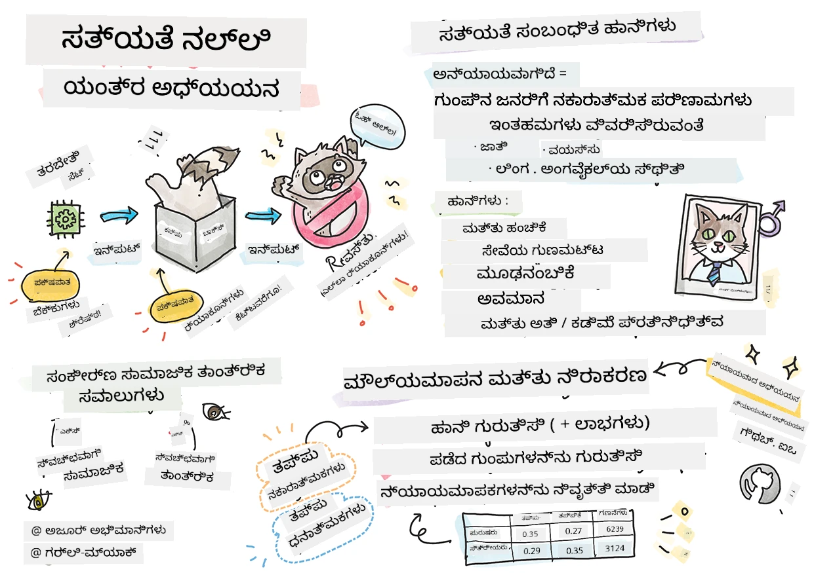
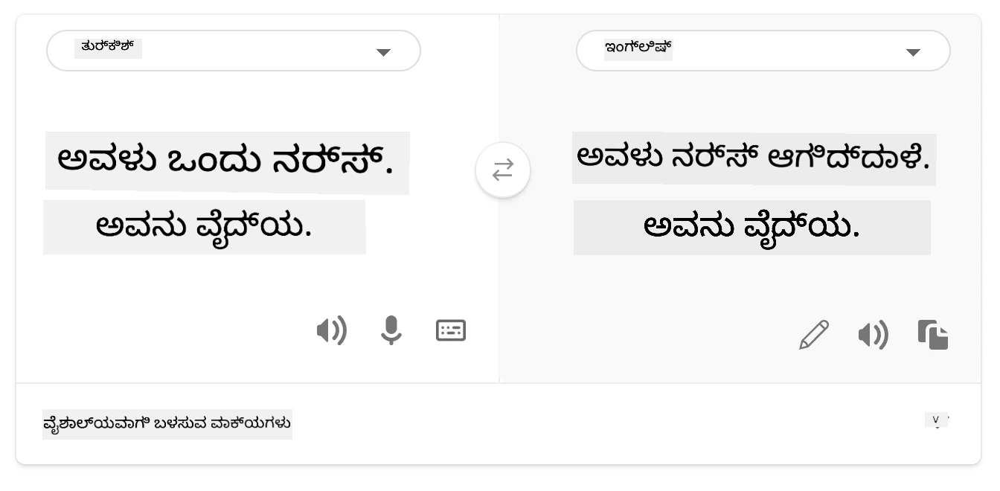

# ಜವಾಬ್ದಾರಿಯಾದ AI ಯೊಂದಿಗೆ ಯಂತ್ರ ಶಿಕ್ಷಣ ಪರಿಹಾರಗಳನ್ನು ನಿರ್ಮಿಸುವುದು
 

> [Tomomi Imura](https://www.twitter.com/girlie_mac) ಅವರ ಸ್ಕೆಚ್ ನೋಟ್

## [ಪೂರ್ವ-ನ್ಯಾಸ ಕ್ವಿಜ್](https://ff-quizzes.netlify.app/en/ml/)
 
## ಪರಿಚಯ

ಈ ಪಾಠ್ಯಕ್ರಮದಲ್ಲಿ, ನೀವು ಯಂತ್ರ ಶಿಕ್ಷಣವು ನಮ್ಮ ದೈನಂದಿನ ಜೀವನವನ್ನು ಹೇಗೆ ಪರಿಣಾಮ ಬೀರುತ್ತಿದೆ ಮತ್ತು ಬದಲಾಯಿಸುತ್ತಿದೆ ಎಂಬುದನ್ನು ಅನಾವರಣ ಮಾಡಲಾಗುತ್ತದೆ. ಈಗಲೂ, ಆರೋಗ್ಯ ಪರೀಕ್ಷೆಗಳು, ಸಾಲ ಮಂಜೂರಾತಿ ಅಥವಾ ಹಿಮ್ಮೆಟ್ಟಿದವರ ಪತ್ತೆ ಇತ್ಯಾದಿ ದೈನಂದಿನ ನಿರ್ಣಯ ಕಾರ್ಯಗಳಲ್ಲಿ ವ್ಯವಸ್ಥೆಗಳು ಮತ್ತು ಮಾದರಿಗಳು ಪಾಲ್ಗೊಳ್ಳುತ್ತಿವೆ. ಆದ್ದರಿಂದ, ಈ ಮಾದರಿಗಳು ನಂಬಿಕೊಳ್ಳಬಹುದಾದ ಫಲಿತಾಂಶಗಳನ್ನು ಒದಗಿಸುವಂತೆ ಚೆನ್ನಾಗಿ ಕೆಲಸ ಮಾಡುತ್ತಿವೆ ಎಂಬುದು ಮಹತ್ವಪೂರ್ಣ. ಯಾವುದೇ ಸಾಫ್ಟ್‌ವೇರ್ ಅಪ್ಲಿಕೇಶನ್ ಹಾಗೆಯೇ, AI ವ್ಯವಸ್ಥೆಗಳು ನಿರೀಕ್ಷೆಗಳನ್ನು ತಪ್ಪಿಸಬಹುದು ಅಥವಾ ಅಯೋಗ್ಯ ಫಲಿತಾಂಶ ನೀಡಬಹುದು. ಆದ್ದರಿಂದ AI ಮಾದರಿಯ ವರ್ತನೆಯನ್ನು ಅರ್ಥಮಾಡಿಕೊಳ್ಳುವುದು ಮತ್ತು ವಿವರಿಸುವುದು ಅತ್ಯಗತ್ಯವಾಗಿದೆ.

ನೀವು ನಿರ್ಮಿಸಬೇಕಾದ ಮಾದರಿಗಳಿಗೆ ಬಳಸುತ್ತಿರುವ ಡೇಟಾಗೆ ಕೆಲವು ಜನಸಾಂಖ್ಯಿಕ ವೈಶಿಷ್ಟ್ಯಗಳು, ಹಂತ, ಲಿಂಗ, ರಾಜಕೀಯ ನೋಟ, ಧರ್ಮ ಅಥವಾ ಅಶೋಚನೀಯವಾಗಿ ಇವುಗಳಿಗೆ ಸಂಬಂಧಿಸಿದ ಜನಸಂಖ್ಯಾತಿಗಳನ್ನು ಪ್ರತಿನಿಧಿಸುವಿಕೇ ಇಲ್ಲದಿದ್ದರೆ ಏನಾಗಬಹುದು ಎಂದು ಊಹಿಸಿ ನೋಡಿರಿ. ಮಾದರಿಯ ಉತ್ಪಾದನೆಯನ್ನು ಕೆಲವು ಜನಸಾಂಖ್ಯಿಕಗಳಿಗೆ ಅನುಕೂಲವಾಗುವಂತೆ ವ್ಯಾಖ್ಯಾನಿಸಲಾಗುವುದಾದರೆ? ಅಪ್ಲಿಕೇಶನ್‌ಗೆ ಅದರ ಪರಿಣಾಮವೇನು? ಜೊತೆಗೆ, ಮಾದರಿಯು ಹೀನ ಪರಿಣಾಮ ಅನುಭವಿಸಿ ಜನರಿಗೆ ಹಾನಿ ಮಾಡುವಾಗ ಏನಾಗುತ್ತದೆ? AI ವ್ಯವಸ್ಥೆಯ ವರ್ತನೆಯಲ್ಲಿ ಯಾರಿಗೆ ಹೊಣೆಗಾರಿಕೆ ಇದೆ? ಈ ಪ್ರಶ್ನೆಗಳು ನಾವು ಈ ಪಾಠ್ಯಕ್ರಮದಲ್ಲಿ ಅನ್ವೇಷಿಸುವ ಕೆಲವು ಪ್ರಶ್ನೆಗಳಾಗಿವೆ.

ಈ ಪಾಠದಲ್ಲಿ ನೀವು: 

- ಯಂತ್ರ ಶಿಕ್ಷಣದಲ್ಲಿ ನ್ಯಾಯತೀತೆ ಮತ್ತು ನ್ಯಾಯ ಸಂಬಂಧಿತ ಹಾನಿಗಳ ಮಹತ್ವದ ಬಗ್ಗೆ ನಿಮ್ಮ ಅರಿವನ್ನು ಹೆಚ್ಚಿಸಿಕೊಳ್ಳಿರಿ.
- ವಿಶ್ವಾಸಾರ್ಹತೆ ಮತ್ತು ಸುರಕ್ಷತೆ ಖಚಿತಪಡಿಸಲು ಅಪರೂಪದ ಘಟನೆಗಳ ಮತ್ತು ಭಿನ್ನ ಸಂದರ್ಭಗಳನ್ನು ಪರಿಶೀಲಿಸುವ ಅಭ್ಯಾಸಕ್ಕೆ ಪರಿಚಿತವಾಗಿರಿ.
- ಎಲ್ಲರಿಗೂ ಸಬಲೀಕರಣ ನೀಡಲು ಒಳಗೊಂಡ ವ್ಯವಸ್ಥೆಗಳನ್ನು ವಿನ್ಯಾಸಗೊಳಿಸುವ ಅಗತ್ಯವನ್ನು ಅರಿತುಕೊಳ್ಳಿ.
- ಡೇಟಾ ಮತ್ತು ಜನರ ಗೌಪ್ಯತೆಗೆ ಮತ್ತು ಭದ್ರತೆಗೆ ಹೇಗೆ ರಕ್ಷಣೆ ನೀಡುವುದು ಎಂಬುದನ್ನು ಅನ್ವೇಷಿಸಿ.
- AI ಮಾದರಿಯ ವರ್ತನೆಯನ್ನು ವಿವರಿಸಲು ಗ್ಲಾಸ್ ಬಾಕ್ಸ್ ದೃಷ್ಟಿಕೋನ ಹೊಂದಿರುವ ಮಹತ್ವವನ್ನು ನೋಡಿರಿ.
- AI ವ್ಯವಸ್ಥೆಗಳಲ್ಲಿ ವಿಶ್ವಾಸ ನಿರ್ಮಿಸಲು ಹೊಣೆಗಾರಿಕೆ ಬಾಳಿಕೆ ಎಷ್ಟು ಅಗತ್ಯವೋ ಅದರ ಬಗ್ಗೆ ಜಾಗರೂಕರಾಗಿರಿ.

## ಪೂರ್ವಾಪೇಕ್ಷೆ

ಪೂರ್ವಾಪೇಕ್ಷೆಯಾಗಿ, ದಯವಿಟ್ಟು "ಜವಾಬ್ದಾರಿಯಾದ AI ಸಿದ್ಧಾಂತಗಳು" ಕಲಿಕೆ ಮಾರ್ಗವನ್ನು ತೆಗೆದುಕೊಳ್ಳಿ ಮತ್ತು ಕೆಳಗಿನ ವಿಷಯದ ವಿಡಿಯೋವನ್ನು ವೀಕ್ಷಿಸಿ:

ಈ [ಕಲಿಕೆ ಮಾರ್ಗ](https://docs.microsoft.com/learn/modules/responsible-ai-principles/?WT.mc_id=academic-77952-leestott) ಮೂಲಕ ಜವಾಬ್ದಾರಿಯಾದ AI ಬಗ್ಗೆ ಹೆಚ್ಚು ತಿಳಿದುಕೊಳ್ಳಿ

> 🎥 ವೀಡಿಯೊ ಮಾಡಲು ಮೇಲಿನ ಚಿತ್ರವನ್ನು ಕ್ಲಿಕ್ ಮಾಡಿ: Microsoft's Approach to Responsible AI

## ನ್ಯಾಯತೀತೆ

AI ವ್ಯವಸ್ಥೆಗಳು ಎಲ್ಲರಿಗೂ ನ್ಯಾಯವಾಗಿ ವರ್ತಿಸಬೇಕು ಮತ್ತು ಸಮಾನ ಗುಂಪುಗಳ ಜನರಿಗೆ ವಿಭಿನ್ನ ರೀತಿಯಲ್ಲಿ ಪ್ರಭಾವ ಬೀರುವುದನ್ನು ತಪ್ಪಿಸಬೇಕು. ಉದಾಹರಣೆಗೆ, ಆರೋಗ್ಯ ಚಿಕಿತ್ಸೆ, ಸಾಲ ಅರ್ಜಿಗಳು, ಅಥವಾ ಉದ್ಯೋಗದಲ್ಲಿ ಮಾರ್ಗದರ್ಶನ ನೀಡುವಾಗ, ಸಮಾನ ಲಕ್ಷಣಗಳು, ಆರ್ಥಿಕ ಪರಿಸ್ಥಿತಿಗಳು ಅಥವಾ ವೃತ್ತಿಪರ ಅರ್ಹತೆ ಇರುವ ಎಲ್ಲರಿಗೆ ಸಮಾನ ಸಲಹೆಗಳನ್ನು ನೀಡಬೇಕು. ಪ್ರತಿಯೊಬ್ಬರೂ ಮಾನವರಿಗೆ ನಮ್ಮ ನಿರ್ಧಾರಗಳನ್ನು ಮತ್ತು ಕ್ರಿಯೆಗಳನ್ನು ಪ್ರಭಾವಿತಗೊಳಿಸುವ ವಂಶಸಂಪದಿತ ಉಪನ್ಯಾಸಗಳನ್ನು ಹೊಂದಿದ್ದೇವೆ. ಈ ತೆಳುವಿನ ಉಪನ್ಯಾಸಗಳು ಯಂತ್ರ ಶಿಕ್ಷಣಕ್ಕಾಗಿ ಬಳಸಲಾಗುವ ಡೇಟಾದಲ್ಲೂ ಸ್ಪಷ್ಟವಾಗಬಹುದು. ಕೆಲವೊಮ್ಮೆ ಈ ಪ್ರಭಾವಗಳು ಆಸಕ್ತಿಯಿಂದಲೂ ಅಲ್ಲದೇ ಅನುಪಯುಕ್ತವಾಗಿ ಸಂಭವಿಸಬಹುದು. ಯಾವಾಗ ನೀವು ಡೇಟಾದಲ್ಲಿ ಆಯಾಮವನ್ನು ಪರಿಚಯಿಸುತ್ತಿದ್ದೀರಿ ಎಂಬುದನ್ನು ಪ್ರತೀಕ್ಷಿತವಾಗಿ ತಿಳಿಯುವುದು ಸಾಮಾನ್ಯವಾಗಿ ಕಷ್ಟ.

**“ನ್ಯಾಯತೀರದಿರದಿಕೆ”** ಎಂದರೆ ಜನಸಂಖ್ಯಾತಿಯನ್ನು ಆಧರಿಸಿ (ಹಾದಿ, ಲಿಂಗ, ವಯಸ್ಸು, ಅಂಗವೈಕಲ್ಯ ಸ್ಥಿತಿ ಇತ್ಯಾದಿಗಳಂತೆ) ಒಂದು ಗುಂಪಿಗೆ ಉಂಟಾಗುವ ಅಪಕಾರ ಅಥವಾ "ಹಾನಿ"ಗಳನ್ನು ಒಳಗೊಂಡಿದೆ. ಮುಖ್ಯ ನ್ಯಾಯತೀತೆ ಸಂಬಂಧಿತ ಹಾನಿಗಳನ್ನು ಈ ರೀತಿಯಾಗಿ ವರ್ಗೀಕರಿಸಬಹುದು:

- **ಹಂಚಿಕೆ**, ಉದಾಹರಣೆಗೆ ಒಂದು ಲಿಂಗ ಅಥವಾ ಜಾತಿ ಇನ್ನೊಬ್ಬರಿಗಿಂತ ಮೆರೆದಾಗ.
- **ಸೇವೆಯ ಗುಣಮಟ್ಟ**. ನೀವು ಒಂದು ನಿರ್ದಿಷ್ಟ ಪರಿಸ್ಥಿತಿಗಾಗಿ ಡೇಟಾವನ್ನು ತರಬೇತು ಮಾಡಿದ್ದರೂ, ವಾಸ್ತವಿಕತೆ ಹೆಚ್ಚು ಸಖತ್ ಇದ್ದರೆ ಸೇವೆಯ ಕಾರ್ಯಕ್ಷಮತೆ ಕುಂದಬಹುದು. ಉದಾಹರಣೆಗೆ, ನಗೆಂಗೆ ಕಾಲಿ ಚರ್ಮವನ್ನು ಗುರುತಿಸಲಾಗದ ಕೈ ಸಾಬೂನು ಹಂಚುವ ಯಂತ್ರ. [ಉಲ್ಲೇಖ](https://gizmodo.com/why-cant-this-soap-dispenser-identify-dark-skin-1797931773)
- **ಅಪಚಾರ**. ಒಬ್ಬರ ಅಥವಾ ಯಾವುದನ್ನಾದರೂ ಅನ್ಯಾಯವಾಗಿ ಟೀಕಿಸುವುದು ಮತ್ತು ಲೇಬಲ್ ನೀಡುವುದು. ಉದಾಹರಣೆಗೆ, ಒಂದು ಚಿತ್ರ ಲೇಬಲಿಂಗ್ ತಂತ್ರಜ್ಞಾನ ಕಪ್ಪು ಚರ್ಮದ ಚಿತ್ರಗಳನ್ನು ಗೋರಿಲ್ಲಾಗಳಾಗಿ ತಪ್ಪಾಗಿ ಗುರುತಿಸಿದೆ.
- **ಅತಿಹರಿವು ಅಥವಾ ಅಲ್ಪ ಪ್ರತಿನಿಧೀಕರಣ**. ಒಂದು ಗುಂಪು ತ้มಿಚಲುವ ಉದ್ಯೋಗದಲ್ಲಿ ಕಂಡುಬಾರದಿರುವುದು ಮತ್ತು ಯಾವುದೇ ಸೇವೆ ಅಥವಾ ಕಾರ್ಯವು ಅದನ್ನು ಪ್ರೋತ್ಸಾಹಿಸುವುದು ಹಾನಿ ಮೂಡಿಸುತ್ತದೆ.
- ** stereotyping**. ಒಂದು ಗುಂಪನ್ನು ಪೂರ್ವನಿಗದಿತ ಲಕ್ಷಣಗಳಿಗೆ ಜೋಡಿಸುವುದು. ಉದಾಹರಣೆಗೆ, ಇಂಗ್ಲಿಷ್ ಮತ್ತು ಟರ್ಕಿಶ್ ಭಾಷಾಂತರ ವ್ಯವಸ್ಥೆಯಲ್ಲಿ ಲಿಂಗದ ಯಾವುದೇ stereotyping ಸಂಬಂಧಿತ ಪದಗಳ ಕಾರಣದಿಂದ ತಪ್ಪುಗಳು ಸಂಭವಿಸಬಹುದು.

> ಟರ್ಕಿಶ್‌ಗೆ ಭಾಷಾಂತರ

> ಇಂಗ್ಲಿಷ್‌ಗೆ ಹಿಂಬಾಲಿಸಿ ಭಾಷಾಂತರ

AI ವ್ಯವಸ್ಥೆಗಳನ್ನು ವಿನ್ಯಾಸಗೊಳಿಸುವಾಗ ಮತ್ತು ಪರೀಕ್ಷಿಸುವಾಗ, AI ನ್ಯಾಯಕವಾಗಿರಬೇಕು ಮತ್ತು ಮಾನವರಂತೆಯೇ পক্ষಪಾತಪೂರ್ಣ ಅಥವಾ ವಿಭಜನಾ ನಿರ್ಧಾರಗಳನ್ನು ಮಾಡಬಾರದು. AI ಮತ್ತು ಯಂತ್ರ ಶಿಕ್ಷಣದಲ್ಲಿ ನ್ಯಾಯತೀರದಿರದಿಕೆಯನ್ನು ಖಚಿತಪಡಿಸುವುದು ಸಂಕೀರ್ಣ ಸಾಮಾಜಿಕ-ತಾಂತ್ರಿಕ ಮುಂದಿನ ಕೆಲಸವಾಗಿದೆ.

### ವಿಶ್ವಾಸಾರ್ಹತೆ ಮತ್ತು ಸುರಕ್ಷತೆ

ವಿಶ್ವಾಸ ನಿರ್ಮಿಸಲು, AI ವ್ಯವಸ್ಥೆಗಳು ಸಾಮಾನ್ಯ ಮತ್ತು ಅಪ್ರತೀಕ್ಷಿತ ಪರಿಸ್ಥಿತಿಗಳಲ್ಲಿ ವಿಶ್ವಾಸಾರ್ಹ, ಸುರಕ್ಷಿತ ಮತ್ತು ಶಾಶ್ವತವಾಗಿರಬೇಕು. ಬಾಹ್ಯ ಘಟನೆಗಳಾದ ಸ್ಥಿತಿಗಳಲ್ಲಿನ AI системೆ ಗಳ ವರ್ತನೆ ಗೊತ್ತಾಗಬೇಕು. AI ಪರಿಹಾರಗಳನ್ನು ನಿರ್ಮಿಸುವಾಗ, ವೈವಿಧ್ಯಮಯ ಪರಿಸ್ಥಿತಿಗಳನ್ನು ಹೇಗೆ ಕೈಗೊಳ್ಳುವುದು ಎಂದು ಗಮನ ತುಂಬಾ ಮುಖ್ಯ. ಉದಾಹರಣೆಗೆ, ಸ್ವಯಂಚಾಲಿತ ಕಾರು ಜನರ ಸುರಕ್ಷತೆಯನ್ನು ಪ್ರಮುಖ ಪ್ರಾಧಾನ್ಯತೆ ನೀಡಬೇಕು. ಆದ್ದರಿಂದ, ಆ ಕಾರು ಎದುರಿಸುವ ಎಲ್ಲಾ ಸಾಧ್ಯ ಪರಿಸ್ಥಿತಿಗಳನ್ನು (ಅಂಧಕಾಲ, ಮಳೆ, ಹಿಮಪಾತ, ಮಕ್ಕಳ ರಸ್ತೆ ದಾಟುವಿಕೆ, ಪಾಳು ಪ್ರಾಣಿಗಳು, ರಸ್ತೆ ನಿರ್ಮಾಣ) ಅರ್ಥಮಾಡಿಕೊಳ್ಳಬೇಕು. AI ವ್ಯವಸ್ಥೆಯು ಈ ವಿವಿಧ ಪರಿಸ್ಥಿತಿಗಳನ್ನು ಹೇಗೆ ನಿಭಾಯಿಸುತ್ತದೆ ಎಂಬುದು ಆ ಸಿಸ್ಟಮ್ ವಿನ್ಯಾಸ ಅಥವಾ ಪರೀಕ್ಷೆ ಸಮಯದಲ್ಲಿ ಡೇಟಾ ವಿಜ್ಞಾನಿ ಅಥವಾ AI ಅಭಿವೃದ್ಧಿಕರರು ಎಷ್ಟು ಮುನ್ಸೂಚನೆ ಮುಂದಿಟ್ಟಿದ್ದರು ಎಂಬುದನ್ನು ಪ್ರತಿಬಿಂಬಿಸುತ್ತದೆ.

> [🎥 ವೀಡಿಯೊಗೆ ಇಲ್ಲಿ ಕ್ಲಿಕ್ ಮಾಡಿ: ](https://www.microsoft.com/videoplayer/embed/RE4vvIl)

### ಒಳಗೊಂಡಿಕೆ

AI ವ್ಯವಸ್ಥೆಗಳು ಎಲ್ಲರಿಗೂ ಭಾಗವಹಿಸುವಂತೆ ಮತ್ತು ಸಬಲೀಕರಣ ನೀಡುವಂತೆ ವಿನ್ಯಾಸಗೊಳಿಸಬೇಕಾಗುತ್ತದೆ. ಈ प्रणೇತಿಯಲ್ಲ, ಡೇಟಾ ವಿಜ್ಞಾನಿಗಳು ಮತ್ತು AI ಅಭಿವೃದ್ಧಿಕರರು ವ್ಯವಸ್ಥೆಯಲ್ಲಿ ಅಪರಿಚಿತವಾಗಿ ಜನರನ್ನು ಹೊರಗೂಡಿಸಬಲ್ಲ ತಡೆಗಳನ್ನು ಪತ್ತೆ ಮಾಡಿ ಪರಿಹರಿಸುತ್ತಾರೆ. ಉದಾಹರಣೆಗೆ, ప్రపంచದಲ್ಲಿ 1 ಬಿಲಿಯನ್ ಅಂಗವೈಕಲ್ಯ ಹೊಂದಿರುವ ಜನರು ಇರಬೇಕಾಗಿದ್ದಾರೆ. AI ಪ್ರಗತಿಯ ಮೂಲಕ, ಅವರ ಕೈಗೆ ಹೆಚ್ಚಿನ ಮಾಹಿತಿಗಳು ಮತ್ತು ಅವಕಾಶಗಳು ಸುಲಭವಾಗಿ ಲಭಿಸುತ್ತವೆ. ಅಡ್ಡಿ ಸಮಾಧಾನಗೆದು, ಎಲ್ಲಾ ಜನರಿಗೆ ಒಳ್ಳೆಯ ಅನುಭವ ನೀಡುವ AI ಉತ್ಪನ್ನಗಳನ್ನು ಆವಿಷ್ಕರಿಸಲು ಮತ್ತು ಅಭಿವೃದ್ಧಿಪಡಿಸಲು ಅವಕಾಶ ಸೃಷ್ಟಿ ಮಾಡುತ್ತದೆ.

> [🎥 AI ನ ಒಳಗೊಂಡಿಕೆ ವಿಷಯದಲ್ಲಿ here ಕ್ಲಿಕ್ ಮಾಡಿ](https://www.microsoft.com/videoplayer/embed/RE4vl9v)

### ಭದ್ರತೆ ಮತ್ತು ಗೌಪ್ಯತೆ

AI ವ್ಯವಸ್ಥೆಗಳು ಸುರಕ್ಷಿತವಾಗಿರಬೇಕು ಮತ್ತು ಜನರ ಗೌಪ್ಯತೆಯನ್ನು ಗೌರವಿಸಬೇಕು. ಜನರು ತಮ್ಮ ಗೌಪ್ಯತೆ, ಮಾಹಿತಿ ಅಥವಾ ಜೀವನಕ್ಕೆ ಅಪಾಯವಿರುವ ವ್ಯವಸ್ಥೆಗಳಿಗೆ ಕಡಿಮೆ ನಂಬಿಕೆ ಇಟ್ಟುಕೊಳ್ಳುತ್ತಾರೆ. ಯಂತ್ರ ಶಿಕ್ಷಣ ಮಾದರಿಗಳನ್ನು ತರಬೇತುಗೊಳಿಸುವಾಗ, ಉತ್ತಮ ಫಲಿತಾಂಶಗಳನ್ನು ತರುವುದಕ್ಕಾಗಿ ನಾವು ಡೇಟಾದ ಮೇಲೆ ಅವಲಂಬಿಸುತ್ತೇವೆ. ಆದ್ದರಿಂದ, ಡೇಟಾದ ಮೂಲ ಮತ್ತು ವಿಶ್ವಾಸಾರ್ಹತೆ ಗಮನದಲ್ಲಿರಬೇಕಾಗುತ್ತದೆ. ಉದಾಹರಣೆಗೆ, ಡೇಟಾ ಬಳಕೆದಾರರಿಂದ ಬಂತು ಅಥವಾ ಸಾರ್ವಜನಿಕವಾಗಿ ಲಭ್ಯವಿದೆಯೇ? ನಂತರ, ಡೇಟಾ ಮೇಲೆ ಕೆಲಸ ಮಾಡುತ್ತಿರುವಾಗ, ಭದ್ರತೆಯನ್ನು ನೀಡುವ AI ವ್ಯವಸ್ಥೆಯನ್ನು ಅಭಿವೃದ್ಧಿಪಡಿಸುವುದು ಮತ್ತು ದಾಳಿಗಳಿಗೆ ಪ್ರತಿರೋಧಿಸುವುದು ತುಂಬಾ ಅವಶ್ಯಕ. AI ಹೆಚ್ಚಿಸಿ ಬಳಕೆಯಾದಂತೆ, ಗೌಪ್ಯತೆ ಮತ್ತು ಮಹತ್ವದ ವೈಯಕ್ತಿಕ ಮತ್ತು ವ್ಯಾಪಾರ ಮಾಹಿತಿ ರಕ್ಷಣಾ ವಿಷಯಗಳು ಹೆಚ್ಚು ಜನ್ಡಾಗುತ್ತಿರುವ ಸಮಸ್ಯೆ ಹೀಗೆ ಇದ್ದಕ್ಕಿಂತ ಹೆಚ್ಚು ಸಂಕೀರ್ಣವಾಗುತ್ತವೆ. AI ಗೆ ಕುರಿತು ಗೌಪ್ಯತೆ ಮತ್ತು ಡೇಟಾ ಭದ್ರತೆ ವಿಷಯಗಳು ವಿಶೇಷ ಗಮನ ಅಗತ್ಯವಿದೆ ಏಕೆಂದರೆ AI ವ್ಯವಸ್ಥೆಗಳು ಜನರ ಬಗ್ಗೆ ನಿಖರ ಮತ್ತು ಮಾಹಿತಿ ಒಳಗೊಂಡ ಊಹಣೆ ಮತ್ತು ನಿರ್ಣಯಗಳನ್ನು ಮಾಡಲು ಡೇಟಾಗೆ ಪ್ರವೇಶ ಆಹಾರವಾಗಿದೆ.

> [🎥 AI ಯಲ್ಲಿ ಭದ್ರತಾ ಬಗ್ಗೆ ವೀಡಿಯೋ ಎಲ್ಲಿಗೆ ಕ್ಲಿಕ್ ಮಾಡಿ](https://www.microsoft.com/videoplayer/embed/RE4voJF)

- ಕೈಗಾರಿಕಾ ಕ್ಷೇತ್ರವಾಗಿ ನಾವು ಗೌಪ್ಯತೆ ಮತ್ತು ಭದ್ರತೆಯಲ್ಲಿ ಪ್ರಮುಖ ಪ್ರಗತಿಯನ್ನು ಮಾಡಿದ್ದೇವೆ, ಅದರಲ್ಲೂ GDPR ನಿಯಮಗಳ ಮೂಲಕ ಬಹಳ ಪ್ರೇರಣೆ ಇದೆ.
- AI ವ್ಯವಸ್ಥೆಗಳೊಂದಿಗೆ, ಹೆಚ್ಚು ವೈಯಕ್ತಿಕ ಮತ್ತು ಪರಿಣಾಮಕಾರಿ ಮಾಡಲು ಹೆಚ್ಚು ವೈಯಕ್ತಿಕ ಡೇಟಾ ಬೇಕಾದ ಅಗತ್ಯ ಮತ್ತು ಗೌಪ್ಯತೆ ನಡುವೆ ಘರ್ಷಣೆ ಇದೆ ಎಂದು ಒಪ್ಪಿಕೊಳ್ಳಬೇಕಾಗಿದೆ.
- ಇಂಟರ್ನೆಟ್-ಸಂಬಂಧಿತ ಕಂಪ್ಯೂಟರ್‌ಗಳ ಹುಟ್ಟಿದಂತೆ, AI ಗೆ ಸಂಬಂಧಿಸಿದ ಭದ್ರತಾ ಸಮಸ್ಯೆಗಳ ಸಂಖ್ಯೆ ಪರಿಮಿತಿಯಿಂದ ಬಹಳ ಹೆಚ್ಚಾಗಿದೆ.
- ಅದೇ ಸಮಯದಲ್ಲಿ, ಭದ್ರತೆಯನ್ನು ಸುಧಾರಿಸಲು AI ಉಪಯೋಗವಾಗುತ್ತಿದೆ. ಉದಾಹರಣೆಗೆ, ಕನ್ನಡಿಕ್ರಮದಲ್ಲಿ ಹೆಚ್ಚಿನ ಆಧುನಿಕ ಅನ್ಟಿ-ವೈರುಸ್ ಸ್ಕ್ಯಾನರ್‌ಗಳು ಇಂದು AI ತತ್ವಗಳ ಮೇಲೆ ಚಾಲನೆ ಮಾಡುತ್ತವೆ.
- ನಮ್ಮ ಡೇಟಾ ವಿಜ್ಞಾನ ಪ್ರಕ್ರಿಯೆಗಳು ತಾಜಾ ಗೌಪ್ಯತೆ ಮತ್ತು ಭದ್ರತಾ ಕ್ರಮಗಳೊಂದಿಗೆ ಸರಾಗವಾಗಿ ಸೇರಿಕೊಳ್ಳುವಂತೆ ನೋಡಿಕೊಳ್ಳಬೇಕಾಗಿದೆ.

### ಪಾರದರ್ಶಕತೆ
AI ವ್ಯವಸ್ಥೆಗಳು ಅರ್ಥಮಾಡಿಕೊಳ್ಳಬಹುದಾಗಿರಬೇಕು. ಪಾರದರ್ಶಕತೆಯ ಪ್ರಮುಖ ಭಾಗವೆಂದರೆ AI ವ್ಯವಸ್ಥೆಗಳ ಮತ್ತು ಅವುಗಳ ಘಟಕಗಳ ವರ್ತನೆಯನ್ನು ವಿವರಿಸುವುದು. AI ವ್ಯವಸ್ಥೆಗಳ ಅರ್ಥವನ್ನು ಸುಧಾರಿಸುವುದಕ್ಕೆ, ಹಿತರಕ್ಷಣಾಧಿಕಾರಿಗಳು ಅವು ಹೇಗೆ ಮತ್ತು ಏಕೆ ಕಾರ್ಯನಿರ್ವಹಿಸುತ್ತವೆ ಎಂಬುದನ್ನು ಅರ್ಥಮಾಡಿಕೊಳ್ಳಬೇಕು, ಇದರಿಂದಲೇ ಅವರು ಸಾಧ್ಯತೆಯ ಕಾರ್ಯಕ್ಷಮತೆ ಸಮಸ್ಯೆಗಳನ್ನು, ಸುರಕ್ಷತೆ ಮತ್ತು ಗೌಪ್ಯತೆ ಆಪತ್ನತೆಗಳನ್ನು, ಬದ್ಧತೆ, ಹೊರತಾದ ವ್ಯವಹಾರಗಳನ್ನು ಅಥವಾ ಅನಿರೀಕ್ಷಿತ ಫಲಿತಾಂಶಗಳನ್ನು ಗುರುತಿಸಬಹುದು. ನಾವು AI ವ್ಯವಸ್ಥೆಗಳನ್ನು ಬಳಸುವವರು ಎപ്പോൾ, ಏಕೆ ಮತ್ತು ಹೇಗೆ ಅವುಗಳನ್ನು ನಿಯೋಜಿಸುವನ್ನೂ ಮತ್ತು ಬಳಸುವ ನಿಯಮ ಮತ್ತು ಮಿತಿಗಳನ್ನು ಪ್ರಾಮಾಣಿಕವಾಗಿ ಮತ್ತು ಮುಕ್ತಿ ಮುಗ್ಧವಾಗಿ ತಿಳಿಸುವ ಅಗತ್ಯವಿದೆ ಎಂದು ನಂಬುತ್ತೇವೆ. ಉದಾಹರಣೆಗೆ, ಬ್ಯಾಂಕ್ ತನ್ನ ಗ್ರಾಹಕ ಸಾಲ ನಿರ್ಧಾರಗಳಿಗೆ AI ವ್ಯವಸ್ಥೆಯನ್ನು ಬಳಸಿದರೆ, ಫಲಿತಾಂಶಗಳನ್ನು ಪರಿಶೀಲಿಸಿ ಮತ್ತು ಯಾವುದೇ ಡೇಟಾ ವ್ಯವಸ್ಥೆಯ ಶಿಫಾರಸುಗಳನ್ನು ಪ್ರಭಾವಿಸುತ್ತದೆ ಎಂದು ಅರ್ಥಮಾಡಿಕೊಳ್ಳುವುದು ಮುಖ್ಯ. ಸರ್ಕಾರಗಳು ಉದ್ಯಮಗಳಲ್ಲಿ AI ನಿಯಂತ್ರಣ ಶುರುವಾಯ್ತು, ಆದ್ದರಿಂದ ಡೇಟಾ ವಿಜ್ಞಾನಿಗಳು ಮತ್ತು ಸಂಸ್ಥೆಗಳು AI ವ್ಯವಸ್ಥೆ ನಿಯಮಾನುಸಾರವಾಗಿದೆಯೆ ಎಂದು, ವಿಶೇಷವಾಗಿ ಅಯೋಗ್ಯ ಫಲಿತಾಂಶ ಇದ್ದಾಗ, ವಿವರಿಸಲು ಬೇಕು.

> [🎥 AI ಯಲ್ಲಿ ಪಾರದರ್ಶಕತೆಗೆ ವೀಡಿಯೊ ಮಾಡಲು ಇಲ್ಲಿ ಕ್ಲಿಕ್ ಮಾಡಿ](https://www.microsoft.com/videoplayer/embed/RE4voJF)

- AI ವ್ಯವಸ್ಥೆಗಳು ತುಂಬಾ ಸಂಕೀರ್ಣವಾಗಿರುವುದರಿಂದ ಅವು ಹೇಗೆ ಕೆಲಸ ಮಾಡುತ್ತವೆ ಮತ್ತು ಫಲಿತಾಂಶಗಳನ್ನು ವ್ಯಾಪ್ತಿಗೊಳಿಸುವುದು ಕಷ್ಟ.
- ಈ ಅರ್ಥಕೊರುತ್ತದೆಂತಹ ಕೊರತೆ ಈ ವ್ಯವಸ್ಥೆಗಳ ನಿರ್ವಹಣೆ, ಕಾರ್ಯಗತೀಕರಣ ಮತ್ತು ದಾಖಲಾತಿಗಳನ್ನು ಪ್ರಭಾವಿಸುತ್ತದೆ.
- ಪ್ರಮುಖವಾಗಿ ಇದರಿಂದ ಉತ್ಪನ್ನ ಫಲಿತಾಂಶವನ್ನು ಬಳಸಿ ಮಾಡಲಾದ ನಿರ್ಧಾರಗಳ ಮೇಲೆ ಪರಿಣಾಮ ಬೀರಬಹುದು.

### ಹೊಣೆಗಾರಿಕೆ  
 
AI ವ್ಯವಸ್ಥೆಗಳು ವಿನ್ಯಾಸ ಮತ್ತು ನಿಯೋಜಿಸುವ ಜನರು ತಮ್ಮ ವ್ಯವಸ್ಥೆಗಳ ಕಾರ್ಯಾಚರಣೆಗೆ ಹೊಣೆಗಾರರಾಗಿರಬೇಕು. ಮುಖಪಟ್ಟ ಗುರುತಿನಂತಹ حساس ತಂತ್ರಜ್ಞಾನಗಳ ಬಳಕೆಯ ಕಡೆಗೆ ಹೊಣೆಗಾರಿಕೆಯ ಅವಶ್ಯಕತೆ ವಿಶಿಷ್ಟವಾಗಿದೆ. ಇತ್ತೀಚಿಗೆ, ಕಾನೂನು ಅಳವಡಿಕೆ ಸಂಸ್ಥೆಗಳ ಕೈಯಲ್ಲಿ ಮುಖ್ಯವಾಗಿ ಮಾಯವಾದ ಮಕ್ಕಳನ್ನು ಹುಡುಕುವಂತಹ ಉಪಯೋಗಗಳಲ್ಲಿ ಮುಖ ಗುರುತಿನ ತಂತ್ರಜ್ಞಾನ‌ಗೆ ಹೆಚ್ಚಿದ ಬೇಡಿಕೆ ಇದೆ. ಆದರೆ ಈ ತಂತ್ರಜ್ಞಾನಗಳು ಸರ್ಕಾರದಿಂದ ಸಲ್ಲಿಸಿದ ನಾಗರಿಕರ ಹಕ್ಕುಗಳನ್ನು continuous ವಿಮರ್ಶೆಯಲ್ಲಿ ಮುಟ್ಟಿಸಲು ಉಪಯೋಗವಾಗಬಹುದಾಗಿದೆ. ಆದ್ದರಿಂದ, ಡೇಟಾ ವಿಜ್ಞಾನಿಗಳು ಮತ್ತು ಸಂಸ್ಥೆಗಳು AI ವ್ಯವಸ್ಥೆಯು ವ್ಯಕ್ತಿಗಳು ಅಥವಾ ಸಮುದಾಯದ ಮೇಲೆ ಹೇಗೆ ಪ್ರಭಾವ ಬೀರುತ್ತದೆ ಎಂಬದರಲ್ಲಿ ಹೊಣೆಗಾರರಾಗಿರಬೇಕು.

> 🎥 ಮೇಲಿನ ಚಿತ್ರವನ್ನು ಕ್ಲಿಕ್ ಮಾಡಿ: ಮುಖ ಗುರುತಿಸುವ ಮೂಲಕ ವಿಸ್ತೃತ ದೂರದರ್ಶನದ ಎಚ್ಚರಿಕೆಗಳು 

ಅಂತಿಮವಾಗಿ, AI ಯನ್ನು ಸಮಾಜಕ್ಕೆ ತರಲು ಮೊದಲ ತಲೆಮಾರಿಗೆ gehörಿಸಿದಂತೆ, ಕಂಪ್ಯೂಟರ್‌ಗಳು ಜನರಿಗೆ ಯಾವಾಗಲೂ ಹೊಣೆಗಾರರಾಗಿರಲು ಮತ್ತು ಕಂಪ್ಯೂಟರ್ ವಿನ್ಯಾಸದ ಜನರು ಇತರ ಎಲ್ಲರಿಗೂ ಹೊಣೆಗಾರರಾಗಲು ಹೇಗೆ ಖಚಿತಪಡಿಸಿಕೊಳ್ಳುವುದು ಎಂಬುದು ನಮ್ಮ ತಲೆಮಾರಿಗೆ ದೊಡ್ಡ ಪ್ರಶ್ನೆ ಆಗಿದೆ.

## ಪರಿಣಾಮ ಮೌಲ್ಯಮಾಪನ

ಯಂತ್ರ ಶಿಕ್ಷಣ ಮಾದರಿ ತರಬೇತುಗೊಳಿಸುವ ಮುಂಚೆ, AI ವ್ಯವಸ್ಥೆಯ ಉದ್ದೇಶ, ನಿರೀಕ್ಷಿತ ಬಳಕೆ, ಎಲ್ಲಿ ನಿಯೋಜನೆ ಮಾಡಲಾಗುತ್ತದೆ ಮತ್ತು ಯಾರು ವ್ಯವಸ್ಥೆಯೊಂದಿಗೆ ಒಡನಾಟ ಇರುತ್ತಾರೆಯೋ ಅವು ತಿಳಿದುಕೊಳ್ಳಲು ಪರಿಣಾಮ ಮೌಲ್ಯಮಾಪನ ಮಾಡುವುದು ಮಹತ್ವವಾಗಿದೆ. ಇದು ವ್ಯವಸ್ಥೆಯನ್ನು ವಿಮರ್ಶೆ ಮಾಡುವವರು ಅಥವಾ ಪರೀಕ್ಷಕರು ಸಾಧ್ಯತೆಯ ಅಪಾಯ ಮತ್ತು ನಿರೀಕ್ಷಿತ ಪರಿಣಾಮಗಳನ್ನು ಗುರುತಿಸುವಾಗ ಸಲಹೆಗೆ ಸಹಾಯವಾಗುತ್ತದೆ.

ಪರಿಣಾಮ ಮೌಲ್ಯಮಾಪನ ಮಾಡುವಾಗ ಗಮನಿಸುವ ಕೆಲವು ಕ್ಷೇತ್ರಗಳು:

* **ವೈಯಕ್ತಿಕರ ಮೇಲೆ ಹಾನಿಕರ ಪರಿಣಾಮ**. ಯಾವುದೇ ಮಿತಿ ಅಥವಾ ಅಗತ್ಯತೆ, ಬೆಂಬಲಿಸದ ಬಳಕೆ ಅಥವಾ ಗುರುತಿಸಲ್ಪಟ್ಟ ನಿಯಮಿತತೆಯ ಕೊರತೆ ತಿಳಿದುಕೊಳ್ಳುವುದು ಮಹತ್ವ, ವ್ಯವಸ್ಥೆ ಜನರಿಗೆ ಹಾನಿಯಾಗದಂತೆ ಬಳಸಬೇಕು ಎಂದು ಖಚಿತಪಡಿಸಲು.
* **ಡೇಟಾ ಅಗತ್ಯತೆ**. ವ್ಯವಸ್ಥೆ ಡೇಟಾವನ್ನು ಹೇಗೆ ಮತ್ತು ಎಲ್ಲಿಗೆ ಬಳಸುತ್ತದೆ ಎನ್ನುವುದನ್ನು ತಿಳಿದುಕೊಳ್ಳುವುದು ವಿಮರ್ಶಕರಿಗೆ ನಿಗದಿತ ನಿಯಮಗಳು (ಹೆಚ್ಚಾಗಿ GDPR ಅಥವಾ HIPAA ನಿಯಮಗಳು) ಪಾಲನೆಯ ಕುರಿತಾಗಿ ವಿಶೇಷ ಗಮನ ಇರಬೇಕಿರುವ ಅಂಶಗಳನ್ನು ಪರಿಚಯಿಸುತ್ತದೆ. ಜೊತೆಗೆ, ತರಬೇತಿಗಾಗಿ ಡೇಟಾದ ಮೂಲ ಅಥವಾ ಪ್ರಮಾಣ ಸೂಕ್ತವೇ ಎಂದು ಪರೀಕ್ಷಿಸಿ.
* **ಪರಿಣಾಮದ ಸಾರಾಂಶ**. ವ್ಯವಸ್ಥೆ ಬಳಕೆಯಿಂದ ಏನು ಹಾನಿಗಳು ಸಂಭವಿಸಬಹುದು ಎಂಬ ಪಟ್ಟಿ ಸಂಗ್ರಹಿಸಿ. ಯಂತ್ರ ಶಿಕ್ಷಣ ಜೀವನಚರಿತ್ರೆಯಲ್ಲಿ ಗುರುತಿಸಿದ ಸಮಸ್ಯೆಗಳು ಪರಿಹರಿಸಲ್ಪಟ್ಟಿದ್ದೇ ಅಥವಾ ಸ್ಪಷ್ಟಪಡಿಸಲ್ಪಟ್ಟೇ ಎಂದು ಪರಿಶೀಲಿಸಿ.
* ಆರು ಮೂಲ ಸಿದ್ಧಾಂತಗಳಿಗೆ ಸಂಬಂಧಿಸಿದ ಅನ್ವಯಿಸುವ ಗುರಿಗಳು. ಪ್ರತಿ ಸಿದ್ಧಾಂತದ ಗುರಿಗಳು ಪೂರೈಸಲ್ಪಟ್ಟಿದ್ದೇ ಮತ್ತು ಯಾವುದೇ ಶಿಥಿಲತೆಗಳಿದ್ದೇ ಎಂದು ಮೌಲ್ಯಮಾಪನ ಮಾಡಿ.

## ಜವಾಬ್ದಾರಿಯಾದ AI ಸಹಿತ ಡಿಬಗ್ಗಿಂಗ್  

ಸಾಫ್ಟ್‌ವೇರ್ ಅಪ್ಲಿಕೇಶನ್ ಡಿಬಗ್ಗಿಂಗ್‌ಗಳಂತಹ, AI ವ್ಯವಸ್ಥೆಯ ಡಿಬಗ್ಗಿಂಗ್ ಸಂಭವಿಸಿರುವ ಸಮಸ್ಯೆಗಳನ್ನು ಗುರುತಿಸುವ ಹಾಗೂ ಪರಿಹರಿಸುವ ಅಗತ್ಯವಾದ ಪ್ರಕ್ರಿಯೆ. ಮಾದರಿ ನಿರೀಕ್ಷಿತಂತೆ ಕಾರ್ಯನಿರ್ವಹಿಸದ ಅಥವಾ ಜವಾಬ್ದಾರಿಯಾದ ರೀತಿಯಲ್ಲಿ ಕಾರ್ಯನಿರ್ವಹಿಸದ ಕಾರಣಗಳನ್ನು ಬಹುಪಾಲು ಪಡೆಯಲು ಸಾಧ್ಯ. ಹೆಚ್ಚಿನ ಫಂಕ್ಷನಲ್ ಮಾದರಿ ಕಾರ್ಯಕ್ಷಮತೆ ಅಂಕಿಅಂಶಗಳು ಸಂಖ್ಯಾತ್ಮಕ ಒಟ್ಟುಗಳಾಗಿವೆ ಮತ್ತು ಜವಾಬ್ದಾರಿಯಾದ AI ಸಿದ್ಧಾಂತಗಳನ್ನು ಈ ಮಾದರಿ ಉಲ್ಲಂಘಿಸುವ ಬಗ್ಗೆ ವಿಶ್ಲೇಷಿಸಲು ತೃಪ್ತಿಸಿರಲಾರವು. ಜೊತೆಗೆ, ಯಂತ್ರ ಶಿಕ್ಷಣ ಮಾದರಿ ಒಂದು ಕಪ್ಪು ಪೆಟ್ಟು (ಬ್ಲಾಕ್ ಬಾಕ್ಸ್) ಆಗಿದ್ದು ಅದರ ಫಲಿತಾಂಶವನ್ನು ಪ್ರೇರೇಪಿಸುವುದು ಅಥವಾ ತಪ್ಪು ಮಾಡಿದಾಗ ವಿವರಣೆ ನೀಡುವುದು ಬಿಕ್ಕಟವಾಗಿದೆ. ನಂತರ ಈ ಪಾಠದಲ್ಲಿ, ಜವಾಬ್ದಾರಿಯಾದ AI ಡ್ಯಾಶ್‌ಬೋರ್ಡ್ ಬಳಸುವುದನ್ನು ಕಲಿಯುತ್ತೇವೆ. ಈ ಡ್ಯಾಶ್‌ಬೋರ್ಡ್ ಡೇಟಾ ವಿಜ್ಞಾನಿಗಳು ಮತ್ತು AI ಅಭಿವೃದ್ಧಿಕರರಿಗೆ ಸಮಗ್ರ ಪ್ರಯೋಜನ ಒದಗಿಸುತ್ತದೆ:

* **ತಪಾಸಣಾ ವಿಶ್ಲೇಷಣೆ**.  ಪರಿಸ್ಥಿತಿಗೆ ಪ್ರಭಾವ ಬೀರುವ ತಪ್ಪು ವಿತರಣೆ ಗುರುತಿಸಲು.
* **ಮಾದರಿ ಅವಲೋಕನ**. ಡೇಟಾ ಗುಂಪುಗಳಾದರಲ್ಲಿ ಕಾರ್ಯಕ್ಷಮತೆಯಲ್ಲಿ ವ್ಯತ್ಯಾಸಗಳಿರುವ ಸ್ಥಳಗಳನ್ನು ಕಂಡುಹಿಡಿಯಲು.
* **ಡೇಟಾ ವಿಶ್ಲೇಷಣೆ**.  ಡೇಟಾ ವಿತರಣೆಯನ್ನು ಅರ್ಥಮಾಡಿಕೊಳ್ಳಲು ಮತ್ತು ನ್ಯಾಯತೆ, ಒಳಗೊಂಡಿಕೆ ಮತ್ತು ವಿಶ್ವಾಸಾರ್ಹತೆ ಸಮಸ್ಯೆಗಳಿಗೆ ಕಾರಣವಾಗಬಹುದಾದ ಆಯಾಮಗಳನ್ನು ಗುರುತಿಸಲು.
* **ಮಾದರಿ ಅರ್ಥಮಾಡಿಕೊಳ್ಳುವಿಕೆ**.  ಮಾದರಿಯ ನಿರ್ಧಾರಗಳನ್ನು ಏನು ಪ್ರಭಾವಿಸುತ್ತದೆ ಎಂದು ತಿಳಿದುಕೊಳ್ಳಲು. ಇದು ಪಾರದರ್ಶಕತೆ ಮತ್ತು ಹೊಣೆಗಾರಿಕೆಗೆ ಮಹತ್ವದ್ದಾಗಿದೆ.

## 🚀 ಸವಾಲ್ 
 
ಹಾನಿಗಳನ್ನು ಮೊದಲೇ ಪರಿಚಯಿಸುವುದನ್ನು ತಡೆಗಟ್ಟಲು, ನಾವು:

- ವ್ಯವಸ್ಥೆಗಳಲ್ಲಿ ಕೆಲಸ ಮಾಡುವ ಜನರಲ್ಲಿ ಹಿನ್ನಡೆಯು ಹಾಗೂ ದೃಷ್ಟಿಕೋನಗಳಲ್ಲಿ ವೈವಿಧ್ಯತೆಯನ್ನು ಇರಿಸಬೇಕು
- ನಮ್ಮ ಸಮಾಜದ ವೈವಿಧ್ಯತೆಯನ್ನು ಪ್ರತಿಬಿಂಬಿಸುವ ಡೇಟಾಸೆಟ್‌ಗಳಲ್ಲಿ ಹೂಡಿಕೆಮಾಡಬೇಕು
- ಯಂತ್ರ ಶಿಕ್ಷಣ ಜೀವನಚರಿತ್ರೆಯಲ್ಲಿ ಜವಾಬ್ದಾರಿಯಾದ AI ಪತ್ತೆಮಾಡಲು ಮತ್ತು ಸರಿಪಡಿಸಲು ಉತ್ತಮ ವಿಧಾನಗಳನ್ನು ಅಭಿವೃದ್ಧಿಪಡಿಸಬೇಕು

ಮಾದರಿಯ ಅವಿಶ್ವಾಸಾರ್ಹತೆ ಮಾರಾಟದಲ್ಲಿ ಮತ್ತು ಉಪಯೋಗದಲ್ಲಿ ಸ್ಪಷ್ಟವಾಗುವ ನೈಸರ್ಗಿಕ ಸಂದರ್ಭಗಳನ್ನು ಯೋಚಿಸಿ. ಇನ್ನೇನು ಅನ್ವೇಷಿಸಬೇಕು?

## [ಪೋಸ್ಟ್-ನ್ಯಾಸ ಕ್ವಿಜ್](https://ff-quizzes.netlify.app/en/ml/)

## ವಿಮರ್ಶೆ ಮತ್ತು ಸ್ವಯಂ ಅಧ್ಯಯನ
 

ಈ ಪಾಠದಲ್ಲಿ, ನೀವು ಯಂತ್ರಶಿಕ್ಷಣದಲ್ಲಿ ನ್ಯಾಯ ಮತ್ತು ಅನ್ಯಾಯದ ಪರಿಕಲ್ಪನೆಗಳ ಕೆಲವು ಮೂಲತತ್ವಗಳನ್ನು ಕಲಿತಿದ್ದೀರಿ.  
 
ಈ ಕಾರ್ಯಾಗಾರವನ್ನು ವೀಕ್ಷಿಸಿ ವಿಷಯಗಳ ಕುರಿತು ಹೆಚ್ಚಿನ ತಿಳಿವಳಿಕೆ ಪಡೆಯಲು: 

- ಜವಾಬ್ದಾರಿಯುತ AI ಗಳಿಗಾಗಿಸಿದ ಪ್ರಯತ್ನದಲ್ಲಿ: ನೈತಿಕತೆಯನ್ನು ಆಚರಣೆಗೆ ತರುವುದು - ಬೆಸ್ಮಿರಾ ನುವ್ಶಿ, ಮೆಹರ್ನೂಶ್ ಸಮೇಕಿ, ಮತ್ತು ಅಮಿತ್ ಶರ್ಮಾ

> 🎥 ಮೇಲಿನ ಚಿತ್ರವನ್ನು ಕ್ಲಿಕ್ ಮಾಡಿ ವಿಡಿಯೋ ನೋಡಲು: ಜವಾಬ್ದಾರಿಯುತ AI ಕರ್ಮಗಳನ್ನು ರೂಪಿಸುವ ತೆರೆದ ಮೂಲಾಧಾರಿತ ವ್ಯವಸ್ಥೆ - ಬೆಸ್ಮಿರಾ ನುವ್ಶಿ, ಮೆಹರ್ನೂಶ್ ಸಮೇಕಿ, ಮತ್ತು ಅಮಿತ್ ಶರ್ಮಾ ಅವರುಗಳಾಜರಾದ

ಈ ಕೆಳಗಿನ ಸಹ ಓದಿ: 

- ಮೈಕ್ರೋಸಾಫ್ಟ್ ನ RAI ಸಂಪನ್ಮೂಲ ಕೇಂದ್ರ: [Responsible AI Resources – Microsoft AI](https://www.microsoft.com/ai/responsible-ai-resources?activetab=pivot1%3aprimaryr4) 

- ಮೈಕ್ರೋಸಾಫ್ಟ್ ನ FATE ಸಂಶೋಧನಾ ತಂಡ: [FATE: Fairness, Accountability, Transparency, and Ethics in AI - Microsoft Research](https://www.microsoft.com/research/theme/fate/) 

RAI ಟೂಲ್ಬಾಕ್ಸ್: 

- [Responsible AI Toolbox GitHub repository](https://github.com/microsoft/responsible-ai-toolbox)

ಅಜೂರ್ ಮೆಷಿನ್ ಲರ್ನಿಂಗ್ ಟೂಲ್ಸ್ ನಲ್ಲಿ ನ್ಯಾಯತೆಗೆ ಸಂಬಂಧಿಸಿದ ಮಾಹಿತಿಯನ್ನು ಓದಿ:

- [Azure Machine Learning](https://docs.microsoft.com/azure/machine-learning/concept-fairness-ml?WT.mc_id=academic-77952-leestott) 

## ನಿಯೋಜನೆ

[RAI ಟೂಲ್ಬಾಕ್ಸ್ ಪರಿಶೀಲಿಸಿ](assignment.md)

---

<!-- CO-OP TRANSLATOR DISCLAIMER START -->
**ಅಸ್ವೀಕಾರ**:
ಈ ದಸ್ತಾವೇಜು AI ಅನುವಾದ ಸೇವೆ [Co-op Translator](https://github.com/Azure/co-op-translator) ಬಳಸಿ ಅನುವಾದಿಸಲಾಗಿದೆ. ನಾವು ನಿಖರತೆಯನ್ನು ಸಾಧಿಸಲು ಪ್ರಯತ್ನಿಸುತ್ತಿದ್ದರೂ, ದಯವಿಟ್ಟು ಗಮನಿಸಿ, ಸ್ವಯಂಚಾಲಿತ ಅನುವಾದಗಳಲ್ಲಿ ದೋಷಗಳು ಅಥವಾ ಅಸಡ್ಡೆಗಳು ಇರಬಹುದು. ಮೂಲ ಭಾಷೆಯಲ್ಲಿರುವ ಮೂಲ ದಸ್ತಾವೇಜು ಪ್ರಾಮಾಣಿಕ ಮೂಲವೆಂದು ಪರಿಗಣಿಸಬೇಕು. ಪ್ರಮುಖ ಮಾಹಿತಿಗಾಗಿ, ವೃತ್ತಿಪರ ಮಾನವ ಅನುವಾದವನ್ನು ಶಿಫಾರಸು ಮಾಡಲಾಗುತ್ತದೆ. ಈ ಅನುವಾದವನ್ನು ಬಳಸುವ ಮೂಲಕ ಉಂಟಾಗುವ ಯಾವುದೇ ತಪ್ಪು ಅರ್ಥಗಳ ಅಥವಾ ತಪ್ಪು ವ್ಯಾಖ್ಯಾನಗಳ ಬಗ್ಗೆ ನಾವು ಹೊಣೆಗಾರರಲ್ಲ.
<!-- CO-OP TRANSLATOR DISCLAIMER END -->