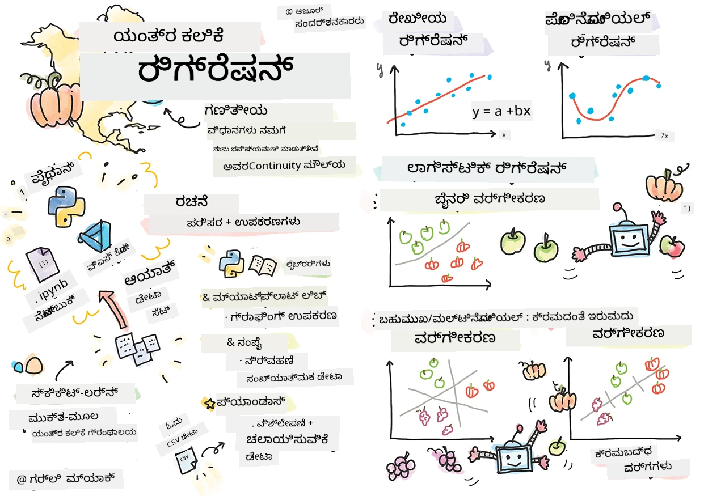
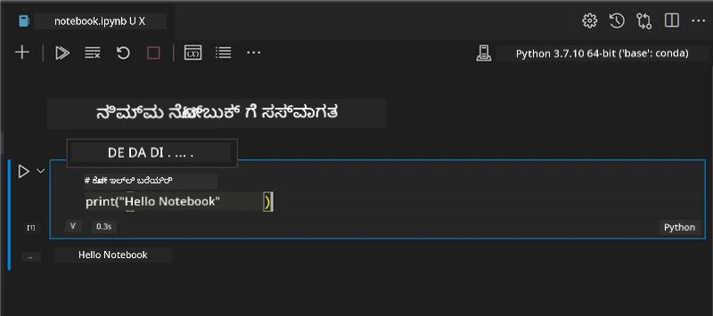
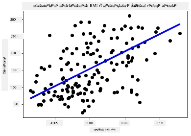

# ರಿಗ್ರೆಶನ್ ಮಾದರಿಗಳಿಗಾಗಿ ಪೈಥಾನ್ ಮತ್ತು ಸ್ಕಿಕಿಟ್-ಲರ್ನ್ನೊಂದಿಗೆ ಪ್ರಾರಂಭಿಸಿ



> ಸ್ಕೆಚ್ನೋಟ್ [ಟೊಮೊಮಿ ಇಮುರು](https://www.twitter.com/girlie_mac) ರವರಿಂದ

## [ಪ್ರೀ-ಲೆಕ್ಚರ್ ಕ್ವಿಜ್](https://ff-quizzes.netlify.app/en/ml/)

> ### [ಈ ಪಾಠ R ನಲ್ಲಿ ಲಭ್ಯವಿದೆ!](../../../../2-Regression/1-Tools/solution/R/lesson_1.html)

## ಪರಿಚಯ

ಈ ನಾಲ್ಕು ಪಾಠಗಳಲ್ಲಿ, ನೀವು ರಿಗ್ರೆಶನ್ ಮಾದರಿಗಳನ್ನು ಹೇಗೆ ನಿರ್ಮಿಸುವುದು ಎಂಬುದನ್ನು ಕಂಡುಹಿಡಿಯುತ್ತೀರಿ. ಇದಕ್ಕಾಗಿ ಏನು ಅವಶ್ಯಕ ಎಂಬವುಗಳ ಬಗ್ಗೆ ತಕ್ಷಣ ಚರ್ಚಿಸುವೆವು. ಆದರೆ ನೀವು ಯಾವುದನ್ನೂ 하기 ಮೊದಲು, ಪ್ರಕ್ರಿಯೆಯನ್ನು ಪ್ರಾರಂಭಿಸಲು ಸೂಕ್ತ ಸಾಧನಗಳನ್ನು ಹೊಂದಿರುವಿರಿ ಎಂದು ಖಚಿತಪಡಿಸಿಕೊಳ್ಳಿ!

ಈ ಪಾಠದಲ್ಲಿ, ನೀವು ಹೇಗೆ ಕಲಿಯುತ್ತೀರಿ:

- ಸ್ಥಳೀಯ ಮೆಷಿನ್ ಲರ್ನಿಂಗ್ ಕಾರ್ಯಗಳಿಗಾಗಿ ನಿಮ್ಮ ಕಂಪ್ಯೂಟರ್ಕ್ಕೆ ಸಂರಚನೆ ಮಾಡುವುದು.
- ಜ್ಯೂಪಿಟರ್ ನೋಟ್ಬುಕ್ಸ್‌ಗಳೊಂದಿಗೆ ಕೆಲಸ ಮಾಡುವುದು.
- ಸ್ಕಿಕಿಟ್-ಲರ್ನ್ ಅನ್ನು ಬಳಸುವುದು ಸೇರಿದಂತೆ ಸ್ಥಾಪನೆ.
- ಅಭ್ಯಾಸದೊಂದಿಗೆ ರೇಖೀಯ ರಿಗ್ರೆಶನ್ ಅನ್ವೇಷಣೆ.

## ಸ್ಥಾಪನೆಗಳು ಮತ್ತು ಸಂರಚನೆಗಳು

[](https://youtu.be/-DfeD2k2Kj0 "ಆರಂಭಿಕರಿಗೆ ಎಂಎಲ್ - ಯಂತ್ರ학습 ಮಾದರಿಗಳನ್ನು ನಿರ್ಮಿಸಲು ನಿಮ್ಮ ಸಾಧನಗಳನ್ನು ಸಿದ್ಧಪಡಿಸಿ")

> 🎥 ಮೆಷಿನ್ ಲರ್ನಿಂಗ್‌ಗಾಗಿ ನಿಮ್ಮ ಕಂಪ್ಯೂಟರ್ ಅನ್ನು ಹೇಗೆ ಸಂರಚಿಸುವುದೆಂಬುದನ್ನು ತೋರಿಸುವ ಸಂಕ್ಷಿಪ್ತ ವೀಡಿಯೊಗೆ ಮೇಲಿನ ಚಿತ್ರವನ್ನು ಕ್ಲಿಕ್ ಮಾಡಿ.

1. **ಪೈಥಾನ್ ಸ್ಥಾಪಿಸಿ**. ನಿಮ್ಮ ಕಂಪ್ಯೂಟರ್‌ನಲ್ಲಿ [ಪೈಥಾನ್](https://www.python.org/downloads/) ಸ್ಥಾಪಿಸಲ್ಪಟ್ಟಿರುವುದನ್ನು ಖಚಿತಪಡಿಸಿಕೊಳ್ಳಿ. ನಿಮಗೆ ಡೇಟಾ ಸಂಶೋಧನೆ ಮತ್ತು ಯಂತ್ರ학습 ಕಾರ್ಯಗಳಿಗೆ ಪೈಥಾನ್ ಬೇಕಾಗುತ್ತದೆ. ಬಹುತೇಕ ಕಂಪ್ಯೂಟರ್ ವ್ಯವಸ್ಥೆಗಳಲ್ಲೇ ಪೈಥಾನ್ ಸ್ಥಾಪನೆ ಏರ್ಪಡಿಸಿರುತ್ತದೆ. ಕೆಲವು ಬಳಕೆದಾರರಿಗಾಗಿ ಸ್ಥಾಪನೆಯನ್ನು ಸುಲಭಗೊಳಿಸುವ ಉಪಯುಕ್ತ [ಪೈಥಾನ್ ಕೋಡಿಂಗ್ ಪ್ಯాక್ಸ್](https://code.visualstudio.com/learn/educators/installers?WT.mc_id=academic-77952-leestott) ಕೂಡ ಲಭ್ಯವಿವೆ.

   ಆದರೆ ಪೈಥಾನ್‌ನ ಕೆಲವು ಉಪಯೋಗಗಳು ಒಂದು ಸಂಸ್ಕರಣೆಯ ಆವೃತ್ತಿಯನ್ನು ಬೇಕಾಗಿಸಬಹುದು, ಇತರವು ಬೇರೆ ಆವೃತ್ತಿಯನ್ನು. ಆದ್ದರಿಂದ, [ವರ್ಚುವಲ್ ಪರಿಸರ](https://docs.python.org/3/library/venv.html) ಒಳಗೆ ಕೆಲಸ ಮಾಡುವುದು ಉಪಯುಕ್ತವಾಗಿದೆ.

2. **ವಿಜುವಲ್ ಸ್ಟುಡಿಯೋ ಕೋಡ್ ಸ್ಥಾಪಿಸಿ**. ನಿಮ್ಮ ಕಂಪ್ಯೂಟರ್‌ನಲ್ಲಿ Visual Studio Code ಇನ್‌ಸ್ಟಾಲ್‌ ಮಾಡಿಕೊಳ್ಳಿ. ಮೂಲಸ್ಥಾಪನೆಯಿಗಾಗಿ ಈ ಸೂಚನೆಗಳು [Visual Studio Code ಅನ್ನು ಸ್ಥಾಪಿಸುವುದು](https://code.visualstudio.com/) ಅನುಸರಿಸಿ. ನೀವು ಈ ಕೋರ್ಸ್‌ನಲ್ಲಿ Visual Studio Code ನಲ್ಲಿ ಪೈಥಾನ್ ಬಳಸಲಿದ್ದೀರಿ, ಆದ್ದರಿಂದ ಪೈಥಾನ್ ಅಭಿವೃದ್ಧಿಗಾಗಿ [Visual Studio Code ಅನ್ನು ಸಂರಚಿಸುವುದನ್ನು](https://docs.microsoft.com/learn/modules/python-install-vscode?WT.mc_id=academic-77952-leestott) ತಿಳಿದಿಡಬಹುದು.

   > ಈ [ಲರ್ನ್ ಮಾಡ್ಯೂಲ್‌ಗಳ](https://docs.microsoft.com/users/jenlooper-2911/collections/mp1pagggd5qrq7?WT.mc_id=academic-77952-leestott) ಸಂಗ್ರಹವನ್ನು ಕಾರ್ಯನಿರ್ವಹಿಸುವ ಮೂಲಕ ಪೈಥಾನ್ ಜೊತೆ ಸುಲಭವಾಗಿ ಪರಿಚಯವಾಗಿರಿ
   >
   > [](https://youtu.be/yyQM70vi7V8 "Visual Studio Code ನೊಂದಿಗೆ ಪೈಥಾನ್ ಅನ್ನು ಸಿದ್ಧಗೊಳಿಸಿ")
   >
   > 🎥 VS Code ಒಳಗೆ ಪೈಥಾನ್ ಬಳಕೆಯ ಕುರಿತು ವೀಡಿಯೊ ನೋಡಲು ಮೇಲಿನ ಚಿತ್ರವನ್ನು ಕ್ಲಿಕ್ ಮಾಡಿ.

3. **ಸ್ಕಿಕಿಟ್-ಲರ್ನ್ ಸ್ಥಾಪಿಸಿ**, [ಈ ಸೂಚನೆಗಳನ್ನು](https://scikit-learn.org/stable/install.html) ಅನುಸರಿಸಿ. ನೀವು ಪೈಥಾನ್ 3 ಬಳಸಬೇಕಿರುವುದರಿಂದ, ವರ್ಚುವಲ್ ಪರಿಸರ ಬಳಸದಂತೆ ಶಿಫಾರಸು ಮಾಡಲಾಗುತ್ತದೆ. M1 ಮ್ಯಾಕ್‌ನಲ್ಲಿ ಈ ಲೈಬ್ರರಿ ಸ್ಥಾಪನೆಗೆ ವಿಶೇಷ ಸೂಚನೆಗಳು ಮೇಲಿನ ಲಿಂಕ್ ನಲ್ಲಿ ಇವೆ.

1. **ಜ್ಯೂಪಿಟರ್ ನೋಟ್ಬುಕ್ ಸ್ಥಾಪಿಸಿ**. ನೀವು [ಜ್ಯೂಪಿಟರ್ ಪ್ಯಾಕೇಜ್ ಅನ್ನು ಸ್ಥಾಪಿಸಬೇಕಾಗುತ್ತದೆ](https://pypi.org/project/jupyter/).

## ನಿಮ್ಮ ಎಂಎಲ್ ರಚನಾ ಪರಿಸರ

ನೀವು ನಿಮ್ಮ ಪೈಥಾನ್ ಕೋಡ್ ಅಭಿವೃದ್ಧಿ ಮಾಡಲು ಮತ್ತು ಯಂತ್ರ學습 ಮಾದರಿಗಳನ್ನು ರಚಿಸಲು **ನೋಟ್ಬುಕ್ಸ್** ಅನ್ನು ಬಳಸಲಿದ್ದೀರಿ. ಈ ರೀತಿಯ ಫೈಲ್ ಡೇಟಾ ವಿಜ್ಞಾನಿಗಳಿಗೆ ಸಾಮಾನ್ಯ ಉಪಕರಣ ಮತ್ತು `.ipynb` ವಿಸ್ತರಣೆ ಇಲ್ಲಿದೆ.

ನೋಟ್ಬುಕ್ಸ್ ಒಂದು ಇಂಟರ್ಯಾಕ್ಟಿವ್ ಪರಿಸರವಾಗಿದ್ದು, ಅಧ್ಯಯನಕಾರರಿಗೆ ಕೋಡ್ ಬರೆಯುವುದರ ಜೊತೆಗೆ ಟಿಪ್ಪಣಿಗಳು ಮತ್ತು ದಸ್ತಾವೇಜಿ ಬರೆಯಲು ಸಹಾಯ ಮಾಡುತ್ತದೆ, ಇದು ಪ್ರಯೋಗಾತ್ಮಕ ಅಥವಾ ಸಂಶೋಧನಾ ಧ್ಯೇಯಗಳಿಗಾಗಿ ಬಹುಮುಖ್ಯವಾಗಿದೆ.

[](https://youtu.be/7E-jC8FLA2E "ಆರಂಭಿಕರಿಗೆ ಎಂಎಲ್ - ರಿಗ್ರೆಶನ್ ಮಾದರಿಗಳನ್ನು ನಿರ್ಮಿಸಲು ಜ್ಯೂಪಿಟರ್ ನೋಟ್ಬುಕ್ಸ್ ಸಿದ್ಧಪಡಿಸಿ")

> 🎥 ಈ ಅಭ್ಯಾಸವನ್ನು ವಿವರಿಸುವ ಸಂಕ್ಷಿಪ್ತ ವೀಡಿಯೊಗೆ ಮೇಲಿನ ಚಿತ್ರವನ್ನು ಕ್ಲಿಕ್ ಮಾಡಿ.

### ಅಭ್ಯಾಸ - ನೋಟ್ಬುಕ್‌ನೊಂದಿಗೆ ಕೆಲಸ ಮಾಡಿ

ಈ ಫೋಲ್ಡರ್‌ನಲ್ಲಿ, ನೀವು _notebook.ipynb_ ಫೈಲ್ ಕಾಣಬಹುದು.

1. _notebook.ipynb_ ಅನ್ನು Visual Studio Code ನಲ್ಲಿ ತೆರೆಯಿರಿ.

   ಜ್ಯೂಪಿಟರ್ ಸರ್ವರ್ Python 3+ ಜೊತೆಗೆ ಪ್ರಾರಂಭವಾಗುತ್ತದೆ. ನೀವು ನೋಟ್ಬುಕ್‌ನ ಭಾಗಗಳನ್ನು `run` ಮಾಡಬಹುದು, ಅಂದರೆ ಕೆಲವು ಕೋಡ್ ತುಂಡುಗಳನ್ನು. ನೀವು ಕೋಡ್ ಬ್ಲಾಕ್ ಅನ್ನು `play` ಬಟನ್ ಆಯ್ಕೆಯಿಂದ ಹಗಲು ಮಾಡಬಹುದು.

1. `md` ಐಕಾನ್ ಆಯ್ಕೆ ಮಾಡಿ ಸ್ವಲ್ಪ ಮಾರ್ಕ್‍ಡೌನ್ ಮತ್ತು ನಂತರ **# Welcome to your notebook** ಎಂಬ ಬರಹ ಸೇರಿಸಿ.

   ನಂತರ ಕೆಲವು ಪೈಥಾನ್ ಕೋಡ್ ಸೇರಿಸಿ.

1. ಕೋಡ್ ಬ್ಲಾಕ್‌ನಲ್ಲಿ **print('hello notebook')** ಟೈಪ್ ಮಾಡಿ.
1. ಕೋಡ್ ಹಗಲು ಮಾಡಲು ತಿರುಗು ಅಂದಾಕಾರ ಆಯ್ಕೆಮಾಡಿ.

   ನೀವು Printed ಸ್ಟೇಟ್ಮೆಂಟ್ ನೋಡಿ:

    ```output
    hello notebook
    ```



ನೀವು ನಿಮ್ಮ ಕೋಡ್ ಜೊತೆಗೆ ಸ್ವ-ಡಾಕ್ಯುಮೆಂಟೇಶನ್ ಟಿಪ್ಪಣಿಗಳನ್ನು ಒಂದಾಗಿಸಬಹುದು.

✅ ಹುಡುಕಿ ವೆಬ್ ಡೆವಲಪರ್ ಕೆಲಸದ ಪರಿಸರ ಮತ್ತು ಡೇಟಾ ವಿಜ್ಞಾನಿ ಕೆಲಸದ ಪರಿಸರದಲ್ಲಿ ವ್ಯತ್ಯಾಸವೇನು ಎಂಬುದನ್ನು.

## ಸ್ಕಿಕಿಟ್-ಲರ್ನ್ ಆಯ್ಕೆ ಮಾಡಿ ಪ್ರಾರಂಭಿಸೋಣ

ಈಗ ಪೈಥಾನ್ ನಿಮ್ಮ ಸ್ಥಳೀಯ ಪರಿಸರದಲ್ಲಿ ಸಿದ್ಧವಾಗಿದೆ ಮತ್ತು ಜ್ಯೂಪಿಟರ್ ನೋಟ್ಬುಕ್ಸ್‌ನಲ್ಲಿ ನಿಮಗೆ ಆರಾಮವಾಗಿದೆ, ಸ್ಕಿಕಿಟ್-ಲರ್ನ್‌ನೊಂದಿಗೆ ಸಮಾನವಾಗಿ ಆರಾಮವಾಗೋಣ (`sci` ಅನ್ನು `ವಿಜ್ಞಾನ` ಎಂಬಂತ ಮಾಡಿ ಉಚ್ಚರಿಸಿ). ಸ್ಕಿಕಿಟ್-ಲರ್ನ್ ಎಂಎಲ್ ಕಾರ್ಯಗಳನ್ನು ನೆರವೇರಿಸಲು [ವಿಸ್ತೃತ API](https://scikit-learn.org/stable/modules/classes.html#api-ref) ಒದಗಿಸುತ್ತದೆ.

ಅವರ [ವೆಬ್‌ಸೈಟ್](https://scikit-learn.org/stable/getting_started.html) ಪ್ರಕಾರ, "ಸ್ಕಿಕಿಟ್-ಲರ್ನ್ ಒಂದು ಮುಕ್ತ ಮೂಲ ಯಂತ್ರ학습 ಲೈಬ್ರರಿ ಆಗಿದ್ದು, ನಿರೀಕ್ಷಿತ ಮತ್ತು ನಿರೀಕ್ಷೆ ಇಲ್ಲದ ಎರಡೂ ಕಲಿಕೆಯನ್ನು ಬೆಂಬಲಿಸುತ್ತದೆ. ಇದು ಮಾದರಿಯ ಫಿಟಿಂಗ್, ಡೇಟಾ ಪೂರ್ವಸಂಗ್ರಹಣೆ, ಮಾದರಿ ಆಯ್ಕೆ ಮತ್ತು ಮೌಲ್ಯಮಾಪನ ಸೇರಿದಂತೆ ವಿವಿಧ ಉಪಕರಣಗಳನ್ನು ಒದಗಿಸುತ್ತದೆ."

ಈ ಕೋರ್ಸ್‌ನಲ್ಲಿ, ನೀವು ಸ್ಕಿಕಿಟ್-ಲರ್ನ್ ಮತ್ತು ಇತರ ಉಪಕರಣಗಳನ್ನು ಬಳಸಿಕೊಂಡು 'ಪಾರಂಪರಿಕ ಯಂತ್ರ學습' ಕಾರ್ಯಗಳನ್ನು ನಿರ್ವಹಿಸುವ ಯಂತ್ರ학습 ಮಾದರಿಗಳನ್ನು ನಿರ್ಮಿಸುತ್ತೀರಿ. ನಾವು ಉದ್ದೇಶಪೂರ್ವಕವಾಗಿ ನ್ಯೂರಲ್ ನೆಟ್‌ವರ್ಕ್‌ಗಳು ಮತ್ತು ಡೀಪ್ ಲರ್ನಿಂಗ್ ಹಾಗು ಮುಂದಿನ 'ಬಗೆಗೆ AI ಆರಂಭಿಕರು' ಪಠ್ಯಕ್ರಮದಲ್ಲಿ ಆವೃತ್ತಿಯಾಗಿವೆ ಅವುಗಳನ್ನು ಬಿಟ್ಟಿದ್ದೇವೆ.

ಸ್ಕಿಸ್ಕಿಟ್-ಲರ್ನ್ ಮಾದರಿಗಳನ್ನು ಸುಲಭವಾಗಿ ನಿರ್ಮಿಸಲು ಮತ್ತು ಬಳಸಲು ಸಹಾಯಕವಾಗಿದೆ. ಇದು ಮುಖ್ಯವಾಗಿ ಸಂಖ್ಯಾತ್ಮಕ ಡೇಟಾ ಜೊತೆಗೆ ಕೆಲಸ ಮಾಡುತ್ತದೆ ಮತ್ತು ಕಲಿಕೆಯ ಸರಳ ಉಪಕರಣವಾಗಿ ಹಲವಾರು ಮುಂಚಿತ ಡೇಟಾ ಸೆಟ್‌ಗಳನ್ನು ಹೊಂದಿದೆ. ಷಿಕ್ಷಾರ್ಥಿಗಳಿಗೆ ಪ್ರಯೋಗಿಸಬಹುದಾದ ಪೂರ್ವನಿರ್ಮಿತ ಮಾದರಿಗಳನ್ನು ಸಹ ಒಳಗೊಂಡಿದೆ. ಮೊದಲು, ಮುಂಚಿತ ಪ್ಯಾಕೇಜ್ ಡೇಟಾವನ್ನು ಲೋಡ್ ಮಾಡುವುದು ಮತ್ತು ಬಿಲ್ಟ್ ಇನ್ ಎಸ್ಟಿಮೇಟರ್ ಉಪಯೋಗಿಸಿ ನಿಮ್ಮ ಮೊದಲ ML ಮಾದರಿಯನ್ನು ಸ್ಕಿಕಿಟ್-ಲರ್ನ್ ಜೊತೆಗೆ ಪರಿಗಣಿಸೋಣ.

## ಅಭ್ಯಾಸ - ನಿಮ್ಮ ಮೊದಲ ಸ್ಕಿಕಿಟ್-ಲರ್ನ್ ನೋಟ್ಬುಕ್

> ಈ ತರಬೇತಿಯನ್ನು ಸ್ಕಿಕಿಟ್-ಲರ್ನ್ ವೆಬ್‌ಸೈಟ್‌上的 [ರೇಖೀಯ ರಿಗ್ರೆಶನ್ ಉದಾಹರಣೆಯಿಂದ](https://scikit-learn.org/stable/auto_examples/linear_model/plot_ols.html#sphx-glr-auto-examples-linear-model-plot-ols-py) ಪ್ರೇರಣೆಗೆ ತೆಗೆದುಕೊಂಡಿದೆ.


[](https://youtu.be/2xkXL5EUpS0 "ಆರಂಭಿಕರಿಗೆ ಎಂಎಲ್ - ನಿಮ್ಮ ಮೊದಲ ರೇಖೀಯ ರಿಗ್ರೆಶನ್ ಪ್ರಾಜೆಕ್ಟ್")

> 🎥 ಮೇಲಿನ ಚಿತ್ರವನ್ನು ಕ್ಲಿಕ್ ಮಾಡಿ ಈ ಅಭ್ಯಾಸದ ಸಂಕ್ಷಿಪ್ತ ವೀಡಿಯೊಗೆ ಹೋಗಿ.

_notebook.ipynb_ ಫೈಲ್‌ನಲ್ಲಿ, ಎಲ್ಲಾ ಸೆಲ್ಸ್ ಅನ್ನು 'ಟ್ರ್ಯಾಶ್ ಕ್ಯಾನ್' ಐಕಾನ್ ಒತ್ತಿ ತೆರವುಗೊಳಿಸಿ.

ಈ ಭಾಗದಲ್ಲಿ, ನೀವು ಸ್ಕಿಕಿಟ್-ಲರ್ನ್ ಒಳಗೊಂಡಿರುವ ಡಯಾಬಿಟೀಸ್ ಕುರಿತ ಸಣ್ಣ ಡೇಟಾಸೆಟ್ ಜೊತೆಗೆ ಕೆಲಸ ಮಾಡುತ್ತೀರಿ. ಇಲ್ಲಿಗೆ ನೀವು ಡಯಾಬಿಟಿಕ್ ರೋಗಿಗಳಿಗೆ ಚಿಕಿತ್ಸೆಯನ್ನು ಪರೀಕ್ಷಿಸುವುದಾಗಿ ಕಲ್ಪಿಸೋಣ. ಯಂತ್ರ學습 ಮಾದರಿಗಳು, ರೋಗಿಗಳಿಗೆ ಚಿಕಿತ್ಸೆへの ಪ್ರತಿಕ್ರಿಯೆ ಯಾವುದು ಉತ್ತಮವಾಗಿರಬಹುದು ಎಂಬುದನ್ನು ನಿರ್ಧರಿಸಲು ಸಹಾಯ ಮಾಡಬಹುದು, ವಿವಿಧ ವ್ಯತ್ಯಾಸಗಳ ಸಂಯೋಜನೆಯ ಮೇಲೆ ಆಧಾರಿತ. ಸರಳ ರಿಗ್ರೆಶನ್ ಮಾದರಿಯು ಸಹ ದೃಶ್ಯರೂಪದಲ್ಲಿ, ಥಿಯರೇಟಿಕಲ್ ಕ್ಲಿನಿಕಲ್ ಪ್ರಯೋಗಗಳಿಗೆ ಸಹಾಯ ಮಾಡುವ ಡೇಟಾ ಬಗ್ಗೆ ಮಾಹಿತಿ ತೋರಿಸಬಹುದು.

✅ ರಿಗ್ರೆಶನ್ ವಿಧಾನಗಳು ಹಲವಾರು ಪ್ರಕಾರಗಳಿವೆ, ಮತ್ತು ಯಾವುದು ಆಯ್ಕೆಮಾಡುವುದು ನೀವು ಹುಡುಕುತ್ತಿರುವ ಉತ್ತರದ ಮೇಲೆ ಅವಲಂಬಿತವಾಗಿದೆ. ಉದಾಹರಣೆಗೆ, ನೀವು ವ್ಯಕ್ತಿಯ ವಯಸ್ಸಿಗಾಗಿ ಸಾಧ್ಯವಿರುವ ಎತ್ತರವನ್ನೂ ಊಹಿಸಲು ಬಯಸಿದರೆ, ನೀವು ರೇಖೀಯ ರಿಗ್ರೆಶನ್ ಉಪಯೋಗಿಸುತ್ತೀರಿ, ಏಕೆಂದರೆ ನೀವು ಒಂದು **ಸಂಖ್ಯಾತ್ಮಕ ಮೌಲ್ಯ** ಹುಡುಕುತ್ತಿದ್ದೀರಿ. ನೀವು ಯಾವ ರೀತಿಯ ಆಹಾರವು ವೀಗನ್ ಆಗಿದೆ ಅಥವಾ ಅಲ್ಲ ಎಂದು ಪತ್ತೆ ಹಚ್ಚಬೇಕಾದರೆ, ನೀವು **ಪದವರ್ಗ ನಿಯೋಜನೆ** ಹುಡುಕುತ್ತಿದ್ದೀರಿ ಆದ್ದರಿಂದ ಲಾಜಿಸ್ಟಿಕ್ ರಿಗ್ರೆಶನ್ ಬಳಸುತ್ತಾರೆ. ಲಾಜಿಸ್ಟಿಕ್ ರಿಗ್ರೆಶನ್ ಕುರಿತಾಗಿ ನಂತರ ತಿಳಿದುಕೊಳ್ಳುತ್ತೀರಿ. ಕೆಲವು ಪ್ರಶ್ನೆಗಳನ್ನು ಡೇಟಾದಿಂದ ಕೇಳಬಹುದಾದುದಾಗಿ ಯೋಚಿಸಿ, ಮತ್ತು ಯಾವ ವಿಧಾನ ಹೆಚ್ಚು ಸೂಕ್ತವಾಗಿದೆ ಎಂದು ಪರಿಗಣಿಸಿ.

ಇಗೋ, ಈ ಕಾರ್ಯವನ್ನು ಪ್ರಾರಂಭಿಸೋಣ.

### ಗ್ರಂಥಾಲಯಗಳನ್ನು ಆಮದು ಮಾಡಿಕೊಳ್ಳಿ

ಈ ಕಾರ್ಯಕ್ಕಾಗಿ ಕೆಲವು ಗ್ರಂಥಾಲಯಗಳನ್ನು ಆಮದು ಮಾಡಿಕೊಳ್ಳುತ್ತೇವೆ:

- **matplotlib**. ಇದು ಉಪಯುಕ್ತ [ಗ್ರಾಫ್ ಸಾಧನ](https://matplotlib.org/) ಮತ್ತು ನಾವು ಲೈನ್ ಪ್ಲಾಟ್ ಸೃಷ್ಟಿಸಲು ಇದನ್ನು ಬಳಸುತ್ತೇವೆ.
- **numpy**. [numpy](https://numpy.org/doc/stable/user/whatisnumpy.html) ಪೈಥಾನ್‌ನಲ್ಲಿ ಸಂಖ್ಯಾತ್ಮಕ ಡೇಟಾಗಳನ್ನು ಕೈಗೊಳ್ಳಲು ಉಪಯುಕ್ತ ಗ್ರಂಥಾಲಯ.
- **sklearn**. ಇದು [ಸ್ಕಿಕಿಟ್-ಲರ್ನ್](https://scikit-learn.org/stable/user_guide.html) ಗ್ರಂಥಾಲಯ.

ನಿಮ್ಮ ಕಾರ್ಯಗಳಿಗೆ ಸಹಾಯ ಮಾಡಲು ಕೆಲವು ಗ್ರಂಥಾಲಯಗಳನ್ನು ಆಮದು ಮಾಡಿಕೊಳ್ಳಿ.

1. ಕೆಳಗಿನ ಕೋಡ್ ಟೈಪ್ ಮಾಡಬಹುದು:

   ```python
   import matplotlib.pyplot as plt
   import numpy as np
   from sklearn import datasets, linear_model, model_selection
   ```

   ಮೇಲಿನ ಭಾಗದಲ್ಲಿ ನೀವು `matplotlib`, `numpy` ಅನ್ನು ಆಮದು ಮಾಡಿಕೊಳ್ಳುತ್ತಿದ್ದೀರಿ ಮತ್ತು `sklearn` ಫ್ರೇಮ್‌ವರ್ಕ್‌ನ `datasets`, `linear_model` ಮತ್ತು `model_selection` ನಿಂದ ಆಮದು ಮಾಡಿಕೊಳ್ಳುತ್ತಿದ್ದೀರಿ. `model_selection` డೇಟಾ ತರಬೇತಿ ಹಾಗೂ ಪರೀಕ್ಷಾ ಸೆಟ್‌ಗಳಿಗೆ ವಿಭಜಿಸಲು ಉಪಯೋಗಿಸಲಾಗುತ್ತದೆ.

### ಡಯಾಬಿಟೀಸ್ ಡೇಟಾಸೆಟ್

ಸ್ಥಾಪಿತ [ಡಯಾಬಿಟೀಸ್ ಡೇಟಾಸೆಟ್](https://scikit-learn.org/stable/datasets/toy_dataset.html#diabetes-dataset) 442 ಮಾದರಿಗಳನ್ನು ಹೊಂದಿದ್ದು, 10 ವೈಶಿಷ್ಟ್ಯಗಳುಳ್ಳ ವ್ಯತ್ಯಾಸಗಳಿವೆ, ಕೆಲವು ಈ ಕೆಳಗಿನಂತಿವೆ:

- ವಯಸ್ಸು: ವರ್ಷಗಳಲ್ಲಿನ ವಯಸ್ಸು
- ಬಿಎಂಐ: ದೇಹದ ದ್ರವ್ಯಮಾನ ಸೂಚಕ
- ಬಿಪಿ: ಸರಾಸರಿ ರಕ್ತದ ಒತ್ತಡ
- s1 tc: ಟಿ-ಕೋಶಗಳು (ಒಂದು ರೀತಿಯ ಬಿಳಿ ರಕ್ತಕೋಶಗಳು)

✅ ಈ ಡೇಟಾಸೆಟ್ 'ಲಿಂಗ'ವೆಂಬ ವೈಶಿಷ್ಟ್ಯತ್ಯಾಂಶವನ್ನು ಒಳಗೊಂಡಿದೆ, ಇದು ಡಯಾಬಿಟೀಸ್ ಸಂಶೋಧನೆಗೆ ಮಹತ್ವವನ್ನು ಹೊಂದಿದೆ. ಬಹಳ ವೈದ್ಯಕೀಯ ಡೇಟಾಸೆಟ್‌ಗಳಲ್ಲಿ ಈ ರೀತಿಯ ದ್ವಿಪದ ವರ್ಗೀಕರಣ ಕಾಣಬಹುದು. ಈ ವರ್ಗೀಕರಣಗಳು ಕೆಲವು ಜನಸಂಖ್ಯೆಯ ಭಾಗಗಳನ್ನು ಚಿಕಿತ್ಸೆಗಳಿಂದ ಹೊರಗೊಳಿಸಬಹುದು ಎಂಬುದನ್ನು ತ್ವರಿತವಾಗಿ ಯೋಚಿಸಿ.

ಈಗ, `X` ಮತ್ತು `y` ಡೇಟಾವನ್ನು ಲೋಡ್ ಮಾಡೋಣ.

> 🎓 ನೆನಪಿಡಿ, ಇದು ಮತ್ತು ನಿರೀಕ್ಷಿತ ಕಲಿಕೆ; ನಮಗೆ ಹೆಸರು ಹಚ್ಚಲಾದ 'y' ಗುರಿ ಬೇಕಾಗುತ್ತದೆ.

ಹೊಸ ಕೋಡ್ ಸೆಲ್ನಲ್ಲಿ `load_diabetes()` ಅನ್ನು ಕರೆಸಿಕೊಂಡು ಡಯಾಬಿಟೀಸ್ ಡೇಟಾಸೆಟ್ ಅನ್ನು ಲೋಡ್ ಮಾಡಿ. ಇನ്പುಟ್ `return_X_y=True` ಅಂದರೆ `X` ಡೇಟಾ ಮ್ಯಾಟ್ರಿಕ್ಸ್ ಆಗಿದ್ದು, `y` ಎಂದರೆ ರಿಗ್ರೆಶನ್ ಗುರಿಯಾಗಿದೆ.

1. ಡೇಟಾ ಮ್ಯಾಟ್ರಿಕ್ಸ್ ನ ಆಕಾರ ಮತ್ತು ಮೊದಲ ಅಂಶಗಳನ್ನು ಪ್ರದರ್ಶಿಸುವ ಪೋಷಣಗಳನ್ನು ಸೇರಿಸಿ:

    ```python
    X, y = datasets.load_diabetes(return_X_y=True)
    print(X.shape)
    print(X[0])
    ```

    ನೀವು ಪಡೆಯುತ್ತಿರುವುದಾಗಿದೆ tuple. ನೀವು tuple ನ ಮೊದಲ ಎರಡು ಮೌಲ್ಯಗಳನ್ನು ಕ್ರಮವಾಗಿ `X` ಮತ್ತು `y` ಗೆ ನಿಯೋಜಿಸುತ್ತಿದ್ದೀರಿ. tuple ಬಗ್ಗೆ ಹೆಚ್ಚಿನ ಮಾಹಿತಿಗಾಗಿ ಈ ಲಿಂಕ್ ನೋಡಿ: [tuple](https://wikipedia.org/wiki/Tuple).

    ನೀವು ನೋಡಬಹುದು ಈ ಡೇಟಾ 442 ಐಟಮ್ಗಳನ್ನು ಹೊಂದಿದ್ದು, ಪ್ರತಿ ಐಟಮ್ 10 ಅಂಶಗಳಿಂದ ರೂಪಗೊಳ್ಳುತ್ತದೆ:

    ```text
    (442, 10)
    [ 0.03807591  0.05068012  0.06169621  0.02187235 -0.0442235  -0.03482076
    -0.04340085 -0.00259226  0.01990842 -0.01764613]
    ```

    ✅ ಡೇಟಾ ಮತ್ತು ರಿಗ್ರೆಶನ್ ಗುರಿ ನಡುವಿನ ಸಂಬಂಧದ ಬಗ್ಗೆ ಯೋಚಿಸಿ. ರೇಖೀಯ ರಿಗ್ರೆಶನ್ ವೈಶಿಷ್ಟ್ಯ X ಮತ್ತು ಗುರಿ `y` ನಡುವಿನ ಸಂಬಂಧವನ್ನು ಊಹಿಸುತ್ತದೆ. ನೀವು ಡಾಕ್ಯುಮೆಂಟೇಶನ್‌ನಲ್ಲಿನ ಡಯಾಬಿಟೀಸ್ ಡೇಟಾಸೆಟ್ ಗುರಿಯನ್ನು ಹುಡುಕಬಹುದೇ? ಈ ಗುರಿ ಆ ಡೇಟಾಸೆಟ್ ಯಾವ ಸಂಧರ್ಭವನ್ನು ತೋರಿಸುತ್ತಿದೆ?

2. ನಂತರ, ಈ ಡೇಟಾಸೆಟ್‌ನ 3ನೇ ಕಾಲಮ್ ಆಯ್ಕೆಮಾಡಿ ಪ್ಲಾಟ್ ಮಾಡಲು ಆಯ್ಕೆಮಾಡಿ. ಎಲ್ಲಾ ಸಾಲುಗಳನ್ನು `:` ಆಯ್ಕೆ ಮಾಡಿ, ನಂತರ 3ನೇ ಕಾಲಮ್ (ಸೂಚ್ಯಂಕ 2) ಆಯ್ಕೆಮಾಡಿ. ಡೇಟಾವನ್ನು 2D ಆರೆ ಆಗಿ ಆಕಾರ ಬದಲಾಯಿಸಲು ನೀವು `reshape(n_rows, n_columns)` ಉಪಯೋಗಿಸಬಹುದು. ಒಂದೊಂದು ಪ್ಯಾರಾಮೀಟರ್ -1 ಆಗಿದ್ದರೆ, ಆ ಆಯಾಮವನ್ನು ಸ್ವಯಂಚಾಲಿತವಾಗಿ ಲೆಕ್ಕಿಸಲಾಗುತ್ತದೆ.

   ```python
   X = X[:, 2]
   X = X.reshape((-1,1))
   ```

   ✅ ಯಾವಾಗಲಾದರೂ ಡೇಟಾ ಆಕಾರವನ್ನು ಪರಿಶೀಲಿಸಲು ಅದನ್ನು ಪ್ರಿಂಟ್ ಮಾಡಿ.

3. ಈಗ ಡೇಟಾ ಚಿತ್ರಿಸಲು ಸಿದ್ಧವಾಗಿದೆ, ಮಷಿನ್ ಸಂಖ್ಯೆಗಳ ನಡುವಿನ ಲಾಜಿಕಲ್ ವಿಭಜನೆ ತಿಳಿಯಲು ಸಹಾಯ ಮಾಡುವುದೇ ಎಂದು ನೋಡೋಣ. ಇದಕ್ಕಾಗಿ, ನೀವು ಡೇಟಾ (X) ಮತ್ತು ಗುರಿ (y) ಇನ್ನು ನೀವು ತರಬೇತಿ ಹಾಗೂ ಪರೀಕ್ಷಾ ಸೆಟ್‌ಗಳಿಗೆ ವಿಭಜಿಸಬೇಕು. ಸ್ಕಿಕಿಟ್-ಲರ್ನ್ ಇದನ್ನು ಸುಲಭವಾಗಿ ಮಾಡುತ್ತದೆ; ನಿಮಗೆ ಬೇಕಾದ ಸ್ಥಳದಲ್ಲಿ ಪರೀಕ್ಷಾ ಡೇಟಾವನ್ನು ವಿಭಜಿಸಬಹುದು.

   ```python
   X_train, X_test, y_train, y_test = model_selection.train_test_split(X, y, test_size=0.33)
   ```

4. ಈಗ ನೀವು ನಿಮ್ಮ ಮಾದರಿಯನ್ನು ತರಬೇತಿಗೆ ಸಿದ್ಧವಾಗಿದೆ! ಲೀನಿಯರ್ ರಿಗ್ರೆಶನ್ ಮಾದರಿಯನ್ನು ಲೋಡ್ ಮಾಡಿ ಮತ್ತು ನಿಮ್ಮ X ಮತ್ತು y ತರಬೇತಿ ಸೆಟ್‌ಗಳಿಗೆ `model.fit()` ಉಪಯೋಗಿಸಿ ತರಬೇತಿಯನ್ನು ಮಾಡಿ:

    ```python
    model = linear_model.LinearRegression()
    model.fit(X_train, y_train)
    ```

    ✅ `model.fit()` ಅನೇಕ ಯಂತ್ರ학습 ಗ್ರಂಥಾಲಯಗಳಲ್ಲಿ, ಉದಾ: ಟೆನ್ಸರ್ ಫ್ಲೋ ಇತ್ಯಾದಿಗಳಲ್ಲಿ ಕಾಣಸಿಗುವ ಕಾರ್ಯ.

5. ನಂತರ, `predict()` ಫಂಕ್ಷನ್ ಬಳಸಿ ಪರೀಕ್ಷಾ ಡೇಟಾವನ್ನು ಉಪಯೋಗಿಸಿ ಅನುಮಾನವನಾದಿಸು. ಇದು ಡೇಟಾ ಗುಂಪುಗಳ ನಡುವಿನ ರೇಖೆಯನ್ನು ಎಳೆಯಲು ಉಪಯೋಗಿಸಲಾಗುತ್ತದೆ.

    ```python
    y_pred = model.predict(X_test)
    ```

6. ಈಗ ಡೇಟಾವನ್ನು ಚಿತ್ತರಿಸಲು ಸಮಯ. ಮ್ಯಾಟ್‌ಪ್ಲಾಟ್‌ಲಿಬ್ ಇದಕ್ಕೆ ಬಹುಮುಖ ಉಪಕರಣ. ಎಲ್ಲಾ X ಮತ್ತು y ಪರೀಕ್ಷಾ ಡೇಟಾ ಸ್ಪೋಟವನ್ನು ಸೃಷ್ಟಿಸಿ, ಮತ್ತು ಮಾದರಿ ವಿಶ್ಲೇಷಣೆಗಾಗಿ ರೇಖೆಯನ್ನು ಬಿಡಿ.

    ```python
    plt.scatter(X_test, y_test,  color='black')
    plt.plot(X_test, y_pred, color='blue', linewidth=3)
    plt.xlabel('Scaled BMIs')
    plt.ylabel('Disease Progression')
    plt.title('A Graph Plot Showing Diabetes Progression Against BMI')
    plt.show()
    ```

   


   ✅ ಇಲ್ಲಿ ಏನಾಗುತ್ತಿದೆ ಎಂದು ಸ್ವಲ್ಪ ಆಲೋಚಿಸಿ ನೋಡಿ. ಹಲವಾರು ಸಣ್ಣ ಡೇಟಾ ಬಿಂದುಗಳ ಮೂಲಕ ಒಂದು ಸರಳ ಇಲ್ಲು ಹರಡುತ್ತಿದೆ, ಆದರೆ ಅದು ನಿಖರವಾಗಿ ಏನು ಮಾಡುತ್ತಿದೆ? ನಿಮ್ಮ ಸ್ಟೋರಿಕೆಯಲ್ಲಿ ಹೊಸದಾಗಿ ಕಾಣದ ಡೇಟಾ ಪಾಯಿಂಟ್ ಯಾವ ಸ್ಥಾನದಲ್ಲಿ ಗುರುತಿಸಲು ನೀವು ಈ ರೇಖೆಯನ್ನು ಹೇಗೆ ಬಳಸಬಹುದು ಎಂದು ಕಾಣಬಹುದೇ? ಈ ಮಾದರಿಯ ಪ್ರಾಯೋಗಿಕ ಬಳಕೆಯನ್ನು ಪದಗಳಲ್ಲಿ ವಿವರಿಸಲು ಪ್ರಯತ್ನಿಸಿ.

ಅಭಿನಂದನೆಗಳು, ನೀವು ನಿಮ್ಮ ಮೊದಲ ಲೀನಿಯರ್ ರಿಗ್ರೆಶನ್ ಮಾದರಿಯನ್ನು ನಿರ್ಮಿಸಿದ್ದೀರಿ, ಅದರೊಂದಿಗೆ ಭವಿಷ್ಯವಾಣಿಯನ್ನು ಮಾಡಿದ್ದೀರಿ ಮತ್ತು ಅದನ್ನು ಪ್ಲಾಟ್‌ನಲ್ಲಿ ಪ್ರದರ್ಶಿಸಿದ್ದೀರಿ!

---
## 🚀ಸವಾಲು

ಈ ಡೇಟಾಸೆಟ್‌ನಿಂದ ಬೇರೆ ಪರಿಮಾಣವನ್ನು ಪ್ಲಾಟ್ ಮಾಡಿರಿ. ಸೂಚನೆ: ಈ ಸಾಲನ್ನು ಸಂಪಾದನೆ ಮಾಡಿರಿ: `X = X[:,2]`. ಈ ಡೇಟಾಸೆಟ್‌ನ ಗುರಿಯೊಂದಿಗೆ, ರೋಗವಾಗಿ ಡಯಾಬಿಟೀಸ್‌ನ ಪ್ರಗತಿಯಿಂದ ನೀವು ಏನು ಪತ್ತೆಹಚ್ಚಬಹುದು?
## [ಪಾಠದ ನಂತರದ ಕ್ವಿಜ್](https://ff-quizzes.netlify.app/en/ml/)

## ವಿಮರ್ಶೆ ಮತ್ತು ಸ್ವಯಂ ಅಧ್ಯಯನ

ಈ ಪಾಠದಲ್ಲಿ, ನೀವು ಸರಳ ಲೀನಿಯರ್ ರಿಗ್ರೆಶನ್ ಜೊತೆಗೆ ಕೆಲಸ ಮಾಡಿದ್ದೀರಿ, ಒಂದೂವರೆ ಅಥವಾ ಬಹು ಪರಿಮಾಣ ಲೀನಿಯರ್ ರಿಗ್ರೆಶನ್ ಅಲ್ಲ. ಈ ವಿಧಾನಗಳ ನಡುವೆ ಇರುವ ವ್ಯತ್ಯಾಸಗಳು ಕುರಿತು ಸ್ವಲ್ಪ ಓದಿ, ಅಥವಾ [ಈ ವೀಡಿಯೋವನ್ನು](https://www.coursera.org/lecture/quantifying-relationships-regression-models/linear-vs-nonlinear-categorical-variables-ai2Ef) ನೋಡಿರಿ.

ರಿಗ್ರೆಶನ್ ಸಿದ್ಧಾಂತದ ಬಗ್ಗೆ ಹೆಚ್ಚಾಗಿ ಓದಿ ಮತ್ತು ಈ ತಂತ್ರದಿಂದ ಯಾವುದೇ ಪ್ರಶ್ನೆಗಳಿಗೆ ಉತ್ತರ ಸಾಧ್ಯವೆಂದು ಯೋಚಿಸಿ. ನಿಮ್ಮ ತಿಳಿವಳಿಕೆಯನ್ನು ಗಾಢಗೊಳಿಸಲು ಈ [ಪಾಠದ ಮಾರ್ಗದರ್ಶನವನ್ನು](https://docs.microsoft.com/learn/modules/train-evaluate-regression-models?WT.mc_id=academic-77952-leestott) ಅನುಸರಿಸಿ.

## ನಿಯೋಜನೆ

[ಬೇರೊಂದು ಡೇಟಾಸೆಟ್](assignment.md)

---

<!-- CO-OP TRANSLATOR DISCLAIMER START -->
**ಅಸ್ವೀಕಾರ**:
ಈ ದಸ್ತಾವೇಜು AI ಅನುವಾದ ಸೇವೆ [Co-op Translator](https://github.com/Azure/co-op-translator) ಬಳಸಿ ಅನುವಾದಿಸಲಾಗಿದೆ. ನಾವು ನಿಖರತೆಯನ್ನು ಸಾಧಿಸಲು ಪ್ರಯತ್ನಿಸುತ್ತಿದ್ದರೂ, ದಯವಿಟ್ಟು ಗಮನಿಸಿ, ಸ್ವಯಂಚಾಲಿತ ಅನುವಾದಗಳಲ್ಲಿ ದೋಷಗಳು ಅಥವಾ ಅಸಡ್ಡೆಗಳು ಇರಬಹುದು. ಮೂಲ ಭಾಷೆಯಲ್ಲಿರುವ ಮೂಲ ದಸ್ತಾವೇಜು ಪ್ರಾಮಾಣಿಕ ಮೂಲವೆಂದು ಪರಿಗಣಿಸಬೇಕು. ಪ್ರಮುಖ ಮಾಹಿತಿಗಾಗಿ, ವೃತ್ತಿಪರ ಮಾನವ ಅನುವಾದವನ್ನು ಶಿಫಾರಸು ಮಾಡಲಾಗುತ್ತದೆ. ಈ ಅನುವಾದವನ್ನು ಬಳಸುವ ಮೂಲಕ ಉಂಟಾಗುವ ಯಾವುದೇ ತಪ್ಪು ಅರ್ಥಗಳ ಅಥವಾ ತಪ್ಪು ವ್ಯಾಖ್ಯಾನಗಳ ಬಗ್ಗೆ ನಾವು ಹೊಣೆಗಾರರಲ್ಲ.
<!-- CO-OP TRANSLATOR DISCLAIMER END -->