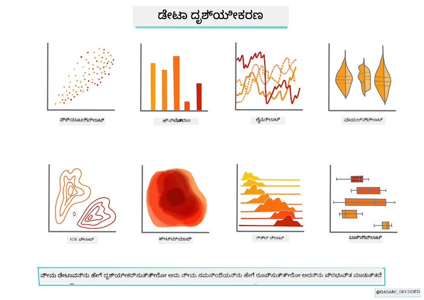
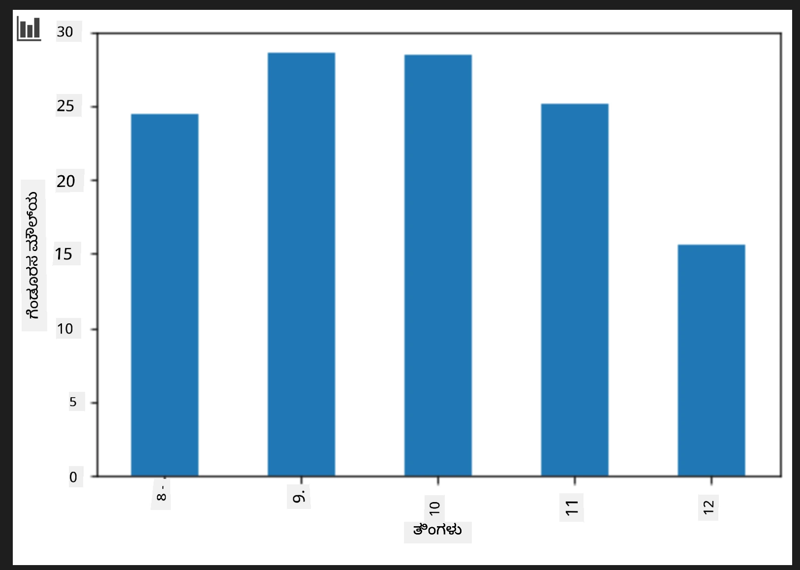

<!--
CO_OP_TRANSLATOR_METADATA:
{
  "original_hash": "7c077988328ebfe33b24d07945f16eca",
  "translation_date": "2025-12-19T14:01:56+00:00",
  "source_file": "2-Regression/2-Data/README.md",
  "language_code": "kn"
}
-->
# Scikit-learn ಬಳಸಿ ರೆಗ್ರೆಶನ್ ಮಾದರಿಯನ್ನು ನಿರ್ಮಿಸಿ: ಡೇಟಾವನ್ನು ಸಿದ್ಧಪಡಿಸಿ ಮತ್ತು ದೃಶ್ಯೀಕರಿಸಿ



ಇನ್ಫೋಗ್ರಾಫಿಕ್ [ದಾಸನಿ ಮಡಿಪಳ್ಳಿ](https://twitter.com/dasani_decoded) ಅವರಿಂದ

## [ಪೂರ್ವ-ಪಾಠ ಕ್ವಿಜ್](https://ff-quizzes.netlify.app/en/ml/)

> ### [ಈ ಪಾಠ R ನಲ್ಲಿ ಲಭ್ಯವಿದೆ!](../../../../2-Regression/2-Data/solution/R/lesson_2.html)

## ಪರಿಚಯ

Scikit-learn ಬಳಸಿ ಯಂತ್ರ ಅಧ್ಯಯನ ಮಾದರಿ ನಿರ್ಮಾಣವನ್ನು ಪ್ರಾರಂಭಿಸಲು ನೀವು ಅಗತ್ಯವಿರುವ ಸಾಧನಗಳೊಂದಿಗೆ ಸಿದ್ಧರಾಗಿರುವಾಗ, ನಿಮ್ಮ ಡೇಟಾದ ಬಗ್ಗೆ ಪ್ರಶ್ನೆಗಳನ್ನು ಕೇಳಲು ನೀವು ಸಿದ್ಧರಾಗಿದ್ದೀರಿ. ಡೇಟಾ ಜೊತೆಗೆ ಕೆಲಸ ಮಾಡುವಾಗ ಮತ್ತು ML ಪರಿಹಾರಗಳನ್ನು ಅನ್ವಯಿಸುವಾಗ, ನಿಮ್ಮ ಡೇಟಾಸೆಟ್‌ನ ಸಾಧ್ಯತೆಗಳನ್ನು ಸರಿಯಾಗಿ ಅನ್ಲಾಕ್ ಮಾಡಲು ಸರಿಯಾದ ಪ್ರಶ್ನೆಯನ್ನು ಕೇಳುವುದು ಬಹಳ ಮುಖ್ಯ.

ಈ ಪಾಠದಲ್ಲಿ, ನೀವು ಕಲಿಯುವಿರಿ:

- ನಿಮ್ಮ ಡೇಟಾವನ್ನು ಮಾದರಿ ನಿರ್ಮಾಣಕ್ಕೆ ಹೇಗೆ ಸಿದ್ಧಪಡಿಸುವುದು.
- ಡೇಟಾ ದೃಶ್ಯೀಕರಣಕ್ಕಾಗಿ Matplotlib ಅನ್ನು ಹೇಗೆ ಬಳಸುವುದು.

## ನಿಮ್ಮ ಡೇಟಾದ ಸರಿಯಾದ ಪ್ರಶ್ನೆಯನ್ನು ಕೇಳುವುದು

ನೀವು ಉತ್ತರಿಸಬೇಕಾದ ಪ್ರಶ್ನೆ ಯಾವ ರೀತಿಯ ML ಆಲ್ಗಾರಿಥಮ್‌ಗಳನ್ನು ನೀವು ಬಳಸಬೇಕೆಂದು ನಿರ್ಧರಿಸುತ್ತದೆ. ಮತ್ತು ನೀವು ಪಡೆದ ಉತ್ತರದ ಗುಣಮಟ್ಟವು ನಿಮ್ಮ ಡೇಟಾದ ಸ್ವಭಾವದ ಮೇಲೆ ಬಹಳ ಅವಲಂಬಿತವಾಗಿರುತ್ತದೆ.

ಈ ಪಾಠಕ್ಕಾಗಿ ನೀಡಲಾದ [ಡೇಟಾ](https://github.com/microsoft/ML-For-Beginners/blob/main/2-Regression/data/US-pumpkins.csv) ಅನ್ನು ನೋಡಿ. ನೀವು ಈ .csv ಫೈಲ್ ಅನ್ನು VS Code ನಲ್ಲಿ ತೆರೆಯಬಹುದು. ಒಂದು ತ್ವರಿತ ಪರಿಶೀಲನೆ ತಕ್ಷಣವೇ ಖಾಲಿ ಸ್ಥಳಗಳು ಮತ್ತು ಸ್ಟ್ರಿಂಗ್‌ಗಳು ಮತ್ತು ಸಂಖ್ಯಾತ್ಮಕ ಡೇಟಾದ ಮಿಶ್ರಣವಿದೆ ಎಂದು ತೋರಿಸುತ್ತದೆ. 'Package' ಎಂಬ ವಿಚಿತ್ರ ಕಾಲಮ್ ಕೂಡ ಇದೆ, ಅಲ್ಲಿ ಡೇಟಾ 'sacks', 'bins' ಮತ್ತು ಇತರ ಮೌಲ್ಯಗಳ ಮಿಶ್ರಣವಾಗಿದೆ. ಡೇಟಾ, ವಾಸ್ತವದಲ್ಲಿ, ಸ್ವಲ್ಪ ಗೊಂದಲವಾಗಿದೆ.

[](https://youtu.be/5qGjczWTrDQ "ML for beginners - How to Analyze and Clean a Dataset")

> 🎥 ಈ ಪಾಠಕ್ಕಾಗಿ ಡೇಟಾ ಸಿದ್ಧಪಡಿಸುವುದನ್ನು ತೋರಿಸುವ ಚಿಕ್ಕ ವೀಡಿಯೋಗಾಗಿ ಮೇಲಿನ ಚಿತ್ರವನ್ನು ಕ್ಲಿಕ್ ಮಾಡಿ.

ವಾಸ್ತವದಲ್ಲಿ, ಬಾಕ್ಸ್‌ನಿಂದಲೇ ML ಮಾದರಿಯನ್ನು ರಚಿಸಲು ಸಂಪೂರ್ಣ ಸಿದ್ಧವಾಗಿರುವ ಡೇಟಾಸೆಟ್ ಅನ್ನು ಪಡೆಯುವುದು ಸಾಮಾನ್ಯವಲ್ಲ. ಈ ಪಾಠದಲ್ಲಿ, ನೀವು ಸ್ಟ್ಯಾಂಡರ್ಡ್ ಪೈಥಾನ್ ಲೈಬ್ರರಿಗಳನ್ನು ಬಳಸಿ ಕಚ್ಚಾ ಡೇಟಾಸೆಟ್ ಅನ್ನು ಹೇಗೆ ಸಿದ್ಧಪಡಿಸುವುದು ಎಂದು ಕಲಿಯುತ್ತೀರಿ. ನೀವು ಡೇಟಾವನ್ನು ದೃಶ್ಯೀಕರಿಸುವ ವಿವಿಧ ತಂತ್ರಗಳನ್ನು ಸಹ ಕಲಿಯುತ್ತೀರಿ.

## ಪ್ರಕರಣ ಅಧ್ಯಯನ: 'ಪಂಪ್ಕಿನ್ ಮಾರುಕಟ್ಟೆ'

ಈ ಫೋಲ್ಡರ್‌ನಲ್ಲಿ ನೀವು ಮೂಲ `data` ಫೋಲ್ಡರ್‌ನಲ್ಲಿ [US-pumpkins.csv](https://github.com/microsoft/ML-For-Beginners/blob/main/2-Regression/data/US-pumpkins.csv) ಎಂಬ .csv ಫೈಲ್ ಅನ್ನು ಕಾಣಬಹುದು, ಇದರಲ್ಲಿ ನಗರಗಳ ಪ್ರಕಾರ ಗುಂಪುಮಾಡಲಾದ ಪಂಪ್ಕಿನ್ ಮಾರುಕಟ್ಟೆಯ ಬಗ್ಗೆ 1757 ಸಾಲುಗಳ ಡೇಟಾ ಇದೆ. ಇದು ಯುನೈಟೆಡ್ ಸ್ಟೇಟ್ಸ್ ಡಿಪಾರ್ಟ್‌ಮೆಂಟ್ ಆಫ್ ಅಗ್ರಿಕಲ್ಚರ್ ವಿತರಿಸುವ [Specialty Crops Terminal Markets Standard Reports](https://www.marketnews.usda.gov/mnp/fv-report-config-step1?type=termPrice) ನಿಂದ ತೆಗೆದ ಕಚ್ಚಾ ಡೇಟಾ.

### ಡೇಟಾ ಸಿದ್ಧಪಡಿಸುವುದು

ಈ ಡೇಟಾ ಸಾರ್ವಜನಿಕ ಡೊಮೇನ್‌ನಲ್ಲಿ ಇದೆ. ಇದನ್ನು USDA ವೆಬ್‌ಸೈಟ್‌ನಿಂದ ಪ್ರತಿ ನಗರಕ್ಕೆ ಪ್ರತ್ಯೇಕ ಫೈಲ್‌ಗಳಾಗಿ ಡೌನ್‌ಲೋಡ್ ಮಾಡಬಹುದು. ಬಹಳಷ್ಟು ಪ್ರತ್ಯೇಕ ಫೈಲ್‌ಗಳನ್ನು ತಪ್ಪಿಸಲು, ನಾವು ಎಲ್ಲಾ ನಗರಗಳ ಡೇಟಾವನ್ನು ಒಂದೇ ಸ್ಪ್ರೆಡ್ಶೀಟ್‌ಗೆ ಸಂಯೋಜಿಸಿದ್ದೇವೆ, ಆದ್ದರಿಂದ ನಾವು ಡೇಟಾವನ್ನು ಸ್ವಲ್ಪ _ಸಿದ್ಧಪಡಿಸಿದ್ದೇವೆ_. ಮುಂದಿನದಾಗಿ, ಡೇಟಾವನ್ನು ನಿಕಟವಾಗಿ ನೋಡೋಣ.

### ಪಂಪ್ಕಿನ್ ಡೇಟಾ - ಪ್ರಾಥಮಿಕ ನಿರ್ಣಯಗಳು

ನೀವು ಈ ಡೇಟಾದ ಬಗ್ಗೆ ಏನು ಗಮನಿಸುತ್ತೀರಿ? ನೀವು ಈಗಾಗಲೇ ಸ್ಟ್ರಿಂಗ್‌ಗಳು, ಸಂಖ್ಯೆಗಳು, ಖಾಲಿ ಸ್ಥಳಗಳು ಮತ್ತು ಅರ್ಥಮಾಡಿಕೊಳ್ಳಬೇಕಾದ ವಿಚಿತ್ರ ಮೌಲ್ಯಗಳ ಮಿಶ್ರಣವಿದೆ ಎಂದು ನೋಡಿದ್ದೀರಿ.

ನೀವು Regression ತಂತ್ರವನ್ನು ಬಳಸಿ ಈ ಡೇಟಾದಿಂದ ಯಾವ ಪ್ರಶ್ನೆಯನ್ನು ಕೇಳಬಹುದು? "ನಿಗದಿತ ತಿಂಗಳಲ್ಲಿ ಮಾರಾಟಕ್ಕೆ ಇರುವ ಪಂಪ್ಕಿನ್‌ನ ಬೆಲೆಯನ್ನು ಭವಿಷ್ಯವಾಣಿ ಮಾಡು" ಎಂದು ಯೋಚಿಸಿ. ಡೇಟಾವನ್ನು ಮತ್ತೆ ನೋಡಿದಾಗ, ಈ ಕಾರ್ಯಕ್ಕೆ ಅಗತ್ಯವಿರುವ ಡೇಟಾ ರಚನೆಯನ್ನು ರಚಿಸಲು ನೀವು ಕೆಲವು ಬದಲಾವಣೆಗಳನ್ನು ಮಾಡಬೇಕಾಗುತ್ತದೆ.

## ಅಭ್ಯಾಸ - ಪಂಪ್ಕಿನ್ ಡೇಟಾವನ್ನು ವಿಶ್ಲೇಷಿಸಿ

ನಾವು [Pandas](https://pandas.pydata.org/) (ಹೆಸರು `Python Data Analysis` ನ ಸಂಕ್ಷಿಪ್ತ) ಎಂಬ ಡೇಟಾ ರೂಪಿಸುವುದಕ್ಕೆ ಬಹಳ ಉಪಯುಕ್ತವಾದ ಸಾಧನವನ್ನು ಬಳಸಿ ಈ ಪಂಪ್ಕಿನ್ ಡೇಟಾವನ್ನು ವಿಶ್ಲೇಷಿಸಿ ಮತ್ತು ಸಿದ್ಧಪಡಿಸೋಣ.

### ಮೊದಲು, ಕಳೆದುಹೋಗಿರುವ ದಿನಾಂಕಗಳನ್ನು ಪರಿಶೀಲಿಸಿ

ನೀವು ಮೊದಲು ಕಳೆದುಹೋಗಿರುವ ದಿನಾಂಕಗಳಿಗಾಗಿ ಕ್ರಮಗಳನ್ನು ತೆಗೆದುಕೊಳ್ಳಬೇಕಾಗುತ್ತದೆ:

1. ದಿನಾಂಕಗಳನ್ನು ತಿಂಗಳ ಫಾರ್ಮ್ಯಾಟ್‌ಗೆ ಪರಿವರ್ತಿಸಿ (ಇವು US ದಿನಾಂಕಗಳು, ಆದ್ದರಿಂದ ಫಾರ್ಮ್ಯಾಟ್ `MM/DD/YYYY` ಆಗಿದೆ).
2. ತಿಂಗಳನ್ನೂ ಹೊಸ ಕಾಲಮ್‌ಗೆ ಹೊರತೆಗೆಯಿರಿ.

Visual Studio Code ನಲ್ಲಿ _notebook.ipynb_ ಫೈಲ್ ತೆರೆಯಿರಿ ಮತ್ತು ಸ್ಪ್ರೆಡ್ಶೀಟ್ ಅನ್ನು ಹೊಸ Pandas ಡೇಟಾಫ್ರೇಮ್‌ಗೆ ಆಮದುಮಾಡಿ.

1. ಮೊದಲ ಐದು ಸಾಲುಗಳನ್ನು ನೋಡಲು `head()` ಫಂಕ್ಷನ್ ಅನ್ನು ಬಳಸಿ.

    ```python
    import pandas as pd
    pumpkins = pd.read_csv('../data/US-pumpkins.csv')
    pumpkins.head()
    ```

    ✅ ಕೊನೆಯ ಐದು ಸಾಲುಗಳನ್ನು ನೋಡಲು ನೀವು ಯಾವ ಫಂಕ್ಷನ್ ಅನ್ನು ಬಳಸುತ್ತೀರಿ?

1. ಪ್ರಸ್ತುತ ಡೇಟಾಫ್ರೇಮ್‌ನಲ್ಲಿ ಕಳೆದುಹೋಗಿರುವ ಡೇಟಾ ಇದೆಯೇ ಎಂದು ಪರಿಶೀಲಿಸಿ:

    ```python
    pumpkins.isnull().sum()
    ```

    ಕಳೆದುಹೋಗಿರುವ ಡೇಟಾ ಇದೆ, ಆದರೆ ಅದು ಈ ಕಾರ್ಯಕ್ಕೆ ಪ್ರಭಾವ ಬೀರುವುದಿಲ್ಲದಿರಬಹುದು.

1. ನಿಮ್ಮ ಡೇಟಾಫ್ರೇಮ್ ಅನ್ನು ಸುಲಭವಾಗಿ ಕೆಲಸ ಮಾಡಲು, ನೀವು ಬೇಕಾದ ಕಾಲಮ್‌ಗಳನ್ನು ಮಾತ್ರ ಆಯ್ಕೆಮಾಡಿ, `loc` ಫಂಕ್ಷನ್ ಬಳಸಿ, ಇದು ಮೂಲ ಡೇಟಾಫ್ರೇಮ್‌ನಿಂದ ಸಾಲುಗಳ ಗುಂಪು (ಮೊದಲ ಪ್ಯಾರಾಮೀಟರ್ ಆಗಿ) ಮತ್ತು ಕಾಲಮ್‌ಗಳನ್ನು (ಎರಡನೇ ಪ್ಯಾರಾಮೀಟರ್ ಆಗಿ) ಹೊರತೆಗೆಯುತ್ತದೆ. ಕೆಳಗಿನ ಉದಾಹರಣೆಯಲ್ಲಿ `:` ಅಂದರೆ "ಎಲ್ಲಾ ಸಾಲುಗಳು".

    ```python
    columns_to_select = ['Package', 'Low Price', 'High Price', 'Date']
    pumpkins = pumpkins.loc[:, columns_to_select]
    ```

### ಎರಡನೇದು, ಪಂಪ್ಕಿನ್‌ನ ಸರಾಸರಿ ಬೆಲೆಯನ್ನು ನಿರ್ಧರಿಸಿ

ನಿಗದಿತ ತಿಂಗಳಲ್ಲಿ ಪಂಪ್ಕಿನ್‌ನ ಸರಾಸರಿ ಬೆಲೆಯನ್ನು ಹೇಗೆ ನಿರ್ಧರಿಸುವುದು ಎಂದು ಯೋಚಿಸಿ. ಈ ಕಾರ್ಯಕ್ಕೆ ನೀವು ಯಾವ ಕಾಲಮ್‌ಗಳನ್ನು ಆಯ್ಕೆಮಾಡುತ್ತೀರಿ? ಸೂಚನೆ: ನಿಮಗೆ 3 ಕಾಲಮ್‌ಗಳು ಬೇಕಾಗುತ್ತವೆ.

ಉತ್ತರ: `Low Price` ಮತ್ತು `High Price` ಕಾಲಮ್‌ಗಳ ಸರಾಸರಿ ತೆಗೆದು ಹೊಸ `Price` ಕಾಲಮ್ ಅನ್ನು ತುಂಬಿಸಿ, ಮತ್ತು `Date` ಕಾಲಮ್ ಅನ್ನು ತಿಂಗಳಷ್ಟೇ ತೋರಿಸುವಂತೆ ಪರಿವರ್ತಿಸಿ. ಮೇಲಿನ ಪರಿಶೀಲನೆಯ ಪ್ರಕಾರ, ದಿನಾಂಕಗಳು ಅಥವಾ ಬೆಲೆಗಳಿಗೆ ಯಾವುದೇ ಕಳೆದುಹೋಗಿರುವ ಡೇಟಾ ಇಲ್ಲ.

1. ಸರಾಸರಿ ಲೆಕ್ಕಿಸಲು ಕೆಳಗಿನ ಕೋಡ್ ಸೇರಿಸಿ:

    ```python
    price = (pumpkins['Low Price'] + pumpkins['High Price']) / 2

    month = pd.DatetimeIndex(pumpkins['Date']).month

    ```

   ✅ ನೀವು `print(month)` ಬಳಸಿ ಯಾವುದೇ ಡೇಟಾವನ್ನು ಪರಿಶೀಲಿಸಲು ಮುಕ್ತವಾಗಿರಿ.

2. ಈಗ, ನಿಮ್ಮ ಪರಿವರ್ತಿತ ಡೇಟಾವನ್ನು ಹೊಸ Pandas ಡೇಟಾಫ್ರೇಮ್‌ಗೆ ನಕಲಿಸಿ:

    ```python
    new_pumpkins = pd.DataFrame({'Month': month, 'Package': pumpkins['Package'], 'Low Price': pumpkins['Low Price'],'High Price': pumpkins['High Price'], 'Price': price})
    ```

    ನಿಮ್ಮ ಡೇಟಾಫ್ರೇಮ್ ಅನ್ನು ಮುದ್ರಿಸಿದರೆ, ನೀವು ಹೊಸ ರೆಗ್ರೆಶನ್ ಮಾದರಿಯನ್ನು ನಿರ್ಮಿಸಲು ಶುದ್ಧ, ವ್ಯವಸ್ಥಿತ ಡೇಟಾಸೆಟ್ ಅನ್ನು ಕಾಣುತ್ತೀರಿ.

### ಆದರೆ ಕಾಯಿರಿ! ಇಲ್ಲಿ ಒಂದು ವಿಚಿತ್ರ ವಿಷಯವಿದೆ

ನೀವು `Package` ಕಾಲಮ್ ನೋಡಿದರೆ, ಪಂಪ್ಕಿನ್‌ಗಳು ವಿವಿಧ ರೂಪಗಳಲ್ಲಿ ಮಾರಾಟವಾಗುತ್ತಿವೆ. ಕೆಲವು '1 1/9 bushel' ಅಳತೆಯಲ್ಲಿ, ಕೆಲವು '1/2 bushel' ಅಳತೆಯಲ್ಲಿ, ಕೆಲವು ಪ್ರತಿ ಪಂಪ್ಕಿನ್, ಕೆಲವು ಪ್ರತಿ ಪೌಂಡ್, ಮತ್ತು ಕೆಲವು ಬೃಹತ್ ಬಾಕ್ಸ್‌ಗಳಲ್ಲಿ ವಿವಿಧ ಅಗಲಗಳೊಂದಿಗೆ ಮಾರಾಟವಾಗುತ್ತವೆ.

> ಪಂಪ್ಕಿನ್‌ಗಳನ್ನು ಸತತವಾಗಿ ತೂಕಮಾಪನ ಮಾಡುವುದು ಬಹಳ ಕಷ್ಟ.

ಮೂಲ ಡೇಟಾವನ್ನು ಪರಿಶೀಲಿಸಿದಾಗ, `Unit of Sale` 'EACH' ಅಥವಾ 'PER BIN' ಆಗಿರುವ ಯಾವುದೇ ಐಟಂಗಳು `Package` ಪ್ರಕಾರ ಇಂಚು, ಬಿನ್ ಅಥವಾ 'each' ಆಗಿವೆ. ಪಂಪ್ಕಿನ್‌ಗಳನ್ನು ಸತತವಾಗಿ ತೂಕಮಾಪನ ಮಾಡುವುದು ಕಷ್ಟವಾಗುತ್ತದೆ, ಆದ್ದರಿಂದ ನಾವು `Package` ಕಾಲಮ್‌ನಲ್ಲಿ 'bushel' ಸ್ಟ್ರಿಂಗ್ ಇರುವ ಪಂಪ್ಕಿನ್‌ಗಳನ್ನು ಮಾತ್ರ ಆಯ್ಕೆಮಾಡಿ ಫಿಲ್ಟರ್ ಮಾಡೋಣ.

1. ಫೈಲ್‌ನ ಮೇಲ್ಭಾಗದಲ್ಲಿ, ಪ್ರಾಥಮಿಕ .csv ಆಮದುಮಾಡಿದ ನಂತರ ಫಿಲ್ಟರ್ ಸೇರಿಸಿ:

    ```python
    pumpkins = pumpkins[pumpkins['Package'].str.contains('bushel', case=True, regex=True)]
    ```

    ನೀವು ಈಗ ಡೇಟಾವನ್ನು ಮುದ್ರಿಸಿದರೆ, ನೀವು ಬಸ್ಸೆಲ್ ಮೂಲಕ ಮಾರಾಟವಾಗುವ ಸುಮಾರು 415 ಸಾಲುಗಳ ಡೇಟಾವನ್ನು ಮಾತ್ರ ಪಡೆಯುತ್ತಿರುವಿರಿ ಎಂದು ಕಾಣಬಹುದು.

### ಆದರೆ ಕಾಯಿರಿ! ಇನ್ನೂ ಒಂದು ಕೆಲಸ ಮಾಡಬೇಕಿದೆ

ನೀವು ಗಮನಿಸಿದ್ದೀರಾ, ಬಸ್ಸೆಲ್ ಪ್ರಮಾಣವು ಪ್ರತಿ ಸಾಲಿಗೆ ಬದಲಾಗುತ್ತದೆ? ನೀವು ಬೆಲೆಯನ್ನು ಪ್ರತಿ ಬಸ್ಸೆಲ್ ಪ್ರಕಾರ ಸಾಮಾನ್ಯೀಕರಿಸಬೇಕಾಗುತ್ತದೆ, ಆದ್ದರಿಂದ ಅದನ್ನು ಮಾನಕೀಕರಿಸಲು ಕೆಲವು ಗಣಿತ ಮಾಡಿ.

1. ಹೊಸ `new_pumpkins` ಡೇಟಾಫ್ರೇಮ್ ರಚನೆಯ ನಂತರ ಈ ಸಾಲುಗಳನ್ನು ಸೇರಿಸಿ:

    ```python
    new_pumpkins.loc[new_pumpkins['Package'].str.contains('1 1/9'), 'Price'] = price/(1 + 1/9)

    new_pumpkins.loc[new_pumpkins['Package'].str.contains('1/2'), 'Price'] = price/(1/2)
    ```

✅ [The Spruce Eats](https://www.thespruceeats.com/how-much-is-a-bushel-1389308) ಪ್ರಕಾರ, ಬಸ್ಸೆಲ್ ತೂಕವು ಉತ್ಪನ್ನದ ಪ್ರಕಾರ ಅವಲಂಬಿತವಾಗಿರುತ್ತದೆ, ಏಕೆಂದರೆ ಇದು ಪ್ರಮಾಣದ ಅಳತೆ. "ಉದಾಹರಣೆಗೆ, ಟೊಮೇಟೋಗಳ ಒಂದು ಬಸ್ಸೆಲ್ 56 ಪೌಂಡ್ ತೂಕವಾಗಿರಬೇಕು... ಎಲೆಗಳು ಮತ್ತು ಹಸಿರುಗಳು ಕಡಿಮೆ ತೂಕದೊಂದಿಗೆ ಹೆಚ್ಚು ಜಾಗವನ್ನು ತೆಗೆದುಕೊಳ್ಳುತ್ತವೆ, ಆದ್ದರಿಂದ ಸ್ಪಿನಾಚ್‌ನ ಒಂದು ಬಸ್ಸೆಲ್ ಕೇವಲ 20 ಪೌಂಡ್." ಇದು ಬಹಳ ಸಂಕೀರ್ಣವಾಗಿದೆ! ಬಸ್ಸೆಲ್-ನಿಂದ-ಪೌಂಡ್ ಪರಿವರ್ತನೆ ಮಾಡಲು ಪ್ರಯತ್ನಿಸದೆ, ಬಸ್ಸೆಲ್ ಪ್ರಕಾರ ಬೆಲೆಯನ್ನು ನಿರ್ಧರಿಸೋಣ. ಈ ಪಂಪ್ಕಿನ್ ಬಸ್ಸೆಲ್ ಅಧ್ಯಯನವು ನಿಮ್ಮ ಡೇಟಾದ ಸ್ವಭಾವವನ್ನು ಅರ್ಥಮಾಡಿಕೊಳ್ಳುವುದು ಎಷ್ಟು ಮುಖ್ಯವೋ ತೋರಿಸುತ್ತದೆ!

ಈಗ, ನೀವು ಬಸ್ಸೆಲ್ ಅಳತೆಯ ಆಧಾರದ ಮೇಲೆ ಪ್ರತಿ ಘಟಕದ ಬೆಲೆಯನ್ನು ವಿಶ್ಲೇಷಿಸಬಹುದು. ನೀವು ಡೇಟಾವನ್ನು ಮತ್ತೊಮ್ಮೆ ಮುದ್ರಿಸಿದರೆ, ಅದು ಹೇಗೆ ಮಾನಕೀಕೃತವಾಗಿದೆ ಎಂದು ಕಾಣಬಹುದು.

✅ ನೀವು ಗಮನಿಸಿದ್ದೀರಾ, ಅರ್ಧ ಬಸ್ಸೆಲ್ ಮೂಲಕ ಮಾರಾಟವಾಗುವ ಪಂಪ್ಕಿನ್‌ಗಳು ಬಹಳ ದುಬಾರಿ? ನೀವು ಏಕೆ ಎಂದು ಅರ್ಥಮಾಡಿಕೊಳ್ಳಬಹುದೇ? ಸೂಚನೆ: ಸಣ್ಣ ಪಂಪ್ಕಿನ್‌ಗಳು ದೊಡ್ಡದಿಗಿಂತ ಬಹಳ ಹೆಚ್ಚು ಬೆಲೆಯಿವೆ, ಬಹುಶಃ ಒಂದು ದೊಡ್ಡ ಹೊಳೆಯುವ ಪೈ ಪಂಪ್ಕಿನ್ ತೆಗೆದುಕೊಳ್ಳುವ ಅನವಶ್ಯಕ ಜಾಗದಿಂದಾಗಿ ಪ್ರತಿ ಬಸ್ಸೆಲ್‌ನಲ್ಲಿ ಅವುಗಳ ಸಂಖ್ಯೆ ಹೆಚ್ಚು ಇರುವ ಕಾರಣ.

## ದೃಶ್ಯೀಕರಣ ತಂತ್ರಗಳು

ಡೇಟಾ ವಿಜ್ಞಾನಿಯ ಪಾತ್ರದ ಒಂದು ಭಾಗವೆಂದರೆ ಅವರು ಕೆಲಸ ಮಾಡುತ್ತಿರುವ ಡೇಟಾದ ಗುಣಮಟ್ಟ ಮತ್ತು ಸ್ವಭಾವವನ್ನು ಪ್ರದರ್ಶಿಸುವುದು. ಇದಕ್ಕಾಗಿ, ಅವರು ವಿವಿಧ ಅಂಶಗಳನ್ನು ತೋರಿಸುವ ಆಸಕ್ತಿದಾಯಕ ದೃಶ್ಯೀಕರಣಗಳು, ಪ್ಲಾಟ್‌ಗಳು, ಗ್ರಾಫ್‌ಗಳು ಮತ್ತು ಚಾರ್ಟ್‌ಗಳನ್ನು ಸೃಷ್ಟಿಸುತ್ತಾರೆ. ಈ ರೀತಿಯಲ್ಲಿ, ಅವರು ದೃಶ್ಯವಾಗಿ ಸಂಬಂಧಗಳು ಮತ್ತು ಗ್ಯಾಪ್‌ಗಳನ್ನು ತೋರಿಸಲು ಸಾಧ್ಯವಾಗುತ್ತದೆ, ಅವುಗಳನ್ನು ಬೇರೆ ರೀತಿಯಲ್ಲಿ ಕಂಡುಹಿಡಿಯುವುದು ಕಷ್ಟ.

[](https://youtu.be/SbUkxH6IJo0 "ML for beginners - How to Visualize Data with Matplotlib")

> 🎥 ಈ ಪಾಠಕ್ಕಾಗಿ ಡೇಟಾ ದೃಶ್ಯೀಕರಣವನ್ನು ತೋರಿಸುವ ಚಿಕ್ಕ ವೀಡಿಯೋಗಾಗಿ ಮೇಲಿನ ಚಿತ್ರವನ್ನು ಕ್ಲಿಕ್ ಮಾಡಿ.

ದೃಶ್ಯೀಕರಣಗಳು ಡೇಟಾದಿಗೆ ಅತ್ಯಂತ ಸೂಕ್ತ ಯಂತ್ರ ಅಧ್ಯಯನ ತಂತ್ರವನ್ನು ನಿರ್ಧರಿಸಲು ಸಹಾಯ ಮಾಡಬಹುದು. ಉದಾಹರಣೆಗೆ, ಒಂದು ಸ್ಕ್ಯಾಟರ್‌ಪ್ಲಾಟ್ ಒಂದು ರೇಖೆಯನ್ನು ಅನುಸರಿಸುವಂತೆ ತೋರುತ್ತದೆ ಎಂದರೆ, ಡೇಟಾ ಲೀನಿಯರ್ ರೆಗ್ರೆಶನ್ ಅಭ್ಯಾಸಕ್ಕೆ ಉತ್ತಮ ಅಭ್ಯರ್ಥಿ ಎಂದು ಸೂಚಿಸುತ್ತದೆ.

Jupyter ನೋಟ್ಬುಕ್‌ಗಳಲ್ಲಿ ಚೆನ್ನಾಗಿ ಕೆಲಸ ಮಾಡುವ ಒಂದು ಡೇಟಾ ದೃಶ್ಯೀಕರಣ ಲೈಬ್ರರಿ [Matplotlib](https://matplotlib.org/) ಆಗಿದೆ (ನೀವು ಹಿಂದಿನ ಪಾಠದಲ್ಲಿಯೂ ಇದನ್ನು ನೋಡಿದ್ದೀರಿ).

> [ಈ ಟ್ಯುಟೋರಿಯಲ್‌ಗಳಲ್ಲಿ](https://docs.microsoft.com/learn/modules/explore-analyze-data-with-python?WT.mc_id=academic-77952-leestott) ಡೇಟಾ ದೃಶ್ಯೀಕರಣದ ಬಗ್ಗೆ ಹೆಚ್ಚಿನ ಅನುಭವ ಪಡೆಯಿರಿ.

## ಅಭ್ಯಾಸ - Matplotlib ಜೊತೆ ಪ್ರಯೋಗ ಮಾಡಿ

ನೀವು ಈಗ ರಚಿಸಿದ ಹೊಸ ಡೇಟಾಫ್ರೇಮ್ ಅನ್ನು ಪ್ರದರ್ಶಿಸಲು ಕೆಲವು ಮೂಲ ಪ್ಲಾಟ್‌ಗಳನ್ನು ರಚಿಸಲು ಪ್ರಯತ್ನಿಸಿ. ಮೂಲ ರೇಖಾ ಪ್ಲಾಟ್ ಏನು ತೋರಿಸುತ್ತದೆ?

1. ಫೈಲ್‌ನ ಮೇಲ್ಭಾಗದಲ್ಲಿ, Pandas ಆಮದುಮಾಡಿದ ನಂತರ Matplotlib ಅನ್ನು ಆಮದುಮಾಡಿ:

    ```python
    import matplotlib.pyplot as plt
    ```

1. ಸಂಪೂರ್ಣ ನೋಟ್ಬುಕ್ ಅನ್ನು ಮರುನಡೆಸಿ.
1. ನೋಟ್ಬುಕ್‌ನ ಕೆಳಭಾಗದಲ್ಲಿ, ಡೇಟಾವನ್ನು ಬಾಕ್ಸ್ ಆಗಿ ಪ್ಲಾಟ್ ಮಾಡಲು ಒಂದು ಸೆಲ್ ಸೇರಿಸಿ:

    ```python
    price = new_pumpkins.Price
    month = new_pumpkins.Month
    plt.scatter(price, month)
    plt.show()
    ```

    

    ಇದು ಉಪಯುಕ್ತವಾದ ಪ್ಲಾಟ್ ಆಗಿದೆಯೇ? ಇದರಲ್ಲಿ ಏನಾದರೂ ನಿಮಗೆ ಆಶ್ಚರ್ಯಕರವೇ?

    ಇದು ವಿಶೇಷವಾಗಿ ಉಪಯುಕ್ತವಲ್ಲ, ಏಕೆಂದರೆ ಇದು ನಿಮ್ಮ ಡೇಟಾವನ್ನು ನಿಗದಿತ ತಿಂಗಳಲ್ಲಿ ಬಿಂದುಗಳ ವಿಸ್ತಾರವಾಗಿ ಮಾತ್ರ ಪ್ರದರ್ಶಿಸುತ್ತದೆ.

### ಅದನ್ನು ಉಪಯುಕ್ತವಾಗಿಸೋಣ

ಉಪಯುಕ್ತ ಡೇಟಾ ಪ್ರದರ್ಶನಕ್ಕಾಗಿ, ನೀವು ಸಾಮಾನ್ಯವಾಗಿ ಡೇಟಾವನ್ನು ಗುಂಪುಮಾಡಬೇಕಾಗುತ್ತದೆ. ತಿಂಗಳುಗಳನ್ನು y ಅಕ್ಷದಲ್ಲಿ ತೋರಿಸುವ ಮತ್ತು ಡೇಟಾ ವಿತರಣೆ ತೋರಿಸುವ ಪ್ಲಾಟ್ ರಚಿಸಲು ಪ್ರಯತ್ನಿಸೋಣ.

1. ಗುಂಪುಮಾಡಲಾದ ಬಾರ್ ಚಾರ್ಟ್ ರಚಿಸಲು ಒಂದು ಸೆಲ್ ಸೇರಿಸಿ:

    ```python
    new_pumpkins.groupby(['Month'])['Price'].mean().plot(kind='bar')
    plt.ylabel("Pumpkin Price")
    ```

    

    ಇದು ಹೆಚ್ಚು ಉಪಯುಕ್ತ ಡೇಟಾ ದೃಶ್ಯೀಕರಣ! ಇದು ಪಂಪ್ಕಿನ್‌ಗಳ ಅತ್ಯಧಿಕ ಬೆಲೆ ಸೆಪ್ಟೆಂಬರ್ ಮತ್ತು ಅಕ್ಟೋಬರ್ ತಿಂಗಳಲ್ಲಿ ಸಂಭವಿಸುತ್ತದೆ ಎಂದು ಸೂಚಿಸುತ್ತದೆ. ಇದು ನಿಮ್ಮ ನಿರೀಕ್ಷೆಗೆ ಹೊಂದಿಕೆಯಾಗುತ್ತದೆಯೇ? ಏಕೆ ಅಥವಾ ಏಕೆ ಅಲ್ಲ?

---

## 🚀ಸವಾಲು

Matplotlib ನೀಡುವ ವಿವಿಧ ದೃಶ್ಯೀಕರಣ ಪ್ರಕಾರಗಳನ್ನು ಅನ್ವೇಷಿಸಿ. ರೆಗ್ರೆಶನ್ ಸಮಸ್ಯೆಗಳಿಗೆ ಯಾವ ಪ್ರಕಾರಗಳು ಅತ್ಯಂತ ಸೂಕ್ತ?

## [ಪೋಸ್ಟ್-ಪಾಠ ಕ್ವಿಜ್](https://ff-quizzes.netlify.app/en/ml/)

## ವಿಮರ್ಶೆ ಮತ್ತು ಸ್ವಯಂ ಅಧ್ಯಯನ

ಡೇಟಾವನ್ನು ದೃಶ್ಯೀಕರಿಸುವ ಅನೇಕ ವಿಧಾನಗಳನ್ನು ನೋಡಿ. ಲಭ್ಯವಿರುವ ವಿವಿಧ ಲೈಬ್ರರಿಗಳ ಪಟ್ಟಿ ಮಾಡಿ ಮತ್ತು ಯಾವವು ಯಾವ ಕಾರ್ಯಗಳಿಗೆ ಉತ್ತಮ ಎಂದು ಗಮನಿಸಿ, ಉದಾಹರಣೆಗೆ 2D ದೃಶ್ಯೀಕರಣಗಳು ಮತ್ತು 3D ದೃಶ್ಯೀಕರಣಗಳು. ನೀವು ಏನು ಕಂಡುಹಿಡಿದಿರಿ?

## ನಿಯೋಜನೆ

[ದೃಶ್ಯೀಕರಣ ಅನ್ವೇಷಣೆ](assignment.md)

---

<!-- CO-OP TRANSLATOR DISCLAIMER START -->
**ಅಸ್ವೀಕರಣ**:  
ಈ ದಸ್ತಾವೇಜು [Co-op Translator](https://github.com/Azure/co-op-translator) ಎಂಬ AI ಅನುವಾದ ಸೇವೆಯನ್ನು ಬಳಸಿ ಅನುವಾದಿಸಲಾಗಿದೆ. ನಾವು ಶುದ್ಧತೆಯತ್ತ ಪ್ರಯತ್ನಿಸುತ್ತಿದ್ದರೂ, ಸ್ವಯಂಚಾಲಿತ ಅನುವಾದಗಳಲ್ಲಿ ತಪ್ಪುಗಳು ಅಥವಾ ಅಸತ್ಯತೆಗಳು ಇರಬಹುದು ಎಂಬುದನ್ನು ದಯವಿಟ್ಟು ಗಮನಿಸಿ. ಮೂಲ ಭಾಷೆಯಲ್ಲಿರುವ ಮೂಲ ದಸ್ತಾವೇಜನ್ನು ಅಧಿಕೃತ ಮೂಲವೆಂದು ಪರಿಗಣಿಸಬೇಕು. ಪ್ರಮುಖ ಮಾಹಿತಿಗಾಗಿ, ವೃತ್ತಿಪರ ಮಾನವ ಅನುವಾದವನ್ನು ಶಿಫಾರಸು ಮಾಡಲಾಗುತ್ತದೆ. ಈ ಅನುವಾದ ಬಳಕೆಯಿಂದ ಉಂಟಾಗುವ ಯಾವುದೇ ತಪ್ಪು ಅರ್ಥಮಾಡಿಕೊಳ್ಳುವಿಕೆ ಅಥವಾ ತಪ್ಪು ವಿವರಣೆಗಳಿಗೆ ನಾವು ಹೊಣೆಗಾರರಾಗುವುದಿಲ್ಲ.
<!-- CO-OP TRANSLATOR DISCLAIMER END -->