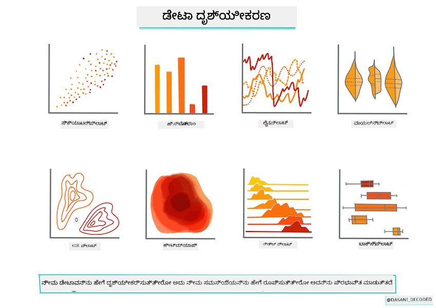
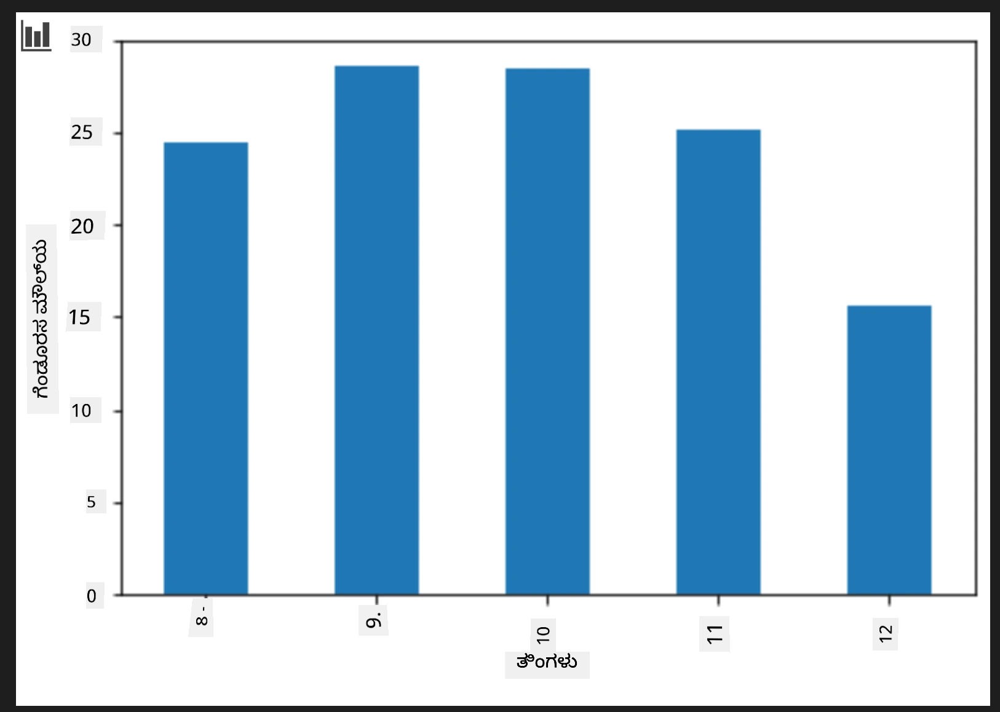
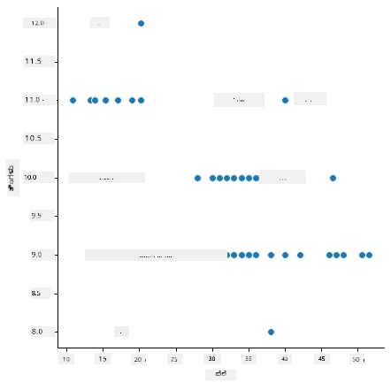
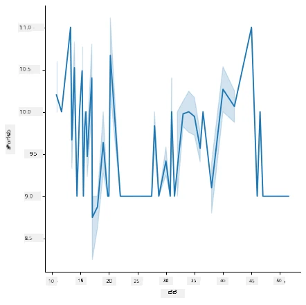
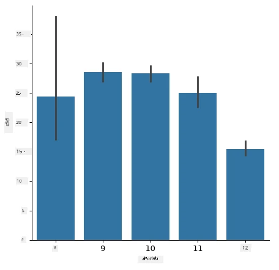
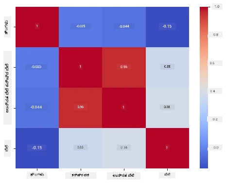

# Scikit-learn ಬಳಸಿ ರೆಗ್ರೆಶನ್ ಮಾದರಿಯನ್ನು ನಿರ್ಮಿಸಿ: ಡೇಟಾ ತಯಾರಿಕೆ ಮತ್ತು ದೃಶ್ಯೀಕರಣ



ಮಾಹಿತಿ ಚಿತ್ರವನ್ನು [ದಾಸನಿ ಮಡಿಪಳ್ಳಿ](https://twitter.com/dasani_decoded) ಹಾಕಿದ್ದಾರೆ

## [ಪೂರ್ವ-ಪಾಠ ಪರೀಕ್ಷೆ](https://ff-quizzes.netlify.app/en/ml/)

> ### [ಈ ಪಾಠ R ನಲ್ಲಿ ಲಭ್ಯವಿದೆ!](../../../../2-Regression/2-Data/solution/R/lesson_2.html)

## ಪರಿಚಯ

ಈಗ ನೀವು Scikit-learn ಬಳಸಿ ಮೆಷಿನ್ ಲರ್ನಿಂಗ್ ಮಾದರಿ ನಿರ್ಮಾಣ ಆರಂಭಿಸಲು ಬೇಕಾದ ಸಾಧನಗಳನ್ನು ಹೊಂದಿದ್ದೀರಿ, ನೀವು ನಿಮ್ಮ ಡೇಟಾ ಬಗ್ಗೆ ಪ್ರಶ್ನೆಗಳನ್ನು ಕೇಳಲು ಸಿದ್ಧರಾಗಿದ್ದೀರಿ. ಡೇಟಾ ಮೇಲೆ ಕೆಲಸ ಮಾಡುತ್ತಾ ಮತ್ತು ಯಂತ್ರ ಅಧ್ಯಯನ ಪರಿಹಾರಗಳನ್ನು ಅನ್ವಯಿಸುತ್ತಾ, ನಿಮ್ಮ ಡೇಟಾಸೆಟ್ ಶಕ್ತಿಗಳನ್ನು ಸರಿಯಾಗಿ ಅನಾವರಣ ಮಾಡುವ ಸರಿಯಾದ ಪ್ರಶ್ನೆಯನ್ನು ಕೇಳುವುದು ಬಹಳ ಮಹತ್ವಪೂರ್ಣವಾಗಿದೆ.

ಈ ಪಾಠದಲ್ಲಿ ನೀವು ಕಲಿಯುವವು:

- ನಿಮ್ಮ ಡೇಟಾವನ್ನು ಮಾದರಿ ನಿರ್ಮಾಣಕ್ಕೆ ಹೇಗೆ ತಯಾರಿಸುವುದು.
- ಡೇಟಾ ದೃಶ್ಯೀಕರಣಕ್ಕೆ Matplotlib ಅನ್ನು ಹೇಗೆ ಬಳಸುವುದು.
- ಹೆಚ್ಚು ಅಭಿವ್ಯಕ್ತಿಯುತ ಡೇಟಾ ದೃಶ್ಯೀಕರಣಕ್ಕೆ Seaborn ಅನ್ನು ಹೇಗೆ ಬಳಸುವುದು.

## ನಿಮ್ಮ ಡೇಟಾದ ಸರಿಯಾದ ಪ್ರಶ್ನೆಯನ್ನು ಕೇಳುವುದು

ನೀವು ಉತ್ತರಿಸಬೇಕಾದ ಪ್ರಶ್ನೆ ಯಾವ ರೀತಿಯ ಯಂತ್ರ ಕಲಿಕಾ ಅಲ್ಗೆಬ್ರಾಂಗಳನ್ನೂ ನೀವು ಬಳಸಬೇಕೋ ಅದು ನಿಶ್ಚಿತಮಾಡುತ್ತದೆ. ಮತ್ತು ನೀವು ಪಡೆಯುವ ಉತ್ತರದ ಗುಣಮಟ್ಟವು ನಿಮ್ಮ ಡೇಟಾ ಸ್ವಭಾವಕ್ಕೆ ಬಹಳ ಅವಲಂಬಿತವಾಗುತ್ತದೆ.

ಈ ಪಾಠದಿಗಾಗಿ ನೀಡಲಾದ [ಡೇಟಾ](https://github.com/microsoft/ML-For-Beginners/blob/main/2-Regression/data/US-pumpkins.csv) ನೋಡಿ. ನೀವು ಈ .csv ಫೈಲ್ ಅನ್ನು VS Code ನಲ್ಲಿ ತೆರೆಯಬಹುದು. ತ್ವರಿತ ಸಂಕ್ಷೇಪಣೆಯಿಂದ ತಕ್ಷಣವೇ ಖಾಲಿ ಸ್ಥಳಗಳು ಮತ್ತು ಸ್ಟ್ರಿಂಗ್ ಮತ್ತು ಸಂಖ್ಯೆಮೂಲಕ ಡೇಟಾದ ಮಿಶ್ರಣವಿದೆ ಎಂದು ಪ್ರತ್ಯಕ್ಷವಾಗುತ್ತದೆ. 'ಪ್ಯಾಕೇಜ್' ಎಂದು ಹೆಸರಿಸಿರುವ ವಿಚಿತ್ರ ಕಾಲಮ್ ಕೂಡ ಇದೆ, ಇದರಲ್ಲಿ ಡೇಟಾ 'ಸಾಕ್ಸ್', 'ಬಿನ್ಸ್' ಮತ್ತು ಇತರ ಮೌಲ್ಯಗಳ ಮಿಶ್ರಣವಾಗಿದೆ. ವಾಸ್ತವವಾಗಿ, ಡೇಟಾ ಸ್ವಲ್ಪ ಗೊಂದಲವಾಗಿವೆ.

[](https://youtu.be/5qGjczWTrDQ "ಯಾಂತ್ರಿಕ ಕಲಿಕೆಯ ಆರಂಭಿಕರಿಗಾಗಿ - ಡೇಟಾಸೆಟ್ ವಿಶ್ಲೇಷಣೆ ಮತ್ತು ಶುದ್ಧೀಕರಣವನ್ನು ಹೇಗೆ ಮಾಡಬೇಕು")

> 🎥 ಈ ಪಾಠಕ್ಕಾಗಿ ಡೇಟಾ ತಯಾರಿಕೆಯ ಮೂಲಕ ಕಾರ್ಯಗತಗೊಳಿಸುವ ಸಂಕ್ಷಿಪ್ತ ವೀಡಿಯೋದಕ್ಕೆ ಮೇಲಿನ ಚಿತ್ರವನ್ನು ಕ್ಲಿಕ್ ಮಾಡಿ.

ವಾಸ್ತವವಾಗಿ, ಪೂರ್ತಿಯಾಗಿ ಸಿದ್ಧವಾದ ಡೇಟಾಸೆಟ್ ಅನ್ನು ಬಾಕ್ಸ್‌ನಿಂದ ಯಂತ್ರ ಕಲಿಕಾ ಮಾದರಿಗಾಗಿ ನೀಡುವುದು ಸಾಮಾನ್ಯವಲ್ಲ. ಈ ಪಾಠದಲ್ಲಿ, ನೀವು ಸ್ಟಾಂಡರ್ಡ್ ಪೈಥನ್ ಗ್ರಂಥಾಲಯಗಳನ್ನು ಬಳಸಿ ಕಚ್ಚಾ ಡೇಟಾಸೆಟ್ ತಯಾರಿಸುವುದನ್ನು ಕಲಿಯುತ್ತೀರಿ. ನೀವು ಡೇಟಾವನ್ನು ದೃಶ್ಯೀಕರಿಸಲು ವಿವಿಧ ತಂತ್ರಗಳನ್ನು ಕಲಿಯುವಿರಿ.

## ಪ್ರಕರಣ ಅಧ್ಯಯನ: 'ಕುಂಬಳಕಾಯಿ ಮಾರುಕಟ್ಟೆ'

ಈ ಫೋಲ್ಡರ್‌ನಲ್ಲಿ, ನೀವು ರೂಟ್ `data` ಫೋಲ್ಡರ್‌ನಲ್ಲಿ [US-pumpkins.csv](https://github.com/microsoft/ML-For-Beginners/blob/main/2-Regression/data/US-pumpkins.csv) ಎಂಬ .csv ಫೈಲ್ ಅನ್ನು ಕಾಣುತ್ತೀರಿ, ಇದು ಕುಮ্বলಕಾಯಿಗಳ ಮಾರುಕಟ್ಟೆಯ ಬಗ್ಗೆ 1757 ಸಾಲುಗಳಿಂದ ಕೂಡಿದ ಡೇಟಾವನ್ನು ಒಳಗೊಂಡಿದೆ, ನಗರಗಳ ಪ್ರಕಾರ ಗುಂಪು ಮಾಡಲಾಗಿದೆ. ಇದು ಯುನೈಟೆಡ್ ಸ್ಟೇಟ್ಸ್ ಡಿಪಾರ್ಟ್‌ಮೆಂಟ್ ಆಫ್ అಗ್ರಿಕಲ್ಚರ್ ಮುಖಾಂತರ ಹಂಚಲಾಗುವ [ಸ್ಪೆಷಲ್ಟಿ ಕ್ರಾಪ್ಸ್ ಟರ್ಮಿನಲ್ ಮಾರುಕಟ್ಟೆಗಳ ಸ್ಟ್ಯಾಂಡರ್ಡ್ ರಿಪೋರ್ಟ್](https://www.marketnews.usda.gov/mnp/fv-report-config-step1?type=termPrice) ನಿಂದ ತೆಗೆಯಲಾದ ಕಚ್ಚಾ ಡೇಟಾ.

### ಡೇಟಾ ತಯಾರಿಕೆ

ಈ ಡೇಟಾ ಸಾರ್ವಜನಿಕ ಡೊಮೇನ್‌ನಲ್ಲಿ ಇದೆ. ಇದು USDA ವೆಬ್ ಸೈಟ್‌ನಿಂದ ಪ್ರತಿ ನಗರಕ್ಕೆ ಪ್ರತ್ಯೇಕ ಕಡತಗಳಲ್ಲಿ ದೊರೆಯಬಹುದು. ಹೆಚ್ಚು ಪ್ರತ್ಯೇಕ ಕಡತಗಳನ್ನು ತಡೆಯಲು, ನಾವು ಎಲ್ಲಾ ನಗರ ಡೇಟಾವನ್ನು ಒಂದೇ ಸ್ಪ್ರೆಡ್‌ಶೀಟ್‌ಗೆ ಏಕೀಕೃತಗೊಳಿಸಿದ್ದೇವೆ, ಹಾಗಾಗಿ ನಾವು ಡೇಟಾವನ್ನು ಸ್ವಲ್ಪ _ತಯಾರಿಸಿದ್ದು_ ಇದೆ. ಇನ್ನು ಮುಂದೆ, ಡೇಟಾವನ್ನು ನಿಕಟವಾಗಿ ನೋಡೋಣ.

### ಕುಮكبಳಾಯಿ ಡೇಟಾ - ಪ್ರಾಥಮಿಕ ತೀರ್ಪುಗಳು

ಈ ಡೇಟಾ ಬಗ್ಗೆ ನೀವು ಏನು ಗಮನಿಸುತ್ತೀರಿ? ನೀವು ಈಗಾಗಲೇ ಸ್ಟ್ರಿಂಗ್, ಸಂಖ್ಯೆ, ಖಾಲಿ ಪ್ರದೇಶಗಳು ಮತ್ತು ವಿಚಿತ್ರ ಮೌಲ್ಯಗಳ ಮಿಶ್ರಣ ಇದೆ ಎಂದು ನೋಡಿದ್ದೀರಿ, ಇದಕ್ಕೆ ಅರ್ಥವನ್ನು ಕೊಡುವ ಅಗತ್ಯವಿದೆ.

ಈ ಡೇಟಾದಲ್ಲಿ Regression ತಂತ್ರವನ್ನು ಬಳಸಿ ನೀವು ಯಾವ ಪ್ರಶ್ನೆ ಕೇಳಬಹುದು? "ನಿರ್ದಿಷ್ಟ ತಿಂಗಳು ವೇಳೆ ಮಾರಾಟವಾಗುವ ಒಂದು ಕುಮಂಬಳಕಾಯಿನ ಬೆಲೆಯನ್ನು ಮುಂಚಿತವಾಗಿ ಊಹಿಸಿ" ಎಂದು ಏನು? ಡೇಟಾವನ್ನು ಮತ್ತೆ ನೋಡಿ, ನೀವು ಕಾರ್ಯಕ್ಕಾಗಿ ಬೇಕಾದ ಡೇಟಾ ರಚನವನ್ನು ಸೃಷ್ಟಿಸಲು ಕೆಲವು ಬದಲಾವಣೆಗಳನ್ನು ಮಾಡಬೇಕಾಗಿದೆ.
## ವ್ಯಾಯಾಮ - ಕುಮಕಳಾಯಿಗಳ ಡೇಟಾವನ್ನು ವಿಶ್ಲೇಷಣೆ ಮಾಡುವುದು

ಡೇಟಾವನ್ನು ರೂಪಿಸಲು ಬಹುಮುಖ ಉಪಕರಣವಾದ [Pandas](https://pandas.pydata.org/) (ಪೈಥಾನ್ ಡೇಟಾ ವಿಶ್ಲೇಷಣೆಯ ಸಂಕ್ಷಿಪ್ತ) ಬಳಸಿಕೊಂಡು ಈ ಕುಮಕಳಾಯಿಗಾಗಿ ಡೇಟಾವನ್ನು ವಿಶ್ಲೇಷಿಸಿ ಮತ್ತು ತಯಾರಿಸೋಣ.

### ಮೊದಲು, ತಪ್ಪಿದ ದಿನಾಂಕಗಳು ಅವರನ್ನು ಪರಿಶೀಲಿಸಿ

ನೀವು ಮೊದಲು ತಪ್ಪಿದ ದಿನಾಂಕಗಳಿಗಾಗಿ ಪರಿಶೀಲನೆಗೆ ಕ್ರಮಗಳನ್ನು ತೆಗೆದುಕೊಳ್ಳಬೇಕು:

1. ದಿನಾಂಕಗಳನ್ನು ತಿಂಗಳ ಸ್ವರೂಪಕ್ಕೆ ಪರಿವರ್ತಿಸಿ (ಇವು US ದಿನಾಂಕಗಳು, ಆದ್ದರಿಂದ ಸ್ವರೂಪ `MM/DD/YYYY` ಆಗಿದೆ).
2. ತಿಂಗಳ ಮೌಲ್ಯವನ್ನು ಹೊಸ ಕಾಲಮ್‌ಗೆ ಪಡೆಯಿರಿ.

Visual Studio Code ನಲ್ಲಿ _notebook.ipynb_ ಫೈಲ್ ತೆರೆಯಿರಿ ಮತ್ತು ಸ್ಪ್ರೆಡ್‌ಶೀಟ್ ಅನ್ನು ಹೊಸ Pandas ಡೇಟಾ‌ಫ್ರೇಮ್‌ಗೆ ಆಮದುಮಾಡಿ.

1. ಮೊದಲ ಐದು ಸಾಲುಗಳನ್ನು ನೋಡಲು `head()` ಫಂಕ್ಷನ್ ಅನ್ನು ಬಳಸಿ.

    ```python
    import pandas as pd
    pumpkins = pd.read_csv('../data/US-pumpkins.csv')
    pumpkins.head()
    ```

    ✅ ಕೊನೆಯ ಐದು ಸಾಲುಗಳನ್ನು ನೋಡಲು ಯಾವ ಫಂಕ್ಷನ್ ಬಳಸುತ್ತೀರಾ?

1. ಪ್ರಸ್ತುತ ಡೇಟಾ‌ಫ್ರೇಮ್‌ನಲ್ಲಿ ತಪ್ಪಿದ ಡೇಟಾ ಇದೆಯೆಂದು ಪರಿಶೀಲಿಸಿ:

    ```python
    pumpkins.isnull().sum()
    ```

    ತಪ್ಪಿದ ಡೇಟಾ ಇದೆ, ಆದರೆ ಕೇಂದ್ರ ಕಾರ್ಯಕ್ಕೆ ಅದು ಬಹಳ ಪ್ರಭಾವ ಬೀರುವುದಿಲ್ಲ ಎಂದು ಅನಿಸಬಹುದು.

1. ನಿಮ್ಮ ಡೇಟಾ‌ಫ್ರೇಮ್ ಅನ್ನು ಸುಲಭವಾಗಿ ಕೆಲಸ ಮಾಡಿಸಲು, ನೀವು ಬೇಕಾದ ಕಾಲಮ್ಗಳನ್ನು ಮಾತ್ರ ಆಯ್ಕೆಮಾಡಿ, `loc` ಫಂಕ್ಷನ್ ಉಪಯೋಗಿಸಿ ಅದು ಮೂಲ ಡೇಟಾ‌ಫ್ರೇಮ್‌ನಿಂದ ಸಾಲುಗಳ (ಮೊದಲ ಪರಿಮಾಣ) ಮತ್ತು ಕಾಲಮ್ಗಳ (ಎರಡನೇ ಪರಿಮಾಣ) ಗುಂಪನ್ನು ತೆಗೆಯುತ್ತದೆ. ಕೆಳಗಿನ ಉದಾಹರಣೆಯಲ್ಲಿ `:` ಅಂದ್ರೆ "ಎಲ್ಲಾ ಸಾಲುಗಳು".

    ```python
    columns_to_select = ['Package', 'Low Price', 'High Price', 'Date']
    pumpkins = pumpkins.loc[:, columns_to_select]
    ```

### ಎರಡನೆದು, ಕುಮumbledಾಯಿಯ ಸರಾಸರಿ ಬೆಲೆಯನ್ನು ನಿರ್ಧರಿಸಿ

ನಿರ್ದಿಷ್ಟ ತಿಂಗಳಲ್ಲಿ ಒಂದು ಕುಮumbledಾಯಿಯ ಸರಾಸರಿ ಬೆಲೆಯನ್ನು ಹೇಗೆ ನಿರ್ಧರಿಸುವುದು ಎಂದು ಯೋಚಿಸಿ. ಈ ಕಾರ್ಯಕ್ಕಾಗಿ ಯಾವ ಕಾಲಮ್‌ಗಳನ್ನು ನೀವು ಆಯ್ಕೆಮಾಡುತ್ತೀರಾ? ಸೂಚನೆ: ನಿಮಗೆ 3 ಕಾಲಮ್‌ಗಳು ಬೇಕಾಗಬಹುದು.

ಪರಿಹಾರ: ಹೊಸ Price ಕಾಲಮ್ ಭರ್ತಿಗೆ `Low Price` ಮತ್ತು `High Price` ಕಾಲಮ್‌ಗಳ ಸರಾಸರಿ ತೆಗೆದುಕೊಳ್ಳಿ, ಮತ್ತು Date ಕಾಲಮ್ ಕೇವಲ ತಿಂಗಳು ಮಾತ್ರ ತೋರಿಸ도록 ಪರಿವರ್ತಿಸಿ. ಮೇಲಿನ ಪರಿಶೀಲನೆಯ ಪ್ರಕಾರ, ದಿನಾಂಕಗಳು ಅಥವಾ ಬೆಲೆಗಳಿಗೆ ತಪ್ಪಿದ ಡೇಟಾ ಇಲ್ಲ.

1. ಸರಾಸರಿ ಲೆಕ್ಕಿಸಲು ಕೆಳಗಿನ ಕೋಡ್ ಸೇರಿಸಿ:

    ```python
    price = (pumpkins['Low Price'] + pumpkins['High Price']) / 2

    month = pd.DatetimeIndex(pumpkins['Date']).month

    ```

   ✅ ನೀವು ಪರಿಶೀಲಿಸಲು ಬಯಸುವ ಯಾವುದೇ ಡೇಟಾವನ್ನು `print(month)` ಮೂಲಕ ಮುದ್ರಣ ಮಾಡಬಹುದು.

2. ಈಗ, ನಿಮ್ಮ ಪರಿವರ್ತಿತ ಡೇಟಾವನ್ನು ಹೊಸ Pandas ಡೇಟಾ‌ಫ್ರೇಮ್‌ಗೆ ನಕಲಿಸಿ:

    ```python
    new_pumpkins = pd.DataFrame({'Month': month, 'Package': pumpkins['Package'], 'Low Price': pumpkins['Low Price'],'High Price': pumpkins['High Price'], 'Price': price})
    ```

    ನಿಮ್ಮ ಡೇಟಾ‌ಫ್ರೇಮ್ ಮುದ್ರಣ ಮಾಡಿದರೆ, ನೀವು ನಿರ್ಮಿಸಲು ಬಯಸುವ ಹೊಸ ರೆಗ್ರೆಶನ್ ಮಾದರಿಗಾಗಿ ಸ್ವಚ್ಛ ಮತ್ತು ನಿಖರವಾದ ಡೇಟಾ ಸೆಟ್ ಕಾಣಬಹುದು.

### ಆದರೆ ಕಾಯಿರಿ! ಇಲ್ಲಿ ಒಂದು ವಿಚಿತ್ರ ಸಂಗತಿ ಇದೆ

ನೀವು `Package` ಕಾಲಮ್ ನೋಡಿದರೆ, ಕುಮumbledಾಯಿಗಳನ್ನು ಹಲವಾರು ವಿಭಿನ್ನ ಸಂಯೋಜನೆಗಳಲ್ಲಿ ಮಾರಾಟ ಮಾಡಲಾಗುತ್ತದೆ. ಕೆಲವು '1 1/9 ಬಷೆಲ್' ಅಳತೆಗಳಲ್ಲಿ, ಕೆಲವು '1/2 ಬಷೆಲ್' ಅಳತೆಗಳಲ್ಲಿ, ಕೆಲವು ಪ್ರತಿ ಕುಮumbledಾಯಿ, ಕೆಲವು ಪ್ರತಿ ಪೌಂಡ್, ಮತ್ತು ಕೆಲವು ಬದಲಾಗುವ ಅಗಲದ ದೊಡ್ಡ ಬಾಕ್ಸ್‌ಗಳಲ್ಲಿ ಮಾರಲಾಗುತ್ತವೆ.

> ಕುಮmbledಾಯಿಗಳನ್ನು ಸಮಾನವಾಗಿ ತೂಕ ಹಾಕುವುದು ಬಹಳ ಕಠಿಣವಾಗಿದೆ

ಮೂಲ ಡೇಟಾದಲ್ಲಿ, `Unit of Sale` 'EACH' ಅಥವಾ 'PER BIN' ಆಗಿದ್ದರೆ ಹಾಗೂ `Package` ಪ್ರಕಾರ ಇಂಚಿನ, ಬಿನ್ ಅಥವಾ 'ಪ್ರತಿ' ಎಂಬುದಾಗಿ ಇರುವುದು ಆಸಕ್ತಿದಾಯಕ. ಕುಮmbledಾಯಿಗಳನ್ನು ಸಮಾನವಾಗಿ ತೂಕ ಹಾಕುವುದು ಬಹಳ ಕಷ್ಟ, ಆದ್ದರಿಂದ `Package` ಕಾಲಮ್‌ನಲ್ಲಿ 'bushel' ಸ್ಟ್ರಿಂಗ್ ಇರುವ ಕುಮmbledಾಯಿಗಳನ್ನು ಮಾತ್ರ ಆಯ್ಕೆ ಮಾಡಿ ಫಿಲ್ಟರ್ ಮಾಡೋಣ.

1. ಪ್ರಾರಂಭದಲ್ಲಿ .csv ಆಮದುಮಾಡಿದ ಕೆಳಗೆ ಫೈಲ್ ಮೊದಲ ಭಾಗದಲ್ಲಿ ಫಿಲ್ಟರ್ ಸೇರಿಸಿ:

    ```python
    pumpkins = pumpkins[pumpkins['Package'].str.contains('bushel', case=True, regex=True)]
    ```

    ಈಗ ನೀವು ಡೇಟಾ ಮುದ್ರಣ ಮಾಡಿದರೆ, ನೀವು ಫಿಲ್ಟರ್ ಮೂಲಕ ಸುಮಾರು 415 ಸಾಲುಗಳ ಕುಮumbledಾಯಿಗಳೇ ಕೇವಲ ಪಡೆಯುತ್ತೀರಿ.

### ಆದರೆ ಕಾಯಿರಿ! ಇನ್ನೂ ಒಂದು ಕಾರ್ಯವಿದೆ

ನೀವು ಗಮನಿಸಿದ್ದೀರಾ ಬಷೆಲ್ ಪ್ರಮಾಣ ಪ್ರತಿ ಸಾಲಿನಲ್ಲಿ ಬದಲಾಗುತ್ತಿದೆ? ಬೆಲೆಗಳನ್ನು ಬಷೆಲ್ ಪ್ರತಿ ತೋರಿಸುವಂತೆ ಸಮಮಾರೀಕರಿಸಲು, ಅದರ ಪ್ರಕಾರ ಗಣಿತ ಮಾಡಿ ಸರಳಗೊಳಿಸಬೇಕು.

1. ಹೊಸ `new_pumpkins` ಡೇಟಾ‌ಫ್ರೇಮ್ ನಿರ್ಮಾಣ ಭಾಗದ ನಂತರ ಈ ಸಾಲುಗಳನ್ನು ಸೇರಿಸಿ:

    ```python
    new_pumpkins.loc[new_pumpkins['Package'].str.contains('1 1/9'), 'Price'] = price/(1 + 1/9)

    new_pumpkins.loc[new_pumpkins['Package'].str.contains('1/2'), 'Price'] = price/(1/2)
    ```

✅ [The Spruce Eats](https://www.thespruceeats.com/how-much-is-a-bushel-1389308) ಪ್ರಕಾರ, ಬಷೆಲ್ ತೂಕವು ಉತ್ಪನ್ನ ಪ್ರಕಾರಕ್ಕೆ ಅನುಸಾರವಾಗಿದೆ ಏಕೆಂದರೆ ಅದು ಘನಮಾನ ಮಾಪನವಾಗಿದೆ. "ಉದಾಹರಣೆಗೆ, ಟೊಮೇಟೊ ಬಷೆಲ್ 56 ಪೌಂಡ್ ತೂಕ ಹೊಂದಿದೆ... ಅರಕಲೆ ಮತ್ತು ಹಸಿರುಗಳು ಕಡಿಮೆ ತೂಕದೊಂದಿಗೆ ಹೆಚ್ಚು ಸ್ಥಳವನ್ನು ಹಿಡಿದಿರುತ್ತವೆ, ಆದ್ದರಿಂದ ಸೊಪ್ಪಿನ ಬಷೆಲ್ ಕೇವಲ 20 ಪೌಂಡ್ ಇದೆ." ಇದು ಕೆಟ್ಟ ರೀತಿಯಲ್ಲಿ ಸಂಘಟಿತವಾಗಿದೆ! ಬಷೆಲ್ ನಿಂದ ಪೌಂಡ್ಸ್ ಗೆ ಪರಿವರ್ತನೆ ಮಾಡುವುದಕ್ಕೆ ಯತ್ನಿಸಬೇಡಿ, ಬದಲಾಗಿ ಬಷೆಲ್ ಪ್ರಕಾರ ಬೆಲೆ ನಿರ್ಧರಿಸಿ.ukumumbledಾಯಿಗಳ ಬಷೆಲ್ ಅಧ್ಯಯನವು ನಿಮ್ಮ ಡೇಟಾ ಸ್ವಭಾವವನ್ನು ತಿಳಿದುಕೊಂಡು ಹೆಚ್ಚಾಗಿ ಮಹತ್ವವನ್ನು ಪ್ರತಿಪಾದಿಸುತ್ತದೆ!

ಈಗ, ನಿಮ್ಮ ಸಮಾಜೀಕೃತ ಬಷೆಲ್ ಅಳತೆ ಆಧಾರದ ಮೇಲೆ ಪ್ರತಿ ಘಟಕದ ಬೆಲೆಯನ್ನು ವಿಶ್ಲೇಷಿಸಬಹುದು. ನೀವು ಡೇಟಾವನ್ನು ಮತ್ತೊಮ್ಮೆ ಮುದ್ರಣ ಮಾಡಿದರೆ, ಅವು ಹೇಗಿದ್ದಾಳೆ ಎಂಬುದನ್ನು ಚಿತ್ರಿಸಬಹುದು.

✅ ನೀವು ಗಮನಿಸಿದ್ದೀರಾ ಅರ್ಧ-ಬಷೆಲ್ ಮೂಲಕ ಮಾರಾಟವಾಗುವ ಕುಮumbledಾಯಿಗಳು ಬಹಳ ದುಬಾರಿ? ಏಕೆಂದು ಕಾಣಿಸುತ್ತಿದೆ? ಸೂಚನೆ: ಸಣ್ಣ ಕುಮumbledಾಯಿಗಳು ದೊಡ್ಡವಕ್ಕಿಂತ ಹೆಚ್ಚು ಬೆಲೆಯಿದ್ದ್ದುವೇ, ಬಹುಶಃ ಒಂದು ದೊಡ್ಡ ಹೊಲುಗೆ ಕುಂಭಳಕಾಯಿಯ ತುಂಬಾ ಅನ್ವಯಿಸದ ಸ್ಥಾನದಿಂದಾಗಿ ಪ್ರತಿ ಬಷೆಲ್ ಹೆಚ್ಚು ಸಣ್ಣಗಳು ಇರುತ್ತವೆ.

## ದೃಶ್ಯೀಕರಣ ತಂತ್ರಗಳು

ಡೇಟಾ ವಿಜ್ಞಾನಿಯ ಪಾತ್ರದ ಒಂದು ಭಾಗವು ಅವರು ಕೆಲಸ ಮಾಡುವ ಡೇಟಾದ ಗುಣಮಟ್ಟ ಮತ್ತು ಸ್ವಭಾವವನ್ನು ಪ್ರದರ್ಶಿಸುವದು. ಇದಕ್ಕಾಗಿ, ಅವರು ಬಗೆಬಗೆಯ ದೃಶ್ಯೀಕರಣಗಳನ್ನು, ಅಥವಾ ಪ್ಲಾಟ್, ಗ್ರಾಫ್ ಮತ್ತು ಚಾರ್ಟ್‌ಗಳನ್ನು ಸೃಷ್ಟಿಸುತ್ತಾರೆ, ಡೇಟಾದ ವಿವಿಧ ಮೂಲಭೂತ ಅಂಶಗಳನ್ನು ತೋರಿಸುವದು. ಈ ಮೂಲಕ ಅವರು ದೃಶ್ಯಾತ್ಮಕವಾಗಿ ಸಂಬಂಧಗಳು ಮತ್ತು ಲೋಪಗಳನ್ನು ತೋರಿಸಲು ಸಾಧ್ಯವಾಗುತ್ತದೆ.

[](https://youtu.be/SbUkxH6IJo0 "ಯಾಂತ್ರಿಕ ಕಲಿಕೆಯ ಆರಂಭಿಕರಿಗಾಗಿ - Matplotlib ಬಳಸಿ ಡೇಟಾ ದೃಶ್ಯೀಕರಣ")

> 🎥 ಈ ಪಾಠದ ಡೇಟಾವನ್ನು ದೃಶ್ಯೀಕರಿಸುವ ಸಂಕ್ಷಿಪ್ತ ವೀಡಿಯೋದಕ್ಕೆ ಮೇಲಿನ ಚಿತ್ರವನ್ನು ಕ್ಲಿಕ್ ಮಾಡಿ.

ದೃಶ್ಯೀಕರಣಗಳು ಡೇಟಾ ಪ್ರಕಾರಕ್ಕೆ ಅನುಗುಣವಾದ ಯಂತ್ರ ಕಲಿಕೆಯ ತಂತ್ರವನ್ನು ನಿರ್ಧರಿಸಲು ಸಹಾಯ ಮಾಡಬಹುದು. ಉದಾಹರಣೆಗೆ, ರೇಖೆಯನ್ನು ಅನುಸರಿಸುವಂತೆ Scatterplot ಇದ್ದರೆ, ಡೇಟಾ ಲೀನಿಯರ್ ರೆಗ್ರೆಶನ್ ಅಭ್ಯಾಸಕ್ಕೆ ಉತ್ತಮ ಅಭ್ಯರ್ಥಿ ಎಂದು ಸೂಚಿಸುತ್ತದೆ.

ಜ್ಯೂಪಿಟರ್ ನೋಟ್ಬುಕ್‌ಗಳಲ್ಲಿ ಉತ್ತಮವಾಗಿ ಕೆಲಸ ಮಾಡುವ ಒಂದು ಡೇಟಾ ದೃಶ್ಯೀಕರಣ ಗ್ರಂಥಾಲಯ [Matplotlib](https://matplotlib.org/) (ಹಿಂದಿನ ಪಾಠದಲ್ಲಿಯೂ ನೀವು ನೋಡಿ) ಆಗಿದೆ.

> ಡೇಟಾ ದೃಶ್ಯೀಕರಣದಲ್ಲಿ ಹೆಚ್ಚಿನ ಅನುಭವ ಪಡೆಯಲು [ಈ ತರಬೇತಿಭಾಗಗಳನ್ನು](https://docs.microsoft.com/learn/modules/explore-analyze-data-with-python?WT.mc_id=academic-77952-leestott) ನೋಡಿರಿ.

## ವ್ಯಾಯಾಮ - Matplotlib ತಂಡದಲ್ಲಿ ಪ್ರಯೋಗ

ನೀವುเพ ಉತ್ಪಾದಿಸಿದ ಹೊಸ ಡೇಟಾ‌ಫ್ರೇಮ್ ಪ್ರದರ್ಶಿಸಲು ಕೆಲವು ಮೂಲ ಪ್ಲಾಟ್ ರಚಿಸಲು ಪ್ರಯತ್ನಿಸಿ. ಮೂಲ ರೇಖಾ ಪ್ಲಾಟ್ ಯಾವುದನ್ನು ತೋರಿಸುತ್ತದೆ?

1. ಫೈಲ್ ಮೇಲ್ಭಾಗದಲ್ಲಿ, Pandas ಆಮದುಮಾಡಿದ ತಲೆಯಡಿಯಲ್ಲಿ Matplotlib import ಮಾಡಿ:

    ```python
    import matplotlib.pyplot as plt
    ```

1. ಸಂಪೂರ್ಣ ನೋಟ್ಬುಕ್ ಮರುಚಲಾಯಿಸಿ.
1. ನೋಟ್ಬುಕ್ ಕೆಳಭಾಗದಲ್ಲಿ, ಡೇಟಾವನ್ನು ಬಾಕ್ಸ್ ಆಗಿ ಪ್ಲಾಟ್ ಮಾಡಲು ಸೆಲ್ ಸೇರಿಸಿ:

    ```python
    price = new_pumpkins.Price
    month = new_pumpkins.Month
    plt.scatter(price, month)
    plt.show()
    ```

    

    ಇದು ಉಪಯುಕ್ತವಾದ ಪ್ಲಾಟ್ ಇದೆಯೆ? ಇದರಿಂದ ಏನಾದರೂ ಆಶ್ಚರ್ಯವಾಯಿತು?

    ಇದು ವಿಶೇಷ ಉಪಯುಕ್ತವಲ್ಲ, ಏಕೆಂದರೆ ಇದು ನಿಮ್ಮ ಡೇಟಾವನ್ನು ತಿಂಗಳಿಗೆ ಬಿಂದುಗಳ ರೂಪದಲ್ಲಿ ತೋರಿಸುವಷ್ಟೇ ಮಾಡುತ್ತದೆ.

### ಉಪಯುಕ್ತವಾಗಿಸಿ

ಉಪಯುಕ್ತ ಡೇಟಾವನ್ನು ತೋರಿಸಲು, நீங்கள் ಸಾಮಾನ್ಯವಾಗಿ ಡೇಟಾವನ್ನು ಗುಂಪು ಮಾಡಬೇಕಾಗುತ್ತದೆ. ತಿಂಗಳುಗಳು y ಅಕ್ಷದಲ್ಲಿ ತೋರಿಸುವ ಮತ್ತು ಡೇಟಾ ವಿತರಣೆ ತೋರಿಸುವ ಗುಂಪುಮಾಡಲಾದ ಬಾರ್ ಚಾರ್ಟ್ ಸೃಷ್ಟಿಸಿ ಪ್ರಯತ್ನಿಸೋಣ.

1. ಗುಂಪು ಮಾಡಿದ ಬಾರ್ ಚಾರ್ಟ್ ಸೃಷ್ಟಿಸಲು ಸೆಲ್ ಸೇರಿಸಿ:

    ```python
    new_pumpkins.groupby(['Month'])['Price'].mean().plot(kind='bar')
    plt.ylabel("Pumpkin Price")
    ```

    

    ಇದು ಹೆಚ್ಚು ಉಪಯುಕ್ತ ಡೇಟಾ ದೃಶ್ಯೀಕರಣವಾಗಿದೆ! ಇದು সেপ্টೆಂಬರ್ ಮತ್ತು ಅಕ್ಟೋಬರ್‌ ತಿಂಗಳಲ್ಲಿ ಕುಮumbledಾಯಿಗಳ ಗರಿಷ್ಠ ಬೆಲೆ ಇರುತ್ತದೆ ಎಂದು ಸೂಚಿಸುತ್ತದೆ. ಇದು ನಿಮ್ಮ ನಿರೀಕ್ಷೆಯನ್ನು ಪೂರೈಸುತ್ತದೆಯೆ? ಏಕೆ ಅಥವಾ ಪ್ರಯೋಜನವಿಲ್ಲವೇ?

## ವ್ಯಾಯಾಮ - Seaborn ಬಳಸಿ ಪ್ರಯೋಗ

Matplotlib ಶಕ್ತಿಯುತವಾಗಿದೆ, ಆದರೆ ಉತ್ತಮ ಸ್ವರೂಪದ ಚಾರ್ಟ್ ಉತ್ಪಾದಿಸಲು ನೂರಾರು ಸಾಲುಗಳ ಕೋಡ್ ಬೇಕಾಗಬಹುದು. [Seaborn](https://seaborn.pydata.org/) Matplotlib ಮٿ್ಭಾಗದಲ್ಲಿ ನಿರ್ಮಿಸಿರುವ ಗ್ರಂಥಾಲಯ, ಇದು ಸಾಂಖ್ಯಿಕ ಡೇಟಾ ದೃಶ್ಯೀಕರಣಕ್ಕಾಗಿ ವಿನ್ಯಾಸಗೊಳಿಸಲಾಗಿದೆ. ಇದು ನೇರವಾಗಿ Pandas ಡೇಟಾ‌ಫ್ರೇಮ್‌ಗಳ ಜೊತೆಗೆ ಕೆಲಸ ಮಾಡುತ್ತದೆ, ಆಕರ್ಷಕ ಡೀಫಾಲ್ಟ್ ಶೈಲಿಗಳನ್ನು ಅನ್ವಯಿಸುತ್ತದೆ ಮತ್ತು ಕಡಿಮೆ ಕೋಡ್‌ನಲ್ಲಿ ಮಾಹಿತಿ ಫಲಕಗಳನ್ನು ರಚಿಸಲು ಸಹಾಯ ಮಾಡುತ್ತದೆ. Seaborn Matplotlib ವಸ್ತುಗಳನ್ನು ಹಿಂತಿರುಗಿಸುವುದರಿಂದ, Matplotlib ಬಗ್ಗೆ ನೀವು ಈಗಾಗಲೇ ತಿಳಿದುಕೊಂಡಿರುವುದನ್ನು ಬಳಸಿ ಫಲಿತಾಂಶವನ್ನು ನಿರ್ವಹಿಸಬಹುದು.

> ನೀವು ಇನ್ಸ್ಟಾಲ್ ಮಾಡದಿದ್ದರೆ, `pip install seaborn` ಬಳಸಿ Seaborn ಅನ್ನು ಸ್ಥಾಪಿಸಿರಿ.

1. ನೋಟ್ಬುಕ್ ಮೇಲ್ಭಾಗದಲ್ಲಿ, ಇತರ ಆಮದುಗಳ ಕೆಳಗೆ Seaborn import ಮಾಡಿ. ಸಾಂಪ್ರದಾಯಿಕವಾಗಿ `sns` ಎಂದು import ಮಾಡಲಾಗುತ್ತದೆ:

    ```python
    import seaborn as sns
    ```

### ಸಂಬಂಧಗಳನ್ನು ತೋರಿಸಲು Scatter ಪ್ಲಾಟ್‌ಗಳು

ಮಾದರಿ ನಿರ್ಮಿಸಲು ಡೇಟಾ ಅನ್ವೇಷಣೆಯ ದೊಡ್ಡ ಭಾಗವು ಚರಪರಿಮಾಣಗಳ ನಡುವಿನ _ಸಂಬಂಧಗಳನ್ನು_ ಹುಡುಕುವುದು. [Scatter ಪ್ಲಾಟ್](https://en.wikipedia.org/wiki/Scatter_plot) ಅತ್ಯುತ್ತಮ ಸಾಧನಗಳಲ್ಲಿ ಒಂದು: ಬಿಂದುಗಳು ಒಂದು ರೇಖೆಯನ್ನು ಅನುಸರಿಸಿದರೆ, ಎರಡು ಚರಪರಿಮಾಣಗಳ ನಡುವಿನ ಸಂಬಂಧವಿರಬಹುದು, ಇದು ಲೀನಿಯರ್ ರೆಗ್ರೆಶನ್ ಮಾದರಿಯನ್ನು ಕಾರ್ಯಗತಗೊಳಿಸಲು ಒಳ್ಳೆಯ ಸೂಚನೆ.

1. ಹಿಂದಿನ ಬೆಲೆ-ಮಾಸ Scatter ಪ್ಲಾಟ್ ಅನ್ನು Seaborn's [`relplot()`](https://seaborn.pydata.org/generated/seaborn.relplot.html) ಬಳಸಿ ಮರುರಚಿಸಿ. ಇದು ನೇರವಾಗಿ ನಿಮ್ಮ ಡೇಟಾಫ್ರೇಮ್ ಕಾಲಮ್‌ಗಳ ಜೊತೆಗೆ ಕೆಲಸ ಮಾಡುತ್ತದೆ:

    ```python
    sns.relplot(x="Price", y="Month", data=new_pumpkins)
    ```

    

    ನೀವು ಹೇಗೆ ಕಾಲಮ್ ಹೆಸರುಗಳನ್ನು ಮತ್ತು ಡೇಟಾಫ್ರೇಮ್ ಅನ್ನು ಪಾಸ್ ಮಾಡುತ್ತೀರಿ ಮತ್ತು Seaborn ಅಕ್ಷಲಾಕಾಂಶದ ಲೇಬಲ್ಗಳನ್ನು ಸಂಭಾಳಿಸುತ್ತದೆ ಎಂದು ಗಮನಿಸಿ.

2. `kind="line"` ಪ್ಯಾರಾಮೀಟರ್ ಪಾಸ್ ಮಾಡುವ ಮೂಲಕ ನೀವು ಲೈನ್ ಪ್ಲಾಟ್‌ಗೆ ಬದಲಿಸಬಹುದು. Seaborn ರೇಖೆಯ ಸುತ್ತಲೂ ವಿಶ್ವಾಸ ಅಂತರವನ್ನು ತೋರಿಸುವ ಛಾಯಿತೆ Band ಅನ್ನು ಕೂಡ ರೇಖಿಸುತ್ತದೆ:

    ```python
    sns.relplot(x="Price", y="Month", kind="line", data=new_pumpkins)
    ```

    

    ಈ ವಿಶೇಷ ಡೇಟಾ ತುಂಬಾ ಗದ್ದಲವಾಗಿದೆ, ಆದ್ದರಿಂದ ಲೈನ್ ಪ್ಲಾಟ್ ಸ್ಪಷ್ಟವಾದ ಆಯ್ಕೆ ಅಲ್ಲ — ಆದರೆ ಇದರಿಂದ ನೀವು Seaborn ನಲ್ಲಿ ಚಾರ್ಟ್ ಗತಿಗಳನ್ನು ಎಷ್ಟು ಸುಲಭವಾಗಿ ಬದಲಾಯಿಸಬಹುದು ಎಂದು ತೋರಿಸುತ್ತದೆ.

### ವಿತರಣೆ ತೋರಿಸಲು ಬಾರ್ ಚಾರ್ಟ್‌ಗಳು


ಮೊದಲು ನೀವು ಮ್ಯಾಟ್ಪ್ಲಾಟ್‌ಲಿಬ್ ಬಳಸಿ ಕೈಯಿಂದ ಡೇಟಾವನ್ನು ಗುಂಪು ಮಾಡಿಕೊಂಡು ಬಾರ್ ಚಾರ್ಟ್ ಸೃಷ್ಠಿಸಿದ್ದಿರಿ. ಸೀಬೋನ್‌ನ [`catplot()`](https://seaborn.pydata.org/generated/seaborn.catplot.html) (ಶ್ರೇಣೀಬದ್ಧ ಚಾರ್ಟ್) ನಿಮಗಾಗಿ ಗುಂಪುಮಾಡುವ ಮತ್ತು ಸಂಗ್ರಹಿಸುವ ಕಾರ್ಯವನ್ನು ಮಾಡಬಲ್ಲದು. ಡೀಫಾಲ್ಟ್ ಆಗಿ `kind="bar"` ಪ್ರತಿ ವರ್ಗದ ಸರಾಸರಿ ಹಾಗೂ ನಂಬಿಕೆ ಅವಧಿಯನ್ನು ಸೂಚಿಸುವ ಕಪ್ಪು ಹಂತವನ್ನು ತೋರಿಸುತ್ತದೆ.

1. ಪ್ರತಿ ತಿಂಗಳ ಸರಾಸರಿ ಬೆಲೆಯ ಬಾರ್ ಚಾರ್ಟ್ ಸೃಷ್ಟಿಸಿ:

    ```python
    sns.catplot(x="Month", y="Price", data=new_pumpkins, kind="bar")
    ```

    

    ಇದರಿಂದ ನೀವು ಮ್ಯಾಟ್ಪ್ಲಾಟ್‌ಲಿಬ್ ನಲ್ಲಿ ನೋಡಿದದ್ದೇ ಖಚಿತವಾಗುತ್ತದೆ — ಬೆಲೆಗಳು ಸೆಪ್ಟೆಂಬರ್ ಮತ್ತು ಅಕ್ಟೋಬರ್ ನಲ್ಲಿ ಶಿಖರ ಪ್ರವೇಶಿಸುತ್ತವೆ — ಆದರೆ ಸೀಬೋನ್ ಪ್ರತಿ ತಿಂಗಳು ಒಳಗಿನ ಬೆಲೆ ಏನೆಷ್ಟಾಗಿ _ಬದಲಾಗುತ್ತದೆ_ ಎಂಬುದನ್ನೂ ದೃಶ್ಯಾವಧಾ ಮಾಡುತ್ತದೆ.

### ಹೀಟ್ಮ್ಯಾಪ್ ಮೂಲಕ ವಿಷಯಗಳ ಸಂಬಂಧ ತೋರಿಸುವುದು

ಸ್ಕ್ಯಾಟರ್ ಪ್ಲಾಟ್‌ಗಳು ಎರಡು ಚರಗಳನ್ನು ಹೊಂದುತ್ತವೆ. ನೀವು ಹಲವು ಸಂಖ್ಯಾತ್ಮಕ ಕಾಲಮ್‌ಗಳು ಇದ್ದಾಗ, [ಹೀಟ್ಮ್ಯಾಪ್](https://en.wikipedia.org/wiki/Heat_map) ಪ್ರತಿ ಕಾಲಮ್ ಜೋಡಿಗಳ ಸಂಬಂಧದ ಬಲವನ್ನು ಒಟ್ಟಿಗೆ ನೋಡುವುದಕ್ಕೆ ಸಹಾಯ ಮಾಡುತ್ತದೆ. ಇದು ಯಾವುದೇ ಮಾದರಿಯಲ್ಲಿ ಯಾವ ಲಕ್ಷಣಗಳು ಹೆಚ್ಚು ಸಂಬಂಧಿತವೋ、それೆಯಾದ ಮೇಲೆ ಆಯ್ಕೆಮಾಡುವುದು ಎಂದು ಕಾಣಿಸಲು ಸಾಮಾನ್ಯ ವಿಧಾನವಾಗಿದೆ (ಮತ್ತು ಮುಂದಿನಂತ classification ನಲ್ಲಿ ಗೊಂದಲ ಮ್ಯಾಟ್‌ರಿಕ್ಸ್ ತೋರಿಸಲು ಇದೇ ರೀತಿಯ ಚಾರ್ಟ್ ಬಳಸಲಾಗುತ್ತದೆ).

1. ಪಾಂಡಾಸ್ ಬಳಸಿ ಸಂಬಂಧ ಮ್ಯಾಟ್ರಿಕ್ಸ್ ರಚಿಸಿ, ನಂತರ ಸೀಬೋನ್‌ನ [`heatmap()`](https://seaborn.pydata.org/generated/seaborn.heatmap.html) ಬಳಸಿ ಅದನ್ನು ಚಿತ್ರಿಸಿ. `annot=True` ಆಯ್ಕೆಯು ಪ್ರತಿ ಸೆಲ್ ಮೇಲೆ ಸಂಬಂಧ ಮೌಲ್ಯಗಳನ್ನು ಮುದ್ರಿಸುತ್ತದೆ:

    ```python
    correlations = new_pumpkins[['Month', 'Low Price', 'High Price', 'Price']].corr()
    sns.heatmap(correlations, annot=True, cmap="coolwarm")
    ```

    

    `1` (ಅಥವಾ `-1`) ಗೆ ತುಂಬಾ ಹತ್ತಿರದ ಮೌಲ್ಯಗಳು ಕಾಲಮ್‌ಗಳು ಬಲವಾಗಿ _ಸರಳರೇಖಿಕವಾಗಿ_ ಸಂಬಂಧಿತವಿರುವುದನ್ನು ಸೂಚಿಸುತ್ತವೆ. `Low Price` ಮತ್ತು `High Price` ಬಹಳಷ್ಟು ಸಮನಾಗಿ ಸಂಬಂಧಿತವೆಂದು ಗಮನಿಸಿ. ಇದಕ್ಕೆ ವಿರುದ್ಧವಾಗಿ, `Month` ಬೆಲೆಯೊಂದಿಗೆ ಬಹುಷ್ಟು ದುರ್ಬಲ ಸರಳರೆಖ್ಯಿಕ ಸಂಬಂಧ ತೋರಿಸುತ್ತದೆ — ಮೇಲಿನ ಬಾರ್ ಚಾರ್ಟ್ ಸೆಪ್ಟೆಂಬರ್ ಮತ್ತು ಅಕ್ಟೋಬರ್ನಲ್ಲಿ ಸ್ಪಷ್ಟ ಋತು ಸಂಕೇತ ತೋರಿಸಿದರೂ ಸಹ. ಇದು ಮುಖ್ಯ ಪಾಠ: ಸಂಬಂಧ коэффициಂಟ್ _ಸರಳರೇಖೆಯ_ ಸಂಬಂಧಗಳನ್ನು ಮಾತ್ರ ಅಳೆಯುತ್ತದೆ, ಆದ್ದರಿಂದ ಋತು ಅಥವಾ ಇತರ ಅಸರಳರೇಖೀಯ ಮಾದರಿಗಳನ್ನು ಕಡೆಗಣಿಸುವದು. ✅ ತೀರ್ಮಾನಿಸುವ ಮುಂಚೆಯೇ ಬಾರ್ ಚಾರ್ಟ್ ಹಾಗು ಹೀಟ್ಮ್ಯಾಪ್ ಎರಡನ್ನೂ ನೋಡಿಕೊಳ್ಳುವುದು ಯಾಕೆ ಉಪಯುಕ್ತ?

### ಮ್ಯಾಟ್ಪ್ಲಾಟ್‌ಲಿಬ್ ಅಥವಾ ಸೀಬೋನ್?

ಇಬ್ಬರೂ ಗ್ರಂಥಾಲಯಗಳನ್ನು ತಿಳಿದುಕೊಳ್ಳುವುದು ಉತ್ತಮ:

- **ಮ್ಯಾಟ್ಪ್ಲಾಟ್‌ಲಿಬ್** ಪ್ರತಿ ಚಾರ್ಟ್ ಅಂಶದ ಮೇಲೆ ನಿಖರ ನಿಯಂತ್ರಣ ಒದಗಿಸುತ್ತದೆ ಮತ್ತು ಬಹುತೆಕ ಇತರ ಪೈಥಾನ್ ಪ್ಲಾಟ್ ಲೈಬ್ರರಿಗಳ ಮೂಲವಾಗಿದೆ.
- **ಸೀಬೋನ್** ಸಾಂಖ್ಯಿಕ ಚಾರ್ಟ್‌ಗಾಗಿ ಮೇಲ್ಮಟ್ಟದ ಕಾರ್ಯಗಳು ಮತ್ತು ಆಕರ್ಷಕ ಮೂಲಭೂತಗಳನ್ನು ಒದಗಿಸುತ್ತದೆ, ಡೇಟಾಫ್ರೇಮ್‌ಗಳೊಂದಿಗೆ ನೇರವಾಗಿ ಕೆಲಸ ಮಾಡುತ್ತದೆ ಮತ್ತು ಅನ್ವೇಷಣಾ ವಿಶ್ವಲೇಕ್ಷಣೆಗೆ ವೇಗವಾಗಿ ಒದಗುತ್ತದೆ.

ಸಾಮಾನ್ಯವಾಗಿ ಸೀಬೋನ್ಗೆ ಸಹಾಯಕ್ಕಾಗಿ ದಾರಿ ಹಿಡಿದು ಡೇಟಾ ಅನ್ವೇಷಣೆ ಮಾಡುವುದಾದರೂ, ವಿವರಗಳನ್ನು ಕಸ್ಟಮೈಸ್ ಮಾಡಬೇಕಾದರೆ ನಂತರ ಮ್ಯಾಟ್ಪ್ಲಾಟ್ ಲಿಬ್ ಬಳಕೆ ಮಾಡಲಾಗುತ್ತದೆ.

---

## 🚀ಸವಾಲು

ಮ್ಯಾಟ್ಪ್ಲಾಟ್ ಲಿಬ್ ಮತ್ತು ಸೀಬೋನ್ ಒದಗಿಸುವ ವಿಭಿನ್ನ ದೃಶ್ಯೀಕರಣ ಮಾದರಿಗಳನ್ನು ಅನ್ವೇಷಿಸಿ. ಪ್ರತಿಗಮನ ಸಮಸ್ಯೆಗಳಿಗೆ ಯಾವ ಪ್ರಕಾರಗಳು ಅತರಿಸುತ್ತವೆ?

## [ಕಲಿಕೆಗೆ ನಂತರದ ಪ್ರಶ್ನೋತ್ತರ](https://ff-quizzes.netlify.app/en/ml/)

## ವಿಮರ್ಶೆ ಮತ್ತು ಸ್ವಯಂ ಅಧ್ಯಯನ

ಡೇಟಾ ದೃಶ್ಯೀಕರಣದ ಅನೇಕ ವಿಧಗಳನ್ನು ಗಮನಿಸಿ. ಲಭ್ಯವಿರುವ ವಿಭಿನ್ನ ಗ್ರಂಥಾಲಯಗಳ ಪಟ್ಟಿಯನ್ನು ತಯಾರಿಸಿ ಮತ್ತು ಯಾವ ಕಾರ್ಯಗಳಿಗೆ ಯಾವು ಉತ್ತಮವೆಂದು ನೋಟ್ ಮಾಡಿ, ಉದಾಹರಣೆಗೆ 2D ಮತ್ತು 3D ದೃಶ್ಯೀಕರಣಗಳಿಗೆ. ನೀವು ಏನು ಕಂಡುಹಿಡಿದಿರಿ?

## ಹಂದಿ

[ದೃಶ್ಯೀಕರಣ ಅನ್ವೇಷಣೆ](assignment.md)

---

<!-- CO-OP TRANSLATOR DISCLAIMER START -->
**ಅಸ್ವೀಕಾರ**:
ಈ ದಸ್ತಾವೇಜು AI ಅನುವಾದ ಸೇವೆ [Co-op Translator](https://github.com/Azure/co-op-translator) ಬಳಸಿ ಅನುವಾದಿಸಲಾಗಿದೆ. ನಾವು ನಿಖರತೆಯನ್ನು ಸಾಧಿಸಲು ಪ್ರಯತ್ನಿಸುತ್ತಿದ್ದರೂ, ದಯವಿಟ್ಟು ಗಮನಿಸಿ, ಸ್ವಯಂಚಾಲಿತ ಅನುವಾದಗಳಲ್ಲಿ ದೋಷಗಳು ಅಥವಾ ಅಸಡ್ಡೆಗಳು ಇರಬಹುದು. ಮೂಲ ಭಾಷೆಯಲ್ಲಿರುವ ಮೂಲ ದಸ್ತಾವೇಜು ಪ್ರಾಮಾಣಿಕ ಮೂಲವೆಂದು ಪರಿಗಣಿಸಬೇಕು. ಪ್ರಮುಖ ಮಾಹಿತಿಗಾಗಿ, ವೃತ್ತಿಪರ ಮಾನವ ಅನುವಾದವನ್ನು ಶಿಫಾರಸು ಮಾಡಲಾಗುತ್ತದೆ. ಈ ಅನುವಾದವನ್ನು ಬಳಸುವ ಮೂಲಕ ಉಂಟಾಗುವ ಯಾವುದೇ ತಪ್ಪು ಅರ್ಥಗಳ ಅಥವಾ ತಪ್ಪು ವ್ಯಾಖ್ಯಾನಗಳ ಬಗ್ಗೆ ನಾವು ಹೊಣೆಗಾರರಲ್ಲ.
<!-- CO-OP TRANSLATOR DISCLAIMER END -->