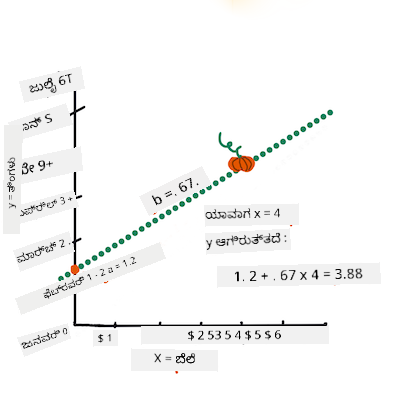
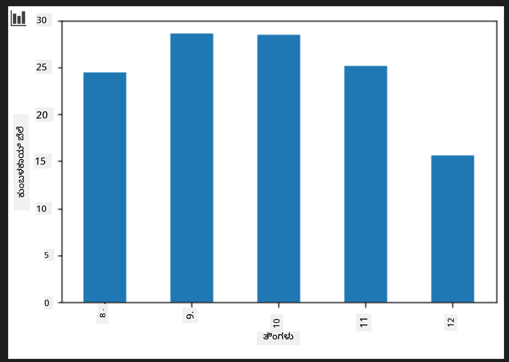

<!--
CO_OP_TRANSLATOR_METADATA:
{
  "original_hash": "40e64f004f3cb50aa1d8661672d3cd92",
  "translation_date": "2025-12-19T13:51:46+00:00",
  "source_file": "2-Regression/3-Linear/README.md",
  "language_code": "kn"
}
-->
# Scikit-learn ಬಳಸಿ ರೆಗ್ರೆಶನ್ ಮಾದರಿಯನ್ನು ನಿರ್ಮಿಸಿ: ರೆಗ್ರೆಶನ್ ನಾಲ್ಕು ರೀತಿಗಳು


> ಇನ್ಫೋಗ್ರಾಫಿಕ್ [ದಾಸನಿ ಮಡಿಪಳ್ಳಿ](https://twitter.com/dasani_decoded) ಅವರಿಂದ
## [ಪೂರ್ವ-ಪಾಠ ಕ್ವಿಜ್](https://ff-quizzes.netlify.app/en/ml/)

> ### [ಈ ಪಾಠ R ನಲ್ಲಿ ಲಭ್ಯವಿದೆ!](../../../../2-Regression/3-Linear/solution/R/lesson_3.html)
### ಪರಿಚಯ

ಈವರೆಗೆ ನೀವು ರೆಗ್ರೆಶನ್ ಎಂದರೇನು ಎಂಬುದನ್ನು ಪಂಪ್ಕಿನ್ ಬೆಲೆ ಡೇಟಾಸೆಟ್‌ನಿಂದ ಸಂಗ್ರಹಿಸಿದ ಮಾದರಿ ಡೇಟಾ ಮೂಲಕ ಅನ್ವೇಷಿಸಿದ್ದೀರಿ. ನೀವು ಅದನ್ನು Matplotlib ಬಳಸಿ ದೃಶ್ಯೀಕರಿಸಿದ್ದೀರಿ.

ಈಗ ನೀವು ML ಗಾಗಿ ರೆಗ್ರೆಶನ್‌ನಲ್ಲಿ ಇನ್ನಷ್ಟು ಆಳವಾಗಿ ಹೋಗಲು ಸಿದ್ಧರಾಗಿದ್ದೀರಿ. ದೃಶ್ಯೀಕರಣವು ಡೇಟಾವನ್ನು ಅರ್ಥಮಾಡಿಕೊಳ್ಳಲು ಸಹಾಯ ಮಾಡುತ್ತದೆ, ಆದರೆ ಯಂತ್ರ ಅಧ್ಯಯನದ ನಿಜವಾದ ಶಕ್ತಿ _ಮಾದರಿಗಳನ್ನು ತರಬೇತುಗೊಳಿಸುವುದರಿಂದ_ ಬರುತ್ತದೆ. ಮಾದರಿಗಳನ್ನು ಇತಿಹಾಸದ ಡೇಟಾದ ಮೇಲೆ ತರಬೇತುಗೊಳಿಸಲಾಗುತ್ತದೆ, ಇದು ಡೇಟಾ ಅವಲಂಬನೆಗಳನ್ನು ಸ್ವಯಂಚಾಲಿತವಾಗಿ ಹಿಡಿಯಲು ಸಹಾಯ ಮಾಡುತ್ತದೆ ಮತ್ತು ಹೊಸ ಡೇಟಾದ ಫಲಿತಾಂಶಗಳನ್ನು ಭವಿಷ್ಯವಾಣಿ ಮಾಡಲು ಅನುಮತಿಸುತ್ತದೆ, ಇದು ಮಾದರಿ ಮೊದಲು ನೋಡಿರಲಿಲ್ಲ.

ಈ ಪಾಠದಲ್ಲಿ, ನೀವು ಎರಡು ರೀತಿಯ ರೆಗ್ರೆಶನ್ ಬಗ್ಗೆ ಇನ್ನಷ್ಟು ತಿಳಿಯುತ್ತೀರಿ: _ಮೂಲಭೂತ ರೇಖೀಯ ರೆಗ್ರೆಶನ್_ ಮತ್ತು _ಬಹುಪದ ರೆಗ್ರೆಶನ್_, ಜೊತೆಗೆ ಈ ತಂತ್ರಜ್ಞಾನಗಳ ಹಿಂದೆ ಇರುವ ಕೆಲವು ಗಣಿತ. ಆ ಮಾದರಿಗಳು ನಮಗೆ ವಿವಿಧ ಇನ್ಪುಟ್ ಡೇಟಾದ ಆಧಾರದ ಮೇಲೆ ಪಂಪ್ಕಿನ್ ಬೆಲೆಗಳನ್ನು ಭವಿಷ್ಯವಾಣಿ ಮಾಡಲು ಸಹಾಯ ಮಾಡುತ್ತವೆ.

[](https://youtu.be/CRxFT8oTDMg "ML for beginners - Understanding Linear Regression")

> 🎥 ರೇಖೀಯ ರೆಗ್ರೆಶನ್ ಕುರಿತು ಸಂಕ್ಷಿಪ್ತ ವೀಡಿಯೋ ಅವಲೋಕನಕ್ಕಾಗಿ ಮೇಲಿನ ಚಿತ್ರವನ್ನು ಕ್ಲಿಕ್ ಮಾಡಿ.

> ಈ ಪಠ್ಯಕ್ರಮದಲ್ಲಿ, ನಾವು ಗಣಿತದ ಕನಿಷ್ಠ ಜ್ಞಾನವನ್ನು ಊಹಿಸುತ್ತೇವೆ ಮತ್ತು ಇತರ ಕ್ಷೇತ್ರಗಳಿಂದ ಬರುವ ವಿದ್ಯಾರ್ಥಿಗಳಿಗೆ ಇದನ್ನು ಸುಲಭಗೊಳಿಸಲು ಪ್ರಯತ್ನಿಸುತ್ತೇವೆ, ಆದ್ದರಿಂದ ಟಿಪ್ಪಣಿಗಳು, 🧮 ಕರೆಗಳು, ಚಿತ್ರಗಳು ಮತ್ತು ಇತರ ಕಲಿಕಾ ಸಾಧನಗಳನ್ನು ಗಮನಿಸಿ.

### ಪೂರ್ವಾಪೇಕ್ಷಿತ

ನೀವು ಈಗಾಗಲೇ ನಾವು ಪರಿಶೀಲಿಸುತ್ತಿರುವ ಪಂಪ್ಕಿನ್ ಡೇಟಾದ ರಚನೆಗೆ ಪರಿಚಿತರಾಗಿರಬೇಕು. ನೀವು ಈ ಪಾಠದ _notebook.ipynb_ ಫೈಲ್‌ನಲ್ಲಿ ಪೂರ್ವಲೋಡ್ ಮತ್ತು ಪೂರ್ವಶುದ್ಧೀಕರಿಸಿದ ಡೇಟಾವನ್ನು ಕಾಣಬಹುದು. ಫೈಲ್‌ನಲ್ಲಿ, ಪಂಪ್ಕಿನ್ ಬೆಲೆ ಪ್ರತಿ ಬಷೆಲ್‌ಗೆ ಹೊಸ ಡೇಟಾ ಫ್ರೇಮ್‌ನಲ್ಲಿ ಪ್ರದರ್ಶಿಸಲಾಗಿದೆ. ನೀವು Visual Studio Code ನಲ್ಲಿ ಈ ನೋಟ್ಬುಕ್‌ಗಳನ್ನು ಕರ್ಣೆಲ್‌ಗಳಲ್ಲಿ ಚಾಲನೆ ಮಾಡಬಹುದಾಗಿದೆ ಎಂದು ಖಚಿತಪಡಿಸಿಕೊಳ್ಳಿ.

### ತಯಾರಿ

ಒಂದು ಸ್ಮರಣಿಕೆಗಾಗಿ, ನೀವು ಈ ಡೇಟಾವನ್ನು ಲೋಡ್ ಮಾಡುತ್ತಿದ್ದೀರಿ ಇದರಿಂದ ಅದಕ್ಕೆ ಪ್ರಶ್ನೆಗಳನ್ನು ಕೇಳಲು.

- ಪಂಪ್ಕಿನ್‌ಗಳನ್ನು ಖರೀದಿಸಲು ಅತ್ಯುತ್ತಮ ಸಮಯ ಯಾವುದು?
- ಸಣ್ಣ ಪಂಪ್ಕಿನ್‌ಗಳ ಒಂದು ಕೇಸ್‌ನ ಬೆಲೆ ಎಷ್ಟು ನಿರೀಕ್ಷಿಸಬಹುದು?
- ಅವುಗಳನ್ನು ಅರ್ಧ-ಬಷೆಲ್ ಬಾಸ್ಕೆಟ್‌ಗಳಲ್ಲಿ ಖರೀದಿಸಬೇಕೇ ಅಥವಾ 1 1/9 ಬಷೆಲ್ ಬಾಕ್ಸ್ ಮೂಲಕವೇ?
ನಾವು ಈ ಡೇಟಾದಲ್ಲಿ ಇನ್ನಷ್ಟು ತವಕದಿಂದ ತೊಡಗಿಸೋಣ.

ಹಿಂದಿನ ಪಾಠದಲ್ಲಿ, ನೀವು ಪಾಂಡಾಸ್ ಡೇಟಾ ಫ್ರೇಮ್ ರಚಿಸಿ ಮೂಲ ಡೇಟಾಸೆಟ್‌ನ ಭಾಗವನ್ನು ತುಂಬಿದ್ದೀರಿ, ಬೆಲೆಯನ್ನು ಬಷೆಲ್ ಮೂಲಕ ಮಾನಕೀಕರಿಸಿದ್ದೀರಿ. ಆದಾಗ್ಯೂ, ನೀವು ಸುಮಾರು 400 ಡೇಟಾಪಾಯಿಂಟ್‌ಗಳನ್ನು ಮಾತ್ರ ಸಂಗ್ರಹಿಸಿದ್ದೀರಿ ಮತ್ತು ಅವು ಕೇವಲ ಶರತ್ಕಾಲದ ತಿಂಗಳುಗಳಿಗೆ ಮಾತ್ರ.

ಈ ಪಾಠದ ಜೊತೆಗೆ ಲಭ್ಯವಿರುವ ನೋಟ್ಬುಕ್‌ನಲ್ಲಿ ಪೂರ್ವಲೋಡ್ ಮಾಡಲಾದ ಡೇಟಾವನ್ನು ನೋಡಿ. ಡೇಟಾ ಪೂರ್ವಲೋಡ್ ಆಗಿದ್ದು, ಪ್ರಾಥಮಿಕ ಸ್ಕ್ಯಾಟರ್‌ಪ್ಲಾಟ್ ತಿಂಗಳ ಡೇಟಾವನ್ನು ತೋರಿಸಲು ಚಾರ್ಟ್ ಮಾಡಲಾಗಿದೆ. ಡೇಟಾದ ಸ್ವಭಾವವನ್ನು ಇನ್ನಷ್ಟು ವಿವರವಾಗಿ ತಿಳಿದುಕೊಳ್ಳಲು ಅದನ್ನು ಹೆಚ್ಚು ಶುದ್ಧೀಕರಿಸಬಹುದು.

## ರೇಖೀಯ ರೆಗ್ರೆಶನ್ ರೇಖೆ

ಪಾಠ 1 ರಲ್ಲಿ ನೀವು ಕಲಿತಂತೆ, ರೇಖೀಯ ರೆಗ್ರೆಶನ್ ವ್ಯಾಯಾಮದ ಗುರಿ ಒಂದು ರೇಖೆಯನ್ನು ರೇಖಾಚಿತ್ರ ಮಾಡಲು ಆಗಿದೆ:

- **ಚರಗಳ ಸಂಬಂಧಗಳನ್ನು ತೋರಿಸುವುದು**. ಚರಗಳ ನಡುವಿನ ಸಂಬಂಧವನ್ನು ತೋರಿಸುವುದು
- **ಭವಿಷ್ಯವಾಣಿ ಮಾಡುವುದು**. ಹೊಸ ಡೇಟಾಪಾಯಿಂಟ್ ಆ ರೇಖೆಯ ಸಂಬಂಧದಲ್ಲಿ ಎಲ್ಲಿ ಬಿದ್ದೀತು ಎಂಬುದನ್ನು ನಿಖರವಾಗಿ ಭವಿಷ್ಯವಾಣಿ ಮಾಡುವುದು.

**ಕನಿಷ್ಠ ಚದರ ರೆಗ್ರೆಶನ್** ಸಾಮಾನ್ಯವಾಗಿ ಈ ರೀತಿಯ ರೇಖೆಯನ್ನು ಬಿಡುತ್ತದೆ. 'ಕನಿಷ್ಠ ಚದರ' ಎಂಬ ಪದವು ಅಂದರೆ ರೆಗ್ರೆಶನ್ ರೇಖೆಯ ಸುತ್ತಲೂ ಇರುವ ಎಲ್ಲಾ ಡೇಟಾಪಾಯಿಂಟ್‌ಗಳ ಚದರಗಳನ್ನು ತೆಗೆದು ಸೇರಿಸಲಾಗುತ್ತದೆ. ಆದರ್ಶವಾಗಿ, ಅಂತಿಮ ಮೊತ್ತ ಸಾಧ್ಯವಾದಷ್ಟು ಕಡಿಮೆ ಇರಬೇಕು, ಏಕೆಂದರೆ ನಾವು ತಪ್ಪುಗಳ ಸಂಖ್ಯೆ ಕಡಿಮೆ ಇರಬೇಕೆಂದು ಬಯಸುತ್ತೇವೆ, ಅಂದರೆ `ಕನಿಷ್ಠ ಚದರ`.

ನಾವು ಈ ರೇಖೆಯನ್ನು ಮಾದರಿಮಾಡಲು ಬಯಸುತ್ತೇವೆ ಏಕೆಂದರೆ ಅದು ನಮ್ಮ ಎಲ್ಲಾ ಡೇಟಾಪಾಯಿಂಟ್‌ಗಳಿಂದ ಕನಿಷ್ಠ ಒಟ್ಟು ದೂರವನ್ನು ಹೊಂದಿರುತ್ತದೆ. ನಾವು ಮೊದಲು ಚದರಗಳನ್ನು ತೆಗೆದುಕೊಳ್ಳುತ್ತೇವೆ ಏಕೆಂದರೆ ನಾವು ಅದರ ದಿಕ್ಕಿನ ಬದಲು ಅದರ ಪ್ರಮಾಣದ ಬಗ್ಗೆ ಚಿಂತಿಸುತ್ತೇವೆ.

> **🧮 ಗಣಿತವನ್ನು ತೋರಿಸಿ** 
> 
> ಈ ರೇಖೆಯನ್ನು, _ಉತ್ತಮ ಹೊಂದಾಣಿಕೆಯ ರೇಖೆ_ ಎಂದು ಕರೆಯಲಾಗುತ್ತದೆ ಮತ್ತು ಅದನ್ನು [ಸಮೀಕರಣ](https://en.wikipedia.org/wiki/Simple_linear_regression) ಮೂಲಕ ವ್ಯಕ್ತಪಡಿಸಬಹುದು: 
> 
> ```
> Y = a + bX
> ```
>
> `X` ಅನ್ನು 'ವಿವರಣೆ ಚರ' ಎಂದು ಕರೆಯಲಾಗುತ್ತದೆ. `Y` ಅನ್ನು 'ಆಧಾರಿತ ಚರ' ಎಂದು ಕರೆಯಲಾಗುತ್ತದೆ. ರೇಖೆಯ ಸ್ಲೋಪ್ `b` ಆಗಿದ್ದು, `a` ಯು y-ಅಂತರವನ್ನು ಸೂಚಿಸುತ್ತದೆ, ಇದು `X = 0` ಆಗಿರುವಾಗ `Y` ಯ ಮೌಲ್ಯ.
>
>
>
> ಮೊದಲು, ಸ್ಲೋಪ್ `b` ಅನ್ನು ಲೆಕ್ಕಹಾಕಿ. ಇನ್ಫೋಗ್ರಾಫಿಕ್ [ಜೆನ್ ಲೂಪರ್](https://twitter.com/jenlooper) ಅವರಿಂದ
>
> ಬೇರೆ ಪದಗಳಲ್ಲಿ, ಮತ್ತು ನಮ್ಮ ಪಂಪ್ಕಿನ್ ಡೇಟಾದ ಮೂಲ ಪ್ರಶ್ನೆಗೆ ಸಂಬಂಧಿಸಿದಂತೆ: "ತಿಂಗಳ ಪ್ರಕಾರ ಪ್ರತಿ ಬಷೆಲ್ ಪಂಪ್ಕಿನ್ ಬೆಲೆಯನ್ನು ಭವಿಷ್ಯವಾಣಿ ಮಾಡಿ", `X` ಬೆಲೆಗೆ ಸೂಚಿಸುತ್ತದೆ ಮತ್ತು `Y` ಮಾರಾಟದ ತಿಂಗಳಿಗೆ ಸೂಚಿಸುತ್ತದೆ.
>
>
>
> Y ಮೌಲ್ಯವನ್ನು ಲೆಕ್ಕಹಾಕಿ. ನೀವು ಸುಮಾರು $4 ಪಾವತಿಸುತ್ತಿದ್ದರೆ, ಅದು ಏಪ್ರಿಲ್ ಆಗಿರಬೇಕು! ಇನ್ಫೋಗ್ರಾಫಿಕ್ [ಜೆನ್ ಲೂಪರ್](https://twitter.com/jenlooper) ಅವರಿಂದ
>
> ರೇಖೆಯ ಗಣಿತವು ಸ್ಲೋಪ್ ಅನ್ನು ತೋರಿಸಬೇಕು, ಇದು ಅಂತರದ ಮೇಲೆ ಅವಲಂಬಿತವಾಗಿದ್ದು, ಅಂದರೆ `X = 0` ಆಗಿರುವಾಗ `Y` ಎಲ್ಲಿ ಇರುತ್ತದೆ.
>
> ನೀವು ಈ ಮೌಲ್ಯಗಳ ಲೆಕ್ಕಾಚಾರದ ವಿಧಾನವನ್ನು [Math is Fun](https://www.mathsisfun.com/data/least-squares-regression.html) ವೆಬ್‌ಸೈಟ್‌ನಲ್ಲಿ ನೋಡಬಹುದು. ಜೊತೆಗೆ [ಈ ಕನಿಷ್ಠ ಚದರ ಕ್ಯಾಲ್ಕ್ಯುಲೇಟರ್](https://www.mathsisfun.com/data/least-squares-calculator.html) ಗೆ ಭೇಟಿ ನೀಡಿ ಸಂಖ್ಯೆಗಳ ಮೌಲ್ಯಗಳು ರೇಖೆಯನ್ನು ಹೇಗೆ ಪ್ರಭಾವಿಸುತ್ತವೆ ಎಂದು ನೋಡಿ.

## ಸಹಸಂಬಂಧ

ಮತ್ತೊಂದು ಪದವನ್ನು ಅರ್ಥಮಾಡಿಕೊಳ್ಳಬೇಕಿದೆ ಅದು **ಸಹಸಂಬಂಧ ಗುಣಾಂಕ** ಆಗಿದ್ದು, ನೀಡಲಾದ X ಮತ್ತು Y ಚರಗಳ ನಡುವೆ. ಸ್ಕ್ಯಾಟರ್‌ಪ್ಲಾಟ್ ಬಳಸಿ ನೀವು ಈ ಗುಣಾಂಕವನ್ನು ತ್ವರಿತವಾಗಿ ದೃಶ್ಯೀಕರಿಸಬಹುದು. ಡೇಟಾಪಾಯಿಂಟ್‌ಗಳು ಸರಳ ರೇಖೆಯಲ್ಲಿ ಸುತ್ತಲೂ ಹಂಚಿಕೊಂಡಿದ್ದರೆ ಸಹಸಂಬಂಧ ಹೆಚ್ಚು ಇರುತ್ತದೆ, ಆದರೆ ಡೇಟಾಪಾಯಿಂಟ್‌ಗಳು X ಮತ್ತು Y ನಡುವೆ ಎಲ್ಲೆಡೆ ಹಂಚಿಕೊಂಡಿದ್ದರೆ ಸಹಸಂಬಂಧ ಕಡಿಮೆ ಇರುತ್ತದೆ.

ಒಳ್ಳೆಯ ರೇಖೀಯ ರೆಗ್ರೆಶನ್ ಮಾದರಿ ಕನಿಷ್ಠ ಚದರ ರೆಗ್ರೆಶನ್ ವಿಧಾನವನ್ನು ಬಳಸಿ ರೇಖೆಯೊಂದಿಗೆ ಸಹಸಂಬಂಧ ಗುಣಾಂಕವು ಹೆಚ್ಚು (0 ಕ್ಕಿಂತ 1 ಗೆ ಹತ್ತಿರ) ಇರುವುದಾಗಿರುತ್ತದೆ.

✅ ಈ ಪಾಠದ ಜೊತೆಗೆ ಲಭ್ಯವಿರುವ ನೋಟ್ಬುಕ್ ಅನ್ನು ಚಾಲನೆ ಮಾಡಿ ಮತ್ತು ತಿಂಗಳು ಮತ್ತು ಬೆಲೆ ಸ್ಕ್ಯಾಟರ್‌ಪ್ಲಾಟ್ ನೋಡಿ. ಪಂಪ್ಕಿನ್ ಮಾರಾಟದ ತಿಂಗಳು ಮತ್ತು ಬೆಲೆ ನಡುವಿನ ಡೇಟಾ ನಿಮ್ಮ ದೃಶ್ಯಾತ್ಮಕ ವಿಶ್ಲೇಷಣೆಯ ಪ್ರಕಾರ ಹೆಚ್ಚು ಅಥವಾ ಕಡಿಮೆ ಸಹಸಂಬಂಧ ಹೊಂದಿದೆಯೇ? ನೀವು `ತಿಂಗಳು` ಬದಲು ಹೆಚ್ಚು ಸೂಕ್ಷ್ಮ ಮಾಪನವನ್ನು ಬಳಸಿದರೆ, ಉದಾ. *ವರ್ಷದ ದಿನ* (ಅಂದರೆ ವರ್ಷದ ಆರಂಭದಿಂದ ದಿನಗಳ ಸಂಖ್ಯೆ) ಇದರಿಂದ ಬದಲಾವಣೆ ಆಗುತ್ತದೆಯೇ?

ಕೆಳಗಿನ ಕೋಡ್‌ನಲ್ಲಿ, ನಾವು ಡೇಟಾವನ್ನು ಶುದ್ಧೀಕರಿಸಿದ್ದೇವೆ ಎಂದು ಊಹಿಸೋಣ ಮತ್ತು `new_pumpkins` ಎಂಬ ಡೇಟಾ ಫ್ರೇಮ್ ಅನ್ನು ಪಡೆದಿದ್ದೇವೆ, ಹೀಗಿದೆ:

ID | Month | DayOfYear | Variety | City | Package | Low Price | High Price | Price
---|-------|-----------|---------|------|---------|-----------|------------|-------
70 | 9 | 267 | PIE TYPE | BALTIMORE | 1 1/9 bushel cartons | 15.0 | 15.0 | 13.636364
71 | 9 | 267 | PIE TYPE | BALTIMORE | 1 1/9 bushel cartons | 18.0 | 18.0 | 16.363636
72 | 10 | 274 | PIE TYPE | BALTIMORE | 1 1/9 bushel cartons | 18.0 | 18.0 | 16.363636
73 | 10 | 274 | PIE TYPE | BALTIMORE | 1 1/9 bushel cartons | 17.0 | 17.0 | 15.454545
74 | 10 | 281 | PIE TYPE | BALTIMORE | 1 1/9 bushel cartons | 15.0 | 15.0 | 13.636364

> ಡೇಟಾ ಶುದ್ಧೀಕರಣದ ಕೋಡ್ [`notebook.ipynb`](notebook.ipynb) ನಲ್ಲಿ ಲಭ್ಯವಿದೆ. ನಾವು ಹಿಂದಿನ ಪಾಠದಂತೆ ಅದೇ ಶುದ್ಧೀಕರಣ ಹಂತಗಳನ್ನು ಅನುಸರಿಸಿದ್ದೇವೆ ಮತ್ತು ಕೆಳಗಿನ ಅಭಿವ್ಯಕ್ತಿಯನ್ನು ಬಳಸಿ `DayOfYear` ಕಾಲಮ್ ಲೆಕ್ಕಹಾಕಿದ್ದೇವೆ:

```python
day_of_year = pd.to_datetime(pumpkins['Date']).apply(lambda dt: (dt-datetime(dt.year,1,1)).days)
```

ಈಗ ನೀವು ರೇಖೀಯ ರೆಗ್ರೆಶನ್ ಹಿಂದಿನ ಗಣಿತವನ್ನು ಅರ್ಥಮಾಡಿಕೊಂಡಿದ್ದೀರಿ, ಬನ್ನಿ ಒಂದು ರೆಗ್ರೆಶನ್ ಮಾದರಿಯನ್ನು ರಚಿಸಿ ಯಾವ ಪಂಪ್ಕಿನ್ ಪ್ಯಾಕೇಜ್ ಉತ್ತಮ ಬೆಲೆ ಹೊಂದಿರಬಹುದು ಎಂದು ಭವಿಷ್ಯವಾಣಿ ಮಾಡೋಣ. ಹಬ್ಬದ ಪಂಪ್ಕಿನ್ ಪ್ಯಾಚ್‌ಗಾಗಿ ಪಂಪ್ಕಿನ್ ಖರೀದಿಸುವವರು ಈ ಮಾಹಿತಿಯನ್ನು ಬಳಸಿಕೊಂಡು ಪ್ಯಾಚ್‌ಗಾಗಿ ಪಂಪ್ಕಿನ್ ಪ್ಯಾಕೇಜ್‌ಗಳ ಖರೀದಿಯನ್ನು ಗರಿಷ್ಠಗೊಳಿಸಬಹುದು.

## ಸಹಸಂಬಂಧ ಹುಡುಕುವುದು

[](https://youtu.be/uoRq-lW2eQo "ML for beginners - Looking for Correlation: The Key to Linear Regression")

> 🎥 ಸಹಸಂಬಂಧದ ಸಂಕ್ಷಿಪ್ತ ವೀಡಿಯೋ ಅವಲೋಕನಕ್ಕಾಗಿ ಮೇಲಿನ ಚಿತ್ರವನ್ನು ಕ್ಲಿಕ್ ಮಾಡಿ.

ಹಿಂದಿನ ಪಾಠದಿಂದ ನೀವು ನೋಡಿರಬಹುದು ವಿಭಿನ್ನ ತಿಂಗಳುಗಳಿಗೆ ಸರಾಸರಿ ಬೆಲೆ ಹೀಗಿದೆ:



ಇದು ಕೆಲವು ಸಹಸಂಬಂಧ ಇರಬೇಕೆಂದು ಸೂಚಿಸುತ್ತದೆ, ಮತ್ತು ನಾವು `ತಿಂಗಳು` ಮತ್ತು `ಬೆಲೆ` ಅಥವಾ `DayOfYear` ಮತ್ತು `ಬೆಲೆ` ನಡುವಿನ ಸಂಬಂಧವನ್ನು ಭವಿಷ್ಯವಾಣಿ ಮಾಡಲು ರೇಖೀಯ ರೆಗ್ರೆಶನ್ ಮಾದರಿಯನ್ನು ತರಬೇತುಗೊಳಿಸಲು ಪ್ರಯತ್ನಿಸಬಹುದು. ಕೆಳಗಿನ ಸ್ಕ್ಯಾಟರ್ ಪ್ಲಾಟ್ ನಂತರದ ಸಂಬಂಧವನ್ನು ತೋರಿಸುತ್ತದೆ:

 

`corr` ಫಂಕ್ಷನ್ ಬಳಸಿ ಸಹಸಂಬಂಧವನ್ನು ನೋಡೋಣ:

```python
print(new_pumpkins['Month'].corr(new_pumpkins['Price']))
print(new_pumpkins['DayOfYear'].corr(new_pumpkins['Price']))
```

ಸಹಸಂಬಂಧವು ಬಹಳ ಕಡಿಮೆ ಇದೆ ಎಂದು ತೋರುತ್ತದೆ, `ತಿಂಗಳು` ಮೂಲಕ -0.15 ಮತ್ತು `DayOfMonth` ಮೂಲಕ -0.17, ಆದರೆ ಇನ್ನೊಂದು ಪ್ರಮುಖ ಸಂಬಂಧ ಇರಬಹುದು. ವಿಭಿನ್ನ ಪಂಪ್ಕಿನ್ ಪ್ರಭೇದಗಳಿಗೆ ಹೊಂದಿಕೊಂಡ ಬೆಲೆಗಳ ವಿಭಿನ್ನ ಗುಂಪುಗಳಿವೆ ಎಂದು ತೋರುತ್ತದೆ. ಈ ಊಹೆಯನ್ನು ದೃಢೀಕರಿಸಲು, ಪ್ರತಿ ಪಂಪ್ಕಿನ್ ವರ್ಗವನ್ನು ವಿಭಿನ್ನ ಬಣ್ಣದಲ್ಲಿ ಚಿತ್ರಿಸೋಣ. `scatter` ಪ್ಲಾಟ್ ಫಂಕ್ಷನ್‌ಗೆ `ax` ಪರಾಮಿತಿ ನೀಡುವ ಮೂಲಕ ನಾವು ಎಲ್ಲಾ ಬಿಂದುಗಳನ್ನು ಒಂದೇ ಗ್ರಾಫ್‌ನಲ್ಲಿ ಚಿತ್ರಿಸಬಹುದು:

```python
ax=None
colors = ['red','blue','green','yellow']
for i,var in enumerate(new_pumpkins['Variety'].unique()):
    df = new_pumpkins[new_pumpkins['Variety']==var]
    ax = df.plot.scatter('DayOfYear','Price',ax=ax,c=colors[i],label=var)
```

 

ನಮ್ಮ ತನಿಖೆ ಸೂಚಿಸುತ್ತದೆ, ಪ್ರಭೇದವು ಮಾರಾಟದ ದಿನಾಂಕಕ್ಕಿಂತ ಒಟ್ಟು ಬೆಲೆಯ ಮೇಲೆ ಹೆಚ್ಚು ಪ್ರಭಾವ ಬೀರುತ್ತದೆ. ನಾವು ಇದನ್ನು ಬಾರ್ ಗ್ರಾಫ್ ಮೂಲಕ ನೋಡಬಹುದು:

```python
new_pumpkins.groupby('Variety')['Price'].mean().plot(kind='bar')
```

 

ಈಗ ನಾವು ಒಂದು ಪಂಪ್ಕಿನ್ ಪ್ರಭೇದ, 'ಪೈ ಟೈಪ್' ಮೇಲೆ ಮಾತ್ರ ಗಮನಹರಿಸೋಣ ಮತ್ತು ದಿನಾಂಕವು ಬೆಲೆಗೆ ಏನು ಪ್ರಭಾವ ಬೀರುತ್ತದೆ ನೋಡೋಣ:

```python
pie_pumpkins = new_pumpkins[new_pumpkins['Variety']=='PIE TYPE']
pie_pumpkins.plot.scatter('DayOfYear','Price') 
```
 

ಈಗ ನಾವು `corr` ಫಂಕ್ಷನ್ ಬಳಸಿ `ಬೆಲೆ` ಮತ್ತು `DayOfYear` ನಡುವಿನ ಸಹಸಂಬಂಧವನ್ನು ಲೆಕ್ಕಹಾಕಿದರೆ, ಅದು `-0.27` ಆಗಿರುತ್ತದೆ - ಇದು ಭವಿಷ್ಯವಾಣಿ ಮಾದರಿಯನ್ನು ತರಬೇತುಗೊಳಿಸುವುದು ಅರ್ಥಪೂರ್ಣ ಎಂದು ಸೂಚಿಸುತ್ತದೆ.

> ರೇಖೀಯ ರೆಗ್ರೆಶನ್ ಮಾದರಿಯನ್ನು ತರಬೇತುಗೊಳಿಸುವ ಮೊದಲು, ನಮ್ಮ ಡೇಟಾ ಶುದ್ಧವಾಗಿದೆ ಎಂದು ಖಚಿತಪಡಿಸಿಕೊಳ್ಳುವುದು ಮುಖ್ಯ. ರೇಖೀಯ ರೆಗ್ರೆಶನ್ ಕಳೆದುಹೋಗಿರುವ ಮೌಲ್ಯಗಳೊಂದಿಗೆ ಚೆನ್ನಾಗಿ ಕೆಲಸ ಮಾಡದು, ಆದ್ದರಿಂದ ಎಲ್ಲಾ ಖಾಲಿ ಸೆಲ್‌ಗಳನ್ನು ತೆಗೆದುಹಾಕುವುದು ಸೂಕ್ತ.

```python
pie_pumpkins.dropna(inplace=True)
pie_pumpkins.info()
```

ಮತ್ತೊಂದು ವಿಧಾನವೆಂದರೆ ಆ ಖಾಲಿ ಮೌಲ್ಯಗಳನ್ನು ಸಂಬಂಧಿಸಿದ ಕಾಲಮ್‌ನ ಸರಾಸರಿ ಮೌಲ್ಯಗಳಿಂದ ತುಂಬಿಸುವುದು.

## ಸರಳ ರೇಖೀಯ ರೆಗ್ರೆಶನ್

[](https://youtu.be/e4c_UP2fSjg "ML for beginners - Linear and Polynomial Regression using Scikit-learn")

> 🎥 ರೇಖೀಯ ಮತ್ತು ಬಹುಪದ ರೆಗ್ರೆಶನ್ ಕುರಿತು ಸಂಕ್ಷಿಪ್ತ ವೀಡಿಯೋ ಅವಲೋಕನಕ್ಕಾಗಿ ಮೇಲಿನ ಚಿತ್ರವನ್ನು ಕ್ಲಿಕ್ ಮಾಡಿ.

ನಮ್ಮ ರೇಖೀಯ ರೆಗ್ರೆಶನ್ ಮಾದರಿಯನ್ನು ತರಬೇತುಗೊಳಿಸಲು, ನಾವು **Scikit-learn** ಗ್ರಂಥಾಲಯವನ್ನು ಬಳಸುತ್ತೇವೆ.

```python
from sklearn.linear_model import LinearRegression
from sklearn.metrics import mean_squared_error
from sklearn.model_selection import train_test_split
```

ನಾವು ಮೊದಲಿಗೆ ಇನ್ಪುಟ್ ಮೌಲ್ಯಗಳು (ಲಕ್ಷಣಗಳು) ಮತ್ತು ನಿರೀಕ್ಷಿತ ಔಟ್‌ಪುಟ್ (ಲೇಬಲ್) ಅನ್ನು ಪ್ರತ್ಯೇಕ numpy ಅರೆಗಳಾಗಿ ವಿಭಜಿಸುತ್ತೇವೆ:

```python
X = pie_pumpkins['DayOfYear'].to_numpy().reshape(-1,1)
y = pie_pumpkins['Price']
```

> ಗಮನಿಸಿ, Linear Regression ಪ್ಯಾಕೇಜ್ ಸರಿಯಾಗಿ ಅರ್ಥಮಾಡಿಕೊಳ್ಳಲು ನಾವು ಇನ್ಪುಟ್ ಡೇಟಾದ ಮೇಲೆ `reshape` ಮಾಡಬೇಕಾಯಿತು. Linear Regression 2D ಅರೆ ಇನ್ಪುಟ್ ಆಗಿರಬೇಕೆಂದು ನಿರೀಕ್ಷಿಸುತ್ತದೆ, ಅಲ್ಲಿ ಪ್ರತಿಯೊಂದು ಸಾಲು ಒಂದು ಲಕ್ಷಣಗಳ ವೆಕ್ಟರ್ ಆಗಿರುತ್ತದೆ. ನಮ್ಮ ಪ್ರಕರಣದಲ್ಲಿ, ನಮಗೆ ಒಂದೇ ಇನ್ಪುಟ್ ಇದ್ದು, ಆದ್ದರಿಂದ N×1 ಆಕಾರದ ಅರೆ ಬೇಕಾಗುತ್ತದೆ, ಇಲ್ಲಿ N ಡೇಟಾಸೆಟ್ ಗಾತ್ರ.

ನಂತರ, ನಾವು ಡೇಟಾವನ್ನು ತರಬೇತಿ ಮತ್ತು ಪರೀಕ್ಷಾ ಡೇಟಾಸೆಟ್‌ಗಳಾಗಿ ವಿಭಜಿಸಬೇಕು, ಇದರಿಂದ ನಾವು ತರಬೇತಿಯ ನಂತರ ನಮ್ಮ ಮಾದರಿಯನ್ನು ಮಾನ್ಯತೆ ಮಾಡಬಹುದು:

```python
X_train, X_test, y_train, y_test = train_test_split(X, y, test_size=0.2, random_state=0)
```

ಕೊನೆಗೆ, ನಿಜವಾದ ರೇಖೀಯ ರೆಗ್ರೆಶನ್ ಮಾದರಿಯನ್ನು ತರಬೇತುಗೊಳಿಸುವುದು ಕೇವಲ ಎರಡು ಸಾಲು ಕೋಡ್ ತೆಗೆದುಕೊಳ್ಳುತ್ತದೆ. ನಾವು `LinearRegression` ವಸ್ತುವನ್ನು ವ್ಯಾಖ್ಯಾನಿಸಿ, `fit` ವಿಧಾನ ಬಳಸಿ ಅದನ್ನು ನಮ್ಮ ಡೇಟಾಗೆ ಹೊಂದಿಸುತ್ತೇವೆ:

```python
lin_reg = LinearRegression()
lin_reg.fit(X_train,y_train)
```

`fit` ಮಾಡಿದ ನಂತರ `LinearRegression` ವಸ್ತುವಿನಲ್ಲಿ ಎಲ್ಲಾ ರೆಗ್ರೆಶನ್ ಗುಣಾಂಕಗಳು ಇರುತ್ತವೆ, ಅವುಗಳನ್ನು `.coef_` ಗುಣಲಕ್ಷಣದಿಂದ ಪ್ರವೇಶಿಸಬಹುದು. ನಮ್ಮ ಪ್ರಕರಣದಲ್ಲಿ, ಒಂದೇ ಗುಣಾಂಕ ಇದೆ, ಅದು ಸುಮಾರು `-0.017` ಆಗಿರಬೇಕು. ಇದರ ಅರ್ಥ ಬೆಲೆಗಳು ಸಮಯದೊಂದಿಗೆ ಸ್ವಲ್ಪ ಇಳಿಯುತ್ತಿವೆ, ಆದರೆ ಹೆಚ್ಚು ಅಲ್ಲ, ದಿನಕ್ಕೆ ಸುಮಾರು 2 ಸೆಂಟುಗಳಷ್ಟು. ನಾವು ರೇಖೆಯ Y-ಅಕ್ಷದ ಅಂತರ ಬಿಂದುವನ್ನು `lin_reg.intercept_` ಬಳಸಿ ಪ್ರವೇಶಿಸಬಹುದು - ಇದು ನಮ್ಮ ಪ್ರಕರಣದಲ್ಲಿ ಸುಮಾರು `21` ಆಗಿರುತ್ತದೆ, ವರ್ಷ ಆರಂಭದ ಬೆಲೆಯನ್ನು ಸೂಚಿಸುತ್ತದೆ.
ನಮ್ಮ ಮಾದರಿ ಎಷ್ಟು ನಿಖರವಾಗಿದೆ ಎಂದು ನೋಡಲು, ನಾವು ಪರೀಕ್ಷಾ ಡೇಟಾಸೆಟ್‌ನಲ್ಲಿ ಬೆಲೆಗಳನ್ನು ಭವಿಷ್ಯವಾಣಿ ಮಾಡಬಹುದು, ಮತ್ತು ನಂತರ ನಮ್ಮ ಭವಿಷ್ಯವಾಣಿಗಳು ನಿರೀಕ್ಷಿತ ಮೌಲ್ಯಗಳಿಗೆ ಎಷ್ಟು ಹತ್ತಿರವಿದೆ ಎಂದು ಅಳೆಯಬಹುದು. ಇದು ಸರಾಸರಿ ಚದರ ದೋಷ (MSE) ಮೆಟ್ರಿಕ್‌ಗಳನ್ನು ಬಳಸಿಕೊಂಡು ಮಾಡಬಹುದು, ಇದು ನಿರೀಕ್ಷಿತ ಮತ್ತು ಭವಿಷ್ಯವಾಣಿ ಮೌಲ್ಯಗಳ ನಡುವಿನ ಎಲ್ಲಾ ಚದರ ವ್ಯತ್ಯಾಸಗಳ ಸರಾಸರಿ.

```python
pred = lin_reg.predict(X_test)

mse = np.sqrt(mean_squared_error(y_test,pred))
print(f'Mean error: {mse:3.3} ({mse/np.mean(pred)*100:3.3}%)')
```

ನಮ್ಮ ದೋಷವು ಸುಮಾರು 2 ಅಂಕಿಗಳ ಸುತ್ತಲೂ ಇದೆ, ಇದು ~17% ಆಗಿದೆ. ತುಂಬಾ ಚೆನ್ನಾಗಿಲ್ಲ. ಮಾದರಿ ಗುಣಮಟ್ಟದ ಮತ್ತೊಂದು ಸೂಚಕವು **ನಿರ್ಧಾರ ಸಹಗುಣಕ** ಆಗಿದ್ದು, ಇದನ್ನು ಹೀಗೆ ಪಡೆಯಬಹುದು:

```python
score = lin_reg.score(X_train,y_train)
print('Model determination: ', score)
```

ಮೌಲ್ಯವು 0 ಆಗಿದ್ದರೆ, ಅದು ಮಾದರಿ ಇನ್‌ಪುಟ್ ಡೇಟಾವನ್ನು ಪರಿಗಣಿಸುವುದಿಲ್ಲ ಮತ್ತು *ಅತ್ಯಂತ ಕೆಟ್ಟ ರೇಖೀಯ ಭವಿಷ್ಯವಾಣಿ* ಆಗಿ ಕಾರ್ಯನಿರ್ವಹಿಸುತ್ತದೆ, ಇದು ಫಲಿತಾಂಶದ ಸರಾಸರಿ ಮೌಲ್ಯವೇ ಆಗಿದೆ. 1 ಮೌಲ್ಯವು ನಾವು ಎಲ್ಲಾ ನಿರೀಕ್ಷಿತ ಔಟ್‌ಪುಟ್‌ಗಳನ್ನು ಸಂಪೂರ್ಣವಾಗಿ ಭವಿಷ್ಯವಾಣಿ ಮಾಡಬಹುದು ಎಂದು ಅರ್ಥ. ನಮ್ಮ ಪ್ರಕರಣದಲ್ಲಿ, ಸಹಗುಣಕವು ಸುಮಾರು 0.06 ಆಗಿದ್ದು, ಇದು ತುಂಬಾ ಕಡಿಮೆ.

ನಾವು ಪರೀಕ್ಷಾ ಡೇಟಾವನ್ನು ಮತ್ತು ರಿಗ್ರೆಷನ್ ರೇಖೆಯನ್ನು ಒಟ್ಟಿಗೆ ಚಿತ್ರಿಸಿ, ನಮ್ಮ ಪ್ರಕರಣದಲ್ಲಿ ರಿಗ್ರೆಷನ್ ಹೇಗೆ ಕಾರ್ಯನಿರ್ವಹಿಸುತ್ತದೆ ಎಂದು ಉತ್ತಮವಾಗಿ ನೋಡಬಹುದು:

```python
plt.scatter(X_test,y_test)
plt.plot(X_test,pred)
```


## ಬಹುಪದ ರಿಗ್ರೆಷನ್

ಮತ್ತೊಂದು ರೇಖೀಯ ರಿಗ್ರೆಷನ್ ಪ್ರಕಾರ ಬಹುಪದ ರಿಗ್ರೆಷನ್ ಆಗಿದೆ. ಕೆಲವೊಮ್ಮೆ ಚರಗಳ ನಡುವೆ ರೇಖೀಯ ಸಂಬಂಧವಿರಬಹುದು - ಗಾತ್ರದಲ್ಲಿ ದೊಡ್ಡ ಕಂಬಳಿಯು ಬೆಲೆಯೂ ಹೆಚ್ಚು - ಆದರೆ ಕೆಲವೊಮ್ಮೆ ಈ ಸಂಬಂಧಗಳನ್ನು ಸಮತಲ ಅಥವಾ ಸರಳ ರೇಖೆಯಾಗಿ ಚಿತ್ರಿಸಲಾಗುವುದಿಲ್ಲ.

✅ ಇಲ್ಲಿ [ಇನ್ನಷ್ಟು ಉದಾಹರಣೆಗಳು](https://online.stat.psu.edu/stat501/lesson/9/9.8) ಇವೆ, ಅವು ಬಹುಪದ ರಿಗ್ರೆಷನ್ ಬಳಸಬಹುದು

ದಿನಾಂಕ ಮತ್ತು ಬೆಲೆಯ ನಡುವಿನ ಸಂಬಂಧವನ್ನು ಮತ್ತೊಮ್ಮೆ ನೋಡಿ. ಈ ಸ್ಕ್ಯಾಟರ್‌ಪ್ಲಾಟ್ ಅನ್ನು ಅವಶ್ಯಕವಾಗಿ ಸರಳ ರೇಖೆಯಿಂದ ವಿಶ್ಲೇಷಿಸಬೇಕೆಂದು ತೋರುತ್ತದೆಯೇ? ಬೆಲೆಗಳು ಬದಲಾಯಿಸಬಹುದೇ? ಈ ಸಂದರ್ಭದಲ್ಲಿ, ನೀವು ಬಹುಪದ ರಿಗ್ರೆಷನ್ ಪ್ರಯತ್ನಿಸಬಹುದು.

✅ ಬಹುಪದಗಳು ಗಣಿತೀಯ ಅಭಿವ್ಯಕ್ತಿಗಳು, ಅವು ಒಂದಕ್ಕಿಂತ ಹೆಚ್ಚು ಚರಗಳು ಮತ್ತು ಸಹಗುಣಕಗಳನ್ನು ಹೊಂದಿರಬಹುದು

ಬಹುಪದ ರಿಗ್ರೆಷನ್ ಅರೇಖೀಯವಲ್ಲದ ಡೇಟಾವನ್ನು ಉತ್ತಮವಾಗಿ ಹೊಂದಿಸಲು ವಕ್ರ ರೇಖೆಯನ್ನು ರಚಿಸುತ್ತದೆ. ನಮ್ಮ ಪ್ರಕರಣದಲ್ಲಿ, ನಾವು ಇನ್‌ಪುಟ್ ಡೇಟಾದಲ್ಲಿ ಚದರ `DayOfYear` ಚರವನ್ನು ಸೇರಿಸಿದರೆ, ನಾವು ಡೇಟಾವನ್ನು ಪ್ಯಾರಾಬೋಲಿಕ್ ವಕ್ರದಿಂದ ಹೊಂದಿಸಬಹುದು, ಅದು ವರ್ಷದಲ್ಲಿ ಒಂದು ನಿರ್ದಿಷ್ಟ ಬಿಂದುವಿನಲ್ಲಿ ಕನಿಷ್ಠ ಮೌಲ್ಯ ಹೊಂದಿರುತ್ತದೆ.

ಸ್ಕಿಕಿಟ್-ಲರ್ನ್ ಸಹಾಯಕ [ಪೈಪ್‌ಲೈನ್ API](https://scikit-learn.org/stable/modules/generated/sklearn.pipeline.make_pipeline.html?highlight=pipeline#sklearn.pipeline.make_pipeline) ಅನ್ನು ಒಳಗೊಂಡಿದೆ, ಇದು ಡೇಟಾ ಪ್ರಕ್ರಿಯೆಯ ವಿವಿಧ ಹಂತಗಳನ್ನು ಒಟ್ಟಿಗೆ ಸಂಯೋಜಿಸಲು ಸಹಾಯ ಮಾಡುತ್ತದೆ. **ಪೈಪ್‌ಲೈನ್** ಎಂದರೆ **ಅಂದಾಜುಕಾರರ** ಸರಪಳಿ. ನಮ್ಮ ಪ್ರಕರಣದಲ್ಲಿ, ನಾವು ಮೊದಲು ಬಹುಪದ ಲಕ್ಷಣಗಳನ್ನು ನಮ್ಮ ಮಾದರಿಯಲ್ಲಿ ಸೇರಿಸುವ, ನಂತರ ರಿಗ್ರೆಷನ್ ತರಬೇತಿ ನೀಡುವ ಪೈಪ್‌ಲೈನ್ ರಚಿಸುವೆವು:

```python
from sklearn.preprocessing import PolynomialFeatures
from sklearn.pipeline import make_pipeline

pipeline = make_pipeline(PolynomialFeatures(2), LinearRegression())

pipeline.fit(X_train,y_train)
```

`PolynomialFeatures(2)` ಬಳಸುವುದು ಎಂದರೆ ನಾವು ಇನ್‌ಪುಟ್ ಡೇಟಾದಿಂದ ಎಲ್ಲಾ ದ್ವಿತೀಯ ದರ್ಜೆಯ ಬಹುಪದಗಳನ್ನು ಸೇರಿಸುವೆವು. ನಮ್ಮ ಪ್ರಕರಣದಲ್ಲಿ ಇದು ಕೇವಲ `DayOfYear`<sup>2</sup> ಅರ್ಥವಾಗುತ್ತದೆ, ಆದರೆ ಎರಡು ಇನ್‌ಪುಟ್ ಚರಗಳು X ಮತ್ತು Y ಇದ್ದರೆ, ಇದು X<sup>2</sup>, XY ಮತ್ತು Y<sup>2</sup> ಸೇರಿಸುತ್ತದೆ. ನಾವು ಹೆಚ್ಚಿನ ದರ್ಜೆಯ ಬಹುಪದಗಳನ್ನು ಕೂಡ ಬಳಸಬಹುದು.

ಪೈಪ್‌ಲೈನ್‌ಗಳನ್ನು ಮೂಲ `LinearRegression` ವಸ್ತುವಿನಂತೆ ಬಳಸಬಹುದು, ಅಂದರೆ ನಾವು ಪೈಪ್‌ಲೈನ್ ಅನ್ನು `fit` ಮಾಡಬಹುದು, ನಂತರ `predict` ಬಳಸಿ ಭವಿಷ್ಯವಾಣಿ ಫಲಿತಾಂಶಗಳನ್ನು ಪಡೆಯಬಹುದು. ಇಲ್ಲಿ ಪರೀಕ್ಷಾ ಡೇಟಾ ಮತ್ತು ಅಂದಾಜು ವಕ್ರವನ್ನು ತೋರಿಸುವ ಗ್ರಾಫ್ ಇದೆ:


ಬಹುಪದ ರಿಗ್ರೆಷನ್ ಬಳಸಿ, ನಾವು ಸ್ವಲ್ಪ ಕಡಿಮೆ MSE ಮತ್ತು ಹೆಚ್ಚು ನಿರ್ಧಾರ ಸಹಗುಣಕವನ್ನು ಪಡೆಯಬಹುದು, ಆದರೆ ಬಹಳಷ್ಟು ಅಲ್ಲ. ನಾವು ಇತರ ಲಕ್ಷಣಗಳನ್ನು ಪರಿಗಣಿಸಬೇಕಾಗಿದೆ!

> ನೀವು ನೋಡಬಹುದು, ಕನಿಷ್ಠ ಕಂಬಳಿ ಬೆಲೆಗಳು ಹ್ಯಾಲೋವೀನ್ ಸುತ್ತಲೂ ಕಂಡುಬರುತ್ತವೆ. ಇದನ್ನು ನೀವು ಹೇಗೆ ವಿವರಿಸಬಹುದು?

🎃 ಅಭಿನಂದನೆಗಳು, ನೀವು ಈಗ ಪೈ ಕಂಬಳಿಗಳ ಬೆಲೆಯನ್ನು ಭವಿಷ್ಯವಾಣಿ ಮಾಡಲು ಸಹಾಯ ಮಾಡುವ ಮಾದರಿಯನ್ನು ರಚಿಸಿದ್ದೀರಿ. ನೀವು ಬಹುಶಃ ಎಲ್ಲಾ ಕಂಬಳಿ ಪ್ರಕಾರಗಳಿಗೆ ಇದೇ ಪ್ರಕ್ರಿಯೆಯನ್ನು ಪುನರಾವರ್ತಿಸಬಹುದು, ಆದರೆ ಅದು ಕಷ್ಟಕರವಾಗಬಹುದು. ಈಗ ನಾವು ನಮ್ಮ ಮಾದರಿಯಲ್ಲಿ ಕಂಬಳಿ ಪ್ರಭೇದವನ್ನು ಹೇಗೆ ಪರಿಗಣಿಸಬೇಕೆಂದು ಕಲಿಯೋಣ!

## ವರ್ಗೀಕೃತ ಲಕ್ಷಣಗಳು

ಆದರ್ಶ ಜಗತ್ತಿನಲ್ಲಿ, ನಾವು ಒಂದೇ ಮಾದರಿಯನ್ನು ಬಳಸಿಕೊಂಡು ವಿಭಿನ್ನ ಕಂಬಳಿ ಪ್ರಭೇದಗಳ ಬೆಲೆಗಳನ್ನು ಭವಿಷ್ಯವಾಣಿ ಮಾಡಲು ಬಯಸುತ್ತೇವೆ. ಆದರೆ, `Variety` ಕಾಲಮ್ `Month` ಮುಂತಾದ ಕಾಲಮ್‌ಗಳಿಗಿಂತ ಸ್ವಲ್ಪ ವಿಭಿನ್ನವಾಗಿದೆ, ಏಕೆಂದರೆ ಅದು ಅಂಕಿ-ಅಂಶಗಳಲ್ಲದ ಮೌಲ್ಯಗಳನ್ನು ಹೊಂದಿದೆ. ಇಂತಹ ಕಾಲಮ್‌ಗಳನ್ನು **ವರ್ಗೀಕೃತ** ಎಂದು ಕರೆಯುತ್ತಾರೆ.

[](https://youtu.be/DYGliioIAE0 "ML for beginners - Categorical Feature Predictions with Linear Regression")

> 🎥 ವರ್ಗೀಕೃತ ಲಕ್ಷಣಗಳನ್ನು ಬಳಸುವ ಬಗ್ಗೆ ಸಂಕ್ಷಿಪ್ತ ವೀಡಿಯೋ ಅವಲೋಕನಕ್ಕಾಗಿ ಮೇಲಿನ ಚಿತ್ರವನ್ನು ಕ್ಲಿಕ್ ಮಾಡಿ.

ಇಲ್ಲಿ ನೀವು ಪ್ರಭೇದದ ಮೇಲೆ ಸರಾಸರಿ ಬೆಲೆ ಹೇಗೆ ಅವಲಂಬಿತವಾಗಿದೆ ಎಂದು ನೋಡಬಹುದು:


ಪ್ರಭೇದವನ್ನು ಪರಿಗಣಿಸಲು, ಮೊದಲು ಅದನ್ನು ಅಂಕಿ ರೂಪಕ್ಕೆ ಪರಿವರ್ತಿಸಬೇಕಾಗುತ್ತದೆ, ಅಥವಾ **ಎನ್‌ಕೋಡ್** ಮಾಡಬೇಕಾಗುತ್ತದೆ. ಇದನ್ನು ಮಾಡಲು ಹಲವಾರು ವಿಧಾನಗಳಿವೆ:

* ಸರಳ **ಅಂಕಿ ಎನ್‌ಕೋಡಿಂಗ್** ವಿಭಿನ್ನ ಪ್ರಭೇದಗಳ ಟೇಬಲ್ ರಚಿಸಿ, ನಂತರ ಆ ಟೇಬಲ್‌ನಲ್ಲಿನ ಸೂಚ್ಯಂಕದಿಂದ ಪ್ರಭೇದದ ಹೆಸರನ್ನು ಬದಲಾಯಿಸುತ್ತದೆ. ಇದು ರೇಖೀಯ ರಿಗ್ರೆಷನ್‌ಗೆ ಉತ್ತಮ ಐಡಿಯಾ ಅಲ್ಲ, ಏಕೆಂದರೆ ರೇಖೀಯ ರಿಗ್ರೆಷನ್ ಸೂಚ್ಯಂಕದ ನಿಜವಾದ ಅಂಕಿ ಮೌಲ್ಯವನ್ನು ತೆಗೆದುಕೊಂಡು, ಅದನ್ನು ಫಲಿತಾಂಶಕ್ಕೆ ಸೇರಿಸಿ, ಕೆಲವು ಸಹಗುಣಕದಿಂದ ಗುಣಿಸುತ್ತದೆ. ನಮ್ಮ ಪ್ರಕರಣದಲ್ಲಿ, ಸೂಚ್ಯಂಕ ಸಂಖ್ಯೆ ಮತ್ತು ಬೆಲೆಯ ನಡುವಿನ ಸಂಬಂಧ ಸ್ಪಷ್ಟವಾಗಿ ಅರೇಖೀಯವಲ್ಲ, ಸೂಚ್ಯಂಕಗಳು ನಿರ್ದಿಷ್ಟ ಕ್ರಮದಲ್ಲಿ ಇರಿಸಿದರೂ ಸಹ.
* **ಒನ್-ಹಾಟ್ ಎನ್‌ಕೋಡಿಂಗ್** `Variety` ಕಾಲಮ್ ಅನ್ನು 4 ವಿಭಿನ್ನ ಕಾಲಮ್‌ಗಳಾಗಿ ಬದಲಾಯಿಸುತ್ತದೆ, ಪ್ರತಿ ಪ್ರಭೇದಕ್ಕೆ ಒಂದು ಕಾಲಮ್. ಪ್ರತಿ ಕಾಲಮ್‌ನಲ್ಲಿ, ಸಂಬಂಧಿಸಿದ ಸಾಲು ಆ ಪ್ರಭೇದಕ್ಕೆ ಸೇರಿದರೆ `1` ಇರುತ್ತದೆ, ಇಲ್ಲದಿದ್ದರೆ `0`. ಇದರರ್ಥ, ರೇಖೀಯ ರಿಗ್ರೆಷನ್‌ನಲ್ಲಿ ನಾಲ್ಕು ಸಹಗುಣಕಗಳು ಇರುತ್ತವೆ, ಪ್ರತಿ ಕಂಬಳಿ ಪ್ರಭೇದಕ್ಕೆ ಒಂದು, ಅದು ಆ ಪ್ರಭೇದಕ್ಕೆ "ಆರಂಭಿಕ ಬೆಲೆ" (ಅಥವಾ "ಹೆಚ್ಚುವರಿ ಬೆಲೆ") ಗೆ ಹೊಣೆಗಾರ.

ಕೆಳಗಿನ ಕೋಡ್ ಒನ್-ಹಾಟ್ ಎನ್‌ಕೋಡಿಂಗ್ ಹೇಗೆ ಮಾಡಬಹುದು ಎಂದು ತೋರಿಸುತ್ತದೆ:

```python
pd.get_dummies(new_pumpkins['Variety'])
```

 ID | FAIRYTALE | MINIATURE | MIXED HEIRLOOM VARIETIES | PIE TYPE
----|-----------|-----------|--------------------------|----------
70 | 0 | 0 | 0 | 1
71 | 0 | 0 | 0 | 1
... | ... | ... | ... | ...
1738 | 0 | 1 | 0 | 0
1739 | 0 | 1 | 0 | 0
1740 | 0 | 1 | 0 | 0
1741 | 0 | 1 | 0 | 0
1742 | 0 | 1 | 0 | 0

ಒನ್-ಹಾಟ್ ಎನ್‌ಕೋಡ್ ಮಾಡಿದ ಪ್ರಭೇದವನ್ನು ಇನ್‌ಪುಟ್ ಆಗಿ ಬಳಸಿಕೊಂಡು ರೇಖೀಯ ರಿಗ್ರೆಷನ್ ತರಬೇತಿ ನೀಡಲು, ನಾವು ಸರಿಯಾಗಿ `X` ಮತ್ತು `y` ಡೇಟಾವನ್ನು ಪ್ರಾರಂಭಿಸಬೇಕಾಗುತ್ತದೆ:

```python
X = pd.get_dummies(new_pumpkins['Variety'])
y = new_pumpkins['Price']
```

ಮತ್ತೆ ಉಳಿದ ಕೋಡ್ ಮೇಲಿನ ರೇಖೀಯ ರಿಗ್ರೆಷನ್ ತರಬೇತಿಗೆ ಬಳಸಿದಂತೆಯೇ ಇದೆ. ನೀವು ಪ್ರಯತ್ನಿಸಿದರೆ, ಸರಾಸರಿ ಚದರ ದೋಷವು ಸುಮಾರು ಅದೇ ಆಗಿದ್ದು, ಆದರೆ ನಿರ್ಧಾರ ಸಹಗುಣಕವು ಬಹಳ ಹೆಚ್ಚು (~77%) ಆಗಿದೆ ಎಂದು ಕಾಣುತ್ತೀರಿ. ಇನ್ನೂ ನಿಖರವಾದ ಭವಿಷ್ಯವಾಣಿಗಳನ್ನು ಪಡೆಯಲು, ನಾವು ಇನ್ನಷ್ಟು ವರ್ಗೀಕೃತ ಲಕ್ಷಣಗಳನ್ನು ಮತ್ತು ಅಂಕಿ ಲಕ್ಷಣಗಳನ್ನು, ಉದಾಹರಣೆಗೆ `Month` ಅಥವಾ `DayOfYear` ಅನ್ನು ಪರಿಗಣಿಸಬಹುದು. ಒಂದು ದೊಡ್ಡ ಲಕ್ಷಣಗಳ ಸರಣಿಯನ್ನು ಪಡೆಯಲು, ನಾವು `join` ಬಳಸಬಹುದು:

```python
X = pd.get_dummies(new_pumpkins['Variety']) \
        .join(new_pumpkins['Month']) \
        .join(pd.get_dummies(new_pumpkins['City'])) \
        .join(pd.get_dummies(new_pumpkins['Package']))
y = new_pumpkins['Price']
```

ಇಲ್ಲಿ ನಾವು `City` ಮತ್ತು `Package` ಪ್ರಕಾರವನ್ನು ಕೂಡ ಪರಿಗಣಿಸುತ್ತೇವೆ, ಇದು ನಮಗೆ MSE 2.84 (10%) ಮತ್ತು ನಿರ್ಧಾರ 0.94 ನೀಡುತ್ತದೆ!

## ಎಲ್ಲವನ್ನೂ ಒಟ್ಟಿಗೆ ಸೇರಿಸುವುದು

ಉತ್ತಮ ಮಾದರಿಯನ್ನು ಮಾಡಲು, ನಾವು ಮೇಲಿನ ಉದಾಹರಣೆಯಿಂದ ಸಂಯೋಜಿತ (ಒನ್-ಹಾಟ್ ಎನ್‌ಕೋಡ್ ಮಾಡಿದ ವರ್ಗೀಕೃತ + ಅಂಕಿ) ಡೇಟಾವನ್ನು ಬಹುಪದ ರಿಗ್ರೆಷನ್ ಜೊತೆಗೆ ಬಳಸಬಹುದು. ನಿಮ್ಮ ಅನುಕೂಲಕ್ಕಾಗಿ ಸಂಪೂರ್ಣ ಕೋಡ್ ಇಲ್ಲಿದೆ:

```python
# ತರಬೇತಿ ಡೇಟಾವನ್ನು ಸಜ್ಜುಗೊಳಿಸಿ
X = pd.get_dummies(new_pumpkins['Variety']) \
        .join(new_pumpkins['Month']) \
        .join(pd.get_dummies(new_pumpkins['City'])) \
        .join(pd.get_dummies(new_pumpkins['Package']))
y = new_pumpkins['Price']

# ತರಬೇತಿ-ಪರೀಕ್ಷೆ ವಿಭಜನೆ ಮಾಡಿ
X_train, X_test, y_train, y_test = train_test_split(X, y, test_size=0.2, random_state=0)

# ಪೈಪ್‌ಲೈನ್ ಅನ್ನು ಸಜ್ಜುಗೊಳಿಸಿ ಮತ್ತು ತರಬೇತಿ ನೀಡಿ
pipeline = make_pipeline(PolynomialFeatures(2), LinearRegression())
pipeline.fit(X_train,y_train)

# ಪರೀಕ್ಷಾ ಡೇಟಾದ ಫಲಿತಾಂಶಗಳನ್ನು ಭವಿಷ್ಯವಾಣಿ ಮಾಡಿ
pred = pipeline.predict(X_test)

# MSE ಮತ್ತು ನಿರ್ಧಾರವನ್ನು ಲೆಕ್ಕಹಾಕಿ
mse = np.sqrt(mean_squared_error(y_test,pred))
print(f'Mean error: {mse:3.3} ({mse/np.mean(pred)*100:3.3}%)')

score = pipeline.score(X_train,y_train)
print('Model determination: ', score)
```

ಇದು ನಮಗೆ ಸುಮಾರು 97% ನಿರ್ಧಾರ ಸಹಗುಣಕ ಮತ್ತು MSE=2.23 (~8% ಭವಿಷ್ಯವಾಣಿ ದೋಷ) ನೀಡಬೇಕು.

| ಮಾದರಿ | MSE | ನಿರ್ಧಾರ |
|-------|-----|---------|
| `DayOfYear` ರೇಖೀಯ | 2.77 (17.2%) | 0.07 |
| `DayOfYear` ಬಹುಪದ | 2.73 (17.0%) | 0.08 |
| `Variety` ರೇಖೀಯ | 5.24 (19.7%) | 0.77 |
| ಎಲ್ಲಾ ಲಕ್ಷಣಗಳು ರೇಖೀಯ | 2.84 (10.5%) | 0.94 |
| ಎಲ್ಲಾ ಲಕ್ಷಣಗಳು ಬಹುಪದ | 2.23 (8.25%) | 0.97 |

🏆 ಚೆನ್ನಾಗಿದೆ! ನೀವು ಒಂದೇ ಪಾಠದಲ್ಲಿ ನಾಲ್ಕು ರಿಗ್ರೆಷನ್ ಮಾದರಿಗಳನ್ನು ರಚಿಸಿ, ಮಾದರಿ ಗುಣಮಟ್ಟವನ್ನು 97% ಗೆ ಸುಧಾರಿಸಿದ್ದೀರಿ. ರಿಗ್ರೆಷನ್‌ನ ಅಂತಿಮ ವಿಭಾಗದಲ್ಲಿ, ನೀವು ವರ್ಗಗಳನ್ನು ನಿರ್ಧರಿಸಲು ಲಾಜಿಸ್ಟಿಕ್ ರಿಗ್ರೆಷನ್ ಬಗ್ಗೆ ಕಲಿಯುತ್ತೀರಿ.

---
## 🚀ಸವಾಲು

ಈ ನೋಟ್ಬುಕ್‌ನಲ್ಲಿ ವಿವಿಧ ಚರಗಳನ್ನು ಪರೀಕ್ಷಿಸಿ, ಸಹಸಂಬಂಧವು ಮಾದರಿ ನಿಖರತೆಗೆ ಹೇಗೆ ಹೊಂದಿಕೆಯಾಗುತ್ತದೆ ಎಂದು ನೋಡಿ.

## [ಪಾಠೋತ್ತರ ಪ್ರಶ್ನೋತ್ತರ](https://ff-quizzes.netlify.app/en/ml/)

## ವಿಮರ್ಶೆ ಮತ್ತು ಸ್ವಯಂ ಅಧ್ಯಯನ

ಈ ಪಾಠದಲ್ಲಿ ನಾವು ರೇಖೀಯ ರಿಗ್ರೆಷನ್ ಬಗ್ಗೆ ಕಲಿತೆವು. ಇನ್ನೂ ಕೆಲವು ಪ್ರಮುಖ ರಿಗ್ರೆಷನ್ ಪ್ರಕಾರಗಳಿವೆ. ಸ್ಟೆಪ್ವೈಸ್, ರಿಡ್ಜ್, ಲಾಸ್ಸೋ ಮತ್ತು ಎಲಾಸ್ಟಿಕ್‌ನೆಟ್ ತಂತ್ರಗಳನ್ನು ಓದಿ ತಿಳಿಯಿರಿ. ಇನ್ನಷ್ಟು ಕಲಿಯಲು ಉತ್ತಮ ಕೋರ್ಸ್ [ಸ್ಟ್ಯಾನ್‌ಫೋರ್ಡ್ ಸ್ಟಾಟಿಸ್ಟಿಕಲ್ ಲರ್ನಿಂಗ್ ಕೋರ್ಸ್](https://online.stanford.edu/courses/sohs-ystatslearning-statistical-learning) ಆಗಿದೆ.

## ಹುದ್ದೆ

[ಮಾದರಿ ರಚಿಸಿ](assignment.md)

---

<!-- CO-OP TRANSLATOR DISCLAIMER START -->
**ಅಸ್ವೀಕಾರ**:  
ಈ ದಸ್ತಾವೇಜು AI ಅನುವಾದ ಸೇವೆ [Co-op Translator](https://github.com/Azure/co-op-translator) ಬಳಸಿ ಅನುವಾದಿಸಲಾಗಿದೆ. ನಾವು ನಿಖರತೆಯಿಗಾಗಿ ಪ್ರಯತ್ನಿಸುತ್ತಿದ್ದರೂ, ಸ್ವಯಂಚಾಲಿತ ಅನುವಾದಗಳಲ್ಲಿ ದೋಷಗಳು ಅಥವಾ ಅಸತ್ಯತೆಗಳು ಇರಬಹುದು ಎಂದು ದಯವಿಟ್ಟು ಗಮನಿಸಿ. ಮೂಲ ಭಾಷೆಯಲ್ಲಿರುವ ಮೂಲ ದಸ್ತಾವೇಜನ್ನು ಅಧಿಕೃತ ಮೂಲವಾಗಿ ಪರಿಗಣಿಸಬೇಕು. ಮಹತ್ವದ ಮಾಹಿತಿಗಾಗಿ, ವೃತ್ತಿಪರ ಮಾನವ ಅನುವಾದವನ್ನು ಶಿಫಾರಸು ಮಾಡಲಾಗುತ್ತದೆ. ಈ ಅನುವಾದ ಬಳಕೆಯಿಂದ ಉಂಟಾಗುವ ಯಾವುದೇ ತಪ್ಪು ಅರ್ಥಮಾಡಿಕೊಳ್ಳುವಿಕೆ ಅಥವಾ ತಪ್ಪು ವಿವರಣೆಗಳಿಗೆ ನಾವು ಹೊಣೆಗಾರರಾಗುವುದಿಲ್ಲ.
<!-- CO-OP TRANSLATOR DISCLAIMER END -->