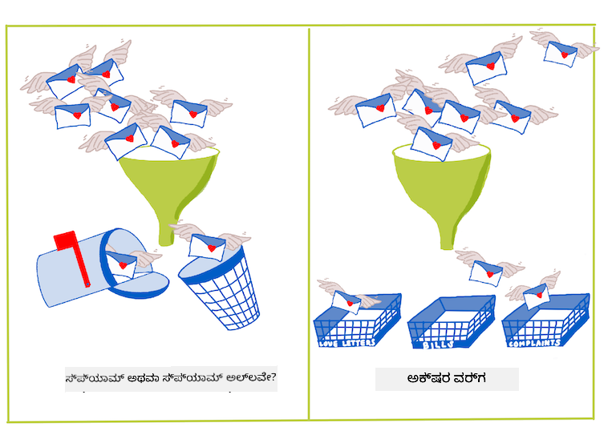
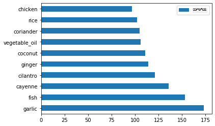
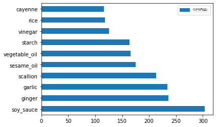
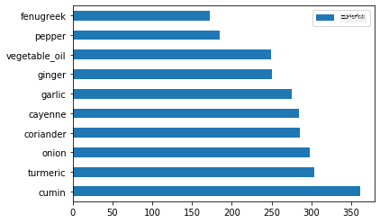
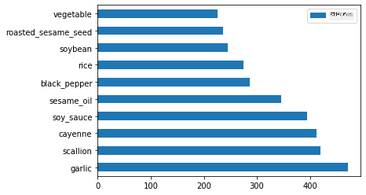

<!--
CO_OP_TRANSLATOR_METADATA:
{
  "original_hash": "aaf391d922bd6de5efba871d514c6d47",
  "translation_date": "2025-12-19T15:19:42+00:00",
  "source_file": "4-Classification/1-Introduction/README.md",
  "language_code": "kn"
}
-->
# ವರ್ಗೀಕರಣಕ್ಕೆ ಪರಿಚಯ

ಈ ನಾಲ್ಕು ಪಾಠಗಳಲ್ಲಿ, ನೀವು ಕ್ಲಾಸಿಕ್ ಮೆಷಿನ್ ಲರ್ನಿಂಗ್‌ನ ಮೂಲಭೂತ ಗಮನಾರ್ಹ ವಿಷಯವಾದ _ವರ್ಗೀಕರಣ_ ಅನ್ನು ಅನ್ವೇಷಿಸುವಿರಿ. ಏಷ್ಯಾ ಮತ್ತು ಭಾರತದಲ್ಲಿನ ಎಲ್ಲಾ ಅದ್ಭುತ ಆಹಾರಗಳ ಬಗ್ಗೆ ಡೇಟಾಸೆಟ್ ಬಳಸಿ ವಿವಿಧ ವರ್ಗೀಕರಣ ಆಲ್ಗಾರಿಥಮ್‌ಗಳನ್ನು ಹೇಗೆ ಬಳಸುವುದು ಎಂಬುದನ್ನು ನಾವು ನೋಡೋಣ. ನೀವು ಹಸಿವಾಗಿದ್ದೀರಾ ಎಂದು ಆಶಿಸುತ್ತೇವೆ!


> ಈ ಪಾಠಗಳಲ್ಲಿ ಪ್ಯಾನ್-ಏಷಿಯನ್ ಆಹಾರಗಳನ್ನು ಆಚರಿಸೋಣ! ಚಿತ್ರವನ್ನು [ಜೆನ್ ಲೂಪರ್](https://twitter.com/jenlooper) ನೀಡಿದ್ದಾರೆ

ವರ್ಗೀಕರಣವು [ನಿರೀಕ್ಷಿತ ಕಲಿಕೆ](https://wikipedia.org/wiki/Supervised_learning) ಎಂಬ ಒಂದು ರೂಪವಾಗಿದ್ದು, ಇದು ರಿಗ್ರೆಷನ್ ತಂತ್ರಜ್ಞಾನಗಳೊಂದಿಗೆ ಬಹಳ ಸಾಮ್ಯತೆ ಹೊಂದಿದೆ. ಮೆಷಿನ್ ಲರ್ನಿಂಗ್ ಎಂದರೆ ಡೇಟಾಸೆಟ್‌ಗಳನ್ನು ಬಳಸಿ ಮೌಲ್ಯಗಳು ಅಥವಾ ಹೆಸರುಗಳನ್ನು ಭವಿಷ್ಯವಾಣಿ ಮಾಡುವುದಾದರೆ, ವರ್ಗೀಕರಣ ಸಾಮಾನ್ಯವಾಗಿ ಎರಡು ಗುಂಪುಗಳಲ್ಲಿ ಬರುವುದಾಗಿದೆ: _ದ್ವೈತ ವರ್ಗೀಕರಣ_ ಮತ್ತು _ಬಹು-ವರ್ಗ ವರ್ಗೀಕರಣ_.

[](https://youtu.be/eg8DJYwdMyg "ವರ್ಗೀಕರಣಕ್ಕೆ ಪರಿಚಯ")

> 🎥 ಮೇಲಿನ ಚಿತ್ರವನ್ನು ಕ್ಲಿಕ್ ಮಾಡಿ ವೀಡಿಯೋ ನೋಡಿ: MIT ನ ಜಾನ್ ಗುಟ್ಟಾಗ್ ವರ್ಗೀಕರಣವನ್ನು ಪರಿಚಯಿಸುತ್ತಿದ್ದಾರೆ

ಸ್ಮರಣೆ:

- **ರೇಖೀಯ ರಿಗ್ರೆಷನ್** ನಿಮಗೆ ವ್ಯತ್ಯಾಸಗಳ ನಡುವಿನ ಸಂಬಂಧವನ್ನು ಭವಿಷ್ಯವಾಣಿ ಮಾಡಲು ಸಹಾಯ ಮಾಡಿತು ಮತ್ತು ಹೊಸ ಡೇಟಾಪಾಯಿಂಟ್ ಆ ರೇಖೆಯ ಸಂಬಂಧದಲ್ಲಿ ಎಲ್ಲಿ ಬಿದ್ದೀತು ಎಂಬುದನ್ನು ನಿಖರವಾಗಿ ಊಹಿಸಲು ಸಹಾಯ ಮಾಡಿತು. ಉದಾಹರಣೆಗೆ, _ಸೆಪ್ಟೆಂಬರ್ ಮತ್ತು ಡಿಸೆಂಬರ್‌ನಲ್ಲಿ ಕಂಬಳಿಯ ಬೆಲೆ ಏನು ಇರುತ್ತದೆ_ ಎಂದು ಊಹಿಸಬಹುದು.
- **ಲಾಗಿಸ್ಟಿಕ್ ರಿಗ್ರೆಷನ್** ನಿಮಗೆ "ದ್ವೈತ ವರ್ಗಗಳು" ಅನ್ನು ಕಂಡುಹಿಡಿಯಲು ಸಹಾಯ ಮಾಡಿತು: ಈ ಬೆಲೆ ಮಟ್ಟದಲ್ಲಿ, _ಈ ಕಂಬಳಿ ಕಿತ್ತಳೆ ಬಣ್ಣದದೆಯೇ ಅಥವಾ ಅಲ್ಲವೇ_?

ವರ್ಗೀಕರಣವು ಡೇಟಾ ಪಾಯಿಂಟ್‌ನ ಲೇಬಲ್ ಅಥವಾ ವರ್ಗವನ್ನು ನಿರ್ಧರಿಸಲು ವಿವಿಧ ಆಲ್ಗಾರಿಥಮ್‌ಗಳನ್ನು ಬಳಸುತ್ತದೆ. ಈ ಆಹಾರ ಡೇಟಾ ಬಳಸಿ, ಒಂದು ಗುಂಪಿನ ಪದಾರ್ಥಗಳನ್ನು ಗಮನಿಸಿ ಅದರ ಮೂಲ ಆಹಾರವನ್ನು ನಿರ್ಧರಿಸಬಹುದೇ ಎಂದು ನೋಡೋಣ.

## [ಪೂರ್ವ-ಪಾಠ ಕ್ವಿಜ್](https://ff-quizzes.netlify.app/en/ml/)

> ### [ಈ ಪಾಠ R ನಲ್ಲಿ ಲಭ್ಯವಿದೆ!](../../../../4-Classification/1-Introduction/solution/R/lesson_10.html)

### ಪರಿಚಯ

ವರ್ಗೀಕರಣವು ಮೆಷಿನ್ ಲರ್ನಿಂಗ್ ಸಂಶೋಧಕ ಮತ್ತು ಡೇಟಾ ವಿಜ್ಞಾನಿಯ ಮೂಲಭೂತ ಚಟುವಟಿಕೆಗಳಲ್ಲಿ ಒಂದಾಗಿದೆ. ಒಂದು ದ್ವೈತ ಮೌಲ್ಯದ ಮೂಲಭೂತ ವರ್ಗೀಕರಣದಿಂದ ("ಈ ಇಮೇಲ್ ಸ್ಪ್ಯಾಮ್ ಆಗಿದೆಯೇ ಇಲ್ಲವೇ?") ಆರಂಭಿಸಿ, ಸಂಕೀರ್ಣ ಚಿತ್ರ ವರ್ಗೀಕರಣ ಮತ್ತು ವಿಭಾಗೀಕರಣದವರೆಗೆ, ಡೇಟಾವನ್ನು ವರ್ಗಗಳಲ್ಲಿ ವಿಂಗಡಿಸಿ ಅದರಲ್ಲಿ ಪ್ರಶ್ನೆಗಳನ್ನು ಕೇಳುವುದು ಸದಾ ಉಪಯುಕ್ತ.

ವಿಜ್ಞಾನಾತ್ಮಕವಾಗಿ ಹೇಳುವುದಾದರೆ, ನಿಮ್ಮ ವರ್ಗೀಕರಣ ವಿಧಾನವು ಇನ್ಪುಟ್ ವ್ಯತ್ಯಾಸಗಳ ಮತ್ತು ಔಟ್‌ಪುಟ್ ವ್ಯತ್ಯಾಸಗಳ ನಡುವಿನ ಸಂಬಂಧವನ್ನು ನಕ್ಷೆ ಮಾಡಲು ಸಾಧ್ಯವಾಗುವ ಭವಿಷ್ಯವಾಣಿ ಮಾದರಿಯನ್ನು ರಚಿಸುತ್ತದೆ.



> ವರ್ಗೀಕರಣ ಆಲ್ಗಾರಿಥಮ್‌ಗಳು ನಿಭಾಯಿಸಬೇಕಾದ ದ್ವೈತ ಮತ್ತು ಬಹು-ವರ್ಗ ಸಮಸ್ಯೆಗಳು. ಇನ್ಫೋಗ್ರಾಫಿಕ್ [ಜೆನ್ ಲೂಪರ್](https://twitter.com/jenlooper) ಅವರಿಂದ

ನಮ್ಮ ಡೇಟಾವನ್ನು ಸ್ವಚ್ಛಗೊಳಿಸುವುದು, ದೃಶ್ಯೀಕರಣ ಮಾಡುವುದು ಮತ್ತು ML ಕಾರ್ಯಗಳಿಗೆ ಸಿದ್ಧಪಡಿಸುವ ಪ್ರಕ್ರಿಯೆಯನ್ನು ಪ್ರಾರಂಭಿಸುವ ಮೊದಲು, ಮೆಷಿನ್ ಲರ್ನಿಂಗ್ ಡೇಟಾವನ್ನು ವರ್ಗೀಕರಿಸಲು ಬಳಸಬಹುದಾದ ವಿವಿಧ ವಿಧಾನಗಳನ್ನು ತಿಳಿದುಕೊಳ್ಳೋಣ.

[ಸಂಖ್ಯಾಶಾಸ್ತ್ರ](https://wikipedia.org/wiki/Statistical_classification)ದಿಂದ ಪಡೆದ, ಕ್ಲಾಸಿಕ್ ಮೆಷಿನ್ ಲರ್ನಿಂಗ್ ಬಳಸಿ ವರ್ಗೀಕರಣವು `smoker`, `weight`, ಮತ್ತು `age` ಮುಂತಾದ ಲಕ್ಷಣಗಳನ್ನು ಬಳಸಿಕೊಂಡು _X ರೋಗದ ಸಂಭವನೀಯತೆ_ ಅನ್ನು ನಿರ್ಧರಿಸುತ್ತದೆ. ನೀವು ಹಿಂದಿನ ರಿಗ್ರೆಷನ್ ಅಭ್ಯಾಸಗಳಲ್ಲಿ ಮಾಡಿದಂತೆ, ನಿಮ್ಮ ಡೇಟಾ ಲೇಬಲ್ ಮಾಡಲ್ಪಟ್ಟಿದ್ದು, ML ಆಲ್ಗಾರಿಥಮ್‌ಗಳು ಆ ಲೇಬಲ್‌ಗಳನ್ನು ಬಳಸಿ ಡೇಟಾಸೆಟ್‌ನ ವರ್ಗಗಳನ್ನು (ಅಥವಾ 'ಲಕ್ಷಣಗಳನ್ನು') ವರ್ಗೀಕರಿಸಿ, ಅವುಗಳನ್ನು ಗುಂಪು ಅಥವಾ ಫಲಿತಾಂಶಕ್ಕೆ ನಿಯೋಜಿಸುತ್ತವೆ.

✅ ಆಹಾರಗಳ ಬಗ್ಗೆ ಒಂದು ಡೇಟಾಸೆಟ್ ಅನ್ನು ಕಲ್ಪಿಸಿ. ಬಹು-ವರ್ಗ ಮಾದರಿ ಯಾವ ಪ್ರಶ್ನೆಗಳಿಗೆ ಉತ್ತರ ನೀಡಬಹುದು? ದ್ವೈತ ಮಾದರಿ ಯಾವ ಪ್ರಶ್ನೆಗಳಿಗೆ ಉತ್ತರ ನೀಡಬಹುದು? ನೀವು ಒಂದು ನಿರ್ದಿಷ್ಟ ಆಹಾರದಲ್ಲಿ ಮೆಂತ್ಯು ಬಳಕೆಯಾಗುವ ಸಾಧ್ಯತೆಯನ್ನು ನಿರ್ಧರಿಸಲು ಬಯಸಿದರೆ? ಸ್ಟಾರ್ ಅನೀಸ್, ಆರ್ಟಿಚೋಕ್, ಹೂಕೋಸು ಮತ್ತು ಹರ್ಸರಡಿಷ್ ತುಂಬಿದ ಗ್ರೋಸರಿ ಬ್ಯಾಗ್ ಇದ್ದಾಗ, ನೀವು ಸಾಮಾನ್ಯ ಭಾರತೀಯ ವಾನಗಿಯನ್ನು ರಚಿಸಬಹುದೇ ಎಂದು ನೋಡಲು ಬಯಸಿದರೆ?

[](https://youtu.be/GuTeDbaNoEU "ಅದ್ಭುತ ರಹಸ್ಯ ಬಾಸ್ಕೆಟ್‌ಗಳು")

> 🎥 ಮೇಲಿನ ಚಿತ್ರವನ್ನು ಕ್ಲಿಕ್ ಮಾಡಿ ವೀಡಿಯೋ ನೋಡಿ. 'ಚಾಪ್ಡ್' ಶೋಯಿನ ಪೂರ್ಣ ತತ್ವವೇ 'ರಹಸ್ಯ ಬಾಸ್ಕೆಟ್' ಆಗಿದ್ದು, ಅಲ್ಲಿ ಶೆಫ್ಗಳು ಯಾದೃಚ್ಛಿಕ ಪದಾರ್ಥಗಳಿಂದ ಒಂದು ವಾನಗಿಯನ್ನು ತಯಾರಿಸಬೇಕು. ಖಂಡಿತವಾಗಿ ML ಮಾದರಿ ಸಹಾಯ ಮಾಡಿತ್ತೇ!

## ನಮಸ್ಕಾರ 'ವರ್ಗೀಕರಣಕಾರ'

ನಾವು ಈ ಆಹಾರ ಡೇಟಾಸೆಟ್‌ನಿಂದ ಕೇಳಬೇಕಾದ ಪ್ರಶ್ನೆ ವಾಸ್ತವದಲ್ಲಿ **ಬಹು-ವರ್ಗ ಪ್ರಶ್ನೆ** ಆಗಿದ್ದು, ನಾವು ಹಲವಾರು ರಾಷ್ಟ್ರೀಯ ಆಹಾರಗಳನ್ನು ಹೊಂದಿದ್ದೇವೆ. ಪದಾರ್ಥಗಳ ಒಂದು ಬ್ಯಾಚ್ ನೀಡಿದಾಗ, ಈ ಅನೇಕ ವರ್ಗಗಳಲ್ಲಿ ಯಾವುದು ಡೇಟಾಗೆ ಹೊಂದಿಕೆಯಾಗುತ್ತದೆ?

ಸ್ಕೈಕಿಟ್-ಲರ್ನ್ ವಿವಿಧ ಸಮಸ್ಯೆಗಳ ಪ್ರಕಾರ ಡೇಟಾವನ್ನು ವರ್ಗೀಕರಿಸಲು ಹಲವಾರು ಆಲ್ಗಾರಿಥಮ್‌ಗಳನ್ನು ನೀಡುತ್ತದೆ. ಮುಂದಿನ ಎರಡು ಪಾಠಗಳಲ್ಲಿ ನೀವು ಈ ಆಲ್ಗಾರಿಥಮ್‌ಗಳ ಬಗ್ಗೆ ತಿಳಿಯುವಿರಿ.

## ಅಭ್ಯಾಸ - ನಿಮ್ಮ ಡೇಟಾವನ್ನು ಸ್ವಚ್ಛಗೊಳಿಸಿ ಮತ್ತು ಸಮತೋಲಗೊಳಿಸಿ

ಈ ಯೋಜನೆಯನ್ನು ಪ್ರಾರಂಭಿಸುವ ಮೊದಲು ಮೊದಲ ಕಾರ್ಯವೆಂದರೆ ನಿಮ್ಮ ಡೇಟಾವನ್ನು ಸ್ವಚ್ಛಗೊಳಿಸಿ ಮತ್ತು ಉತ್ತಮ ಫಲಿತಾಂಶಗಳಿಗಾಗಿ **ಸಮತೋಲಗೊಳಿಸುವುದು**. ಈ ಫೋಲ್ಡರ್‌ನ ರೂಟ್‌ನಲ್ಲಿ ಇರುವ ಖಾಲಿ _notebook.ipynb_ ಫೈಲ್‌ನಿಂದ ಪ್ರಾರಂಭಿಸಿ.

ಮೊದಲಿಗೆ ಸ್ಥಾಪಿಸಬೇಕಾದದ್ದು [imblearn](https://imbalanced-learn.org/stable/) ಆಗಿದೆ. ಇದು ಸ್ಕೈಕಿಟ್-ಲರ್ನ್ ಪ್ಯಾಕೇಜ್ ಆಗಿದ್ದು, ಡೇಟಾವನ್ನು ಉತ್ತಮವಾಗಿ ಸಮತೋಲಗೊಳಿಸಲು ಸಹಾಯ ಮಾಡುತ್ತದೆ (ನೀವು ಈ ಕಾರ್ಯವನ್ನು ಸ್ವಲ್ಪ ನಂತರ ತಿಳಿಯುವಿರಿ).

1. `imblearn` ಅನ್ನು ಸ್ಥಾಪಿಸಲು, ಈ ಕೆಳಗಿನಂತೆ `pip install` ಅನ್ನು ರನ್ ಮಾಡಿ:

    ```python
    pip install imblearn
    ```

1. ನಿಮ್ಮ ಡೇಟಾವನ್ನು ಆಮದುಮಾಡಲು ಮತ್ತು ದೃಶ್ಯೀಕರಿಸಲು ಬೇಕಾದ ಪ್ಯಾಕೇಜ್‌ಗಳನ್ನು ಆಮದುಮಾಡಿ, ಜೊತೆಗೆ `imblearn` ನಿಂದ `SMOTE` ಅನ್ನು ಆಮದುಮಾಡಿ.

    ```python
    import pandas as pd
    import matplotlib.pyplot as plt
    import matplotlib as mpl
    import numpy as np
    from imblearn.over_sampling import SMOTE
    ```

    ಈಗ ನೀವು ಮುಂದಿನ ಹಂತದಲ್ಲಿ ಡೇಟಾವನ್ನು ಆಮದುಮಾಡಲು ಸಿದ್ಧರಾಗಿದ್ದೀರಿ.

1. ಮುಂದಿನ ಕಾರ್ಯವೆಂದರೆ ಡೇಟಾವನ್ನು ಆಮದುಮಾಡುವುದು:

    ```python
    df  = pd.read_csv('../data/cuisines.csv')
    ```

   `read_csv()` ಬಳಸಿ _cusines.csv_ ಫೈಲ್‌ನ ವಿಷಯವನ್ನು ಓದಿ `df` ಎಂಬ ಚರದಲ್ಲಿ ಇಡುತ್ತದೆ.

1. ಡೇಟಾದ ಆಕಾರವನ್ನು ಪರಿಶೀಲಿಸಿ:

    ```python
    df.head()
    ```

   ಮೊದಲ ಐದು ಸಾಲುಗಳು ಹೀಗೆ ಕಾಣಿಸುತ್ತವೆ:

    ```output
    |     | Unnamed: 0 | cuisine | almond | angelica | anise | anise_seed | apple | apple_brandy | apricot | armagnac | ... | whiskey | white_bread | white_wine | whole_grain_wheat_flour | wine | wood | yam | yeast | yogurt | zucchini |
    | --- | ---------- | ------- | ------ | -------- | ----- | ---------- | ----- | ------------ | ------- | -------- | --- | ------- | ----------- | ---------- | ----------------------- | ---- | ---- | --- | ----- | ------ | -------- |
    | 0   | 65         | indian  | 0      | 0        | 0     | 0          | 0     | 0            | 0       | 0        | ... | 0       | 0           | 0          | 0                       | 0    | 0    | 0   | 0     | 0      | 0        |
    | 1   | 66         | indian  | 1      | 0        | 0     | 0          | 0     | 0            | 0       | 0        | ... | 0       | 0           | 0          | 0                       | 0    | 0    | 0   | 0     | 0      | 0        |
    | 2   | 67         | indian  | 0      | 0        | 0     | 0          | 0     | 0            | 0       | 0        | ... | 0       | 0           | 0          | 0                       | 0    | 0    | 0   | 0     | 0      | 0        |
    | 3   | 68         | indian  | 0      | 0        | 0     | 0          | 0     | 0            | 0       | 0        | ... | 0       | 0           | 0          | 0                       | 0    | 0    | 0   | 0     | 0      | 0        |
    | 4   | 69         | indian  | 0      | 0        | 0     | 0          | 0     | 0            | 0       | 0        | ... | 0       | 0           | 0          | 0                       | 0    | 0    | 0   | 0     | 1      | 0        |
    ```

1. `info()` ಅನ್ನು ಕರೆಸಿ ಈ ಡೇಟಾ ಬಗ್ಗೆ ಮಾಹಿತಿ ಪಡೆಯಿರಿ:

    ```python
    df.info()
    ```

    ನಿಮ್ಮ ಔಟ್‌ಪುಟ್ ಹೀಗೆ ಕಾಣುತ್ತದೆ:

    ```output
    <class 'pandas.core.frame.DataFrame'>
    RangeIndex: 2448 entries, 0 to 2447
    Columns: 385 entries, Unnamed: 0 to zucchini
    dtypes: int64(384), object(1)
    memory usage: 7.2+ MB
    ```

## ಅಭ್ಯಾಸ - ಆಹಾರಗಳ ಬಗ್ಗೆ ತಿಳಿದುಕೊಳ್ಳುವುದು

ಈಗ ಕೆಲಸ ಇನ್ನಷ್ಟು ಆಸಕ್ತಿದಾಯಕವಾಗುತ್ತದೆ. ಪ್ರತಿ ಆಹಾರದ ಪ್ರಕಾರ ಡೇಟಾ ಹಂಚಿಕೆಯನ್ನು ಕಂಡುಹಿಡಿಯೋಣ

1. `barh()` ಅನ್ನು ಕರೆಸಿ ಡೇಟಾವನ್ನು ಬಾರ್‌ಗಳಾಗಿ ಚಿತ್ರಿಸಿ:

    ```python
    df.cuisine.value_counts().plot.barh()
    ```

    

    ಆಹಾರಗಳ ಸಂಖ್ಯೆ ಸೀಮಿತವಾಗಿದೆ, ಆದರೆ ಡೇಟಾ ಹಂಚಿಕೆ ಅಸಮಾನವಾಗಿದೆ. ನೀವು ಅದನ್ನು ಸರಿಪಡಿಸಬಹುದು! ಅದನ್ನು ಮಾಡುವ ಮೊದಲು, ಸ್ವಲ್ಪ ಹೆಚ್ಚು ಅನ್ವೇಷಿಸಿ.

1. ಪ್ರತಿ ಆಹಾರದ ಪ್ರಕಾರ ಎಷ್ಟು ಡೇಟಾ ಇದೆ ಎಂದು ಕಂಡುಹಿಡಿದು ಅದನ್ನು ಮುದ್ರಿಸಿ:

    ```python
    thai_df = df[(df.cuisine == "thai")]
    japanese_df = df[(df.cuisine == "japanese")]
    chinese_df = df[(df.cuisine == "chinese")]
    indian_df = df[(df.cuisine == "indian")]
    korean_df = df[(df.cuisine == "korean")]
    
    print(f'thai df: {thai_df.shape}')
    print(f'japanese df: {japanese_df.shape}')
    print(f'chinese df: {chinese_df.shape}')
    print(f'indian df: {indian_df.shape}')
    print(f'korean df: {korean_df.shape}')
    ```

    ಔಟ್‌ಪುಟ್ ಹೀಗೆ ಕಾಣುತ್ತದೆ:

    ```output
    thai df: (289, 385)
    japanese df: (320, 385)
    chinese df: (442, 385)
    indian df: (598, 385)
    korean df: (799, 385)
    ```

## ಪದಾರ್ಥಗಳನ್ನು ಕಂಡುಹಿಡಿಯುವುದು

ಈಗ ನೀವು ಡೇಟಾದಲ್ಲಿ ಇನ್ನಷ್ಟು ಆಳವಾಗಿ ಹೋಗಿ ಪ್ರತಿ ಆಹಾರದ ಪ್ರಕಾರ ಸಾಮಾನ್ಯ ಪದಾರ್ಥಗಳು ಯಾವುವು ಎಂದು ತಿಳಿದುಕೊಳ್ಳಬಹುದು. ಆಹಾರಗಳ ನಡುವೆ ಗೊಂದಲ ಉಂಟುಮಾಡುವ ಪುನರಾವರ್ತಿತ ಡೇಟಾವನ್ನು ಸ್ವಚ್ಛಗೊಳಿಸಬೇಕು, ಆದ್ದರಿಂದ ಈ ಸಮಸ್ಯೆಯ ಬಗ್ಗೆ ತಿಳಿಯೋಣ.

1. ಪೈಥಾನ್‌ನಲ್ಲಿ `create_ingredient()` ಎಂಬ ಫಂಕ್ಷನ್ ರಚಿಸಿ, ಇದು ಒಂದು ಪದಾರ್ಥ ಡೇಟಾಫ್ರೇಮ್ ರಚಿಸುತ್ತದೆ. ಈ ಫಂಕ್ಷನ್ ಒಂದು ಅನಗತ್ಯ ಕಾಲಮ್ ಅನ್ನು ತೆಗೆದುಹಾಕಿ, ಪದಾರ್ಥಗಳನ್ನು ಅವರ ಎಣಿಕೆಯ ಪ್ರಕಾರ ವಿಂಗಡಿಸುತ್ತದೆ:

    ```python
    def create_ingredient_df(df):
        ingredient_df = df.T.drop(['cuisine','Unnamed: 0']).sum(axis=1).to_frame('value')
        ingredient_df = ingredient_df[(ingredient_df.T != 0).any()]
        ingredient_df = ingredient_df.sort_values(by='value', ascending=False,
        inplace=False)
        return ingredient_df
    ```

   ಈಗ ನೀವು ಆ ಫಂಕ್ಷನ್ ಅನ್ನು ಬಳಸಿ ಪ್ರತಿ ಆಹಾರದ ಪ್ರಕಾರ ಟಾಪ್ ಹತ್ತು ಜನಪ್ರಿಯ ಪದಾರ್ಥಗಳ ಬಗ್ಗೆ ತಿಳಿದುಕೊಳ್ಳಬಹುದು.

1. `create_ingredient()` ಅನ್ನು ಕರೆಸಿ ಮತ್ತು `barh()` ಅನ್ನು ಕರೆಸಿ ಚಿತ್ರಿಸಿ:

    ```python
    thai_ingredient_df = create_ingredient_df(thai_df)
    thai_ingredient_df.head(10).plot.barh()
    ```

    

1. ಜಪಾನೀಸ್ ಡೇಟಾ ಬಗ್ಗೆ ಅದೇ ರೀತಿಯಲ್ಲಿ ಮಾಡಿ:

    ```python
    japanese_ingredient_df = create_ingredient_df(japanese_df)
    japanese_ingredient_df.head(10).plot.barh()
    ```

    

1. ಈಗ ಚೈನೀಸ್ ಪದಾರ್ಥಗಳಿಗಾಗಿ:

    ```python
    chinese_ingredient_df = create_ingredient_df(chinese_df)
    chinese_ingredient_df.head(10).plot.barh()
    ```

    

1. ಇಂಡಿಯನ್ ಪದಾರ್ಥಗಳನ್ನು ಚಿತ್ರಿಸಿ:

    ```python
    indian_ingredient_df = create_ingredient_df(indian_df)
    indian_ingredient_df.head(10).plot.barh()
    ```

    

1. ಕೊನೆಗೆ, ಕೊರಿಯನ್ ಪದಾರ್ಥಗಳನ್ನು ಚಿತ್ರಿಸಿ:

    ```python
    korean_ingredient_df = create_ingredient_df(korean_df)
    korean_ingredient_df.head(10).plot.barh()
    ```

    

1. ಈಗ, ವಿಭಿನ್ನ ಆಹಾರಗಳ ನಡುವೆ ಗೊಂದಲ ಉಂಟುಮಾಡುವ ಅತ್ಯಂತ ಸಾಮಾನ್ಯ ಪದಾರ್ಥಗಳನ್ನು `drop()` ಅನ್ನು ಕರೆಸಿ ತೆಗೆದುಹಾಕಿ:

   ಎಲ್ಲರೂ ಅಕ್ಕಿಯನ್ನು, ಬೆಳ್ಳುಳ್ಳಿ ಮತ್ತು ಶುಂಠಿಯನ್ನು ಇಷ್ಟಪಡುತ್ತಾರೆ!

    ```python
    feature_df= df.drop(['cuisine','Unnamed: 0','rice','garlic','ginger'], axis=1)
    labels_df = df.cuisine #.ಅನನ್ಯ()
    feature_df.head()
    ```

## ಡೇಟಾಸೆಟ್ ಸಮತೋಲಗೊಳಿಸಿ

ನೀವು ಡೇಟಾವನ್ನು ಸ್ವಚ್ಛಗೊಳಿಸಿದ ನಂತರ, [SMOTE](https://imbalanced-learn.org/dev/references/generated/imblearn.over_sampling.SMOTE.html) - "ಸಿಂಥೆಟಿಕ್ ಮೈನಾರಿಟಿ ಓವರ್-ಸ್ಯಾಂಪ್ಲಿಂಗ್ ತಂತ್ರ" - ಬಳಸಿ ಅದನ್ನು ಸಮತೋಲಗೊಳಿಸಿ.

1. `fit_resample()` ಅನ್ನು ಕರೆಸಿ, ಈ ತಂತ್ರವು ಇಂಟರ್‌ಪೋಲೇಶನ್ ಮೂಲಕ ಹೊಸ ಮಾದರಿಗಳನ್ನು ರಚಿಸುತ್ತದೆ.

    ```python
    oversample = SMOTE()
    transformed_feature_df, transformed_label_df = oversample.fit_resample(feature_df, labels_df)
    ```

    ನಿಮ್ಮ ಡೇಟಾವನ್ನು ಸಮತೋಲಗೊಳಿಸುವ ಮೂಲಕ, ನೀವು ಅದನ್ನು ವರ್ಗೀಕರಿಸುವಾಗ ಉತ್ತಮ ಫಲಿತಾಂಶಗಳನ್ನು ಪಡೆಯುತ್ತೀರಿ. ದ್ವೈತ ವರ್ಗೀಕರಣವನ್ನು ಯೋಚಿಸಿ. ನಿಮ್ಮ ಡೇಟಾದ ಬಹುಮತವು ಒಂದು ವರ್ಗವಾಗಿದ್ದರೆ, ML ಮಾದರಿ ಆ ವರ್ಗವನ್ನು ಹೆಚ್ಚು ಬಾರಿ ಭವಿಷ್ಯವಾಣಿ ಮಾಡುತ್ತದೆ, ಏಕೆಂದರೆ ಅದಕ್ಕೆ ಹೆಚ್ಚು ಡೇಟಾ ಇದೆ. ಡೇಟಾ ಸಮತೋಲಗೊಳಿಸುವುದು ಯಾವುದೇ ತಿರುವು ಹೊಂದಿದ ಡೇಟಾವನ್ನು ತೆಗೆದುಹಾಕಿ ಈ ಅಸಮತೋಲನವನ್ನು ನಿವಾರಿಸುತ್ತದೆ.

1. ಈಗ ನೀವು ಪದಾರ್ಥ ಪ್ರತಿ ಲೇಬಲ್‌ಗಳ ಸಂಖ್ಯೆಯನ್ನು ಪರಿಶೀಲಿಸಬಹುದು:

    ```python
    print(f'new label count: {transformed_label_df.value_counts()}')
    print(f'old label count: {df.cuisine.value_counts()}')
    ```

    ನಿಮ್ಮ ಔಟ್‌ಪುಟ್ ಹೀಗೆ ಕಾಣುತ್ತದೆ:

    ```output
    new label count: korean      799
    chinese     799
    indian      799
    japanese    799
    thai        799
    Name: cuisine, dtype: int64
    old label count: korean      799
    indian      598
    chinese     442
    japanese    320
    thai        289
    Name: cuisine, dtype: int64
    ```

    ಡೇಟಾ ಚೆನ್ನಾಗಿ ಸ್ವಚ್ಛ, ಸಮತೋಲಿತ ಮತ್ತು ಬಹಳ ರುಚಿಕರವಾಗಿದೆ!

1. ಕೊನೆಯ ಹಂತವೆಂದರೆ ನಿಮ್ಮ ಸಮತೋಲಿತ ಡೇಟಾವನ್ನು, ಲೇಬಲ್‌ಗಳು ಮತ್ತು ಲಕ್ಷಣಗಳನ್ನು ಒಳಗೊಂಡಂತೆ, ಹೊಸ ಡೇಟಾಫ್ರೇಮ್‌ಗೆ ಉಳಿಸಿ, ಅದನ್ನು ಫೈಲ್‌ಗೆ ರಫ್ತು ಮಾಡಬಹುದು:

    ```python
    transformed_df = pd.concat([transformed_label_df,transformed_feature_df],axis=1, join='outer')
    ```

1. `transformed_df.head()` ಮತ್ತು `transformed_df.info()` ಬಳಸಿ ಡೇಟಾವನ್ನು ಮತ್ತೊಮ್ಮೆ ಪರಿಶೀಲಿಸಬಹುದು. ಭವಿಷ್ಯದ ಪಾಠಗಳಲ್ಲಿ ಬಳಸಲು ಈ ಡೇಟಾ ನಕಲನ್ನು ಉಳಿಸಿ:

    ```python
    transformed_df.head()
    transformed_df.info()
    transformed_df.to_csv("../data/cleaned_cuisines.csv")
    ```

    ಈ ಹೊಸ CSV ಈಗ ರೂಟ್ ಡೇಟಾ ಫೋಲ್ಡರ್‌ನಲ್ಲಿ ದೊರೆಯುತ್ತದೆ.

---

## 🚀ಸವಾಲು

ಈ ಪಠ್ಯಕ್ರಮದಲ್ಲಿ ಹಲವಾರು ಆಸಕ್ತಿದಾಯಕ ಡೇಟಾಸೆಟ್‌ಗಳಿವೆ. `data` ಫೋಲ್ಡರ್‌ಗಳನ್ನು ಪರಿಶೀಲಿಸಿ, ಯಾವುದು ದ್ವೈತ ಅಥವಾ ಬಹು-ವರ್ಗ ವರ್ಗೀಕರಣಕ್ಕೆ ಸೂಕ್ತವಾಗಿರಬಹುದು? ನೀವು ಆ ಡೇಟಾಸೆಟ್‌ನಿಂದ ಯಾವ ಪ್ರಶ್ನೆಗಳನ್ನು ಕೇಳುತ್ತೀರಿ?

## [ಪೋಸ್ಟ್-ಪಾಠ ಕ್ವಿಜ್](https://ff-quizzes.netlify.app/en/ml/)

## ವಿಮರ್ಶೆ ಮತ್ತು ಸ್ವಯಂ ಅಧ್ಯಯನ

SMOTE ನ API ಅನ್ನು ಅನ್ವೇಷಿಸಿ. ಯಾವ ಬಳಕೆ ಪ್ರಕರಣಗಳಿಗೆ ಇದು ಅತ್ಯುತ್ತಮ? ಯಾವ ಸಮಸ್ಯೆಗಳನ್ನು ಇದು ಪರಿಹರಿಸುತ್ತದೆ?

## ನಿಯೋಜನೆ

[ವರ್ಗೀಕರಣ ವಿಧಾನಗಳನ್ನು ಅನ್ವೇಷಿಸಿ](assignment.md)

---

<!-- CO-OP TRANSLATOR DISCLAIMER START -->
**ಅಸ್ವೀಕಾರ**:  
ಈ ದಸ್ತಾವೇಜು AI ಅನುವಾದ ಸೇವೆ [Co-op Translator](https://github.com/Azure/co-op-translator) ಬಳಸಿ ಅನುವಾದಿಸಲಾಗಿದೆ. ನಾವು ನಿಖರತೆಯಿಗಾಗಿ ಪ್ರಯತ್ನಿಸುತ್ತಿದ್ದರೂ, ಸ್ವಯಂಚಾಲಿತ ಅನುವಾದಗಳಲ್ಲಿ ತಪ್ಪುಗಳು ಅಥವಾ ಅಸತ್ಯತೆಗಳು ಇರಬಹುದು ಎಂದು ದಯವಿಟ್ಟು ಗಮನಿಸಿ. ಮೂಲ ಭಾಷೆಯಲ್ಲಿರುವ ಮೂಲ ದಸ್ತಾವೇಜನ್ನು ಅಧಿಕೃತ ಮೂಲವೆಂದು ಪರಿಗಣಿಸಬೇಕು. ಮಹತ್ವದ ಮಾಹಿತಿಗಾಗಿ, ವೃತ್ತಿಪರ ಮಾನವ ಅನುವಾದವನ್ನು ಶಿಫಾರಸು ಮಾಡಲಾಗುತ್ತದೆ. ಈ ಅನುವಾದ ಬಳಕೆಯಿಂದ ಉಂಟಾಗುವ ಯಾವುದೇ ತಪ್ಪು ಅರ್ಥಮಾಡಿಕೊಳ್ಳುವಿಕೆ ಅಥವಾ ತಪ್ಪು ವಿವರಣೆಗಳಿಗೆ ನಾವು ಹೊಣೆಗಾರರಾಗುವುದಿಲ್ಲ.
<!-- CO-OP TRANSLATOR DISCLAIMER END -->