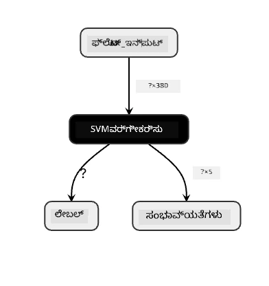
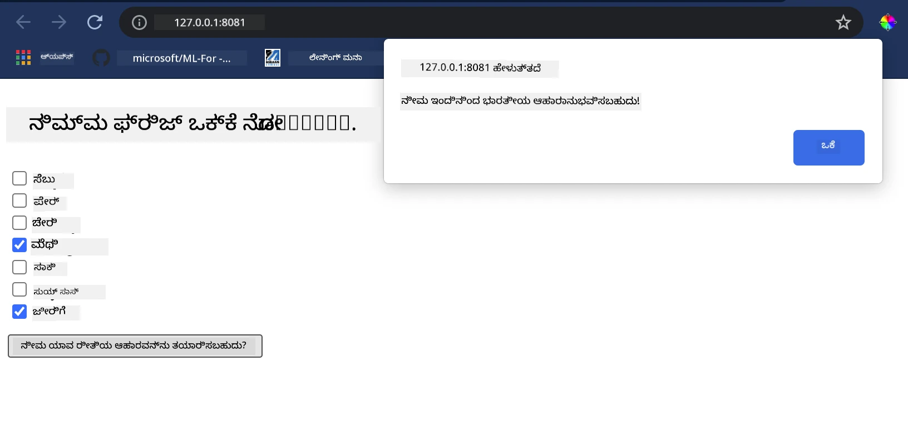

<!--
CO_OP_TRANSLATOR_METADATA:
{
  "original_hash": "61bdec27ed2da8b098cd9065405d9bb0",
  "translation_date": "2025-12-19T15:28:29+00:00",
  "source_file": "4-Classification/4-Applied/README.md",
  "language_code": "kn"
}
-->
# ರುಚಿಕರ ಆಹಾರ ಶಿಫಾರಸು ವೆಬ್ ಅಪ್ಲಿಕೇಶನ್ ನಿರ್ಮಿಸಿ

ಈ ಪಾಠದಲ್ಲಿ, ನೀವು ಹಿಂದಿನ ಪಾಠಗಳಲ್ಲಿ ಕಲಿತ ಕೆಲವು ತಂತ್ರಗಳನ್ನು ಬಳಸಿಕೊಂಡು ವರ್ಗೀಕರಣ ಮಾದರಿಯನ್ನು ನಿರ್ಮಿಸುವಿರಿ ಮತ್ತು ಈ ಸರಣಿಯಲ್ಲಿ ಬಳಸಲಾದ ರುಚಿಕರ ಆಹಾರ ಡೇಟಾಸೆಟ್‌ನೊಂದಿಗೆ. ಜೊತೆಗೆ, ನೀವು ಉಳಿಸಿದ ಮಾದರಿಯನ್ನು ಬಳಸಲು ಒಂದು ಸಣ್ಣ ವೆಬ್ ಅಪ್ಲಿಕೇಶನ್ ಅನ್ನು Onnx ನ ವೆಬ್ ರನ್‌ಟೈಮ್ ಅನ್ನು ಉಪಯೋಗಿಸಿ ನಿರ್ಮಿಸುವಿರಿ.

ಯಂತ್ರ ಅಧ್ಯಯನದ ಅತ್ಯಂತ ಉಪಯುಕ್ತ ಪ್ರಾಯೋಗಿಕ ಬಳಕೆಗಳಲ್ಲಿ ಒಂದಾಗಿದೆ ಶಿಫಾರಸು ವ್ಯವಸ್ಥೆಗಳನ್ನು ನಿರ್ಮಿಸುವುದು, ಮತ್ತು ನೀವು ಇಂದು ಆ ದಿಕ್ಕಿನಲ್ಲಿ ಮೊದಲ ಹೆಜ್ಜೆ ಇಡಬಹುದು!

[](https://youtu.be/17wdM9AHMfg "Applied ML")

> 🎥 ಮೇಲಿನ ಚಿತ್ರವನ್ನು ಕ್ಲಿಕ್ ಮಾಡಿ ವೀಡಿಯೋ ನೋಡಿ: ಜೆನ್ ಲೂಪರ್ ವರ್ಗೀಕೃತ ಆಹಾರ ಡೇಟಾ ಬಳಸಿ ವೆಬ್ ಅಪ್ಲಿಕೇಶನ್ ನಿರ್ಮಿಸುತ್ತಿದ್ದಾರೆ

## [ಪೂರ್ವ-ಪಾಠ ಕ್ವಿಜ್](https://ff-quizzes.netlify.app/en/ml/)

ಈ ಪಾಠದಲ್ಲಿ ನೀವು ಕಲಿಯುವಿರಿ:

- ಮಾದರಿಯನ್ನು ನಿರ್ಮಿಸಿ Onnx ಮಾದರಿಯಾಗಿ ಉಳಿಸುವುದು ಹೇಗೆ
- ಮಾದರಿಯನ್ನು ಪರಿಶೀಲಿಸಲು ನೆಟ್ರಾನ್ ಅನ್ನು ಹೇಗೆ ಬಳಸುವುದು
- ನಿಮ್ಮ ಮಾದರಿಯನ್ನು ವೆಬ್ ಅಪ್ಲಿಕೇಶನ್‌ನಲ್ಲಿ ಉಪಯೋಗಿಸಿ ನಿರ್ಣಯ ಮಾಡಲು ಹೇಗೆ

## ನಿಮ್ಮ ಮಾದರಿಯನ್ನು ನಿರ್ಮಿಸಿ

ಅನ್ವಯಿತ ಯಂತ್ರ ಅಧ್ಯಯನ ವ್ಯವಸ್ಥೆಗಳನ್ನು ನಿರ್ಮಿಸುವುದು ನಿಮ್ಮ ವ್ಯವಹಾರ ವ್ಯವಸ್ಥೆಗಳಿಗೆ ಈ ತಂತ್ರಜ್ಞಾನಗಳನ್ನು ಉಪಯೋಗಿಸುವ ಪ್ರಮುಖ ಭಾಗವಾಗಿದೆ. ನೀವು Onnx ಬಳಸಿ ನಿಮ್ಮ ವೆಬ್ ಅಪ್ಲಿಕೇಶನ್‌ಗಳಲ್ಲಿ ಮಾದರಿಗಳನ್ನು ಬಳಸಬಹುದು (ಅಗತ್ಯವಿದ್ದರೆ ಆಫ್‌ಲೈನ್ ಸನ್ನಿವೇಶದಲ್ಲಿಯೂ).

[ಹಿಂದಿನ ಪಾಠದಲ್ಲಿ](../../3-Web-App/1-Web-App/README.md), ನೀವು UFO ದೃಶ್ಯಗಳ ಬಗ್ಗೆ Regression ಮಾದರಿಯನ್ನು ನಿರ್ಮಿಸಿ, ಅದನ್ನು "pickle" ಮಾಡಿ Flask ಅಪ್ಲಿಕೇಶನ್‌ನಲ್ಲಿ ಬಳಸಿದ್ದಿರಿ. ಈ ವಾಸ್ತುಶಿಲ್ಪ ತಿಳಿದುಕೊಳ್ಳಲು ಬಹಳ ಉಪಯುಕ್ತವಾದರೂ, ಅದು ಪೂರ್ಣ-ಸ್ಟ್ಯಾಕ್ ಪೈಥಾನ್ ಅಪ್ಲಿಕೇಶನ್ ಆಗಿದ್ದು, ನಿಮ್ಮ ಅಗತ್ಯಗಳು ಜಾವಾಸ್ಕ್ರಿಪ್ಟ್ ಅಪ್ಲಿಕೇಶನ್ ಬಳಕೆಯನ್ನು ಒಳಗೊಂಡಿರಬಹುದು.

ಈ ಪಾಠದಲ್ಲಿ, ನೀವು ಮೂಲಭೂತ ಜಾವಾಸ್ಕ್ರಿಪ್ಟ್ ಆಧಾರಿತ ವ್ಯವಸ್ಥೆಯನ್ನು ನಿರ್ಣಯಕ್ಕಾಗಿ ನಿರ್ಮಿಸಬಹುದು. ಆದಾಗ್ಯೂ, ಮೊದಲು ನೀವು ಮಾದರಿಯನ್ನು ತರಬೇತುಗೊಳಿಸಿ Onnx ಗೆ ಪರಿವರ್ತಿಸಬೇಕು.

## ಅಭ್ಯಾಸ - ವರ್ಗೀಕರಣ ಮಾದರಿಯನ್ನು ತರಬೇತುಗೊಳಿಸಿ

ಮೊದಲು, ನಾವು ಬಳಸಿದ ಸ್ವಚ್ಛಗೊಳಿಸಿದ ಆಹಾರ ಡೇಟಾಸೆಟ್ ಬಳಸಿ ವರ್ಗೀಕರಣ ಮಾದರಿಯನ್ನು ತರಬೇತುಗೊಳಿಸಿ.

1. ಉಪಯುಕ್ತ ಗ್ರಂಥಾಲಯಗಳನ್ನು ಆಮದುಮಾಡಿ:

    ```python
    !pip install skl2onnx
    import pandas as pd 
    ```

    ನಿಮ್ಮ Scikit-learn ಮಾದರಿಯನ್ನು Onnx ಫಾರ್ಮ್ಯಾಟ್‌ಗೆ ಪರಿವರ್ತಿಸಲು '[skl2onnx](https://onnx.ai/sklearn-onnx/)' ಬೇಕಾಗುತ್ತದೆ.

1. ನಂತರ, ಹಿಂದಿನ ಪಾಠಗಳಲ್ಲಿ ಮಾಡಿದಂತೆ `read_csv()` ಬಳಸಿ CSV ಫೈಲ್ ಓದಿ ನಿಮ್ಮ ಡೇಟಾ ಮೇಲೆ ಕೆಲಸ ಮಾಡಿ:

    ```python
    data = pd.read_csv('../data/cleaned_cuisines.csv')
    data.head()
    ```

1. ಮೊದಲ ಎರಡು ಅನಗತ್ಯ ಕಾಲಮ್‌ಗಳನ್ನು ತೆಗೆದುಹಾಕಿ ಉಳಿದ ಡೇಟಾವನ್ನು 'X' ಎಂದು ಉಳಿಸಿ:

    ```python
    X = data.iloc[:,2:]
    X.head()
    ```

1. ಲೇಬಲ್ಗಳನ್ನು 'y' ಎಂದು ಉಳಿಸಿ:

    ```python
    y = data[['cuisine']]
    y.head()
    
    ```

### ತರಬೇತಿ ಪ್ರಕ್ರಿಯೆಯನ್ನು ಪ್ರಾರಂಭಿಸಿ

ನಾವು ಉತ್ತಮ ನಿಖರತೆ ಹೊಂದಿರುವ 'SVC' ಗ್ರಂಥಾಲಯವನ್ನು ಬಳಸುತ್ತೇವೆ.

1. Scikit-learn ನಿಂದ ಸೂಕ್ತ ಗ್ರಂಥಾಲಯಗಳನ್ನು ಆಮದುಮಾಡಿ:

    ```python
    from sklearn.model_selection import train_test_split
    from sklearn.svm import SVC
    from sklearn.model_selection import cross_val_score
    from sklearn.metrics import accuracy_score,precision_score,confusion_matrix,classification_report
    ```

1. ತರಬೇತಿ ಮತ್ತು ಪರೀಕ್ಷಾ ಸೆಟ್‌ಗಳನ್ನು ವಿಭಜಿಸಿ:

    ```python
    X_train, X_test, y_train, y_test = train_test_split(X,y,test_size=0.3)
    ```

1. ಹಿಂದಿನ ಪಾಠದಲ್ಲಿ ಮಾಡಿದಂತೆ SVC ವರ್ಗೀಕರಣ ಮಾದರಿಯನ್ನು ನಿರ್ಮಿಸಿ:

    ```python
    model = SVC(kernel='linear', C=10, probability=True,random_state=0)
    model.fit(X_train,y_train.values.ravel())
    ```

1. ಈಗ, ನಿಮ್ಮ ಮಾದರಿಯನ್ನು `predict()` ಕರೆಮಾಡಿ ಪರೀಕ್ಷಿಸಿ:

    ```python
    y_pred = model.predict(X_test)
    ```

1. ಮಾದರಿಯ ಗುಣಮಟ್ಟವನ್ನು ಪರಿಶೀಲಿಸಲು ವರ್ಗೀಕರಣ ವರದಿಯನ್ನು ಮುದ್ರಿಸಿ:

    ```python
    print(classification_report(y_test,y_pred))
    ```

    ನಾವು ಹಿಂದಿನಂತೆ ನೋಡಿದಂತೆ, ನಿಖರತೆ ಉತ್ತಮವಾಗಿದೆ:

    ```output
                    precision    recall  f1-score   support
    
         chinese       0.72      0.69      0.70       257
          indian       0.91      0.87      0.89       243
        japanese       0.79      0.77      0.78       239
          korean       0.83      0.79      0.81       236
            thai       0.72      0.84      0.78       224
    
        accuracy                           0.79      1199
       macro avg       0.79      0.79      0.79      1199
    weighted avg       0.79      0.79      0.79      1199
    ```

### ನಿಮ್ಮ ಮಾದರಿಯನ್ನು Onnx ಗೆ ಪರಿವರ್ತಿಸಿ

ಸರಿಯಾದ ಟೆನ್ಸರ್ ಸಂಖ್ಯೆಯೊಂದಿಗೆ ಪರಿವರ್ತನೆ ಮಾಡುವುದು ಖಚಿತಪಡಿಸಿಕೊಳ್ಳಿ. ಈ ಡೇಟಾಸೆಟ್‌ನಲ್ಲಿ 380 ಪದಾರ್ಥಗಳಿವೆ, ಆದ್ದರಿಂದ ನೀವು `FloatTensorType` ನಲ್ಲಿ ಆ ಸಂಖ್ಯೆಯನ್ನು ಸೂಚಿಸಬೇಕು:

1. 380 ಟೆನ್ಸರ್ ಸಂಖ್ಯೆಯನ್ನು ಬಳಸಿ ಪರಿವರ್ತಿಸಿ.

    ```python
    from skl2onnx import convert_sklearn
    from skl2onnx.common.data_types import FloatTensorType
    
    initial_type = [('float_input', FloatTensorType([None, 380]))]
    options = {id(model): {'nocl': True, 'zipmap': False}}
    ```

1. onx ಅನ್ನು ರಚಿಸಿ ಮತ್ತು **model.onnx** ಫೈಲ್ ಆಗಿ ಉಳಿಸಿ:

    ```python
    onx = convert_sklearn(model, initial_types=initial_type, options=options)
    with open("./model.onnx", "wb") as f:
        f.write(onx.SerializeToString())
    ```

    > ಗಮನಿಸಿ, ನಿಮ್ಮ ಪರಿವರ್ತನೆ ಸ್ಕ್ರಿಪ್ಟ್‌ನಲ್ಲಿ ನೀವು [ಆಯ್ಕೆಗಳು](https://onnx.ai/sklearn-onnx/parameterized.html) ಅನ್ನು ಪಾಸ್ ಮಾಡಬಹುದು. ಈ ಪ್ರಕರಣದಲ್ಲಿ, ನಾವು 'nocl' ಅನ್ನು True ಮತ್ತು 'zipmap' ಅನ್ನು False ಆಗಿ ಪಾಸ್ ಮಾಡಿದ್ದೇವೆ. ಇದು ವರ್ಗೀಕರಣ ಮಾದರಿ ಆದ್ದರಿಂದ ZipMap ಅನ್ನು ತೆಗೆದುಹಾಕುವ ಆಯ್ಕೆಯಿದೆ, ಇದು ಡಿಕ್ಷನರಿಗಳ ಪಟ್ಟಿಯನ್ನು ಉತ್ಪಾದಿಸುತ್ತದೆ (ಅಗತ್ಯವಿಲ್ಲ). `nocl` ಎಂದರೆ ಮಾದರಿಯಲ್ಲಿ ವರ್ಗ ಮಾಹಿತಿ ಸೇರಿಸಲಾಗಿದೆ. ನಿಮ್ಮ ಮಾದರಿಯ ಗಾತ್ರವನ್ನು ಕಡಿಮೆ ಮಾಡಲು `nocl` ಅನ್ನು 'True' ಆಗಿ ಸೆಟ್ ಮಾಡಿ.

ನೋಟ್‌ಬುಕ್ ಅನ್ನು ಸಂಪೂರ್ಣವಾಗಿ ರನ್ ಮಾಡಿದರೆ ಈಗ Onnx ಮಾದರಿಯನ್ನು ನಿರ್ಮಿಸಿ ಈ ಫೋಲ್ಡರ್‌ಗೆ ಉಳಿಸುತ್ತದೆ.

## ನಿಮ್ಮ ಮಾದರಿಯನ್ನು ವೀಕ್ಷಿಸಿ

Onnx ಮಾದರಿಗಳು Visual Studio ಕೋಡ್‌ನಲ್ಲಿ ಬಹಳ ಸ್ಪಷ್ಟವಾಗಿ ಕಾಣುವುದಿಲ್ಲ, ಆದರೆ ಬಹಳ ಉತ್ತಮ ಉಚಿತ ಸಾಫ್ಟ್‌ವೇರ್ ಇದೆ, ಅನೇಕ ಸಂಶೋಧಕರು ಮಾದರಿಯನ್ನು ದೃಶ್ಯೀಕರಿಸಲು ಬಳಸುತ್ತಾರೆ. [Netron](https://github.com/lutzroeder/Netron) ಅನ್ನು ಡೌನ್‌ಲೋಡ್ ಮಾಡಿ ನಿಮ್ಮ model.onnx ಫೈಲ್ ತೆರೆಯಿರಿ. ನೀವು ಸರಳ ಮಾದರಿಯನ್ನು, ಅದರ 380 ಇನ್‌ಪುಟ್‌ಗಳು ಮತ್ತು ವರ್ಗೀಕರಣಕಾರಿಯನ್ನು ನೋಡಬಹುದು:



Netron ನಿಮ್ಮ ಮಾದರಿಗಳನ್ನು ವೀಕ್ಷಿಸಲು ಸಹಾಯಕ ಸಾಧನವಾಗಿದೆ.

ಈಗ ನೀವು ಈ ಸುಂದರ ಮಾದರಿಯನ್ನು ವೆಬ್ ಅಪ್ಲಿಕೇಶನ್‌ನಲ್ಲಿ ಬಳಸಲು ಸಿದ್ಧರಾಗಿದ್ದೀರಿ. ನಿಮ್ಮ ಫ್ರಿಜ್‌ನಲ್ಲಿ ಉಳಿದಿರುವ ಪದಾರ್ಥಗಳ ಸಂಯೋಜನೆಯನ್ನು ನೋಡಿ ಯಾವ ಆಹಾರವನ್ನು ನಿಮ್ಮ ಮಾದರಿ ಸೂಚಿಸುತ್ತದೆ ಎಂದು ತಿಳಿದುಕೊಳ್ಳಲು ಸಹಾಯ ಮಾಡುವ ಅಪ್ಲಿಕೇಶನ್ ಅನ್ನು ನಿರ್ಮಿಸೋಣ.

## ಶಿಫಾರಸು ವೆಬ್ ಅಪ್ಲಿಕೇಶನ್ ನಿರ್ಮಿಸಿ

ನೀವು ನಿಮ್ಮ ಮಾದರಿಯನ್ನು ನೇರವಾಗಿ ವೆಬ್ ಅಪ್ಲಿಕೇಶನ್‌ನಲ್ಲಿ ಬಳಸಬಹುದು. ಈ ವಾಸ್ತುಶಿಲ್ಪವು ಅದನ್ನು ಸ್ಥಳೀಯವಾಗಿ ಮತ್ತು ಅಗತ್ಯವಿದ್ದರೆ ಆಫ್‌ಲೈನ್‌ನಲ್ಲಿ ಕೂಡ ಚಾಲನೆ ಮಾಡಲು ಅನುಮತಿಸುತ್ತದೆ. ನಿಮ್ಮ `model.onnx` ಫೈಲ್ ಉಳಿಸಿದ ಅದೇ ಫೋಲ್ಡರ್‌ನಲ್ಲಿ `index.html` ಫೈಲ್ ರಚಿಸುವುದರಿಂದ ಪ್ರಾರಂಭಿಸಿ.

1. ಈ _index.html_ ಫೈಲ್‌ನಲ್ಲಿ ಕೆಳಗಿನ ಮಾರ್ಕ್‌ಅಪ್ ಸೇರಿಸಿ:

    ```html
    <!DOCTYPE html>
    <html>
        <header>
            <title>Cuisine Matcher</title>
        </header>
        <body>
            ...
        </body>
    </html>
    ```

1. ಈಗ, `body` ಟ್ಯಾಗ್‌ಗಳ ಒಳಗೆ, ಕೆಲವು ಪದಾರ್ಥಗಳನ್ನು ಪ್ರತಿಬಿಂಬಿಸುವ ಚೆಕ್‌ಬಾಕ್ಸ್‌ಗಳ ಪಟ್ಟಿಯನ್ನು ತೋರಿಸಲು ಸ್ವಲ್ಪ ಮಾರ್ಕ್‌ಅಪ್ ಸೇರಿಸಿ:

    ```html
    <h1>Check your refrigerator. What can you create?</h1>
            <div id="wrapper">
                <div class="boxCont">
                    <input type="checkbox" value="4" class="checkbox">
                    <label>apple</label>
                </div>
            
                <div class="boxCont">
                    <input type="checkbox" value="247" class="checkbox">
                    <label>pear</label>
                </div>
            
                <div class="boxCont">
                    <input type="checkbox" value="77" class="checkbox">
                    <label>cherry</label>
                </div>
    
                <div class="boxCont">
                    <input type="checkbox" value="126" class="checkbox">
                    <label>fenugreek</label>
                </div>
    
                <div class="boxCont">
                    <input type="checkbox" value="302" class="checkbox">
                    <label>sake</label>
                </div>
    
                <div class="boxCont">
                    <input type="checkbox" value="327" class="checkbox">
                    <label>soy sauce</label>
                </div>
    
                <div class="boxCont">
                    <input type="checkbox" value="112" class="checkbox">
                    <label>cumin</label>
                </div>
            </div>
            <div style="padding-top:10px">
                <button onClick="startInference()">What kind of cuisine can you make?</button>
            </div> 
    ```

    ಪ್ರತಿ ಚೆಕ್‌ಬಾಕ್ಸ್‌ಗೆ ಒಂದು ಮೌಲ್ಯ ನೀಡಲಾಗಿದೆ. ಇದು ಡೇಟಾಸೆಟ್ ಪ್ರಕಾರ ಪದಾರ್ಥವು ಕಂಡುಬರುವ ಸೂಚ್ಯಂಕವನ್ನು ಪ್ರತಿಬಿಂಬಿಸುತ್ತದೆ. ಉದಾಹರಣೆಗೆ, ಆಪಲ್ ಈ ಅಕ್ಷರಮಾಲೆಯ ಪಟ್ಟಿಯಲ್ಲಿ ಐದನೇ ಕಾಲಮ್‌ನಲ್ಲಿ ಇದೆ, ಆದ್ದರಿಂದ ಅದರ ಮೌಲ್ಯ '4' ಆಗಿದೆ ಏಕೆಂದರೆ ನಾವು 0 ರಿಂದ ಎಣಿಕೆ ಪ್ರಾರಂಭಿಸುತ್ತೇವೆ. ನೀವು [ಪದಾರ್ಥಗಳ ಸ್ಪ್ರೆಡ್ಶೀಟ್](../../../../4-Classification/data/ingredient_indexes.csv) ಅನ್ನು ಪರಿಶೀಲಿಸಿ ಯಾವುದೇ ಪದಾರ್ಥದ ಸೂಚ್ಯಂಕವನ್ನು ಕಂಡುಹಿಡಿಯಬಹುದು.

    index.html ಫೈಲ್‌ನಲ್ಲಿ ನಿಮ್ಮ ಕೆಲಸವನ್ನು ಮುಂದುವರೆಸಿ, ಕೊನೆಯ `</div>` ನಂತರ ಮಾದರಿಯನ್ನು ಕರೆಮಾಡುವ ಸ್ಕ್ರಿಪ್ಟ್ ಬ್ಲಾಕ್ ಸೇರಿಸಿ.

1. ಮೊದಲು, [Onnx Runtime](https://www.onnxruntime.ai/) ಅನ್ನು ಆಮದುಮಾಡಿ:

    ```html
    <script src="https://cdn.jsdelivr.net/npm/onnxruntime-web@1.9.0/dist/ort.min.js"></script> 
    ```

    > Onnx Runtime ಅನ್ನು ನಿಮ್ಮ Onnx ಮಾದರಿಗಳನ್ನು ವಿವಿಧ ಹಾರ್ಡ್‌ವೇರ್ ವೇದಿಕೆಗಳಲ್ಲಿ ಚಾಲನೆ ಮಾಡಲು ಬಳಸಲಾಗುತ್ತದೆ, ಇದರಲ್ಲಿ ಆಪ್ಟಿಮೈಜೆಷನ್‌ಗಳು ಮತ್ತು API ಸಹ ಇದೆ.

1. ರನ್‌ಟೈಮ್ ಸಿದ್ಧವಾದ ಮೇಲೆ, ನೀವು ಅದನ್ನು ಕರೆಮಾಡಬಹುದು:

    ```html
    <script>
        const ingredients = Array(380).fill(0);
        
        const checks = [...document.querySelectorAll('.checkbox')];
        
        checks.forEach(check => {
            check.addEventListener('change', function() {
                // toggle the state of the ingredient
                // based on the checkbox's value (1 or 0)
                ingredients[check.value] = check.checked ? 1 : 0;
            });
        });

        function testCheckboxes() {
            // validate if at least one checkbox is checked
            return checks.some(check => check.checked);
        }

        async function startInference() {

            let atLeastOneChecked = testCheckboxes()

            if (!atLeastOneChecked) {
                alert('Please select at least one ingredient.');
                return;
            }
            try {
                // create a new session and load the model.
                
                const session = await ort.InferenceSession.create('./model.onnx');

                const input = new ort.Tensor(new Float32Array(ingredients), [1, 380]);
                const feeds = { float_input: input };

                // feed inputs and run
                const results = await session.run(feeds);

                // read from results
                alert('You can enjoy ' + results.label.data[0] + ' cuisine today!')

            } catch (e) {
                console.log(`failed to inference ONNX model`);
                console.error(e);
            }
        }
               
    </script>
    ```

ಈ ಕೋಡ್‌ನಲ್ಲಿ ಹಲವಾರು ಕಾರ್ಯಗಳು ನಡೆಯುತ್ತವೆ:

1. 380 ಸಾಧ್ಯ ಮೌಲ್ಯಗಳ (1 ಅಥವಾ 0) ಅರೆ ರಚಿಸಲಾಗಿದೆ, ಇದು ಮಾದರಿಗಾಗಿ ನಿರ್ಣಯಕ್ಕೆ ಕಳುಹಿಸಲಾಗುತ್ತದೆ, ಪದಾರ್ಥ ಚೆಕ್‌ಬಾಕ್ಸ್ ಪರಿಶೀಲಿತವೋ ಇಲ್ಲವೋ ಅವಲಂಬಿಸಿ.
2. ಚೆಕ್‌ಬಾಕ್ಸ್‌ಗಳ ಅರೆ ಮತ್ತು ಅವು ಪರಿಶೀಲಿತವೋ ಇಲ್ಲವೋ ತಿಳಿಯಲು `init` ಫಂಕ್ಷನ್ ರಚಿಸಲಾಗಿದೆ, ಇದು ಅಪ್ಲಿಕೇಶನ್ ಪ್ರಾರಂಭವಾದಾಗ ಕರೆಮಾಡಲಾಗುತ್ತದೆ. ಚೆಕ್‌ಬಾಕ್ಸ್ ಪರಿಶೀಲಿತವಾಗಿದ್ದರೆ, `ingredients` ಅರೆ ಆಯ್ಕೆಮಾಡಿದ ಪದಾರ್ಥವನ್ನು ಪ್ರತಿಬಿಂಬಿಸುತ್ತದೆ.
3. `testCheckboxes` ಫಂಕ್ಷನ್ ರಚಿಸಲಾಗಿದೆ, ಇದು ಯಾವುದೇ ಚೆಕ್‌ಬಾಕ್ಸ್ ಪರಿಶೀಲಿತವೋ ಇಲ್ಲವೋ ಪರಿಶೀಲಿಸುತ್ತದೆ.
4. ಬಟನ್ ಒತ್ತಿದಾಗ `startInference` ಫಂಕ್ಷನ್ ಅನ್ನು ಬಳಸಲಾಗುತ್ತದೆ ಮತ್ತು ಯಾವುದೇ ಚೆಕ್‌ಬಾಕ್ಸ್ ಪರಿಶೀಲಿತವಿದ್ದರೆ ನಿರ್ಣಯ ಪ್ರಾರಂಭವಾಗುತ್ತದೆ.
5. ನಿರ್ಣಯ ಪ್ರಕ್ರಿಯೆಯಲ್ಲಿ:
   1. ಮಾದರಿಯನ್ನು ಅಸಿಂಕ್ರೋನಸ್ ಲೋಡ್ ಮಾಡುವುದು
   2. ಮಾದರಿಗೆ ಕಳುಹಿಸಲು ಟೆನ್ಸರ್ ರಚಿಸುವುದು
   3. ನೀವು ತರಬೇತುಗೊಂಡಾಗ ರಚಿಸಿದ `float_input` ಇನ್‌ಪುಟ್ ಅನ್ನು ಪ್ರತಿಬಿಂಬಿಸುವ 'ಫೀಡ್ಸ್' ರಚಿಸುವುದು (ನೀವು ನೆಟ್ರಾನ್ ಬಳಸಿ ಆ ಹೆಸರು ಪರಿಶೀಲಿಸಬಹುದು)
   4. ಈ 'ಫೀಡ್ಸ್' ಅನ್ನು ಮಾದರಿಗೆ ಕಳುಹಿಸಿ ಪ್ರತಿಕ್ರಿಯೆಗಾಗಿ ಕಾಯುವುದು

## ನಿಮ್ಮ ಅಪ್ಲಿಕೇಶನ್ ಪರೀಕ್ಷಿಸಿ

Visual Studio Code ನಲ್ಲಿ ನಿಮ್ಮ index.html ಫೈಲ್ ಇರುವ ಫೋಲ್ಡರ್‌ನಲ್ಲಿ ಟರ್ಮಿನಲ್ ಸೆಷನ್ ತೆರೆಯಿರಿ. ನೀವು [http-server](https://www.npmjs.com/package/http-server) ಅನ್ನು ಜಾಗತಿಕವಾಗಿ ಸ್ಥಾಪಿಸಿರುವುದನ್ನು ಖಚಿತಪಡಿಸಿ, ಮತ್ತು ಪ್ರಾಂಪ್ಟ್‌ನಲ್ಲಿ `http-server` ಟೈಪ್ ಮಾಡಿ. ಒಂದು ಲೋಕಲ್‌ಹೋಸ್ಟ್ ತೆರೆಯುತ್ತದೆ ಮತ್ತು ನೀವು ನಿಮ್ಮ ವೆಬ್ ಅಪ್ಲಿಕೇಶನ್ ನೋಡಬಹುದು. ವಿವಿಧ ಪದಾರ್ಥಗಳ ಆಧಾರದ ಮೇಲೆ ಯಾವ ಆಹಾರ ಶಿಫಾರಸು ಮಾಡಲಾಗಿದೆ ಎಂದು ಪರಿಶೀಲಿಸಿ:



ಅಭಿನಂದನೆಗಳು, ನೀವು ಕೆಲವು ಕ್ಷೇತ್ರಗಳೊಂದಿಗೆ 'ಶಿಫಾರಸು' ವೆಬ್ ಅಪ್ಲಿಕೇಶನ್ ಅನ್ನು ನಿರ್ಮಿಸಿದ್ದೀರಿ. ಈ ವ್ಯವಸ್ಥೆಯನ್ನು ವಿಸ್ತರಿಸಲು ಸ್ವಲ್ಪ ಸಮಯ ತೆಗೆದುಕೊಳ್ಳಿ!

## 🚀ಸವಾಲು

ನಿಮ್ಮ ವೆಬ್ ಅಪ್ಲಿಕೇಶನ್ ಬಹಳ ಸಣ್ಣದಾಗಿದೆ, ಆದ್ದರಿಂದ [ingredient_indexes](../../../../4-Classification/data/ingredient_indexes.csv) ಡೇಟಾದಿಂದ ಪದಾರ್ಥಗಳು ಮತ್ತು ಅವುಗಳ ಸೂಚ್ಯಂಕಗಳನ್ನು ಬಳಸಿ ಅದನ್ನು ವಿಸ್ತರಿಸಿ. ಯಾವ ರುಚಿ ಸಂಯೋಜನೆಗಳು ನಿರ್ದಿಷ್ಟ ರಾಷ್ಟ್ರೀಯ ಆಹಾರವನ್ನು ಸೃಷ್ಟಿಸಲು ಕೆಲಸ ಮಾಡುತ್ತವೆ?

## [ಪೋಸ್ಟ್-ಪಾಠ ಕ್ವಿಜ್](https://ff-quizzes.netlify.app/en/ml/)

## ವಿಮರ್ಶೆ ಮತ್ತು ಸ್ವಯಂ ಅಧ್ಯಯನ

ಈ ಪಾಠವು ಆಹಾರ ಪದಾರ್ಥಗಳಿಗಾಗಿ ಶಿಫಾರಸು ವ್ಯವಸ್ಥೆಯನ್ನು ನಿರ್ಮಿಸುವ ಉಪಯುಕ್ತತೆಯನ್ನು ಸ್ಪರ್ಶಿಸಿದರೂ, ಯಂತ್ರ ಅಧ್ಯಯನ ಅನ್ವಯಿಕೆಗಳಲ್ಲಿ ಈ ಕ್ಷೇತ್ರವು ಉದಾಹರಣೆಗಳಿಂದ ತುಂಬಿದೆ. ಈ ವ್ಯವಸ್ಥೆಗಳು ಹೇಗೆ ನಿರ್ಮಿಸಲಾಗುತ್ತವೆ ಎಂಬುದರ ಬಗ್ಗೆ ಇನ್ನಷ್ಟು ಓದಿ:

- https://www.sciencedirect.com/topics/computer-science/recommendation-engine
- https://www.technologyreview.com/2014/08/25/171547/the-ultimate-challenge-for-recommendation-engines/
- https://www.technologyreview.com/2015/03/23/168831/everything-is-a-recommendation/

## ನಿಯೋಜನೆ

[ಹೊಸ ಶಿಫಾರಸುಕಾರರನ್ನು ನಿರ್ಮಿಸಿ](assignment.md)

---

<!-- CO-OP TRANSLATOR DISCLAIMER START -->
**ಅಸ್ವೀಕಾರ**:  
ಈ ದಸ್ತಾವೇಜು [Co-op Translator](https://github.com/Azure/co-op-translator) ಎಂಬ AI ಅನುವಾದ ಸೇವೆಯನ್ನು ಬಳಸಿ ಅನುವಾದಿಸಲಾಗಿದೆ. ನಾವು ಶುದ್ಧತೆಯತ್ತ ಪ್ರಯತ್ನಿಸುತ್ತಿದ್ದರೂ, ಸ್ವಯಂಚಾಲಿತ ಅನುವಾದಗಳಲ್ಲಿ ತಪ್ಪುಗಳು ಅಥವಾ ಅಸತ್ಯತೆಗಳು ಇರಬಹುದು ಎಂದು ದಯವಿಟ್ಟು ಗಮನಿಸಿ. ಮೂಲ ಭಾಷೆಯಲ್ಲಿರುವ ಮೂಲ ದಸ್ತಾವೇಜನ್ನು ಅಧಿಕೃತ ಮೂಲವೆಂದು ಪರಿಗಣಿಸಬೇಕು. ಮಹತ್ವದ ಮಾಹಿತಿಗಾಗಿ, ವೃತ್ತಿಪರ ಮಾನವ ಅನುವಾದವನ್ನು ಶಿಫಾರಸು ಮಾಡಲಾಗುತ್ತದೆ. ಈ ಅನುವಾದ ಬಳಕೆಯಿಂದ ಉಂಟಾಗುವ ಯಾವುದೇ ತಪ್ಪು ಅರ್ಥಮಾಡಿಕೊಳ್ಳುವಿಕೆ ಅಥವಾ ತಪ್ಪು ವಿವರಣೆಗಳಿಗೆ ನಾವು ಹೊಣೆಗಾರರಾಗುವುದಿಲ್ಲ.
<!-- CO-OP TRANSLATOR DISCLAIMER END -->