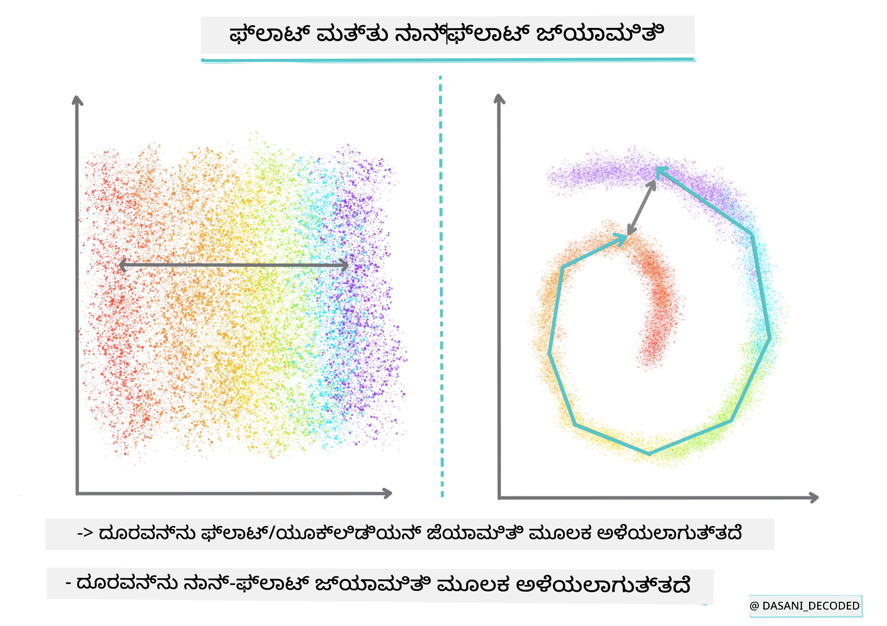
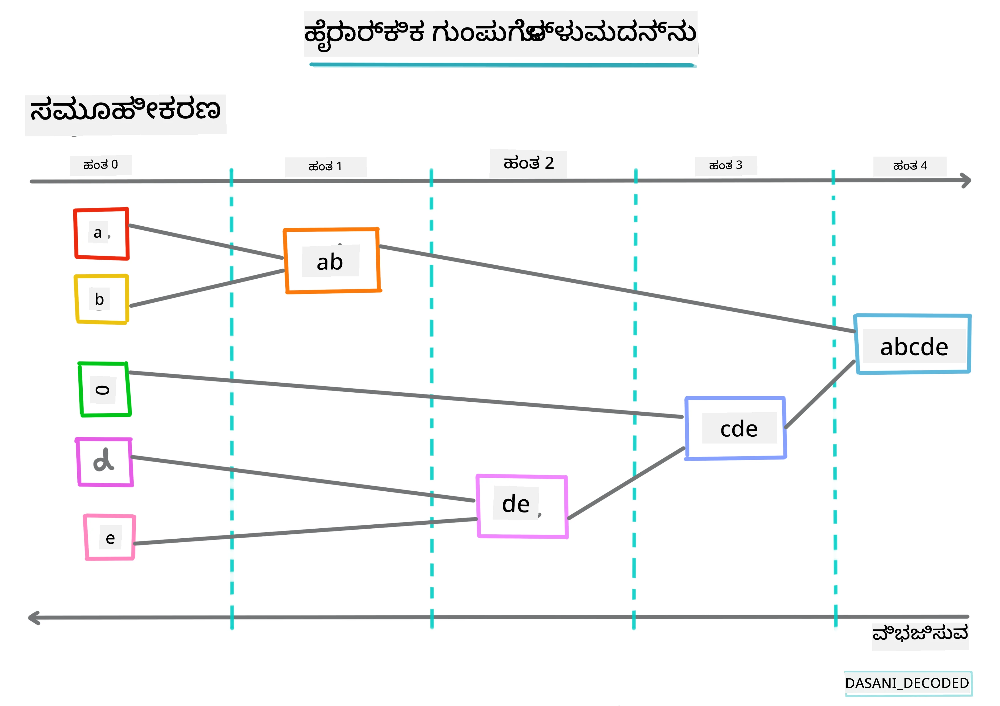
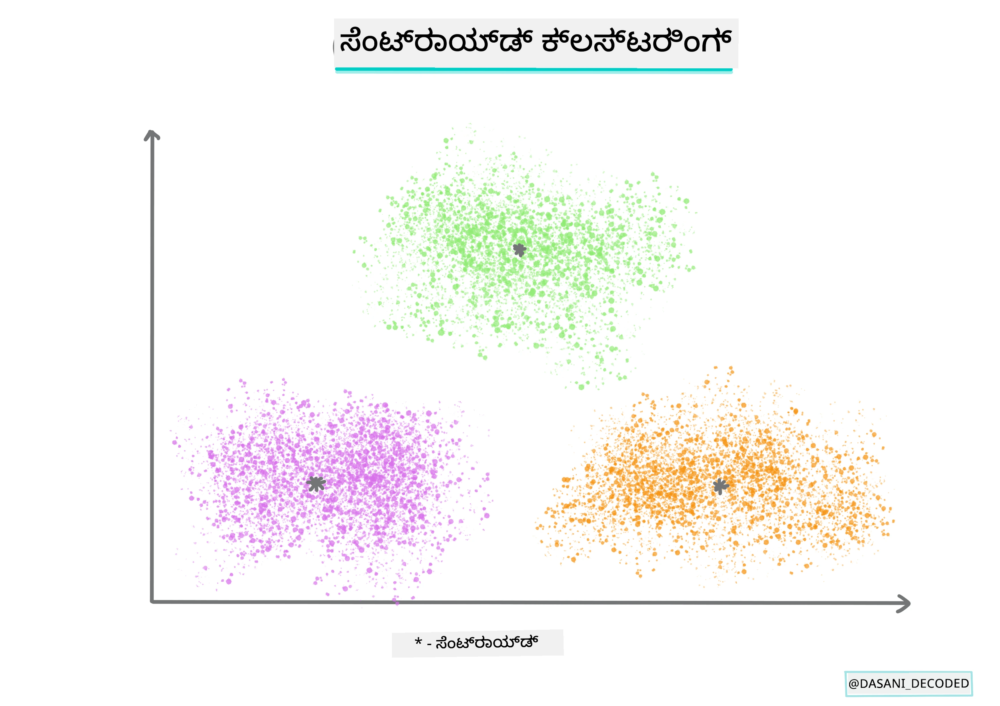
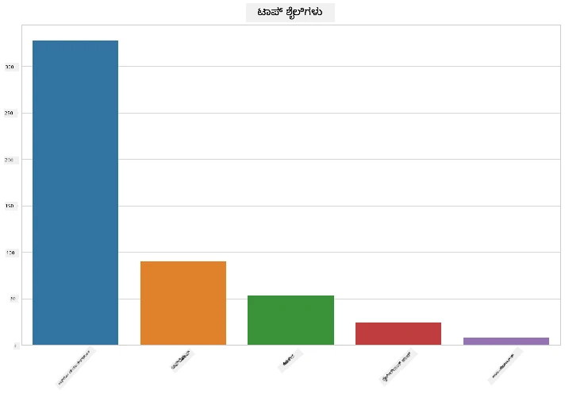
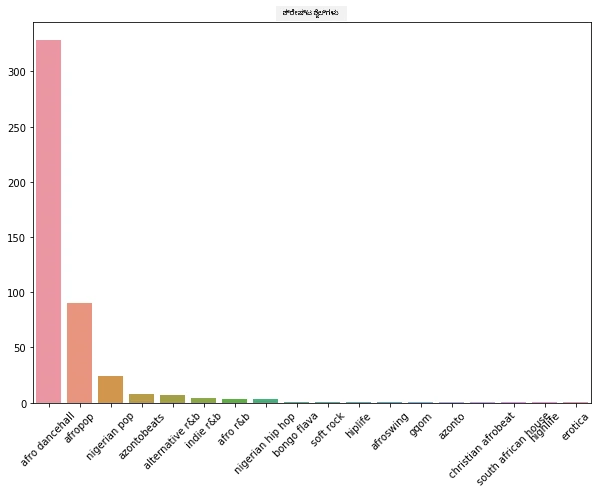
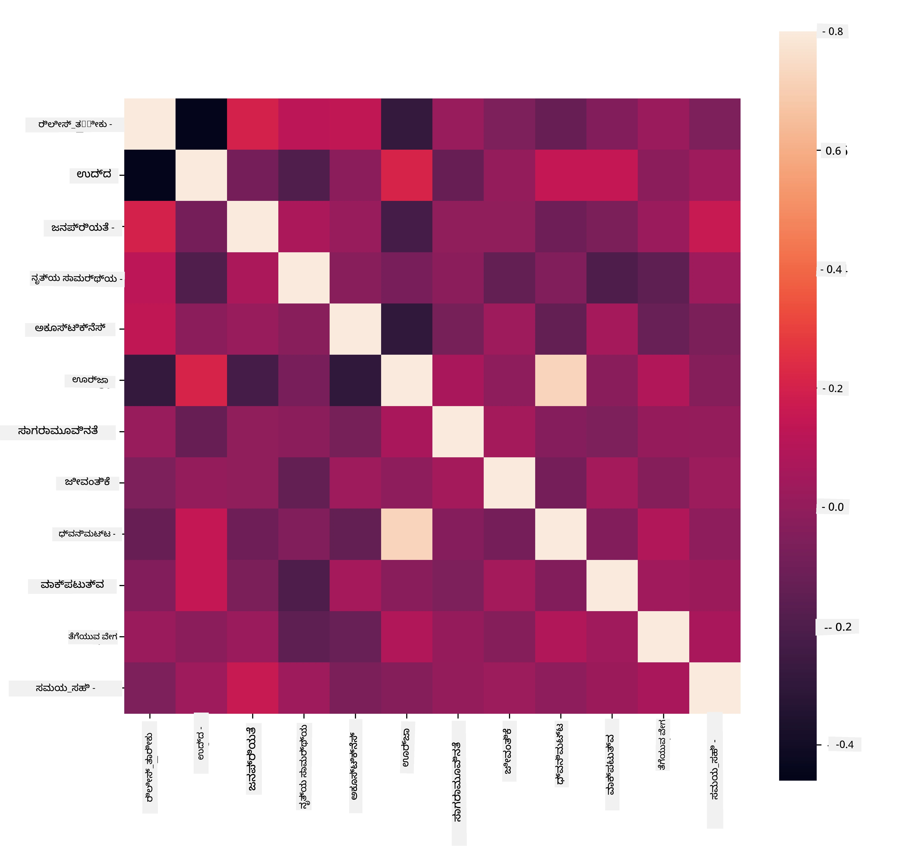
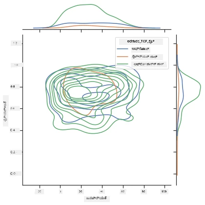
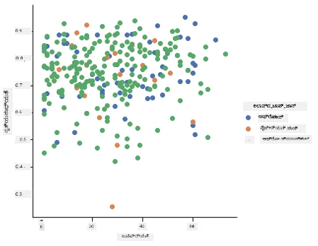

<!--
CO_OP_TRANSLATOR_METADATA:
{
  "original_hash": "730225ea274c9174fe688b21d421539d",
  "translation_date": "2025-12-19T15:02:45+00:00",
  "source_file": "5-Clustering/1-Visualize/README.md",
  "language_code": "kn"
}
-->
# ಕ್ಲಸ್ಟರಿಂಗ್ ಪರಿಚಯ

ಕ್ಲಸ್ಟರಿಂಗ್ ಒಂದು ರೀತಿಯ [ಅನಿಯಂತ್ರಿತ ಕಲಿಕೆ](https://wikipedia.org/wiki/Unsupervised_learning) ಆಗಿದ್ದು, ಅದು ಡೇಟಾಸೆಟ್ ಲೇಬಲ್ ಮಾಡದಿರುವುದು ಅಥವಾ ಅದರ ಇನ್‌ಪುಟ್‌ಗಳು ಪೂರ್ವನಿರ್ಧರಿತ ಔಟ್‌ಪುಟ್‌ಗಳೊಂದಿಗೆ ಹೊಂದಾಣಿಕೆ ಮಾಡದಿರುವುದಾಗಿ ಊಹಿಸುತ್ತದೆ. ಇದು ಲೇಬಲ್ ಮಾಡದ ಡೇಟಾದ ಮೂಲಕ ವಿವಿಧ ಆಲ್ಗಾರಿಥಮ್‌ಗಳನ್ನು ಬಳಸಿಕೊಂಡು ಡೇಟಾದಲ್ಲಿನ ಮಾದರಿಗಳನ್ನು ಗುರುತಿಸಿ ಗುಂಪುಗಳನ್ನು ಒದಗಿಸುತ್ತದೆ.

[](https://youtu.be/ty2advRiWJM "No One Like You by PSquare")

> 🎥 ಮೇಲಿನ ಚಿತ್ರವನ್ನು ಕ್ಲಿಕ್ ಮಾಡಿ ವೀಡಿಯೋವನ್ನು ನೋಡಿ. ನೀವು ಕ್ಲಸ್ಟರಿಂಗ್‌ನೊಂದಿಗೆ ಮೆಷಿನ್ ಲರ್ನಿಂಗ್ ಅಧ್ಯಯನ ಮಾಡುತ್ತಿರುವಾಗ, ಕೆಲವು ನೈಜೀರಿಯನ್ ಡ್ಯಾನ್ಸ್ ಹಾಲ್ ಟ್ರ್ಯಾಕ್‌ಗಳನ್ನು ಆನಂದಿಸಿ - ಇದು 2014 ರಲ್ಲಿ PSquare ಅವರಿಂದ ಅತ್ಯಂತ ಶ್ರೇಯಾಂಕಿತ ಹಾಡಾಗಿದೆ.

## [ಪೂರ್ವ-ಲೇಕ್ಚರ್ ಕ್ವಿಜ್](https://ff-quizzes.netlify.app/en/ml/)

### ಪರಿಚಯ

[ಕ್ಲಸ್ಟರಿಂಗ್](https://link.springer.com/referenceworkentry/10.1007%2F978-0-387-30164-8_124) ಡೇಟಾ ಅನ್ವೇಷಣೆಗೆ ಬಹಳ ಉಪಯುಕ್ತವಾಗಿದೆ. ನೈಜೀರಿಯನ್ ಪ್ರೇಕ್ಷಕರು ಸಂಗೀತವನ್ನು ಹೇಗೆ ಉಪಯೋಗಿಸುತ್ತಾರೆ ಎಂಬುದರಲ್ಲಿ ಟ್ರೆಂಡ್ಸ್ ಮತ್ತು ಮಾದರಿಗಳನ್ನು ಕಂಡುಹಿಡಿಯಲು ಇದು ಸಹಾಯ ಮಾಡಬಹುದೇ ಎಂದು ನೋಡೋಣ.

✅ ಕ್ಲಸ್ಟರಿಂಗ್‌ನ ಉಪಯೋಗಗಳನ್ನು ಒಂದು ನಿಮಿಷ ಯೋಚಿಸಿ. ನಿಜ ಜೀವನದಲ್ಲಿ, ನೀವು ಬಟ್ಟೆಗಳನ್ನು ಗುಂಪುಮಾಡಬೇಕಾದಾಗ ಕ್ಲಸ್ಟರಿಂಗ್ ಆಗುತ್ತದೆ 🧦👕👖🩲. ಡೇಟಾ ಸೈನ್ಸ್‌ನಲ್ಲಿ, ಬಳಕೆದಾರರ ಇಚ್ಛೆಗಳ ವಿಶ್ಲೇಷಣೆ ಮಾಡಲು ಅಥವಾ ಯಾವುದೇ ಲೇಬಲ್ ಮಾಡದ ಡೇಟಾಸೆಟ್‌ನ ಲಕ್ಷಣಗಳನ್ನು ನಿರ್ಧರಿಸಲು ಕ್ಲಸ್ಟರಿಂಗ್ ಆಗುತ್ತದೆ. ಕ್ಲಸ್ಟರಿಂಗ್, ಒಂದು ರೀತಿಯಲ್ಲಿ, ಗೊಂದಲವನ್ನು ಅರ್ಥಮಾಡಿಕೊಳ್ಳಲು ಸಹಾಯ ಮಾಡುತ್ತದೆ, ಹೀಗಾಗಿ ಅದು ಒಂದು ಸಾಕ್ ಡ್ರಾಯರ್‌ನಂತೆ.

[](https://youtu.be/esmzYhuFnds "Introduction to Clustering")

> 🎥 ಮೇಲಿನ ಚಿತ್ರವನ್ನು ಕ್ಲಿಕ್ ಮಾಡಿ ವೀಡಿಯೋವನ್ನು ನೋಡಿ: MIT ನ John Guttag ಕ್ಲಸ್ಟರಿಂಗ್ ಪರಿಚಯಿಸುತ್ತಾರೆ

ವೃತ್ತಿಪರ ಪರಿಸರದಲ್ಲಿ, ಕ್ಲಸ್ಟರಿಂಗ್ ಅನ್ನು ಮಾರುಕಟ್ಟೆ ವಿಭಾಗೀಕರಣ, ಯಾವ ವಯಸ್ಸಿನ ಗುಂಪು ಯಾವ ವಸ್ತುಗಳನ್ನು ಖರೀದಿಸುತ್ತಾರೆ ಎಂಬುದನ್ನು ನಿರ್ಧರಿಸಲು ಬಳಸಬಹುದು. ಮತ್ತೊಂದು ಉಪಯೋಗವು ಅನಾಮಲಿಯ ಪತ್ತೆ, ಉದಾಹರಣೆಗೆ ಕ್ರೆಡಿಟ್ ಕಾರ್ಡ್ ವ್ಯವಹಾರಗಳ ಡೇಟಾಸೆಟ್‌ನಿಂದ ಮೋಸವನ್ನು ಪತ್ತೆಹಚ್ಚಲು. ಅಥವಾ ವೈದ್ಯಕೀಯ ಸ್ಕ್ಯಾನ್‌ಗಳ ಬ್ಯಾಚ್‌ನಲ್ಲಿ ಟ್ಯೂಮರ್‌ಗಳನ್ನು ಗುರುತಿಸಲು ಕ್ಲಸ್ಟರಿಂಗ್ ಬಳಸಬಹುದು.

✅ ಬ್ಯಾಂಕಿಂಗ್, ಇ-ಕಾಮರ್ಸ್ ಅಥವಾ ವ್ಯವಹಾರ ಪರಿಸರದಲ್ಲಿ ನೀವು ಕ್ಲಸ್ಟರಿಂಗ್ ಅನ್ನು 'ವೈಲ್ಡ್' ನಲ್ಲಿ ಹೇಗೆ ಎದುರಿಸಿದ್ದೀರೋ ಎಂದು ಒಂದು ನಿಮಿಷ ಯೋಚಿಸಿ.

> 🎓 ಆಸಕ್ತಿದಾಯಕವಾಗಿ, ಕ್ಲಸ್ಟರ್ ವಿಶ್ಲೇಷಣೆ 1930ರ ದಶಕದಲ್ಲಿ ಮಾನವಶಾಸ್ತ್ರ ಮತ್ತು ಮನೋವಿಜ್ಞಾನ ಕ್ಷೇತ್ರಗಳಲ್ಲಿ ಹುಟ್ಟಿಕೊಂಡಿತು. ನೀವು ಅದನ್ನು ಹೇಗೆ ಬಳಸಲಾಗುತ್ತಿತ್ತು ಎಂದು ಊಹಿಸಬಹುದೇ?

ಬದಲಿ, ನೀವು ಶಾಪಿಂಗ್ ಲಿಂಕ್‌ಗಳು, ಚಿತ್ರಗಳು ಅಥವಾ ವಿಮರ್ಶೆಗಳ ಮೂಲಕ ಹುಡುಕಾಟ ಫಲಿತಾಂಶಗಳನ್ನು ಗುಂಪುಮಾಡಲು ಇದನ್ನು ಬಳಸಬಹುದು. ದೊಡ್ಡ ಡೇಟಾಸೆಟ್ ಅನ್ನು ಕಡಿಮೆ ಮಾಡಲು ಮತ್ತು ಅದರಲ್ಲಿ ಹೆಚ್ಚು ಸೂಕ್ಷ್ಮ ವಿಶ್ಲೇಷಣೆ ಮಾಡಲು ಕ್ಲಸ್ಟರಿಂಗ್ ಉಪಯುಕ್ತವಾಗಿದೆ, ಆದ್ದರಿಂದ ಈ ತಂತ್ರವನ್ನು ಇತರ ಮಾದರಿಗಳನ್ನು ನಿರ್ಮಿಸುವ ಮೊದಲು ಡೇಟಾ ಬಗ್ಗೆ ತಿಳಿಯಲು ಬಳಸಬಹುದು.

✅ ನಿಮ್ಮ ಡೇಟಾ ಕ್ಲಸ್ಟರ್‌ಗಳಲ್ಲಿ ಸಂಘಟಿತವಾದ ನಂತರ, ನೀವು ಅದಕ್ಕೆ ಕ್ಲಸ್ಟರ್ ಐಡಿ ನೀಡುತ್ತೀರಿ, ಮತ್ತು ಈ ತಂತ್ರವು ಡೇಟಾಸೆಟ್‌ನ ಗೌಪ್ಯತೆಯನ್ನು ಕಾಪಾಡಲು ಸಹಾಯ ಮಾಡಬಹುದು; ನೀವು ಡೇಟಾ ಪಾಯಿಂಟ್ ಅನ್ನು ಹೆಚ್ಚು ಬಹಿರಂಗಪಡಿಸುವ ಗುರುತಿಸುವ ಡೇಟಾ ಬದಲು ಅದರ ಕ್ಲಸ್ಟರ್ ಐಡಿ ಮೂಲಕ ಸೂಚಿಸಬಹುದು. ನೀವು ಇನ್ನಾವುದೇ ಕಾರಣಗಳನ್ನು ಯೋಚಿಸಬಹುದೇ, ಏಕೆ ನೀವು ಕ್ಲಸ್ಟರ್ ಐಡಿಯನ್ನು ಬಳಸುತ್ತೀರಿ?

ಕ್ಲಸ್ಟರಿಂಗ್ ತಂತ್ರಗಳನ್ನು ಈ [ಕಲಿಕೆ ಘಟಕದಲ್ಲಿ](https://docs.microsoft.com/learn/modules/train-evaluate-cluster-models?WT.mc_id=academic-77952-leestott) ಆಳವಾಗಿ ತಿಳಿದುಕೊಳ್ಳಿ

## ಕ್ಲಸ್ಟರಿಂಗ್ ಪ್ರಾರಂಭಿಸುವುದು

[Scikit-learn ದೊಡ್ಡ ಪ್ರಮಾಣದಲ್ಲಿ](https://scikit-learn.org/stable/modules/clustering.html) ಕ್ಲಸ್ಟರಿಂಗ್ ಮಾಡಲು ವಿಧಾನಗಳನ್ನು ನೀಡುತ್ತದೆ. ನೀವು ಆಯ್ಕೆಮಾಡುವ ಪ್ರಕಾರ ನಿಮ್ಮ ಬಳಕೆಯ ಮೇಲೆ ಅವಲಂಬಿತವಾಗಿರುತ್ತದೆ. ಡಾಕ್ಯುಮೆಂಟೇಶನ್ ಪ್ರಕಾರ, ಪ್ರತಿ ವಿಧಾನಕ್ಕೆ ವಿವಿಧ ಲಾಭಗಳಿವೆ. ಇಲ್ಲಿ Scikit-learn ಬೆಂಬಲಿಸುವ ವಿಧಾನಗಳ ಸರಳ ಪಟ್ಟಿಯಿದೆ ಮತ್ತು ಅವುಗಳ ಸೂಕ್ತ ಬಳಕೆ ಪ್ರಕರಣಗಳು:

| ವಿಧಾನದ ಹೆಸರು                | ಬಳಕೆ ಪ್ರಕರಣ                                                               |
| :--------------------------- | :--------------------------------------------------------------------- |
| K-Means                      | ಸಾಮಾನ್ಯ ಉದ್ದೇಶ, ಸೂಚಕ                                             |
| Affinity propagation         | ಅನೇಕ, ಅಸಮಾನ ಕ್ಲಸ್ಟರ್‌ಗಳು, ಸೂಚಕ                                       |
| Mean-shift                   | ಅನೇಕ, ಅಸಮಾನ ಕ್ಲಸ್ಟರ್‌ಗಳು, ಸೂಚಕ                                       |
| Spectral clustering          | ಕಡಿಮೆ, ಸಮಾನ ಕ್ಲಸ್ಟರ್‌ಗಳು, ಪರಿವಹನಾತ್ಮಕ                                       |
| Ward hierarchical clustering | ಅನೇಕ, ನಿರ್ಬಂಧಿತ ಕ್ಲಸ್ಟರ್‌ಗಳು, ಪರಿವಹನಾತ್ಮಕ                               |
| Agglomerative clustering     | ಅನೇಕ, ನಿರ್ಬಂಧಿತ, ನಾನ್ ಯೂಕ್ಲಿಡಿಯನ್ ದೂರಗಳು, ಪರಿವಹನಾತ್ಮಕ               |
| DBSCAN                       | ನಾನ್-ಫ್ಲಾಟ್ ಜ್ಯಾಮಿತಿ, ಅಸಮಾನ ಕ್ಲಸ್ಟರ್‌ಗಳು, ಪರಿವಹನಾತ್ಮಕ                       |
| OPTICS                       | ನಾನ್-ಫ್ಲಾಟ್ ಜ್ಯಾಮಿತಿ, ಬದಲಾಗುವ ಸಾಂದ್ರತೆಯೊಂದಿಗೆ ಅಸಮಾನ ಕ್ಲಸ್ಟರ್‌ಗಳು, ಪರಿವಹನಾತ್ಮಕ |
| Gaussian mixtures            | ಫ್ಲಾಟ್ ಜ್ಯಾಮಿತಿ, ಸೂಚಕ                                               |
| BIRCH                        | ದೊಡ್ಡ ಡೇಟಾಸೆಟ್ ಮತ್ತು ಔಟ್‌ಲೈಯರ್‌ಗಳು, ಸೂಚಕ                                 |

> 🎓 ನಾವು ಕ್ಲಸ್ಟರ್‌ಗಳನ್ನು ಹೇಗೆ ರಚಿಸುತ್ತೇವೆ ಎಂಬುದು ಡೇಟಾ ಪಾಯಿಂಟ್‌ಗಳನ್ನು ಗುಂಪುಗಳಲ್ಲಿ ಹೇಗೆ ಸಂಗ್ರಹಿಸುತ್ತೇವೆ ಎಂಬುದರ ಮೇಲೆ ಬಹಳ ಅವಲಂಬಿತವಾಗಿದೆ. ಕೆಲವು ಪದಗಳನ್ನು ವಿವರಿಸೋಣ:
>
> 🎓 ['ಪರಿವಹನಾತ್ಮಕ' ಮತ್ತು 'ಸೂಚಕ'](https://wikipedia.org/wiki/Transduction_(machine_learning))
> 
> ಪರಿವಹನಾತ್ಮಕ ನಿರ್ಣಯವು ನಿರೀಕ್ಷಿತ ತರಬೇತಿ ಪ್ರಕರಣಗಳಿಂದ ನಿರ್ಗಮಿಸುತ್ತದೆ, ಅವು ನಿರ್ದಿಷ್ಟ ಪರೀಕ್ಷಾ ಪ್ರಕರಣಗಳಿಗೆ ನಕ್ಷೆ ಮಾಡುತ್ತವೆ. ಸೂಚಕ ನಿರ್ಣಯವು ಸಾಮಾನ್ಯ ನಿಯಮಗಳಿಗೆ ನಕ್ಷೆ ಮಾಡಲಾದ ತರಬೇತಿ ಪ್ರಕರಣಗಳಿಂದ ನಿರ್ಗಮಿಸುತ್ತದೆ ಮತ್ತು ನಂತರ ಅವು ಪರೀಕ್ಷಾ ಪ್ರಕರಣಗಳಿಗೆ ಅನ್ವಯಿಸಲಾಗುತ್ತದೆ.
> 
> ಉದಾಹರಣೆ: ನಿಮ್ಮ ಬಳಿ ಭಾಗಶಃ ಮಾತ್ರ ಲೇಬಲ್ ಮಾಡಲಾದ ಡೇಟಾಸೆಟ್ ಇದ್ದರೆ, ಕೆಲವು 'ರೆಕಾರ್ಡ್‌ಗಳು', ಕೆಲವು 'ಸಿಡಿಗಳು', ಮತ್ತು ಕೆಲವು ಖಾಲಿ. ನಿಮ್ಮ ಕೆಲಸ ಖಾಲಿ ಭಾಗಗಳಿಗೆ ಲೇಬಲ್ ನೀಡುವುದು. ನೀವು ಸೂಚಕ ವಿಧಾನವನ್ನು ಆಯ್ಕೆಮಾಡಿದರೆ, ನೀವು 'ರೆಕಾರ್ಡ್‌ಗಳು' ಮತ್ತು 'ಸಿಡಿಗಳು' ಹುಡುಕುವ ಮಾದರಿಯನ್ನು ತರಬೇತಿಮಾಡಿ, ಆ ಲೇಬಲ್‌ಗಳನ್ನು ಲೇಬಲ್ ಮಾಡದ ಡೇಟಾಗೆ ಅನ್ವಯಿಸುತ್ತೀರಿ. ಈ ವಿಧಾನವು 'ಕ್ಯಾಸೆಟ್‌ಗಳು' ಎಂಬ ವಸ್ತುಗಳನ್ನು ಸರಿಯಾಗಿ ವರ್ಗೀಕರಿಸಲು ಕಷ್ಟಪಡುತ್ತದೆ. ಪರಿವಹನಾತ್ಮಕ ವಿಧಾನವು, ಇನ್ನೊಂದು ಬದಿಯಲ್ಲಿ, ಈ ಅಜ್ಞಾತ ಡೇಟಾವನ್ನು ಹೆಚ್ಚು ಪರಿಣಾಮಕಾರಿಯಾಗಿ ನಿರ್ವಹಿಸುತ್ತದೆ ಏಕೆಂದರೆ ಅದು ಸಮಾನ ವಸ್ತುಗಳನ್ನು ಗುಂಪುಮಾಡುತ್ತದೆ ಮತ್ತು ನಂತರ ಗುಂಪಿಗೆ ಲೇಬಲ್ ಅನ್ವಯಿಸುತ್ತದೆ. ಈ ಸಂದರ್ಭದಲ್ಲಿ, ಕ್ಲಸ್ಟರ್‌ಗಳು 'ವೃತ್ತಾಕಾರದ ಸಂಗೀತ ವಸ್ತುಗಳು' ಮತ್ತು 'ಚೌಕಾಕಾರದ ಸಂಗೀತ ವಸ್ತುಗಳು' ಎಂದು ಪ್ರತಿಬಿಂಬಿಸಬಹುದು.
> 
> 🎓 ['ನಾನ್-ಫ್ಲಾಟ್' ಮತ್ತು 'ಫ್ಲಾಟ್' ಜ್ಯಾಮಿತಿ](https://datascience.stackexchange.com/questions/52260/terminology-flat-geometry-in-the-context-of-clustering)
> 
> ಗಣಿತೀಯ ಪದಬಳಕೆಯಿಂದ, ನಾನ್-ಫ್ಲಾಟ್ ಮತ್ತು ಫ್ಲಾಟ್ ಜ್ಯಾಮಿತಿ ಅಂದರೆ ಪಾಯಿಂಟ್‌ಗಳ ನಡುವಿನ ದೂರವನ್ನು 'ಫ್ಲಾಟ್' ([ಯೂಕ್ಲಿಡಿಯನ್](https://wikipedia.org/wiki/Euclidean_geometry)) ಅಥವಾ 'ನಾನ್-ಫ್ಲಾಟ್' (ನಾನ್-ಯೂಕ್ಲಿಡಿಯನ್) ಜ್ಯಾಮಿತೀಯ ವಿಧಾನಗಳಿಂದ ಅಳೆಯುವಿಕೆ.
>
> ಈ ಸಂದರ್ಭದಲ್ಲಿ 'ಫ್ಲಾಟ್' ಅಂದರೆ ಯೂಕ್ಲಿಡಿಯನ್ ಜ್ಯಾಮಿತಿ (ಇದರಲ್ಲಿ ಕೆಲವು ಭಾಗಗಳನ್ನು 'ಪ್ಲೇನ್' ಜ್ಯಾಮಿತಿ ಎಂದು ಕಲಿಸಲಾಗುತ್ತದೆ), ಮತ್ತು ನಾನ್-ಫ್ಲಾಟ್ ಅಂದರೆ ನಾನ್-ಯೂಕ್ಲಿಡಿಯನ್ ಜ್ಯಾಮಿತಿ. ಮೆಷಿನ್ ಲರ್ನಿಂಗ್‌ಗೆ ಜ್ಯಾಮಿತಿಗೆ ಏನು ಸಂಬಂಧ? ಗಣಿತದಲ್ಲಿ ಆಧಾರಿತ ಎರಡು ಕ್ಷೇತ್ರಗಳಾಗಿ, ಕ್ಲಸ್ಟರ್‌ಗಳಲ್ಲಿನ ಪಾಯಿಂಟ್‌ಗಳ ನಡುವಿನ ದೂರವನ್ನು ಅಳೆಯಲು ಸಾಮಾನ್ಯ ವಿಧಾನ ಇರಬೇಕು, ಮತ್ತು ಅದು 'ಫ್ಲಾಟ್' ಅಥವಾ 'ನಾನ್-ಫ್ಲಾಟ್' ರೀತಿಯಲ್ಲಿ ಮಾಡಬಹುದು, ಡೇಟಾದ ಸ್ವಭಾವದ ಮೇಲೆ ಅವಲಂಬಿತವಾಗಿರುತ್ತದೆ. [ಯೂಕ್ಲಿಡಿಯನ್ ದೂರಗಳು](https://wikipedia.org/wiki/Euclidean_distance) ಎರಡು ಪಾಯಿಂಟ್‌ಗಳ ನಡುವಿನ ರೇಖೆಯ ಉದ್ದವಾಗಿ ಅಳೆಯಲ್ಪಡುತ್ತವೆ. [ನಾನ್-ಯೂಕ್ಲಿಡಿಯನ್ ದೂರಗಳು](https://wikipedia.org/wiki/Non-Euclidean_geometry) ವಕ್ರರೇಖೆಯ ಮೇಲೆ ಅಳೆಯಲ್ಪಡುತ್ತವೆ. ನಿಮ್ಮ ಡೇಟಾ ದೃಶ್ಯೀಕರಿಸಿದಾಗ ಸಮತಲದಲ್ಲಿ ಇಲ್ಲದಂತೆ ಕಾಣಿಸಿದರೆ, ಅದನ್ನು ನಿರ್ವಹಿಸಲು ವಿಶೇಷ ಆಲ್ಗಾರಿಥಮ್ ಬೇಕಾಗಬಹುದು.
>

> ಇನ್ಫೋಗ್ರಾಫಿಕ್: [ದಾಸನಿ ಮಡಿಪಳ್ಳಿ](https://twitter.com/dasani_decoded)
> 
> 🎓 ['ದೂರಗಳು'](https://web.stanford.edu/class/cs345a/slides/12-clustering.pdf)
> 
> ಕ್ಲಸ್ಟರ್‌ಗಳು ಅವುಗಳ ದೂರ ಮ್ಯಾಟ್ರಿಕ್ಸ್ ಮೂಲಕ ವ್ಯಾಖ್ಯಾನಿಸಲಾಗುತ್ತವೆ, ಉದಾ: ಪಾಯಿಂಟ್‌ಗಳ ನಡುವಿನ ದೂರಗಳು. ಈ ದೂರವನ್ನು ಕೆಲವು ವಿಧಾನಗಳಲ್ಲಿ ಅಳೆಯಬಹುದು. ಯೂಕ್ಲಿಡಿಯನ್ ಕ್ಲಸ್ಟರ್‌ಗಳು ಪಾಯಿಂಟ್ ಮೌಲ್ಯಗಳ ಸರಾಸರಿಯಿಂದ ವ್ಯಾಖ್ಯಾನಿಸಲ್ಪಡುತ್ತವೆ ಮತ್ತು 'ಸೆಂಟ್ರಾಯ್ಡ್' ಅಥವಾ ಕೇಂದ್ರ ಬಿಂದುವನ್ನು ಹೊಂದಿರುತ್ತವೆ. ದೂರಗಳು ಆ ಸೆಂಟ್ರಾಯ್ಡ್‌ಗೆ ಇರುವ ದೂರದಿಂದ ಅಳೆಯಲ್ಪಡುತ್ತವೆ. ನಾನ್-ಯೂಕ್ಲಿಡಿಯನ್ ದೂರಗಳು 'ಕ್ಲಸ್ಟ್ರಾಯ್ಡ್'ಗಳಿಗೆ ಸಂಬಂಧಿಸಿದವು, ಅದು ಇತರ ಪಾಯಿಂಟ್‌ಗಳಿಗೆ ಅತ್ಯಂತ ಸಮೀಪದ ಬಿಂದುವಾಗಿರುತ್ತದೆ. ಕ್ಲಸ್ಟ್ರಾಯ್ಡ್‌ಗಳನ್ನು ವಿವಿಧ ರೀತಿಯಲ್ಲಿ ವ್ಯಾಖ್ಯಾನಿಸಬಹುದು.
> 
> 🎓 ['ನಿರ್ಬಂಧಿತ'](https://wikipedia.org/wiki/Constrained_clustering)
> 
> [ನಿರ್ಬಂಧಿತ ಕ್ಲಸ್ಟರಿಂಗ್](https://web.cs.ucdavis.edu/~davidson/Publications/ICDMTutorial.pdf) ಈ ಅನಿಯಂತ್ರಿತ ವಿಧಾನಕ್ಕೆ 'ಅರ್ಧ-ನಿಯಂತ್ರಿತ' ಕಲಿಕೆಯನ್ನು ಪರಿಚಯಿಸುತ್ತದೆ. ಪಾಯಿಂಟ್‌ಗಳ ನಡುವಿನ ಸಂಬಂಧಗಳನ್ನು 'ಲಿಂಕ್ ಮಾಡಬಾರದು' ಅಥವಾ 'ಲಿಂಕ್ ಮಾಡಬೇಕು' ಎಂದು ಗುರುತಿಸಲಾಗುತ್ತದೆ, ಆದ್ದರಿಂದ ಕೆಲವು ನಿಯಮಗಳನ್ನು ಡೇಟಾಸೆಟ್‌ಗೆ ಜಾರಿಗೊಳಿಸಲಾಗುತ್ತದೆ.
>
> ಉದಾಹರಣೆ: ಒಂದು ಆಲ್ಗಾರಿಥಮ್ ಲೇಬಲ್ ಮಾಡದ ಅಥವಾ ಅರ್ಧ ಲೇಬಲ್ ಮಾಡಲಾದ ಡೇಟಾದ ಮೇಲೆ ಮುಕ್ತವಾಗಿ ಕಾರ್ಯನಿರ್ವಹಿಸಿದರೆ, ಅದು ಉತ್ಪಾದಿಸುವ ಕ್ಲಸ್ಟರ್‌ಗಳು ಕಡಿಮೆ ಗುಣಮಟ್ಟದಿರಬಹುದು. ಮೇಲಿನ ಉದಾಹರಣೆಯಲ್ಲಿ, ಕ್ಲಸ್ಟರ್‌ಗಳು 'ವೃತ್ತಾಕಾರದ ಸಂಗೀತ ವಸ್ತುಗಳು', 'ಚೌಕಾಕಾರದ ಸಂಗೀತ ವಸ್ತುಗಳು', 'ತ್ರಿಕೋನಾಕಾರದ ವಸ್ತುಗಳು' ಮತ್ತು 'ಕುಕೀಸ್' ಎಂದು ಗುಂಪುಮಾಡಬಹುದು. ಕೆಲವು ನಿಯಮಗಳು ("ವಸ್ತು ಪ್ಲಾಸ್ಟಿಕ್‌ನಿಂದ ಮಾಡಬೇಕು", "ವಸ್ತು ಸಂಗೀತ ಉತ್ಪಾದಿಸಬಲ್ಲದು") ನೀಡಿದರೆ, ಇದು ಆಲ್ಗಾರಿಥಮ್‌ಗೆ ಉತ್ತಮ ಆಯ್ಕೆಗಳನ್ನು ಮಾಡಲು ಸಹಾಯ ಮಾಡುತ್ತದೆ.
> 
> 🎓 'ಸಾಂದ್ರತೆ'
> 
> 'ಶಬ್ದ' ಇರುವ ಡೇಟಾವನ್ನು 'ಸಾಂದ್ರ' ಎಂದು ಪರಿಗಣಿಸಲಾಗುತ್ತದೆ. ಪ್ರತಿ ಕ್ಲಸ್ಟರ್‌ನಲ್ಲಿನ ಪಾಯಿಂಟ್‌ಗಳ ನಡುವಿನ ದೂರಗಳು ಪರಿಶೀಲನೆಯಾಗುವಾಗ ಹೆಚ್ಚು ಅಥವಾ ಕಡಿಮೆ ಸಾಂದ್ರವಾಗಿರಬಹುದು, ಅಥವಾ 'ಘನತೆ' ಹೊಂದಿರಬಹುದು, ಆದ್ದರಿಂದ ಈ ಡೇಟಾವನ್ನು ಸೂಕ್ತ ಕ್ಲಸ್ಟರಿಂಗ್ ವಿಧಾನದಿಂದ ವಿಶ್ಲೇಷಿಸಬೇಕಾಗುತ್ತದೆ. [ಈ ಲೇಖನ](https://www.kdnuggets.com/2020/02/understanding-density-based-clustering.html) K-Means ಕ್ಲಸ್ಟರಿಂಗ್ ಮತ್ತು HDBSCAN ಆಲ್ಗಾರಿಥಮ್‌ಗಳನ್ನು ಬಳಸಿಕೊಂಡು ಅಸಮಾನ ಕ್ಲಸ್ಟರ್ ಸಾಂದ್ರತೆಯೊಂದಿಗೆ ಶಬ್ದ ಡೇಟಾಸೆಟ್ ಅನ್ನು ಅನ್ವೇಷಿಸುವ ವ್ಯತ್ಯಾಸವನ್ನು ತೋರಿಸುತ್ತದೆ.

## ಕ್ಲಸ್ಟರಿಂಗ್ ಆಲ್ಗಾರಿಥಮ್‌ಗಳು

100ಕ್ಕೂ ಹೆಚ್ಚು ಕ್ಲಸ್ಟರಿಂಗ್ ಆಲ್ಗಾರಿಥಮ್‌ಗಳಿವೆ, ಮತ್ತು ಅವುಗಳ ಬಳಕೆ ಡೇಟಾದ ಸ್ವಭಾವದ ಮೇಲೆ ಅವಲಂಬಿತವಾಗಿದೆ. ಕೆಲವು ಪ್ರಮುಖ ಆಲ್ಗಾರಿಥಮ್‌ಗಳನ್ನು ಚರ್ಚಿಸೋಣ:

- **ಹೈರಾರ್ಕಿಕಲ್ ಕ್ಲಸ್ಟರಿಂಗ್**. ಒಂದು ವಸ್ತುವನ್ನು ಅದರ ಸಮೀಪದ ವಸ್ತುವಿನ ಹತ್ತಿರತೆ ಆಧರಿಸಿ ವರ್ಗೀಕರಿಸಿದರೆ, ಕ್ಲಸ್ಟರ್‌ಗಳು ಅವುಗಳ ಸದಸ್ಯರ ದೂರದ ಆಧಾರದ ಮೇಲೆ ರಚಿಸಲಾಗುತ್ತವೆ. Scikit-learn ನ ಅಗ್ಗ್ಲೊಮೆರೇಟಿವ್ ಕ್ಲಸ್ಟರಿಂಗ್ ಹೈರಾರ್ಕಿಕಲ್ ಆಗಿದೆ.

   
   > ಇನ್ಫೋಗ್ರಾಫಿಕ್: [ದಾಸನಿ ಮಡಿಪಳ್ಳಿ](https://twitter.com/dasani_decoded)

- **ಸೆಂಟ್ರಾಯ್ಡ್ ಕ್ಲಸ್ಟರಿಂಗ್**. ಈ ಜನಪ್ರಿಯ ಆಲ್ಗಾರಿಥಮ್ 'k' ಅಥವಾ ರಚಿಸಬೇಕಾದ ಕ್ಲಸ್ಟರ್‌ಗಳ ಸಂಖ್ಯೆಯನ್ನು ಆಯ್ಕೆಮಾಡಬೇಕಾಗುತ್ತದೆ, ನಂತರ ಆಲ್ಗಾರಿಥಮ್ ಕ್ಲಸ್ಟರ್‌ನ ಕೇಂದ್ರ ಬಿಂದುವನ್ನು ನಿರ್ಧರಿಸಿ ಆ ಬಿಂದುವಿನ ಸುತ್ತಲೂ ಡೇಟಾವನ್ನು ಸಂಗ್ರಹಿಸುತ್ತದೆ. [K-means ಕ್ಲಸ್ಟರಿಂಗ್](https://wikipedia.org/wiki/K-means_clustering) ಸೆಂಟ್ರಾಯ್ಡ್ ಕ್ಲಸ್ಟರಿಂಗ್‌ನ ಜನಪ್ರಿಯ ಆವೃತ್ತಿಯಾಗಿದೆ. ಕೇಂದ್ರವನ್ನು ಸಮೀಪದ ಸರಾಸರಿ ಮೂಲಕ ನಿರ್ಧರಿಸಲಾಗುತ್ತದೆ, ಆದ್ದರಿಂದ ಹೆಸರು. ಕ್ಲಸ್ಟರ್‌ನಿಂದ ಚದರ ದೂರವನ್ನು ಕನಿಷ್ಠಗೊಳಿಸಲಾಗುತ್ತದೆ.

   
   > ಇನ್ಫೋಗ್ರಾಫಿಕ್: [ದಾಸನಿ ಮಡಿಪಳ್ಳಿ](https://twitter.com/dasani_decoded)

- **ವಿತರಣಾ ಆಧಾರಿತ ಕ್ಲಸ್ಟರಿಂಗ್**. ಸಾಂಖ್ಯಿಕ ಮಾದರಿಗೊಳಿಸುವಿಕೆಯಲ್ಲಿ ಆಧಾರಿತ, ವಿತರಣಾ ಆಧಾರಿತ ಕ್ಲಸ್ಟರಿಂಗ್ ಡೇಟಾ ಪಾಯಿಂಟ್ ಒಂದು ಕ್ಲಸ್ಟರ್‌ಗೆ ಸೇರಿದ ಸಾಧ್ಯತೆಯನ್ನು ನಿರ್ಧರಿಸಿ ಅದಕ್ಕೆ ಅನುಗುಣವಾಗಿ ನಿಯೋಜಿಸುತ್ತದೆ. ಗಾಸಿಯನ್ ಮಿಶ್ರಣ ವಿಧಾನಗಳು ಈ ಪ್ರಕಾರಕ್ಕೆ ಸೇರಿವೆ.

- **ಸಾಂದ್ರತೆ ಆಧಾರಿತ ಕ್ಲಸ್ಟರಿಂಗ್**. ಡೇಟಾ ಪಾಯಿಂಟ್‌ಗಳನ್ನು ಅವುಗಳ ಸಾಂದ್ರತೆ ಅಥವಾ ಪರಸ್ಪರ ಗುಂಪುಮಾಡುವಿಕೆಯ ಆಧಾರದ ಮೇಲೆ ಕ್ಲಸ್ಟರ್‌ಗಳಿಗೆ ನಿಯೋಜಿಸಲಾಗುತ್ತದೆ. ಗುಂಪಿನಿಂದ ದೂರದಲ್ಲಿರುವ ಡೇಟಾ ಪಾಯಿಂಟ್‌ಗಳನ್ನು ಔಟ್‌ಲೈಯರ್‌ಗಳು ಅಥವಾ ಶಬ್ದ ಎಂದು ಪರಿಗಣಿಸಲಾಗುತ್ತದೆ. DBSCAN, Mean-shift ಮತ್ತು OPTICS ಈ ಪ್ರಕಾರದ ಕ್ಲಸ್ಟರಿಂಗ್‌ಗೆ ಸೇರಿವೆ.

- **ಗ್ರಿಡ್ ಆಧಾರಿತ ಕ್ಲಸ್ಟರಿಂಗ್**. ಬಹು-ಆಯಾಮದ ಡೇಟಾಸೆಟ್‌ಗಳಿಗೆ, ಗ್ರಿಡ್ ರಚಿಸಲಾಗುತ್ತದೆ ಮತ್ತು ಡೇಟಾವನ್ನು ಗ್ರಿಡ್‌ನ ಸೆಲ್‌ಗಳ ನಡುವೆ ಹಂಚಲಾಗುತ್ತದೆ, ಹೀಗಾಗಿ ಕ್ಲಸ್ಟರ್‌ಗಳು ರಚಿಸಲಾಗುತ್ತವೆ.

## ಅಭ್ಯಾಸ - ನಿಮ್ಮ ಡೇಟಾವನ್ನು ಕ್ಲಸ್ಟರ್ ಮಾಡಿ

ಕ್ಲಸ್ಟರಿಂಗ್ ತಂತ್ರವನ್ನು ಸರಿಯಾದ ದೃಶ್ಯೀಕರಣದಿಂದ ಬಹಳ ಸಹಾಯವಾಗುತ್ತದೆ, ಆದ್ದರಿಂದ ನಮ್ಮ ಸಂಗೀತ ಡೇಟಾವನ್ನು ದೃಶ್ಯೀಕರಿಸುವುದರಿಂದ ಪ್ರಾರಂಭಿಸೋಣ. ಈ ಅಭ್ಯಾಸವು ಈ ಡೇಟಾದ ಸ್ವಭಾವಕ್ಕೆ ಯಾವ ಕ್ಲಸ್ಟರಿಂಗ್ ವಿಧಾನಗಳನ್ನು ಪರಿಣಾಮಕಾರಿಯಾಗಿ ಬಳಸಬೇಕೆಂದು ನಿರ್ಧರಿಸಲು ಸಹಾಯ ಮಾಡುತ್ತದೆ.

1. ಈ ಫೋಲ್ಡರ್‌ನಲ್ಲಿರುವ [_notebook.ipynb_](https://github.com/microsoft/ML-For-Beginners/blob/main/5-Clustering/1-Visualize/notebook.ipynb) ಫೈಲ್ ಅನ್ನು ತೆರೆಯಿರಿ.

1. ಉತ್ತಮ ಡೇಟಾ ದೃಶ್ಯೀಕರಣಕ್ಕಾಗಿ `Seaborn` ಪ್ಯಾಕೇಜ್ ಅನ್ನು ಆಮದುಮಾಡಿ.

    ```python
    !pip install seaborn
    ```

1. [_nigerian-songs.csv_](https://github.com/microsoft/ML-For-Beginners/blob/main/5-Clustering/data/nigerian-songs.csv) ನಿಂದ ಹಾಡುಗಳ ಡೇಟಾವನ್ನು ಸೇರಿಸಿ. ಹಾಡುಗಳ ಬಗ್ಗೆ ಕೆಲವು ಡೇಟಾ ಹೊಂದಿರುವ ಡೇಟಾಫ್ರೇಮ್ ಅನ್ನು ಲೋಡ್ ಮಾಡಿ. ಲೈಬ್ರರಿಗಳನ್ನು ಆಮದುಮಾಡಿ ಮತ್ತು ಡೇಟಾವನ್ನು ಹೊರಹಾಕಿ, ಈ ಡೇಟಾವನ್ನು ಅನ್ವೇಷಿಸಲು ಸಿದ್ಧರಾಗಿ:

    ```python
    import matplotlib.pyplot as plt
    import pandas as pd
    
    df = pd.read_csv("../data/nigerian-songs.csv")
    df.head()
    ```

    ಮೊದಲ ಕೆಲವು ಸಾಲುಗಳ ಡೇಟಾವನ್ನು ಪರಿಶೀಲಿಸಿ:

    |     | name                     | album                        | artist              | artist_top_genre | release_date | length | popularity | danceability | acousticness | energy | instrumentalness | liveness | loudness | speechiness | tempo   | time_signature |
    | --- | ------------------------ | ---------------------------- | ------------------- | ---------------- | ------------ | ------ | ---------- | ------------ | ------------ | ------ | ---------------- | -------- | -------- | ----------- | ------- | -------------- |
    | 0   | Sparky                   | Mandy & The Jungle           | Cruel Santino       | alternative r&b  | 2019         | 144000 | 48         | 0.666        | 0.851        | 0.42   | 0.534            | 0.11     | -6.699   | 0.0829      | 133.015 | 5              |
    | 1   | shuga rush               | EVERYTHING YOU HEARD IS TRUE | Odunsi (The Engine) | afropop          | 2020         | 89488  | 30         | 0.71         | 0.0822       | 0.683  | 0.000169         | 0.101    | -5.64    | 0.36        | 129.993 | 3              |
    | 2   | LITT!                    | LITT!                        | AYLØ                | indie r&b        | 2018         | 207758 | 40         | 0.836        | 0.272        | 0.564  | 0.000537         | 0.11     | -7.127   | 0.0424      | 130.005 | 4              |
    | 3   | Confident / Feeling Cool | Enjoy Your Life              | Lady Donli          | nigerian pop     | 2019         | 175135 | 14         | 0.894        | 0.798        | 0.611  | 0.000187         | 0.0964   | -4.961   | 0.113       | 111.087 | 4              |
    | 4   | wanted you               | rare.                        | Odunsi (The Engine) | afropop          | 2018         | 152049 | 25         | 0.702        | 0.116        | 0.833  | 0.91             | 0.348    | -6.044   | 0.0447      | 105.115 | 4              |

1. ಡೇಟಾಫ್ರೇಮ್ ಬಗ್ಗೆ ಕೆಲವು ಮಾಹಿತಿಗಳನ್ನು ಪಡೆಯಿರಿ, `info()` ಅನ್ನು ಕರೆ ಮಾಡಿ:

    ```python
    df.info()
    ```

   ಔಟ್‌ಪುಟ್ ಹೀಗೆ ಕಾಣಿಸುತ್ತದೆ:

    ```output
    <class 'pandas.core.frame.DataFrame'>
    RangeIndex: 530 entries, 0 to 529
    Data columns (total 16 columns):
     #   Column            Non-Null Count  Dtype  
    ---  ------            --------------  -----  
     0   name              530 non-null    object 
     1   album             530 non-null    object 
     2   artist            530 non-null    object 
     3   artist_top_genre  530 non-null    object 
     4   release_date      530 non-null    int64  
     5   length            530 non-null    int64  
     6   popularity        530 non-null    int64  
     7   danceability      530 non-null    float64
     8   acousticness      530 non-null    float64
     9   energy            530 non-null    float64
     10  instrumentalness  530 non-null    float64
     11  liveness          530 non-null    float64
     12  loudness          530 non-null    float64
     13  speechiness       530 non-null    float64
     14  tempo             530 non-null    float64
     15  time_signature    530 non-null    int64  
    dtypes: float64(8), int64(4), object(4)
    memory usage: 66.4+ KB
    ```

1. ನಲ್ ಮೌಲ್ಯಗಳಿಗಾಗಿ ಡಬಲ್-ಚೆಕ್ ಮಾಡಿ, `isnull()` ಅನ್ನು ಕರೆ ಮಾಡಿ ಮತ್ತು ಮೊತ್ತ 0 ಆಗಿರುವುದನ್ನು ಪರಿಶೀಲಿಸಿ:

    ```python
    df.isnull().sum()
    ```

    ಚೆನ್ನಾಗಿದೆಯೇ:

    ```output
    name                0
    album               0
    artist              0
    artist_top_genre    0
    release_date        0
    length              0
    popularity          0
    danceability        0
    acousticness        0
    energy              0
    instrumentalness    0
    liveness            0
    loudness            0
    speechiness         0
    tempo               0
    time_signature      0
    dtype: int64
    ```

1. ಡೇಟಾವನ್ನು ವರ್ಣಿಸಿ:

    ```python
    df.describe()
    ```

    |       | release_date | length      | popularity | danceability | acousticness | energy   | instrumentalness | liveness | loudness  | speechiness | tempo      | time_signature |
    | ----- | ------------ | ----------- | ---------- | ------------ | ------------ | -------- | ---------------- | -------- | --------- | ----------- | ---------- | -------------- |
    | count | 530          | 530         | 530        | 530          | 530          | 530      | 530              | 530      | 530       | 530         | 530        | 530            |
    | mean  | 2015.390566  | 222298.1698 | 17.507547  | 0.741619     | 0.265412     | 0.760623 | 0.016305         | 0.147308 | -4.953011 | 0.130748    | 116.487864 | 3.986792       |
    | std   | 3.131688     | 39696.82226 | 18.992212  | 0.117522     | 0.208342     | 0.148533 | 0.090321         | 0.123588 | 2.464186  | 0.092939    | 23.518601  | 0.333701       |
    | min   | 1998         | 89488       | 0          | 0.255        | 0.000665     | 0.111    | 0                | 0.0283   | -19.362   | 0.0278      | 61.695     | 3              |
    | 25%   | 2014         | 199305      | 0          | 0.681        | 0.089525     | 0.669    | 0                | 0.07565  | -6.29875  | 0.0591      | 102.96125  | 4              |
    | 50%   | 2016         | 218509      | 13         | 0.761        | 0.2205       | 0.7845   | 0.000004         | 0.1035   | -4.5585   | 0.09795     | 112.7145   | 4              |
    | 75%   | 2017         | 242098.5    | 31         | 0.8295       | 0.403        | 0.87575  | 0.000234         | 0.164    | -3.331    | 0.177       | 125.03925  | 4              |
    | max   | 2020         | 511738      | 73         | 0.966        | 0.954        | 0.995    | 0.91             | 0.811    | 0.582     | 0.514       | 206.007    | 5              |

> 🤔 ನಾವು ಕ್ಲಸ್ಟರಿಂಗ್‌ನೊಂದಿಗೆ ಕೆಲಸ ಮಾಡುತ್ತಿದ್ದರೆ, ಲೇಬಲ್ ಮಾಡಲಾದ ಡೇಟಾವನ್ನು ಅಗತ್ಯವಿಲ್ಲದ ಅನ್‌ಸೂಪರ್ವೈಸ್‌ಡ್ ವಿಧಾನ, ನಾವು ಈ ಡೇಟಾವನ್ನು ಲೇಬಲ್‌ಗಳೊಂದಿಗೆ ಏಕೆ ತೋರಿಸುತ್ತಿದ್ದೇವೆ? ಡೇಟಾ ಅನ್ವೇಷಣಾ ಹಂತದಲ್ಲಿ, ಅವು ಸಹಾಯಕವಾಗುತ್ತವೆ, ಆದರೆ ಕ್ಲಸ್ಟರಿಂಗ್ ಆಲ್ಗಾರಿಥಮ್‌ಗಳು ಕಾರ್ಯನಿರ್ವಹಿಸಲು ಅವು ಅಗತ್ಯವಿಲ್ಲ. ನೀವು ಕೇವಲ ಕಾಲಮ್ ಹೆಡರ್‌ಗಳನ್ನು ತೆಗೆದುಹಾಕಿ ಡೇಟಾವನ್ನು ಕಾಲಮ್ ಸಂಖ್ಯೆಯಿಂದ ಉಲ್ಲೇಖಿಸಬಹುದು.

ಡೇಟಾದ ಸಾಮಾನ್ಯ ಮೌಲ್ಯಗಳನ್ನು ನೋಡಿ. ಜನಪ್ರಿಯತೆ '0' ಆಗಿರಬಹುದು, ಇದು ರ್ಯಾಂಕಿಂಗ್ ಇಲ್ಲದ ಹಾಡುಗಳನ್ನು ತೋರಿಸುತ್ತದೆ. ಅವುಗಳನ್ನು ಶೀಘ್ರದಲ್ಲೇ ತೆಗೆದುಹಾಕೋಣ.

1. ಅತ್ಯಂತ ಜನಪ್ರಿಯ ಶೈಲಿಗಳನ್ನು ಕಂಡುಹಿಡಿಯಲು ಬಾರ್ಪ್ಲಾಟ್ ಬಳಸಿ:

    ```python
    import seaborn as sns
    
    top = df['artist_top_genre'].value_counts()
    plt.figure(figsize=(10,7))
    sns.barplot(x=top[:5].index,y=top[:5].values)
    plt.xticks(rotation=45)
    plt.title('Top genres',color = 'blue')
    ```

    

✅ ನೀವು ಹೆಚ್ಚು ಟಾಪ್ ಮೌಲ್ಯಗಳನ್ನು ನೋಡಲು ಬಯಸಿದರೆ, ಟಾಪ್ `[:5]` ಅನ್ನು ದೊಡ್ಡ ಮೌಲ್ಯಕ್ಕೆ ಬದಲಾಯಿಸಿ ಅಥವಾ ಎಲ್ಲಾ ನೋಡಲು ಅದನ್ನು ತೆಗೆದುಹಾಕಿ.

ಗಮನಿಸಿ, ಟಾಪ್ ಶೈಲಿ 'Missing' ಎಂದು ವರ್ಣಿಸಲ್ಪಟ್ಟಿದ್ದರೆ, ಅಂದರೆ Spotify ಅದನ್ನು ವರ್ಗೀಕರಿಸಿಲ್ಲ, ಆದ್ದರಿಂದ ಅದನ್ನು ತೆಗೆದುಹಾಕೋಣ.

1. ಮಿಸ್ಸಿಂಗ್ ಡೇಟಾವನ್ನು ಫಿಲ್ಟರ್ ಮಾಡಿ ತೆಗೆದುಹಾಕಿ

    ```python
    df = df[df['artist_top_genre'] != 'Missing']
    top = df['artist_top_genre'].value_counts()
    plt.figure(figsize=(10,7))
    sns.barplot(x=top.index,y=top.values)
    plt.xticks(rotation=45)
    plt.title('Top genres',color = 'blue')
    ```

    ಈಗ ಶೈಲಿಗಳನ್ನು ಮರುಪರಿಶೀಲಿಸಿ:

    

1. ಬಹುಮಟ್ಟಿಗೆ, ಟಾಪ್ ಮೂರು ಶೈಲಿಗಳು ಈ ಡೇಟಾಸೆಟ್ ಅನ್ನು ಆಳವಾಗಿ ಆಳುತ್ತವೆ. `afro dancehall`, `afropop`, ಮತ್ತು `nigerian pop` ಮೇಲೆ ಗಮನಹರಿಸೋಣ, ಜೊತೆಗೆ 0 ಜನಪ್ರಿಯತೆ ಮೌಲ್ಯವಿರುವ ಯಾವುದೇ ಡೇಟಾವನ್ನು (ಅಂದರೆ ಡೇಟಾಸೆಟ್‌ನಲ್ಲಿ ಜನಪ್ರಿಯತೆ ವರ್ಗೀಕರಣವಿಲ್ಲದವು ಮತ್ತು ನಮ್ಮ ಉದ್ದೇಶಗಳಿಗೆ ಶಬ್ದವೆಂದು ಪರಿಗಣಿಸಬಹುದು) ತೆಗೆದುಹಾಕಿ:

    ```python
    df = df[(df['artist_top_genre'] == 'afro dancehall') | (df['artist_top_genre'] == 'afropop') | (df['artist_top_genre'] == 'nigerian pop')]
    df = df[(df['popularity'] > 0)]
    top = df['artist_top_genre'].value_counts()
    plt.figure(figsize=(10,7))
    sns.barplot(x=top.index,y=top.values)
    plt.xticks(rotation=45)
    plt.title('Top genres',color = 'blue')
    ```

1. ಡೇಟಾ ಯಾವುದೇ ವಿಶೇಷವಾಗಿ ಬಲವಾದ ಸಂಬಂಧ ಹೊಂದಿದೆಯೇ ಎಂದು ತ್ವರಿತ ಪರೀಕ್ಷೆ ಮಾಡಿ:

    ```python
    corrmat = df.corr(numeric_only=True)
    f, ax = plt.subplots(figsize=(12, 9))
    sns.heatmap(corrmat, vmax=.8, square=True)
    ```

    

    ಏಕೈಕ ಬಲವಾದ ಸಂಬಂಧ `energy` ಮತ್ತು `loudness` ನಡುವೆ ಇದೆ, ಇದು ಅಚ್ಚರಿಯ ಸಂಗತಿ ಅಲ್ಲ, ಏಕೆಂದರೆ ಗಟ್ಟಿಯಾದ ಸಂಗೀತ ಸಾಮಾನ್ಯವಾಗಿ ಬಹಳ ಶಕ್ತಿಶಾಲಿಯಾಗಿದೆ. ಬೇರೆ ಎಲ್ಲ ಸಂಬಂಧಗಳು ಸಾಪೇಕ್ಷವಾಗಿ ದುರ್ಬಲವಾಗಿವೆ. ಈ ಡೇಟಾದಲ್ಲಿ ಕ್ಲಸ್ಟರಿಂಗ್ ಆಲ್ಗಾರಿಥಮ್ ಏನು ಮಾಡಬಹುದು ಎಂದು ನೋಡುವುದು ಆಸಕ್ತಿದಾಯಕವಾಗಿರುತ್ತದೆ.

    > 🎓 ಸಂಬಂಧವು ಕಾರಣವಲ್ಲ ಎಂಬುದನ್ನು ಗಮನಿಸಿ! ನಾವು ಸಂಬಂಧದ ಸಾಬೀತು ಹೊಂದಿದ್ದೇವೆ ಆದರೆ ಕಾರಣದ ಸಾಬೀತು ಇಲ್ಲ. [ರಂಜನೀಯ ವೆಬ್‌ಸೈಟ್](https://tylervigen.com/spurious-correlations) ಇದನ್ನು ಒತ್ತಿ ತೋರಿಸುತ್ತದೆ.

ಈ ಡೇಟಾಸೆಟ್‌ನಲ್ಲಿ ಹಾಡಿನ ಗ್ರಹಿತ ಜನಪ್ರಿಯತೆ ಮತ್ತು ನೃತ್ಯ ಸಾಮರ್ಥ್ಯದ ಸುತ್ತಲೂ ಯಾವುದೇ ಸಮಾಗಮವಿದೆಯೇ? ಫೇಸಟ್‌ಗ್ರಿಡ್ ತೋರಿಸುತ್ತದೆ, regardless of genre, there are concentric circles that line up. ನೈಜೀರಿಯನ್ ರುಚಿಗಳು ಈ ಶೈಲಿಗೆ ನೃತ್ಯ ಸಾಮರ್ಥ್ಯದ ನಿರ್ದಿಷ್ಟ ಮಟ್ಟದಲ್ಲಿ ಸಮಾಗಮವಾಗಬಹುದೇ?

✅ ವಿಭಿನ್ನ ಡೇಟಾಪಾಯಿಂಟ್‌ಗಳನ್ನು (energy, loudness, speechiness) ಮತ್ತು ಹೆಚ್ಚು ಅಥವಾ ವಿಭಿನ್ನ ಸಂಗೀತ ಶೈಲಿಗಳನ್ನು ಪ್ರಯತ್ನಿಸಿ. ನೀವು ಏನು ಕಂಡುಹಿಡಿಯಬಹುದು? `df.describe()` ಟೇಬಲ್ ಅನ್ನು ನೋಡಿ ಡೇಟಾ ಪಾಯಿಂಟ್‌ಗಳ ಸಾಮಾನ್ಯ ವಿಸ್ತಾರವನ್ನು.

### ವ್ಯಾಯಾಮ - ಡೇಟಾ ವಿತರಣೆ

ಈ ಮೂರು ಶೈಲಿಗಳು ತಮ್ಮ ಜನಪ್ರಿಯತೆ ಆಧಾರಿತವಾಗಿ ನೃತ್ಯ ಸಾಮರ್ಥ್ಯದ ಗ್ರಹಣೆಯಲ್ಲಿ ಪ್ರಮುಖವಾಗಿ ವಿಭಿನ್ನವಾಗಿದೆಯೇ?

1. ನಮ್ಮ ಟಾಪ್ ಮೂರು ಶೈಲಿಗಳ ಜನಪ್ರಿಯತೆ ಮತ್ತು ನೃತ್ಯ ಸಾಮರ್ಥ್ಯದ ಡೇಟಾ ವಿತರಣೆಯನ್ನು ನೀಡಲಾದ x ಮತ್ತು y ಅಕ್ಷಗಳ ಮೇಲೆ ಪರಿಶೀಲಿಸಿ.

    ```python
    sns.set_theme(style="ticks")
    
    g = sns.jointplot(
        data=df,
        x="popularity", y="danceability", hue="artist_top_genre",
        kind="kde",
    )
    ```

    ನೀವು ಸಾಮಾನ್ಯ ಸಮಾಗಮದ ಬಿಂದುವಿನ ಸುತ್ತಲೂ ಸಾಂದ್ರ ವಲಯಗಳನ್ನು ಕಂಡುಹಿಡಿಯಬಹುದು, ಇದು ಪಾಯಿಂಟ್‌ಗಳ ವಿತರಣೆಯನ್ನು ತೋರಿಸುತ್ತದೆ.

    > 🎓 ಈ ಉದಾಹರಣೆ KDE (Kernel Density Estimate) ಗ್ರಾಫ್ ಅನ್ನು ಬಳಸುತ್ತದೆ, ಇದು ಡೇಟಾವನ್ನು ನಿರಂತರ ಪ್ರಾಬಬಿಲಿಟಿ ಡೆನ್ಸಿಟಿ ವಕ್ರದಿಂದ ಪ್ರತಿನಿಧಿಸುತ್ತದೆ. ಇದು ಬಹು ವಿತರಣೆಗಳೊಂದಿಗೆ ಕೆಲಸ ಮಾಡುವಾಗ ಡೇಟಾವನ್ನು ಅರ್ಥಮಾಡಿಕೊಳ್ಳಲು ಸಹಾಯ ಮಾಡುತ್ತದೆ.

    ಸಾಮಾನ್ಯವಾಗಿ, ಈ ಮೂರು ಶೈಲಿಗಳು ತಮ್ಮ ಜನಪ್ರಿಯತೆ ಮತ್ತು ನೃತ್ಯ ಸಾಮರ್ಥ್ಯದ ದೃಷ್ಟಿಯಿಂದ ಸಡಿಲವಾಗಿ ಹೊಂದಿಕೊಳ್ಳುತ್ತವೆ. ಈ ಸಡಿಲವಾಗಿ ಹೊಂದಿಕೊಂಡಿರುವ ಡೇಟಾದಲ್ಲಿ ಕ್ಲಸ್ಟರ್‌ಗಳನ್ನು ನಿರ್ಧರಿಸುವುದು ಸವಾಲಾಗಿರುತ್ತದೆ:

    

1. ಸ್ಕ್ಯಾಟರ್ ಪ್ಲಾಟ್ ರಚಿಸಿ:

    ```python
    sns.FacetGrid(df, hue="artist_top_genre", height=5) \
       .map(plt.scatter, "popularity", "danceability") \
       .add_legend()
    ```

    ಅದೇ ಅಕ್ಷಗಳ ಸ್ಕ್ಯಾಟರ್ ಪ್ಲಾಟ್ ಸಾದೃಶ್ಯ ಸಮಾಗಮ ಮಾದರಿಯನ್ನು ತೋರಿಸುತ್ತದೆ

    

ಸಾಮಾನ್ಯವಾಗಿ, ಕ್ಲಸ್ಟರಿಂಗ್‌ಗೆ, ನೀವು ಡೇಟಾದ ಕ್ಲಸ್ಟರ್‌ಗಳನ್ನು ತೋರಿಸಲು ಸ್ಕ್ಯಾಟರ್ ಪ್ಲಾಟ್‌ಗಳನ್ನು ಬಳಸಬಹುದು, ಆದ್ದರಿಂದ ಈ ರೀತಿಯ ದೃಶ್ಯೀಕರಣವನ್ನು ನಿಪುಣತೆಯಿಂದ ಮಾಡುವುದು ಬಹಳ ಉಪಯುಕ್ತ. ಮುಂದಿನ ಪಾಠದಲ್ಲಿ, ನಾವು ಈ ಫಿಲ್ಟರ್ ಮಾಡಲಾದ ಡೇಟಾವನ್ನು ತೆಗೆದು k-means ಕ್ಲಸ್ಟರಿಂಗ್ ಬಳಸಿ ಈ ಡೇಟಾದಲ್ಲಿ ಆಸಕ್ತಿದಾಯಕ ರೀತಿಯಲ್ಲಿ ಒಟ್ಟುಗೂಡುತ್ತಿರುವ ಗುಂಪುಗಳನ್ನು ಕಂಡುಹಿಡಿಯುತ್ತೇವೆ.

---

## 🚀ಸವಾಲು

ಮುಂದಿನ ಪಾಠದ ತಯಾರಿಗಾಗಿ, ನೀವು ಕಂಡುಹಿಡಿಯಬಹುದಾದ ಮತ್ತು ಉತ್ಪಾದನಾ ಪರಿಸರದಲ್ಲಿ ಬಳಸಬಹುದಾದ ವಿವಿಧ ಕ್ಲಸ್ಟರಿಂಗ್ ಆಲ್ಗಾರಿಥಮ್‌ಗಳ ಬಗ್ಗೆ ಚಾರ್ಟ್ ರಚಿಸಿ. ಕ್ಲಸ್ಟರಿಂಗ್ ಯಾವ ರೀತಿಯ ಸಮಸ್ಯೆಗಳನ್ನು ಪರಿಹರಿಸಲು ಪ್ರಯತ್ನಿಸುತ್ತಿದೆ?

## [ಪೋಸ್ಟ್-ಲೆಕ್ಚರ್ ಕ್ವಿಜ್](https://ff-quizzes.netlify.app/en/ml/)

## ವಿಮರ್ಶೆ ಮತ್ತು ಸ್ವಯಂ ಅಧ್ಯಯನ

ನೀವು ಕ್ಲಸ್ಟರಿಂಗ್ ಆಲ್ಗಾರಿಥಮ್‌ಗಳನ್ನು ಅನ್ವಯಿಸುವ ಮೊದಲು, ನಾವು ಕಲಿತಂತೆ, ನಿಮ್ಮ ಡೇಟಾಸೆಟ್‌ನ ಸ್ವಭಾವವನ್ನು ಅರ್ಥಮಾಡಿಕೊಳ್ಳುವುದು ಉತ್ತಮ. ಈ ವಿಷಯದ ಬಗ್ಗೆ ಹೆಚ್ಚಿನ ಮಾಹಿತಿಗಾಗಿ [ಇಲ್ಲಿ](https://www.kdnuggets.com/2019/10/right-clustering-algorithm.html) ಓದಿ

[ಈ ಸಹಾಯಕ ಲೇಖನ](https://www.freecodecamp.org/news/8-clustering-algorithms-in-machine-learning-that-all-data-scientists-should-know/) ವಿವಿಧ ಡೇಟಾ ಆಕಾರಗಳನ್ನು ನೀಡಿದಾಗ ವಿವಿಧ ಕ್ಲಸ್ಟರಿಂಗ್ ಆಲ್ಗಾರಿಥಮ್‌ಗಳು ಹೇಗೆ ವರ್ತಿಸುತ್ತವೆ ಎಂಬುದನ್ನು ನಿಮಗೆ ತಿಳಿಸುತ್ತದೆ.

## ನಿಯೋಜನೆ

[ಕ್ಲಸ್ಟರಿಂಗ್‌ಗೆ ಇತರ ದೃಶ್ಯೀಕರಣಗಳನ್ನು ಸಂಶೋಧಿಸಿ](assignment.md)

---

<!-- CO-OP TRANSLATOR DISCLAIMER START -->
**ಅಸ್ವೀಕರಣ**:  
ಈ ದಸ್ತಾವೇಜು [Co-op Translator](https://github.com/Azure/co-op-translator) ಎಂಬ AI ಅನುವಾದ ಸೇವೆಯನ್ನು ಬಳಸಿ ಅನುವಾದಿಸಲಾಗಿದೆ. ನಾವು ಶುದ್ಧತೆಯತ್ತ ಪ್ರಯತ್ನಿಸುತ್ತಿದ್ದರೂ, ಸ್ವಯಂಚಾಲಿತ ಅನುವಾದಗಳಲ್ಲಿ ತಪ್ಪುಗಳು ಅಥವಾ ಅಸತ್ಯತೆಗಳು ಇರಬಹುದು ಎಂಬುದನ್ನು ದಯವಿಟ್ಟು ಗಮನಿಸಿ. ಮೂಲ ಭಾಷೆಯಲ್ಲಿರುವ ಮೂಲ ದಸ್ತಾವೇಜನ್ನು ಅಧಿಕೃತ ಮೂಲವೆಂದು ಪರಿಗಣಿಸಬೇಕು. ಮಹತ್ವದ ಮಾಹಿತಿಗಾಗಿ, ವೃತ್ತಿಪರ ಮಾನವ ಅನುವಾದವನ್ನು ಶಿಫಾರಸು ಮಾಡಲಾಗುತ್ತದೆ. ಈ ಅನುವಾದ ಬಳಕೆಯಿಂದ ಉಂಟಾಗುವ ಯಾವುದೇ ತಪ್ಪು ಅರ್ಥಮಾಡಿಕೊಳ್ಳುವಿಕೆ ಅಥವಾ ತಪ್ಪು ವಿವರಣೆಗಳಿಗೆ ನಾವು ಹೊಣೆಗಾರರಾಗುವುದಿಲ್ಲ.
<!-- CO-OP TRANSLATOR DISCLAIMER END -->