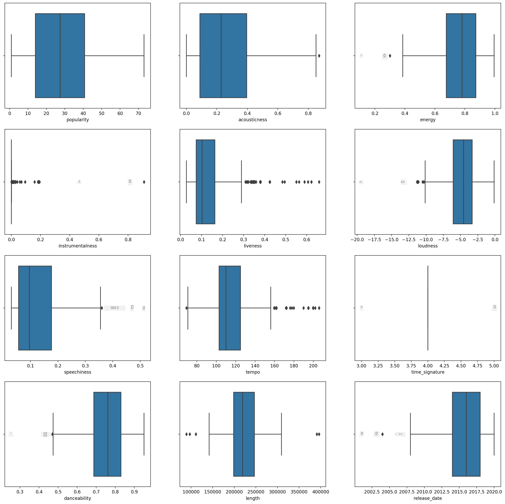
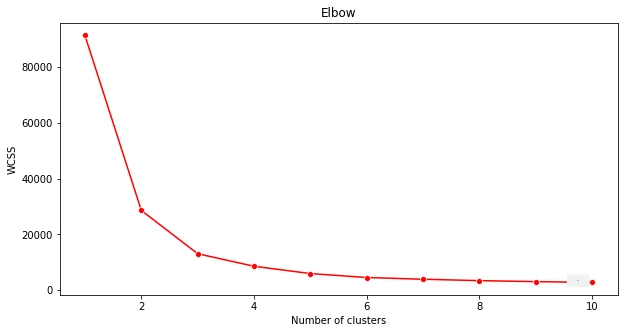
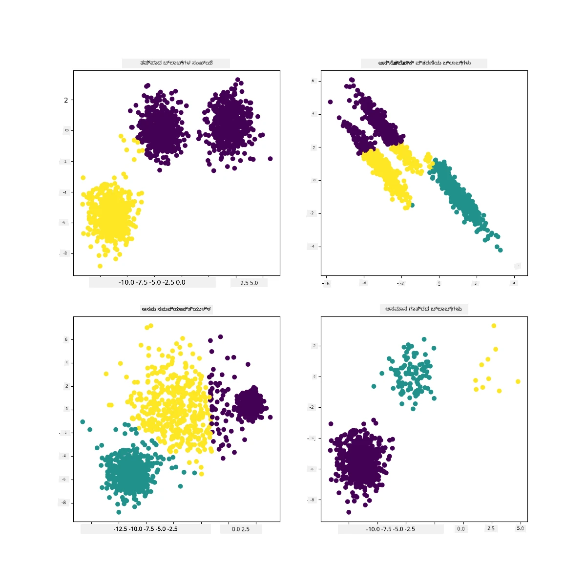

<!--
CO_OP_TRANSLATOR_METADATA:
{
  "original_hash": "7cdd17338d9bbd7e2171c2cd462eb081",
  "translation_date": "2025-12-19T14:53:20+00:00",
  "source_file": "5-Clustering/2-K-Means/README.md",
  "language_code": "kn"
}
-->
# K-Means ಕ್ಲಸ್ಟರಿಂಗ್

## [ಪೂರ್ವ-ಪಾಠ ಕ್ವಿಜ್](https://ff-quizzes.netlify.app/en/ml/)

ಈ ಪಾಠದಲ್ಲಿ, ನೀವು Scikit-learn ಮತ್ತು ನೀವು ಮೊದಲು ಆಮದು ಮಾಡಿದ ನೈಜೀರಿಯನ್ ಸಂಗೀತ ಡೇಟಾಸೆಟ್ ಬಳಸಿ ಕ್ಲಸ್ಟರ್‌ಗಳನ್ನು ಹೇಗೆ ರಚಿಸುವುದು ಎಂದು ಕಲಿಯುತ್ತೀರಿ. ನಾವು ಕ್ಲಸ್ಟರಿಂಗ್‌ಗಾಗಿ K-Means ನ ಮೂಲಭೂತಗಳನ್ನು ಆವರಿಸುವೆವು. ನೀವು ಮೊದಲು ಪಾಠದಲ್ಲಿ ಕಲಿತಂತೆ, ಕ್ಲಸ್ಟರ್‌ಗಳೊಂದಿಗೆ ಕೆಲಸ ಮಾಡುವ ಅನೇಕ ವಿಧಾನಗಳಿವೆ ಮತ್ತು ನೀವು ಬಳಸುವ ವಿಧಾನ ನಿಮ್ಮ ಡೇಟಾದ ಮೇಲೆ ಅವಲಂಬಿತವಾಗಿದೆ ಎಂದು ಗಮನದಲ್ಲಿಡಿ. ನಾವು K-Means ಅನ್ನು ಪ್ರಯತ್ನಿಸುವೆವು ಏಕೆಂದರೆ ಇದು ಅತ್ಯಂತ ಸಾಮಾನ್ಯ ಕ್ಲಸ್ಟರಿಂಗ್ ತಂತ್ರವಾಗಿದೆ. ಆರಂಭಿಸೋಣ!

ನೀವು ಕಲಿಯಲಿರುವ ಪದಗಳು:

- ಸಿಲ್ಹೌಟ್ ಸ್ಕೋರಿಂಗ್
- ಎಲ್ಬೋ ವಿಧಾನ
- ಇನರ್ಷಿಯಾ
- ವ್ಯತ್ಯಾಸ

## ಪರಿಚಯ

[K-Means ಕ್ಲಸ್ಟರಿಂಗ್](https://wikipedia.org/wiki/K-means_clustering) ಸಿಗ್ನಲ್ ಪ್ರೊಸೆಸಿಂಗ್ ಕ್ಷೇತ್ರದಿಂದ ಪಡೆದ ವಿಧಾನವಾಗಿದೆ. ಇದು 'k' ಕ್ಲಸ್ಟರ್‌ಗಳಾಗಿ ಡೇಟಾ ಗುಂಪುಗಳನ್ನು ವಿಭಜಿಸಲು ಮತ್ತು ವಿಭಾಗಿಸಲು ಉಪಯೋಗಿಸಲಾಗುತ್ತದೆ, ನಿರೀಕ್ಷಣೆಯ ಸರಣಿಯನ್ನು ಬಳಸಿ. ಪ್ರತಿ ನಿರೀಕ್ಷಣೆ ನೀಡಲಾದ ಡೇಟಾಪಾಯಿಂಟ್ ಅನ್ನು ಅದರ ಸಮೀಪದ 'ಸರಾಸರಿ' ಅಥವಾ ಕ್ಲಸ್ಟರ್‌ನ ಕೇಂದ್ರ ಬಿಂದುವಿಗೆ ಸಮೀಪವಾಗಿರುವಂತೆ ಗುಂಪು ಮಾಡುತ್ತದೆ.

ಕ್ಲಸ್ಟರ್‌ಗಳನ್ನು [ವೊರೋನಾಯ್ ಡಯಾಗ್ರಾಮ್‌ಗಳು](https://wikipedia.org/wiki/Voronoi_diagram) ಎಂದು ದೃಶ್ಯೀಕರಿಸಬಹುದು, ಇದರಲ್ಲಿ ಒಂದು ಬಿಂದುವು (ಅಥವಾ 'ಬೀಜ') ಮತ್ತು ಅದರ ಸಂಬಂಧಿತ ಪ್ರದೇಶವನ್ನು ಒಳಗೊಂಡಿದೆ.


> ಇನ್ಫೋಗ್ರಾಫಿಕ್ [ಜೆನ್ ಲೂಪರ್](https://twitter.com/jenlooper) ಅವರಿಂದ

K-Means ಕ್ಲಸ್ಟರಿಂಗ್ ಪ್ರಕ್ರಿಯೆ [ಮೂರು ಹಂತಗಳಲ್ಲಿ ಕಾರ್ಯನಿರ್ವಹಿಸುತ್ತದೆ](https://scikit-learn.org/stable/modules/clustering.html#k-means):

1. ಆಲ್ಗಾರಿಥಮ್ ಡೇಟಾಸೆಟ್‌ನಿಂದ ಮಾದರಿಯನ್ನು ತೆಗೆದು k-ಸಂಖ್ಯೆಯ ಕೇಂದ್ರ ಬಿಂದುಗಳನ್ನು ಆಯ್ಕೆಮಾಡುತ್ತದೆ. ಇದಾದ ನಂತರ, ಇದು ಲೂಪ್ ಮಾಡುತ್ತದೆ:
    1. ಪ್ರತಿ ಮಾದರಿಯನ್ನು ಸಮೀಪದ ಸೆಂಟ್ರಾಯ್ಡ್‌ಗೆ ನಿಯೋಜಿಸುತ್ತದೆ.
    2. ಹಿಂದಿನ ಸೆಂಟ್ರಾಯ್ಡ್‌ಗಳಿಗೆ ನಿಯೋಜಿಸಲಾದ ಎಲ್ಲಾ ಮಾದರಿಗಳ ಸರಾಸರಿ ಮೌಲ್ಯವನ್ನು ತೆಗೆದು ಹೊಸ ಸೆಂಟ್ರಾಯ್ಡ್‌ಗಳನ್ನು ರಚಿಸುತ್ತದೆ.
    3. ನಂತರ, ಹೊಸ ಮತ್ತು ಹಳೆಯ ಸೆಂಟ್ರಾಯ್ಡ್‌ಗಳ ನಡುವಿನ ವ್ಯತ್ಯಾಸವನ್ನು ಲೆಕ್ಕಿಸಿ, ಸೆಂಟ್ರಾಯ್ಡ್‌ಗಳು ಸ್ಥಿರವಾಗುವವರೆಗೆ ಪುನರಾವರ್ತಿಸುತ್ತದೆ.

K-Means ಬಳಕೆಯ ಒಂದು ದೋಷವೆಂದರೆ ನೀವು 'k' ಅನ್ನು ಸ್ಥಾಪಿಸಬೇಕಾಗುತ್ತದೆ, ಅಂದರೆ ಸೆಂಟ್ರಾಯ್ಡ್‌ಗಳ ಸಂಖ್ಯೆ. ಅದೃಷ್ಟವಶಾತ್ 'ಎಲ್ಬೋ ವಿಧಾನ' 'k' ಗೆ ಉತ್ತಮ ಪ್ರಾರಂಭಿಕ ಮೌಲ್ಯವನ್ನು ಅಂದಾಜಿಸಲು ಸಹಾಯ ಮಾಡುತ್ತದೆ. ನೀವು ಅದನ್ನು ಕ್ಷಣದಲ್ಲೇ ಪ್ರಯತ್ನಿಸುವಿರಿ.

## ಪೂರ್ವಾಪೇಕ್ಷಿತ

ನೀವು ಈ ಪಾಠದ [_notebook.ipynb_](https://github.com/microsoft/ML-For-Beginners/blob/main/5-Clustering/2-K-Means/notebook.ipynb) ಫೈಲ್‌ನಲ್ಲಿ ಕೆಲಸ ಮಾಡುತ್ತೀರಿ, ಇದರಲ್ಲಿ ನೀವು ಹಿಂದಿನ ಪಾಠದಲ್ಲಿ ಮಾಡಿದ ಡೇಟಾ ಆಮದು ಮತ್ತು ಪ್ರಾಥಮಿಕ ಶುದ್ಧೀಕರಣವನ್ನು ಒಳಗೊಂಡಿದೆ.

## ವ್ಯಾಯಾಮ - ತಯಾರಿ

ಮತ್ತೆ ಹಾಡುಗಳ ಡೇಟಾವನ್ನು ನೋಡಿ ಪ್ರಾರಂಭಿಸಿ.

1. ಪ್ರತಿ ಕಾಲಮ್‌ಗೆ `boxplot()` ಅನ್ನು ಕರೆಸಿ ಬಾಕ್ಸ್‌ಪ್ಲಾಟ್ ರಚಿಸಿ:

    ```python
    plt.figure(figsize=(20,20), dpi=200)
    
    plt.subplot(4,3,1)
    sns.boxplot(x = 'popularity', data = df)
    
    plt.subplot(4,3,2)
    sns.boxplot(x = 'acousticness', data = df)
    
    plt.subplot(4,3,3)
    sns.boxplot(x = 'energy', data = df)
    
    plt.subplot(4,3,4)
    sns.boxplot(x = 'instrumentalness', data = df)
    
    plt.subplot(4,3,5)
    sns.boxplot(x = 'liveness', data = df)
    
    plt.subplot(4,3,6)
    sns.boxplot(x = 'loudness', data = df)
    
    plt.subplot(4,3,7)
    sns.boxplot(x = 'speechiness', data = df)
    
    plt.subplot(4,3,8)
    sns.boxplot(x = 'tempo', data = df)
    
    plt.subplot(4,3,9)
    sns.boxplot(x = 'time_signature', data = df)
    
    plt.subplot(4,3,10)
    sns.boxplot(x = 'danceability', data = df)
    
    plt.subplot(4,3,11)
    sns.boxplot(x = 'length', data = df)
    
    plt.subplot(4,3,12)
    sns.boxplot(x = 'release_date', data = df)
    ```

    ಈ ಡೇಟಾ ಸ್ವಲ್ಪ ಶಬ್ದಮಯವಾಗಿದೆ: ಪ್ರತಿ ಕಾಲಮ್ ಅನ್ನು ಬಾಕ್ಸ್‌ಪ್ಲಾಟ್ ಆಗಿ ಗಮನಿಸಿದರೆ, ನೀವು ಔಟ್‌ಲೈಯರ್‌ಗಳನ್ನು ಕಾಣಬಹುದು.

    

ನೀವು ಡೇಟಾಸೆಟ್ ಮೂಲಕ ಹೋಗಿ ಈ ಔಟ್‌ಲೈಯರ್‌ಗಳನ್ನು ತೆಗೆದುಹಾಕಬಹುದು, ಆದರೆ ಅದು ಡೇಟಾವನ್ನು ಬಹಳ ಕಡಿಮೆ ಮಾಡುತ್ತದೆ.

1. ಈಗ, ನಿಮ್ಮ ಕ್ಲಸ್ಟರಿಂಗ್ ವ್ಯಾಯಾಮಕ್ಕೆ ನೀವು ಯಾವ ಕಾಲಮ್‌ಗಳನ್ನು ಬಳಸುತ್ತೀರಿ ಎಂದು ಆಯ್ಕೆಮಾಡಿ. ಸಮಾನ ಶ್ರೇಣಿಯ ಕಾಲಮ್‌ಗಳನ್ನು ಆರಿಸಿ ಮತ್ತು `artist_top_genre` ಕಾಲಮ್ ಅನ್ನು ಸಂಖ್ಯಾತ್ಮಕ ಡೇಟಾ ಆಗಿ ಎನ್‌ಕೋಡ್ ಮಾಡಿ:

    ```python
    from sklearn.preprocessing import LabelEncoder
    le = LabelEncoder()
    
    X = df.loc[:, ('artist_top_genre','popularity','danceability','acousticness','loudness','energy')]
    
    y = df['artist_top_genre']
    
    X['artist_top_genre'] = le.fit_transform(X['artist_top_genre'])
    
    y = le.transform(y)
    ```

1. ಈಗ ನೀವು ಎಷ್ಟು ಕ್ಲಸ್ಟರ್‌ಗಳನ್ನು ಗುರಿಯಾಗಿಸಬೇಕೆಂದು ಆಯ್ಕೆಮಾಡಬೇಕು. ನೀವು ಡೇಟಾಸೆಟ್‌ನಿಂದ 3 ಹಾಡು ಶೈಲಿಗಳನ್ನು ತೆಗೆದುಕೊಂಡಿದ್ದೀರಿ, ಆದ್ದರಿಂದ 3 ಅನ್ನು ಪ್ರಯತ್ನಿಸೋಣ:

    ```python
    from sklearn.cluster import KMeans
    
    nclusters = 3 
    seed = 0
    
    km = KMeans(n_clusters=nclusters, random_state=seed)
    km.fit(X)
    
    # ಪ್ರತಿ ಡೇಟಾ ಪಾಯಿಂಟ್‌ಗಾಗಿ ಕ್ಲಸ್ಟರ್ ಅನ್ನು ಭವಿಷ್ಯವಾಣಿ ಮಾಡಿ
    
    y_cluster_kmeans = km.predict(X)
    y_cluster_kmeans
    ```

ನೀವು ಪ್ರತಿ ಡೇಟಾಫ್ರೇಮ್ ಸಾಲಿಗೆ ಭವಿಷ್ಯವಾಣಿ ಮಾಡಿದ ಕ್ಲಸ್ಟರ್‌ಗಳ (0, 1, ಅಥವಾ 2) ಅರೆ ಅನ್ನು ಮುದ್ರಿತವಾಗಿರುವುದನ್ನು ನೋಡುತ್ತೀರಿ.

1. ಈ ಅರೆ ಬಳಸಿ 'ಸಿಲ್ಹೌಟ್ ಸ್ಕೋರ್' ಅನ್ನು ಲೆಕ್ಕಿಸಿ:

    ```python
    from sklearn import metrics
    score = metrics.silhouette_score(X, y_cluster_kmeans)
    score
    ```

## ಸಿಲ್ಹೌಟ್ ಸ್ಕೋರ್

1 ಗೆ ಸಮೀಪವಾದ ಸಿಲ್ಹೌಟ್ ಸ್ಕೋರ್ ಅನ್ನು ಹುಡುಕಿ. ಈ ಸ್ಕೋರ್ -1 ರಿಂದ 1 ರವರೆಗೆ ಬದಲಾಗುತ್ತದೆ, ಮತ್ತು ಸ್ಕೋರ್ 1 ಆಗಿದ್ದರೆ, ಕ್ಲಸ್ಟರ್ ಗಟ್ಟಿಯಾಗಿದ್ದು ಇತರ ಕ್ಲಸ್ಟರ್‌ಗಳಿಂದ ಚೆನ್ನಾಗಿ ವಿಭಜಿತವಾಗಿದೆ. 0 ಗೆ ಸಮೀಪವಾದ ಮೌಲ್ಯವು ಹತ್ತಿರದ ಕ್ಲಸ್ಟರ್‌ಗಳ ನಿರ್ಧಾರ ಗಡಿಭಾಗದ ಬಳಿ ಮಾದರಿಗಳೊಂದಿಗೆ ಓವರ್‌ಲ್ಯಾಪ್ ಆಗಿರುವ ಕ್ಲಸ್ಟರ್‌ಗಳನ್ನು ಸೂಚಿಸುತ್ತದೆ. [(ಮೂಲ)](https://dzone.com/articles/kmeans-silhouette-score-explained-with-python-exam)

ನಮ್ಮ ಸ್ಕೋರ್ **.53** ಆಗಿದ್ದು, ಮಧ್ಯದಲ್ಲಿ ಇದೆ. ಇದು ನಮ್ಮ ಡೇಟಾ ಈ ರೀತಿಯ ಕ್ಲಸ್ಟರಿಂಗ್‌ಗೆ ವಿಶೇಷವಾಗಿ ಸೂಕ್ತವಿಲ್ಲದಿರುವುದನ್ನು ಸೂಚಿಸುತ್ತದೆ, ಆದರೆ ಮುಂದುವರಿಯೋಣ.

### ವ್ಯಾಯಾಮ - ಮಾದರಿ ನಿರ್ಮಿಸಿ

1. `KMeans` ಅನ್ನು ಆಮದು ಮಾಡಿ ಮತ್ತು ಕ್ಲಸ್ಟರಿಂಗ್ ಪ್ರಕ್ರಿಯೆಯನ್ನು ಪ್ರಾರಂಭಿಸಿ.

    ```python
    from sklearn.cluster import KMeans
    wcss = []
    
    for i in range(1, 11):
        kmeans = KMeans(n_clusters = i, init = 'k-means++', random_state = 42)
        kmeans.fit(X)
        wcss.append(kmeans.inertia_)
    
    ```

    ಇಲ್ಲಿ ಕೆಲವು ಭಾಗಗಳನ್ನು ವಿವರಿಸುವುದು ಅಗತ್ಯ.

    > 🎓 range: ಇವು ಕ್ಲಸ್ಟರಿಂಗ್ ಪ್ರಕ್ರಿಯೆಯ ಪುನರಾವೃತ್ತಿಗಳು

    > 🎓 random_state: "ಸೆಂಟ್ರಾಯ್ಡ್ ಪ್ರಾರಂಭಿಕರಣಕ್ಕಾಗಿ ಯಾದೃಚ್ಛಿಕ ಸಂಖ್ಯೆ ಉತ್ಪಾದನೆಯನ್ನು ನಿರ್ಧರಿಸುತ್ತದೆ." [ಮೂಲ](https://scikit-learn.org/stable/modules/generated/sklearn.cluster.KMeans.html#sklearn.cluster.KMeans)

    > 🎓 WCSS: "within-cluster sums of squares" ಕ್ಲಸ್ಟರ್‌ನೊಳಗಿನ ಎಲ್ಲಾ ಬಿಂದುಗಳ ಸರಾಸರಿ ದೂರದ ಚದರ ಮೌಲ್ಯವನ್ನು ಅಳೆಯುತ್ತದೆ. [ಮೂಲ](https://medium.com/@ODSC/unsupervised-learning-evaluating-clusters-bd47eed175ce). 

    > 🎓 ಇನರ್ಷಿಯಾ: K-Means ಆಲ್ಗಾರಿಥಮ್‌ಗಳು 'ಇನರ್ಷಿಯಾ' ಅನ್ನು ಕನಿಷ್ಠಗೊಳಿಸಲು ಸೆಂಟ್ರಾಯ್ಡ್‌ಗಳನ್ನು ಆಯ್ಕೆಮಾಡಲು ಪ್ರಯತ್ನಿಸುತ್ತವೆ, "ಕ್ಲಸ್ಟರ್‌ಗಳು ಒಳಾಂಗಣವಾಗಿ ಎಷ್ಟು ಸಮ್ಮಿಲಿತವಾಗಿವೆ ಎಂಬ ಅಳೆಯುವಿಕೆ." [ಮೂಲ](https://scikit-learn.org/stable/modules/clustering.html). ಮೌಲ್ಯವು ಪ್ರತಿ ಪುನರಾವೃತ್ತಿಯಲ್ಲಿ wcss ಚರದಲ್ಲಿ ಸೇರಿಸಲಾಗುತ್ತದೆ.

    > 🎓 k-means++: [Scikit-learn](https://scikit-learn.org/stable/modules/clustering.html#k-means) ನಲ್ಲಿ ನೀವು 'k-means++' ಆಪ್ಟಿಮೈಜೆಶನ್ ಅನ್ನು ಬಳಸಬಹುದು, ಇದು "ಸೆಂಟ್ರಾಯ್ಡ್‌ಗಳನ್ನು ಸಾಮಾನ್ಯವಾಗಿ ಪರಸ್ಪರ ದೂರದಲ್ಲಿರುವಂತೆ ಪ್ರಾರಂಭಿಸುತ್ತದೆ, ಇದರಿಂದ ಯಾದೃಚ್ಛಿಕ ಪ್ರಾರಂಭಿಕರಣಕ್ಕಿಂತ ಉತ್ತಮ ಫಲಿತಾಂಶಗಳು ಸಾಧ್ಯ."

### ಎಲ್ಬೋ ವಿಧಾನ

ಹಿಂದೆ, ನೀವು 3 ಹಾಡು ಶೈಲಿಗಳನ್ನು ಗುರಿಯಾಗಿಸಿಕೊಂಡಿದ್ದೀರಿ, ಆದ್ದರಿಂದ 3 ಕ್ಲಸ್ಟರ್‌ಗಳನ್ನು ಆಯ್ಕೆಮಾಡಬೇಕು ಎಂದು ಊಹಿಸಿದ್ದೀರಿ. ಆದರೆ ಅದು ಸರಿ ಆಗಿದೆಯೇ?

1. 'ಎಲ್ಬೋ ವಿಧಾನ' ಬಳಸಿ ಖಚಿತಪಡಿಸಿಕೊಳ್ಳಿ.

    ```python
    plt.figure(figsize=(10,5))
    sns.lineplot(x=range(1, 11), y=wcss, marker='o', color='red')
    plt.title('Elbow')
    plt.xlabel('Number of clusters')
    plt.ylabel('WCSS')
    plt.show()
    ```

    ನೀವು ಹಿಂದಿನ ಹಂತದಲ್ಲಿ ನಿರ್ಮಿಸಿದ `wcss` ಚರವನ್ನು ಬಳಸಿ ಚಾರ್ಟ್ ರಚಿಸಿ, ಇದರಲ್ಲಿ ಎಲ್ಬೋದಲ್ಲಿ 'ವಂಗಿ' ಇರುವ ಸ್ಥಳವನ್ನು ತೋರಿಸುತ್ತದೆ, ಇದು ಅತ್ಯುತ್ತಮ ಕ್ಲಸ್ಟರ್‌ಗಳ ಸಂಖ್ಯೆಯನ್ನು ಸೂಚಿಸುತ್ತದೆ. ಬಹುಶಃ ಅದು **3** ಆಗಿರಬಹುದು!

    

## ವ್ಯಾಯಾಮ - ಕ್ಲಸ್ಟರ್‌ಗಳನ್ನು ಪ್ರದರ್ಶಿಸಿ

1. ಪ್ರಕ್ರಿಯೆಯನ್ನು ಮತ್ತೆ ಪ್ರಯತ್ನಿಸಿ, ಈ ಬಾರಿ ಮೂರು ಕ್ಲಸ್ಟರ್‌ಗಳನ್ನು ಹೊಂದಿಸಿ, ಮತ್ತು ಕ್ಲಸ್ಟರ್‌ಗಳನ್ನು ಸ್ಕ್ಯಾಟರ್‌ಪ್ಲಾಟ್ ಆಗಿ ಪ್ರದರ್ಶಿಸಿ:

    ```python
    from sklearn.cluster import KMeans
    kmeans = KMeans(n_clusters = 3)
    kmeans.fit(X)
    labels = kmeans.predict(X)
    plt.scatter(df['popularity'],df['danceability'],c = labels)
    plt.xlabel('popularity')
    plt.ylabel('danceability')
    plt.show()
    ```

1. ಮಾದರಿಯ ನಿಖರತೆಯನ್ನು ಪರಿಶೀಲಿಸಿ:

    ```python
    labels = kmeans.labels_
    
    correct_labels = sum(y == labels)
    
    print("Result: %d out of %d samples were correctly labeled." % (correct_labels, y.size))
    
    print('Accuracy score: {0:0.2f}'. format(correct_labels/float(y.size)))
    ```

    ಈ ಮಾದರಿಯ ನಿಖರತೆ ತುಂಬಾ ಉತ್ತಮವಿಲ್ಲ, ಮತ್ತು ಕ್ಲಸ್ಟರ್‌ಗಳ ಆಕಾರವು ಕಾರಣವನ್ನು ಸೂಚಿಸುತ್ತದೆ.

    

    ಈ ಡೇಟಾ ತುಂಬಾ ಅಸಮತೋಲನವಾಗಿದೆ, ತುಂಬಾ ಕಡಿಮೆ ಸಂಬಂಧಿತವಾಗಿದೆ ಮತ್ತು ಕಾಲಮ್ ಮೌಲ್ಯಗಳ ನಡುವೆ ತುಂಬಾ ವ್ಯತ್ಯಾಸವಿದೆ, ಆದ್ದರಿಂದ ಚೆನ್ನಾಗಿ ಕ್ಲಸ್ಟರ್ ಆಗುವುದಿಲ್ಲ. ವಾಸ್ತವದಲ್ಲಿ, ರಚನೆಯಾಗುವ ಕ್ಲಸ್ಟರ್‌ಗಳು ಮೇಲಿನ ಮೂರು ಶೈಲಿ ವರ್ಗಗಳಿಂದ ಬಹಳ ಪ್ರಭಾವಿತ ಅಥವಾ ವಕ್ರವಾಗಿರಬಹುದು. ಅದು ಒಂದು ಕಲಿಕೆಯ ಪ್ರಕ್ರಿಯೆ!

    Scikit-learn ನ ಡಾಕ್ಯುಮೆಂಟೇಶನ್‌ನಲ್ಲಿ, ನೀವು ಈ ರೀತಿಯ ಮಾದರಿಯು, ಕ್ಲಸ್ಟರ್‌ಗಳು ಚೆನ್ನಾಗಿ ವಿಭಜಿಸಲ್ಪಡದಿರುವುದರಿಂದ, 'ವ್ಯತ್ಯಾಸ' ಸಮಸ್ಯೆಯನ್ನು ಹೊಂದಿದೆ ಎಂದು ನೋಡಬಹುದು:

    
    > Scikit-learn ನಿಂದ ಇನ್ಫೋಗ್ರಾಫಿಕ್

## ವ್ಯತ್ಯಾಸ

ವ್ಯತ್ಯಾಸವನ್ನು "ಸರಾಸರಿಯಿಂದ ಚದರ ವ್ಯತ್ಯಾಸಗಳ ಸರಾಸರಿ" ಎಂದು ವ್ಯಾಖ್ಯಾನಿಸಲಾಗಿದೆ [(ಮೂಲ)](https://www.mathsisfun.com/data/standard-deviation.html). ಈ ಕ್ಲಸ್ಟರಿಂಗ್ ಸಮಸ್ಯೆಯ ಸನ್ನಿವೇಶದಲ್ಲಿ, ಇದು ನಮ್ಮ ಡೇಟಾಸೆಟ್‌ನ ಸಂಖ್ಯೆಗಳು ಸರಾಸರಿಯಿಂದ ಸ್ವಲ್ಪ ಹೆಚ್ಚು ವಿಭಿನ್ನವಾಗುವ倾向ವನ್ನು ಸೂಚಿಸುತ್ತದೆ.

✅ ಇದು ಈ ಸಮಸ್ಯೆಯನ್ನು ಸರಿಪಡಿಸಲು ನೀವು ಮಾಡಬಹುದಾದ ಎಲ್ಲಾ ಮಾರ್ಗಗಳನ್ನು ಯೋಚಿಸಲು ಉತ್ತಮ ಸಮಯ. ಡೇಟಾವನ್ನು ಸ್ವಲ್ಪ ಹೆಚ್ಚು ತಿದ್ದುಪಡಿ ಮಾಡಬೇಕೆ? ವಿಭಿನ್ನ ಕಾಲಮ್‌ಗಳನ್ನು ಬಳಸಬೇಕೆ? ವಿಭಿನ್ನ ಆಲ್ಗಾರಿಥಮ್ ಬಳಸಬೇಕೆ? ಸೂಚನೆ: ನಿಮ್ಮ ಡೇಟಾವನ್ನು [ಸ್ಕೇಲ್ ಮಾಡಿ](https://www.mygreatlearning.com/blog/learning-data-science-with-k-means-clustering/) ಸಾಮಾನ್ಯೀಕರಿಸಿ ಮತ್ತು ಇತರ ಕಾಲಮ್‌ಗಳನ್ನು ಪರೀಕ್ಷಿಸಿ.

> ಈ '[ವ್ಯತ್ಯಾಸ ಕ್ಯಾಲ್ಕ್ಯುಲೇಟರ್](https://www.calculatorsoup.com/calculators/statistics/variance-calculator.php)' ಅನ್ನು ಪ್ರಯತ್ನಿಸಿ, ಈ ಕಲ್ಪನೆಯನ್ನು ಸ್ವಲ್ಪ ಹೆಚ್ಚು ಅರ್ಥಮಾಡಿಕೊಳ್ಳಲು.

---

## 🚀ಚಾಲೆಂಜ್

ಈ ನೋಟ್ಬುಕ್‌ನೊಂದಿಗೆ ಸ್ವಲ್ಪ ಸಮಯ ಕಳೆಯಿರಿ, ಪರಿಮಾಣಗಳನ್ನು ತಿದ್ದುಪಡಿ ಮಾಡಿ. ನೀವು ಡೇಟಾವನ್ನು ಹೆಚ್ಚು ಶುದ್ಧೀಕರಿಸುವ ಮೂಲಕ (ಉದಾಹರಣೆಗೆ ಔಟ್‌ಲೈಯರ್‌ಗಳನ್ನು ತೆಗೆದುಹಾಕಿ) ಮಾದರಿಯ ನಿಖರತೆಯನ್ನು ಸುಧಾರಿಸಬಹುದೇ? ನೀವು ಕೆಲವು ಡೇಟಾ ಮಾದರಿಗಳಿಗೆ ಹೆಚ್ಚು ತೂಕ ನೀಡಲು ತೂಕಗಳನ್ನು ಬಳಸಬಹುದು. ಉತ್ತಮ ಕ್ಲಸ್ಟರ್‌ಗಳನ್ನು ರಚಿಸಲು ಇನ್ನೇನು ಮಾಡಬಹುದು?

ಸೂಚನೆ: ನಿಮ್ಮ ಡೇಟಾವನ್ನು ಸ್ಕೇಲ್ ಮಾಡಲು ಪ್ರಯತ್ನಿಸಿ. ನೋಟ್ಬುಕ್‌ನಲ್ಲಿ ಕಾಮೆಂಟ್ ಮಾಡಲಾದ ಕೋಡ್ ಇದೆ, ಇದು ಡೇಟಾ ಕಾಲಮ್‌ಗಳನ್ನು ಪರಸ್ಪರ ಸಮೀಪವಾಗುವಂತೆ ಮಾಡಲು ಸ್ಟ್ಯಾಂಡರ್ಡ್ ಸ್ಕೇಲಿಂಗ್ ಅನ್ನು ಸೇರಿಸುತ್ತದೆ. ನೀವು ಕಂಡುಕೊಳ್ಳುತ್ತೀರಿ, ಸಿಲ್ಹೌಟ್ ಸ್ಕೋರ್ ಇಳಿಯುತ್ತದೆ, ಆದರೆ ಎಲ್ಬೋ ಗ್ರಾಫ್‌ನ 'ಕಿಂಕ್' ಸ್ಮೂತ್ ಆಗುತ್ತದೆ. ಇದಕ್ಕೆ ಕಾರಣ, ಡೇಟಾವನ್ನು ಅಸ್ಕೇಲ್ ಆಗದಂತೆ ಬಿಡುವುದರಿಂದ ಕಡಿಮೆ ವ್ಯತ್ಯಾಸವಿರುವ ಡೇಟಾ ಹೆಚ್ಚು ತೂಕವನ್ನು ಹೊಂದುತ್ತದೆ. ಈ ಸಮಸ್ಯೆಯ ಬಗ್ಗೆ ಸ್ವಲ್ಪ ಹೆಚ್ಚು ಓದಿ [ಇಲ್ಲಿ](https://stats.stackexchange.com/questions/21222/are-mean-normalization-and-feature-scaling-needed-for-k-means-clustering/21226#21226).

## [ಪೋಸ್ಟ್-ಪಾಠ ಕ್ವಿಜ್](https://ff-quizzes.netlify.app/en/ml/)

## ವಿಮರ್ಶೆ & ಸ್ವಯಂ ಅಧ್ಯಯನ

K-Means ಸಿಮ್ಯುಲೇಟರ್ ಅನ್ನು ನೋಡಿ [ಇಂತಹ ಒಂದು](https://user.ceng.metu.edu.tr/~akifakkus/courses/ceng574/k-means/). ನೀವು ಈ ಸಾಧನವನ್ನು ಮಾದರಿ ಡೇಟಾ ಬಿಂದುಗಳನ್ನು ದೃಶ್ಯೀಕರಿಸಲು ಮತ್ತು ಅದರ ಸೆಂಟ್ರಾಯ್ಡ್‌ಗಳನ್ನು ನಿರ್ಧರಿಸಲು ಬಳಸಬಹುದು. ನೀವು ಡೇಟಾದ ಯಾದೃಚ್ಛಿಕತೆ, ಕ್ಲಸ್ಟರ್‌ಗಳ ಸಂಖ್ಯೆ ಮತ್ತು ಸೆಂಟ್ರಾಯ್ಡ್‌ಗಳ ಸಂಖ್ಯೆಯನ್ನು ಸಂಪಾದಿಸಬಹುದು. ಇದು ಡೇಟಾವನ್ನು ಹೇಗೆ ಗುಂಪು ಮಾಡಬಹುದು ಎಂಬುದರ ಬಗ್ಗೆ ನಿಮಗೆ ಕಲ್ಪನೆ ನೀಡುತ್ತದೆಯೇ?

ಮತ್ತಷ್ಟು, ಸ್ಟ್ಯಾನ್‌ಫೋರ್ಡ್‌ನಿಂದ [ಈ K-Means ಹ್ಯಾಂಡ್‌ಔಟ್](https://stanford.edu/~cpiech/cs221/handouts/kmeans.html) ಅನ್ನು ನೋಡಿ.

## ನಿಯೋಜನೆ

[ವಿಭಿನ್ನ ಕ್ಲಸ್ಟರಿಂಗ್ ವಿಧಾನಗಳನ್ನು ಪ್ರಯತ್ನಿಸಿ](assignment.md)

---

<!-- CO-OP TRANSLATOR DISCLAIMER START -->
**ಅಸ್ವೀಕಾರ**:  
ಈ ದಸ್ತಾವೇಜು AI ಅನುವಾದ ಸೇವೆ [Co-op Translator](https://github.com/Azure/co-op-translator) ಬಳಸಿ ಅನುವಾದಿಸಲಾಗಿದೆ. ನಾವು ನಿಖರತೆಯಿಗಾಗಿ ಪ್ರಯತ್ನಿಸುತ್ತಿದ್ದರೂ, ಸ್ವಯಂಚಾಲಿತ ಅನುವಾದಗಳಲ್ಲಿ ತಪ್ಪುಗಳು ಅಥವಾ ಅಸತ್ಯತೆಗಳು ಇರಬಹುದು ಎಂದು ದಯವಿಟ್ಟು ಗಮನಿಸಿ. ಮೂಲ ಭಾಷೆಯಲ್ಲಿರುವ ಮೂಲ ದಸ್ತಾವೇಜನ್ನು ಅಧಿಕೃತ ಮೂಲವೆಂದು ಪರಿಗಣಿಸಬೇಕು. ಮಹತ್ವದ ಮಾಹಿತಿಗಾಗಿ ವೃತ್ತಿಪರ ಮಾನವ ಅನುವಾದವನ್ನು ಶಿಫಾರಸು ಮಾಡಲಾಗುತ್ತದೆ. ಈ ಅನುವಾದ ಬಳಕೆಯಿಂದ ಉಂಟಾಗುವ ಯಾವುದೇ ತಪ್ಪು ಅರ್ಥಮಾಡಿಕೊಳ್ಳುವಿಕೆ ಅಥವಾ ತಪ್ಪು ವಿವರಣೆಗಳಿಗೆ ನಾವು ಹೊಣೆಗಾರರಾಗುವುದಿಲ್ಲ.
<!-- CO-OP TRANSLATOR DISCLAIMER END -->