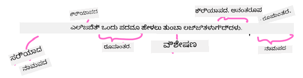

<!--
CO_OP_TRANSLATOR_METADATA:
{
  "original_hash": "5f3cb462e3122e1afe7ab0050ccf2bd3",
  "translation_date": "2025-12-19T14:35:17+00:00",
  "source_file": "6-NLP/2-Tasks/README.md",
  "language_code": "kn"
}
-->
# ಸಾಮಾನ್ಯ ನೈಸರ್ಗಿಕ ಭಾಷಾ ಪ್ರಕ್ರಿಯೆ ಕಾರ್ಯಗಳು ಮತ್ತು ತಂತ್ರಗಳು

ಬಹುತೇಕ *ನೈಸರ್ಗಿಕ ಭಾಷಾ ಪ್ರಕ್ರಿಯೆ* ಕಾರ್ಯಗಳಿಗೆ, ಪ್ರಕ್ರಿಯೆಗೊಳಿಸಬೇಕಾದ ಪಠ್ಯವನ್ನು ವಿಭಜಿಸಿ, ಪರಿಶೀಲಿಸಿ, ಮತ್ತು ಫಲಿತಾಂಶಗಳನ್ನು ನಿಯಮಗಳು ಮತ್ತು ಡೇಟಾ ಸೆಟ್‌ಗಳೊಂದಿಗೆ ಸಂಗ್ರಹಿಸಬೇಕು ಅಥವಾ ಕ್ರಾಸ್ ರೆಫರೆನ್ಸ್ ಮಾಡಬೇಕು. ಈ ಕಾರ್ಯಗಳು, ಪ್ರೋಗ್ರಾಮರ್‌ಗೆ ಪಠ್ಯದ _ಅರ್ಥ_ ಅಥವಾ _ಉದ್ದೇಶ_ ಅಥವಾ ಕೇವಲ ಪದಗಳ ಮತ್ತು ಪದಗಳ _ಆವರ್ತನ_ ಅನ್ನು ಪಡೆಯಲು ಅನುಮತಿಸುತ್ತವೆ.

## [ಪೂರ್ವ-ವ್ಯಾಖ್ಯಾನ ಕ್ವಿಜ್](https://ff-quizzes.netlify.app/en/ml/)

ಪಠ್ಯವನ್ನು ಪ್ರಕ್ರಿಯೆಗೊಳಿಸುವ ಸಾಮಾನ್ಯ ತಂತ್ರಗಳನ್ನು ಕಂಡುಹಿಡಿಯೋಣ. ಯಂತ್ರ ಅಧ್ಯಯನದೊಂದಿಗೆ ಸಂಯೋಜಿಸಿದಾಗ, ಈ ತಂತ್ರಗಳು ನಿಮಗೆ ದೊಡ್ಡ ಪ್ರಮಾಣದ ಪಠ್ಯವನ್ನು ಪರಿಣಾಮಕಾರಿಯಾಗಿ ವಿಶ್ಲೇಷಿಸಲು ಸಹಾಯ ಮಾಡುತ್ತವೆ. ಈ ಕಾರ್ಯಗಳಿಗೆ ML ಅನ್ವಯಿಸುವ ಮೊದಲು, NLP ತಜ್ಞನು ಎದುರಿಸುವ ಸಮಸ್ಯೆಗಳನ್ನು ತಿಳಿದುಕೊಳ್ಳೋಣ.

## NLP ಗೆ ಸಾಮಾನ್ಯವಾದ ಕಾರ್ಯಗಳು

ನೀವು ಕೆಲಸ ಮಾಡುತ್ತಿರುವ ಪಠ್ಯವನ್ನು ವಿಶ್ಲೇಷಿಸುವ ವಿವಿಧ ವಿಧಾನಗಳಿವೆ. ನೀವು ನಿರ್ವಹಿಸಬಹುದಾದ ಕಾರ್ಯಗಳಿವೆ ಮತ್ತು ಈ ಕಾರ್ಯಗಳ ಮೂಲಕ ನೀವು ಪಠ್ಯದ ಅರ್ಥವನ್ನು ಅರ್ಥಮಾಡಿಕೊಳ್ಳಲು ಮತ್ತು ನಿರ್ಣಯಗಳನ್ನು ತೆಗೆದುಕೊಳ್ಳಲು ಸಾಧ್ಯವಾಗುತ್ತದೆ. ನೀವು ಸಾಮಾನ್ಯವಾಗಿ ಈ ಕಾರ್ಯಗಳನ್ನು ಕ್ರಮವಾಗಿ ನಿರ್ವಹಿಸುತ್ತೀರಿ.

### ಟೋಕನೈಜೆಷನ್

ಬಹುಶಃ ಬಹುತೇಕ NLP ಅಲ್ಗಾರಿದಮ್‌ಗಳು ಮೊದಲಿಗೆ ಪಠ್ಯವನ್ನು ಟೋಕನ್‌ಗಳಾಗಿ ಅಥವಾ ಪದಗಳಾಗಿ ವಿಭಜಿಸಬೇಕಾಗುತ್ತದೆ. ಇದು ಸರಳವಾಗಿ ಕೇಳಿದರೂ, ವ್ಯಾಕರಣ ಚಿಹ್ನೆಗಳು ಮತ್ತು ವಿಭಿನ್ನ ಭಾಷೆಗಳ ಪದ ಮತ್ತು ವಾಕ್ಯ ವಿಭಾಜಕಗಳನ್ನು ಗಮನದಲ್ಲಿಟ್ಟುಕೊಳ್ಳಬೇಕಾಗುತ್ತದೆ, ಇದು ಸಂಕೀರ್ಣವಾಗಬಹುದು. ನೀವು ವಿಭಜನೆಗಳನ್ನು ನಿರ್ಧರಿಸಲು ವಿವಿಧ ವಿಧಾನಗಳನ್ನು ಬಳಸಬೇಕಾಗಬಹುದು.


> **Pride and Prejudice** ನಿಂದ ವಾಕ್ಯವನ್ನು ಟೋಕನೈಸ್ ಮಾಡಲಾಗಿದೆ. ಇನ್ಫೋಗ್ರಾಫಿಕ್ [ಜೆನ್ ಲೂಪರ್](https://twitter.com/jenlooper) ಅವರಿಂದ

### ಎम्बೆಡ್ಡಿಂಗ್ಸ್

[ಪದ ಎम्बೆಡ್ಡಿಂಗ್ಸ್](https://wikipedia.org/wiki/Word_embedding) ನಿಮ್ಮ ಪಠ್ಯ ಡೇಟಾವನ್ನು ಸಂಖ್ಯಾತ್ಮಕವಾಗಿ ಪರಿವರ್ತಿಸುವ ವಿಧಾನವಾಗಿದೆ. ಎम्बೆಡ್ಡಿಂಗ್ಸ್ ಅನ್ನು ಈ ರೀತಿಯಲ್ಲಿ ಮಾಡಲಾಗುತ್ತದೆ, ಅಂದರೆ ಸಮಾನ ಅರ್ಥವಿರುವ ಪದಗಳು ಅಥವಾ ಜೊತೆಯಾಗಿ ಬಳಸಲಾಗುವ ಪದಗಳು ಗುಂಪು formed ಮಾಡುತ್ತವೆ.


> "ನಿಮ್ಮ ನರಗಳಿಗೆ ನನಗೆ ಅತ್ಯಂತ ಗೌರವವಿದೆ, ಅವು ನನ್ನ ಹಳೆಯ ಸ್ನೇಹಿತರು." - **Pride and Prejudice** ನ ವಾಕ್ಯಕ್ಕೆ ಪದ ಎम्बೆಡ್ಡಿಂಗ್ಸ್. ಇನ್ಫೋಗ್ರಾಫಿಕ್ [ಜೆನ್ ಲೂಪರ್](https://twitter.com/jenlooper) ಅವರಿಂದ

✅ ಪದ ಎम्बೆಡ್ಡಿಂಗ್ಸ್ ಅನ್ನು ಪ್ರಯೋಗಿಸಲು [ಈ ರೋಚಕ ಸಾಧನವನ್ನು](https://projector.tensorflow.org/) ಪ್ರಯತ್ನಿಸಿ. ಒಂದು ಪದವನ್ನು ಕ್ಲಿಕ್ ಮಾಡಿದಾಗ ಸಮಾನ ಪದಗಳ ಗುಂಪುಗಳು ತೋರಿಸಲಾಗುತ್ತದೆ: 'toy' 'disney', 'lego', 'playstation', ಮತ್ತು 'console' ಜೊತೆಗೆ ಗುಂಪು formed ಮಾಡುತ್ತದೆ.

### ಪಾರ್ಸಿಂಗ್ ಮತ್ತು ಭಾಗ-ಭಾಷಾ ಟ್ಯಾಗಿಂಗ್

ಪ್ರತಿ ಟೋಕನೈಸ್ ಮಾಡಿದ ಪದವನ್ನು ಭಾಷೆಯ ಭಾಗವಾಗಿ ಟ್ಯಾಗ್ ಮಾಡಬಹುದು - ನಾಮಪದ, ಕ್ರಿಯಾಪದ, ಅಥವಾ ವಿಶೇಷಣ. ವಾಕ್ಯ `the quick red fox jumped over the lazy brown dog` ಅನ್ನು POS ಟ್ಯಾಗ್ ಮಾಡಿದರೆ fox = ನಾಮಪದ, jumped = ಕ್ರಿಯಾಪದ ಎಂದು ಇರಬಹುದು.



> **Pride and Prejudice** ನಿಂದ ವಾಕ್ಯವನ್ನು ಪಾರ್ಸ್ ಮಾಡಲಾಗಿದೆ. ಇನ್ಫೋಗ್ರಾಫಿಕ್ [ಜೆನ್ ಲೂಪರ್](https://twitter.com/jenlooper) ಅವರಿಂದ

ಪಾರ್ಸಿಂಗ್ ಎಂದರೆ ವಾಕ್ಯದಲ್ಲಿ ಯಾವ ಪದಗಳು ಪರಸ್ಪರ ಸಂಬಂಧ ಹೊಂದಿವೆ ಎಂದು ಗುರುತಿಸುವುದು - ಉದಾಹರಣೆಗೆ `the quick red fox jumped` ಒಂದು ವಿಶೇಷಣ-ನಾಮಪದ-ಕ್ರಿಯಾಪದ ಕ್ರಮವಾಗಿದ್ದು, ಇದು `lazy brown dog` ಕ್ರಮದಿಂದ ವಿಭಿನ್ನವಾಗಿದೆ.

### ಪದ ಮತ್ತು ವಾಕ್ಯांश ಆವರ್ತನೆಗಳು

ದೊಡ್ಡ ಪಠ್ಯವನ್ನು ವಿಶ್ಲೇಷಿಸುವಾಗ ಉಪಯುಕ್ತ ವಿಧಾನವೆಂದರೆ ಪ್ರತಿಯೊಂದು ಪದ ಅಥವಾ ಆಸಕ್ತಿಯ ವಾಕ್ಯಾಂಶದ ಡಿಕ್ಷನರಿ ನಿರ್ಮಿಸಿ, ಅದು ಎಷ್ಟು ಬಾರಿ ಕಾಣಿಸುತ್ತದೆ ಎಂದು ಎಣಿಸುವುದು. ವಾಕ್ಯ `the quick red fox jumped over the lazy brown dog` ನಲ್ಲಿ 'the' ಪದದ ಆವರ್ತನೆ 2 ಆಗಿದೆ.

ನಾವು ಪದಗಳ ಆವರ್ತನೆಯನ್ನು ಎಣಿಸುವ ಉದಾಹರಣೆಯ ಪಠ್ಯವನ್ನು ನೋಡೋಣ. ರುದ್ಯಾರ್ಡ್ ಕಿಪ್ಲಿಂಗ್ ಅವರ ಕವಿತೆ The Winners ನಲ್ಲಿ ಕೆಳಗಿನ ಪದ್ಯವಿದೆ:

```output
What the moral? Who rides may read.
When the night is thick and the tracks are blind
A friend at a pinch is a friend, indeed,
But a fool to wait for the laggard behind.
Down to Gehenna or up to the Throne,
He travels the fastest who travels alone.
```

ವಾಕ್ಯಾಂಶ ಆವರ್ತನೆಗಳು ಕೇಸ್-ಅಸಂವೇದನಶೀಲ ಅಥವಾ ಕೇಸ್-ಸಂವೇದನಶೀಲವಾಗಿರಬಹುದು, ಉದಾಹರಣೆಗೆ `a friend` ವಾಕ್ಯಾಂಶದ ಆವರ್ತನೆ 2 ಆಗಿದ್ದು, `the` ಆವರ್ತನೆ 6 ಆಗಿದೆ, ಮತ್ತು `travels` 2 ಆಗಿದೆ.

### ಎನ್-ಗ್ರಾಮ್ಸ್

ಪಠ್ಯವನ್ನು ನಿಗದಿತ ಉದ್ದದ ಪದಗಳ ಸರಣಿಗಳಾಗಿ ವಿಭಜಿಸಬಹುದು, ಒಂದು ಪದ (ಯುನಿಗ್ರಾಮ್), ಎರಡು ಪದಗಳು (ಬಿಗ್ರಾಮ್), ಮೂರು ಪದಗಳು (ಟ್ರಿಗ್ರಾಮ್) ಅಥವಾ ಯಾವುದೇ ಸಂಖ್ಯೆಯ ಪದಗಳು (ಎನ್-ಗ್ರಾಮ್).

ಉದಾಹರಣೆಗೆ `the quick red fox jumped over the lazy brown dog` ನ 2-ಗ್ರಾಮ್ ಅಂಕೆ ಈ ಕೆಳಗಿನ ಎನ್-ಗ್ರಾಮ್‌ಗಳನ್ನು ಉತ್ಪಾದಿಸುತ್ತದೆ:

1. the quick 
2. quick red 
3. red fox
4. fox jumped 
5. jumped over 
6. over the 
7. the lazy 
8. lazy brown 
9. brown dog

ಇದನ್ನು ವಾಕ್ಯದ ಮೇಲೆ ಸ್ಲೈಡಿಂಗ್ ಬಾಕ್ಸ್ ಆಗಿ ದೃಶ್ಯೀಕರಿಸುವುದು ಸುಲಭವಾಗಬಹುದು. ಇಲ್ಲಿ 3 ಪದಗಳ ಎನ್-ಗ್ರಾಮ್‌ಗಳಿಗಾಗಿ, ಪ್ರತಿ ವಾಕ್ಯದಲ್ಲಿ ಎನ್-ಗ್ರಾಮ್ ಬೋಲ್ಡ್ ಆಗಿದೆ:

1.   <u>**the quick red**</u> fox jumped over the lazy brown dog
2.   the **<u>quick red fox</u>** jumped over the lazy brown dog
3.   the quick **<u>red fox jumped</u>** over the lazy brown dog
4.   the quick red **<u>fox jumped over</u>** the lazy brown dog
5.   the quick red fox **<u>jumped over the</u>** lazy brown dog
6.   the quick red fox jumped **<u>over the lazy</u>** brown dog
7.   the quick red fox jumped over <u>**the lazy brown**</u> dog
8.   the quick red fox jumped over the **<u>lazy brown dog</u>**


> ಎನ್-ಗ್ರಾಮ್ ಮೌಲ್ಯ 3: ಇನ್ಫೋಗ್ರಾಫಿಕ್ [ಜೆನ್ ಲೂಪರ್](https://twitter.com/jenlooper) ಅವರಿಂದ

### ನಾಮಪದ ವಾಕ್ಯಾಂಶ ಹೊರತೆಗೆಯುವುದು

ಬಹುತೇಕ ವಾಕ್ಯಗಳಲ್ಲಿ, ನಾಮಪದವು ವಿಷಯ ಅಥವಾ ವಸ್ತುವಾಗಿರುತ್ತದೆ. ಇಂಗ್ಲಿಷ್‌ನಲ್ಲಿ, ಇದು ಸಾಮಾನ್ಯವಾಗಿ 'a' ಅಥವಾ 'an' ಅಥವಾ 'the' ಮುಂಚಿತವಾಗಿರುವುದರಿಂದ ಗುರುತಿಸಬಹುದು. ವಾಕ್ಯದ ಅರ್ಥವನ್ನು ಅರ್ಥಮಾಡಿಕೊಳ್ಳಲು ಪ್ರಯತ್ನಿಸುವಾಗ 'ನಾಮಪದ ವಾಕ್ಯಾಂಶವನ್ನು ಹೊರತೆಗೆಯುವುದು' NLP ನಲ್ಲಿ ಸಾಮಾನ್ಯ ಕಾರ್ಯವಾಗಿದೆ.

✅ "I cannot fix on the hour, or the spot, or the look or the words, which laid the foundation. It is too long ago. I was in the middle before I knew that I had begun." ಎಂಬ ವಾಕ್ಯದಲ್ಲಿ, ನೀವು ನಾಮಪದ ವಾಕ್ಯಾಂಶಗಳನ್ನು ಗುರುತಿಸಬಹುದೇ?

`the quick red fox jumped over the lazy brown dog` ವಾಕ್ಯದಲ್ಲಿ 2 ನಾಮಪದ ವಾಕ್ಯಾಂಶಗಳಿವೆ: **quick red fox** ಮತ್ತು **lazy brown dog**.

### ಭಾವನಾತ್ಮಕ ವಿಶ್ಲೇಷಣೆ

ವಾಕ್ಯ ಅಥವಾ ಪಠ್ಯವನ್ನು ಭಾವನೆಗಾಗಿ ವಿಶ್ಲೇಷಿಸಬಹುದು, ಅದು *ಧನಾತ್ಮಕ* ಅಥವಾ *ನಕಾರಾತ್ಮಕ* ಆಗಿದೆಯೇ ಎಂದು. ಭಾವನೆ *ಧ್ರುವೀಯತೆ* ಮತ್ತು *ವಸ್ತುನಿಷ್ಠತೆ/ವಿಷಯನಿಷ್ಠತೆ* ನಲ್ಲಿ ಅಳೆಯಲಾಗುತ್ತದೆ. ಧ್ರುವೀಯತೆ -1.0 ರಿಂದ 1.0 (ನಕಾರಾತ್ಮಕದಿಂದ ಧನಾತ್ಮಕ) ಮತ್ತು 0.0 ರಿಂದ 1.0 (ಅತ್ಯಂತ ವಸ್ತುನಿಷ್ಠದಿಂದ ಅತ್ಯಂತ ವಿಷಯನಿಷ್ಠ) ಅಳೆಯಲಾಗುತ್ತದೆ.

✅ ನಂತರ ನೀವು ಯಂತ್ರ ಅಧ್ಯಯನ ಬಳಸಿ ಭಾವನೆಯನ್ನು ನಿರ್ಧರಿಸುವ ವಿವಿಧ ವಿಧಾನಗಳನ್ನು ಕಲಿಯುತ್ತೀರಿ, ಆದರೆ ಒಂದು ವಿಧಾನವೆಂದರೆ ಮಾನವ ತಜ್ಞರಿಂದ ಧನಾತ್ಮಕ ಅಥವಾ ನಕಾರಾತ್ಮಕ ಎಂದು ವರ್ಗೀಕರಿಸಲಾದ ಪದಗಳು ಮತ್ತು ವಾಕ್ಯಾಂಶಗಳ ಪಟ್ಟಿ ಹೊಂದಿ, ಆ ಮಾದರಿಯನ್ನು ಪಠ್ಯಕ್ಕೆ ಅನ್ವಯಿಸಿ ಧ್ರುವೀಯತೆ ಅಂಕೆಯನ್ನು ಲೆಕ್ಕಿಸಬಹುದು. ಕೆಲವು ಸಂದರ್ಭಗಳಲ್ಲಿ ಇದು ಹೇಗೆ ಕೆಲಸ ಮಾಡಬಹುದು ಮತ್ತು ಕೆಲವು ಸಂದರ್ಭಗಳಲ್ಲಿ ಕಡಿಮೆ ಪರಿಣಾಮಕಾರಿಯಾಗಬಹುದು ಎಂದು ನೀವು ನೋಡಬಹುದೇ?

### ರೂಪಾಂತರ

ರೂಪಾಂತರವು ನಿಮಗೆ ಒಂದು ಪದವನ್ನು singular ಅಥವಾ plural ರೂಪದಲ್ಲಿ ಪಡೆಯಲು ಸಹಾಯ ಮಾಡುತ್ತದೆ.

### ಲೆಮಟೈಜೆಷನ್

*ಲೆಮ್ಮಾ* ಎಂದರೆ ಪದಗಳ ಗುಂಪಿಗೆ ಮೂಲ ಅಥವಾ ಮುಖ್ಯ ಪದ, ಉದಾಹರಣೆಗೆ *flew*, *flies*, *flying* ಗಳ ಲೆಮ್ಮಾ ಕ್ರಿಯಾಪದ *fly* ಆಗಿದೆ.

NLP ಸಂಶೋಧಕರಿಗೆ ಉಪಯುಕ್ತವಾದ ಡೇಟಾಬೇಸ್‌ಗಳು ಕೂಡ ಲಭ್ಯವಿವೆ, ವಿಶೇಷವಾಗಿ:

### ವರ್ಡ್‌ನೆಟ್

[WordNet](https://wordnet.princeton.edu/) ಪದಗಳು, ಸಮಾನಾರ್ಥಕಗಳು, ವಿರುದ್ಧಾರ್ಥಕಗಳು ಮತ್ತು ವಿವಿಧ ಭಾಷೆಗಳ ಪ್ರತಿಯೊಂದು ಪದಕ್ಕೆ ಅನೇಕ ವಿವರಗಳ ಡೇಟಾಬೇಸ್ ಆಗಿದೆ. ಅನುವಾದಗಳು, ಸ್ಪೆಲ್ ಚೆಕ್‌ಗಳು ಅಥವಾ ಯಾವುದೇ ರೀತಿಯ ಭಾಷಾ ಸಾಧನಗಳನ್ನು ನಿರ್ಮಿಸುವಾಗ ಇದು ಅತ್ಯಂತ ಉಪಯುಕ್ತವಾಗಿದೆ.

## NLP ಗ್ರಂಥಾಲಯಗಳು

ಸೌಭಾಗ್ಯವಶಾತ್, ನೀವು ಈ ಎಲ್ಲಾ ತಂತ್ರಗಳನ್ನು ಸ್ವತಃ ನಿರ್ಮಿಸಬೇಕಾಗಿಲ್ಲ, ಏಕೆಂದರೆ ನೈಸರ್ಗಿಕ ಭಾಷಾ ಪ್ರಕ್ರಿಯೆ ಅಥವಾ ಯಂತ್ರ ಅಧ್ಯಯನದಲ್ಲಿ ಪರಿಣತಿ ಹೊಂದದ ಅಭಿವೃದ್ಧಿಪಡಿಸುವವರಿಗೆ ಬಹಳ ಸುಲಭವಾಗುವ ಅತ್ಯುತ್ತಮ Python ಗ್ರಂಥಾಲಯಗಳು ಲಭ್ಯವಿವೆ. ಮುಂದಿನ ಪಾಠಗಳಲ್ಲಿ ಇವುಗಳ ಇನ್ನಷ್ಟು ಉದಾಹರಣೆಗಳಿವೆ, ಆದರೆ ಇಲ್ಲಿ ನೀವು ಮುಂದಿನ ಕಾರ್ಯಕ್ಕೆ ಸಹಾಯ ಮಾಡುವ ಕೆಲವು ಉಪಯುಕ್ತ ಉದಾಹರಣೆಗಳನ್ನು ಕಲಿಯುತ್ತೀರಿ.

### ವ್ಯಾಯಾಮ - `TextBlob` ಗ್ರಂಥಾಲಯ ಬಳಕೆ

ಈ ರೀತಿಯ ಕಾರ್ಯಗಳನ್ನು ನಿಭಾಯಿಸಲು ಸಹಾಯಕ API ಗಳನ್ನು ಹೊಂದಿರುವ TextBlob ಎಂಬ ಗ್ರಂಥಾಲಯವನ್ನು ಬಳಸಿ. TextBlob "ದೊಡ್ಡ [NLTK](https://nltk.org) ಮತ್ತು [pattern](https://github.com/clips/pattern) ಗ್ರಂಥಾಲಯಗಳ ಮೇಲೆ ನಿಂತಿದೆ ಮತ್ತು ಎರಡರೊಂದಿಗೆ ಚೆನ್ನಾಗಿ ಕೆಲಸ ಮಾಡುತ್ತದೆ." ಇದರ API ನಲ್ಲಿ ಸಾಕಷ್ಟು ML ಒಳಗೊಂಡಿದೆ.

> ಗಮನಿಸಿ: ಅನುಭವಸಂಪನ್ನ Python ಅಭಿವೃದ್ಧಿಪಡಿಸುವವರಿಗೆ ಶಿಫಾರಸು ಮಾಡಲಾದ TextBlob ಗೆ ಉಪಯುಕ್ತ [ತ್ವರಿತ ಪ್ರಾರಂಭ](https://textblob.readthedocs.io/en/dev/quickstart.html#quickstart) ಮಾರ್ಗದರ್ಶಿ ಲಭ್ಯವಿದೆ

*ನಾಮಪದ ವಾಕ್ಯಾಂಶಗಳನ್ನು* ಗುರುತಿಸಲು ಪ್ರಯತ್ನಿಸುವಾಗ, TextBlob ನಾಮಪದ ವಾಕ್ಯಾಂಶಗಳನ್ನು ಹುಡುಕಲು ಹಲವಾರು ಎಕ್ಸ್ಟ್ರಾಕ್ಟರ್ ಆಯ್ಕೆಗಳನ್ನು ನೀಡುತ್ತದೆ.

1. `ConllExtractor` ಅನ್ನು ನೋಡಿ.

    ```python
    from textblob import TextBlob
    from textblob.np_extractors import ConllExtractor
    # ನಂತರ ಬಳಸಲು Conll ಎಕ್ಸ್ಟ್ರಾಕ್ಟರ್ ಅನ್ನು ಆಮದುಮಾಡಿ ಮತ್ತು ರಚಿಸಿ
    extractor = ConllExtractor()
    
    # ನಂತರ ನೀವು ನಾಮಪದ ವಾಕ್ಯಘಟಕ ಎಕ್ಸ್ಟ್ರಾಕ್ಟರ್ ಬೇಕಾದಾಗ:
    user_input = input("> ")
    user_input_blob = TextBlob(user_input, np_extractor=extractor)  # ಡೀಫಾಲ್ಟ್ ಅಲ್ಲದ ಎಕ್ಸ್ಟ್ರಾಕ್ಟರ್ ಸೂಚಿಸಲಾಗಿದೆ ಎಂದು ಗಮನಿಸಿ
    np = user_input_blob.noun_phrases                                    
    ```

    > ಇಲ್ಲಿ ಏನಾಗುತ್ತಿದೆ? [ConllExtractor](https://textblob.readthedocs.io/en/dev/api_reference.html?highlight=Conll#textblob.en.np_extractors.ConllExtractor) "ConLL-2000 ತರಬೇತಿ ಕಾರ್ಪಸ್ ಬಳಸಿ ಚಂಕ್ ಪಾರ್ಸಿಂಗ್ ಮೂಲಕ ತರಬೇತುಗೊಂಡ ನಾಮಪದ ವಾಕ್ಯಾಂಶ ಎಕ್ಸ್ಟ್ರಾಕ್ಟರ್." ConLL-2000 2000 ರಲ್ಲಿ ನಡೆದ ಕಂಪ್ಯೂಟೇಶನಲ್ ನೈಸರ್ಗಿಕ ಭಾಷಾ ಕಲಿಕೆಯ ಸಮ್ಮೇಳನವನ್ನು ಸೂಚಿಸುತ್ತದೆ. ಪ್ರತಿ ವರ್ಷ ಸಮ್ಮೇಳನವು NLP ಸಮಸ್ಯೆಯನ್ನು ಪರಿಹರಿಸಲು ಕಾರ್ಯಾಗಾರವನ್ನು ಆಯೋಜಿಸಿತು, 2000 ರಲ್ಲಿ ಅದು ನಾಮ ಚಂಕಿಂಗ್ ಆಗಿತ್ತು. ವಾಲ್ ಸ್ಟ್ರೀಟ್ ಜರ್ನಲ್ ಮೇಲೆ ಮಾದರಿಯನ್ನು ತರಬೇತುಗೊಂಡಿತು, "ಸೆಕ್ಷನ್ 15-18 ತರಬೇತಿ ಡೇಟಾ (211727 ಟೋಕನ್ಸ್) ಮತ್ತು ಸೆಕ್ಷನ್ 20 ಪರೀಕ್ಷಾ ಡೇಟಾ (47377 ಟೋಕನ್ಸ್)" ಆಗಿತ್ತು. ನೀವು ಬಳಸದ ವಿಧಾನಗಳನ್ನು [ಇಲ್ಲಿ](https://www.clips.uantwerpen.be/conll2000/chunking/) ಮತ್ತು ಫಲಿತಾಂಶಗಳನ್ನು [ಇಲ್ಲಿ](https://ifarm.nl/erikt/research/np-chunking.html) ನೋಡಬಹುದು.

### ಸವಾಲು - NLP ಬಳಸಿ ನಿಮ್ಮ ಬಾಟ್ ಅನ್ನು ಸುಧಾರಿಸುವುದು

ಹಿಂದಿನ ಪಾಠದಲ್ಲಿ ನೀವು ಬಹಳ ಸರಳ Q&A ಬಾಟ್ ನಿರ್ಮಿಸಿದ್ದೀರಿ. ಈಗ, ನೀವು ಮಾರ್ವಿನ್ ಅನ್ನು ಸ್ವಲ್ಪ ಹೆಚ್ಚು ಸಹಾನುಭೂತಿಪರನಾಗಿಸಲು ನಿಮ್ಮ ಇನ್ಪುಟ್‌ನ ಭಾವನೆಯನ್ನು ವಿಶ್ಲೇಷಿಸಿ ಮತ್ತು ಭಾವನೆಗೆ ಹೊಂದಿಕೆಯಾಗುವ ಪ್ರತಿಕ್ರಿಯೆಯನ್ನು ಮುದ್ರಿಸುವಿರಿ. ನೀವು `noun_phrase` ಅನ್ನು ಗುರುತಿಸಿ ಅದನ್ನು ಕುರಿತು ಇನ್ನಷ್ಟು ಇನ್ಪುಟ್ ಕೇಳಬೇಕಾಗುತ್ತದೆ.

ಉತ್ತಮ ಸಂಭಾಷಣಾ ಬಾಟ್ ನಿರ್ಮಿಸುವ ನಿಮ್ಮ ಹಂತಗಳು:

1. ಬಳಕೆದಾರರಿಗೆ ಬಾಟ್ ಜೊತೆ ಹೇಗೆ ಸಂವಹನ ಮಾಡಬೇಕೆಂದು ಸೂಚನೆಗಳನ್ನು ಮುದ್ರಿಸಿ
2. ಲೂಪ್ ಪ್ರಾರಂಭಿಸಿ
   1. ಬಳಕೆದಾರ ಇನ್ಪುಟ್ ಸ್ವೀಕರಿಸಿ
   2. ಬಳಕೆದಾರನಿಂದ ನಿರ್ಗಮನ ಕೇಳಿದರೆ, ನಿರ್ಗಮಿಸಿ
   3. ಬಳಕೆದಾರ ಇನ್ಪುಟ್ ಪ್ರಕ್ರಿಯೆ ಮಾಡಿ ಮತ್ತು ಸೂಕ್ತ ಭಾವನೆ ಪ್ರತಿಕ್ರಿಯೆಯನ್ನು ನಿರ್ಧರಿಸಿ
   4. ಭಾವನೆಯಲ್ಲಿ ನಾಮಪದ ವಾಕ್ಯಾಂಶ ಕಂಡುಬಂದರೆ, ಅದನ್ನು ಬಹುವಚನ ಮಾಡಿ ಮತ್ತು ಆ ವಿಷಯದ ಬಗ್ಗೆ ಇನ್ನಷ್ಟು ಇನ್ಪುಟ್ ಕೇಳಿ
   5. ಪ್ರತಿಕ್ರಿಯೆಯನ್ನು ಮುದ್ರಿಸಿ
3. ಹಂತ 2 ಗೆ ಮರುಹೊಂದಿಸಿ

TextBlob ಬಳಸಿ ಭಾವನೆ ನಿರ್ಧರಿಸುವ ಕೋಡ್ ತುಣುಕು ಇಲ್ಲಿದೆ. ಭಾವನೆ ಪ್ರತಿಕ್ರಿಯೆಯ ನಾಲ್ಕು *ಗ್ರೇಡಿಯಂಟ್* ಮಾತ್ರಗಳಿವೆ (ನೀವು ಹೆಚ್ಚು ಇರಿಸಬಹುದು):

```python
if user_input_blob.polarity <= -0.5:
  response = "Oh dear, that sounds bad. "
elif user_input_blob.polarity <= 0:
  response = "Hmm, that's not great. "
elif user_input_blob.polarity <= 0.5:
  response = "Well, that sounds positive. "
elif user_input_blob.polarity <= 1:
  response = "Wow, that sounds great. "
```

ನಿಮಗೆ ಮಾರ್ಗದರ್ಶನ ನೀಡಲು ಕೆಲವು ಉದಾಹರಣಾ ಔಟ್‌ಪುಟ್ ಇಲ್ಲಿದೆ (ಬಳಕೆದಾರ ಇನ್ಪುಟ್ > ಚಿಹ್ನೆಯಿಂದ ಪ್ರಾರಂಭವಾಗುತ್ತದೆ):

```output
Hello, I am Marvin, the friendly robot.
You can end this conversation at any time by typing 'bye'
After typing each answer, press 'enter'
How are you today?
> I am ok
Well, that sounds positive. Can you tell me more?
> I went for a walk and saw a lovely cat
Well, that sounds positive. Can you tell me more about lovely cats?
> cats are the best. But I also have a cool dog
Wow, that sounds great. Can you tell me more about cool dogs?
> I have an old hounddog but he is sick
Hmm, that's not great. Can you tell me more about old hounddogs?
> bye
It was nice talking to you, goodbye!
```

ಕಾರ್ಯಕ್ಕೆ ಒಂದು ಸಾಧ್ಯ ಪರಿಹಾರ [ಇಲ್ಲಿ](https://github.com/microsoft/ML-For-Beginners/blob/main/6-NLP/2-Tasks/solution/bot.py) ಇದೆ

✅ ಜ್ಞಾನ ಪರಿಶೀಲನೆ

1. ಸಹಾನುಭೂತಿಪರ ಪ್ರತಿಕ್ರಿಯೆಗಳು ಯಾರನ್ನಾದರೂ ಬಾಟ್ ಅವರನ್ನು ನಿಜವಾಗಿಯೂ ಅರ್ಥಮಾಡಿಕೊಂಡಿದೆ ಎಂದು 'ಮೋಸಗೊಳಿಸುವುದೇ' ಎಂದು ನೀವು ಭಾವಿಸುತ್ತೀರಾ?
2. ನಾಮಪದ ವಾಕ್ಯಾಂಶವನ್ನು ಗುರುತಿಸುವುದು ಬಾಟ್ ಅನ್ನು ಹೆಚ್ಚು 'ನಂಬಬಹುದಾದ' ಮಾಡುತ್ತದೆಯೇ?
3. ವಾಕ್ಯದಿಂದ 'ನಾಮಪದ ವಾಕ್ಯಾಂಶ' ಹೊರತೆಗೆಯುವುದು ಉಪಯುಕ್ತವಾದದ್ದು ಏಕೆ?

---

ಹಿಂದಿನ ಜ್ಞಾನ ಪರಿಶೀಲನೆಯಲ್ಲಿ ಬಾಟ್ ಅನ್ನು ಅನುಷ್ಠಾನಗೊಳಿಸಿ ಮತ್ತು ಸ್ನೇಹಿತನ ಮೇಲೆ ಪರೀಕ್ಷಿಸಿ. ಅದು ಅವರನ್ನು ಮೋಸಗೊಳಿಸಬಹುದೇ? ನೀವು ನಿಮ್ಮ ಬಾಟ್ ಅನ್ನು ಹೆಚ್ಚು 'ನಂಬಬಹುದಾದ' ಮಾಡಬಹುದೇ?

## 🚀ಸವಾಲು

ಹಿಂದಿನ ಜ್ಞಾನ ಪರಿಶೀಲನೆಯಲ್ಲಿ ಒಂದು ಕಾರ್ಯವನ್ನು ತೆಗೆದುಕೊಂಡು ಅದನ್ನು ಅನುಷ್ಠಾನಗೊಳಿಸಿ. ಬಾಟ್ ಅನ್ನು ಸ್ನೇಹಿತನ ಮೇಲೆ ಪರೀಕ್ಷಿಸಿ. ಅದು ಅವರನ್ನು ಮೋಸಗೊಳಿಸಬಹುದೇ? ನೀವು ನಿಮ್ಮ ಬಾಟ್ ಅನ್ನು ಹೆಚ್ಚು 'ನಂಬಬಹುದಾದ' ಮಾಡಬಹುದೇ?

## [ಪೋಸ್ಟ್-ವ್ಯಾಖ್ಯಾನ ಕ್ವಿಜ್](https://ff-quizzes.netlify.app/en/ml/)

## ವಿಮರ್ಶೆ ಮತ್ತು ಸ್ವಯಂ ಅಧ್ಯಯನ

ಮುಂದಿನ ಕೆಲವು ಪಾಠಗಳಲ್ಲಿ ನೀವು ಭಾವನಾತ್ಮಕ ವಿಶ್ಲೇಷಣೆಯ ಬಗ್ಗೆ ಇನ್ನಷ್ಟು ಕಲಿಯುತ್ತೀರಿ. ಈ ರೋಚಕ ತಂತ್ರವನ್ನು [KDNuggets](https://www.kdnuggets.com/tag/nlp) ನಲ್ಲಿ ಇರುವ ಲೇಖನಗಳಲ್ಲಿ ಸಂಶೋಧಿಸಿ.

## ನಿಯೋಜನೆ

[ಬಾಟ್ ಅನ್ನು ಮಾತಾಡಿಸಲು ಮಾಡಿ](assignment.md)

---

<!-- CO-OP TRANSLATOR DISCLAIMER START -->
**ಅಸ್ವೀಕರಣ**:  
ಈ ದಸ್ತಾವೇಜು [Co-op Translator](https://github.com/Azure/co-op-translator) ಎಂಬ AI ಅನುವಾದ ಸೇವೆಯನ್ನು ಬಳಸಿ ಅನುವಾದಿಸಲಾಗಿದೆ. ನಾವು ಶುದ್ಧತೆಯತ್ತ ಪ್ರಯತ್ನಿಸುತ್ತಿದ್ದರೂ, ಸ್ವಯಂಚಾಲಿತ ಅನುವಾದಗಳಲ್ಲಿ ತಪ್ಪುಗಳು ಅಥವಾ ಅಸತ್ಯತೆಗಳು ಇರಬಹುದು ಎಂದು ದಯವಿಟ್ಟು ಗಮನಿಸಿ. ಮೂಲ ಭಾಷೆಯಲ್ಲಿರುವ ಮೂಲ ದಸ್ತಾವೇಜನ್ನು ಅಧಿಕೃತ ಮೂಲವಾಗಿ ಪರಿಗಣಿಸಬೇಕು. ಮಹತ್ವದ ಮಾಹಿತಿಗಾಗಿ, ವೃತ್ತಿಪರ ಮಾನವ ಅನುವಾದವನ್ನು ಶಿಫಾರಸು ಮಾಡಲಾಗುತ್ತದೆ. ಈ ಅನುವಾದ ಬಳಕೆಯಿಂದ ಉಂಟಾಗುವ ಯಾವುದೇ ತಪ್ಪು ಅರ್ಥಮಾಡಿಕೊಳ್ಳುವಿಕೆ ಅಥವಾ ತಪ್ಪು ವಿವರಣೆಗಳಿಗೆ ನಾವು ಹೊಣೆಗಾರರಾಗುವುದಿಲ್ಲ.
<!-- CO-OP TRANSLATOR DISCLAIMER END -->